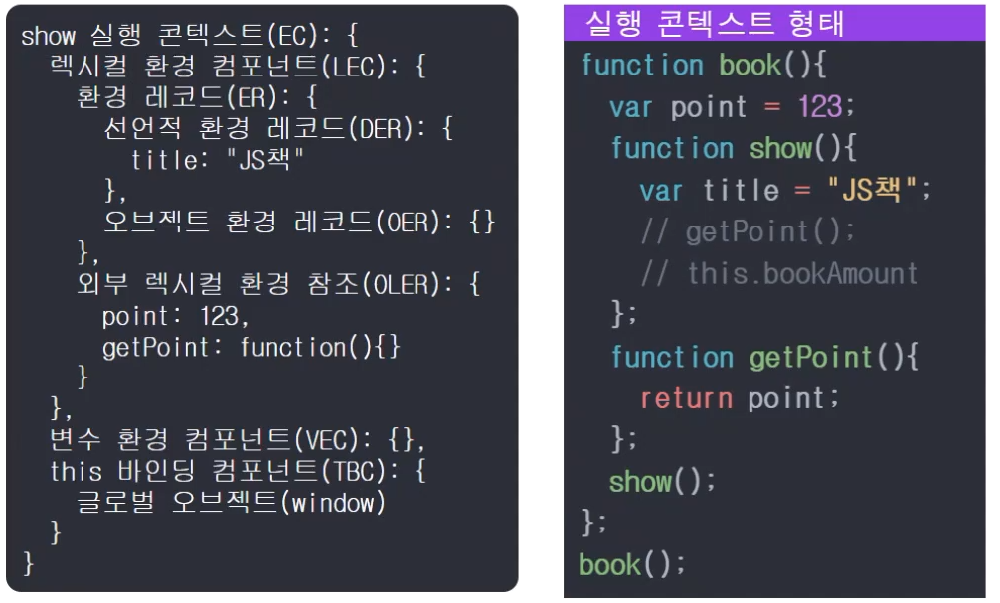

# 🌟자바스크립트 개념 정리하기 (중고급)🌟

## 엔진 관점의 핵심 키워드

Execution context (묶어서 실행)

Identifier Resolution (식별자 해결)

## Execution Context 형태

Context는 묶음, 하나의 덩어리라고 본다. <br/>



book() 함수가 호출되면

- function show()와 만나면서 show Function 오브젝트를 생성한다
- show의 [[scope]]에 스코프 설정
- [[scope]]는 JS엔진에 의해 만들어지는 스코프(범위)를 의미한다.

<br/>

show() 함수가 호출되면 EC(Execute Context) 환경을 구축한다.

- LEC, VEC, TBC 생성 첨부
- LEC에 ER, OLER 첨부
- ER에 DER, OER 첨부

<bt/>

DER에 show()의 변수, 함수를 기록한다 <br/>
OLER에 show의 [[scope]]를 설정<br/>
this 바인딩 컴포넌트에 this 참조 설정

```js
function book() {
  // 2. Function 오브젝트에 의해 book(){....} 내부의 코드들은 모두 같은 스코프에 존재하게 됨 (show() 함수가 속해있는 영역)
  // 3. 따라서 point를 getPoint() 함수에서 참조하여 사용할 수 있게 됨
  var point = 123;
  function show() {
    // 1. function 키워드를 만나면서 Function 오브젝트를 생성
    var title = 'JS책';
    // getPoint();   4. 주석처리 되어 있지만, 같은 스코프에 있기 때문에 getPoint() 함수를 show() 함수 내부에서 사용할 수 있다.
    // this.bookAmount;
  }
  function getPoint() {
    return point;
  }
  show();
}
book();

/*
1. 처음 JS 엔진은 해당 코드(boook())가 호출되기 전까지는 function book(){...} 함수가 선언되었다는 것만 인지하고 값을 넣지 않는다.
2. book() 함수가 호출되었을 때 비로소 function book(){...} 안의 코드를 읽기 시작한다.
3. point 변수를 선언한다.
4. function 키워드를 만나므로 show()라는 이름은 가진 Function 오브젝트를 생성한다.
5. Function 오브젝트를 생성했기 때문에, 해당 함수가 있는 { ... } 코드를 스코프로 설정한다.
6. 따라서 같은 스코프 안에 있는 함수와 변수는 불러와 사용할 수 있게 되었다.
*/
```

<hr/>

## 식별자 해결, 스코프 용도

### 식별자 해결

Identifier Resolution

```js
var point = 100;
function getPoint(){
  var point = 200;
  return point;
};
var result = getPoint();
console.log(result);

>>>
200

/*
var point = 100; 이 있음에도 result 값이 200을 반환하는 이유는
1. getPoint() 함수를 호출함에 따라 생긴 Function 오브젝트에 속해있는 스코프를 먼저 찾기 때문이다.
2. var point = 200; 이 같은 스코프 내인 getPoint(){ ... } 내부에 설정되지 않았다면 100을 뽑았을 것이다.
*/
```

- 사용할 변수/함수를 결정하는 것
- 예 : point 변수
- 신속, 정확한 검색을 위해 스코프 필요

<br/>
스코프에서 이름을 찾기 위해
- 스코프에 이름을 설정
- 값은 변경되지만, 이름은 변경되지 않음 [key : value] 중 value만 변경 가능
- 식별자 해결 대상은 이름

### 스코프 용도

식별자 해결을 위한 수단, 방법

- 스코프가 목적이 아니다
  > getPoint()가 호출되어 해당 함수를 통해 구하고자 하는 값인, point를 반환하기 위해 스코프를 설정한 것임

식별자가 유일하면

- 스코프는 필요하지 않음
- 하지만, 유일하게 작성하는 것은 불가능
- 그래서 스코프 필요

## scope chain, 스펙의 scope chain 사용 (x)

## Lexical Environment

### 정적 환경

```js
var point = 123;
function book() {
  function getPoint() {};
}
book();
>>>
123
```

function 키워드를 만나면

- Function 오브젝트를 생성하고
- 스코프를 FO(Function Object)의 [[Scope]]에 설정
- 이것은 함수 밖의 스코프가 설정되는 것

이 시점에서 스코프가 결정됨

- 이것이 Lexical Environment
- 동적이 아닌 수동적(정적)으로 결정된다는 의미

## Node.js 코드 형태
