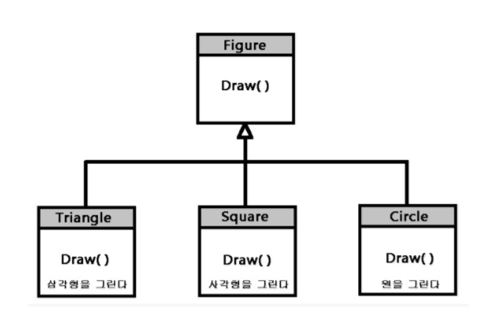

# 🌟자바스크립트 개념 정리하기 (비기너)🌟

# 들어가며

<p>&nbsp;이 책은 컴퓨터 명령에 관한 내용을 다룬다. 오늘날 컴퓨터는 스크류 드라이버만큼 흔하지만 훨씬 더 복잡하며, 컴퓨터가 우리가 원하는 작업을 처리하도록 만드는 일이 쉽지만은 않다.</p>

<p>&nbsp;<b>프로그래밍은 프로그램을 만드는 행위이다.</b> 컴퓨터가 무엇을 해야하는 지 알려주는 구체적인 명령어 집합이다. 대부분의 프로그래밍은 프로그래밍 언어를 사용한다. 프로그래밍 언어는 컴퓨터에게 명령하기 위해 인위적으로 만든 언어이다. 인간의 언어와 마찬가지로 컴퓨터 언어도 단어와 구문을 새로운 방식으로 결합해 새로운 개념을 표현할 수 있다.</p>

<p>&nbsp;<b>프로그램은 여러 가지를 의미한다.</b> 프로그램은 프로그래머가 작성한 텍스트이며, 컴퓨터가 작업을 하도록 지시하는 힘이고, 컴퓨터 메모리에 존재하는 데이터이지만 동일한 메모리상에서 처리되는 작업을 제어한다.</p>

<p>&nbsp;컴퓨터는 물리적인 머신이며, 물리적인 형태가 없는 머신의 호스트 역할을 한다. 컴퓨터 자체는 우직하게 단순한 작업만 수행할 수 있다. 그렇지만 이 컴퓨터가 유용한 이유는 이 같은 작업을 아주 빠른 속도로 처리하기 때문이다. 프로그램은 이 컴퓨터를 사용하여 생각으로 지은 건물이다. 만드는 비용이 들지 않고 무게가 없으며 타이핑하는 손 아래서 쉽게 자란다.</p>

<p>&nbsp;하지만 주의를 기울이지 않으면 프로그램의 크기와 복잡도는 통제할 수 없게 되고 프로그램을 만든 사람조차도 혼동하게 만든다. 프로그램을 통제하는 것이 프로그래밍의 핵심이다. 좋은 프로그램은 복잡도가 낮고 안정적이다. 또한 <b>좋은 프로그램에 대한 감각은 규칙 목록에서 배우는 것이 아니라 실무를 통해 만들어진다.</b></p>

<hr/>

# Chapter 1,자바스크립트란?

<p>&nbsp;자바스크립트는 1995년에 넷스케이프 내비게이터 브라우저의 웹 페이지에 프로그램을 추가하기 위한 방법으로 도입됐다. 그리고 이후 다른 모두 주요 그래픽 웹 브라우저에서 자바스크립트를 채택했다. 이를 통해 모든 동작마다 페이지를 다시 불러오지 않아도 직접 상호작용을 할 수 있는 최신의 웹 애플리케이션을 만들 수 있게 됐다.</p>

<p>&nbsp;<b>자바스크립트는 자바라는 프로그래밍 언어와 관련이 없다.</b> 이처럼 비슷한 이름은 좋은 판단이라고 하기 보다는 마케팅에 관점에서 영향을 받은 것이다.</p>

<p>&nbsp;자바스크립트를 넷스케이프 외부에서도 사용할 수 있게 된 이후에 자바스크립트 동작 방식을 설명하는 표준 문서가 작성됐으며, 자바스크립트를 지원한다고 주장하는 다양한 소프트웨어에서 실제로 동일한 언어를 사용하게 됐다. 이것은 표준화를 수행한 Ecma International 조직의 이름을 따서 ECMAScript 표준이라고 부른다. 실제로 ECMAScript와 자바스크립트라는 용어는 같은 언어의 두 가지 이름이며 서로 바꿔 사용해도 무방하다.</p>

<p>&nbsp;자바스크립트는 엄청나게 자유도가 높다. 하지만 <b>실제로는 시스템에서 문제를 지적하지 않기 때문에 프로그램의 문제를 찾기가 더 어려워진다.</b></p>

<p>&nbsp;그러나 이러한 유연성에는 장점도 존재한다. 좀 더 경직된 언어로는 불가능한 다양한 기법을 사용할 수 있도록 여지를 남겨두어 자바스크립트의 일부 단점을 극복할 때 사용할 수 있다.</p>

<p>&nbsp;자바스크립트가 사용되는 플랫폼이 브라우저만 있는 것은 아니다. MongoDB와 CouchDB 같은 일부 데이터베이스에서는 스크립트와 쿼리 언어로 자바스크립트를 사용한다. 데스크탑과 서버 프로그래밍을 위한 다양한 플랫폼에서 사용할 수 있으며, Node.js 프로젝트에서는 브라우저 외부에서 자바스크립트로 프로그래밍할 수 있는 환경을 제공한다.</p>

## 값

<p>&nbsp;보통의 최신 컴퓨터에는 휘발성 데이터 저장소(동적 메모리)에 300억개 이상의 비트(약 8GB)를 가지고 있다. 비휘발성 저장소(하드 디스크나 동종의 저장소)는 아직 규몽 면에서는 좀 더 강력하다. 이와 같은 대량의 비트를 분실하지 않고 처리하려면 정보의 조각을 나타내는 <b>청크(chunk)</b>로 분리해야 한다. 자바스크립트 환경에서는 이러한 chunk를 <b>값(value)</b>이라고 부른다. 모든 값은 비트로 이뤄지지만 서로 다른 역할을 한다. 모든 값은 역할을 지정하는 타입을 갖는다. </p>

## 숫자

<p>&nbsp;자바스크립트에서는 하나의 숫자 값을 저장하는 데 고정된 64개의 비트를 사용한다. 64비트로 만들 수 있는 패턴은 한정돼 있다. 즉, 표현할 수 있는 여러 가지 수의 개수가 한정된다는 의미이다. N개의 십진수로는 10*(N)만큼의 숫자를 표현할 수 있다. 비슷하게 주어진 64개의 이진수로는 2*(64승) 만큼의 여러 가지 숫자를 표현할 수 있으며, 이는 약 1,800경이다. </p>

<p>&nbsp; 하지만 컴퓨터 메모리는 이보다 훨씬 더 작았었고 사람들은 숫자를 표현하는 데 8이나 16비트 그룹을 사용했었다. 이는 주어진 비트의 수에 맞지 않는 숫자가 되기 쉬웠기 때문에 뜻하지 않게 오버플로우(overflow)가 발생했다. 요즘에는 호주머니에 들어가는 컴퓨터조차 메모리가 많기 때문에 64비트 청크를 자유롭게 사용할 수 있으며 정말 천문학적인 수를 다루는 경우에만 오버플로우를 염려하면 된다.</p>

## 단항연산자

<p>&nbsp;모든 연산자가 심볼은 아니다. 일부는 단어로 구성된다. 한 예로는 typeof 연산자가 있으며 주어진 값의 타입 이름을 문자열 값으로 만든다.</p>

```
console.log(typeof 4.5)
>>> number
```

<p>&nbsp;typeof 연산자는 함수나 메소드가 아닌 연산자이기 때문에 `( )` 와 같은 소괄호로 묶어줄 필요가 없다.</p>

## 빈 값

<p>&nbsp; 여기에 `null`과 `undefined` 이라고 쓰이는 두 개의 특별한 값이 있으며 의미 있는 값이 없음을 표현하는데 사용한다. 그 자체가 값이지만 아무런 정보를 갖지 않는다. 이 언어에서 의미 있는 값을 만들지 못하는 연산에서는 어떤 값이라도 반환해야 하기 때문에 단순히 (어쩔 수 없다는 의미)의 `undefined`를 만든다.</p>

<p>&nbsp; `null`과 `undefined` 사이의 의미상 차이점은 자바스크립트 설계의 우연한 사고이며 대부분의 경우에는 문제가 되지 않는다. 실제로 이러한 값을 고려해야 하는 경우는 대부분 서로 대체가 가능한 것으로 생각하면 된다.</p>

<hr/>

# Chapter 2, 프로그램 구조

> 표현식, 구문 , 부수효과, 바인딩

## 표현식과 구문

<p>&nbsp;1장에서는 새로운 값을 얻기 위해 값을 만들고 연산자를 적용했다. 이러한 값을 만드는 것은 모든 자바스크립트 프로그램의 핵심이다. 하지만 이러한 값이 쓸모 있으려면 더 큰 구조의 틀을 만들어야 한다. 값을 생성하는 코드 조각을 <b>표현식</b>이라고 부른다. 문자 그대로 작성한 모든 값 `(예: 22, "psychoanalysis")`은 표현식이다. 표현식에서는 사람이 사용하는 언어와 유사하게 문장이 중첩되는 방식을 사용해서 다른 표현식을 포함할 수 있다. 이렇게 하면 복잡한 계산을 기술하는 표현식을 원하는 대로 만들 수 있다.</p>

<p>&nbsp;표현식이 문장 조각이라면 자바스크립트 <b>구문(statement)</b>은 전체 문장에 해당한다. 하나의 프로그램은 명령문의 목록이다. 가장 단순한 구문은 표현식과 세미콜론으로 이루어진다. 다음은 하나의 프로그램이다.</p>

```js
1;
!false;
```

<p>&nbsp;이 프로그램은 쓸모없는 프로그램이다. <b>표현식</b>은 단지 값을 생성하는 내용이며 이 값은 나중에 코드에서 사용될 수 있다. <b>구문</b>은 독립적으로 동작하며, 따라서 프로그램에 영향을 미칠 때만 어떤 동작을 하게 된다. 프로그램을 변경한다고 판단되면 화면에 무언가를 표시하거나, 또는 해당 구문 이후에 나오는 구문에 영향을 미치는 방식으로 머신의 내부 상태를 변경한다. 이러한 변경을 <b>부수 효과(side effect)</b>라고 한다. 이 예제의 구문에서는 값 1과 true를 생성한 후 즉시 버린다. 즉, 아무런 영향을 미치지 않는다. 이 프로그램을 실행하면 관찰할 수 있는 일은 일어나지 않는다.</p>

## 바인딩

> 값을 잡아 두기 위한 행위

<p>&nbsp;프로그램에서 내부 상태를 유지하는 방법은 무엇일까? 그리고 어떤 것을 기억하는 방법은 무엇일까? 지금까지의 사용 방식은 이전 값을 변경하지 않고, 새로운 값을 즉시 사용해야 하며, 그렇지 않으면 다시 없어진다. 자바스크립트에서는 다음과 같이 값을 잡아 두기 위해 <b>바인딩(binding)</b>또는 <b>변수(variable)</b>라는 것을 사용한다.</p>

```js
// let, var, const라는 키워드를 이용하여 위 구문을 바인딩한다고 정의하였음
let caught = 5 * 5;
```

<p>&nbsp;이 구문은 `caught`라는 바인딩을 생성하고 5와 5를 곱해서 생성된 숫자를 담는다. 바인딩이 정의된 후에는 해당 이름을 표현식에서 사용할 수 있다. 그러한 표현식의 값은 바인딩이 현재 담고 있는 값이다. 다음은 그 예이다.</p>

```js
let ten = 10;
console.log(ten * ten);
>>> 100
```

<p>&nbsp; 바인딩이 값을 가리키는 경우 해당 바인딩과 가리키는 값이 영원히 묶여 있음을 의미하지는 않는다. `=` 연산자를 사용해 언제든지 기존 바인딩과 현재 값의 연결을 끊고 새 값을 가리키도록 할 수 있다.</p>

```js
let mood = "light";
console.log(mood);
>>> light;

mood = "dark"
console.log(mood);
>>> dark
```

<p>&nbsp;바인딩을 <b>상자</b>보다는 연체 동물의 <b>촉수</b>처럼 생각해야 한다. 바인딩은 여러 가지 값을 담지는 않지만 그러한 값들을 움켜쥐고 있다. 두 개의 바인딩이 하나의 값을 참조할 수 있다. 프로그램에서는 계속 참조되고 있는 값에만 접근할 수 있다.</p>

## 환경

<p>&nbsp; 주어진 특정 시간에 존재하는 바인딩과 해당 바인딩의 값을 <b>환경</b>이라고 한다. 프로그램이 시작되면 이 환경은 비어 있지 않다. 이 환겨에는 언어 표준의 일부인 바인딩이 언제나 포함되며 대부분의 경우 주변 시스템과 상호작용할 수 있는 방법을 제공하는 바인딩도 포함된다. 예를 들면 브라우저에는 현재 불러온 웹 사이트와 상호작용하고 마우스와 키보드 입력을 읽어오는 함수가 존재한다.</p>

## 함수

<p>&nbsp;함수는 <b>값</b>으로 둘러싸인 프로그램이다. 따라서 이 프로그램을 작동시키려면 값을 사용할 수 있다. 함수를 실행하는 것을 <b>함수를 불러온다 (invoke)</b>, <b>호출한다 (call)</b>, <b>적용한다 (apply)</b> 라고 말한다. 함수 값을 생성하는 표현식 다음에 괄호를 사용하면 함수를 호출할 수 있다. <b>일반적으로 함수를 가지고 있는 바인딩의 이름을 직접 사용한다.</b> 괄호 안의 값은 함수 내부 프로그램에 전달된다. 함수에 전달된 값을 <b>인수 (arguments)</b>라고 한다.</p>

```js
function sum(a, b) {
  // 함수 선언 시에 넘겨 받을 값을 매개변수(parameter, params)라고 합니다.
  return a + b;
}

console.log(sum(10, 5)); // 호출시에 넘겨주는 값을 arguments, 인수라고 합니다.
```

## 간결한 바인딩 업데이트

<p>&nbsp; 반복문과 같은 프로그램에서는 다음과 같이 바인딩의 이전 값을 기반으로 값을 저장하기 위해 바인딩을 업데이트해야 하는 경우가 있다.</p>

```js
counter = counter + 1;
```

<p>자바스크립트에서는 이러한 구문을 다음과 같이 단축하는 방법도 제공한다.</p>

```js
counter += 1;
```

<hr/>

# Chapter 3, 함수

<p>&nbsp;함수는 자바스크립트 프로그래밍의 핵심 요소다. 하나의 프로그램과 하나의 값을 묶는 이 개념은 다양한 용도로 사용된다. <b>1. </b>대규모 프로그램을 구성할 수 있고, <b>2. </b>반복을 줄일 수 있으며 <b>3. </b>이름을 사용해 하위 프로그램과 연결시킬 수 있고 <b>4. </b>이러한 하위 프로그램을 분리할 수 있다. 가장 명확한 함수의 쓰임새는 <b>새로운 어휘를 만드는 것이다.</b> 일반적으로 글을 쓸 때는 새로운 단어를 만드는 것이 좋지 않지만 프로그래밍에서는 필수적이다.</p>

## 함수 정의

<p>&nbsp;함수 정의는 바인딩 값이 함수인 일반 바인딩이다. 예를 들면 다음 코드에서는 전달된 숫자의 제곱을 만들어주는 함수를 참조하는 square 를 정의한다.</p>

```js
const square = function (x) {
  return x * x;
};

console.log(square(12));
>>> 144
```

<p>&nbsp;함수는 function이라는 키워드로 시작하는 <b>표현식</b>이다. 함수에는 <b>매개변수(parameter)</b>집합과 본문이 있으며 함수가 호출될 때 실행할 구문이 포함된다. 이러한 방식으로 작성된 함수의 본문은 단 하나의 구문으로 구성되더라도 항상 중괄호로 묶어야 한다. 함순는 여러 개의 매개변수를 가질 수도 있고 매개변수가 없을 수도 있다. <b>1. 값을 생성하는 함수</b>와 <b>2. 실행 결과 값만 생성하는 함수가 있기 때문이다.</b> 또한 함수의 매개변수는 일반 바인딩과 같이 동작하지만 초기 값은 함수 자체의 코드가 아니라 <b>함수 호출자(caller)</b>가 지정한다.</p>

## 바인딩과 범위

<p>&nbsp;모든 바인딩에는 <b>범위 (Scope)</b>가 있다. <b>범위(Scope, 스코프)</b>는 <b>바인딩을 식별할 수 있는 프로그램의 영역</b>을 말한다. 함수나 블록 외부에서 정의한 바인딩의 경우 그 범위는 프로그램 전체이며 이 바인딩은 어디서든지 참조할 수 있다. 이것을 <b>전역(global)</b> 바인딩이라고 한다. </p>

<p>&nbsp;함수의 매개변수나 함수 안에서 선언한 바인딩은 해당 함수에서만 참조할 수 있으므로 <b>지역(local)</b> 바인딩이라고 한다. 이 바인딩은 함수가 호출될 때마다 새 인스턴스가 만들어진다. 따라서 이러한 함수 간에 격리가 일어나며 각 함수 호출(function call)은 저마다의 제한된 공간(지역 환경)에서 동작하며 전역 환경에서 처리되는 내용은 자세하게 알지 않아도 된다.</p>

```js
let x = 10; // 함수나 블록 외부에서 정의한 전역(global) 바인딩, 어디서든지 참조할 수 있음

if (true) {
  // if () { ... } 블록 내부에 작성뙨 바인딩을 지역 바인딩이라 한다.
  let y = 20;
  var z = 30;
  console.log(x + y + z);

  >>> 60
  // 전역 바인딩으로 선언된 x 를 참조함, 문제 x
}

console.log(x + z);

>>> 40
// 1. 전역 바인딩으로 선언된 x 를 참조함, 2. var 로 바인딩 한 변수 z 는 해당 변수가 위치한 블록의 밖에서도 사용 가능하므로 문제 x
```

<p>&nbsp;let과 const로 선언한 바인딩은 실제로 바인딩이 선언된 블록까지가 지역 범위이므로 반복문 내부의 코드에서 선언하게 되면 해당 반복문 앞뒤의 코드에서는 이 바인딩을 식별할 수 없다. 2015년 이전의 자바스크립트에서는 함수에서만 세 범위를 만들었기 때문에 var 키워드로 생성한 과거 스타일의 바인딩은 해당 바인딩이 내부에 포함되어 있는 경우는 함수 내부에서 식별되고 함수 내부에 없는 경우라면 전역 범위에서 식별된다.</p>

<p>&nbsp;모든 범위는 해당 범위 내부와 그 주변의 범위를 탐색하기 때문에 이 예제에서 x는 블록 안에서 식별된다. 예외 사항은 여러 바인딩의 이름이 같은 경우다. 이 경우 코드에서는 안에서부터 가장 가까운 범위의 바인딩을 식별한다.</p>

```js
const halve = function (n) {
  return n / 2;
};
console.log(halve(100));
>>> 50

const n = 10;
console.log(halve(n));  // 여기서 변수 n 을 호출하면 코드 안에서부터 가장 가까운 범위의 바인딩을 식별
>>> 5

const n = 20; // 이미 const 로 바인딩 된 변수 n에 값을 재 할당할 수 없으므로 에러 발생 (var 면 가능, 그래서 var를 안써용)
console.log(halve(n));
// SyntaxError: Identifier 'n' has already been declared

```

## 범위 중첩

<p>&nbsp;자바스크립트에서는 전역(글로벌) 바인딩과 지역(로컬) 바인딩을 구분한다. 블록과 함수는 다른 블록과 함수의 내부에 생성할 수 있으며 여러 단계의 <b>지역성(locality)</b>을 만들 수 있다. 블록 내부에 있는 바인딩의 <b>가시성(visibilty)</b>은 해당 블록이 프로그램에서 어느 위치에 있느냐에 따라 결정된다.</p>

> 모든 <b>지역 범위</b>에어서는 해당 범위에 포함된 모든 지역 범위의 바인딩을 식별할 수 있으며 <b>모든 범위</b>에서는 전역 범위의 바인딩을 식별할 수 있다.

> 이러한 바인딩 가시성 접근 방식으로 <b>렉시컬 스코핑(lexical scoping, 어휘적 범위 지정)</b>이라고 한다.

## 함수 표현식

```js
let launchMissiles = function () {
  missileSystem.launch("now");
};

if (safeMode) {
  launchMissiles();
}
```

## 함수 선언식

> <a href="../ES6/SECTION01/readme.md">호이스팅 ?</a>

```js
console.log("The future says:", future());

function future() {
  return "You';; never have flying cars";
}
```

<p>&nbsp; 함수 선언식에서는 함수를 사용하는 코드의 아래쪽에 해당 함수가 정의돼 있어도 동작한다. <b>함수 선언식은 위에서 아래로 흘러가는 일반적인 방식의 제어 흐름이 아니다. 개념적으로 이 함수는 범위의 맨 위로 옮겨지고 해당 범위(스코프)의 모든 코드에서 사용할 수 있다. (호이스팅의 개념)</b> 함수를 사용하기 전에 모든 기능을 정의하려고 노력하지 않아도 코드를 의미 있는 방식으로 자유롭게 정렬할 수 있어서 유용하다. </p>

## 화살표 함수

```js
const power = (base, exponent) => {
  let result = 1;
  for (let count = 0; count < exponent; count++>){
    result *= base;
  }
  return result;
}
```

<p>&nbsp; 화살표는 매개변수 다음에 오고 함수 본문이 그 뒤를 따른다. "이것을 입력(매개변수)해서 다음 결과(본문)가 나온다."와 같은 표현이다. 이 언어에서 화살표 함수와 function 표현식을 모두 사용해야 할 이유는 없다. 이 둘을 동일하게 동작하기 때문이다.</p>

## 호출 스택 (call stack)

```js
function greet(who) {
  console.log("Hello" + who);
}
greet("Harry");
console.log("Bye");

// 전제 조건 : js는 스크립팅 언어이기 때문에 위에서 아래로 차례대로 실행된다.
/*
1. function greet(who) 함수를 발견 (내부 값은 계산 되지 않음)
2. greet("Harry") 호출 (Harry 를 인수로 넘겨줌)
3. function greet(who) 함수 내부로 이동 후에 제어를 반환 (console.log(...))
4. greet("Harry")로 돌아감
5. 마지막 문장인 console.log("Bye") 실행 후 종료
*/
```

> 에러가 어디서 발생할까요?

```js
function four() {
  console.log("Im done");
  throw Error("We've got some Errors on function four()");
}
function three() {
  four();
}
function two() {
  three();
}
function one() {
  two();
}
function zero() {
  one();
  throw Error("We've got some Errors on function zero()");
}

zero();

// 전제 조건 : js는 스크립팅 언어이기 때문에 위에서 아래로 차례대로 실행된다.
/*
1. zero() 함수 호출
2. zero() { ... } 내부 블록 이동
3. one() 함수 호출
3. two() 함수 호출
3. three() 함수 호출
4. four() 함수에서 console.log('...') 실행
5. 스크립팅 언어의 특성으로 밑에 남은 코드 값을 반환하기 위해 읽음
6. 에러 발생 [ throw Error("We've got some Errors on function four()"); ]
7. 에러가 발생했기 때문에 더 이상 실행되지 않고 멈춤 >> zero(){ ... } 함수 지역 환경의 Error는 발생하지 않음

*/
```

<p>&nbsp;함수가 반환될 때 함수를 호출한 곳으로 돌아가야 하기 때문에 컴퓨터에서는 호출이 발생한 컨텍스트(context)를 기억해야 한다. 어떤 console.log는 완료 후 greet함수로 돌아가야 하고 또 다른 console.log는 프로그램의 끝으로 돌아가야 한다. 컴퓨터에서 이러한 컨텍스트를 저장하는 장소를 <b>호출 스택(call stack)</b>이라고 한다.</p>

<p>&nbsp;함수가 호출될 때마다 현재 컨텍스트가 이 스택의 맨 위에 저장된다. 함수가 반환되면 스택에서 최상위 컨텍스트를 꺼낸 후 해당 컨텍스트를 실행한다. 이 스택을 저장하려면 컴퓨터에 메모리 공간이 필요하다. 스택이 너무 많이 쌓이면 "out of stack space (스택 공간 부족)" 또는 "too much recursion (너무 많은 재귀)"과 같은 메시지와 함께 저장되지 않는다.</p>

## 선택적 인수

> 다음 코드는 아무런 문제없이 실행된다.

```js
function square(x) {
  return x * x;
}

console.log(square(4, true, "hedgehog"));

>>> 16
```

<p>&nbsp;자바스크립트에서는 함수에 전달하는 인수의 개수에 매우 관대하다. 너무 많은 인수를 보내면 나머지는 무시한다. 반대로 매개변수가 부족하면 누락된 매개변수에 undefined 값을 할당한다. 이렇나 동작의 부정적인 면은 실수로 함수에 잘못된 개수의 인수를 전달할 가능성이 있다는 점이다. <b>그리고 이러한 실수는 아무도 알려주지 않는다.</b></p>

## 클로저

<p>&nbsp;함수를 값으로 취급하고 함수가 호출될 때마다 지역 바인딩이 다시 만들어진다는 사실에서 재밌는 질문이 생각날 수 있다. <b>'지역 바인딩을 만든 함수 호출(function call)이 끝난 상태라면 생성된 지역 바인딩은 어떻게 될 까?'</b> 다음 코드는 이에 관한 예제이다. 이 예제에서는 지역 바인딩을 생성하는 <b>wrapValue</b>함수를 정의한다. 이 함수에서는 해당 지역 바인딩에 접근해서 반환하는 함수를 반환한다.</p>

```js
function wrapValue(n) {
  let local = n;
  return local;
}

let wrap1 = wrapValue(1);
let wrap2 = wrapValue(2);

// -- 지역 바인딩을 만든 함수 호출이 끝난 상태 --

console.log(wrap1);

console.log(wrap2);
```

<p>&nbsp;이 코드를 실행하면 생각한 것처럼 동작한다. 즉, 두 바인딩 인스턴스에 계속해서 접근할 수 있다. 이 예제에서는 함수가 호출될 때마다 새로운 지역 바인딩이 만들어지고, 이렇게 만들어진 지역 바인딩은 다른 호출에서 접근할 수 없다는 사실을 잘 보여준다. <b>외부 범위의 지역 바인딩 인스턴스를 참조할 수 있는 기능을 클로저(closure)라고 말하며, 함수 주변의 지역 범위에서 바인딩을 참조하는 함수(function)을 클로저라고 한다.</b>이 기능을 통해 바인딩의 수명에 대한 걱정을 덜 수 있을 뿐만 아니라 함수 값을 창의적인 방식으로 사용할 수 있게 해준다.</p>

## 함수의 발전

<p>&nbsp;함수를 프로그램에 도입하는 방식은 두 가지다. <b>첫 번째는 비슷한 코드가 반복적으로 작성된 것을 발견하는 것</b>이고. <b>두 번째는 함수 자체로 가치가 있다고 생각되지만 아직 만들어지지 않은 기능을 찾아내는 것이다.</b></p>

<p>&nbsp;농장에 있는 소와 닭의 수를 출력하는 프로그램을 작성한다. 이때 각 숫자가 항상 세자리 수가 되도록 0을 숫자 앞에 붙이고 숫자 뒤에 소를 나타내는 Cows와 닭은 나타내는 Chickens를 붙인다.</p>

```js
function printFarmInventory(cows, chickens) {
  let cowString = String(cows); // 매개변수로 받은 정수 cows를 문자열로 변환
  while (cowString.length < 3) {
    cowString = "0" + cowString;
  }
  console.log(`${cowString} Cows`);

  let chickenString = String(chickens); // 매개변수로 받은 정수 cows를 문자열로 변환
  while (chickenString.length < 3) {
    chickenString = "0" + chickenString;
  }
  console.log(`${chickenString} Chickens`);
}
```

<p>&nbsp;위와 같은 코드로 문제는 해결됐다. 하지만 농부에게 해당 코드를 보내려고 하는 시점에, 농부가 돼지도 키우고 시작했다고 말한다면 돼지도 인쇄하는 소프트웨어로 확장할 수 있을까? 물론 확장할 수 있다. 하지만 이 네줄을 한 번 더 복사하고 붙여 넣는 과정을 멈추고 다시 생각한다. 더 좋은 방법을 사용해야 한다.</p>

```js
case 1

function printZeroPaddedWithLabel(number, label) {
  let numberString = String(number);
  while (numberString.length < 3) {
    numberString = "0" + numberString;
  }
  console.log(`${numberString} ${label}`);
}

function printFarmInventory(cows, chickens, pigs) {
  printZeroPaddedWithLabel(cows, "Cows");
  printZeroPaddedWithLabel(chickens, "Chickens");
  printZeroPaddedWithLabel(pigs, "Pigs");
}

printFarmInventory(7, 11, 3);
```

<p>잘 동작한다! 하지만 printZeroPaddedWithLabel은 인쇄와 0 추가, 레이블 추가, 이 세가지 기능을 하나로 합친 이름이며 어색하다. 이 프로그램에서는 반복되는 부분을 찾아내기보다는 하나의 개념을 골라낸다.</p>

```js
function zeroPad(number, width) {
  let string = String(number);
  while (string.length < width) {
    string = "0" + string;
  }
  return string;
}

function printFarmInventory(cows, chickens, pigs) {
  console.log(`${zeroPad(cows, 3)} Cows`);
  console.log(`${zeroPad(chickens, 3)} Chickens`);
  console.log(`${zeroPad(pigs, 3)} Pigs`);
}

printFarmInventory(7, 16, 3);
```

> 함수 이해의 핵심은 함수의 범위를 이해하는 것이다. 모든 블록은 새 범위를 만든다. 지정된 범위 내에 선언된 매개변수와 바인딩은 지역 범위이며 외부에서 식별할 수 없다.

<hr/>

# Chapter 4, 객체와 배열 자료 구조

<p>&nbsp;숫자와 불리언, 문자열은 자료 구조를 구성하는 최소 단위다. 하지만 정보는 보통 하나 이상의 단위로 이루어진다. <b>객체(object)</b>를 사용하면 다른 객체를 포함한 값을 그룹화해서 보다 복잡한 구조를 만들 수 있다.</p>

## 데이터 세트

<p>&nbsp;디지털 데이터 청크(chunk)를 다루기 위해서는 먼저 컴퓨터 메모리에서 이 데이터를 표현할 수 있는 방법을 찾아야 한다. 예를 들어 숫자 2, 3, 5, 7, 11의 모음을 표현해야 한다고 가정해 보자. 문자열에는 어떤 길이든지 담을 수 있으므로 이 문자열을 사용해 창의력을 발휘해보면, 여러 개의 데이터를 담아 "2 3 5 7 11"와 같이 표현할 수 있다. 하지만 이 방법은 자연스럽지 않다. 어떻게든 숫자를 추출해야만 하고 숫자로 다시 변환해야 데이터에 접근할 수 있다.</p>

<p>&nbsp;다행히 자바스크립트에서는 이러한 값을 저장할 수 있는 데이터 타입을 제공한다. 이 데이터 유형을 <b>배열(array)</b>이라고 하며 대괄호 사이에 콤마로 구분한 값을 나열한다.</p>

```js
let listOfNumbers = [2, 3, 5, 7, 11];

console.log(listOfNumbers[2]);
>>> 5

console.log(listOfNumbers[0]);
>>> 2

```

<p>&nbsp;배열 안의 <b>요소(element)</b>를 가져 오는 표기법도 대괄호를 사용한다. 표현식 바로 다음에 오는 대괄호 쌍`[ ]`은 그 대괄호 내부에 또 다른 표현식을 포함하며, 대괄호 왼쪽에 있는 표현식(배열)에서 대괄호 안에 있는 표현식에 저장된 <b>인덱스(index)</b>에 해당하는 요소를 찾는다.</p>

## 속성 (프로퍼티)

<p>&nbsp;Chapter 3에서는 `myString.length`와 `Math.max`와 같은 특이한 방식의 표현식을 살펴봤다. 이러한 표현식은 특정 값의 <b>속성(property)</b>에 접근하는 방식이다. 첫 번째는 myString에 있는 값의 length 속성에 접근한다. 두 번쨰는 Math 객체의 max라는 속성에 접근한다.</p>

```js
const person1 = {
  name: "LEE JUN HEE",
  age: 25,
};

console.log(person1.name);
>>> LEE JUN HEE // person1 속성의 이름(key) 'name' 을 사용
```

<p>&nbsp;자바스크립트에서 속성에 접근하는 데 주로 사용하는 두 가지 방법은 <b>'점'</b> 과 <b>'대괄호'</b>를 사용하는 것이다. 첫 번째로 '점'을 사용하는 경우, 점 다음에 오는 다어는 문자 그대로의 속성의 이름이다. '대괄호'를 사용하는 경우, 대괄호 사이의 표현식은 속성의 이름을 얻기 위해 평가된다. value.x 는 "x" 라는 속성의 값을 가져오는 반면, value[x]는 표현식 x를 평가하고 그 결과를 문자열로 변환해서 속성 이름으로 사용한다.</p>

## 메서드

> string과 array 객체는 모두 length 속성 외에도 함수 값을 포함한 여러 속성을 가지고 있다.

```js
let doh = "Doh";

console.log(typeof doh.toUpperCase);
>>> function  //  string으로 선언된 바인딩 doh가 가진 속성(프로퍼티) 中 toUpperCase의 typeof> 타입이 뭐니?

console.log(doh.toUpperCase());
>>> DOH  // doh 가 가진 toUpperCase() 함수를 호출하여 콘솔창에 띄워라
```

<p>&nbsp;재미있는 점은 toUpperCase를 호출할 때 아무런 인수도 전달하지 않았지만, 이 함수에서는 호출한 속성 값인 "Doh" 문자열에 접근한다. <b>함수를 포함하는 속성은 보통 "toUpperCase는 문자열에 대한 메서드다"와 같이 해당 메서드가 속한 값에 대한 메서드라고 부른다.</b></p>

### 함수 ? 메서드 ?

<p>&nbsp;함수는 메소드를 포괄하는 개념이다. 하지만, 함수와 메서드의 가장 큰 차이점은 함수는 독립적으로 존재하고 (우리가 만들 수 있음), 메서드는 클래스, 객체에 종속되어 존재한다는 점이다. string 객체에서 제공되는 속성으로 종속되어 있는 함수인 toUpperCase는 메서드라고 볼 수 있고, 이를 바탕으로 어떤 문자든 넣으면 toUpperCase를 통해 기능을 수행할 수 있도록 커스텀화 한 것을 함수라고 볼 수 있다.</p>

```js
// case 1 : 함수처럼 쓰기

function AnythingCanUpper(string) {
  let result = string.toUpperCase(string);
  console.log(result);
}

AnythingCanUpper("upper2");
>>> UPPER2

// case 2 : 메소드처럼 쓰기

var upper = new String("upper");  // var upper = "upper"로도 가능
console.log(upper.toUpperCase());
>>> UPPER


// 예시로 만든 함수와 메서드이다.
/*
함수인 AnythingCanUpper()를 통해 해당 결과를 console 창에 뽑아낼 수 있도록 만들었고
메서드인 toUpperCase() [string 객체에서 제공하는 메서드] 를 사용하였다.

함수는 메서드를 포괄하는 큰 개념이다.
*/
```

> 다음 예제는 배열을 조작하는 데 사용할 수 있는 두 가지 메서드이다.

```js
let sequence = [1, 2, 3];
sequence.push(4);
sequence.push(5);

console.log(sequence);
>>> [1, 2, 3, 4, 5]

console.log(sequence.pop());
>>> 5

console.log(sequence);
>>> [1,2,3,4]
```

<p>&nbsp;<b>push</b> 메서드는 배열의 마지막에 값을 추가하고, <b>pop</b> 메서드는 반대로 배열의 마지막 값을 제거하고 반환한다. 다소 우스꽝스러운 이러한 이름은 <b>스택 연산</b>에 사용하는 전통적인 용어이다. 프로그래밍에서 스택은 값을 넣고 역순으로 다시 꺼낼 수 있는 자료 구조<b>(L.I.F.O, Last In First Out)</b>, 마지막에 추가된 값이 먼저 나오는 구조이다.</p>

## <a href="./SECTION05/readme.md">객체</a>

<p>&nbsp;객체(object) 유형의 값은 임의의 속성 모음이다. 객체를 만드는 방법 중 하나는 표현식에 중괄호를 사용합니다.</p>

```js
let day1 = {
  squirrel: false,
  events: ["work", "touched tree", "pizza", "running"],
  morning: {
    squirrel: false,
    events: ["work", "touched tree"],
    inner: {
      events: {
        work() {
          return "work";
        },
        touchedTree(){
          return "touched tree";
        }
      },
    },
  },
};

console.log(day1.squirrel);
>>> false

console.log(day1.wolf); // 객체내에 정의되지 않음
>>> undefined

console.log(day1.events);
>>> [ 'work', 'touched tree', 'pizza', 'running' ]

console.log(day1.events[0]);
>>> work

console.log(day1.morning.inner.events.work());
>>> work
```

<p>&nbsp;중괄호 안에 <b>콤마(,)</b>로 구분된 속성 목록이 있다. 각 속성에는 이름이 있고 다음으로 <b>콜론(:)</b>과 값이 이어진다. 객체가 여러 줄에 걸쳐 쓰여지는 경우 예제와 같이 들여쓰기를 하면 가독성이 좋아진다. <b>속성의 이름이 사용 가능한 바인딩 이름이나 숫자가 아니라면 따옴표로 묶어야 한다.</b></p>

<p>&nbsp;자바스크립트에서 중괄호는 두 가지 의미를 갖는다. 구문을 작성할 때는 중괄호를 통해 구문의 블록을 시작한다. 그 밖에는 객체를 나타낸다. 다행히 중괄호 안에서 객체를 사용해 구문을 시작하는 경우는 거의 없기 때문에 이 둘 사이의 모호함은 크게 문제가 되지 않는다.</p>

## 변형

### 숫자, 문자열, 불리언의 불변성

<p>&nbsp; 이전 장에서 설명한 <b>숫자와 문자열, 불리언</b>과 같은 값 유형은 모두 <b>불변(immutable)</b>이다. <b>따라서 이 같은 유형의 값을 변경하는 것은 불가능하다.</b>이러한 값을 합치고 새로운 값을 만들어 낼 수는 있지만, 특정 문자열 값으로 지정되고 나면 해당 값은 항상 동일하게 유지되며 해당 텍스트는 변경할 수 없다. 만약 "cat"을 포함하는 문자열이 있다고 가정하면 다른 코드에서 이 문자열의 문자를 "rat"으로 변경할 수 없다.</p>

<p>&nbsp; <b>하지만, 객체는 이와 다르게 동작한다.</b>객체의 속성은 변경할 수 있으며, 단일 객체의 값은 시점<b>(바인딩 환경)</b>에 따라 서로 다른 내용을 가질 수 있다.</p>

<p>&nbsp; 두 개의 숫자 120과 120이 있을 때, 이 둘이 동일한 물리적 비트를 참조하든 그렇지 않든 정확하게 같은 숫자라고 생각할 수 있다. 하지만 객체의 경우, <b>동일한 객체에 두 개의 참조가 있는 것과 두 개의 다른 객체가 같은 속성을 가지고 있는 것은 차이가 있다.</b></p>

> 다음의 코드를 생각해보자

```js
// case 1, 동일한 객체에 두개의 참조가 있는 경우
let object1 = { value: 10 };
let object2 = object1;

// case 2, 다른 객체가 같은 속성 { value : 10 }을 가지고 있는 경우
let object3 = { value: 10 };

console.log(object1 == object2);
>>> true
console.log(object1 === object2);
>>> true
console.log(object1 == object3);
>>> false

// value 의 값을 변경
object1.value = 15;

console.log(object1.value);
>>> 15
console.log(object2.value);
>>> 15
console.log(object3.value);
>>> 10
```

<p>&nbsp;object1 바인딩과 object2 바인딩은 동일한 객체를 가지고 있으므로, object1을 변경하면 object2의 값도 변경된다. 이것을 같은 아이덴티티를 가지고 있다고 말한다. object3 바인딩은 다른 객체를 바라보고 있으며, 처음에는 object1과 같은 속성을 갖고 있으나 별개로 동작한다.</p>

<P>&nbsp;바인딩은 변수나 상수로 사용할 수 있지만, 바인딩의 값이 동작하는 방식과는 별개다. 숫자 값은 변경할 수 없지만, let 바인딩을 사용해서 바인딩이 가리키는 값을 바꾸면 바뀐 숫자를 추적할 수 있다. 이와 비슷하게, 객체에 대한 const 바인딩 그 자체는 변경되지 않고 동일한 객체를 계속 가리키겠지만, 해당 객체의 내용은 바꿀 수 있다.</P>

```js
// 초기 선언된 객체 score
const score = { visitors: 0, home: 0 };

// 객체의 프로퍼티에 접근하여 해당 프로퍼티의 값을 바꾸는 경우
score.visitors = 1;
console.log(score);
>>> { visitors: 1, home: 1};

// 객체 자체를 바꾸려는 경우
score = { visitors: 1, home: 1 };
console.log(score);
>>> Error: Assignment to constant variable
```

<p>&nbsp;자바스크립트의 `==` 연산자를 사용해서 객체를 비교하면, 객체의 아이덴티티를 통해 비교가 수행된다. 두 객체가 정확히 같은 값인 경우에만 true가 반환된다. 서로 다른 객체를 비교하면 동일한 속성을 가지고 있더라도 false가 반환된다. 자바스크립트에는 객체의 내용을 비교하는 "깊은(deep)" 비교 연산은 포함되어 있지 않다.</p>

### <a href="https://velog.io/@yujo/JS%EC%96%95%EC%9D%80-%EB%B3%B5%EC%82%AC%EC%99%80-%EA%B9%8A%EC%9D%80-%EB%B3%B5%EC%82%AC">깊은 복사 얕은 복사 (shallow and deep copy)</a>

## 배열 더 보기

<p>이 장을 마무리하기 전에 몇 가지 객체에 관한 개념을 소개합니다. 기조에는 배열의 끝에 있는 요소를 추가하고 꺼내는 데 사용하는 push와 pop을 살펴봤습니다. 배열의 시작 부분에 요소를 추가하고 꺼내는 메서드를 <b>unshift</b>와 <b>shift</b>라고 합니다.</p>

```js
let todoList = [];
function remember(task) {
  todoList.push(task);
}
function getTask() {
  return todoList.shift();
}
function rememberUrgently(task) {
  todoList.unshift(task);
}

remember("멍멍이");
console.log(todoList);
>> [ '멍멍이' ]

remember("야옹이");
console.log(todoList);
>> [ '멍멍이', '야옹이' ]

console.log(getTask());
>> 멍멍이

console.log(todoList);
>> [ '야용이' ]

rememberUrgently("멍멍이");
console.log(todoList);
>> ['멍멍이', '야옹이']
```

<p>&nbsp;이 프로그램에서는 작업 큐(queue)를 관리한다. remember("groceries")를 호출해 큐의 마지막에 작업을 추가하고, 작업 수행 준비가 되면 getTask()를 호출해서 해당 큐에 있는 첫 번째 항목을 꺼낸다. rememberUrgently 함수도 작업을 추가하지만 큐의 끝이 아닌 앞 부분에 추가한다.</p>

> 이 밖의 객체에 포함된 메서드들은 링크를 통해 확인하세요

## JSON

<p>&nbsp;속성은 값을 포함하고 있다기보다는 값을 가리키고 있기 때문에 객체와 배열은 주소(address, 메모리의 공간)를 갖는 일련의 비트로 컴퓨터의 메모리에 저장된다. 따라서 내부에 또 다른 배열을 포함하는 배열은 적어도 하나 이상의 내부 배열용 메모리 영역과 내부 배열의 위치를 나타내는 이진수를 포함한 외부 배열용 메모리 영역으로 구성된다.</p>

<p>&nbsp;나중을 위해 파일에 데이터를 저장하거나 네트워크를 통해 다른 컴퓨터로 보내려면 이러한 메모리 주소를 저장하거나 전송할 수 있는 형식으로 변환해야 한다. 원하는 값의 주소와 컴퓨터 메모리를 모두 다 전송할 수는 있지만 최선의 접근 방식은 아니다. 데이터를 직렬화해서 일반적인 형식으로 변환한다. 널리 사용되는 직렬화 형식은 JSON(JavaScript Object Notion)이다. 자바스크립트가 아닌 다른 언어에서도 웹에서 데이터를 저장하고 통신하는 형식으로 널리 사용된다.</p>

<p>&nbsp;자바스크립트에서는 JSON.stringify과 JSON.parse 함수를 사용해 데이터를 JSON형식으로 반환하거나 다시 JSON 형식에서 데이터 형식으로 변환할 수 있다.</p>

```js
let string = JSON.stringify({ squirrel: false, events: ["weekend"] });

console.log(string);
>>> {"squirrel": false, "events": ["weekend"]}

console.log(JSON.parse(string).squirrel);
>>> false

console.log(JSON.parse(string).events);
>>> [ 'weekend' ]
```

<hr/>

# Chapter 6, 객체의 이중 생활

> 추상화, 캡슐화, 상속성, 다형성 / 객체 , 인터페이스, 프로토타입, 인스턴스, 클래스

<p>&nbsp;4장에서 자바스크립트 객체를 소개했다. 프로그래밍 세계에는 객체지향 프로그래밍(object-oriented-programming)이라는 것이 있다. 객체지향 프로그래밍은 객체와 객체 관련 개념을 프로그램 구성의 중심 원칙으로 사용하는 기술이다.</p>

### OOP를 사용하는 이유?

<p> &nbsp;가장 큰 이유는 재사용성의 증가 이다. 기존에 만들었던 내용을 쉽게 상속, 다형성 등을 이용해서 재사용이 가능하다.</p>
<p>&nbsp;또한 개발 자의 실수로 인한 취약점을 줄여준다. 취약점이란 급하게 개발을 하면서 코드에 오류가 발생할수 있다. 이럴경우 새로운 패치를 해야 하고 손실을 가져오게 된다.
  하지만 생성자, 소멸자, 접근제어 [ Public, Private, Protected ]와 같은 내용은 이러한 오류를 잡아준다.</p>

## 캡슐화

<p>&nbsp;<b>객체지향 프로그래밍의 핵심 아이디어</b>는 <b>프로그램은 더 작은 영역으로 나누고, 각 영역의 상태를 자체적으로 관리하도록 만드는 것</b>이다. 이러한 방식으로 작게 나뉜 영역의 동작에 관한 정보를 해당 영역의 로컬(local)에 유지할 수 있다. 그 밖에 프로그램 영역에서 작업을 할 때는 해당 정보를 기억하거나 알 필요가 없다. 이러한 영역의 로컬에 유지되는 세부 정보가 변경되는 경우에 그 주변에 직접 연관되는 코드만 업데이트하면 되기 때문이다.</p>

<p>&nbsp;이러한 프로그램의 여러 영역은 <b>인터페이스(interface)</b>나 제한적인 함수 또는 정확한 구현을 숨기고 보다 추상적인 수준에서 유용한 기능을 제공하는 바인딩을 통해 서로 상호작용한다. 이러한 프로그램의 영역은 객체를 사용해서 모델링한다. 각 인터페이스는 특정 메소드와 속성으로 구성된다. (메소드 + 속성) 인터페이스의 속한 속성을 <b>퍼블릭(public)</b>이라고 하며, 외부 코드에서 접근하지 못하는 나머지 속성은 <b>프라이빗(private)</b>이라고 한다.</p>

<p>&nbsp;대부분의 언어에서는 퍼블릭과 프라이빗 속성을 구별하고 외부 코드에서 프라이빗 속성에 접근하지 못하게 하는 방법을 제공한다. 자바스크립트에 이러한 속성을 더해 만들어진 언어가 타입스크립트라고 볼 수 있다.</p>

<p>&nbsp;자바스크립트에서는 퍼블릭과 프라이빗을 구분하지 않지만 자바스크립트 프로그래머는 퍼블릭과 프라이빗을 이미 구분해서 사용하고 있다. 일반적으로 사용 가능한 인터페이스는 설명서나 주석으로 작성한다. 속성 이름의 시작 부분에 밑줄 문자`(_)`를 사용해 해당 속성이 프라이빗임을 알려주는 것도 일반적인 내용이다. <b>인터페이스와 구현은 분리하는 것이 좋다. 이 방법을 보통 캡슐화(encapsulation)라고 한다.</b></p>

> public, private, protected <br/><br/>
> public: 클래스 외부에서 접근가능<br/>
> private: 클래스 내부에서만 접근 가능<br/>
> protected : 상속받은 자식 클래스에서만 접근 가능

## 메서드 (method)

<p>&nbsp;메서드는 함수 값을 가지고 있는 속성(프로퍼티)나 다름없다.</p>

```js
let rabbit = {}; // 전역 객체로 rabbit을 바인딩

rabbit.speak = function (line) {  // rabbit 객체에 speak() 함수를 선언한다.
  console.log(`The rabbit says '${line}'`);
};

rabbit.speak("I'm alive");  // 함수를 호출한다.
>>> The rabbit says 'I'm alive.'
```

<p>&nbsp;일반적으로 메서드는 호출된 객체를 가지고 무언가를 수행해야 한다. 함수가 메서드처럼 호출되면(하나의 속성으로 포함되어 있고 object.method() 처럼 즉시 호출되는 경우) 함수 본문의 <b>this 바인딩</b>은 호출한 객체를 자동으로 가리킨다.</p>

```js
function speak(line) {
  console.log(`The ${this.type} rabbits says '${line}'`);
  // speak 함수의 내부에서 전역 객체로 바인딩한 whiteRabbit과 hungryRabbit의 속성(프로퍼티)에 접근이 가능해진다. (this 바인딩을 통해)
}

let whiteRabbit = { type: "white", speak };
let hungryRabbit = { type: "hungry", speak };

whiteRabbit.speak("Oh my ears and whiskers, " + "how late it's getting");

hungryRabbit.speak("I could use a carrot right now.");
```

<p>&nbsp;this는 다양한 방식으로 전달되는 추가적인 메개변수라고 생각할 수 있다. 명시적으로 이 매개변수를 전달하려면 함수와 call 메서드를 사용한다. 이 call 메서드는 첫 번째 인수로 this 값을 받고 나머지 인수를 일반 매개변수로 취급한다.</p>

```js
speak.call(hungryRabbit, "Burp!"); // 위에서 선언했던 전역 객체 hungryRabbit의 속성 type을 자동으로 추론하여 넣어준다.

// The hungry rabbit says 'Burp!'   // let whiteRabbit = { type: "white", speak };
```

<p>&nbsp;<b>모든 함수는 고유의 this 바인딩이 존재하며, 함수 호출 방식에 따라 그 값이 달라지기 때문에 function 키워드로 정의한 일반 함수에서 주변 범위에 있는 this를 참조할 수 없다.</b>하지만 화살표 함수는 이와 다르게 함수 고유의 this를 바인딩하지 않고 주변 범위의 this 바인딩을 참조할 수 있다. 따라서 다음 코드와 같이 로컬 함수 내부에서 this를 참조할 수 있다.</p>

```js
function normalize() {
  console.log(this.coords.map((n) => n / this.length));
}

normalize.call({ coords: [0, 2, 3], length: 5 });

// [0 , 0.4, 0.6]
```

> 이 코드에 function 키워드를 사용해 map의 인수를 작성하면 이 코드는 동작하지 않는다.

## 프로토타입

> 다음 예제를 자세히 들여다보자.

```js
let empty = {};

console.log(empty.toString);
// [Function: toString]

console.log(empty.toString());
// [object Object]
```

### <a href="https://medium.com/오늘의-프로그래밍/자바스크립트에서-object-object-가-대체-뭘까-fe55b754e709">[object Object] 가 뭔데?</a>

<p>&nbsp;언젠가 한 번 정도는 콘솔창에서 봤을 법한 로그이다. 이는 자바스크립트 객체의 동작 방식에 관한 정보를 불러왔다. 대부분의 객체에는 속성 외에도 프로토타입(prototype)이 존재한다. 프로토타입은 속성을 대체하는 용도로 사용되는 또 다른 객체이다. 즉, 객체가 가지고 있지 않은 속성을 요청하면 객체의 프로토타입에서 해당 속성을 검색한 후, 해당 프로토타입의 프로토타입을 검색하고 계속해서 그다음 검색을 반복한다.</p>

<P>&nbsp;그렇다면 빈 객체의 프로토타입은 어디서 나왔을까? 이 객체의 프로토타입은 조상 프로토타입이며 <b>거의 모든 객체에는 Object.prototype이 존재한다.</b>자바스크립트 객체에서 프로토타입의 관계는 트리 모양 구조이며, 이 구조의 루트(root)는 Object.prototype이 된다. 루트에서는 객체를 문자열 표현으로 변환해주는 toString처럼 모든 객체에 포함되는 몇 가지 메서드가 제공된다.</P>

<p>&nbsp;대부분의 객체에서는 프로토타입으로 <b>Object.prototype</b>을 직접 갖는 대신, 다양한 기본 속성이 제공되는 별도의 객체를 갖는다. 함수는 <b>Function.prototype</b>에서 파생되고 배열은 <b>Array.prototype</b>에서 파생된다.</p>

> Object 객체의 create 메서드를 이용하여 특정 프로토타입으로 객체를 만들 수 있다.

```js
let protoRabbit = {
  speak(line) {
    console.log(`The ${this.type} rabbit says '${line}'`); // protoRabbit 객체 선언
  },
};

let killerRabbit = Object.create(protoRabbit);
// protoRabbit을 프로토타입으로 선언후, protoRabbit이 들고있는 속성을 가지는 객체 killerRabbit 바인딩
// 현재 killerRabbit을 객체로 사용하기 위한 프로퍼티, type과 함수 speak() 모두 선언되지 않았기 때문에(undefined) 후에 선언

killerRabbit.type = "killer";
// type을 선언
killerRabbit.speak(" SKREEEEE! ");
// speak()에 인수로 문자열 " SKREEEEE! " 를 넣어주고 호출했기 때문에 해당 함수가 실행된다.
>>> The killer rabbit says ' SKREEEEE! '

killerRabbit.type;
// type을 재선언해도 기존 바인딩 killer 유지
killerRabbit.speak(" SKRRRR! SKRRRR! ");
>>> The killer rabbit says ' SKRRRR! SKRRRR! '
```

> '프로토' 토끼는 모든 토끼가 공유하는 속성에 대한 컨테이너(붕어빵 틀, 부모) 역할을 한다. 킬러 토끼와 같은 개별 토끼 객체는 자신에게 해당하는 속성(프로퍼티)만 포함하며 자신의 프로토타입에서 공유 속성을 얻는다.

## 클래스 (class)

<p>&nbsp;자바스크립트의 프로토타입 체계는 클래스(class)라는 객체지향 개념을 비공식적으로 채택했다고 볼 수 있다. 클래스에서는 메서드와 속성을 포함한 객체 유형의 외형(shape)을 정의하며, 해당 클래스의 <b>인스턴스</b>를 <b>객체</b>라고 한다. 프로토 타입은 메서드와 같이 클래스의 모든 인스턴스에서 동일한 값을 공유하기 위한 속성을 정의하는데 사용한다. '토끼'의 'type' 속성처럼, 인스턴스별로 다른 속성은 객체 자체에 직접 저장해야 한다.</p>

<p>&nbsp;따라서 클래스의 인스턴스를 생성하려면, 적절한 프로토타입에서 파생된 객체를 만들어야 하고, 이 클래스의 인스턴스가 가지고 있어야 하는 고유 속성도 포함되어야 한다. 자바스크립트에서는 기존 Object.create()보다 함수를 쉽게 정의할 수 있는 방법을 제공한다.</p>

<p>&nbsp;함수 호출 부분의 앞에 `new`키워드를 붙ㅌ이면 그 함수는 생성자로 작동한다. 그렇게 하면 적절한 프로토타입을 갖는 객체가 자동으로 생성되고, 해당 함수의 this를 바인딩한 후, 해당 함수의 마지막에서 반환한다. 객체 생성에 사용되는 프로토타입 객체는 생성자 함수의 prototype 속성을 통해 확인할 수 있다.</p>

```js
function Rabbit(type) {
  this.type = type;
}
Rabbit.prototype.speak = function (line) {
  console.log(`The ${this.type} rabbit says '${line}'`);
};

let weirdRabbit = new Rabbit("weird"); // 'Rabbit' 프로토타입을 갖는 객체 'weirdRabbit' 바인딩, new 연산자를 통해 자동으로 적절한 프로토타입을 갖게 됨

weirdRabbit.speak("bow wow!");
// The Weird rabbit says 'bow wow!'
```

<p>&nbsp;<b>생성자(사실상 모든 함수)는 자동으로 prototype 속성을 갖는다.</b> 이 prototype 속성은 기본적으로 <b>Object.prototype</b>에서 파생된 비어 있는 일반 객체를 갖는다. 필요에 따라 이 객체를 새로운 객체로 덮어쓸 수 있다. 또는 예제처럼 기존 객체에 새로운 속성(speak() 메서드)를 추가할 수도 있다.</p>

## 파생 속성 재정의

<p>&nbsp;<b>객체에 속성을 추가하는 경우, 그 속성이 해당 프로토타입에 속성으로 존재하는지 여부와 관계없이 해당 객체에 속성이 추가된다.</b>만약 프로토타입에 같은 이름의 속성이 이미 존재한다면 이 속성은 해당 객체가 소유한 속성에 가려져 더 이상 객체에 영향을 미치지 못한다.<b>(기존 객체가 만들어질 때 가지고 있던 속성들이 우선 순위에 있기 때문에 덮어 쓸 수 없다는 말이다.)</b></p>

```js
// 새로운 속성 { teeth : "small" } 추가
Rabbit.prototype.teeth = "small";

console.log(killerRabbit.teeth);
// small 확인

// killerRabbit 타입 재정의
killerRabbit.teeth = "long, sharp, and bloody";
console.log(killerRabbit.teeth);
// "long, sharp, and bloody"

console.log(blackRabbit.teeth);
// small
console.log(Rabbit.prototype.teeth);
// small

/*
Rabbit 프로토타입을 통해 생성된 객체 killerRabbit의 teeth 속성을 바뀔 수 있지만, 프로토타입의 속성까지 변경된 것은 아니다. (얕은 복사의 개념)
*/
```

## 맵

<p>&nbsp;고차함수에서 맵은 함수를 적용하여 자료 구조를 변환하는 작업이다. 혼란을 줄 수 있지만 프로그래밍에서는 동일한 관련이 있으나 약간은 다르게 사용하기도 한다. 명사인<b>맵</b>은 <b>값을 다른 값과 연결하는 자료 구조</b>이다. 예를 들어, 이름을 나이와 매핑할 수 있다.<b>(= 연결할 수 있다.)</b>이러한 매핑을 하기 위해 객체를 사용할 수도 있다.</p>

```js
let ages = {
  Boris: 39,
  Liang: 25,
  Julia: 30,
};

console.log(`Julia is ${ages["Julia"]}`); // ages 객체에 속성이름이 Julia 인 속성 값을 가져왔다.(매핑, 연결해 주었다.)
// Julia is 30

console.log("Is Jack's age known?", "Jack" in ages);
// Is Jack's age known? false

// why? ages 객체 안에 속성 이름이 Jack인 속성이 없다.

console.log("Is toString's age known?", "toString" in ages);
// Is toString's age known? true

// why? toString 메서드는 일반 객체 Object.prototype의 기본 프로퍼티이기 때문에
```

<p>&nbsp;일반 객체를 맵으로 사용하는 것은 위험하다. <b>(toString처럼 Object의 프로토타입으로 전달된 메서드를 오용할 수 있기 때문에)</b> 이 문제를 회피할 수 있는 몇 가지 방법이 존재한다. 먼저, 프로토타입이 없는 객체를 생성할 수 있다. Object.create에 null을 전달하면 생성되는 객체는 Object.prototype에서 파생되지 않으며 안전하게 맵으로 사용할 수 있다.</p>

```js
console.log("toString" in Object("Jack"));
// true : toString 메서드는 일반 객체 Object.prototype의 기본 프로퍼티이기 때문에, in 연산자를 사용하면 Object 객체 안에 들어 있으므로 true를 반환

console.log("toString" in Object.create(null));
// false
```

<p>&nbsp;객체 속성 이름은 반드시 <b>문자열</b>이어야 한다. 따라서 키를 문자열로 쉽게 변환할 수 없다면 객체를 매핑용으로 사용할 수 없다. 다행히도 자바스크립트에서는 바로 이러한 목적으로 만들어진 <b>Map</b>이라는 클래스가 제공된다. 이 클래스에는 매핑을 저장하고 모든 유형의 키를 허용한다.</p>

```js
let ages = new Map();
ages.set("Boris", 39);
ages.set("Liang", 25);
ages.set("Julia", 30);

console.log(`Julia is ${ages.get("Julia")}`);
// Julia is 30

console.log("Is Jack's age known?", ages.has("Jack"));
// Is Jack's age known? false

console.log(age.has("toString"));
// false : Map 클래스를 이용하면 프로퍼티가 비어있는 객체를 만들 수 있다.
```

<p>&nbsp;set과 get, has 메서드는 Map 객체의 <b>인터페이스</b>다. 많은 값을 빠르게 업데이트하고 검색할 수 있는 자료 구조를 만드는 것은 쉽지 않지만, 누군가 그러한 자료 구조를 이미 만들었으며 간단한 인터페이스를 통해 사용하기만 하면 된다. 어떠한 이유로 일반 객체를 맵으로 사용해야 하는 경우, Object.keys는 프로토타입의 키가 아닌 객체 고유의 키만 반환한다는 내용을 알고 있으면 좋다. `in` 연산자의 대안으로 객체의 프로토타입을 무시하는 <b>hasOwnProperty</b>메서드를 사용할 수 있다. </p>

```js
console.log({ x: 1 }.hasOwnProperty("x")); // hasOwnPropery("속성 이름")
// true : 해당 객체가 속성 이름을 포함한 객체를 가지고 있다면 true를 반환한다.
console.log({ x: 1 }.hasProperty("toString"));
// false :
/*
why ?
일반 객체는 Object.prototype에 따라 파생되므로 toString 메서드를 가지고 있지만, 
hasOwnProperty() 메서드를 사용하여 프로토타입의 키가 아닌 객체 고유의 키만 반환할 수 있다.
*/
```

## 다형성 (polymorphism)

<p>&nbsp;삼각형, 사각형, 원을 그리고자 할때 삼각형을 그리는 메소드, 사각형을 그리는 메소드, 원을 그리는 메소드를 각각 따로 선언해줄 필요가 없다. 도형을 그리는 Draw()라는 메소드를 선언하고, 각 상황에 맞게 사용하면 된다.한 마디로, 다형성이란 하나의 메소드나 클래스가 있을 때 이것들이 다양한 방법으로 동작하는 것을 의미한다. 또 하나의 예는 키보드의 키를 사용하는 방법이다. 키보드는 눌렀을 때 입력의 기능을 수행한다. 하지만 똑같이 누르는 동작으로 실행하지만 ESC는 취소를, ENTER는 실행의 목적을 가지고 있다. 다형성이란 동일한 조작방법(메소드)로 동작시키지만 다른 방식으로 동작할 수 있다는 것이다.</p>



## 상속 (inheritance)

```js
// Human class
class Human {
  constructor(name, age, sex) {
    this.name = name;
    this.age = age;
    this.sex = sex;
  }
  sleep() {
    console.log("zzz");
  }
  eat() {
    console.log("냠냠");
  }
}

// Human class의 자식 class인 Student class
class Student extends Human {
  constructor(name, sex, age, grade, school) {
    super(name, sex, age);
    this.grade = grade;
    this.school = school;
  }
  // 공부하는 기능도 추가되었다.
  study() {
    console.log(
      `${this.school}에 다니는 ${this.grade} ${this.name}은(는) 열심히 공부합니다`
    );
  }
}

const student1 = new Student("영수", "남성", 19, "고 3", "인덕원 고등학교");

student1.eat();
// 냠냠
student1.study();
// 인덕원 고등학교에 다니는 고 3 영수은(는) 열심히 공부합니다
```

<p>&nbsp;<b>extends</b>라는 단어를 사용한다는 것은 이 클래스가 기본 object 프로토타입 기반이 아닌 다른 클래스 기반이라는 것을 나타낸다. 이 클래스를 <b>수퍼 클래스(super class)클래스</b>라고 한다. 그리고 파생된 하위 클래스를 <b>하위 클래스(sub class)</b>라고 한다.</p>

## <a href="https://github.com/junh0328/learning_typescript">getter setter 접근자</a>

<p>&nbsp;Getter & Setter 로 검색!</p>

## Chapter 6, 정리

<p>&nbsp;객체에는 고유의 속성을 유지하는 것 외에도 더 많은 기능을 수행한다. 객체는 또 다른 객체인 프로토타입을 가지고 있다. 프로토타입에 속성이 존재하기만 하면, 해당 속성이 객체에 없더라도 동작한다. 단순 객체는 Object.prototype을 프로토타입으로 갖는다. </p>

<p>&nbsp;생성자 함수는 일반적으로 이름이 대문자로 시작되며, new 연산자를 사용해서 새로운 객체를 생성한다. 새로운 객체의 프로토타입은 생성장의 prototype 속성에 있는 객체가 된다. 따라서 특정 유형의 모든 값에서 공유하는 속성을 프로토타입에 추가해 적절하게 활용할 수 있다. class 표기법을 사용해 생성자와 생성자의 프로토타입을 명확하게 정의할 수 있다.</p>

<p>&nbsp;객체를 통해 할 수 있는 유용한 한 가지 작업은 해당 객체의 인터페이스를 지정하고 해당 인터페이스를 통해서만 객체와 통신할 수 있다고 모두에게 알리는 것이다. 이때부터 객체를 구성하는 나머지 세부 정보는 캡슐화되어 해당 인터페이스 뒤에 숨겨진다.</p>

<p>&nbsp;내용의 일부만 차이 나는 여러 개의 클래스를 구현하는 경우, 새 클래스를 기존 클래스의 하위 클래스로 작성하고 동작의 일부는 상속할 수 있다.</p>

# Chapter 8, 버그와 오류

<p>&nbsp;컴퓨터 프로그램의 결함을 보통 버그(bug)라고 한다. 프로그래머들은 이것이 우연히 작업에 끼어든 사소한 것이라고 믿는다. 물론 실제로는 프로그래머가 거기에 둔 것이다. 프로그램을 구체화된 생각이라고 하면, 버그는 크게 두 가지로 분류할 수 있는데 <b>하나는 헷갈리는 생각으로 인해 생긴 버그이고, 다른 하나는 생각을 코드로 변환하는 동안에 들어간 실수에 의한 버그이다.</b> 보통 전자가 후자보다 밝혀내고 수정하기가 더 어렵다.</p>

## 언어

<p>&nbsp;프로그래머가 작업 중인 내용을 컴퓨터가 충분히 알고 있다면 많은 실수를 자동으로 잡아낼 수 있다. 하지만 여기서 <b>자바스크립트의 느슨함</b>은 방해가 된다. 자바스크립트의 바인딩과 속성의 개념은 실제로 프로그램을 돌려보기 전까지는 오타를 거의 걸러내지 못할 정도로 모호하다. 심지어 <b>true * "monkey"</b>와 같은 말도 안되는 계산도 오류가 발생하지 않고 명확하게 처리된다. 하지만 자바스크립트도 너그럽지 않은 부분이 있다. 자바스크립트 언어의 문법을 준수하지 않은 프로그램을 작성하면 컴퓨터에서 즉시 오류를 발생시킨다. </p>

<p>&nbsp;하지만 가끔은 이러한 말도 안되는 계싼으로 NaN(Not a Number)이나 정의되지 않은 값이 만들어지더라도 프로그램이 운 좋게 계속 진행되면서 의미 있는 동작을 하고 있다고 확신하게 되는 경우가 있다. 이러한 오류는 잘못된 값이 여러 함수를 통해 흘러간 다음 나중에 드러난다. 오류는 전혀 발생하지 않았지만 조용하게 프로그램의 출력을 엉뚱하게 만든다.</p>

> 프로그램에서 실수(버그)를 찾는 과정을 <b>디버깅(debugging)</b>이라고 한다.

## 엄격한 모드, strict mode, 'use strict'

<p>&nbsp;순수 바닐라 자바스크립트를 사용할 때는 use strict를 선언해주는 것이 좋다. 엄격한 모드를 사용하면 자바스크립트가 조금 더 엄격해진다. 예를 들면 다음과 같다.</p>

```js
function canYouSpotTheProblem() {
  "use strict";
  for (counter = 0; counter < 10; counter++) {
    console.log("Happy happy");
  }
}
canYouSpotTheProblem();
// ReferenceError: counter is not defined
```

<p>&nbsp;일반적으로 예제의 <b>counter</b>와 같이 바인딩 앞에 <b>let</b>을 빠트린 경우, <b>자바스크립트에서는 조용히 전역(global)바인딩을 생성해 사용한다. (변수 counter 가 정의되지 않았다는 오류가 뜨지 않음)</b> 하지만 엄격한 모드에서는 오류가 발생한다. 이와 같이 조용히 처리되는 기능은 도움이 되지만, 해당 바인딩이 이미 전역 바인딩으로 존재하는 경우는 동작하지 않는다. 이 경우는 반복문에서 해당 바인딩 값을 자동으로 덮어쓰게 된다. </p>

<p>&nbsp;엄격한 모드에서 달라지는 또 다른 내용은 메서드로 호출되지 않는 함수에서 this 바인딩인 undefined 값을 갖늗나는 것이다. strict mode 외부에서 이러한 함수를 호출하는 경우에 this는 속성이 전역 바인딩인 전역 범위 객체를 참조한다. <b>따라서 엄격한 모드에서는 실수로 메서드나 생성자를 잘못 호출하게 되면 전역 바인딩을 자동으로 생성하지 않으며, this에서 무언가를 읽으려고 하는 즉시 오류가 발생한다.</b></p>

```js

case 1 : 일반 모드

function Person(name) {
  this.name = name;
}
let ferdinand = Person("Ferdinand");
console.log(name);
// Ferdinand

case 2 : 엄격한 모드

"use strict";
function Person(name) {
  this.name = name;
}
let ferdinand = new Person("Ferdinand");
console.log(ferdinand.name);
// Ferdinand
// 객체 생성 시, new 연산자를 붙여줘야 하며, 객체의 속성에 바로 접근하지 못하므로 ferdinand.name 으로 불러왔다.

```

## <a href="https://velog.io/@velopert/series/react-testing">테스팅</a>, 출처 velog, 벨로퍼트와 함께하는 리액트 테스팅

<p>&nbsp;언어에서 실수를 발견하도록 지원하지 않는다면 프로그램을 실행하고 정확하게 동작하는지 확인하는 어려운 방법을 사용해야 한다. 이것을 반복적인 수작업으로 하는 것은 정말 좋지 않은 생각이다. 이러한 방법은 불편할 뿐만 아니라 변경할 때마다 모든 것을 정확히 테스트하는 데 너무 많은 시간이 걸리며 비효율적이다. 그래서 우리는 테스트 자동화라는 작업을 합니다. 사람이 직접 확인을 하는 것이 아니라 테스트를 하는 코드를 작성해서, 테스트 시스템이 자동으로 확인을 해줄 수 있게 하는 것이죠. 이를 테스트 자동화라고 합니다.
</p>

> 일반적으로 코드와 상호작용하는 외부 객체가 많을수록 테스트하기 위한 컨텍스트를 설정하기가 더 어렵습니다.

## 오류 전파

<p>&nbsp;아쉽지만 프로그래머가 모든 문제를 예방할 수는 없다. 프로그램에서 어떤 방식으로든 외부 세계와 통신하게 되면, 잘못된 입력을 받거나 작업에 과부하가 걸리거나 네트워크에 장애가 발생할 수 있다. 개인적으로 프로그래밍하는 경우라면 이러한 문제가 발생할 때까지 아무런 조치를 하지 않아도 된다. 하지만 다른 사람이 사용할 프로그램을 만든다면 프로그램에 문제가 발생하지 않고, 정상적으로 동작해야 한다. 때로는 입력이 잘못되더라도 당연하게 받아들이고 계속 동작해야 할 경우도 있다. 그 밖의 경우에는 사용자에게 무엇이 잘못됐는지 보고한 다음 실행을 종료하는 것이 좋다. 하지만 어느 상황에서나 프로그램에서는 문제애 대해 능동적으로 반응해야 한다.</p>

> 사용자에게 숫자를 입력 받고 반환하는 함수 promptInteger가 있다고 가정한다. 사용자가 "orange"를 입력하면 무엇을 반환해야 할까?

```js
function promptInteger(question) {
  let result = Number(prompt(question));
  if (Number.isNan(result)) {
    console.log('wrong answer')
  };
  else return result;
}

console.log(promptInteger("How many trees do you see?"));
```

<p>&nbsp;이제 promptInteger를 호출하는 모든 코드에서는 실제로 숫자를 읽었는지 여부를 확인해야 하며, 실패한 경우 재요청하거나 기본값을 입력하는 등의 방법으로 복구해야 한다. 또는 요청자에게 요청한 작업을 수행하지 못했음을 알려주는 특정 값을 이 함수 호출자에게 다시 반환할 수 있다.</p>

<p>&nbsp;대부분 일반적인 오류이고 호출자가 이 오류를 명시적으로 처리해야 하는 경우 특별한 값을 반환하는 방법으로 오류를 알려줄 수 있다. 하지만 이 방법에는 단점이 전재한다. 첫 번째는 이 함수가 가능한 모든 종류의 값을 반환한다면 어떻게 될까? 이러한 함수에서는 성공과 실패를 구분할 수 있도록 결과를 객체에 담는 등의 작업을 수행해야 한다.</p>

## 예외 처리 (exception handling)

<p>&nbsp;함수가 정상적으로 진행되지 않을 때 해야할 것은 단순히 하던 일을 멈추고 그 문제를 해결할 수 있는 위치로 곧바로 이동하는 것이다. 바로 이것이 예외처리(exception handling)에서 하는 동작이다. 예외 처리는 문제가 발생한 코드에서 예외를 발생시키는(또는 던지는 throw) 메커니즘이다. 예외는 어떤 값이라도 가능하다. 예외를 발생시키는 방법은 함수의 강력한 반환 방법과 비슷하다. 현재 함수뿐만 아니라, 현재 수행을 시작한 첫 번째 호출까지 모든 호출자를 통해 전달된다. 이것을 <b>스택 풀기(unwinding)</b>라고 한다. 예외는 이러한 스택이 줄어들면서 만나게 되는 모든 호출 컨텍스트를 버린다.</p>

<p>&nbsp;만약 예외가 항상 스택의 맨 아래까지 내려가게 된다면 그다지 쓸모가 많지는 않을 것이다. 예외 처리의 강력함은 스택을 따라 "장애물"을 설정하고 스택이 축소되는 동안 예외를 잡아낼 수 있다는 사실에 있다. <B>예외(exception)</B>를 <B>잡아(catch)</B>냈다면 해당 문제를 해결하기 위해 무언가를 <B>처리한(handling)</B> 후 프로그램을 계속 실행할 수 있다.</p>

> 예제는 다음과 같습니다.<br/> 그 동안의 공부를 바탕으로 어떻게 실행될 지 예상해 보세요

```js
function promptDirection(question) {
  let result = prompt(question);
  if (result.toLocaleLowerCase() == "left") return "L";
  if (result.toLocaleLowerCase() == "right") return "R";
  throw new Error("Invalid direction: " + result);
}

function look() {
  if (promptDirection("Which way? \n Left(⬅) or Right(➡)") == "L") {
    return "a house";
  } else {
    return "two angry bears";
  }
}

try {
  prompt("You see", look());
} catch (error) {
  console.log("Something went wrong: " + error);
}
```

<p>&nbsp;<b>throw 키워드</b>는 예외를 발생시키는 데 사용한다. 예외를 잡아내기 위해서는 try 블록으로 코드를 감싼 다음 catch 키워드를 사용한다. try 블록 안의 코드에서 예외가 발생하면, 예외 값이 바인딩된 괄호 안의 이름(error)을 사용해서 catch 블록이 처리된다. catch 블록이 완료되거나 또는 try 블록이 문제 없이 완료되면 프로그램은 try/catch 문 이후 코드가 진행된다.</p>

<p>&nbsp;이 예제에서는 Error 생성자를 사용해서 예외 값을 만들었다. message 속성을 사용해서 객체를 만드는 표준 자바스크립트 생성자다. 대부분의 자바스크립트 환경에서 이 생성자의 인스턴스는 예외가 생성될 때 존재했던 호출 스택에 관한 정보도 수집하며, 흔히 스택 추적(stack trace)이라고 한다. 이 정보는 stack 속성에 저장되고, 문제를 디버깅할 때 사용하며 문제가 발생한 위치와 호출에 실패한 함수를 알려준다.</p>

<p>&nbsp;<b>look 함수에서는 promptDirectionn이 오동작할 가능성을 전혀 고려하지 않았다는 점에 주목한다.</b>이는 예외 처리의 큰 장점으로, 오류 처리 코드는 오류 발생 지점과 오류 처리 지점에서만 필요하다. 그리고 일반적으로 이 둘 사이의 함수에는 오류 처리를 고려하지 않아도 된다.</p>

<hr/>

### 👉🏼 <a href="./SECTION01/readme.md">섹션 1, 기본 문법 바로가기</a><br/>

### 👉🏼 <a href="./SECTION02/readme.md">섹션 2, 연산자 바로가기</a><br/>

### 👉🏼 <a href="./SECTION03/readme.md">섹션 3, 문장 바로가기</a><br/>

### 👉🏼 <a href="./SECTION04/readme.md">섹션 4, 함수 바로가기</a><br/>

### 👉🏼 <a href="./SECTION05/readme.md">섹션 5, Object(오브젝트) 바로가기</a><br/>

### 👉🏼 <a href="./SECTION06/readme.md">섹션 6, 빌트인 바로가기</a><br/>

### 👉🏼 <a href="./SECTION07/readme.md">섹션 7, Number 오브젝트 바로가기</a><br/>

### 👉🏼 <a href="./SECTION08/readme.md">섹션 8, String 오브젝트 바로가기</a><br/>

### 👉🏼 <a href="./SECTION09/readme.md">섹션 9, 오브젝트 (ES3) 바로가기</a><br/>

### 👉🏼 <a href="./SECTION10/readme.md">섹션 10, Function 오브젝트 바로가기</a><br/>

### 👉🏼 <a href="./SECTION11/readme.md">섹션 11, Global 오브젝트 바로가기</a><br/>

### 👉🏼 <a href="./SECTION12/readme.md">섹션 12, Array 오브젝트(ES3) 바로가기</a><br/>

### 👉🏼 <a href="./SECTION13/readme.md">섹션 13, Array 오브젝트 (ES 5) 바로가기</a><br/>

### 👉🏼 <a href="./SECTION13/readme.md">섹션 14, 자바스크립트 특징 바로가기</a><br/>

### 👉🏼 <a href="./SECTION13/readme.md">섹션 15, JSON 오브젝트 바로가기</a><br/>
