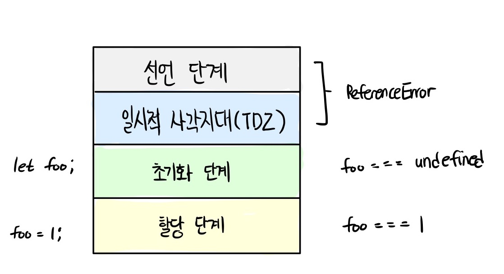

# 모던 자바스크립트 Deep Dive

## 들어가며

위 글은 모던 자바스크립트 Deep Dive를 공부하며, 중요한 부분과 계속해서 두고 볼 부분을 정리한 글입니다. 앞서서도 다른 readme를 통해 다양한 js 관련 책을 읽어보고 공부해봤지만, 개념적인 측면이나 js의 동작 관련해서 저의 궁금증을 시원하게 해결하지 못하여 이렇게 다시 한 번 공부하고 있습니다. 21년 9월 (마지막 방학) 이전까지 1회독을 통해 한 번 정리하는 것이 목표이며, 후에는 꾸준히 공부한 내용을 바탕으로 다회독할 예정입니다. js에 대한 정리와 개념이 아예 없던 것이 아니기 때문에, 이전 내용과 비교하여 필요한 내용을 정리할 예정입니다. 주요 키워드를 통해 TIL readme에서 쉽게 찾아볼 수 있도록 링크를 통해 관리하도록 하겠습니다.

## 목차

- [1장 프로그래밍](#1장-프로그래밍)
- [2장 자바스크립트란](#2장-자바스크립트란)
- [3장 자바스크립트 개발 환경과 실행 방법](#3장-자바스크립트-개발-환경과-실행-방법)
- [4장 변수](#4장-변수)
- [5장 표현식과 문](#5장-표현식과-문)
- [6장 데이터 타입](#6장-데이터-타입)
- [8장 제어문](#8장-제어문)
- [9장 타입변환과 단축 평가](#9장-타입변환과-단축-평가)
- [10장 객체 리터럴](#10장-객체-리터럴)
- [11장 원시 값과 객체 비교](#11장-원시-값과-객체-비교)
- [12장 함수](#12장-함수)
- [13장 스코프](#13장-스코프)
- [14장 전역 변수의 문제점](#14장-전역-변수의-문제점)
- [15장 let, const 키워드와 블록 레벨 스코프](#15장-let,-const-키워드와-블록-레벨-스코프)

- <a href="https://github.com/junh0328/upgrade_javascript/blob/master/DEEPDIVE/readme2.md">다음 섹션으로</a>

## 1장 프로그래밍

> keyword: 프로그래밍, 기계어, 컴파일러, 인터프리터, 프로그래밍 언어, 자연어, 인공어

### 1.1 프로그래밍이란?

<p>프로그래밍이란 컴퓨터에게 실행을 요구하는 일종의 커뮤니케이션이다. 해결해야 할 문제(요구사항)를 명확히 이해한 후 적절한 문제 해결 방안을 정의할 필요가 있다. 이때 요구되는 것이 문제 해결 능력이다. 문제 해결 능력을 알고리즘과 동일시하려는 경향이 있지만 반드시 그런 것은 아니다. 물론 문제 해결 능력을 함양하는 데 알고리즘 학습은 큰 도움이 되지만 문제 해결 능력은 더 큰 차원의 능력이다. 대부분의 문제(요구사항)는 복잡하며 명확하지 않을 수도 있다. 따라서 문제를 명확히 이해하는 것이 우선이 되어야 하며 복잡함을 단순하게 분해하고 자료를 정리하고 구분해야 하며 순서에 맞게 배열해야 한다.</p>

<p>즉, 프로그래밍이란 0과 1밖에 알지 못하는 기계가 실행할 수 있을 정도로 정확하고 상세하게 요구를 설명하는 작업이며, 그 결과물이 바로 코드다.</p>

### 1.2 프로그래밍 언어

<p>문제 해결 능력을 바탕으로 정의된 문제의 해결 방안은 컴퓨터에게 전달되어야 한다. 이때 명령을 수행할 주체는 컴퓨터이다. 따라서 사람이 이해할 수 있는 자연어가 아니라 컴퓨터가 이해할 수 있는 언어, 즉 기계어로 명령을 전달해야 한다. 하지만 사람이 기계어로 직접 명령을 전달하는 것은 매우 어려운 일이다. 기계어는 우리가 사용하는 언어와는 너무나도 체계가 다르기 때문이다. 기계어로 직접 명령을 전달하는 것을 대신할 가장 유용한 대안은 사람이 애해할 수 있는 약속된 구문으로 구성된 프로그래밍 언어를 사용해 프로그램을 작성한 후, 그것을 컴퓨터가 이해할 수 있는 기계어로 변환하는 일종의 번역기를 이용하는 것이다. 이 일종의 번역기를 컴파일러(compiler) 혹은 인터프리터(interpreter)라고 한다.</p>

```
compile 변환하다
interpret 해석하다
```

<p>언어는 자신의 생각을 상대에게 전달하는 방법으로 언어 공동채 내에서 이해될 수 있는 말의 집합이다. 언어는 자연어와 인공어로 구분할 수 있다. 프로그래밍 언어란 컴퓨터와의 대화(명령)에 사용되는 일종의 표현 수단으로, 사람과 컴퓨터(컴파일러 또는 인터프리터) 모두가 이해할 수 있는 약속된 형태의 인공어이다.</p>

<p>결국 프로그래밍은 요구사항의 집합을 분석해서 적절한 자료구조(객체와 배열 등)와 함수의 집합으로 변환한 후, 그 흐름을 제어하는 것이다.</p>

## 2장 자바스크립트란

### 2.1 자바스크립트의 탄생

<p>1995년, 약 90%의 시장 점유율로 웹 브라우저 시장을 지배하고 있는 넷스케이프 커뮤니케이션즈는 <b>웹페이지의 보조적인 기능을 수행하기 위해 브라우저에서 동작하는 경량 프로그래밍 언어를 도입하기로 결정한다.</b> 그래서 탄생한 것이 바로 브랜던 아이크가 개발한 자바스크립트이다. 자바스크립트는 1996년 3월, 넷스케이프 커뮤니케이션즈의 웹 브라우저인 '넷스케이프 내비게이터2'에 탑재되었고 '모카(Mocha)'로 명명되었다. 그러다 그해 9월 라이브스크립트(LiveScript)로 이름이 바뀌었다가 12월에 자바스크립트(JavaScript)라는 이름으로 최종 명명되었다.</p>

### 2.3 자바스크립트 성장의 역사

<p>초창기 자바스크립트는 웹페이지의 보조적인 기능을 수행하기 위해 한정적인 용도로 사용되었다. 이 시기에 대부분의 로직은 주로 웹 서버에서 실행되었고, 브라우저는 서버로부터 전달받은 HTML과 CSS를 단순히 렌더링하는 수준이었다.</p>

### 렌더링 (rendering)

```
렌더링이란 HTML, CSS, JS로 작성된 문서를 해석해서 브라우저에 시각적으로 출력하는 것을 말한다.
때로는 서버에서 데이터를 HTML로 변환해서 브라우저에게 전달하는 과정(SSR: Server Side Rendering)을 가리키기도 한다.
```

### Ajax

<p>1999년, 자바스크립트를 이용해 서버와 브라우저가 비동기(asynchronous) 방식으로 데이터를 교환할수 있는 통신 기능인 Ajax(Asynchronous JavaScript and XML)가 'XMLHttpRequest'라는 이름으로 등장했다. 이전의 웹페이지는 html 태그로 시작해서 html 태그로 끝나는 완전한 HTML 코드를 서버로부터 새로운 HTML을 전송받아 웹페이지 전체를 처음부터 다시 렌더링했다. 하지만, Ajax가 등장하면서 이전의 패러다임을 획기적으로 전환했다. 즉, 웹페이지에서 변경할 필요가 없는 부분은 다시 렌더링하지 않고, 서버로부터 필요한 데이터만 전송받아 변경해야 하는 부분만 한정적으로 렌더링하는 방식이 가능해진 것이다. 이로써 웹 브라우저에서도 데스크톱 애플리케이션과 유사한 빠른 성능과 부드러운 화면 전환이 가능해졌다.</p>

<p>2005년, 구글이 발표한 구글 맵스(Google Maps)는 웹 애플리케이션 프로그래밍 언어로서 자바스크립트의 가능성을 확인하는 계기를 마련했다. 웹 브라우저에서 자바스크립트와 Ajax를 기반으로 동작하는 구글 맵스가 데스크톱 애플리케이션과 비교했을 때 손색이 없을 정도의 성능과 부드러운 화면 전환 효과를 보여준 것이다.</p>

### V8 자바스크립트 엔진

<p>2008년 등장한 구글의 V8 자바스크립트 엔진은 더욱 빠르게 동작하는 요구에 부합하는 빠른 성능을 보여주었다. V8 자바스크립트 엔진의 등장으로 자바스크립트는 데스크톱 애플리케이션과 유사한 사용자 경험(UX)을 제공할 수 있는 웹 애플리케이션 프로그래밍 언어로 정착하게 되었다. V8 자바스크립트 엔진으로 촉발된 자바스크립트의 발전으로 과거 웹 서버에서 수행되던 로직들이 대거 클라이언트(브라우저)로 이동했고, 이는 웹 애플리케이션 개발에서 프런트엔드 영역이 주목받는 계기로 작용했다.</p>

### Node.js

<p>2009년, 라이언 달이 발표한 <b>Node.js는 구글 V8 자바스크립트 엔진으로 빌드된 자바스크립트 런타임 환경</b>이다. <b>Node.js는 브라우저의 자바스크립트 엔진에서만 동작하던 자바스크립트를 브라우저 이외의 환경에서도 동작할 수 있도록 자바스크립트 엔진을 브라우저에서 독립시킨 자바스크립트 실행 환경이다.</b> Node.js는 다양한 플랫폼에 적용할 수 있지만 서버 사이드 애플리케이션 개발에 주로 사용되며, 이에 필요한 모듈, 파일 시스템, HTTP 등 빌트인 API를 제공한다.</p>

<p>Node.js는 자바스크립트 엔진을 기반으로 하므로 Node.js 환경에서 동작하는 애플리케이션은 자바스크립트를 사용해 개발한다. 프런트와 백 영역 모두에서 자바스크립트를 사용할 수 있다는 동형성은 별도의 언어를 학습하기 위한 시간을 덜 수 있다는 장점이 있다. Node.js는 비동기 I/O(input & output)를 지원하며 단일 스레드 이벤트 루프 기반으로 동작함으로써 요청 처리 성능이 좋다. 따라서 Node.js는 데이터를 실시간으로 처리하기 위해 I/O가 빈번하게 발생하는 SPA에 적합하다.</p>

### SPA 프레임워크

<p>모던 웹 애플리케이션은 데스크톱 애플리케이션과 비교해도 손색없는 성능과 사용자 경험을 제공하는 것이 필수가 되었고, 더불어 개발 규모의 복잡도도 상승했다. 이전의 개발 방식으로는 복잡해진 개발 과정을 수행하기 어려워졌고, 이러한 필요에 따라 많은 패턴과 라이브러리가 출현했다. 이러한 요구에 발맞춰 CBD(Component Base Development)방법론을 기반으로 하는 SPA(Single Page Application)가 대중화되면서 다양한 SPA 프레임워크/라이브러리 또한 많은 사용층을 확보하고 있다.</p>

### 2.4 자바스크립트와 ECMAScript

<p>ECMAScript는 자바스크립트의 표준 사양인 ECMA-262를 말하며, 프로그래밍 언어의 값, 타입, 객체와 프로퍼티, 함수, 표준 빌트인 객체 등 핵심 문법을 규정한다. 각 브라우저 제조사는 ECMAScript 사양을 준수해서 브라우저에 내장되는 자바스크립트 엔진을 구현한다. 자바스크립트는 일반적으로 프로그래밍 언어로서 기본 뼈대를 이루는 ECMAScript와 브라우저가 별도 지원하는 클라이언트 사이드 Web API, 즉 DOM, BOM, Canvas, XMLHttpRequest, fetch, requestAnimationFrame, SVG, Web Storage, Web Component, Web Worker 등을 아우르는 개념이다.</p>

### 2.5 자바스크립트의 특징

<p>자바스크립트는 HTML, CSS와 함께 웹을 구성하는 요소 중 하나로 웹 브라우저에서 동작하는 유일한 프로그래밍 언어다. <b>자바스크립트는 개발자가 별도의 컴파일 작업을 수행하지 않는 인터프리터 언어이다.</b> <b>인터프리터는 소스코드를 즉시 실행하고 컴파일러는 빠르게 동작하는 머신 코드를 생성하고 최적화한다.</b> 이를 통해 컴파일 단계에서 추가적인 시간이 필요함에도 더욱 빠르게 코드를 실행할 수 있다.</p>

<p>자바스크립트는 런타임에 컴파일되며 실행 파일이 생성되지 않고 인터프리터의 도움 없이 실행할 수 없기 때문에 컴파일러 언어라고 할 수는 없다.</p>

<p>자바스크립트는 명령형, 함수형, 프로토타입 기반 객체지향 프로그래밍을 지원하는 멀티 패러다임 프로그래밍 언어이다. 간혹 클래스, 상속, 정보 은닉을 위한 키워드가 없어서 객체지향 언어가 아니라고 오해하는 경우도 있지만 자바스크립트는 클래스 기반 객체지향 언어보다 효율적이면서 강력한 프로토타입 기반의 객체지향 언어이다.</p>

## 3장 자바스크립트 개발 환경과 실행 방법

### 3.1 자바스크립트 실행 환경

<p>모든 브라우저(크롬, 사파라, 익스플로러)는 자바스크립트를 해석하고 실행할 수 있는 자바스크립트 엔진을 내장하고 있다. 브라우저뿐만 아니라 Node.js도 자바스크립트 엔진을 내장하고 있다. 따라서 자바스크립트는 브라우저 환경 또는 Node.js 환경에서 실행할 수 있다.</p>

<p>그런데 한 가지 주의해야 할 점은 브라우저와 Node.js는 용도가 다르다는 것이다. <b>브라우저는 HTML, CSS, 자바스크립트를 실행해 웹페이지를 브라우저 화면에 렌더링하는 것이 주된 목적이지만 Node.js는 브라우저 외부에서 자바스크립트 실행 환경을 제공하는 것이 주된 목적이다.</b> 따라서 브라우저와 Node.js 모두 자바스크립트의 코어인 ECMAScript를 실행할 수 있지만, 브라우저와 Node.js에서 ECMAScript 이외에 추가로 제공하는 기능은 호환되지 않는다.</p>


[출처: 모던 자바스크립트 Deep Dive]

## 4장 변수

### 4.1 변수란 무엇인가

<p>애플리케이션은 데이터를 다룬다. 아무리 복잡한 애플리케이션이라 해도 데이터를 입력(input)받아 처리하고 그 결과를 출력(output)하는 것이 전부다. 변수는 프로그래밍 언어에서 데이터를 관리하기 위한 핵심 개념이다.</p>

```
10 + 20
```

<p>자바스크립트 엔진이 10 + 20 이라는 식의 의미를 해석하면 + 연산을 수행하기 위해 먼저 + 연산자의 좌변과 우변의 숫자 값, 피연산자를 기억한다. 사람은 계산과 기억을 모두 두뇌에서 하지만, 컴퓨터는 연산과 기억을 수행하는 부분이 나눠져 있다. <b>컴퓨터는 CPU를 사용해 연산하고, 메모리를 사용해 데이터를 기억한다.</b></p>

<p>메모리는 데이터를 저장할 수 있는 메모리 셀의 집합체다. 메모리 셀 하나의 크기는 1바이트(8비트)이며, 컴퓨터는 메모리 셀의 크기, 즉 1바이트 단위로 데이터를 저장하거나 읽어들인다.</p>


[출처: 모던 자바스크립트 Deep Dive]

<p>각 메모리 셀은 고유의 메모리 주소(address)를 갖는다. 이 메모리 주소는 메모리 공간의 위치를 나타내며, 0부터 시작해서 메모리의 크기만큼 정수로 표현된다. 4GB 메모리는 0부터 4,294,967,295(0x00000000~0xFFFFFFFF)까지의 메모리 주소를 갖는다.</p>

<p>위 예제의 숫자 값 10과 20은 메모리 상의 임의의 위치(메모리 주소)에 기억(저장)되고 CPU는 이 값을 읽어들여 연산을 수행한다. 연산 결과로 생성된 숫자 값을 편의상 10진수로 표기했다. 하지만 메모리에 저장되는 모든 값은 2진수로 저장된다는 것을 기억할 필요가 있다.</p>


[출처: 모던 자바스크립트 Deep Dive]

<p>성공적으로 연산이 끝났고 연산 결과도 메모리에 저장되었지만, CPU가 만들어낸 숫자 값 30을 재사용할 수 없다. 10 + 20 연산 결과를 재사용하고 싶다면 메모리 주소를 통해 연산 결과 30이 저장된 메모리 공간에 직접 접근하는 것 외에는 방법이 없다. 하지만 메모리 주소를 통해 값에 직접 접근하는 것은 치명적 오류를 발생시킬 가능성이 높은 매우 위험한 일이다. 만약 실수로 운영체제가 사용하고 있는 값을 변경하면 시스템을 멈추게 하는 치명적인 오류가 발생할 수도 있다. <b>따라서 자바스크립트는 개발자의 직접적인 메모리 제어를 허용하지 않는다.</b></p>

<p>프로그래밍 언어는 기억하고 싶은 값을 메모리에 저장하고, 지정된 값을 읽어 들여 재사용하기 위해 <b>변수</b>라는 메커니즘을 제공한다. 변수의 정의를 내려보면 다음과 같다.</p>

```
변수는 하나의 값을 저장하기 위해 확보한 메모리 공간 자체 또는 그 메모리 공간을 식별하기 위해 붙인 이름을 말한다.
```

<p>간단히 말하자면 변수는 프로그래밍 언어에서 값을 저장하고 참조하는 메커니즘으로, 값의 위치를 가리키는 상징적인 이름이다. 변수는 프로그래밍 언어의 컴파일러 또는 인터프리터에 의해 값이 저장된 메모리 공간의 주소로 치환되어 실행한다. 따라서 개발자가 직접 메모리주소(0x0669F913)를 통해 값을 저장하고 참조할 필요가 없고 변수를 통해 안전하게 값에 접근할 수 있다.</p>

<p>앞서 살펴본 코드를 변수를 사용해 다시 작성해보자</p>

```js
var result = 10 + 20;
```

<p>10 + 20은 연산을 통해 새로운 값 30을 생성한다. 이때 <b>메모리 공간에 저장된 값 30을 다시 읽어 들여 재사용할 수 있도록 값이 저장된 메모리 공간에 상징적인 이름을 붙인 것이 바로 변수이다.</b></p>


<p>메모리 공간에 저장된 값을 식별할 수 있는 고유한 이름(result)을 변수 이름(또는 변수명)이라고 한다. 그리고 변수에 저장된 값(30)을 변수 값이라고 한다. </p>

```
변수에 값을 저장하는 것을 할당(assignment)(대입, 저장)이라 하고, 변수에 저장된 값을 읽어 들이는 것을 참조(reference)라 한다.
```

<p>변수 이름은 사람을 위해 사람이 이해할 수 있는 언어로 값이 저장된 메모리 공간에 붙인 상징적인 이름이다. 변수 이름을 사용해 참조를 요청하면 자바스크립트 엔진은 변수 이름과 매핑된 메모리 주소를 통해 메모리 공간에 접근해서 저장된 값을 반환한다.</p>

### 4.2 식별자

<p>변수 이름을 식별자(identifier)라고도 한다. 식별자는 어떤 값을 구별해서 식별할 수 있는 고유한 이름을 말한다. 그림에서 식별자 result는 값 30을 식별할 수 있었다. 이를 위해 식별자 result는 값 30이 저장되어 있는 메모리 주소 0x0669F913을 기억해야 한다. <b>즉, 식별자는 값이 저장되어 있는 메모리 주소와 매핑 관계를 맺으며, 이 매핑 정보도 메모리에 저장되어야 한다.</b></p>

<p><b>이처럼 식별자는 값이 아니라 메모리 주소를 기억하고 있다.</b> 식별자라는 용어는 변수 이름에만 국한해서 사용하지 않는다. 예를 들어, 변수, 함수, 클래스 등의 이름은 모두 식별자다. 식별자인 변수 이름으로는 메모리 상에 존재하는 변수 값을 식별할 수 있고, 함수 이름으로는 메모리 상에 존재하는 함수를 식별할 수 있다. 즉, 메모리 상에 존재하는 어떤 값을 식별할 수 있는 이름은 모두 식별자라고 부른다.</p>

<p>변수, 함수, 클래스 등의 이름과 같은 식별자는 <b>네이밍 규칙</b>을 준수해야 하며, 선언(declaration)에 의해 자바스크립트 엔진에 식별자의 존재를 알린다.</p>

### 4.3 변수 선언

<p>변수 선언이란 변수를 생성하는 것을 말한다. 좀 더 자세히 말하면 값을 저장하기 위한 메모리 공간을 확보하고 변수 이름과 확보된 메모리 공간의 주소를 연결해서 값을 저장할 수 있게 준비하는 것이다. 변수를 사용하려면 반드시 선언이 필요하다. 변수를 선언할 때는 var, let, const 키워드를 사용한다. ES6에서 let, const 키워드가 도입되기 이전까지 var 키워드는 자바스크립트에서 변수를 선언할 수 있는 유일한 키워드였다.</p>

<p>아직 살펴보지 않았지만 var 키워드는 여러 단점이 있다. var 키워드의 여러 단점 중에서 가장 대표적인 것이 블록 레벨 스코프를 지원하지 않고 함수 레벨 스코프를 지원한다는 것이다. 이로 인해 의도치 않게 전역 변수가 선언되어 심각한 부작용이 발생하기도 한다. (이를 막기 위해 클로저라는 개념이 도입되었다)</p>

### 키워드

```js
var score;
```

<p>var 키워드는 뒤에 오는 변수 이름을 새로운 변수를 선언할 것을 지시하는 키워드이다. 키워드는 자바스크립트 코드를 해석하고 실행하는 자바스크립트 엔진이 수행할 동작을 규정한 일종의 명령어이다. 자바스크립트 엔진은 키워드를 만나면 자신이 수행해야 할 약속된 동작을 수행한다. 예를 들어, var 키워드를 만나면 자바스크립트 엔진은 뒤에 오는 변수 이름으로 새로운 변수를 선언한다.</p>

<p>변수를 선언한 이후, 아직 변수에 값을 할당하지 않았다. 따라서 변수 선언에 의해 확보된 메모리 공간은 비어 있을 것으로 생각할 수 있으나 확보된 메모리 공간에는 자바스크립트 엔진에 의해 <b>undefined</b>라는 값이 암묵적으로 할당되어 초기화된다. 이것이 자바스크립트의 독특한 특징이다.</p>

<p>자바스크립트 엔진은 변수 선언을 다음과 같은 2단계에 거쳐 수행한다.</p>

```
선언 단계: 변수 이름을 등록해서 자바스크립트 엔진에 변수의 존재를 알린다.
초기화 단계: 값을 저장하기 위한 메모리 공간을 확보하고 암묵적으로 undefined를 할당해 초기화한다.
```

> 변수 이름은 어디에 등록되는가?

<p>변수 이름을 비롯한 모든 식별자는 <b>실행 컨텍스트</b>에 등록된다. 실행 컨텍스트는 <b>자바스크립트 엔진이 소스코드를 평가하고 실행하기 위해 필요한 환경을 제공하고 코드와 실행 결과를 실제로 관리하는 영역이다.</b> 자바스크립트 엔진은 실행 컨텍스트를 통해 식별자와 스코프를 관리한다.</p>

<p>var 키워드를 사용한 변수 선언은 선언 단계와 초기화 단계가 동시에 진행된다. var score;는 선언 단계를 통해 실행 컨텍스트에 변수 이름 score를 등록하고, 초기화 단계를 통해 score 변수에 암묵적으로 undefined를 할당해 초기화한다.</p>

<p>일반적으로 초기화(initialization)란 변수가 선언된 이후 최초로 값을 할당하는 것을 말한다. 만약 초기화 단계를 거치지 않으면 확보된 메모리 공간에는 이전에 다른 애플리케이션이 사용했던 값이 남아 있을 수 있다. 이러한 값을 쓰레기 값(garbage value)이라 한다. 따라서 메모리 공간을 확보한 다음, 값을 할당하지 않은 상태에서 곧바로 변수 값을 참조하면 쓰레기 값이 나올 수 있다. 자바스크립트의 var 키워드는 암묵적으로 초기화를 수행하므로 이러한 위험으로부터 안전하다.</p>

### 4.4 변수 선언의 실행 시점과 변수 호이스팅

<p>다음 문장을 살펴보자</p>

```js
console.log(score); // undefined;

var score; // 변수 선언문
```

<p>변수 선언문보다 변수를 참조하는 코드가 앞에 있다 자바스크립트 코드는 인터프리터에 의해 한 줄씩 순차적으로 실행되므로 console.log(score);가 가장 먼저 실행되고 순차적으로 다음 줄에 있는 코드를 실행한다. 따라서 console.log(score);가 실행되는 시점에는 아직 score 변수의 선언이 실행되지 않았으므로 참조 에러(Reference Error)가 발생할 것처럼 보인다. 하지만 참조 에러가 발생하지 않고 undefined가 출력된다. 그 이유는 변수 선언이 소스코드가 한 줄씩 순차적으로 실행되는 시점, 즉 런타임이 아니라 그 이전 단께에서 먼저 실행되기 때문이다.</p>

<p>자바스크립트 엔진은 소스코드를 한 줄씩 순차적으로 실행하기에 앞서 먼저 소스코드의 평가 과정을 거치면서 소스코드를 실행하기 위한 준비를 한다. 이때 소스코드 실행을 위한 평가 과정에서 자바스크립트 엔진은 변수 선언을 포함한 모든 선언문(변수 선언문, 함수 선언문 등)을 소스코드에서 찾아내 먼저 실행한다. 그리고 소스코드의 평가 과정이 끝나면 비로소 변수 선언문은을 포함한 모든 선언문을 제외하고 소스코드를 한 줄씩 순차적으로 실행한다.</p>

> REPL (Read Eval Print Loop) 단계를 거친다.

<p>즉, js 엔진은 변수 선언(을 포함한 모든 선언문)이 소스코드의 어디에 있든 상관없이 다른 코드보다 먼저 실행한다. 따라서 변수 선언이 소스코드의 어디에 위치하던지와 상관없이 어디서든지 변수를 참조할 수 있다. 이러한 특징을 변수 호이스팅이라 한다.</p>

<p><b>사실 변수 선언뿐 아니라 var, let, const, function, function*, class 키워드를 사용해서 선언하는 모든 식별자(변수, 함수, 클래스 등)는 호이스팅된다. 모든 선언문은 런타임 이전 단계에서 먼저 실행되기 때문이다.</b></p>

### 4.5 값의 할당

<p>변수에 값을 할당 assignment(대입, 저장)할 때는 할당 연산자 = 를 사용한다. 할당 연산자는 우변의 값을 좌변의 변수에 할당한다.</p>

```js
var score; // var 키워드를 통해 변수 score 선언
score = 80; // score 변수에 값 80 할당

var score = 80; // 변수를 선언과 값ㅢ 할ㅏ
// 하지만 js 엔진에 의해 평가과정과 실행과정이 나눠져있기 때문에 변수의 선언과 값의 할당을 2개의 문으로 나누어 각각 실행한다
```

<p> <b>변수 선언과 값의 할당을 2개의 문으로 나누어 표현한 코드와 변수 선언과 값의 할당을 하나의 문으로 단축 표현한 코드는 정확히 동일하게 동작한다. 즉, js 엔진은 변수 선언과 값의 할당을 하나의 문으로 단축 표현해도 변수 선언과 값의 할당을 2개의 문으로 나누어 각각 실행한다.</b> 이때 주의할 점은 변수 선언과 값의 할당의 실행 시점이 다르다는 것이다. 변수 선언은 소스코드가 순차적으로 실행되는 시점인 '런타임' 이전에 먼저 실행되지만 값의 할당은 소스코드가 순차적으로 실행되는 시점인 '런타임'에 실행된다.</p>


<p>변수의 선언과 값의 할당을 하나의 문장으로 단축 표현해도 자바스크립트 엔진은 변수의 선언과 값의 할당을 2개의 문으로 나누어 각각 실행한다. 따라서 변수에 undefined가 할당되어 초기화되는 것은 변함이 없다.</p>

> 그림처럼 변수에 값을 할당하고 재 할당할 때는 이전 값 undefined가 저장되어 있던 메모리 공간을 지우고 그 메모리 공간에 할당 값 80을 새롭게 저장하는 것이 아니라 새로운 메모리 공간을 확보하고 그곳에 할당 값 80을 저장한다는 점에 주의하자

<p>이러한 불필요한 값들은 가비지 콜렉터에 의해 메모리에서 자동 해제된다. 단, 메모리에서 언제 해제될지는 예측할 수 없다.</p>

### 가비지 콜렉터

```
가비지 콜렉터는 애플리케이션이 할당한 메모리 공간을 주기적으로 검사하여 더 이상 사용되지 않는 메모리를 해제하는 기능을 말한다.
더 이상 사용되지 않는 메모미란 간단히 말하자면 어떤 식별자도 참조하지 않는 메모리 공간을 의미한다.
자바스크립트는 가비지 콜렉터를 내장하고 있는 매니지드 언어로서 가비지 콜렉터를 통해 메모리 누수를 방지한다.
```

### 4,7 식별자 네이밍 규칙

```
식별자는 특수문자를 제외한 문자, 숫자, 언더스코어(_), 달러 기호($)를 포함할 수 있다.
단 식별자는 특수문자를 제외한 문자, 언더스코어(_), 달러 기호로 시작해야 한다. 숫자로 시작하는 것은 허용하지 않는다.
```

### 네이밍 컨벤션

<p>네이밍 컨벤션은 하나 이상의 영어 단어로 구성된 식별자를 만들 때 가독성 좋게 단어를 한눈에 구분하기 위해 규정한 명명 규칙이다.</p>

```js
// 카멜 케이스 (camelCase)
var firstName;

// 스네이크 케이스 (snake_case)
var first_name;

// 파스칼 케이스 (PascalCase)
var FirstName;

// 헝가리언 케이스 (typeHungarianCase)
var strFirstName; // type + identifier
var $elem = document.getElementById("myId"); // DOM 노드
var observable$ = fromEvent(document, "click"); // RxJS 옵저버블
```

<p>ECMAScript 사양에 정의되어 있는 객체와 함수들도 카멜 케이스와 파스칼 케이스를 사용하고 있다. 따라서 코드 전체의 가독성을 높이려면 카멜 케이스와 파스칼 케이스를 따르는 것이 유리하다.</p>

## 5장 표현식과 문

<p>지금까지 살펴본 내용에서 '값'이라는 용어가 자주 등장했다. '값'이라는 용어를 알고 있다고 생각하겠지만 막상 설명하려 하면 난감할 수 있다. 개념을 이해한다는 것은 바로 용어를 정확히 이해하고 설명할 수 있다는 것이다.</p>

## 5.1 값

<p>값(=value)은 식(표현식, expression)이 평가(=evaluate) 되어 생성된 결과를 말한다. '평가'란 식을 해석해서 값을 생성하거나 참조하는 것을 의미한다.</p>

```js
// 10 + 20은 평가되어 숫자 값 30을 생성한다.

10 + 20; //30

var sum = 10 + 20;
```

<p>모든 값은 데이터 타입을 가지며, 메모리에 2진수, 즉 비트의 나열로 저장된다. 메모리에 저장된 값은 데이터 타입에 따라 다르게 해석될 수 있다. 예를 들어, 메모리에 저장된 값 0100 0001을 숫자로 해석하면 65지만 문자로 해석하면 'A'이다. 변수는 하나의 값을 저장하기 위해 확보한 메모리 공간 자체 또는 그 메모리 공간을 식별하기 위해 붙인 이름이다. 따라서 변수에 할당되는 것은 값(30)이다.</p>

<p>값은 다양한 방법으로 생성할 수 있다. 위 예제처럼 식으로 생성할 수도 있지만 가장 기본적인 방법은 리터럴을 사용하는 것이다.</p>

## 5.2 리터럴

<p>리터럴(=literal)은 사람이 이해할 수 있는 문자 또는 약속된 기호를 사용해 값을 생성하는 표기법(=notation) 을 말한다.</p>

```
// 숫자 리터럴 3
3
```

<p>위 예제의 3은 단순한 아라비아 숫자가 아니라 숫자 리터럴이다. 사람이 이해할 수 있는 아라비아 숫자를 사용해 숫자 리터럴 3을 코드에 기술하면 자바스크립트 엔진은 이를 평가해 숫자 값 3을 생성한다. 자바스크립트 엔진은 코드가 실행되는 시점인 <b>런타임</b>에 리터럴을 평가해 값을 생성한다.</p>

## 5.3 표현식

<p>표현식,expression은 값으로 평가될 수 있는 문(=statement)이다. 즉, 표현식이 평가되면 새로운 값을 생성하거나 기존 값을 참조한다.</p>

```js
var score = 100;
```

<p>위 예제의 100은 리터럴이다. 리터럴 100은 자바스크립트 엔진에 의해 평가되어 값을 생성하므로 리터럴은 그 자체로 표현식이다. 다른 예제를 살펴보자</p>

```js
var score = 50 + 50;

score; // 100
```

<p>변수 식별자(score)를 참조하면 변수 값으로 평가된다. 식별자 참조는 값을 생성하지는 않지만 값으로 평가되므로 표현식이다. 이처럼 표현식은 리터럴, 식별자(변수, 함수 등의 이름), 연산자, 함수 호출 등의 조합으로 이뤄질 수 있다. 다음과 같이 다양한 표현식이 있지만 값으로 평가된다는 점에서 모두 동일하다. 즉, 값으로 평가될 수 있는 문은 모두 표현식이다.</p>

```js
// 리터럴 표현식
10;
("Hello");

// 식별자 표현식(선언이 이미 존재한다고 가정)
sum;
person.name;
arr[1];

// 연산자 표현식
10 + 20;
sum = 10;
sum !== 10;

// 함수/메서드 호출 표현식(선언이 이미 존재한다고 가정)
square();
person.getName();
```

## 5.4 문

<p>문(=statement)은 프로그램을 구성하는 기본 단위이자 최소 실행 단위다. 문의 집합으로 이뤄진 것이 바로 프로그램이며, 문을 작성하고 순서에 맞게 나열하는 것이 프로그래밍이다.문은 여러 토큰으로 구성된다. 토큰,token이란 문법적인 의미를 가지며, 문법적으로 더 이상 나눌 수 없는 코드의 기본 요소를 의미한다.</p>


<p>문을 명령 문이라고도 부른다. 즉, 문은 컴퓨터에 내리는 명령이다. 문은 선언문, 할당문, 조건문, 반복문 등으로 구분할 수 있다. 변수 선언문을 실행하면 변수가 선언되고, 할당문을 실행하면 값이 할당된다. 조건문을 실행하면 지정한 조건에 따라 실행할 코드 블록이 결정되어 실행되고, 반복문을 실행하면 특정 코드 블록이 반복 실행된다.</p>

```js
// 변수 선언문
var x;

// 표현식 문(할당문)
x = 5;

// 함수 선언문
function foo() {}

// 조건문
if (x > 1) {
  console.log(x);
}

// 반복문
for (var i = 0; i < 2; i++) {
  console.log(i);
}
```

## 5.6 표현식인 문과 표현식이 아닌 문

> 표현식은 문의 일부일 수도 있고 그 자체로 문이 될 수도 있다.

```js
case 1:
var x; // 변수 선언문은 값으로 평가될 수 없으므로 표현식이 아니다.

case 2:
x = 1 + 2;
// 1, 2, 1 + 2, x = 1 + 2는 모두 표현식이다.
// x = 1 + 2는 표현식이면서 완전한 문이기도 하다.
```

<p>표현식과 문은 비슷해서 구별하기 어렵다고 느낄 수 있다. 하지만 표현식과 문을 구별하는 방법은 의외로 간단하다.</p>

<p>문에는 표현식인 문과 표현식이 아닌 문이 있다.</p>

```js
case 1: 표현식인 문 > 값으로 평가될ㄹ 수 있는 문 (할당문)
var x = 1;

case 2: 표현식이 아닌 문 > 값으로 평가될 수 없는 문 (선언만 되어 x가 undefined인 상태)
var x;
```

## 6장 데이터 타입

<p>데이터 타입,data type(을 줄여서 '타입'이라고도 한다)은 값의 종류를 말한다. 자바스크립트의 모든 값은 데이터 타입을 갖는다. 자바스크립트(ES6)는 7개의 데이터 타입을 제공한다. 7개의 데이터 타입은 원시 타입,primitive type과 객체 타입,object/reference type으로 분류할 수 있다.</p>

|   구분    |     데이터 타입     |                        설명                         |
| :-------: | :-----------------: | :-------------------------------------------------: |
| 원시 타입 |  숫자(number)타입   | 숫자, 정수와 실수 구분 없이 하나의 숫자 타입만 존재 |
| 원시 타입 | 문자열(string)타입  |                       문자열                        |
| 원시 타입 | 불리언(boolean)타입 |            논리적 참(true)과 거짓(false)            |
| 원시 타입 |    undefined타입    |  var 키워드로 선언된 변수에 암묵적으로 할당되는 값  |
| 원시 타입 |      null 타입      |  값이 없다는 것을 의도적으로 명시할 때 사용하는 값  |
| 원시 타입 |  심벌(symbol) 타입  |              ES6에서 추가된 7번째 타입              |
| 객체 타입 |                     |                 객체, 함수, 배열 등                 |

<p>예를 들어, 숫자 타입의 값 1과 문자열 타입의 값 '1'은 비슷해 보이지만 전혀 다른 값이다. 숫자 타입의 값 1과 문자열 타입의 값 '1'은 값을 생성한 목적과 용도가 다르다. 숫자 타입의 값은 주로 산술 연산을 위해 생성하지만, 문자열 타입의 값은 주로 텍스트를 화면에 출력하기 위해 생성한다. 또한 확보해야 할 메모리 공간의 크기도 다르고 메모리에 저장되는 2진수도 다르며 읽어 들여 해석하는 방식도 다르다.</p>

> 선언과 정의

<p>undefined를 직역하면 '정의되지 않은'이다. 일반적으로 정의란 개념은 어떤 대상을 명확하게 규정하는 것을 의미한다. 자바스크립트의 undefined에서 말하는 정의란 변수에 값을 할당하여 변수의 실체를 명확히 하는 것을 말한다. 자바스크립트의 경우 변수를 선언하면 암묵적으로 정의가 이뤄지기 때문에 선언과 정의의 구분이 모호하다.</p>

<p>ECMAScript 사양에서 변수는 '선언한다'라고 표현하고, 함수는 '정의한다'라고 표현한다.</p>

## 6.7 심벌 타입

<p>심벌은 ES6에서 추가된 7번째 타입으로, 변경 불가능한 원시 타입의 값이다. 심벌 값은 다른 값과 중복되지 않는 유일무이한 값이다. 따라서 주로 이름이 충동할 위험이 없는 객체의 유일한 프로퍼티 키를 만들기 위해 사용한다. 심벌 이외의 원시 값은 리터럴을 통해 생성하지만 심벌은 Symbol 함수를 호출해 생성한다. 이때 생성한 심벌 값은 외부에 노출되지 않으며, 다른 값과 절대 중복되지 않는 유일무이한 값이다.</p>

```js
// 심벌 값 생성
var key = Symbol("key");
console.log(typeof key); // symbol

// 객체 생성
var obj = {};

// 이름이 충돌할 위험이 없는 유일무이한 값인 심벌을 프로퍼티 키로 사용한다.
obj[key] = "value";
console.log(obj[key]); // value
```

<p>후에 더 자세히 다룬다.</p>

## 6.8 객체 타입

<p>자바스크립트의 데이터 타입은 크게 원시 타입과 객체 타입으로 분류한다고 했다. 그 이유는 무엇일까? 원시 타입과 객체 타입은 근복적으로 다르다는 의미일 것이다. 11장에서 더 자세히 다룬다. 중요한 것은 자바스크립트는 객체 기반의 언어이며, 자바스크립트를 이루고 있는 거의 모든 것이 객체라는 것이다. 지금까지 살펴본 6가지 데이터 타입 이외의 값은 모두 객체 타입이다.</p>

## 6.9 데이터 타입의 필요성

> 데이터 타입에 의한 메모리 공간의 확보와 참조

<p>값은 메모리에 저장하고 참조할 수 있어야 한다. 메모리에 값을 저장하려면 먼저 확보해야 할 메모리 공간의 크기를 결정해야 한다. 다시 말해, 몇 바이트의 메모리 공간을 사요해야 낭비와 손실 없이 값을 저장할 수 있는지 알아야 한다.</p>

```js
var score = 100;
```

<p>위 코드가 실행되면 컴퓨터는 숫자 값 100(원시타입 number는 immutable한 값이다.)을 저장하기 위해 메모리 공간을 확보한 다음, 확보된 메모리에 숫자 값 100을 2진수로 저장한다. 자바스크립트 엔진은 데이터 타입, 즉 값의 종류에 따라 정해진 크기의 메모리 공간을 확보한다. 즉, 변수에 할당되는 값의 타입에 따라 확보해야 할 메모리 공간의 크기가 결정된다.</p>

```
문자열(string)의 경우 문자당 2바이트
숫자(number)의 경우 8바이트의 메모리에 할당된다.

값이 아무리 적어도 (var score = 1;)
8바이트 크기의 메모리에 저장된다는 것이다.

00000000
00000000
00000000
00000000
00000000
00000000
00000000
00000001

숫자 타입의 값 1을 저장한 메모리셀 (8바이트)
```

> 데이터 타입에 의한 값의 해석

<p>모든 값은 데이터를 가지며, 메모리에 2진수, 즉 비트의 나열로 저장된다. 메모리에 저장된 값은 데이터 타입에 따라 다르게 해석될 수 있다. 예를 들어, 메모리에 저장된 값 0100 0001을 숫자로 해석하면 65지만, 문자열로 해석하면 'A'다. 그렇기 때문에 데이터 타입이 필요한 이유는 다음과 같다.</p>

### 데이터 타입이 필요한 이유

```
1. 값을 저장할 때 확보해야 하는 메모리 공간의 크기를 결정하기 위해
2. 값을 참조할 때 한 번에 읽어 들여야 할 메모리 공간의 크기를 결정하기 위해
3. 메모리에서 읽어 들인 2진수를 어떻게 해석할지 결정하기 위해
```

## 6.10 동적 타이핑

> 동적 타입 언어와 정적 타입 언어

<p>자바스크립트의 모든 값은 데이터 타입을 갖는다고 했다. 그렇다면 변수는 데이터 타입을 가질까?</p>

<p>C나 자바 같은 정적 타입언어는 변수를 선언할 때 변수에 할당할 수 있는 값의 종류, 즉 데이터 타입을 사전에 선언해야 한다. 이를 명시적 타입 선언이라 한다. 다음은 C에서 정수 타입의 변수를 선언하는 예이다.</p>

```
// c 변수에는 1바이트 정수 타입의 값(-128 ~ 127)만을 할당할 수 있다.
char c;

// num 변수에는 4바이트 정수 타입의 값(-2,124,483,648 ~ 2,124,483,647)만을 할당할 수 있다.
int num;
```

<p>정적 타입 언어는 변수의 타입을 변경할 수 없으며, 변수에 선언한 타입에 맞는 값만 할당할 수 있다. 정적 타입 언어는 컴파일 시점에서 타입 체크를 수행한다. 만약 타입 체크를 통과하지 못했다면 에러를 발생시키고 프로그램의 실행 자체를 막는다. 대표적인 정적 타입 언어로 C, C++, 자바, 코틀린, 고, 러스트 등이 있다.</p>

<p>자바스크립트는 정적 타입 언어와 다르게 변수를 선언할 때 타입을 선언하지 않는다. 다만 var, let, const 키워들 사용해 변수를 선언할 뿐이다.</p>

```js
var foo;
console.log(typeof foo); // undefined

foo = 3;
console.log(typeof foo); // number

foo = "Hello";
console.log(typeof foo); // string

foo = true;
console.log(typeof foo); // boolean

foo = null;
console.log(typeof foo); // object

foo = Symbol(); // 심벌
console.log(typeof foo); // symbol

foo = {}; // 객체
console.log(typeof foo); // object

foo = []; // 배열
console.log(typeof foo); // object

foo = function () {}; // 함수
console.log(typeof foo); // function
```

<p>자바스크립트의 변수는 선언이 아닌 할당에 의해 타입이 결정<b>(타입 추론)</b>된다. 그리고 재할당에 의해 변수의 타입은 언제든지 동적으로 변할 수 있다. 이러한 특징을 <b>동적 타이핑</b>이라고 하며, 자바스크립트를 정적 타입 언어와 구별하기 위해 동적 타입 언어라고 한다. 대표적인 동적 타입 언어로는 자바스크립트, 파이썬, PHP 등이 있다.</p>

<p>처음으로 돌아가 변수는 타입을 가질까? 라는 질문에 대한 답변을 해보자. 기본적으로 변수는 타입을 갖지 않는다. 하지만 값은 타입을 갖는다. 변수는 값에 묶여 있는 값에 대한 별명(값을 저장하고 있는 메모리 주소를 기억하는 별명)이기 때문이다.</p>

## 8장 제어문

<p>제어문은 조건에 따라 코드 블록을 실행(조건문)하거나 반복 실행(반복문)할 때 사용한다. 일반적으로 코드는 위에서 아래 방향으로 순차적으로 실행된다. 제어문을 사용하면 코드의 실행 흐름을 인위적으로 제어할 수 있다.</p>

### 8.1 블록문

<p>블록문은 0개 이상의 문을 중괄호로 묶은 것으로, 코드 블록 또는 블록이라고 부르기도 한다. 자바스크립트는 블록문을 하나의 실행 단위로 취급한다. 블록문은 단독으로 사용할 수도 있으나 일반적으로 제어문이나 함수를 정의할 때 사용하는 것이 일반적이다. 블록문은 언제나 문의 종료를 의마하는 자체 종결성을 갖기 때문에 블록문의 끝에는 세미콜론을 붙이지 않는다.</p>

```js
// 블록문
{
  var foo = 10;
}

// 제어문
var x = 1;
if (x < 10) {
  x++;
}

// 함수 선언문
function sum(a, b) {
  return a + b;
}
```

### 8.2 조건문

<p>조건문은 주어진 조건식의 평가 결과에 따라 코드 블록(블록문)의 실행을 결정한다. 조건식은 불리언 값으로 평가될 수 있는 표현식이다. 자바스크립트는 if ... else 문과 switch 문으로 두 가지 조건문을 제공한다.</p>

### 8.3 반복문

<p>반복문은 조건식의 평가 결과가 참인 경우 코드 블록을 싱행한다. 그후 조건식을 다시 평가하여 여전히 참인 경우 코드 블록을 다시 실행한다. 이는 조건식이 거짓일 때까지 반복된다. 자바스크립트는 세 가지 반복문인 for 문, while 문, do... while 문을 제공한다.</p>

> 반복문을 대체할 수 있는 다양한 기능

<p>자바스크립트는 배열을 순회할 때 사용하는 forEach 메서드, 객체의 프로퍼티를 열거할 때 사용하는 for ... in 문, ES6에서 도입된 이터러블을 순회할 수 있는 for...of문과 같이 반복문을 대체할 수 있는 다양한 기능을 제공한다.</p>

## 9장 타입변환과 단축 평가

### 9.1 타입 변환이란?

<p>자바스크립트의 모든 값은 타입이 있다. 값의 타입은 개발자의 의도에 따라 다른 타입으로 변환할 수 있다. <b>개발자가 의도적으로 값의 타입을 변환하는 것</b>을 <b>명시적 타입 변환 또는 타입 캐스팅</b>이라 한다.</p>

```js
var x = 10;

// 명시적 타입 변환
// 숫자를 문자열로 타입 캐스팅한다.
var str = x.toString();
console.log(typeof str, str); // string 10

// x 변수의 값이 변경된 것은 아니다.
console.log(typeof x, x); // number 10
```

<p><b>개발자의 의도와는 상관없이 표션식을 평가하는 도중에 자바스크립트 엔진에 의해 암묵적으로 타입이 자동 변환</b>되기도 한다. 이를 <b>암묵적 타입 변환 또는 강제 타입 변환</b>이라 한다.</p>

```js
var x = 10;

// 암묵적 타입 변환
// 문자열 연결 연산자 ( + )는 숫자 타입 x의 값을 바탕으로 새로운 문자열을 생성한다.
var str = x + "";
console.log(typeof str, str); // string 10

// x 변수의 값이 변경된 것은 아니다.
console.log(typeof x, x); // number 10
```

<p>명시적 타입 변환이나 암묵적 타입 변환이 기존 원시값을 직접 변경하는 것은 아니다. 원시 값은 변경 불가능한 값(immutable value)이므로 변경할 수 없다. 타입 변환이란 기존 원시 값을 사용해 다른 타입의 새로운 원시 값을 생성하는 것이다.</p>

### 9.2 암묵적 타입 변환

<p>자바스크립트 엔진은 표현식을 평가할 때 개발자의 의도와는 상관없이 코드의 문맥을 고려해 암묵적으로 데이터 타입을 강제 변환할 때가 있다.</p>

```js
// 피연산자가 모두 문자열 타입이어야 하는 문맥
"10" + 2; // -> '102'

// 피연산자가 모두 숫자 타입이어야 하는 문맥
5 * "10"; // -> 50

// 피연산자 또는 표현식이 불리언 타입이어야 하는 문맥
!0; // -> true
if (1) {
}
```

<p>이처럼 프로그래밍 언어에 따라 에러를 발생시키기도 하지만 자바스크립트는 가급적 에러를 발생시키지 않도록 암묵적 타입 변환을 통해 표현식을 평가한다. 암묵적 타입 변환이 발생하면 문자열, 숫자, 불리언과 같은 원시 타입 중 하나로 타입을 자동 변환한다. 타입별로 암묵적 타입 변환이 어떻게 발생하는지 살펴보자</p>

> 문자열 타입으로 변환, (+ 연산자 사용)

```js
// 숫자 타입
0 + ''         // -> "0"
-0 + ''        // -> "0"
1 + ''         // -> "1"
-1 + ''        // -> "-1"
NaN + ''       // -> "NaN"
Infinity + ''  // -> "Infinity"
-Infinity + '' // -> "-Infinity"

// 불리언 타입
true + ''  // -> "true"
false + '' // -> "false"

// null 타입
null + '' // -> "null"

// undefined 타입
undefined + '' // -> "undefined"

// 심벌 타입
(Symbol()) + '' // -> TypeError: Cannot convert a Symbol value to a string

// 객체 타입
({}) + ''           // -> "[object Object]"
Math + ''           // -> "[object Math]"
[] + ''             // -> ""
[10, 20] + ''       // -> "10,20"
(function(){}) + '' // -> "function(){}"
Array + ''          // -> "function Array() { [native code] }"

```

> 숫자 타입으로 변환 ( -, \* , / 연산자 사용)

<p>산술 연산자의 역할은 숫자 값은 만드는 것이다. 따라서 산술 연산자의 모든 피연산자는 코드 문맥상 모두 숫자 타입이어야 한다. 이때 피 연산자를 숫자 타입으로 변환할 수 없는 경우는 산술 연산을 수행할 수 없으므로 표현식의 평가 결과는 NaN이 된다.</p>

```
// 문자열 타입
+''       // -> 0
+'0'      // -> 0
+'1'      // -> 1
+'string' // -> NaN

// 불리언 타입
+true     // -> 1
+false    // -> 0

// null 타입
+null     // -> 0

// undefined 타입
+undefined // -> NaN

// 심벌 타입
+Symbol() // -> ypeError: Cannot convert a Symbol value to a number

// 객체 타입
+{}             // -> NaN
+[]             // -> 0
+[10, 20]       // -> NaN
+(function(){}) // -> NaN
```

> 불리언 타입으로 변환

<p>if 문이나 for 문과 같은 제어문 또는 삼항 조건 연산자의 조건식은 불리언 값, 즉 논리적 참/거짓으로 평가되어야 하는 표현식이다. 자바스크립트 엔진은 조건식의 평가 결과를 불리언 타입으로 암묵적 타입 변환한다.</p>

```js
if ("") console.log("1");
if (true) console.log("2");
if (0) console.log("3");
if ("str") console.log("4");
if (null) console.log("5");

// 2 4
```

<p>이때 자바스크립트 엔진은 불리언 타입이 아닌 값을 Truthy 값(참으로 평가되는 값) 또는 Falsy 값(거짓으로 평가되는 값)으로 구분한다. 즉, 제어문의 조건식과 같이 불리언 값으로 평가되어야 할 문맥에서 Truthy값은 true로, Falsy값은 false로 암묵적 타입 변환된다.</p>

<p>아래 값들은 false로 평가되는 Falsy 값이다.</p>

```
false
undefined
null
0, -0
NaN
' '(빈 문자열)
```

> Falsy값에 ! 연산자를 붙이면, 모두 Truthy 값으로 평가되어 실행 가능해진다.

```js
// 아래의 조건문은 모두 코드 블록을 실행한다.
if (!false) console.log(false + " is falsy value");
if (!undefined) console.log(undefined + " is falsy value");
if (!null) console.log(null + " is falsy value");
if (!0) console.log(0 + " is falsy value");
if (!NaN) console.log(NaN + " is falsy value");
if (!"") console.log("" + " is falsy value");
```

### 9.3 명시적 타입 변환

<p>개발자의 의도에 따라 명시적으로 타입을 변경하는 방법은 다양하다. 표준 빌트인 생성자 함수(String, Number, Boolean)를 new 연산자 없이 호출하는 방법과 빌트인 메서드를 사용하는 방법, 그리고 앞에서 살펴본 암묵적 타입 변환을 이용하는 방법이 있다.</p>

> 표준 빌트인 생성자 함수와 빌트인 메서드

<p>표준 빌트인 생성자 함수와 표준 빌트인 메서드는 자바스크립트에서 기본 제공하는 함수이다. <b>표준 빌트인 생성자 함수</b>는 객체를 생성하기 위한 함수이며 new 연산자와 함께 호출된다. <b>표준 빌트인 메서드</b>는 자바스크립트에서 기본 제공하는 빌트인 객체의 메서드이다.</p>

> 문자열 타입으로 변환

<p>문자열 타입이 아닌 값을 문자열 타입으로 변환하는 방법은 다음과 같다.</p>

```
1.String 생성자 함수를 new 연산자 없이 호출하는 방법
2.Object.prototype.toString 메서드를 사용하는 방법
3.문자열 연결 연산자를 이용하는 방법
```

```js
// 1. String 생성자 함수를 new 연산자 없이 호출하는 방법
// 숫자 타입 => 문자열 타입
String(1); // -> "1"
String(NaN); // -> "NaN"
String(Infinity); // -> "Infinity"
// 불리언 타입 => 문자열 타입
String(true); // -> "true"
String(false); // -> "false"

// 2. Object.prototype.toString 메서드를 사용하는 방법
// 숫자 타입 => 문자열 타입
(1).toString(); // -> "1"
NaN.toString(); // -> "NaN"
Infinity.toString(); // -> "Infinity"
// 불리언 타입 => 문자열 타입
true.toString(); // -> "true"
false.toString(); // -> "false"

// 3. 문자열 연결 연산자를 이용하는 방법
// 숫자 타입 => 문자열 타입
1 + ""; // -> "1"
NaN + ""; // -> "NaN"
Infinity + ""; // -> "Infinity"
// 불리언 타입 => 문자열 타입
true + ""; // -> "true"
false + ""; // -> "false"
```

> 숫자 타입으로 변환

<p>숫자 타입이 아닌 값을 숫자 타입으로 변환하는 방법은 다음과 같다.</p>

```
1. Number 생성자 함수를 new 연산자 없이 호출하는 방법
2. parseInt, parseFloat 함수를 사용하는 방법(문자열만 변환 가능)
3. + 단항 산술 연산자를 이용하는 방법
4. * 산술 연산자를 이용하는 방법
```

```js
// 1. Number 생성자 함수를 new 연산자 없이 호출하는 방법
// 문자열 타입 => 숫자 타입
Number("0"); // -> 0
Number("-1"); // -> -1
Number("10.53"); // -> 10.53
// 불리언 타입 => 숫자 타입
Number(true); // -> 1
Number(false); // -> 0

// 2. parseInt, parseFloat 함수를 사용하는 방법(문자열만 변환 가능)
// 문자열 타입 => 숫자 타입
parseInt("0"); // -> 0
parseInt("-1"); // -> -1
parseFloat("10.53"); // -> 10.53

// 3. + 단항 산술 연산자를 이용하는 방법
// 문자열 타입 => 숫자 타입
+"0"; // -> 0
+"-1"; // -> -1
+"10.53"; // -> 10.53
// 불리언 타입 => 숫자 타입
+true; // -> 1
+false; // -> 0

// 4. * 산술 연산자를 이용하는 방법
// 문자열 타입 => 숫자 타입
"0" * 1; // -> 0
"-1" * 1; // -> -1
"10.53" * 1; // -> 10.53
// 불리언 타입 => 숫자 타입
true * 1; // -> 1
false * 1; // -> 0
```

> 불리언 타입으로 변환

<p>불리언 타입이 아닌 값을 불리언 타입으로 변환하는 방법은 다음과 같다.</p>

```
1. Boolean 생성자 함수를 new 연산자 없이 호출하는 방법
2. ! 부정 논리 연산자를 두번 사용하는 방법
```

```js
// 1. Boolean 생성자 함수를 new 연산자 없이 호출하는 방법
// 문자열 타입 => 불리언 타입
Boolean("x"); // -> true
Boolean(""); // -> false
Boolean("false"); // -> true
// 숫자 타입 => 불리언 타입
Boolean(0); // -> false
Boolean(1); // -> true
Boolean(NaN); // -> false
Boolean(Infinity); // -> true
// null 타입 => 불리언 타입
Boolean(null); // -> false
// undefined 타입 => 불리언 타입
Boolean(undefined); // -> false
// 객체 타입 => 불리언 타입
Boolean({}); // -> true
Boolean([]); // -> true

// 2. ! 부정 논리 연산자를 두번 사용하는 방법
// 문자열 타입 => 불리언 타입
!!"x"; // -> true
!!""; // -> false
!!"false"; // -> true
// 숫자 타입 => 불리언 타입
!!0; // -> false
!!1; // -> true
!!NaN; // -> false
!!Infinity; // -> true
// null 타입 => 불리언 타입
!!null; // -> false
// undefined 타입 => 불리언 타입
!!undefined; // -> false
// 객체 타입 => 불리언 타입
!!{}; // -> true
!![]; // -> true
```

### 9.4 단축 평가

> 논리 연산자를 사용한 단축 평가

<p>논리합(||) 또는 논리곱(&&) 연산자 표현식의 평가 결과는 불리언 값이 아닐 수도 있다. '논리합 또는 논리곱 연산자 표현식은 언제나 2개의 피연산자 중 어느 한쪽으로 평가된다'라는 것이다.</p>

<p>논리곱 연산자(&&)는 두 피연산자가 모두 참이여야 true를 반환한다. 논리곱 연산자는 좌항에서 우항으로 평가가 진행된다.</p>

```
'Cat' && 'Dog' // -> "Dog"    // why? 논리곱은 둘 다 참이여야 true를 반환하므로 '좌항'은 최소한 true라는 평가를 가지고 진행된다.
```

<p>Dog이 반환되는 이유는 논리곱 연산자는 두 피연산자가 모두 참이여야 하고, 좌항에서 우항으로 평가되므로 좌항이 무조건 truthy한 값이여야 우항을 판단하기 때문이다. 따라서 논리 결과로 우항의 값을 통해 평가 결과를 결정한다.</p>

<p>논리합(||)연산자는 두 개의 피연산자 중 하나만 true로 평가되어도 true를 반환한다. 논리합 연산자도 좌항에서 우항으로 평가가 진행된다.</p>

```
'Cat' || 'Dog' // -> "Cat" // 논리합 연산자는 둘 중 하나만 참이여도 true를 반환하므로 좌항인 'Cat'만 참이여도 true를 반환한다.
```

<p>논리합 연산자는 둘 중 하나만 참이여도 true를 반환하므로 좌항인 'Cat'만 참이여도 true를 반환한다. 따라서 평가 결과를 결정하는 항은 좌항이라고 볼 수 있다.</p>

```
// 논리합(||) 연산자
'Cat' || 'Dog'  // -> "Cat"
false || 'Dog'  // -> "Dog"
'Cat' || false  // -> "Cat"

// 논리곱(&&) 연산자
'Cat' && 'Dog'  // -> "Dog"
false && 'Dog'  // -> false
'Cat' && false  // -> false
```

<p>논리곱 연산자와 논리합 연산자는 이처럼 논리 연산의 결과를 결정하는 피연산자를 타입 변환하지 않고 그대로 반환한다. 이를 단축 평가라 한다. 단축 평가는 표현식을 평가하는 도중에 평가 결과가 확정된 경우 나머지 평가 과정을 생략하는 것을 말한다.</p>

<p>단축 평가를 사용하면 if 문을 대체할 수 있다. 어떤 조건이 Truthy 값(참으로 편가되는 값)일 때 무언가를 해야한다면 논리곱(&&)연산자 표현식으로 if 문을 대체할 수 있다.</p>

```js
var done = true;
var message = "";

// 주어진 조건이 true일 때
if (done) message = "완료";

// if 문은 단축 평가로 대체 가능하다.
// done이 true라면 message에 '완료'를 할당
message = done && "완료";
console.log(message); // 완료
```

<p>조건이 Falsy 값(거짓으로 평가되는 값)일 때 무언가를 해야 한다면 논리합(||)연산자 표현식으로 if 문을 대체할 수 있다.</p>

```js
var done = false;
var message = "";

// 주어진 조건이 false일 때
if (!done) message = "미완료";

// if 문은 단축 평가로 대체 가능하다.
// done이 false라면 message에 '미완료'를 할당
message = done || "미완료";
console.log(message); // 미완료
```

> 함수 매개변수에 기본값을 설정할 때

<p>함수를 호출할 때 인수를 전달하지 않으면 매개변수에는 undefined가 할당된다. 이때 단축 평가를 사용해 매개변수의 기본값을 설정하면 undefined로 인해 발생할 수 있는 에러를 방지할 수 있다.</p>

```js
// 단축 평가를 사용한 매개변수의 기본값 설정
function getStringLength(str) {
  str = str || "";
  return str.length;
}

getStringLength(); // -> 0
getStringLength("hi"); // -> 2

// ES6의 매개변수의 기본값 설정
function getStringLength(str = "") {
  return str.length;
}

getStringLength(); // -> 0
getStringLength("hi"); // -> 2
```

### 옵셔널 체이닝 연산자

<p>ES!!(ECMAScript2020)에서 도입된 옵셔널 체이닝 연산자 (?.)는 좌항의 피연산자가 null 또는 undefined인 경우 undefined를 반환하고, 그렇지 않으면 우항의 프로퍼티 참조를 이어간다.</p>

```js
var elem = null;

// elem이 null 또는 undefined이면 undefined를 반환하고, 그렇지 않으면 우항의 프로퍼티 참조를 이어간다.
var value = elem?.value;
console.log(value); // undefined
```

<p>옵셔널 체이닝 연산자 (?.)는 좌항 피연산자가 false로 평가되는 Falsy 값(false, undefined, null, 0, -0, NaN, '')이라도 null 또는 undefined가 아니면 우항의 프로퍼티 참조를 이어간다.</p>

```js
var str = "";

// 문자열의 길이(length)를 참조한다. 이때 좌항 피연산자가 false로 평가되는 Falsy 값이라도
// null 또는 undefined가 아니면 우항의 프로퍼티 참조를 이어간다.
var length = str?.length;
console.log(length); // 0
```

### null 병합 연산자

<p>ES11(ECMAScript 2020)에서 도입된 null 병합 연산자 (??)는 좌항의 피연산자가 null 또는 undefined인 경우 우항의 피연산자를 반환하고, 그렇지 않으면 좌항의 피연산자를 반환한다. null 병합 연산자 ??는 변수에 기본값을 설정할 때 유용하다.</p>

```js
// 좌항의 피연산자가 null 또는 undefined이면 우항의 피연산자를 반환하고, 그렇지 않으면 좌항의 피연산자를 반환한다.
var foo = null ?? "default string";
var foo2 = undefined ?? "default string";

console.log(foo); // "default string"
console.log(foo2); // "default string"
```

## 10장 객체 리터럴

### 10.1 객체란?

<p>자바스크립트는 객체 기반의 프로그래밍 언어이며, 자바스크립트를 구성하는 거의 '모든 것'이 객체다. 원시 값을 제외한 나머지 값(함수, 배열, 정규 표현식 등)은 모두 객체이다. 원시 타입(primitive type)은 단 하나의 값만 나타내지만 객체 타입(object/reference type)은 다양한 타입의 값(원시 값 또는 다른 객체)을 하나의 단위로 구성한 복합적인 자료구조(data structure)이다. 또한 원시 타입의 값, 즉 원시 값은 변경 불가능한 값이지만 객체 타입의 값, 즉 객체는 변경 가능한 값이다.</p>

<p>객체는 0개 이상의 프로퍼티로 구성된 집합이며, 프로퍼티는 키(key)와 값(value)으로 구성된다.</p>

```js
var person = {
  name: "Lee",
  age: 20,
};
```

<p>자바스크립트에서 사용할 수 있는 모든 값은 프로퍼티 값이 될 수 있다. 자바스크립트의 함수는 일급 객체이므로 값으로 취급할 수 있다. 따라서 함수도 프로퍼티 값으로 사용할 수 있따. 프로퍼티 값이 함수일 경우, 일반 함수와 구분하기 위해 메서드(method)라 부른다.</p>

```js
var person = {
  name: "Lee",
  age: 20,
  hello: function () {
    console.log("hello :" + this.name);
  },
};

console.log(person);
>>>
{ name: 'Lee', age: 20, hello: [Function: hello] }
```

<p>이처럼 객체는 프로퍼티와 메서드로 구성된 집합체이다. 프로퍼티와 메서드의 역할은 다음과 같다.</p>

```
프로퍼티: 객체의 상태를 나타내는 값(data)

메서드: 프로퍼티(상태 데이터)를 참조하고 조작할 수 있는 동작(behavior)
```

<p>이처럼 객체는 객체의 상태를 나타내는 값(프로퍼티)과 프로퍼티를 참조하고 조작할 수 있는 동작(메서드)를 모두 포함할 수 있기 때문에 상태와 동작을 하나의 단위로 구조화할 수 있어 유용하다.</p>

> 객체와 함수

```
자바스크립트의 객체는 함수와 밀접한 관계를 가진다. 함수로 객체를 생성하기도 하며 함수 자체가 객체이기도 하다.
자바스크립트에서 함수와 객체는 분리해서 생각할 수 없는 개념이다. 즉, 객체를 이해해야 함수를 제대로 이해할 수 있고,
반대로 함수를 이해해야 객체를 정확히 이해할 수 있다.
```

### 10.2 객체 리터럴에 의한 객체 생성

<p>C++나 자바 같은 '클래스 기반 객체지향 언어'는 클래스를 사전에 정의하고 필요한 시점에 new 연산자와 함께 생성자(constructor)를 호출하여 인스턴스를 생성하는 방식으로 객체를 생성한다.</p>

```
리터럴(=literal)은 사람이 이해할 수 있는 문자 또는 약속된 기호를 사용해 값을 생성하는 표기법(=notation) 을 말한다.
값으로 평가된다는 것을 명심하자!
```

### 인스턴스

```
인스턴스란 클래스에 의해 생성되어 메모리에 저장된 실체를 말한다. 객체지향 프로그래밍에서 객체는 클래스와 인스턴스르 포함한 개념이다.
클래스는 인스턴스를 생성하기 위한 템플릿(프로토타입) 역할을 한다. 인스턴스는 객체가 메모리에 저장되어 실제로 존재하는 것에 초점을 맞춘 용어이다.
```

<p>자바스크립트는 '프로토타입 기반 객체지향 언어'로서 클래스 기반 객체지향 언어와는 달리 다양한 객체 생성 방법을 지원한다.</p>

```
1.객체 리터럴
2.Object 생성자 함수
3.생성자 함수
4.Object.create 메서드
5.클래스(ES6)
```

<p>이러한 객체 생성 방법 중에서 가장 일반적이고 간단한 방법은 객체 리터럴을 사용하는 방법이다. 앞서 살펴 보았듯이 리터럴은 사람이 이해할 수 있는 문자 또는 약속된 기호를 사용하여 값을 생성하는 표기법을 말한다. 객체 리터럴은 객체를 생성하기 위한 표기법이다. 객체 리터럴은 중괄호 {...} 내에 0개 이상의 프로퍼티를 정의한다. 변수에 할당되는 시점에 자바스크립트 엔진은 객체 리터럴을 해석해 객체를 생성한다.</p>

```js
var person = {
  name: "Lee",
  sayHello: function () {
    console.log(`Hello! My name is ${this.name}.`);
  },
};

console.log(typeof person); // object
console.log(person); // {name: "Lee", sayHello: ƒ}
```

<p>만약 중괄호 내에 프로퍼티를 정의하지 않으면 빈 객체가 생성된다.</p>

```js
var empty = {}; // 빈 객체

console.log(typeof empty); // object, 오브젝트 타입
console.log(empty.constructor); // [Function: Object], 오브젝트 생성자 함수에 의해 만들어짐
console.log(empty.prototype); // undefined, new 연산자를 사용하여 만든 객체가 아니기 때문에 prototype 프로퍼티를 갖지 않는다.
```

<p>객체 리터럴의 중괄호는 코드 블록을 의미하지 않는다는 데 주의하자. 코드 블록의 닫는 중괄호 뒤에는 세미콜론을 붙이지 않는다. 하지만 객체 리터럴은 값으로 평가되는 표현식이다. 따라서 객체 리터럴의 닫는 중괄호 뒤에는 세미콜론을 붙인다.</p>

> ctrl + F 값으로 평가,

### 10.3 프로퍼티

<p>객체는 프로퍼티의 집합이며, 프로퍼티는 키와 값으로 구성된다.</p>

```js
var person = {
  // 프로퍼티 키는 name, 프로퍼티 값은 'Lee'
  name: "Lee",
  // 프로퍼티 키는 age, 프로퍼티 값은 20
  age: 20,
};
```

<p>프로퍼티를 나열할 때는 쉼표(,)로 구분한다. 일반적으로 마지막 프로퍼티 뒤에는 쉼표를 사용하지 않으나 사용해도 좋다. 프로퍼티 키와 프로퍼티 값으로 사용할 수 있는 값은 다음과 같다.</p>

```
프로퍼티 키: 빈 문자열을 포함하는 모든 문자열 또는 심벌 값
프로퍼티 값: 자바스크립트에서 사용할 수 있는 모든 값
```

<p>프로퍼티 키는 프로퍼티 값에 접근할 수 있는 이름으로서 식별자 역할을 한다. 하지만 반드시 식별자 네이밍 규칙을 따라야 하는 것은 아니다. 하지만, 식별자 네이밍 규칙을 따르지 않는 이름에는 반드시 따옴표를 붙여야 한다.</p>

> ctrl + F 식별자 네이밍 규칙, 네이밍 컨벤션

```js
var person = {
  firstName: "Ung-mo", // 식별자 네이밍 규칙을 준수하는 프로퍼티 키
  "last-name": "Lee", // 식별자 네이밍 규칙을 준수하지 않는 프로퍼티 키
};

console.log(person); // {firstName: "Ung-mo", last-name: "Lee"}
```

<p>'last-name'은 식별자 네이밍 규칙을 준수하지 않는다. 따라서 다옴표를 생략할 수 없다. 자바스크립트 엔진은 따옴표를 생략한 last-name을 ( - ) 연산자가 있는 표현식으로 해석한다.</p>

```js
var person = {
  firstName: 'Ung-mo',
  last-name: 'Lee' // SyntaxError: Unexpected token -
};

// 식별자 네이밍 규칙을 지키지 않고도, '' 따옴표를 사용하지 않는 경우 - 연산자가 있는 표현식으로 해석하여 토큰 에러가 난다.
```

> ctrl + F 토큰

### 10.4 메서드

<p>자바스크립트의 함수는 객체(일급 객체)이다. 따라서 자바스크립트에서 함수는 값으로 취급할 수 있기 때문에 프로퍼티 값으로 사용할 수 있다. 프로퍼티 값이 함수일 경우 일반 함수와 구분하기 위해 메서드라 부른다. 즉, 메서드는 객체에 묶여 있는 함수를 의미한다.</p>

```js
var circle = {
  radius: 5, // ← 프로퍼티

  // 원의 지름
  getDiameter: function () {
    // ← 메서드
    return 2 * this.radius; // this는 해당 메서드의 주인인, 객체 circle을 가리킨다.
  },
};

console.log(circle.getDiameter()); // 10
```

### 10.5 프로퍼티 접근

<p>프로퍼티에 접근하는 방법은 두 가지다.</p>

```
1.마침표 프로퍼티 접근 연산자(.)를 사용하는 마침표 표기법
2.대괄호 프로퍼티 접근 연산자([ ... ])를 사용하는 대괄호 표기법
```

```js
var person = {
  name: "Lee",
};

// 마침표 표기법에 의한 프로퍼티 접근
console.log(person.name); // Lee

// 대괄호 표기법에 의한 프로퍼티 접근, 프로퍼티의 key name을 통해 접근한다.
// 반드시 따옴표로 감싼 문자열이어야 한다.
console.log(person["name"]); // Lee
```

```js
// 따옴표로 감싸지 않으면 ReferenceError, 식별자로 평가하기 위해 선언된 name을 찾았지만,
// name을 찾을 수 없다는 에러가 발생한다.

var person = {
  name: "Lee",
};

console.log(person[name]); // ReferenceError: name is not defined
```

### 10.6 프로퍼티 갱신, 생성, 삭제

> 갱신

<p>이미 존재하는 프로퍼티에 값을 재할당하면 프로퍼티 값이 갱신된다. 객체 타입은 mutable하기 때문이다.</p>

```js
var person = {
  name: "Lee",
};

// person 객체에 name 프로퍼티가 존재하므로 name 프로퍼티의 값이 갱신된다.
person.name = "Kim";

console.log(person); // {name: "Kim"}
```

> 생성

<p>존재하지 않는 프로퍼티에 값을 할당하면 프로퍼티가 동적으로 생성되어 추가되고 프로퍼티 값이 할당된다.</p>

```js
var person = {
  name: "Lee",
};

// person 객체에는 age 프로퍼티가 존재하지 않는다.
// 따라서 person 객체에 age 프로퍼티가 동적으로 생성되고 값이 할당된다.
person.age = 20;

console.log(person); // {name: "Lee", age: 20}
```

> 삭제

<p>delete 연산자는 객체의 프로퍼티를 삭제한다. 이때 delete 연산자의 피연산자는 프로퍼티 값에 접근할 수 있는 표현식이어야 한다. 만약 존재하지 않는 프로퍼티를 삭제하면 아무런 에러 없이 무시된다.</p>

> delete는 함수가 아닌 (단항) 연산자이기 때문에, delete 우항에 피연산자인 객체의 프로퍼티를 적어주면 된다.

```js
var person = {
  name: "Lee",
};

// 프로퍼티 동적 생성
person.age = 20;

// person 객체에 age 프로퍼티가 존재한다.
// 따라서 delete 연산자로 age 프로퍼티를 삭제할 수 있다.
delete person.age;

// person 객체에 address 프로퍼티가 존재하지 않는다.
// 따라서 delete 연산자로 address 프로퍼티를 삭제할 수 없다. 이때 에러가 발생하지 않는다.
delete person.address;

console.log(person); // {name: "Lee"}
```

## 11장 원시 값과 객체 비교

<p>자바스크립트가 제공하는 7가지 데이터 타입(숫자, 문자열, 불리언, null, undefined, 심벌, 객체 타입)은 크게 윈시 타입과 객체 타입으로 구분할 수 있다. 데이터 타입을 원시 타입과 객체 타입으로 구분하는 이유는 무엇일까? 원시 타입과 객체 타입을 크게 세 가지 측면에서 나눌 수 있다.</p>

```
1. 원시 타입의 값, 즉 원시 값은 변경 불가능한 값(immutable value)이다. 이에 비해 객체(참조)타입의 값, 즉 객체는 변경 가능한 값(mutable value)이다.

2. 원시 값을 변수에 할당하면 변수(확보된 메모리 공간)에는 실제 값(100, 실제로는 2진수)이 저장된다.
이에 비해 객체를 변수에 할당하면 변수(확보된 메모리 공간)에는 참조 값(메모리 주소, 0x00000613)이 저장된다.

3. 원시 값을 갖는 변수를 다른 변수에 할당하면 원본의 원시 값이 복사되어 전달된다. 이를 값에 의한 전달이라 한다.
이에 비해 객체를 가리키는 변수를 다른 변수에 할당하면 원본의 참조 값(메모리 주소, 0x00000613)이 복사되어 전달된다. 이를 참조에 의한 전달이라 한다.

```

### 11.1 원시 값

> 변경 불가능한 값

<p>원시 타입의 값, 즉 원시 값은 변경 불가능한 값이다. 다시 말해, 한 번 생성된 원시 값은 읽기 전용 값으로서 변경할 수 없다. 값을 변경할 수 없다는 것은 무엇을 의미할까? 먼저 변수와 값을 구분해서 생각해야 한다. 변수는 하나의 값을 저장하기 위해 확보한 메모리 공간 자체 또는 그 메모리 공간을 식별하기 위해서 붙인 이름이고, 값은 변수에 저장된 데이터로서 표현식이 평가되어 생성된 결과를 말한다. 변경 불가능하다는 것은 '변수'가 아니라 '값'에 대한 진술이다.</p>

<p>원시 값은 변경 불가능한 값, 즉 읽기 전용 값이다. 원시 값은 어떤 일이 있어도 불변한다. 이러한 원시 값의 특성은 데이터의 신뢰성을 보장한다. 앞서 살펴보았듯이 원시 값을 할당한 변수에 새로운 원시 값을 재할당하면 메모리 공간에 저장되어 있는 재할당 이전의 원시 값을 변경하는 것이 아니라 새로운 메모리 공간을 확보하고 재할당한 원시 값을 저장한 후, 변수는 새롭게 재할당한 원시 값을 가리킨다. 이떄 변수가 참조하던 메모리 공간의 주소가 바뀐다.</p>

```
원시 값(100)은 변경이 불가능하고 변수에 또다른 원시 값(80)을 재할당한다는 느낌이다 (변수가 참조하고 있는 메모리 주소도 변경되겠죠?)
```


<p>만약 원시 값이 변경 가능한 값이라면 변수에 새로운 원시 값을 재할당했을 때 변수가 가리키던 메모리 공간의 주소를 바꿀 필요없이 원시 값 자체를 변경하면 그만이다. 만약 그렇다면 변수가 참조하던 메모리 공간의 주소는 바뀌지 않는다.</p>


<p>하지만 원시 값은 변경 불가능한 값이기 때문에 값을 직접 변경할수 없다. 따라서 변수값을 변경하기 위해 원시 값을 재할당하면 새로운 메모리 공간을 확보하고 재할당한 값을 저장한 후, 변수가 참조하던 메모리 공간의 주소를 변경한다. 이러한 특성을 불변성이라 한다. 불변성을 갖는 원시 값을 할당한 변수는 재할당 이외에 변수 값을 변경할 수 있는 방법이 없다.</p>

> 문자열과 불변성

<p>원시 값을 저장하려면 먼저 확보해야 하는 메모리 공간의 크기를 결정해야 한다. 이를 위해 원시 타입별로 메모리 공간의 크기가 미리 정해져 있다고 했다. 단, ECMAScript 사양에 <b>문자열 타입(2바이트)</b>과 <b>숫자 타입(8바이트)</b> 이외의 원시 타입의 크기를 명확히 규정하고 있지는 않다. 문자열은 0개 이상의 문자로 이루어진 집합을 말하며, 1개의 문자는 2바이트의 메모리 공간에 저장된다. 숫자 값은 1도, 1000000도 동일한 8바이트가 필요하지만 문자열의 경우는 문자의 수에 따라 필요한 바이트 수가 다르다.</p>

```js
// 문자열은 0개 이상의 문자로 이뤄진 집합이다.
var str1 = ""; // 0개의 문자로 이루어진 문자열(빈 문자열 2바이트 필요)
var str2 = "hello"; // 5개의 문자로 이뤄진 문자열 (10 바이트 필요)
```

<p>자바스크립트는 개발자의 편의를 위해 원시 타입인 문자열 타입을 제공한다. 이는 자바스크립트의 장점 중 하나다. 문자열은 유사 배열 객체이면서 이터러블(순회가능한)이므로 배열과 유사하게 각 문자에 접근할 수 있다.</p>

### 유사 배열 객체

```
유사 배열 객체란 마치 배열처럼 인덱스로 프로퍼티 값에 접근할 수 있고 length 프로퍼티를 갖는 객체를 말한다.
문자열은 마치 배열처럼 인덱스를 통해 각 문자에 접근할 수 있으며, length 프로퍼티를 갖기 때문에 유사 배열 객체이고 for문, for of 문 등으로 순회할 수 있다.
```

```js
var str = "string";

// 문자열은 유사 배열이므로 배열과 유사하게 인덱스를 사용해 각 문자에 접근할 수 있다.
console.log(str[0]);

// 원시 값인 문자열이 객체처럼 동작한다.
console.log(str.length); // 6
console.log(str.toUpperCase()); // STRING
```

<p>원시 값인 문자열이 객체일 수도 있다니 혼란스러울 수 있다. 원시 값을 객체처럼 사용하면 원시 값을 감싸는 <b>래퍼 객체</b>로 자동 변환한다. 후에 21장에서 알아본다.</p>

```js
var str = "string";

// 문자열은 유사 배열이므로 배열과 유사하게 인덱스를 사용해 각 문자에 접근할 수 있다.
// 하지만 문자열은 원시 값이므로 변경할 수 없으며, 이때 에러가 발생하지 않는다.
str[0] = "S";

console.log(str); // string
```

> 값에 의한 전달

```js
var score = 80;
var copy = score;

console.log(score); // 80
console.log(copy); // 80

score = 100;

console.log(score); // 100
console.log(copy); // ?
```

<p>score 변수에 숫자 값 80을 할당했다. 그리고 copy 변수에 score 변수를 할당했다. score 변수에 새로운 숫자 값 100을 재 할당하면 copy 변수의 값은 어떻게 될까? </p>

<p>변수에 원시 값을 갖는 변수를 할당하면 할당받는 변수(copy)에는 할당하는 변수(score)의 원시 값이 복사되어 전달된다. 이를 '값에 의한 전달'이라 한다.</p>

```js
var score = 80;

// copy 변수에는 score 변수의 값 80이 복사되어 할당된다.
var copy = score;

console.log(score, copy); // 80  80
console.log(score === copy); // true
```

<p>결론을 말하자면 score 변수와 copy 변수는 숫자 값 80을 갖는다는 점에서 동일하다. 하지만 score 변수와 copy 변수의 값 80은 다른 메모리 공간에 저장된 별개의 값이다.</p>


<p>이제 score 변수에 값을 재할당해보자</p>

```js
var score = 80;

// copy 변수에는 score 변수의 값 80이 복사되어 할당된다.
var copy = score;

console.log(score, copy); // 80  80
console.log(score === copy); // true

// score 변수와 copy 변수의 값은 다른 메모리 공간에 저장된 별개의 값이다.
// 따라서 score 변수의 값을 변경해도 copy 변수의 값에는 어떠한 영향도 주지 않는다.
score = 100;

console.log(score, copy); // 100  80
console.log(score === copy); // false
```

<p>score 변수와 copy 변수의 값 80은 다른 메모리 공간에 저장된 별개의 값이라는 것에 주의하기 바란다. 따라서 score 변수의 값을 변경해도 copy 변수의 값에는 어떠한 영향도 주지 않는다.</p>


<p><b>'값에 의한 전달'</b>이라는 용어도 ECMAScript 사양에는 등장하지 않는다. '값에 의한 전달'이라는 용어는 엄격하게 표현하면 변수에는 값이 전달되는 것이 아니라 메모리 주소가 전달되기 때문이다. 이는 변수와 같은 식별자는 값이 아니라 메모리 주소를 기억하고 있기 때문이다. 전달된 메모리 주소를 통해 메모리 공간에 접근하면 값을 참조할 수 있다. <b>결국은 두 변수의 원시 값은 서로 다른 메모리 공간에 저장된 별개의 값이 되어 어느 한쪽에서 재할당을 통해 값을 변경하더라도 서로 간섭할 수 없다는 것이다.</b></p>

### 11.2 객체

<p>객체는 프로퍼티의 개수가 정해져 있지 않으며, 동적으로 추가되고 삭제할 수 있다. 또한 프로퍼티의 값에도 제약이 없다. 따라서 객체는 원시 값(문자열 2바이트*문자, 숫자 8바이트)과 같이 확보해야 할 메모리 공간의 크기를 사전에 정해 둘 수 없다. 원시 값과는 다른 방식으로 동작하는 객체에 대해 알아보자</p>

> 자바스크립트 객체의 관리 방식

<p>자바스크립트 객체는 프로퍼티 키를 인덱스로 사용하는 해시 테이블이라고 생각할 수 있다. 대부분의 자바스크립트 엔진은 해시 테이블과 유사하지만 높은 성능을 위해 일반적인 해시 테이블보다 나은 방법으로 객체를 구현한다. 자바, C++과 같은 클래스 기반 객체지향 프로그래밍 언어는 사전에 정의된 클래스를 기반으로 객체(인스턴스)를 생성한다. 객체가 생성된 이후에는 프로퍼티를 삭제하거나 추가할 수 없다. 하지만 자바스크립트는 클래스 없이 객체를 생성할 수 있으며 객체가 생성된 이후라도 동적으로 프로퍼티와 메서드를 추가할 수 있다.</p>

> 변경 가능한 값

<p>객체(참조)타입의 값, 즉 객체는 변경 가능한 값(mutable value)이다.</p>

```js
var person = {
  name: "Lee",
};
```

<p>원시 값을 할당한 변수가 기억하는 메모리 주소를 통해 메모리 공간에 접근하면 원시 값에 접근할 수 있다. 즉 원시 값을 할당한 변수는 원시 값 자체를 값으로 갖는다. 하지만 객체를 할당한 변수가 기억하는 메모리 주소를 통해 메모리 공간에 접근하면 참조 값(reference value)에 접근할 수 있다. 참조 값은 생성된 객체가 저장된 메모리 공간의 주소, 그 자체이다.</p>

<p>다음 그림을 보면 객체를 할당한 변수에는 생성된 객체가 실제로 저장된 메모리 공간의 주소가 저장되어 있다. 이 값을 참조 값이라고 한다. 변수는 이 참조 값을 통해 객체에 접근할 수 있다.</p>


<p>원시 값을 할당한 변수를 참조하면 메모리에 저장되어 있는 원시 값에 접근한다. 하지만 객체를 할당한 변수를 참조하면 메모리에 저장되어 있는 참조 값을 통해 실제 객체에 접근한다.</p>

<p>원시 값은 변경 불가능한 값이므로 원시 값을 갖는 변수의 값을 변경하려면 재할당 외에는 방법이 없다. 하지만 객체는 변경 가능한 값이다. 따라서 객체를 할당한 변수는 재할당 없이 객체를 직접 변경할 수 있다. 즉 재할당 없이 프로퍼티를 동적으로 추가할 수도 있고 프로퍼티 값을 갱신할 수도 있으며 프로퍼티 자체를 삭제할 수도 있다.</p>


<p>객체를 생성하고 관리하는 방식은 매우 복잡하며 비용이 많이 드는 일이다. 객체를 변경할 때마다 원시 값처럼 이전 값을 복사해서 새롭게 생성한다면 명확하고 신뢰성이 확보되겠지만 객체는 크기가 매우 클 수도 있고, 원시 값처럼 크기가 일정하지도 않으며, 프로퍼티 값이 객체일 수도 있어서 복사해서 생성하는 비용이 많이 든다. 다시 말해, 메모리의 효율적 소비가 어렵고 성능이 나빠진다. 따라서 메모리를 효율적으로 사용하기 위해, 그리고 객체를 복사해 생성하는 비용을 절약하여 성능을 향상시키기 위해 객체는 변경 가능한 값으로 설계되어 있다. 메모리 사용의 효율성과 성능을 위해 어느정도 구조적인 단점을 감안한 설계라고 할 수 있다.</p>

<p>객체는 이러한 구조적 단점에 따른 부작용이 있다. 그것은 원시 값과는 다르게 여러 개의 식별자가 하나의 객체를 공유할 수 있다는 것이다.</p>

> 참조에 의한 전달

<p>여러 개의 식별자가 하나의 객체를 공유할 수 있다는 것이 무엇을 의미하는지, 이로 인해 어떤 부작용이 발생하는지 확인해 보자.</p>

```js
var person = {
  name: "Lee",
};

// 참조값을 복사(얕은 복사)
var copy = person;
```

<p>객체를 가리키는 변수(원본, person)를 다른 변수(사본, copy)에 할당하면 원본의 참조 값이 복사되어 전달된다. 이를 참조에 의한 전달이라 한다.</p>


<p>위 그림처럼 원본 person을 사본 copy에 할당하면 원본 person의 참조 값을 복사해서 copy에 저장한다. 이때 원본 person과 사본 copy는 저장된 메모리 주소는 다르지만 동일한 참조 값을 갖는다. 두개의 식별자가 하나의 객체를 공유한다는 것을 의미한다. 따라서 원본 또는 사본 중 어느 한쪽에서 객체를 변경하면 서로 영향을 주고 받는다.</p>

```js
var person = {
  name: "Lee",
};

// 참조값을 복사(얕은 복사). copy와 person은 동일한 참조값(메모리 주소)을 갖는다.
var copy = person;

// copy와 person은 동일한 객체를 참조한다.
console.log(copy === person); // true

// copy를 통해 객체를 변경한다.
copy.name = "Kim";

// person을 통해 객체를 변경한다.
person.address = "Seoul";

// copy와 person은 동일한 객체를 가리킨다.
// 따라서 어느 한쪽에서 객체를 변경하면 서로 영향을 주고 받는다.
console.log(person); // {name: "Kim", address: "Seoul"}
console.log(copy); // {name: "Kim", address: "Seoul"}
```

<p>결국 '값에 의한 전달'과 '참조에 의한 전달'은 식별자가 기억하는 메모리 공간에 저장되어 있는 값을 복사해서 전달한다는 면에서 동일하다. 다만 식별자가 기억하는 메모리 공간, 즉 변수에 저장되어 있는 값이 원시 값이나 참조 값이냐의 차이만 있을 뿐이다. 따라서 자바스크립트에는 '참조에 의한 전달'은 존재하지 않고 '값에 의한 전달'만이 존재한다고 말할 수 있다.</p>

```js
var person1 = {
  name: "Lee",
};

var person2 = {
  name: "Lee",
};

console.log(person1 === person2); // ①
console.log(person1.name === person2.name); // ②
```

<p>1번과 2번에 boolean 값이 어떻게 출력될 지 생각해보자</p>

</details>

<details>
<summary> 정답 보기 </summary>

```js
console.log(person1 === person2); // ① false
console.log(person1.name === person2.name); // ② true
```

<p>1번은 false이다. 프로퍼티 키, 값을 동일한 이름으로 갖고 있다고 하더라도 각각 선언되었으므로(var person2 = person1과 같은 같은 객체를 참조하는 참조 관계가 아님), person1과 person2는 각각의 참조 값(메모리 주소)을 가지고 있다.</p>

<p>2번은 true이다. person1.name 을 통해 원시 값인 Lee에 접근할 수 있고, person2.name을 통해 원시 값인 Lee에 접근한다. 위 둘 모두 값으로 평가될 수 있는 표현식이기 때문에 모두 원시값 'Lee'로 평가된다.</p>

</details>

## 12장 함수

### 12.1 함수란?

<p>함수는 자바스크립트에서 가장 중요한 핵심 개념이다. 또 다른 자바스크립트의 핵심 개념인 <b>스코프, 실행 컨텍스트, 클로저, 생성자 함수에 의한 객체 생성, 메서드, this, 프로토타입, 모듈화</b> 등이 모두 함수와 깊은 관련이 있다. 따라서 함수는 자바스크립트를 정확히 이해하고 사용하기 위해 피해갈 수 없는 핵심 중의 핵심이라고 할 수 있다. 수학의 함수는 입력을 받아 출력을 내보내는 일련의 과정을 정의한 것이다.</p>


<p>프로그래밍 언어의 함수도 수학의 함수와 같은 개념이다. 함수 f(x,y) = x + y를 자바스크립트의 함수로 표현해 보자</p>


<p>함수는 함수 정의를 통해 생성한다.</p>

```js
function add(x, y) {
  return x + y;
}
```

<p>함수 정의만으로 함수가 실행되는 것은 아니다. 수학의 함수처럼 미리 정의된 일련의 과정을 실행하기 위해 필요한 입력, 즉 인수(argument)를 매개변수를 통해 함수에 전달하면서 함수의 실행을 명시적으로 지시해야 한다. 이를 함수 호출(function invoke/call)이라 한다. 함수를 호출하면 코드 블록에 담긴 문들이 일괄적으로 실행되고, 실행 결과, 즉 반환값을 반환한다.</p>

### 12.3 함수 리터럴

<p>자바스크립트의 함수는 객체 타입의 값이다. 따라서 함수도 함수 리터럴로 생성할 수 있다. 함수 리터럴은 function 키워드, 함수 이름, 매개변수 목록, 함수 몸체로 구성된다.</p>

```js
var foo = function add(x, y) {
  return x + y;
};
```

<p>함수 리터럴의 구성 요소는 다음과 같다.</p>

|   구성 요소   | 설명                                                                                                                                                                                                                                 |
| :-----------: | :----------------------------------------------------------------------------------------------------------------------------------------------------------------------------------------------------------------------------------- |
|   함수 이름   | 함수 이름은 식별자이다. 식별자 네이밍 규칙을 준수해야 한다.<br/> 함수 이름은 함수 몸채 내에서만 참조할 수 있는 식별자이다. <br/> 함수 이름은 생략할 수 있다. 이름이 있는 함수를 기명 함수, 이름이 없는 함수를 무명/익명 함수라 한다. |
| 매개변수 목록 | 0개 이상의 매개변수를 소괄호로 감싸고 쉼표로 구분한다. <br/>매개변수 목록은 순서에 의미가 있다.<br/> 매개변수는 함수 몸체 내에서 변수와 동일하게 취급된다. 따라서 매개변수도 식별자 네이밍 규칙을 준수해야 한다.                     |
|   함수 몸체   | 함수가 호출되었을 때 일괄적으로 실행될 문들을 하나의 실행 단위로 정의한 코드 블록이다.<br/>함수 몸체는 함수 호출에 의해 실행된다                                                                                                     |

<p>리터럴은 사람이 이해할 수 있는 문자 또는 약속된 기호를 사용해 값을 생성하는 표기 방식을 말한다. 즉, 리터럴은 값을 생성하기 위한 표기법이다. 따라서 함수 리터럴도 평가되어 값을 생성하며, 이 값은 객체다. 즉, 함수는 객체다. 하지만, 일반 객체는 함수화 달리 호출할 수 없다. 또한 함수는 객체에는 없는 함수 객체만의 고유한 프로퍼티를 갖는다. 함수가 객체라는 사실은 다른 프로그래밍 언어와 구별되는 자바스크립트의 중요한 특징이다.</p>

### 12.4 함수 정의

<p>함수를 정의하는 방법에는 4가지가 있다.</p>

```js
case 1 :함수 선언문

function add(x,y){
  return x+y;
}

case 2: 함수 표현식
var add = function(x,y){
  return x + y;
}

case 3: Function 생성자 함수
var add = new Function('x','y', 'return x+y');

case 4: 화살표 함수(ES6)
var add = (x,y) => x+y;
```

> 함수 선언문

```js
// 함수 선언문
function add(x, y) {
  return x + y;
}

// 함수 호출
console.log(add(2, 5)); // 7
```

<p>함수 선언문은 함수 리터럴과 형태가 동일하다. 단, 함수 리터럴은 함수 이름을 생략할 수 있으나 함수 선언문은 함수 이름을 생략할 수 없다.</p>

```js
// 함수 선언문은 함수 이름을 생략할 수 없다.
function (x, y) {
  return x + y;
}
// SyntaxError: Function statements require a function name

```

<p>함수 선언문은 표현식이 아닌 문이다. 함수 선언문이 만약 표현식인 문이라면 완료 값 undefined 대신 표현식이 평가 되어야 한다.</p>

> 표현식이 아닌 문 (선언만 한 상태, undefined로 초기화)

```js
case 1: 표현식인 문 > 값으로 평가될 수 있는 문 (할당문)
var x = 1;

case 2: 표현식이 아닌 문 > 값으로 평가될 수 없는 문 (변수 선언문)
var x;
```

```js
// 브라우저에서 함수를 정의했을 때
function add(x,y){
  return x + y;
}
> undefined
```

<p>표현식이 아닌 문은 변수에 할당할 수 없다. 함수 선언문도 표현식이 아닌 문이므로 변수에 할당할 수 없다. 하지만 다음 예제를 실행해보면 함수 선언문이 변수에 할당되는 것처럼 보인다.</p>

```js
// 함수 선언문은 표현식이 아닌 문이므로 변수에 할당할 수 없다.
// 하지만 함수 선언문이 변수에 할당되는 것처럼 보인다.
var add = function add(x, y) {
  return x + y;
};

// 함수 호출
console.log(add(2, 5)); // 7
```

<p>이렇게 동작하는 이유는 자바스크립트 엔진이 코드의 문맥에 따라 동일한 함수 리터럴을 표현식이 아닌 문인 함수 선언문으로 해석하는 경우와 표현식인 문인 함수 리터럴 표현식으로 해석하는 경우가 있기 때문이다.</p>

<p>이때 함수 선언문이든 함수 리터럴 표현식이든 함수가 생성되는 것은 동일하다. 하지만 함수를 생성하는 내부 동작에 차이가 있다.</p>

```js
case 1:
// 기명 함수 리터럴을 단독으로 사용하면 함수 선언문으로 해석된다.
// 함수 선언문에서는 함수 이름을 생략할 수 없다.
function foo() {
  console.log("foo");
}
foo(); // foo

case 2:
// 함수 리터럴을 피연산자로 사용하면 함수 선언문이 아니라 함수 리터럴 표현식으로 해석된다.
// 함수 리터럴에서는 함수 이름을 생략할 수 있다.
(function bar() {
  console.log("bar");
});
bar(); // ReferenceError: bar is not defined
```

<p>case 1은 함수 선언문으로 해석되지만, 그룹 연산자 내에 있는 case 2는 함수 리터럴 표현식으로 해석된다. case 2가 ReferenceError, 즉 참조 오류가 발생하는 이유는 함수를 가리키는 식별자가 없기 때문이다.</p>


<p>함수 이름 bar는 함수 몸체 내에서만 참조할 수 있는 식별자이므로 함수를 호출할 수 없다. 하지만, case 1, 즉 함수 선언문으로 정의된 함수는 foo라는 이름으로 호출할 수 있었다. foo는 함수 몸체 내부(코드 블록 내)에서만 유효한 식별자인 함수 이름이므로 foo로 함수를 호출할 수 없어야 한다. 그런데 어떻게 호출된 것일까?</p>

<p>결론부터 말하자면 foo는 자바스크립트 엔진이 암묵적으로 생성한 식별자다.</p>


<p>자바스크립트 엔진은 함수 선언문을 해석해 함수 객체를 생성한다. 이때 함수 이름은 함수 몸체 내부에서만 유효한 식별자이므로 함수 이름과는 별도로 생성된 객체를 가리키는 식별자가 필요하다. 따라서 자바스크립트 엔진은 생성된 함수를 호출하기 위해 함수 이름과 동일한 이름의 식별자를 암묵적으로 생성하고, 거기에 함수 객체를 할당한다.</p>

<p>지금까지 살펴본 함수 선언문을 의사 코드로 표현하면 다음과 같다.</p>

```js
var add = function add(x, y) {
  return x + y;
};

console.log(add(2, 5)); // 7
```

<p>함수는 생략될 수 있는 함수 이름으로 호출하는 것이 아니라 함수 객체를 가리키는 <b>식별자</b>로 호출한다. 즉 함수 선언문으로 생성한 함수를 호출한 것은 함수 이름 add가 아니라 자바스크립트 엔진이 암묵적으로 생성한 식별자 add인 것이다.</p>


> 함수 표현식

<p>자바스크립트의 함수는 객체 타입의 값이다. 자바스크립트의 함수는 값처럼 변수에 할당할 수도 있고 프로퍼티 값이 될 수도 있으며 배열의 요소가 될 수도 있다. 이처럼 값의 성질을 갖는 객체를 일급 객체라 한다. 자바스크립트의 함수는 일급 객체다. 함수가 일급 객체라는 것은 함수를 값처럼 자유롭게 사용할 수 있다는 의미이다.</p>

<p>함수는 일급 객체이므로 함수 리터럴로 생성한 함수 객체를 변수에 할당할 수 있다. 이러한 함수 정의 방식을 함수 표현식이라 한다. 함수 선언문으로 정의한 add 함수를 함수 표현식으로 바꿔서 정의하면 다음과 같다. </p>

```js
// 함수 표현식
var add = function (x, y) {
  return x + y;
};

console.log(add(2, 5)); // 7
```

<p>함수 리터럴의 함수 이름은 생략할 수 있다. 이러한 함수를 익명 함수라 한다. 함수 표현식의 함수 리터럴은 함수 이름을 생략하는 것이 일반적이다.</p>

```js
// 기명 함수 표현식
var add = function foo(x, y) {
  return x + y;
};

// 함수 객체를 가리키는 식별자(add)로 호출
console.log(add(2, 5)); // 7

// 함수 이름으로 호출하면 ReferenceError가 발생한다.
// 함수 이름(foo)은 함수 몸체 내부에서만 유효한 식별자다.
console.log(foo(2, 5)); // ReferenceError: foo is not defined
```

<p>자바스크립트 엔진은 함수 선언문의 함수 이름으로 식별자를 암묵적 생성하고 생성된 함수 객체를 할당하므로 함수 표현식과 유사하게 동작하는 것처럼 보인다.</p>

```
하지만 함수 선언문은 '표현식이 아닌 문'이고 함수 표현식은 '표현식인 문'이다.
```

```js
// 함수 참조
console.dir(add); // ƒ add(x, y)
console.dir(sub); // undefined

// 함수 호출
console.log(add(2, 5));
// 7 why? 함수 선언문은 표현식이 아닌 문으로, 런타임 이전에 js 엔진에 의해 실행된다.

console.log(sub(2, 5));
// TypeError: sub is not a function, why? 함수 표현식(표현식인 문)은 런타임에 값을 할당하기 때문에 sub는 현재 undefined로만 초기화된 상태이다.

// 함수 선언문
function add(x, y) {
  return x + y;
}

// 함수 표현식
var sub = function (x, y) {
  return x - y;
};
```

<p>코드가 한 줄씩 순차적으로 실행되기 시작하는 런타임에는 이미 함수 객체가 생성되어 있고 함수 이름과 동일한 식별자에 할당까지 완료된 상태이다. 따라서 함수 선언문 이전에 함수를 참조할 수 있으며 호출할 수도 있다. 이처럼 함수 선언문이 코드의 선두로 끌어 올려진 것처럼 동작하는 자바스크립트 고유의 특징을 <b>함수 호이스팅</b>이라 한다.</p>

<p>함수 호이스팅과 변수 호이스팅에는 차이가 있다. 변수 호이스팅에 의해 var 키워드로 선언된 변수는 undefined로 초기화되고, <b>함수 선언문을 통해 암묵적으로 생성된 식별자는 함수 객체로 초기화된다.</b> 따라서 var 키워드를 사용한 변수 선언문은 이전에 변수를 참조하면 변수 호이스팅에 의해 undefined로 평가되지만, 함수 선언문으로 정의한 함수를 함수 선언문 이전에 호출하면 함수 호이스팅에 의해 호출이 가능하다.</p>

<p>함수 표현식은 변수에 할당되는 값이 함수 리터럴인 문이다. 변수 선언은 런타임 이전에 실행되어 undefined로 초기화되지만 변수 할당문의 값은 할당문이 실행되는 시점, 즉 런타임에 평가되므로 함수 표현식의 함수 리터럴도 할당문이 실행되는 시점에 평가되어 함수 객체가 된다. 따라서 함수 표현식으로 함수를 정의하면 함수 호이스팅이 발생하는 것이 아니라 변수 호이스팅이 발생한다.</p>


<p>따라서 이때 함수를 호출하면 undefined를 호출하는 것과 마찬가지이므로 타입 에러가 발생한다.</p>

> Function 생성자 함수

<p>Function 생성자 함수로 함수를 생성하는 방식은 일반적이지 않으며 바람직하지도 않다. Function 생성자로 생성한 함수는 클로저를 생성하지 않는 등, 함수 선언문이나 함수 표현식으로 생성한 함수와 다르게 동작한다.</p>

```js
var add1 = (function () {
  var a = 10;
  return function (x, y) {
    return x + y + a;
  };
})();

console.log(add1(1, 2)); // 13

var add2 = (function () {
  var a = 10;
  return new Function("x", "y", "return x + y + a;");
})();

console.log(add2(1, 2)); // ReferenceError: a is not defined
```

> 화살표 함수

<p>ES6에서 도입된 화살표 함수는 function 키워드 대신 화살표 => 를 사용해 좀 더 간략한 방법으로 함수를 선언할 수 있다. 화살표 함수는 항상 익명 함수로 정의한다.</p>

```js
// 화살표 함수
const add = (x, y) => x + y;
console.log(add(2, 5)); // 7
```

### 12.5 함수 호출

<p>함수는 함수를 가리키는 식별자와 한 쌍의 소괄호인 함수 호출 연산자로 호출한다. 함수를 호출하면 현재의 실행 흐름을 중단하고 호출된 함수로 실행 흐름을 옮긴다. 이때 매개변수(parameter)에 인수(argument)가 순서대로 할당되고 함수 몸체의 문들이 실행되기 시작한다.</p>

> 매개변수와 인수

<p>함수를 실행하기 위해 필요한 값을 함수 외부에서 함수 내부로 전달할 필요가 있는 경우, 매개변수를 통해 인수를 전달한다. 인수는 값으로 평가될 수 있는 표현식이어야 한다.</p>

```js
// 함수 선언문
function add(x, y) {
  // 소괄호 (x, y)에 들어있는 x, y는 파라미터이다. 후에 함수 몸채에서 사용되는데, 변수와 같은 형태로 사용된다
  return x + y;
}

// 함수 호출
// 인수(argument) 1과 2는 매개변수 x와 y에 순서대로 할당되고 함수 몸체의 문들이 실행된다.
var result = add(1, 2);
```

<p>매개변수는 함수 몸체 내부에서만 참조할 수 있고 함수 몸체 외부에서는 참조할 수 없다. 즉, 매개변수의 스코프(scope)는 함수 내부이다.</p>

```js
function add(x, y) {
  console.log(x, y); // 2 5
  return x + y;
}

add(2, 5);

// add 함수의 매개변수 x, y는 함수 몸체 내부에서만 참조할 수 있다.
console.log(x, y); // ReferenceError: x is not defined, 식별자를 참조할 수 없음
```

<p>함수는 매개변수의 개수와 인수(argument)의 개수가 일치하는지 체크하지 않는다. 즉, 함수를 호출할 때 매개변수의 개수만큼 인수를 전달하는 것이 일반적이지만 그렇지 않은 경우에도 에러가 발생하지 않는다. 인수가 부족해서 인수가 할당되지 않은 매개변수의 값은 undefined이다.</p>

```js
function add(x, y) {
  return x + y;
}

console.log(add(2));
// NaN, why? 매개변수 y에 해당되는 인수(argument)가 없기 때문에 값은 undefined가 된다
// 2 + undefined >> Not a Number(숫자가 아님)으로 출력된다.
```

<p>매개변수보다 인수가 더 많은 경우 초과된 인수는 무시된다. 하지만 모든 인수는 암묵적으로 arguments 객체의 프로퍼티로 보관된다.</p>

```js
case 1: 인수가 더 많은 경우

function add(x, y) {
  return x + y;
}

console.log(add(2, 5, 10)); // 7

case 2: arugments 객체로 인수 찾기

function add(x, y) {
  console.log(arguments);
  // Arguments(3) [2, 5, 10, callee: ƒ, Symbol(Symbol.iterator): ƒ]

  return x + y;
}

add(2, 5, 10);
```

> 인수 확인

<p>자바스크립트는 동적 타이핑을 지원하는 언어이다. 따라서 문법의 오류가 없다면 개발자의 의도와 상관없이 코드의 결과 값이 나올 때도 있다.</p>

```js
function add(x, y) {
  return x + y;
}

console.log(add(2)); // NaN
console.log(add("a", "b")); // 'ab'
```

<p>add 함수의 인자로 문자열 'a', 'b'를 넣어줘도 암묵적 타입 변환에 의해 동적 타이핑되어 문제 없이 결과값 'ab'를 반환한다. 이러한 상황이 발생하는 이유는 다음과 같다.</p>

```
1. 자바스크립트 함수는 매개변수와 인수의 개수가 일치하는지 확인하지 않는다.
2. 자바스크립트는 동적 타입 언어이다. 따라서 자바스크립트 함수는 매개변수의 타입을 사전에 지정할 수 없다.
```

<p>자바스크립트의 이러한 동적 타입 언어적 특성 때문에, 타입스크립트와 같은 정적 타입을 선언할 수 있는 자바스크립트의 상위 확장을 도입하여 컴파일 시점에 부적절한 호출을 방지할 수 있게 만드는 추세이기도 하다.</p>

<p>단축 평가를 사용하여 매개변수에 기본값을 할당하는 방법도 있다.</p>

```
ctrl + F '단축 평가'
```

```js
function add(a, b, c) {
  a = a || 0;
  b = b || 0;
  c = c || 0;
  return a + b + c;
}

console.log(add(1, 2, 3)); // 6
console.log(add(1, 2)); // 3
console.log(add(1)); // 1
console.log(add()); // 0
```

<p>ES6에서 도입된 매개 변수 기본값을 사용하여 함수 내에서 수행하던 인수 체크 및 초기화를 간소화할 수 있다.</p>

```js
function add(a = 0, b = 0, c = 0) {
  return a + b + c;
}

console.log(add(1, 2, 3)); // 6
console.log(add(1, 2)); // 3
console.log(add(1)); // 1
console.log(add()); // 0
```

> 매개변수의 최대 개수

```
ECMAScript 사양에서는 매개변수의 최대 개수에 대해 명시적으로 제한하고 있지는 않다.
하지만, 함수의 매개변수는 코드를 이해하는데 방해되는 요소이므로 이상적인 매개변수 개수는 0개이며 적을수록 좋다.
이상적인 함수는 한 가지 일만 해야 하며 가급적 작게 만들어야 한다.
```

> 반환문

<p>함수는 return 키워드와 표현식(반환값)으로 이뤄진 반환문을 사용해 실행 결과를 함수 외부로 반환할 수 있다.</p>

```js
function multiply(x, y) {
  return x * y; // 반환문
}

// 함수 호출은 반환값으로 평가된다.
var result = multiply(3, 5);
console.log(result); // 15
```

<p>반환문은 두 가지 역할을 한다. 첫째, 반환문은 함수의 실행을 중단하고 함수 몸체를 빠져나간다. 따라서 반환문 이후에 다른 문이 존재하면 그 문은 실행되지 않고 무시된다.</p>

```js
function multiply(x, y) {
  return x * y; // 반환문
  // 반환문 이후에 다른 문이 존재하면 그 문은 실행되지 않고 무시된다.
  console.log("실행되지 않는다.");
}

console.log(multiply(3, 5)); // 15
```

<p>둘째, 반환문은 return 키워드 뒤에 오는 표현식을 평가해 반환한다. return 키워드 뒤에 반환값으로 사용할 표현식을 명시적으로 지정하지 않으면 undefined가 반환된다.</p>

```js
function foo() {
  return;
}

console.log(foo()); // undefined
```

<p>반환문은 생략할 수 있다. 이때 함수는 함수 몸체의 마지막 문까지 실행한 후 암묵적으로 undefined를 반환한다.</p>

```js
function foo() {
  // 반환문을 생략하면 암묵적으로 undefined가 반환된다.
}

console.log(foo()); // undefined
```

```
Node.js는 모듈 시스템에 의해 파일별로 독립적인 파일 스코프를 갖는다.
따라서 Node.js 환경에서는 파일의 가장 바깥 영역에 반환문을 사용해도 에러가 발생하지 않는다.
```

### 12.6 참조에 의한 전달과 외부 상태의 변경

<p>원시 값과 객체의 비교에서 살펴보았듯이 원시 값은 값에 의한 전달, 객체는 참조에 의한 전달 방식으로 동작한다. 매개변수도 함수 몸체 내부에서 변수와 동일하게 취급되므로 매개변수 또한 타입에 따라 갑에 의한 전달, 참조에 의한 전달 방식을 그대로 따른다.</p>

```js
// 매개변수 primitive는 원시값을 전달받고, 매개변수 obj는 객체를 전달받는다.
function changeVal(primitive, obj) {
  primitive += 100;
  obj.name = "Kim";
}

// 외부 상태
var num = 100;
var person = { name: "Lee" };

console.log(num); // 100
console.log(person); // {name: "Lee"}

// 원시값은 값 자체가 복사되어 전달되고 객체는 참조값이 복사되어 전달된다.
changeVal(num, person);

// 원시값은 원본이 훼손되지 않는다. why? 원시 타입은 immutable이기 때문에
console.log(num); // 100

// 객체는 원본이 훼손된다. why? 객체 타입은 mutable이기 때문에
console.log(person); // {name: "Kim"}
```

<p>원시 타입 인수는 값 자체가 복사되어 매개변수에 전달되기 때문에 함수 몸체에서 그 값을 변경(재할당을 통한 교체)해도 원본은 훼손되지 않는다. 다시 말해 외부 상태, 즉 함수 외부에서 함수 몸체 내부로 전달한 원시 값의 원본을 변경하는 어떠한 부수효과(side effect)도 발생하지 않는다.</p>

<p>하지만 객체 타입 인수는 참조 값이 복사되어 매개변수에 전달되기 때문에 함수 몸체에서 참조 값을 통해 객체를 변경할 경우 원본이 훼손된다. 다시 말해, 외부 상태, 즉 함수 외부에서 함수 몸체 내부로 전달한 참조값에 의해 원본 객체가 변경되는 부수효과(side effect)가 발생한다.</p>

<p>객체를 부수 효과 없이, 원본 객체가 변경되지 않도록 사용하는 방법은 무엇일까?</p>

<p>이러한 문제의 해결 방법 중 하나는 객체를 불변 객체로 만들어 사용하는 것이다. 객체의 복사본을 새롭게 생성하는 비용은 들지만 객체를 마치 원시 값처럼 변경 불가능한 값을 동작하게 만드는 것이다. 이를 통해 객체의 상태 변경을 원천봉쇄하고 객체의 상태 변경이 필요한 경우에는 객체의 방어적 복사를 통해 원본 객체를 완전히 복사, 즉 깊은 복사(deep copy)를 통해 새로운 객체를 생성하고 재할당을 통해 교체한다. 이를 통해 외부 상태가 변경되는 부수효과를 없앨 수 있다.</p>

```
객체를 깊은 복사하기 위해서는 (...) 연산자 (spread 연산자)를 사용한다
```

<p>외부 상태를 변경하지 않고 외부 상태에 의존하지도 않는 함수를 순수 함수라 한다. 순수 함수를 통해 부수효과를 최대한 억제하여 오류를 피하고 프로그램의 안전성을 높이려는 프로그래밍 패러다임을 함수형 프로그래밍이라 한다.</p>

### 12.7 다양한 함수의 형태

> 즉시 실행 함수

<p>함수 정의와 동시에 즉시 호출되는 함수를 즉시 실행 함수 (IIFE, Immediately Invoked Function Expression)라고 한다. 즉시 실행 함수는 단 한 번만 호출되며 다시 호출할 수 없다.</p>

```js
//익명 즉시 실행함수
(function () {
  var a = 3;
  var b = 5;
  return a * b;
})();
```

<p>즉시 실행 함수는 함수 이름이 없는 익명 함수를 사용하는 것이 일반적이다. 함수 이름이 있는 기명 즉시 실행 함수도 사용할 수 있다. 하지만 즉시 실행 함수를 다시 호출할 수는 없다.</p>

```js
//기명 즉시 실행 함수
(function foo() {
  var a = 3;
  var b = 5;
  return a * b;
})();

foo(); //ReferenceError: foo is not defined
```

<p>즉시 실행 함수는 반드시 그룹 연산자 (...)로 감싸야 한다.</p>

```js
function () {
 //SyntaxError: Function statements require a function name
...
}
```

<p>함수 정의가 함수 선언문의 형식에 맞지 않기 때문이다.</p>

```
그룹 연산자로 함수를 묶은 이유는 먼저 함수 리터럴을 평가해서 함수 객체를 생성하기 위해서다
```

> 재귀 함수

<p>함수가 자기 자신을 호출하는 것을 재귀호출(recursive call)이라 한다. 재귀 함수는 자기 자신을 호출하는 행위, 즉 재귀 호출을 수행하는 함수를 말한다.</p>

```js
function countdown(n) {
  if (n < 0) return;
  console.log(n);
  countdown(n - 1); //재귀 호출
}

countdown(10);
```

<p>함수 이름은 함수 몸체 내부에서만 유효한다는 특징에 의해 함수 내부에서는 함수 이름을 사용해 자기 자신을 호출할 수 있다. 단, 함수 외부에서 함수를 호출할 때는 반드시 함수를 가리키는 식별자로 해야 한다.</p>

```js
// 함수 표현식
var factorial = function foo(n) {
  // 탈출 조건: n이 1 이하일 때 재귀 호출을 멈춘다.
  if (n <= 1) return 1;
  // 함수를 가리키는 식별자로 자기 자신을 재귀 호출
  return n * factorial(n - 1);

  // 함수 이름으로 자기 자신을 재귀 호출할 수도 있다.
  // console.log(factorial === foo); // true
  // return n * foo(n - 1);
};

console.log(factorial(5)); // 5! = 5 * 4 * 3 * 2 * 1 = 120
```

<p>재귀 함수 내에는 재귀 호출을 멈출 수 있는 탈출 조건을 반드시 만들어야 한다. 위 예제의 경우 인수가 1이하일 때 재귀 호출을 멈춘다. 탈출 조건이 없으면 함수가 무한 호출되어 스택 오버플로(stack overflow)가 발생한다. 재귀 함수는 반복문을 통해도 구현이 가능하므로, 재귀 함수를 사용하는 것이 직관적으로 이해하기 쉬울 때만 한정적으로 사용하는 것이 바람직하다.</p>

> 중첩 함수

<p>함수 내부에 정의된 함수를 중첩 함수(nested function) 또는 내부 함수(inner function)라 한다. 그리고 중첩 함수를 포함하는 함수는 외부 함수(outer function)라 부른다. 중첩 함수는 외부 함수 내부에서만 호출할 수 있다. 일반적으로 중첩 함수는 자신을 포함하는 외부 함수를 돕는 헬퍼 함수(helper function)의 역할을 한다.</p>

```js
// 외부 함수(outer function)
function outer() {
  var x = 1;

  // 중첩 함수(nested function), 내부 함수(inner function)
  function inner() {
    var y = 2;
    // 외부 함수의 변수를 참조할 수 있다.
    console.log(x + y); // 3
  }

  inner();
}

outer();
```

> 콜백 함수

<p>어떤 일을 반복 수행하는 repeat 함수를 정의해 보자</p>

```js
// n만큼 어떤 일을 반복한다
function repeat(n) {
  // i를 출력한다.
  for (var i = 0; i < n; i++) console.log(i);
}

repeat(5); // 0 1 2 3 4
```

<p>repeat 함수는 매개변수를 통해 전달받은 숫자만큼 반복하며 console.log(i)를 호출한다. 이때 repeat함수는 console.log(i)에 강하게 의존하고 있어 다른 일을 할 수 없다. 만약 repeat 함수의 반복문 내에서 다른 일을 하고 싶다면 함수를 새롭게 정의해야 한다.</p>

```js
// n만큼 어떤 일을 반복한다
function repeat1(n) {
  // i를 출력한다.
  for (var i = 0; i < n; i++) console.log(i);
}

repeat1(5); // 0 1 2 3 4

// n만큼 어떤 일을 반복한다
function newRepeat(n) {
  for (var i = 0; i < n; i++) {
    // i가 홀수일 때만 출력한다.
    if (i % 2) console.log(i);
  }
}

newRepeat(5); // 1 3
```

<p>위 예제의 함수들은 반복하는 일은 변하지 않고 공통적으로 수행하지만 반복하면서 하는 일의 내용은 다르다. 즉, 함수의 일부분만이 다르기 때문에 매번 함수를 새롭게 정의해야 한다. 이 문제는 함수를 합성하는 것으로 해결할 수 있다. 함수의 변하지 않는 공통 로직은 미리 정의해 두고, 경우에 따라 변경되는 로직은 추상화해서 함수 외부에서 함수 내부로 전달하는 것이다.</p>

```js
// 외부에서 전달받은 f를 n만큼 반복 호출한다
function repeat(n, f) {
  for (var i = 0; i < n; i++) {
    f(i); // i를 전달하면서 f를 호출
  }
}

var logAll = function (i) {
  console.log(i);
};

// 반복 호출할 함수를 인수로 전달한다.
repeat(5, logAll); // 0 1 2 3 4

var logOdds = function (i) {
  if (i % 2) console.log(i);
};

// 반복 호출할 함수를 인수로 전달한다.
repeat(5, logOdds); // 1 3
```

<p>위 repeat 함수는 경우에 따라 변경되는 일을 함수 f로 추상화했고, 이를 외부에서 전달받는다. 자바스크립트는 일급 객체이므로 함수의 매개변수를 통해 함수를 전달할 수 있다. repeat 함수는 더 이상 내부 로직에 강력히 의존하지 않고 외부에서 로직의 일부분을 함수로 전달받아 수행하므로 더욱 유연한 구조를 갖게 되었다.</p>

<p>이처럼 함수의 매개변수를 통해 다른 함수의 내부로 전달되는 함수를 콜백 함수(callback function)라고 하며, 매개 변수를 통해 함수의 외부에서 콜백 함수를 전달받은 함수를 고차 함수(Higher-Order Function, HOF)라고 한다.</p>

```
고차 함수(repeat)는 콜백 함수(logAll)를 자신의 일부분으로 합성한다.

고차 함수(repeat)는 매개변수(f)를 통해 전달받은 콜백 함수(logAll)의 호출 시점을 결정해서 호출한다.

콜백 함수(logAll)는 고차 함수(repeat)에 의해 호출되며 이때 고차 함수는 필요에 따라 콜백 함수에 인수(argument)를 전달할 수 있다.
```

## 고차 함수 알아보기

<details>
<summary>코드 보기</summary>

> forEach, map


> filter, reduce


</details>

```js
// 익명 함수 리터럴을 콜백 함수로 고차 함수에 전달한다.
// 익명 함수 리터럴은 repeat 함수를 호출할 때마다 평가되어 함수 객체를 생성한다.
repeat(5, function (i) {
  if (i % 2) console.log(i);
}); // 1 3
```

<p>이때 콜백 함수로서 전달된 함수 리터럴은 고차 함수가 호출될 때마다 평가되어 함수 객체를 생성한다. 따라서 콜백 함수를 다른 곳에서도 호출할 필요가 있거나, 콜백 함수를 전달받는 함수가 자주 호출된다면 함수 외부에서 콜백 함수를 정의한 후 함수 참조를 고차 함수에 전달하는 편이 효율적이다.</p>

```js
// logOdds 함수는 단 한 번만 생성된다.
var logOdds = function (i) {
  if (i % 2) console.log(i);
};

// 고차 함수에 함수 참조를 전달한다.
repeat(5, logOdds); // 1 3
```

> 순수 함수와 비순수 함수

```
순수 함수: 함수형 프로그래밍에서 어떤 외부 상태에 의존하지도 않고 변경하지도 않는, 즉 부수 효과가 없는 함수를 순수 함수라 한다.

비순수 함수: 외부 상태에 의존하거나 외부 상태를 변경하는, 즉 부수 효과가 있는 함수를 비순수 함수라고 한다.
```

<p>순수 함수는 동일한 인수가 전달되면 언제나 동일한 값을 반환하는 함수이다. 즉, <b>순수 함수는 어떤 외부 상태에도 의존하지 않고 오직 매개변수를 통해 함수 내부로 전달된 인수에게만 의존해 반환값을 만든다.</b> 함수의 외부 상태에 의존하는 함수는 외부 상태에 따라 반환값이 달라진다.</p>

```js
case 1: 순수 함수

var count = 0; // 현재 카운트를 나타내는 상태

// 순수 함수 increase는 동일한 인수가 전달되면 언제나 동일한 값을 반환한다.
function increase(n) {
  return ++n;
}

// 순수 함수가 반환한 결과값을 변수에 재할당해서 상태를 변경
count = increase(count);
console.log(count); // 1

count = increase(count);
console.log(count); // 2
```

<p>반대로 함수의 외부 상태에 따라 반환값이 달라지는 함수, 다시 말해 <b>외부 상태에 의존하는 함수</b>를 <b>비순수 함수</b>라고 한다. 비순수 함수의 또 하나의 특징은 순수 함수와는 달리 함수의 외부 상태를 변경하는 부수 효과(side effect)가 있다는 것이다. 즉, 비순수 함수는 외부 상태에 의존하거나 외부 상태를 변경하는 함수이다.</p>

```js
var count = 0; // 현재 카운트를 나타내는 상태: increase 함수에 의해 변화한다.

// 비순수 함수
function increase() {
  return ++count; // 외부 상태에 의존하며 외부 상태를 변경한다.
}

// 비순수 함수는 외부 상태(count)를 변경하므로 상태 변화를 추적하기 어려워진다.
increase();
console.log(count); // 1

increase();
console.log(count); // 2
```

<p>위 예제와 같이 함수 내부에서 외부 상태를 직접 참조하면 외부 상태에 의존하게 되어 반환값이 변할 수 있고, 외부 상태도 변경할 수 있으므로 비순수 함수가 된다. 함수 내부에서 외부 상태를 직접 참조하지 않더랃 매개변수를 통해 객체를 전달받으면 비순수 함수가 된다. 함수가 외부 상태를 변경하면 상태 변화를 추적하기 어려워진다. 따라서 함수 외부 상태의 변경을 지양하는 순수 함수를 사용하는 것이 좋다.</p>

<p><b>함수형 프로그래밍은 순수 함수와 보조 함수의 조합을 통해 외부 상태를 변경하는 부수 효과를 최소화해서 불변성을 지향하는 프로그래밍 패러다임이다.</b></p>

## 13장 스코프

### 13.1 스코프란

<p>스코프(scope, 유효범위)는 자바스크립트를 포함한 모든 프로그래밍 언어의 기본적이며 중요한 개념이며, 스코프의 이해가 부족하면 다른 개념을 이해하기 어려울 수 있다. 더욱이 자바스크립트의 스코프는 다른 언어의 스코프와 구별되는 특징(렉시컬 스코프, 정적 스코프)이 있으므로 주의가 필요하다. var 키워드로 선언한 변수와 let, const로 선언한 변수의 스코프도 다르게 동작한다. 스코프는 변수 그리고 함수와 깊은 관련이 있다. </p>

<p>우리는 스코프를 이미 경험했다. 함수의 매개변수는 함수 몸체 내부에서만 참조할 수 있고 함수 몸체 외부에서는 참조할 수 없다고 했다. 이것은 매개변수를 참조할 수 있는 유효범위, 즉 매개변수의 스코프가 함수 몸체 내부로 한정되기 때문이다.</p>

```js
function add(x, y) {
  // 매개변수는 함수 몸체 내부에서만 참조할 수 있다.
  // 즉, 매개변수의 스코프(유효범위)는 함수 몸체 내부다.
  console.log(x, y); // 2 5
  return x + y;
}

add(2, 5);

// 매개변수는 함수 몸체 내부에서만 참조할 수 있다.
console.log(x, y); // ReferenceError: x is not defined (참조할 수 있는 x 값이 정의(선언)되지 않음)
```

<p>변수는 코드의 가장 바깥 영역뿐 아니라 코드 블록이나 함수 몸체 내에서도 선언할 수 있다. 이때 코드 블록이나 함수는 중첩될 수 있다.</p>

```js
var var1 = 1; // 코드의 가장 바깥 영역에서 선언한 변수

if (true) {
  var var2 = 2; // 코드 블록 내에서 선언한 변수
  if (true) {
    var var3 = 3; // 중첩된 코드 블록 내에서 선언한 변수
  }
}

function foo() {
  var var4 = 4; // 함수 내에서 선언한 변수

  function bar() {
    var var5 = 5; // 중첩된 함수 내에서 선언한 변수
  }
}

console.log(var1); // 1
console.log(var2); // 2
console.log(var3); // 3

// var4,var5와 같이 함수 몸체 내부에서 선언된 변수는 외부에서 참조할 수 없다.

console.log(var4); // ReferenceError: var4 is not defined
console.log(var5); // ReferenceError: var5 is not defined
```

<p>모든 식별자(변수 이름, 함수 이름, 클래스 이름 등)는 자신이 선언된 위치에 의해 다른 코드가 식별자 자신을 참조할 수 있는 유효 범위(스코프)가 결정된다. 즉, 스코프는 식별자가 유효한 범위를 말한다.</p>

```js
var x = "global";

function foo() {
  var x = "local";
  console.log(x); // ①
}

foo();

console.log(x); // ②
```

> ①과 ②의 답은 어떻게 될까?

<details>
<summary>해설 보기</summary>

```
① local
② global
```

</details>

<p>코드의 가장 바깥 영역과 foo 함수 내부에 같은 이름을 갖는 변수 x를 선언했고, 1과 2에서 변수 x를 참조한다. 이때 자바스크립트 엔진은 이름이 같은 두 개의 변수 중에서 어떤 변수를 참조해야 할 것인지를 결정하는데, 이를 식별자 결정(identifier resolution)이라 한다. 자바스크립트 엔진은 스코프를 통해 어떤 변수를 참조해야 할 것인지 결정한다. 따라서 스코프란 자바스크립트 엔진이 식별자를 검색할 때 사용하는 규칙이라고도 할 수 있다. </p>

<p>자바스크립트 엔진은 코드를 실행할 때 코드의 문맥을 고려한다. 코드가 어디서 실행되며 주변에 어떤 코드가 있는지에 따라 위 예제의 1과 2처럼 동일한 코드도 다른 결과를 만들어 낸다.</p>

> 코드의 문맥과 환경

```
'코드가 어디서 실행되며 주변에 어떤 코드가 있는지'를 렉시컬 환경(lexical environment)이라고 부른다.
즉 코드의 문맥(context)은 렉시컬 환경으로 이뤄진다. 이를 구현한 것이 실행 컨텍스트(execution context)이며,
모든 코드는 실행 컨텍스트에서 평가되고 실행된다.
```

<p>위 예제 코드의 가장 바깥 영역에 선언된 변수 x는 어디서든 참조할 수 있다. 하지만 foo 함수 내부에서 선언된 변수 x는 foo함수 내부에서만 참조할 수 있다. 이때 두 개의 변수 x는 식별자 이름이 동일하지만 자신이 유효한 범위, 즉 스코프가 다른 별개의 변수이다. (후에 동일한 식별자를 가져 겪는 오류를 줄이기 위해 let과 const 키워드를 정의했다.)</p>


<p>만약 스코프라는 개념이 없다면 같은 이름을 갖는 변수는 충돌을 일으키므로 프로그램 전체에서 하나밖에 사용할 수 없다. 식별자는 유일해야 하며, 하나의 값은 이 유일한 식별자에 연결(naming binding)되어야 한다. 예를 들어, 파일 이름은 구별하여 식별할 수 있는 식별자다. 하지만 우리는 컴퓨터를 사용할 때 하나의 파일 이름만 사용하지 않는다. 식별자인 파일 이름을 중복해서 사용할 수 있는 이유는 폴더(디렉터리)라는 개념이 있기 때문이다. 만약 폴더가 없다면 파일 이름은 유일해야 한다.</p>

<p>이와 마찬가지로 프로그래밍 언어에서는 스코프를 통해 식별자인 변수 이름의 충돌을 방지하여 같은 이름의 변수를 사용할 수 있게 한다.</p>

> var 키워드로 선언한 변수의 중복 선언

<p>var 키워드로 선언된 변수는 같은 스코프 내에서 중복 선언이 허용되는데, 이는 의도치 않게 변수값이 재할당되어 변경되는 부작용을 발생시킨다.</p>

```js
function foo() {
  var x = 1;
  // var 키워드로 선언된 변수는 같은 스코프 내에서 중복 선언을 허용한다.
  // 아래 변수 선언문은 자바스크립트 엔진에 의해 var 키워드가 없는 것처럼 동작한다.
  var x = 2;
  console.log(x); // 2
}
foo();
```

<p>let이나 const 키워드로 선언된 변수는 같은 스코프 내에서 중복 선언을 허용하지 않는다.</p>

```js
function bar() {
  let x = 1;
  // let이나 const 키워드로 선언된 변수는 같은 스코프 내에서 중복 선언을 허용하지 않는다.
  let x = 2; // SyntaxError: Identifier 'x' has already been declared, 이미 x 변수가 선언되었다
}
bar();
```

### 13.2 스코프의 종류

<p>코드는 전역(global)과 지역(local)로 구분할 수 있다.</p>

|     구분      |         설명          |   스코프    |   변수    |
| :-----------: | :-------------------: | :---------: | :-------: |
| 전역 (global) | 코드의 가장 바깥 영역 | 전역 스코프 | 전역 변수 |
| 지역 (local)  |    함수 몸체 내부     | 지역 스코프 | 지역 변수 |


```js
var x = "global x";
var y = "global y";

function outer() {
  var z = "outer's local z";

  console.log(x); // 1, global x
  console.log(y); // 2, global y
  console.log(z); // 3, outer's local z

  function inner() {
    var x = "inner's local x";

    console.log(x); // 4, inner's local x
    console.log(y); // 5, global y
    console.log(z); // 6, outer's local z
  }

  inner();
}

outer();

console.log(x); // 7, global x
console.log(z); // 8, ReferenceError: z is not defined
```

> 전역과 지역은 내가 작성하는 코드에 영향을 받는 상대적인 개념이다

<p>전역이란 코드의 가장 바깥 영역을 말한다. 전역은 전역 스코프(global scope)를 만든다. 전역에 변수를 선언하면 전역 스코프를 갖는 전역 변수(global variable)가 된다. 전역 변수는 어디서든지 참조할 수 있다.</p>

<p>지역이란 함수 몸체 내부를 말한다. 지역은 지역 스코프(local scope)를 만든다. 지역에 변수를 선언하면 지역 스코프를 갖는 지역 변수(local variable)가 된다. 지역 변수는 자신이 선언된 지역과 하위 지역(중첩 함수)에서만 참조할 수 있다. 즉, 지역 변수는 자신의 스코프와 하위 지역 스코프에서 유효하다.</p>

<p>위의 코드를 보면 var x가 중복 선언되었다. inner 함수 내부에 선언된 변수 x와 이름이 같은 전역 변수 x가 존재한다. 이때 inner 함수 내부에서 x 변수를 참조하면 전역 변수 x를 참조하는 것이 아니라 inner 함수 내부에서 선언된 x 변수를 참조한다. 이는 자바스크립트 엔진이 스코프 체인을 통해 참조할 변수를 검색(identifier resolution)했기 때문이다.</p>

### 13.3 스코프 체인

<p>함수는 전역에서 정의할 수 있고 몸체 내부에서 정의할 수도 있다. 함수 몸체 내부에서 함수가 정의 된 것을 '함수의 중첩'이라 한다. 그리고 함수 내부에서 정의한 함수를 '중첩 함수(nested function)', 중첩 함수를 포함하는 함수를 '외부 함수(outer function)'라고 한다. 함수는 중첩될 수 있으므로 함수의 지역 스코프도 중첩될 수 있다. 이는 스코프가 함수의 중첩에 의해 계층적 구조를 갖는다는 것을 의미한다. 다시 말해, <b>중첩 함수의 지역 스코프는 중첩 함수를 포함하는 외부 함수의 지역 스코프와 계층적 구조를 갖는다.</b>이때 외부 함수의 지역 스코프를 중첩 함수의 상위 스코프라 한다.</p>

```
위 예제의 지역은 outer 함수의 지역과 inner 함수의 지역이 있다.
inner 함수는 outer 함수의 중첩(내부) 함수이다. 이때 outer 함수가
만든 지역 스코프는 inner 함수가 만든 지역 스코프의 상위 스코프이다.
```


<p>이처럼 모든 스코프는 하나의 계층적 구조로 연결되며, <b>모든 지역 스코프의 최상위 스코프는 전역 스코프이다</b>. 이렇게 <b>스코프가 계층적으로 연결된 것을 스코프 체인(scope chain)이라 한다.</b> 변수를 참조할 때 자바스크립트 엔진은 스코프 체인을 통해 변수를 참조하는 코드의 스코프에서 시작하여 상위 스코프 방향으로 이동하며 선언된 변수를 검색(identifier resolution)한다. 이를 통해 상위 스코프에서 선언한 변수를 하위 스코프에서도 참조할 수 있다.</p>

<p>위 그림과 같은 '스코프 체인'은 물리적인 실체로 존재한다. 자바스크립트 엔진은 코드를 실행하기에 앞서 위 그림과 유사한 자료구조인 렉시컬 환경(lexical environmet)을 실제로 생성한다. 변수 선언이 실행되면 변수 식별자가 이 자료구조(렉시컬 환경)에 키로 등록되고, 변수의 검색도 이 자료구조 상에서 이뤄진다.</p>

### 렉시컬 환경(lexical environment)

```
'코드가 어디서 실행되며 주변에 어떤 코드가 있는지'를 렉시컬 환경(lexical environment)이라고 부른다.
즉 코드의 문맥(context)은 렉시컬 환경으로 이뤄진다. 이를 구현한 것이 실행 컨텍스트(execution context)이며,
모든 코드는 실행 컨텍스트에서 평가되고 실행된다.
```

```
스코프 체인은 실행 컨텍스트의 렉시컬 환경을 단반향으로 연결(chaining)한 것이다.
전역 렉시컬 환경은 코드가 로드되면 곧바로 생성되고 함수의 렉시컬 환경은 함수가 호출되면 곧바로 생성된다.
```

<p>이처럼 자바스크립트 엔진은 스코프 체인을 따라 변수를 참조하는 코드의 스코프에서 시작하여 상위 스코프 방향으로 이동하며 선언된 변수를 검색한다. 절대 하위 스코프로 내려가면서 식별자를 검색하는 일이 없다. </p>

> 스코프 체인에 의한 함수 검색

```js
// 전역 함수
function foo() {
  console.log("global function foo");
}

function bar() {
  // 중첩 함수
  function foo() {
    console.log("local function foo");
  }

  foo(); // ①
}

bar();
```

<details>
<summary>정답 보기</summary>

```
① local function foo
```

```
① 에서 foo 함수를 호출하면 자바스크립트 엔진은 함수를 호출하기 위해 먼저 함수를 가리키는 식별자 foo를 검색한다.
이처럼 함수도 식별자에 해당되기 때문에 스코프를 갖고 이전의 사례와 같이 작동된다.
```

</details>

### 13.4 함수 레벨 스코프

<p>지역은 함수 몸체 내부를 말하고 지역은 지역 스코프를 만든다고 했다. 이는 코드 블록이 아닌 함수에 의해서만 지역 스코프가 생성된다는 의미이다. C나 자바 등을 비롯한 대부분의 프로그래밍 언어는 함수 몸체만이 아니라 모든 코드 블록(if, for, while, try/catch 등)이 지역 스코프를 만든다. 이러한 특성을 블록 레벨 스코프(block level scope)라 한다. <b>하지만 var 키워드로 선언된 변수는 오로지 함수의 코드 블록(함수 몸체)만을 지역 스코프로 인정한다. 이러한 특성을 함수 레벨 스코프(function level scope)라 한다.</b> </p>

```js

case 1 : var 키워드로 변수 선언

var x = 1;

if (true) {
  // var 키워드로 선언된 변수는 함수의 코드 블록(함수 몸체)만을 지역 스코프로 인정한다.
  // 함수 밖에서 var 키워드로 선언된 변수는 코드 블록 내에서 선언되었다 할지라도 모두 전역 변수다.
  // 따라서 x는 전역 변수다. 이미 선언된 전역 변수 x가 있으므로 x 변수는 중복 선언된다.
  // 이는 의도치 않게 변수 값이 변경되는 부작용을 발생시킨다.
  var x = 10;
}
console.log(x); // 10


case 2 : var 키워드로 for문 안의 변수 선언

var i = 10;

// for 문에서 선언한 i는 전역 변수다. 이미 선언된 전역 변수 i가 있으므로 중복 선언된다.
for (var i = 0; i < 5; i++) {
  console.log(i); // 0 1 2 3 4
}

// 의도치 않게 변수의 값이 변경되었다.
console.log(i); // 5
```

<p>var 키워드로 선언된 변수는 블록 레벨 스코프를 인정하지 않기 때문에 변수 'i' 는 전역 변수가 된다. 따라서 의도치 않은 전역 변수의 값이 재할당된다.</p>

### 13.5 렉시컬 스코프

<p>다음 예제의 실행 결과를 예측해보자</p>

```js
case 1 : bar 함수가 foo 함수의 중첩 함수일 때 (하위 스코프일 떄)
var x = 1;

function foo() {
  var x = 10;
  function bar() {
    console.log(x);
  }
  bar();
}

foo(); // ?
```

<details>
<summary>정답 보기</summary>

```
① 10
```

</details>

```js
case 2: foo 함수와 bar이 각각 독립적으로 같은 스코프에 위치할 때
var x = 1;

function foo() {
  var x = 10;
  bar();
}

function bar() {
  console.log(x);
}

foo(); // ?
bar(); // ?
```

<details>
<summary>정답 보기</summary>

```
① 1
② 1
```

</details>

<p>위 예제의 실행 결과는 bar 함수의 상위 스코프가 무엇인지에 따라 결정된다.</p>

```
1. 함수를 어디서 '호출'했는지에 따라 함수의 상위 스코프를 결정한다.

2. 함수를 어디서 '정의'했는지에 따라 함수의 상위 스코프를 결정한다.
```

<p>첫 번째 방식을 동적 스코프(dynamic scope)라 한다. 첫 번째 방식으로 함수의 상위 스코프를 결정한다면 bar 함수의 상위 스코프는 foo 함수의 지역 스코프와 전역 스코프일 것이다.함수를 정의하는 시점에서 함수가 어디서 호출될지 알 수 없다. 따라서 함수가 호출되는 시점에 동적으로 상위 스코프를 결정하기 때문에 동적 스코프라 부른다.</p>

<p>두 번째 방식을 렉시컬 스코프(lexical scope) 또는 정적 스코프(static scope)라 부른다. 동적 스코프 방식처럼 상위 스코프가 동적으로 변하지 않고 함수 정의가 평가되는 시점에 상위 스코프가 정적으로 결정되기 떄문에 정적 스코프라고 부른다. 자바스크립트를 비롯한 대부분의 프로그래밍 언어는 렉시컬 스코프(정적 스코프)를 따른다.</p>

<p>위 예제의 bar 함수는 전역에서 정의된 함수이다. <b>함수 선언문으로 정의된 bar 함수는 전역 코드가 실행되기 전(런타임 이전)에 먼저 평가되어 함수 객체를 생성한다. 이때 자신이 정의된 스코프 (현재 전역 스코프에 정의됨)를 기억한다.</b> 그렇기 때문에 bar 함수가 호출되면 호출된 곳이 어디인지 관계없이 언제나 자신이 기억하고 있는 저역 스코프를 상위 스코프로 사용한다. 따라서 위 예제를 실행하면 전역 변수 x의 값(1)을 두번 출력한다.</p>

## 14장 전역 변수의 문제점

<p>전역 변수의 무분별한 사용은 위험하다. 전역 변수를 반드시 사용해야 할 이유를 찾지 못한다면 지역 변수를 사용해야 한다. 이번 장에서는 전역 변수의 문제점과 전역 변수의 사용을 억제할 수 있는 방법을 알아본다.</p>

### 14.1 변수의 생명 주기

> 지역 변수의 생명 주기

<p>변수는 선언에 의해 생성되고 할당을 통해 값을 갖는다. 그리고 언젠가 소멸한다. 즉, 변수는 생물과 유사하게 생성되고 소멸되는 생명 주기(life cycle)이 있다. 변수에 생명 주기가 없다면 한번 선언된 변수는 프로그램을 종료하지 않는 한 영원히 메모리 공간을 점유하게 된다.</p>

```js
function foo() {
  var x = "local";
  console.log(x); // local
  return x;
}

foo();
console.log(x);
// ReferenceError: x is not defined (참조 에러)
// why? 로컬 변수는 해당 함수 몸체 내에서만 사용된다
```

<p>지역 변수 x는 foo 함수가 호출되기 이전까지는 생성되지 않는다. foo 함수를 호출하지 않으면 함수 내부의 변수 선언문이 실행되지 않기 때문이다. '변수 호이스팅'에서 공부했듯이, 변수 선언은 선언문이 어디에 있든 상관없이 런타임 이전에 실행된다.</p>

<p>그런데 엄밀히 말하면 위 설명은 전역 변수에 한정된 것이다. 함수 내부에서 선언한 변수는 함수가 호출된 직후에 함수 몸체의 코드가 한 줄씩 순차적으로 실행되기 이전에 자바스크립트에 의해 먼저 실행된다.</p>

<p>위 예제의 foo 함수를 호출하면 함수 몸체의 다른 문들이 순차적으로 실행되기 이전에 변수 x의 선언문이 자바스크립트 엔진에 의해 가장 먼저 실행되어 x변수가 선언되고 undefined로 초기화된다. 그 후, 함수 몸체를 구성하는 문들이 순차적으로 실행되기 시작하고 변수 할당문이 실행되면 x 변수에 값이 할당된다. foo 함수가 종료된다면 x 변수 또한 소멸된다.</p>

<p>따라서 함수 내부에서 선언된 지역 변수x는 foo 함수가 호출되어 실행되는 동안에만 유효하다. 즉, 지역 변수의 생명 주기는 함수의 생명 주기와 일치한다.</p>

<p>하지만, 함수 몸체 내부에 선언된 지역 변수가 함수 보다 오래 생존하는 경우도 있다. 누군가 이 함수 내부 스코프의 값을 참조하고 있는 경우이다. 이 경우에 스코프는 해제되지 않고 생존하게 된다. 후에 클로저(closer)에서 자세히 살펴본다.</p>

> 전역 변수로 선언된 x와, foo 함수 내부 몸체에 선언된 변수 x가 있다. foo()를 호출하면 어떤 답이 나올까?

```js
var x = "global";

function foo() {
  console.log(x); // ①
  var x = "local";
}

foo();
console.log(x); // global
```

<details>
<summary>정답 보기</summary>

```
① undefined

why? 변수 호이스팅에 의해 x가 선언은 되지만 값의 할당은 런타임에 이루어지기 때문에 foo 함수가 호출되기 전까지는 함수 몸체 내부를 인식하지 않는다.
```

</details>

<p>이처럼 <b>호이스팅은 스코프를 단위로 동작한다.</b> <b>전역 변수의 호이스팅은 전역 변수의 선언이 전역 스코프의 선두로 끌어 올려진 것처럼 동작한다.</b> 따라서 전역 변수는 전역 전체에서 유효하다. 지역 변수의 호이스팅은 지역 변수의 선언이 지역 스코프의 선두로 끌어 올려진 것처럼 동작한다. 따라서 지역 변수는 함수 전체에서 유효하다. 즉, 호이스팅은 변수 선언이 스코프의 선두로 끌어 올려진 것처럼 동작하는 자바스크립트 고유의 특징을 말한다.</p>

> 전역 변수의 생명 주기

<p>함수와 달리 전역 코드는 명시적인 호출 없이 실행된다. 전역 코드는 함수 호출과 같이 전역 코드를 실행하는 특별한 진입점이 없고 코드가 로드되자마자 곧바로 해석되고 실행된다. 함수는 함수 몸체의 마지막 문 또는 반환문이 실행되면 종료한다. 하지만 전역 코드에는 반환문을 사용할 수 없으므로 더 이상 실행할 문이 없을 때 종료한다.</p>

<p>var 키워드로 선언한 전역 변수는 전역 객체의 프로퍼티가 된다. 이는 전역 변수의 생명 주기가 전역 객체의 생명 주기와 일치한다는 것을 말한다. 브라우저 환경에서 전역 객체는 window이므로 브라우저 환경에서 var 키워드로 선언한 전역 변수는 전역 객체 window의 프로퍼티다. 전역 객체 window는 웹피이지를 닫기 전까지 유효하다. 따라서 브라우저 환경에서 var 키워드로 선언한 전역 변수는 웹피이지를 닫을 때까지 유효하다.</p>

### 전역객체

```
전역 객체는 코드가 실행되기 이전 단계에 자바스크립트 엔진에 의해 어떤 객체보다 먼저 생성되는 특수한 객체이다.
전역 객체는 브라우저에서는 window, Node.js에서는 global 객체를 의미한다.
환경에 따라 전역 객체를 가리키는 다양한 식별자가 존재했으나 ES11에서 globalThis로 통일되었다.
```

### 14.2 전역 변수의 문제점

```
1. 암묵적 결합
2. 긴 생명 주기
3. 스코프 체인 상에서 종점에 존재
4. 네임스페이스 오염
```

> 최대한 사용하지 않는 편이 좋다.

> 암묵적 결합

<p>전역 변수를 선언한 의도는 전역, 즉 코드 어디서든 참조하고 할당할 수 있는 변수를 사용하겠다는 것이다. 이는 모든 코드가 전역 변수를 참조하고 변경할 수 있는 암묵적 결합(implict coupling)을 허용하는 것이다. 변수의 유효 범위(스코프)가 크면 클수록 코드의 가독성은 나빠지고 의도치 않게 상태가 변경될 수 있는 위험성도 높아진다. </p>

> 긴 생명 주기

<p>전역 변수는 생명 주기가 길다. 따라서 메모리 리소스도 오랜 기간 소비한다. 또한 전역 변수의 상태를 변경할 수 있는 시간도 길고 기회도 많다. 변수 이름이 중복되기라도 한다면 의도치 않은 재할당이 이뤄지기도 한다.</p>

```js
var x = 1;

// ... 수십 수백개의 코드

// 변수의 중복 선언. 기존 변수에 값을 재할당한다.
var x = 100;
console.log(x); // 100 의도와 달리 x가 1을 가지게 되었다.
```

> 스코프 체인 상에서 종점에 존재

<p>전역 변수는 스코프 체인 상에서 종점에 존재한다. 이는 변수를 검색할 때 전역 변수가 가장 마지막에 검색된다는 것을 말한다. 즉, 전역 변수의 검색 속도가 가장 느리다. 검색 속도의 차이는 그다지 크지 않지만 속도의 차이는 분명히 있다.</p>

> 네임스페이스 오염

<p>자바스크립트의 가장 큰 문제점 중 하나는 파일이 분리되어 있다 해도 하나의 전역 스코프를 공유한다는 것이다. 따라서 다른 파일 내에서 동일한 이름으로 명명된 전역 변수나 전역 함수가 같은 스코프 내에 존재할 경우 예상치 못한 결과를 가져올 수 있다.</p>

```
a.js
b.js
c.js

파일이 각각 존재할 때,

var x = 'global' 이라는 전역 변수를 선언하면 다른 파일에서도 모두 해당 전역 변수 또는 함수를 공유한다.
```

## 15장 let, const 키워드와 블록 레벨 스코프

### 15.1 var 키워드로 선언한 변수의 문제점

<p>ES5까지 변수를 선언할 수 있는 유일한 방법은 var 키워드를 사용하는 것이었다. <b>var 키워드로 선언된 변수는 다음과 같은 특징이 있다.</b> 다른 언어와는 구별되는 독특한 특징으로, 주의를 기울이지 않으면 문제를 발생시킬 수 있다.</p>

```
1. 변수 중복 선언 허용
2. 함수 레벨 스코프
3. 변수 호이스팅
```

<p>각 개념은 앞서 다뤘기 때문에 따로 다시 설명하지 않는다. 미흡한 부분이 있다면 해당 파일에서 검색을 다시 확인 가능하다.</p>

```
ctrl + F '중복 선언'
ctrl + F '함수 레벨 스코프'
ctrl + F '호이스팅' 또는 '변수 호이스팅'
```

### 15.2 let 키워드

<p>앞에서 살펴본 var 키워드의 단점을 보완하기 위해 ES6에서는 새로운 변수 선언 키워드인 let과 const를 도입했다. var 키워드와의 차이점을 중심으로 let 키워드를 살펴보자.</p>

```
1. 변수 중복 선언 금지
2. 블록 레벨 스코프
3. 변수 호이스팅
4. 전역 객체와 let
```

### 변수 중복 선언 금지

<p>var 키워드로 이름이 동일한 변수를 중복 선언하면 아무런 에러가 발생하지 않는다. 이때 변수를 중복 선언하면서 값까지 할당했다면 의도치 않게 먼저 선언된 변수 값이 재할당되어 변경되는 부작용이 발생한다. 하지만 let 키워드로 이름이 같은 변수를 중복 선언하면 문법 에러(SyntaxError)가 발생한다.</p>

```js
var foo = 123;
// var 키워드로 선언된 변수는 같은 스코프 내에서 중복 선언을 허용한다.
// 아래 변수 선언문은 자바스크립트 엔진에 의해 var 키워드가 없는 것처럼 동작한다.
var foo = 456;

let bar = 123;
// let이나 const 키워드로 선언된 변수는 같은 스코프 내에서 중복 선언을 허용하지 않는다.
let bar = 456; // SyntaxError: Identifier 'bar' has already been declared
```

### 블록 레벨 스코프

<p>var 키워드로 선언한 변수는 오로지 '함수'의 코드 블록만을 지역 스코프로 인정했기 때문에 다른 코드 블록(if, for, while, try/catch)등에서 지역 변수를 선언한다면 전역 변수로 선언되는 '함수 레벨 스코프'의 특징을 가졌다. 하지만 let 키워드를 통해 선언된 변수는 블록 레벨 스코프를 따른다. 함수 뿐만 아니라 모든 코드 블록 내에 선언된 변수(지역 변수)는 해당 유효 범위(스코프)를 벗어나면 사용할 수 없다.</p>

```js
let foo = 1; // 전역 변수

{
  let foo = 2; // 지역 변수
  let bar = 3; // 지역 변수
}

console.log(foo); // 1
console.log(bar); // ReferenceError: bar is not defined
```

### 변수 호이스팅

<p>var 키워드로 선언한 변수와 달리 <b>let 키워드로 선언한 변수는 변수 호이스팅이 발생하지 않는 것처럼 동작한다.</b></p>

```js
console.log(foo); // Cannot access 'foo' before initialization
let foo;
```

```
var 키워드였다면 변수 호이스팅에 의해 런타임 이전에 변수가 선언되어 undefined를 출력해야 한다.
하지만 let 키워드에서는 참조에러가 나타난다.
```

<p>let 키워드로 선언한 변수는 '선언 단계'와 '초기화 단계'가 분리되어 진행된다. 즉, 런타임 이전에 자바스크립트 엔진에 의해 암묵적으로 선언 단계가 먼저 실행되지만 초기화 단계는 변수 선언문에 도달했을 때 실행된다. 만약 초기화 단계가 실행되기 이전에 변수에 접근하려고 하면 참조 에러가 발생한다.</p>

<p><b>let 키워드로 선언한 변수는 스코프의 시작 지점부터 초기화 단계 시작 지점(변수 선언문)까지 변수를 참조할 수 없다.</b> 스코프의 시작 지점부터 초기화 시작 지점까지 변수를 참조할 수 없는 구간을 일시적 사각지대(TDZ: Temporal Dead Zone)라 부른다.</p>

```js
// 런타임 이전에 선언 단계가 실행된다. 아직 변수가 초기화되지 않았다.
// 초기화 이전의 일시적 사각 지대에서는 변수를 참조할 수 없다.
console.log(foo); // ReferenceError: foo is not defined

let foo; // 변수 선언문에서 초기화 단계가 실행된다.
console.log(foo); // undefined

foo = 1; // 할당문에서 할당 단계가 실행된다.
console.log(foo); // 1

// let, const 키워드는 foo 변수에 값이 할당되기 전까지는 참조할 수 없는 특징 (TDZ)을 가진다.
```



<p>let 키워드로 선언한 변수는 변수 호이스팅이 발생하지 않는 것처럼 보인다. 하지만 그렇지 않다. 다음 예제를 살펴보자.</p>

```js
let foo = 1; // 전역 변수

// 블록 레벨 스코프의 특징을 갖는 let 키워드
{
  console.log(foo); // ReferenceError: Cannot access 'foo' before initialization
  let foo = 2; // 지역 변수
}
```

<p>만약 호이스팅이 발생하지 않는다면, 전역 변수 foo의 값을 출력해야 하지만, let 키워드도 여전히 호이스팅이 발생하기 때문에 참조 에러가 발생한다.</p>

```
자바스크립트는 ES6에서 도입된 let, const를 포함해서 모든 선언(var, let, const, function, function*, class 등)을 호이스팅한다.
단, ES6에서 도입된 let, const, class를 사용한 선언문은 호이스팅이 발생하지 않는 것처럼 동작한다.
```

### 전역 객체와 let

<p>var 키워드로 선언한 전역 변수와 전역 함수, 그리고 선언하지 않은 변수에 값을 할당하는 '암묵적 전역'은 전역 객체 window의 프로퍼티가 된다. 전역 객체의 프로퍼티를 참조할 때 window를 생략할 수 있다.</p>

```js
// 이 예제는 브라우저 환경에서 실행해야 한다.

// 전역 변수
var x = 1;
// 암묵적 전역 (var, let, const 등의 키워드를 사용하여 변수를 선언하지 않고, 값을 할당하는 것)
y = 2;
// 전역 함수
function foo() {}

// var 키워드로 선언한 전역 변수는 전역 객체 window의 프로퍼티다.
console.log(window.x); // 1
// 전역 객체 window의 프로퍼티는 전역 변수처럼 사용할 수 있다.
console.log(x); // 1

// 암묵적 전역은 전역 객체 window의 프로퍼티다.
console.log(window.y); // 2
console.log(y); // 2

// 함수 선언문으로 정의한 전역 함수는 전역 객체 window의 프로퍼티다.
console.log(window.foo); // ƒ foo() {}
// 전역 객체 window의 프로퍼티는 전역 변수처럼 사용할 수 있다.
console.log(foo); // ƒ foo() {}
```

<p>let 키워드로 선언한 전역 변수는 전역 객체의 프로퍼티가 아니다. 즉, window.foo와 같이 접근할 수 없다.</p>

```js
// 이 예제는 브라우저 환경에서 실행해야 한다.
let x = 1;

// let, const 키워드로 선언한 전역 변수는 전역 객체 window의 프로퍼티가 아니다.
console.log(window.x); // undefined
console.log(x); // 1
```

### 15.3 const 키워드

<p>const 키워드는 상수(constant)를 선언하기 위해 사용하지만, 반드시 상수만을 위해 사용하지는 않는다. const 키워드의 특징은 let과 대부분 동일하므로 let 키워드와 다른 점을 중심으로 살펴볼 필요가 있다.</p>

```
1. 선언과 초기화
2. 재할당 금지
3. 상수
4. const 키워드와 객체
```

### 선언과 초기화

<p>const 키워드로 선언한 변수는 반드시 선언과 동시에 초기화해야 한다. 그렇지 않을 경우 문법 에러(SyntaxError)가 발생한다.</p>

```js
const bar = 1;
console.log(bar); >>> 1

const foo;
console.log(foo); >>> // SyntaxError: Missing initializer in const declaration
```

### 재할당 금지

<p>var 또는 let 키워드로 선언한 변수는 재할당이 자유로우나 const 키워드로 선언한 변수는 재할당이 금지된다.</p>

```js
const foo = 1;
foo = 2; // TypeError: Assignment to constant variable.
```

### 상수

<p>const 키워드로 선언한 변수에 원시 값을 할당한 경우 변수 값을 변경할 수 없다. 원시 값은 변경 불가능한 값이므로 재할당 없이 값을 변경할 수 있는 방법이 없기 때문이다. 이러한 특징을 이용해 const 키워드를 상수를 표현하는 데 사용하기도 한다.</p>

```js
// 세전 가격
let preTaxPrice = 100;

// 세후 가격
// 0.1의 의미를 명확히 알기 어렵기 때문에 가독성이 좋지 않다.
let afterTaxPrice = preTaxPrice + preTaxPrice * 0.1;

console.log(afterTaxPrice); // 110
```

<p>타인에게 코드를 공유했을 때, '0.1'이라는 숫자 개념에 대해 알기 쉽지 않다. 따라서 상수를 사용하여 가독성을 높여줄 수 있다.</p>

```js
// 세율을 의미하는 0.1은 변경할 수 없는 상수로서 사용될 값이다.
// 변수 이름을 대문자로 선언해 상수임을 명확히 나타낸다.
const TAX_RATE = 0.1;

// 세전 가격
let preTaxPrice = 100;

// 세후 가격
let afterTaxPrice = preTaxPrice + preTaxPrice * TAX_RATE;

console.log(afterTaxPrice); // 110
```

<p>상수 임을 알 수 있는 규칙(대문자)과 네이밍 컨벤션을 따르면서 스네이크 케이스로 표현하는 것이 일반적이다.</p>

```
ctrl + F '스네이크 케이스'
```

### const 키워드와 객체

<p>const 키워드로 선언된 변수에 원시 값을 할당한 경우 값을 변경할 수 없다. 하지만 const 키워드로 선언된 변수에 객체를 할당하는 경우 값을 변경할 수 있다. 변경 불가능한 값인 원시 값은 재할당 없이 변경(교체)할 수 있는 방법이 없지만 변경 가능한 값인 객체는 재할당 없이도 직접 변경이 가능하기 때문이다.</p>

```js
const person = {
  name: "Lee",
};

// 객체는 변경 가능한 값이다. 따라서 재할당없이 변경이 가능하다.
person.name = "Kim";

console.log(person); // {name: "Kim"}
```

<p>const 키워드는 재할당을 금지할 뿐 '불변'을 의미하지 않는다. 프로퍼티의 동적 생성, 삭제, 값의 변경을 통해 객체를 변경하는 것은 가능하다.</p>

### 15.4 var, let, const

```
- var: ES6를 사용한다면 var 키워드는 사용하지 않는다.
- let: 재할당이 필요한 경우에 한정해 let 키워드를 사용한다. 이때 변수의 스코프는 최대한 좁게 만든다.
- const: 변경이 발생하지 않고 읽기 전용으로 사용하는 원시 값과 객체에는 const 키워드를 사용한다.
```

### 마무리

> 다음 코드를 보고 답을 예측해보자. 해당 챕터를 이해했다면 어렵지 않은 부분이다.

```js
 console.log("var keyword declaration: ", variable); ①
 console.log("let keyword declaration: ", foo); ②
 console.log("const keyword declaration: ", FOO); ③

 // var 선언
 var variable = 6;
 console.log("variable after initialized: ", variable); ④

 // let 선언
 let foo = 7;
 console.log("foo after initialized: ", foo); ⑤

 // const 선언
 const FOO = 8;
 console.log("FOO after initialized: ", FOO); ⑥
```

<details>
<summary>정답 보기</summary>

```
① undefined

② Cannot access 'foo' before initialization

③ Cannot access 'FOO' before initialization

④ variable after initialized: 6

⑤ foo after initialized: 7

⑥ FOO after initialized: 8
```

</details>

|           var 키워드           | let 키워드  |     const 키워드     |
| :----------------------------: | :---------: | :------------------: |
| 선언 및 초기화 단계(undefined) |  선언 단계  | 선언 + 초기화 + 할당 |
|           할당 단계            | 초기화 단계 |                      |
|               -                |  할당 단계  |                      |

```
let과 var 키워드는 재할당이 가능하기 때문에 변수를 선언만 하더라도, 문제가 없다
하지만 const 키워드는 재할당이 불가능하며, 선언 시에 반드시 값을 할당하는 완전한 문이여야 합ㄴ다

위와 같이 let 키워드는 var 키워드와 달리 선언 단계와 초기화 단계가 구분되어 있기 때문에
호이스팅이 되더라도 초기화 이전에 호출될 경우 Cannot access '변수명' before initialization 과 같은 에러를 볼 수 있다

이를 일시적 사각지대 TDZ(Temporal Dead Zone)라 부른다
```

📍 [맨위로 이동](#모던-자바스크립트-Deep-Dive)
