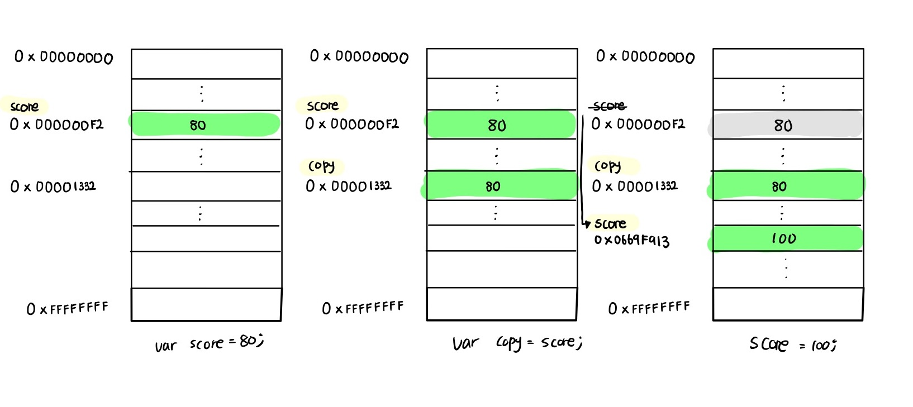

# 모던 자바스크립트 Deep Dive

## 들어가며

위 글은 모던 자바스크립트 Deep Dive를 공부하며, 중요한 부분과 계속해서 두고 볼 부분을 정리한 글입니다. 앞서서도 다른 readme를 통해 다양한 js 관련 책을 읽어보고 공부해봤지만, 개념적인 측면이나 js의 동작 관련해서 저의 궁금증을 시원하게 해결하지 못하여 이렇게 다시 한 번 공부하고 있습니다. 21년 9월 (마지막 방학) 이전까지 1회독을 통해 한 번 정리하는 것이 목표이며, 후에는 꾸준히 공부한 내용을 바탕으로 다회독할 예정입니다. js에 대한 정리와 개념이 아예 없던 것이 아니기 때문에, 이전 내용과 비교하여 필요한 내용을 정리할 예정입니다. 주요 키워드를 통해 TIL readme에서 쉽게 찾아볼 수 있도록 링크를 통해 관리하도록 하겠습니다.

## 목차

## 1장 프로그래밍

> keyword: 프로그래밍, 기계어, 컴파일러, 인터프리터, 프로그래밍 언어, 자연어, 인공어

### 1.1 프로그래밍이란?

<p>프로그래밍이란 컴퓨터에게 실행을 요구하는 일종의 커뮤니케이션이다. 해결해야 할 문제(요구사항)를 명확히 이해한 후 적절한 문제 해결 방안을 정의할 필요가 있다. 이때 요구되는 것이 문제 해결 능력이다. 문제 해결 능력을 알고리즘과 동일시하려는 경향이 있지만 반드시 그런 것은 아니다. 물론 문제 해결 능력을 함양하는 데 알고리즘 학습은 큰 도움이 되지만 문제 해결 능력은 더 큰 차원의 능력이다. 대부분의 문제(요구사항)는 복잡하며 명확하지 않을 수도 있다. 따라서 문제를 명확히 이해하는 것이 우선이 되어야 하며 복잡함을 단순하게 분해하고 자료를 정리하고 구분해야 하며 순서에 맞게 배열해야 한다.</p>

<p>즉, 프로그래밍이란 0과 1밖에 알지 못하는 기계가 실행할 수 있을 정도로 정확하고 상세하게 요구를 설명하는 작업이며, 그 결과물이 바로 코드다.</p>

### 1.2 프로그래밍 언어

<p>문제 해결 능력을 바탕으로 정의된 문제의 해결 방안은 컴퓨터에게 전달되어야 한다. 이때 명령을 수행할 주체는 컴퓨터이다. 따라서 사람이 이해할 수 있는 자연어가 아니라 컴퓨터가 이해할 수 있는 언어, 즉 기계어로 명령을 전달해야 한다. 하지만 사람이 기계어로 직접 명령을 전달하는 것은 매우 어려운 일이다. 기계어는 우리가 사용하는 언어와는 너무나도 체계가 다르기 때문이다. 기계어로 직접 명령을 전다하는 것을 대신할 가장 유용한 대안은 사람이 애해할 수 있는 약속된 구문으로 구성된 프로그래밍 언어를 사용해 프로그램을 작성한 후, 그것을 컴퓨터가 이해할 수 있는 기계어로 변환하는 일종의 번역기를 이용하는 것이다. 이 일종의 번역기를 컴파일러(compiler) 혹은 인터프리터(interpreter)라고 한다.</p>

<p>언어는 자신의 생각을 상대에게 전달하는 방법으로 언어 공동채 내에서 이해될 수 있는 말의 집합이다. 언어는 자연어와 인공어로 구분할 수 있다. 프로그래밍 언어란 컴퓨터와의 대화(명령)에 사용되는 일종의 표현 수단으로, 사람과 컴퓨터(컴파일러 또는 인터프리터) 모두가 이해할 수 있는 약속된 형태의 인공어이다.</p>

## 2장 자바스크립트란

### 2.1 자바스크립트의 탄생

<p>1995년, 약 90%의 시장 점유율로 웹 브라우저 시장을 지배하고 있는 넷스케이프 커뮤니케이션즈는 웹페이지의 보조적인 기능을 수행하기 위해 브라우저에서 동작하는 경량 프로그래밍 언어를 도입하기로 결정한다. 그래서 탄생한 것이 바로 브랜던 아이크가 개발한 자바스크립트이다. 자바스크립트는 1996년 3월, 넷스케이프 커뮤니케이션즈의 웹 브라우저인 '넷스케이프 내비게이터2'에 탑재되었고 '모카(Mocha)'로 명명되었다. 그러다 그해 9월 라이브스크립트(LiveScript)로 이름이 바뀌었다가 12월에 자바스크립트(JavaScript)라는 이름으로 최종 명명되었다.</p>

### 2.3 자바스크립트 성장의 역사

<p>초창기 자바스크립트는 웹페이지의 보조적인 기능을 수행하기 위해 한정적인 용도로 사용되었다. 이 시기에 대부분의 로직은 주로 웹 서버에서 실행되었고, 브라우저는 서버로부터 전달받은 HTML과 CSS를 단순히 렌더링하는 수준이었다.</p>

> 렌더링: 렌더링이란 HTML, CSS, JS로 작성된 문서를 해석해서 브라우저에 시각적으로 출력하는 것을 말한다. 때로는 서버에서 데이터를 HTML로 변환해서 브라우저에게 전달하는 과정(SSR: Server Side Rendering)을 가리키기도 한다.

### Ajax

<p>1999년, 자바스크립트를 이용해 서버와 브라우저가 비동기방식으로 데이터를 교환할수 있는 통신 기능인 Ajax(Asynchronous JavaScript and XML)가 'XMLHttpRequest'라는 이름으로 등장했다. 이전의 웹페이지는 html 태그로 시작해서 html 태그로 끝나는 완전한 HTML 코드를 서버로부터 새로운 HTML을 전송받아 웹페이지 전체를 처음부터 다시 렌더링했다. 하지만, Ajax가 등장하면서 이전의 패러다임을 획기적으로 전환했다. 즉, 웹페이지에서 변경할 필요가 없는 부분은 다시 렌더링하지 않고, 서버로부터 필요한 데이터만 전송받아 변경해야 하는 부분만 한정적으로 렌더링하는 방식이 가능해진 것이다. 이로써 웹 브라우저에서도 데스크톱 애플리케이션과 유사한 빠른 성능과 부드러운 화면 전환이 가능해졌다.</p>

### V8 자바스크립트 엔진

<p>2008년 등장한 구글의 V8 자바스크립트 엔진은 더욱 빠르게 동작하는 요구에 부합하는 빠른 성능을 보여주었다. V8 자바스크립트 엔진의 등장으로 자바스크립트는 데스크톱 애플리케이션과 유사한 사용자 경험(UX)을 제공할 수 있는 웹 애플리케이션 프로그래밍 언어로 정착하게 되었다. V8 자바스크립트 엔진으로 촉발된 자바스크립트의 발전으로 과거 웹 서버에서 수행되던 로직들이 대거 클라이언트(브라우저)로 이동했고, 이는 웹 애플리케이션 개발에서 프런트엔드 영역이 주목받는 계기로 작용했다.</p>

### Node.js

<p>2009년, 라이언 달이 발표한 Node.js는 구글 V8 자바스크립트 엔진으로 빌드된 자바스크립트 런타임 환경이다. Node.js는 브라우저의 자바스크립트 엔진에서만 동작하던 자바스크립트를 브라우저 이외의 환경에서도 동작할 수 있도록 자바스크립트 엔진을 브라우저에서 독립시킨 자바스크립트 실행 환경이다. Node.js는 다양한 플랫폼에 적용할 수 있지만 서버 사이드 애플리케이션 개발에 주로 사용되며, 이에 필요한 모듈, 파일 시스템, HTTP 등 빌트인 API를 제공한다.</p>

<p>Node.js는 자바스크립트 엔진을 기반으로 하므로 Node.js 환경에서 동작하는 애플리케이션은 자바스크립트를 사용해 개발한다. 프런트와 백 영역 모두에서 자바스크립트를 사용할 수 있다는 동형성은 별도의 언어를 학습하기 위한 시간을 덜 수 있다는 장점이 있다. Node.js는 비동기 I/O를 지원하며 단일 스레드 이벤트 루프 기반으로 동작함으로써 요청 처리 성능이 좋다. 따라서 Node.js는 데이터를 실시간으로 처리하기 위해 I/O가 빈번하게 발생하는 SPA에 적합하다.</p>

### SPA 프레임워크

<p>모던 웹 애플리케이션은 데스크톱 애플리케이션과 비교해도 손색없는 성능과 사용자 경험을 제공하는 것이 필수가 되었고, 더불어 개발 규모의 복잡도도 상승했다. 이전의 개발 방식으로는 복잡해진 개발 과정을 수행하기 어려워졌고, 이러한 필요에 따라 많은 패턴과 라이브러리가 출현했다. 이러한 요구에 발맞춰 CBD(Component Base Development)방법론을 기반으로 하는 SPA(Single Page Application)가 대중화되면서 다양한 SPA 프레임워크/라이브러리 또한 많은 사용층을 확보하고 있다.</p>

### 2.4 자바스크립트와 ECMAScript

<p>ECMAScript는 자바스크립트의 표준 사양인 ECMA-262를 말하며, 프로그래밍 언어의 값, 타입, 객체와 프로퍼티, 함수, 표준 빌트인 객체 등 핵심 문법을 규정한다. 각 브라우저 제조사는 ECMAScript 사양을 준수해서 브라우저에 내장되는 자바스크립트 엔진을 구현한다. 자바스크립트는 일반적으로 프로그래밍 언어로서 기본 뼈대를 이루는 ECMAScript와 브라우저가 별도 지원하는 클라이언트 사이드 Web API, 즉 DOM, BOM, Canvas, XMLHttpRequest, fetch, requestAnimationFrame, SVG, Web Storage, Web Component, Web Worker 등을 아우르는 개념이다.</p>

### 2.5 자바스크립트의 특징

<p>자바스크립트는 HTML, CSS와 함께 웹을 구성하는 요소 중 하나로 웹 브라우저에서 동작하는 유일한 프로그래밍 언어다. 자바스크립트는 개발자가 별도의 컴파일 작업을 수행하지 않는 인터프리터 언어이다. 인터프리터는 소스코드를 즉시 실행하고 컴파일러는 빠르게 동작하는 머신 코드를 생성하고 최적화한다. 이를 통해 컴파일 단계에서 추가적인 시간이 필요함에도 더욱 빠르게 코드를 실행할 수 있다.</p>

<p>자바스크립트는 런타임에 컴파일되며 실행 파일이 생성되지 않고 인터프리터의 도움 없이 실행할 수 없기 때문에 컴파일러 언어라고 할 수는 없다.</p>

<p>자바스크립트는 명령형, 함수형, 프로토타입 기반 객체지향 프로그래밍을 지원하는 멀티 패러다임 프로그래밍 언어이다. 간혹 클래스, 상속, 정보 은닉을 위한 키워드가 없어서 객체지향 언어가 아니라고 오해하는 경우도 있지만 자바스크립트는 클래스 기반 객체지향 언어보다 효율적이면서 강력한 프로토타입 기반의 객체지향 언어이다.</p>

## 3장 자바스크립트 개발 환경과 실행 방법

### 3.1 자바스크립트 실행 환경

<p>모든 브라우저(크롬, 사파라, 익스플로러)는 자바스크립트를 해석하고 실행할 수 있는 자바스크립트 엔진을 내장하고 있다. 브라우저뿐만 아니라 Node.js도 자바스크립트 엔진을 내장하고 있다. 따라서 자바스크립트는 브라우저 환경 또는 Node.js 환경에서 실행할 수 있다.</p>

<p>그런데 한 가지 주의해야 할 점은 브라우저와 Node.js는 용도가 다르다는 것이다. 브라우저는 HTML, CSS, 자바스크립트를 실행해 웹페이지를 브라우저 화면에 렌더링하는 것이 주된 목적이지만 Node.js는 브라우저 외부에서 자바스크립트 실행 환경을 제공하는 것이 주된 목적이다. 따라서 브라우저와 Node.js 모두 자바스크립트의 코어인 ECMAScript를 실행할 수 있지만, 브라우저와 Node.js에서 ECMAScript 이외에 추가로 제공하는 기능은 호환되지 않는다.</p>


[출처: 모던 자바스크립트 Deep Dive]

## 4장 변수

### 4.1 변수란 무엇인가

<p>애플리케이션은 데이터를 다룬다. 아무리 복잡한 애플리케이션이라 해도 데이터를 입력(input)받아 처리하고 그 결과를 출력(output)하는 것이 전부다. 변수는 프로그래밍 언어에서 데이터를 관리하기 위한 핵심 개념이다.</p>

```
10 + 20
```

<p>자바스크립트 엔진이 10 + 20 이라는 식의 의미를 해석하면 + 연산을 수행하기 위해 먼저 + 연산자의 좌변과 우변의 숫자 값, 피연산자를 기억한다. 사람은 계산과 기억을 모두 두뇌에서 하지만, 컴퓨터는 연산과 기억을 수행하는 부분이 나눠져 있다. 컴퓨터는 CPU를 사용해 연산하고, 메모리를 사용해 데이터를 기억한다.</p>

<p>메모리는 데이터를 저장할 수 있는 메모리 셀의 집합체다. 메모리 셀 하나의 크기는 1바이트(8비트)이며, 컴퓨터는 메모리 셀의 크기, 즉 1바이트 단위로 데이터를 저장하거나 읽어들인다.</p>


<p>각 메모리 셀은 고유의 메모리 주소(address)를 갖는다. 이 메모리 주소는 메모리 공간의 위치를 나타내며, 0부터 시작해서 메모리의 크기만큼 정수로 표현된다. 4GB 메모리는 0부터 4,294,967,295(0x00000000~0xFFFFFFFF)까지의 메모리 주소를 갖는다.</p>

<p>위 예제의 숫자 값 10과 20은 메모리 상의 임의의 위치(메모리 주소)에 기억(저장)되고 CPU는 이 값을 읽어들여 연산을 수행한다. 연산 결과로 생성된 숫자 값을 편의상 10진수로 표기했다. 하지만 메모리에 저장되는 모든 값은 2진수로 저장된다는 것을 기억할 필요가 있다.</p>


<p>성공적으로 연산이 끝났고 연산 결과도 메모리에 저장되었지만, CPU가 만들어낸 숫자 값 30을 재사용할 수 없다. 10 + 20 연산 결과를 재사용하고 싶다면 메모리 주소를 통해 연산 결과 30이 저장된 메모리 공간에 직접 접근하는 것 외에는 방법이 없다. 하지만 메모리 주소를 통해 값에 직접 접근하는 것은 치명적 오류를 발생시킬 가능성이 높은 매우 위험한 일이다. 만약 실수로 운영체제가 사용하고 있는 값을 변경하면 시스템을 멈추게 하는 치명적인 오류가 발생할 수도 있다. 따라서 자바스크립트는 개발자의 직접적인 메모리 제어를 허용하지 않는다.</p>

<p>프로그래밍 언어는 기억하고 싶은 값을 메모리에 저장하고, 지정된 값을 읽어 들여 재사용하기 위해 변수라는 메커니즘을 제공한다. 변수의 정의를 내려보면 다음과 같다.</p>

```
변수는 하나의 값을 저장하기 위해 확보한 메모리 공간 자체 또는 그 메모리 공간을 식별하기 위해 붙인 이름을 말한다.
```

<p>간단히 말하자면 변수는 프로그래밍 언어에서 값을 저장하고 참조하는 메커니즘으로, 값의 위치를 가리키는 상징적인 이름이다. 변수는 프로그래밍 언어의 컴파일러 또는 인터프리터에 의해 값이 저장된 메모리 공간의 주소로 치환되어 실행한다. 따라서 개발자가 직접 메모리주소(0x0669F913)를 통해 값을 저장하고 참조할 필요가 없고 변수를 통해 안전하게 값에 접근할 수 있다.</p>

<p>앞서 살펴본 코드를 변수를 사용해 다시 작성해보자</p>

```js
var result = 10 + 20;
```

<p>10 + 20은 연산을 통해 새로운 값 30을 생성한다. 이때 메모리 공간에 저장된 값 30을 다시 읽어 들여 재사용할 수 있도록 값이 저장된 메모리 공간에 상징적인 이름을 붙인 것이 바로 변수이다.</p>


<p>메모리 공간에 저장된 값을 식별할 수 있는 고유한 이름(result)을 변수 이름(또는 변수명)이라고 한다. 그리고 변수에 저장된 값(30)을 변수 값이라고 한다. </p>

```
변수에 값을 저장하는 것을 할당(assignment)(대입, 저장)이라 하고, 변수에 저장된 값을 읽어 들이는 것을 참조(reference)라 한다.
```

<p>변수 이름은 사람을 위해 사람이 이해할 수 있는 언어로 값이 저장된 메모리 공간에 붙인 상징적인 이름이다. 변수 이름을 사용해 참조를 요청하면 자바스크립트 엔진은 변수 이름과 매핑된 메모리 주소를 통해 메모리 공간에 접근해서 저장된 값을 반환한다.</p>

### 4.2 식별자

<p>변수 이름을 식별자(identifier)라고도 한다. 식별자는 어떤 값을 구별해서 식별할 수 있는 고유한 이름을 말한다. 그림에서 식별자 result는 값 30을 식별할 수 있었다. 이를 위해 식별자 result는 값 30이 저장되어 있는 메모리 주소 0x0669F913을 기억해야 한다. 즉, 식별자는 값이 저장되어 있는 메모리 주소와 매핑 관계를 맺으며, 이 매핑 정보도 메모리에 저장되어야 한다.</p>

<p>이처럼 식별자는 값이 아니라 메모리 주소를 기억하고 있다. 식별자라는 용어는 변수 이름에만 국한해서 사용하지 않는다. 예를 들어, 변수, 함수, 클래스 등의 이름은 모두 식별자다. 식별자인 변수 이름으로는 메모리 상에 존재하는 변수 값을 식별할 수 있고, 함수 이름으로는 메모리 상에 존재하는 함수를 식별할 수 있다. 즉, 메모리 상에 존재하는 어떤 값을 식별할 수 있는 이름은 모두 식별자라고 부른다.</p>

<p>변수, 함수, 클래스 등의 이름과 같은 식별자는 네이밍 규칙을 준수해야 하며, 선언(declaration)에 의해 자바스크립트 엔진에 식별자의 존재를 알린다.</p>

### 4.3 변수 선언

<p>변수 선언이란 변수를 생성하는 것을 말한다. 좀 더 자세히 말하면 값을 저장하기 위한 메모리 공간을 확보하고 변수 이름과 확보된 메모리 공간의 주소를 연결해서 값을 저장할 수 있게 준비하는 것이다. 변수를 사용하려면 반드시 선언이 필요하다. 변수를 선언할 때는 var, let, const 키워드를 사용한다. ES6에서 let, const 키워드가 도입되기 이전까지 var 키워드는 자바스크립트에서 변수를 선언할 수 있는 유일한 키워드였다.</p>

<p>아직 살펴보지 않았지만 var 키워드는 여러 단점이 있다. var 키워드의 여러 단점 중에서 가장 대표적인 것이 블록 레벨 스코프를 지원하지 않고 함수 레벨 스코프를 지원한다는 것이다. 이로 인해 의도치 않게 전역 변수가 선언되어 심각한 부작용이 발생하기도 한다. (이를 막기 위해 클로저라는 개념이 도입되었다)</p>

### 키워드

```js
var score;
```

<p>var 키워드는 뒤에 오는 변수 이름을 새로운 변수를 선언할 것을 지시하는 키워드이다. 키워드는 자바스크립트 코드를 해석하고 실행하는 자바스크립트 엔진이 수행할 동작을 규정한 일종의 명령어이다. 자바스크립트 엔진은 키워드를 만나면 자신이 수행해야 할 약속된 동작을 수행한다. 예를 들어, var 키워드를 만나면 자바스크립트 엔진은 뒤에 오는 변수 이름으로 새로운 변수를 선언한다.</p>

<p>변수를 선언한 이후, 아직 변수에 값을 할당하지 않았다. 따라서 변수 선언에 의해 확보된 메모리 공간은 비어 있을 것으로 생각할 수 있으나 확보된 메모리 공간에는 자바스크립트 엔진에 의해 undefined라는 값이 암묵적으로 할당되어 초기화된다. 이것이 자바스크립트의 독특한 특징이다.</p>

<p>자바스크립트 엔진은 변수 선언을 다음과 같은 2단계에 거쳐 수행한다.</p>

```
선언 단계: 변수 이름을 등록해서 자바스크립트 엔진에 변수의 존재를 알린다.
초기화 단계: 값을 저장하기 위한 메모리 공간을 확보하고 암묵적으로 undefined를 할당해 초기화한다.
```

> 변수 이름은 어디에 등록되는가?

<p>변수 이름을 비롯한 모든 식별자는 실행 컨텍스트에 등록된다. 실행 컨텍스트는 자바스크립트 엔진이 소스코드를 평가하고 실행하기 위해 필요한 환경을 제공하고 코드와 실행 결과를 실제로 관리하는 영역이다. 자바스크립트 엔진은 실행 컨텍스트를 통해 식별자와 스코프를 관리한다.</p>

<p>var 키워드를 사용한 변수 선언은 선언 단계와 초기화 단계가 동시에 진행된다. var score;는 선언 단계를 통해 변수 이름 score를 등록하고, 초기화 단계를 통해 score 변수에 암묵적으로 undefined를 할당해 초기화한다.</p>

<p>일반적으로 초기화(initialization)란 변수가 선언된 이후 최초로 값을 할당하는 것을 말한다. 만약 초기화 단계를 거치지 않으면 확보된 메모리 공간에는 이전에 다른 애플리케이션이 사용했던 값이 남아 있을 수 있다. 이러한 값을 쓰레기 값(garbage value)이라 한다. 따라서 메모리 공간을 확보한 다음, 값을 할당하지 않은 상태에서 곧바로 변수 값을 참조하면 쓰레기 값이 나올 수 있다. 자바스크립트의 var 키워드는 암묵적으로 초기화를 수행하므로 이러한 위험으로부터 안전하다.</p>

### 4.4 변수 선언의 실행 시점과 변수 호이스팅

<p>다음 문장을 살펴보자</p>

```js
console.log(score); // undefined;

var score; // 변수 선언문
```

<p>변수 선언문보다 변수를 참조하는 코드가 앞에 있다 자바스크립트 코드는 인터프리터에 의해 한 줄씩 순차적으로 실행되므로 console.log(score);가 가장 먼저 실행되고 순차적으로 다음 줄에 있는 코드를 실행한다. 따라서 console.log(score);가 실행되는 시점에는 아직 score 변수의 선언이 실행되지 않았으므로 참조 에러가 발생할 것처럼 보인다. 하지만 참조 에러가 발생하지 않고 undefined가 출력된다. 그 이유는 변수 선언이 소스코드가 한 줄씩 순차적으로 실행되는 시점, 즉 런타임이 아니라 그 이전 단께에서 먼저 실행되기 때문이다.</p>

<p>자바스크립트 엔진은 소스코드를 한 줄씩 순차적으로 실행하기에 앞서 먼저 소스코드의 평가 과정을 거치면서 소스코트를 실행하기 위한 준비를 한다. 이때 소스코드 실행을 위한 평가 과정에서 자바스크립트 엔진은 변수 선언을 포함한 모든 선언문(변수 선언문, 함수 선언문 등)을 소스코드에서 찾아내 먼저 실행한다. 그리고 소스코듸 평과 가정이 끝나면 비로소 변수 선은을 포함한 모든 선언물을 제외하고 소스코드를 한 줄씩 순차적으로 실행한다.</p>

> REPL (Read Eval Print Loop) 단계를 거친다.

<p>즉, js 엔진은 변수 선언이 소스코드의 어디에 있든 상관없이 다른 코드보다 먼저 실행한다. 따라서 변수 선언이 소스코드의 어디에 위치하던지와 상관없이 어디서든지 변수를 참조할 수 있다. 이러한 특징을 변수 호이스팅이라 한다.</p>

<p>사실 변수 선언뿐 아니라 var, let, const, function, function*, class 키워드를 사용해서 선언하는 모든 식별자(변수, 함수, 클래스 등)는 호이스팅된다. 모든 선언문은 런타임 이전 단계에서 먼저 실행되기 때문이다.</p>

### 4.5 값의 할당

<p>변수에 값을 할당 assignment(대입, 저장)할 때는 할당 연산자 = 를 사용한다. 할당 연산자는 우변의 값을 좌변의 변수에 할당한다.</p>

```js
var score; // var 키워드를 통해 변수 score 선언, 초기화
score = 80; // score 변수에 값 80 할당

var score = 80; // 변수를 선언과 동시에 초기화
```

<p> 변수 선언과 값의 할당을 2개의 문으로 나누어 표현한 코드와 변수 선언과 값의 할당을 하나의 문으로 단축 표현한 코드는 정확히 동일하게 동작한다. 즉, js 엔진은 변수 선언과 값의 할당을 하나의 문으로 단축 표현해도 변수 선언과 값의 할당을 2개의 문으로 나누어 각각 실행한다. 이때 주의할 점은 변수 선언과 값의 할당의 실행 시점이 다르다는 것이다. 변수 선언은 소스코드가 순차적으로 실행되는 시점인 '런타임' 이전에 먼저 실행되지만 값의 할당은 소스코드가 순차적으로 실행되는 시점인 '런타임'에 실행된다.</p>


<p>변수의 선언과 값의 할당을 하나의 문장으로 단축 표현해도 자바스크립트 엔진은 변수의 선언과 값의 할당을 2개의 문으로 나누어 각각 실행한다. 따라서 변수에 undefined가 할당되어 초기화되는 것은 변함이 없다.</p>

> 그림처럼 변수에 값을 할당하고 재 할당할 때는 이전 값 undefined가 저장되어 있던 메모리 공간을 지우고 그 메모리 공간에 할당 값 80을 새롭게 저장하는 것이 아니라 새로운 메모리 공간을 확보하고 그곳에 할당 값 80을 저장한다는 점에 주의하자

<p>이러한 불필요한 값들은 가비지 콜렉터에 의해 메모리에서 자동 해제된다. 단, 메모리에서 언제 해제될지는 예측할 수 없다.</p>

### 가비지 콜렉터

<p>가비지 콜렉터는 애플리케이션이 할당한 메모리 공간을 주기적으로 검사하여 더 이상 사용되지 않는 메모리를 해제하는 기능을 말한다. 더 이상 사용되지 않는 메모미란 간단히 말하자면 어떤 식별자도 참조하지 않는 메모리 공간을 의미한다. 자바스크립트는 가비지 콜렉터를 내장하고 있는 매니지드 언어로서 가비지 콜렉터를 통해 메모리 누수를 방지한다.</p>

### 4,7 식별자 네이밍 규칙

```
식별자는 특수문자를 제외한 문자, 숫자, 언더스코어(_), 달러 기호($)를 포함할 수 있다.
단 식별자는 특수문자를 제외한 문자, 언더스코어(_), 달러 기호로 시작해야 한다. 숫자로 시작하는 것은 허용하지 않는다.
```

### 네이밍 컨벤션

<p>네이밍 컨벤션은 하나 이상의 영어 단어로 구성된 식별자를 만들 때 가독성 좋게 단어를 한눈에 구분하기 위해 규정한 명명 규칙이다.</p>

```js
// 카멜 케이스 (camelCase)
var firstName;

// 스네이크 케이스 (snake_case)
var first_name;

// 파스칼 케이스 (PascalCase)
var FirstName;

// 헝가리언 케이스 (typeHungarianCase)
var strFirstName; // type + identifier
var $elem = document.getElementById("myId"); // DOM 노드
var observable$ = fromEvent(document, "click"); // RxJS 옵저버블
```

<p>ECMAScript 사양에 정의되어 있는 객체와 함수들도 카멜 케이스와 파스칼 케이스를 사용하고 있다. 따라서 코드 전체의 가독성을 높이려면 카멜 케이스와 파스칼 케이스를 따르는 것이 유리하다.</p>

## 5장 표현식과 문

<p>지금까지 살펴본 내용에서 '값'이라는 용어가 자주 등장했다. '값'이라는 용어를 알고 있다고 생각하겠지만 막상 설명하려 하면 난감할 수 있다. 개념을 이해한다는 것은 바로 용어를 정확히 이해하고 설명할 수 있다는 것이다.</p>

## 5.1 값

<p>값,value은 식(표현식, expression)이 평가, evaluate되어 생성된 결과를 말한다. '평가'란 시을 해석해서 값을 생성하거나 참조하는 것을 의미한다.</p>

```js
// 10 + 20은 평가되어 숫자 값 30을 생성한다.

10 + 20; //30

var sum = 10 + 20;
```

<p>모든 값은 데이터 타입을 가지며, 메모리에 2진수, 즉 비트의 나열로 저장된다. 메모리에 저장된 값은 데이터 타입에 따라 다르게 해석될 수 있다. 예를 들어, 메모리에 저장된 값 0100 0001을 숫자로 해석하면 65지만 문자로 해석하면 'A'이다. 변수는 하나의 값을 저장하기 위해 확보한 메모리 공간 자체 또는 그 메모리 공간을 식별하기 위해 붙인 이름이다. 따라서 변수에 할당되는 것은 값(30)이다.</p>

<p>값은 다양한 방법으로 생성할 수 있다. 위 예제처럼 식으로 생성할 수도 있지만 가장 기본적인 방법은 리터럴을 사용하는 것이다.</p>

## 5.2 리터럴

<p>리터럴,literal은 사람이 이해할 수 있는 문자 또는 약속된 기호를 사용해 값을 생성하는 표기법,notation 을 말한다.</p>

```
// 숫자 리터럴 3
3
```

<p>위 예제의 3은 단순한 아라비아 숫자가 아니라 숫자 리터럴이다. 사람이 이해할 수 있는 아라비아 숫자를 사용해 숫자 리터럴 3을 코드에 기술하면 자바스크립트 엔진은 이를 평가해 숫자 값 3을 생성한다. 자바스크립트 엔진은 코드가 실행되는 시점인 '런타임;에 리터럴을 평가해 값을 생성한다.</p>

## 5.3 표현식

<p>표현식,expression은 값으로 평가될 수 있는 문,statement이다. 즉, 표현식이 평가되면 새로운 값을 생성하거나 기존 값을 참조한다.</p>

```js
var score = 100;
```

<p>위 예제의 100은 리터럴이다. 리터럴 100은 자바스크립트 엔진에 의해 평가되어 값을 생성하므로 리터럴은 그 자체로 표현식이다. 다른 예제를 살펴보자</p>

```js
var score = 50 + 50;

score; // 100
```

<p>변수 식별자(score)를 참조하면 변수 값으로 평가된다. 식별자 참조는 값을 생성하지느 않지만 값으로 평가되므로 표현식이다. 이처럼 표현식은 리터럴, 식별자(변수, 함수 등의 이름), 연산자, 함수 호출 등의 조합으로 이뤄질 수 있다. 다음과 같이 다양한 표현식이 있지만 값으로 평가된다는 점에서 모두 동일하다. 즉, 값으로 평가될 수 있는 문은 모두 표현식이다.</p>

```js
// 리터럴 표현식
10;
("Hello");

// 식별자 표현식(선언이 이미 존재한다고 가정)
sum;
person.name;
arr[1];

// 연산자 표현식
10 + 20;
sum = 10;
sum !== 10;

// 함수/메서드 호출 표현식(선언이 이미 존재한다고 가정)
square();
person.getName();
```

## 5.4 문

<p>문,statement은 프로그램을 구성하는 기본 단위이자 최소 실행 단위다. 문의 집합으로 이뤄진 것이 바로 프로그램이며, 문을 작성하고 순서에 맞게 나열하는 것이 프로그래밍이다.문은 여러 토큰으로 구성된다. 토큰,token이란 문법적인 의미를 가지며, 문법적으로 더 이상 나눌 수 없는 코드의 기본 요소를 의미한다.</p>


<p>문을 명령 문이라고도 부른다. 즉, 문은 컴퓨터에 내리는 명령이다. 문은 선언문, 할당문, 조건문, 반복문 등으로 구분할 수 있다. 변수 선언문을 실행하면 변수가 선언되고, 항당문을 실행하면 값이 할당된다. 조건문을 실행하면 지정한 조건에 따라 실행할 코드 블록이 결정되어 실행되고, 반복문을 실행하면 특정 코드 블록이 반복 실행된다.</p>

```js
// 변수 선언문
var x;

// 표현식 문(할당문)
x = 5;

// 함수 선언문
function foo() {}

// 조건문
if (x > 1) {
  console.log(x);
}

// 반복문
for (var i = 0; i < 2; i++) {
  console.log(i);
}
```

## 5.6 표현식인 문과 표현식이 아닌 문

> 표현식은 문의 일부일 수도 있고 그 자체로 문이 될 수도 있다.

```js
case 1:
var x; // 변수 선언문은 값으로 평가될 수 없으므로 표현식이 아니다.

case 2:
x = 1 + 2;
// 1, 2, 1 + 2, x = 1 + 2는 모두 표현식이다.
// x = 1 + 2는 표현식이면서 완전한 문이기도 하다.
```

<p>표현식과 문은 비슷해서 구별하기 어렵다고 느낄 수 있다. 하지만 표현식과 문을 구별하는 방법은 의외로 간단하다.</p>

<p>문에는 표현식인 문과 표현식이 아닌 문이 있다.</p>

```js
case 1: 표현식인 문 > 값으로 평가될ㄹ 수 있는 문 (할당문)
var x = 1;

case 2: 표현식이 아닌 문 > 값으로 평가될 수 없는 문 (변수 선언문)
var x;
```

## 11장 원시 값과 객체 비교

<p>자바스크립ㅌ트가 제공하는 7가지 데이터 타입(숫자, 문자열, 불리언, null, undefined, 심벌, 객체 타입)은 크게 윈시 타입과 객체 타입으로 구분할 수 있다. 데이터 타입을 원시 타입과 객체 타입으로 구분하는 이유는 무엇일까? 원시 타입과 객체 타입을 크게 세 가지 측면에서 나눌 수 있다.</p>

```
1. 원시 타입의 값, 즉 원시 값은 변경 불가능한 값(immutable value)이다. 이에 비해 객체(참조)타입의 값, 즉 객체는 변경 가능한 값(mutable value)이다.

2. 원시 값을 변수에 할당하면 변수(확보된 메모리 공간)에는 실제 값(100, 실제로는 2진수)이 저장된다. 이에 비해 객체를 변수에 할당하면 변수(확보된 메모리 공간)에는 참조 값(메모리 주소, 0x00000613)이 저장된다.

3. 원시 값을 갖는 벼수를 다른 변수에 할당하면 원본의 원시 값이 복사되어 전달된다. 이를 값에 의한 전달이라 한다. 이에 비해 객체를 가리키는 변수를 다른 변수에 할당하면 원본의 참조 값(메모리 주소, 0x00000613)이 복사되어 전달된다. 이를 참조에 의한 전달이라 한다.

```

### 11.1 원시 값

> 변경 불가능한 값

<p>원시 타입의 값, 즉 원시 값은 변경 불가능한 값이다. 다시 말해, 한 번 생성된 원시 값은 읽기 전용 값으로서 변경할 수 없다. 값을 변경할 수 없다는 것은 무엇을 의미할까? 먼저 변수와 값을 구분해서 생각해야 한다. 변수는 하나의 값을 저장하기 위해 확보한 메모리 공간 자체 또는 그 메모리 공간을 식별하기 위해서 붙인 이름이고, 값은 변수에 저장된 데이터로서 표현식이 평가되어 생성된 결과를 말한다. 변경 불가능하다는 것은 '변수'가 아니라 '값'에 대한 진술이다.</p>

<p>원시 값은 변경 불가능한 값, 즉 읽기 전용 값이다. 원시 값은 어떤 일이 있어도 불변한다. 이러한 원시 값의 특성은 데이터의 신뢰성을 보장한다. 앞서 살펴보았듯이 원시 값을 할당한 변수에 새로운 원시 값을 재할당하면 메모리 공간에 저장되어 있는 재할당 이전의 원시 값을 변경하는 것이 아니라 새로운 메모리 공간을 확보하고 재할당한 원시 값을 저장한 후, 변수는 새롭게 재할당한 원시 값을 가리킨다. 이떄 변수가 참조하던 메모리 공간의 주소가 바뀐다.</p>

```
원시 값(100)은 변경이 불가능하고 변수에 또다른 원시 값(80)을 재할당한다는 느낌이다
```


<p>만약 원시 값이 변경 가능한 값이라면 변수에 새로운 원시 값을 재할당했을 때 변수가 가리키던 메모리 공간의 주소를 바꿀 필요없이 원시 값 자체를 변경하면 그만이다. 만약 그렇다면 변수가 참조하던 메모리 공간의 주소는 바뀌지 않는다.</p>


<p>하지만 원시 값은 변경 불가능한 값이기 때문에 값을 직접 변경할수 없다. 따라서 변수값을 변경하기 위해 원시 값을 재할당하면 새로운 메모리 공간을 확보하고 재할당한 값을 저장한 후, 변수가 참조하던 메모리 공간의 주소를 변경한다. 이러한 특성을 불변성이라 한다. 불변성을 갖는 원시 값을 할당한 변수는 재할당 이외에 변수 값을 변경할 수 있는 방법이 없다.</p>

> 문자열과 불변성

<p>원시 값을 저장하려면 먼저 확보해야 하는 메모리 공간의 크기를 결정해야 한다. 이를 위해 원시 타입별로 메모리 공간의 크기가 미리 정해져 있다고 했다. 단, ECMAScript 사양에 문자열 타입(2바이트)과 숫자 타입(8바이트) 이외의 원시 타입의 크기를 명확히 규정하고 있지는 않다. 문자열은 0개 이상의 문자로 이루어진 집합을 말하며, 1개의 문자는 2바이트의 메모리 공간에 저장된다. 숫자 값은 1도, 1000000도 동일한 8바이트가 필요하지만 문자열의 경우는 문자의 수에 따라 필요한 바이트 수가 다르다.</p>

```js
// 문자열은 0개 이상의 문자로 이뤄진 집합이다.
var str1 = ""; // 0개의 문자로 이루어진 문자열(빈 문자열 2바이트 필요)
var str2 = "hello"; // 5개의 문자로 이뤄진 문자열 (10 바이트 필요)
```

<p>자바스크립트는 개발자의 편의를 위해 원시 타입인 문자열 타입을 제공한다. 이는 자바스크립트의 장점 중 하나다. 문자열은 유사 배열 객체이면서 이터러블이므로 배열과 유사하게 각 문자에 접근할 수 있다.</p>

> 유사 배열 객체

<p>유사 배열 객체란 마치 배열처럼 인덱스로 프로퍼티 값에 접근할 수 있고 length 프로퍼티를 갖는 객체를 말한다. 문자열은 마치 배열처럼 인덱스를 통해 각 문자에 접근할 수 있으며, length 프로퍼티를 갖기 때문에 유사 배열 객체이고 for문, for of 문 등으로 순회할 수 있다.</p>

```js
var str = "string";

// 문자열은 유사 배열이므로 배열과 유사하게 인덱스를 사용해 각 문자에 접근할 수 있다.
console.log(str[0]);

// 원시 값인 문자열이 객체처럼 동작한다.
console.log(str.length); // 6
console.log(str.toUpperCase()); // STRING
```

<p>원시 값인 문자열이 객체일 수도 있다니 혼란스러울 수 있다. 원시 값을 객체처럼 사용하면 원시 값을 감싸는 래퍼 객체로 자동 변환한다. 후에 21장에서 알아본다.</p>

```js
var str = "string";

// 문자열은 유사 배열이므로 배열과 유사하게 인덱스를 사용해 각 문자에 접근할 수 있다.
// 하지만 문자열은 원시 값이므로 변경할 수 없으며, 이때 에러가 발생하지 않는다.
str[0] = "S";

console.log(str); // string
```

> 값에 의한 전달

```js
var score = 80;
var copy = score;

console.log(score); // 80
console.log(copy); // 80

score = 100;

console.log(score); // 100
console.log(copy); // ?
```

<p>score 변수에 숫자 값 80을 할당했다. 그리고 copy 변수에 score 변수를 할당했다. score 변수에 새로운 숫자 값 100을 재 할당하면 copy 변수의 값은 어떻게 될까? </p>

<p>변수에 원시 값을 갖는 변수를 할당하면 할당받는 변수(copy)에는 할당하는 변수(score)의 원시 값이 복사되어 전달된다. 이를 '값에 의한 전달'이라 한다.</p>

```js
var score = 80;

// copy 변수에는 score 변수의 값 80이 복사되어 할당된다.
var copy = score;

console.log(score, copy); // 80  80
console.log(score === copy); // true
```

<p>결론을 말하자면 score 변수와 copy 변수는 숫자 값 80을 갖는다는 점에서 동일하다. 하지만 score 변수와 copy 변수의 값 80은 다른 메모리 공간에 저장된 별개의 값이다.</p>


<p>이제 score 변수에 값을 재할당해보자</p>

```js
var score = 80;

// copy 변수에는 score 변수의 값 80이 복사되어 할당된다.
var copy = score;

console.log(score, copy); // 80  80
console.log(score === copy); // true

// score 변수와 copy 변수의 값은 다른 메모리 공간에 저장된 별개의 값이다.
// 따라서 score 변수의 값을 변경해도 copy 변수의 값에는 어떠한 영향도 주지 않는다.
score = 100;

console.log(score, copy); // 100  80
console.log(score === copy); // false
```

<p>score 변수와 copy 변수의 값 80은 다른 메모리 공간에 저장된 별개의 값이라는 것에 주의하기 바란다. 따라서 score 변수의 값을 변경해도 copy 변수의 값에는 어떠한 영향도 주지 않는다.</p>



<p>'값에 의한 전달'이라는 용어도 ECMAScript 사양에는 등장하지 않는다. '값에 의한 전달'이라는 용어는 엄격하게 표현하면 변수에는 값이 전달되는 것이 아니라 메모리 주소가 전달되기 때문이다. 이는 변수와 같은 식별자는 값이 아니라 메모리 주소를 기억하고 있기 때문이다. 전달된 메모리 주소를 통해 메모리 공간에 접근하면 값을 참조할 수 있다. 결국은 두 변수의 원시 값은 서로 다른 메모리 공간에 저장된 별개의 값이 되어 어느 한쪽에서 재할당을 통해 값을 변경하더라도 서로 간섭할 수 없다는 것이다.</p>

### 11.2 객체

<p>객체는 프로퍼티의 개수가 정해져 있지 않으며, 동적으로 추가되고 삭제할 수 있다. 또한 프로퍼티의 값에도 제약이 없다. 따라서 객체는 원시 값(문자열 2바이트*문자, 숫자 8바이트)과 같이 확보해야 할 메모리 공간의 크기를 사전에 정해 둘 수 없다. 원시 값과는 다른 방식으로 동작하는 객체에 대해 알아보자</p>

> 자바스크립트 객체의 관리 방식

<p>자바스크립트 객체는 프로퍼티 키를 인덱스로 사용하는 해시 테이블이라고 생각할 수 있다. 대부분의 자바스크립트 엔진은 해시 테이블과 유사하지만 높은 성능을 위해 일반적인 해시 테이블보다 나은 방법으로 객체를 구현한다. 자바, C++과 같은 클래스 기반 객체지향 프로그래밍 언어는 사전에 정의된 클래스를 기반으로 객체(인스턴스)를 생성한다. 객체가 생성된 이후에는 프로퍼티를 삭제하거나 추가할 수 없다. 하지만 자바스크립트는 클래스 없이 객체를 생성할 수 있으며 객체가 생성된 이후라도 동적으로 프로퍼티와 메서드를 추가할 수 있다.</p>

> 변경 가능한 값

<p>객체(참조)타입의 값, 즉 객체는 변경 가능한 값(mutable value)이다.</p>

```js
var person = {
  name: "Lee",
};
```

<p>원시 값을 할당한 변수가 기억하는 메모리 주소를 통해 메모리 공간에 접근하면 원시 값에 접근할 수 있다. 즉 원시 값을 할당한 변수는 원시 값 자체를 값으로 갖는다. 하지만 객체를 할당한 변수가 기억하는 메모리 주소를 통해 메모리 공간에 접근하면 참조 값(reference value)에 접근할 수 있다. 참조 값은 생성된 객체가 저장된 메모리 공간의 주소, 그 자체이다.</p>

<p>다음 그림을 보면 객체를 할당한 변수에는 생성된 객체가 실제로 저장된 메모리 공간의 주소가 저장되어 있다. 이 값을 참조 값이라고 한다. 변수는 이 참조 값을 통해 객체에 접근할 수 있다.</p>


<p>원시 값을 할당한 변수를 참조하면 메모리에 저장되어 있는 원시 값에 접근한다. 하지만 객체를 할당한 변수를 참조하면 메모리에 저장되어 있는 참조 값을 통해 실제 객체에 접근한다.</p>

<p>원시 값은 변경 불가능한 값이므로 원시 값을 갖는 변수의 값을 변경하려면 재할당 외에는 방법이 없다. 하지만 객체는 변경 가능한 값이다. 따라서 객체를 할당한 변수는 재할당 없이 객체를 직접 변경할 수 있다. 즉 재할당 없이 프로퍼티를 동적으로 추가할 수도 있고 프로퍼티 값을 갱신할 수도 있으며 프로퍼티 자체를 삭제할 수도 있다.</p>


<p>객체를 생성하고 관리하는 방식은 매우 복잡하며 비용이 많이 드는 일이다. 객체를 변경할 때마다 원시 값처럼 이전 값을 복사해서 새롭게 생성한다면 명확하고 신뢰성이 확보되겠지만 객체는 크기가 매우 클 수도 있고, 원시 값처럼 크기가 일정하지도 않으며, 프로퍼티 값이 객체일 수도 있어서 복사해서 생성하는 비용이 많이 든다. 다시 말해, 메모리의 효율적 소비가 어렵고 성능이 나빠진다. 따라서 메모리를 효율적으로 사용하기 위해, 그리고 객체를 복사해 생성하는 비용을 절약하여 성능을 향상시키기 위해 객체는 변경 가능한 값으로 설계되어 있다. 메모리 사용의 효율성과 성능을 위해 어느정도 구조적인 단점을 감안한 설계라고 할 수 있다.</p>

<p>객체는 이러한 구조적 단점에 따른 부작용이 있다. 그것은 원시 값과는 다르게 여러 개의 식별자가 하나의 객체를 공유할 수 있다는 것이다.</p>

> 참조에 의한 전달

<p>여러 개의 식별자가 하나의 객체를 공유할 수 있다는 것이 무엇을 의미하는지, 이로 인해 어떤 부작용이 발생하는지 확인해 보자.</p>

```js
var person = {
  name: "Lee",
};

// 참조값을 복사(얕은 복사)
var copy = person;
```

<p>객체를 가리키는 변수(원본, person)를 다른 변수(사본, copy)에 할당하면 원본의 참조 값이 복사되어 전달된다. 이를 참조에 의한 전달이라 한다.</p>


<p>위 그림처럼 원본 person을 사본 copy에 할당하면 원본 person의 참조 값을 복사해서 copy에 저장한다. 이때 원본 person과 사본 copy는 저장된 메모리 주소는 다르지만 동일한 참조 값을 갖는다. 두개의 식별자가 하나의 객체를 공유한다는 것을 의미한다. 따라서 원본 또는 사본 중 어느 한쪽에서 객체를 변경하면 서로 영향을 주고 받는다.</p>

```js
var person = {
  name: "Lee",
};

// 참조값을 복사(얕은 복사). copy와 person은 동일한 참조값(메모리 주소)을 갖는다.
var copy = person;

// copy와 person은 동일한 객체를 참조한다.
console.log(copy === person); // true

// copy를 통해 객체를 변경한다.
copy.name = "Kim";

// person을 통해 객체를 변경한다.
person.address = "Seoul";

// copy와 person은 동일한 객체를 가리킨다.
// 따라서 어느 한쪽에서 객체를 변경하면 서로 영향을 주고 받는다.
console.log(person); // {name: "Kim", address: "Seoul"}
console.log(copy); // {name: "Kim", address: "Seoul"}
```

<p>결국 '값에 의한 전달'과 '참조에 의한 전달'은 식별자가 기억하는 메모리 공간에 저장되어 있는 값을 복사해서 전달한다는 면에서 동일하다. 다만 식별자가 기억하는 메모리 공간, 즉 변수에 저장되어 있는 값이 원시 값이나 참조 값이냐의 차이만 있을 뿐이다. 따라서 자바스크립트에는 '참조에 의한 전달'은 존재하지 않고 '값에 의한 전달'만이 존재한다고 말할 수 있다.</p>

```js
var person1 = {
  name: "Lee",
};

var person2 = {
  name: "Lee",
};

console.log(person1 === person2); // ①
console.log(person1.name === person2.name); // ②
```

<p>1번과 2번에 boolean 값이 어떻게 출력될 지 생각해보자</p>

</details>

<details>
<summary> 정답 보기 </summary>

```js
console.log(person1 === person2); // ① false
console.log(person1.name === person2.name); // ② true
```

<p>1번은 false이다. 프로퍼티 키, 값을 동일한 이름으로 갖고 있다고 하더라도 각각 선언되었으므로(var person2 = person1과 같은 같은 객체를 참조하는 참조 관계가 아님), person1과 person2는 각각의 참조 값(메모리 주소)을 가지고 있다.</p>

<p>2번은 true이다. person1.name 을 통해 원시 값인 Lee에 접근할 수 있고, person2.name을 통해 원시 값인 Lee에 접근한다. 위 둘 모두 값으로 평가될 수 있는 표현식이기 때문에 모두 원시값 'Lee'로 평가된다.</p>

</details>
