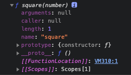
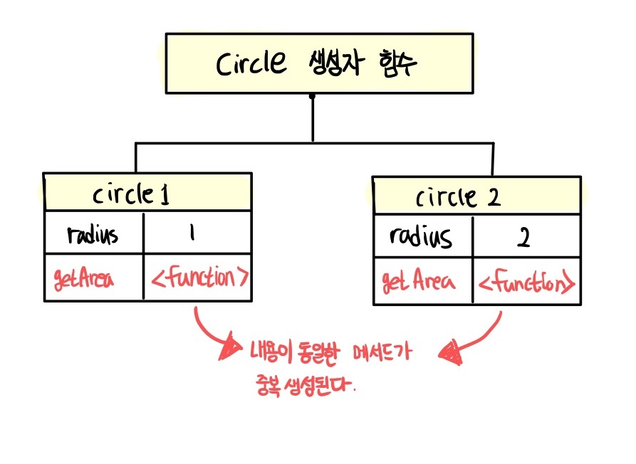
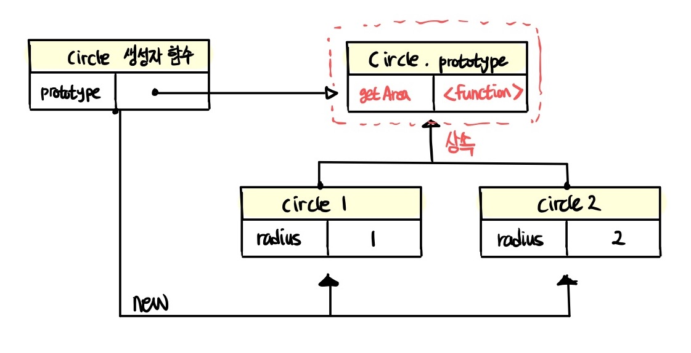
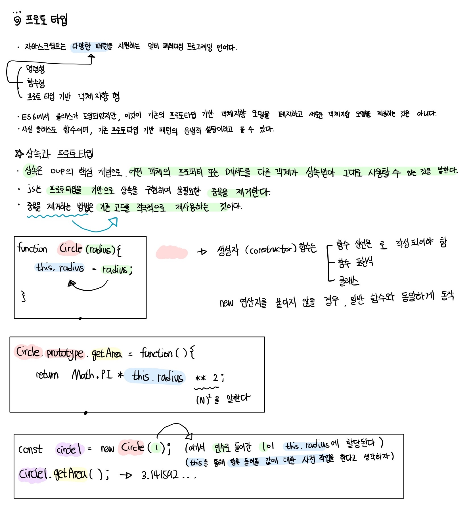
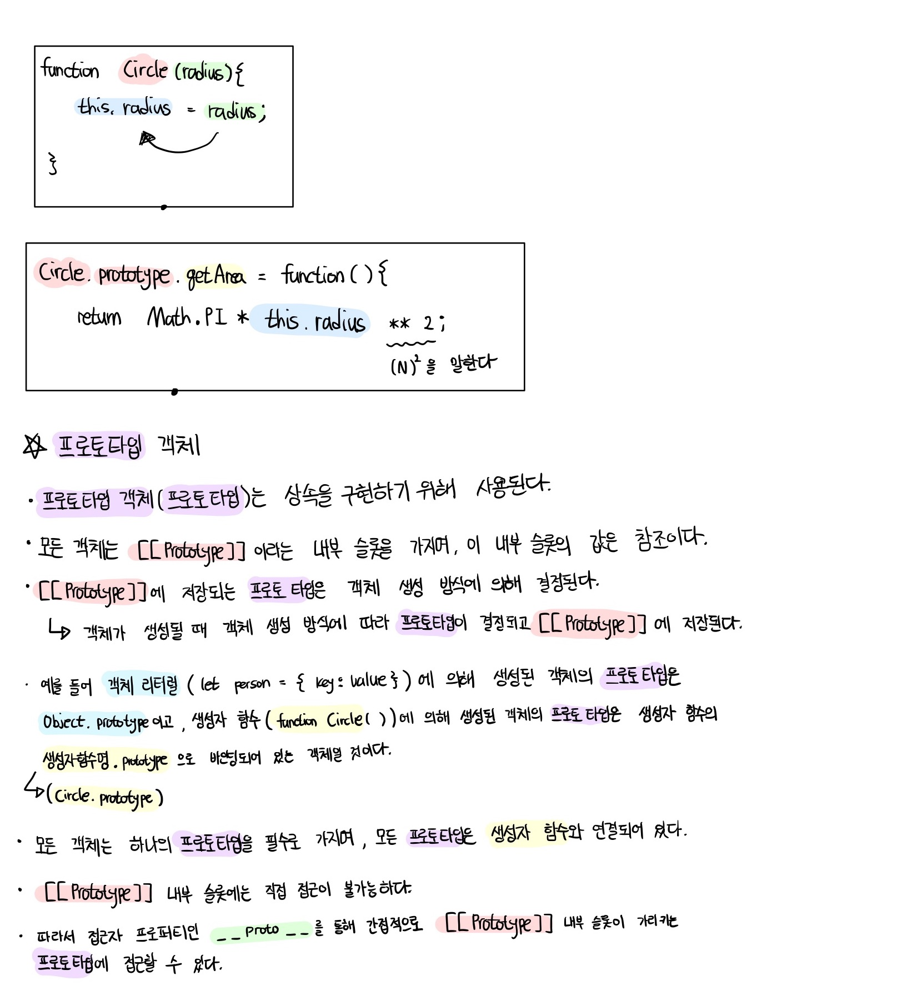
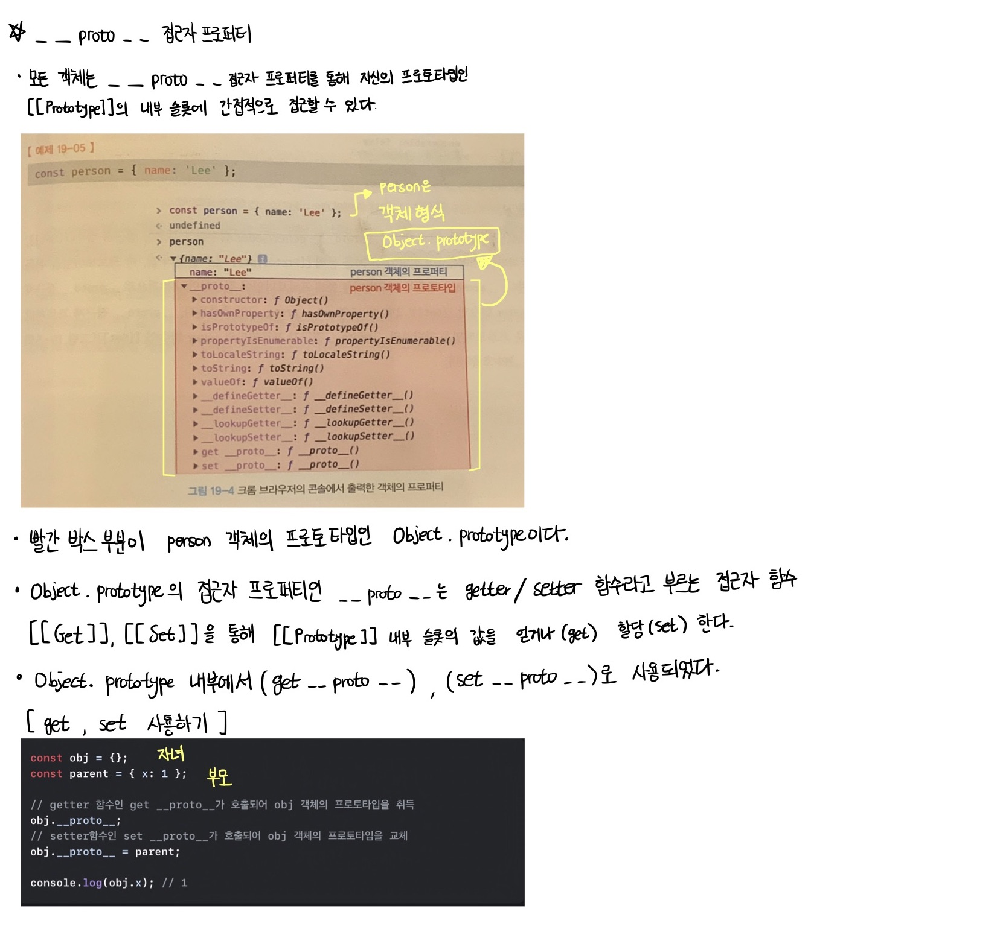
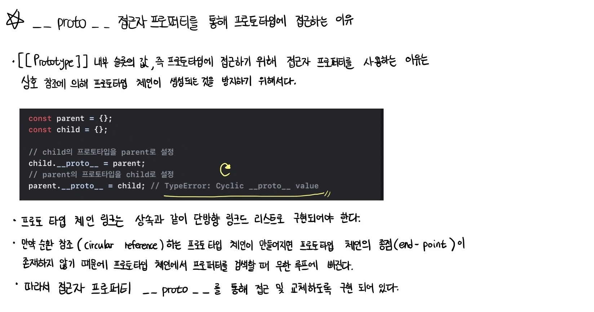
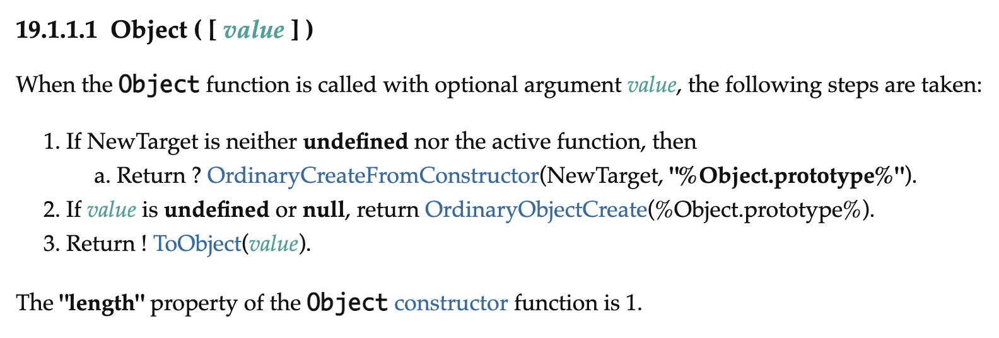
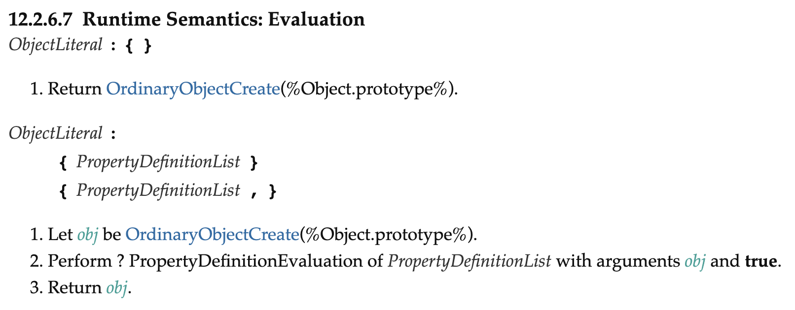
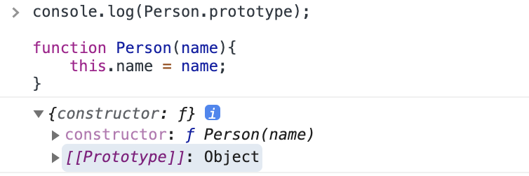

# 모던 자바스크립트 Deep Dive

## 목차

- [17장 생성자 함수에 의한 객체 생성](#17장-생성자-함수에-의한-객체-생성)
- [18장 함수와 일급 객체](#18장-함수와-일급-객체)
- [19장 프로토타입](#19장-프로토타입)
- [20장 strict mode](#20장-strict-mode)

## 17장 생성자 함수에 의한 객체 생성

<p>10장의 '객체 리터럴'에서 객체 리터럴에 의한 객체 생성 방식을 살펴보았다. 객체 리터럴에 의한 객체 생성 방식은 가장 일반적이고 간단한 객체 생성 방식이다. 객체는 객체 리터럴 이외에도 다양한 방법으로 생성할 수 있다. '객체 리터럴' 이외의 객체 생성 방법에 대해 알아본다.</p>

### 17.1 Object 생성자 함수

<p>new 연산자와 함께 Object 생성자 함수를 호출하면 빈 객체를 생성하여 반환한다. 이후 프로퍼티 또는 메서드를 추가하여 객체를 완성할 수 있다.</p>

```js
// 빈 객체의 생성
const person = new Object();

// 프로퍼티 추가 (객체는 mutable 하므로 key와 값을 자유롭게 추가, 삭제, 재 할당할 수 있다.)
person.name = "Lee";
person.sayHello = function () {
  console.log("Hi! My name is " + this.name);
};

console.log(person); // {name: "Lee", sayHello: ƒ}
person.sayHello(); // Hi! My name is Lee
```

<p>생성자 함수(constructor)란 new 연산자와 함께 호출하여 객체(인스턴스)를 생성하는 함수를 말한다. 생성자 함수에 의해 생성된 객체를 인스턴스(instance)라고 한다. 자바스크립트는 Object 생성자 함수 이외에도 String, Number, Boolean, Function, Array, Date, RegExp, Promise 등의 빌트인 생성자 함수를 제공한다.</p>

```js
// String 생성자 함수에 의한 String 객체 생성
const strObj = new String("Lee");
console.log(typeof strObj); // object
console.log(strObj); // String {"Lee"}

// Number 생성자 함수에 의한 Number 객체 생성
const numObj = new Number(123);
console.log(typeof numObj); // object
console.log(numObj); // Number {123}

// Boolean 생성자 함수에 의한 Boolean 객체 생성
const boolObj = new Boolean(true);
console.log(typeof boolObj); // object
console.log(boolObj); // Boolean {true}

// Function 생성자 함수에 의한 Function 객체(함수) 생성
const func = new Function("x", "return x * x");
console.log(typeof func); // function
console.dir(func); // ƒ anonymous(x)

// Array 생성자 함수에 의한 Array 객체(배열) 생성
const arr = new Array(1, 2, 3);
console.log(typeof arr); // object
console.log(arr); // [1, 2, 3]

// RegExp 생성자 함수에 의한 RegExp 객체(정규 표현식) 생성
const regExp = new RegExp(/ab+c/i);
console.log(typeof regExp); // object
console.log(regExp); // /ab+c/i

// Date 생성자 함수에 의한 Date 객체 생성
const date = new Date();
console.log(typeof date); // object
console.log(date); // Mon May 04 2020 08:36:33 GMT+0900 (대한민국 표준시)
```

<p>반드시 Object 생성자 함수를 사용해 빈 객체를 생성해야 하는 것은 아니다. 객체를 생성하는 방법은 객체 리터럴을 사용하는 것이 간편하다. Object 생성자 함수를 사용해 객체를 생성하는 방식은 특별한 이유가 없다면 유용해 보이지 않는다.</p>

### 17.2 생성자 함수

### 객체 리터럴에 의한 객체 생성 방식의 문제점

<p>객체 리터럴에 의한 객체 생성 방식은 단 하나의 객체만 생성하기 때문에 같은 프로퍼티를 갖는 객체를 여러 개 생산해야 하는 경우 비효율적이다.</p>

> 객체마다 getDiameter 메서드를 선언해주었다.

```js
const circle1 = {
  radius: 5,
  getDiameter() {
    return 2 * this.radius;
  },
};

console.log(circle1.getDiameter()); // 10

const circle2 = {
  radius: 10,
  getDiameter() {
    return 2 * this.radius;
  },
};

console.log(circle2.getDiameter()); // 20
```

<p>객체는 프로퍼티를 통해 객체 고유의 상태(state)를 표현한다. 그리고 메서드를 통해 상태 데이터인 프로퍼티를 참조하고 조작하는 동작(behavior)를 표현한다. 따라서 프로퍼티는 객체마다 프로퍼티 값이 다를 수 있지만 메서드는 내용이 동일한 경우가 일반적이다.</p>

### 생성자 함수에 의한 객체 생성 방식의 장점

<p>생성자 함수에 의한 객체 생성 방식은 마치 객체(인스턴스)를 생성하기 위한 템플릿(클래스)처럼 생성자 함수를 사용하여 프로퍼티 구조가 동일한 객체 여러 개를 간편하게 생성할 수 있다.</p>

```js
// 생성자 함수 (일반 함수와 동일한 방식으로 만들어지는 선언문이다)

function Circle(radius) {
  // 생성자 함수 내부의 this는 생성자 함수가 생성할 인스턴스를 가리킨다.
  this.radius = radius; // ex) circle1의 radius에 radius(5)를 할당해줘
  this.getDiameter = function () {
    return 2 * this.radius;
  };
}

// 인스턴스의 생성
const circle1 = new Circle(5); // 반지름이 5인 Circle 객체를 생성
const circle2 = new Circle(10); // 반지름이 10인 Circle 객체를 생성

console.log(circle1.getDiameter()); // 10
console.log(circle2.getDiameter()); // 20
```

> this

```
this는 객체 자신의 프로퍼티나 메서드를 참조하기 위한 자기 참소 변수(self-referencing variable)이다.
this가 가리키는 값, 즉 this 바인딩은 함수 호출 방식에 따라 동적으로 결정된다.
```

|    함수 호출 방식    |    this가 가리키는 값(this 바인딩)     |
| :------------------: | :------------------------------------: |
|  일반 함수로서 호출  |               전역 객체                |
|   메서드로서 호출    | 메서드를 호출한 객체(마침표 앞의 객체) |
| 생성자 함수로서 호출 | 생성자 함수가 (미래에) 생성할 인스턴스 |

```js
// 함수는 다양한 방식으로 호출될 수 있다.
function foo() {
  console.log(this);
}

// 일반적인 함수로서 호출
// 전역 객체는 브라우저 환경에서는 window, Node.js 환경에서는 global을 가리킨다.
foo(); // 전역 객체, window

// 메서드로서 호출
const obj = { foo }; // ES6 프로퍼티 축약 표현
obj.foo(); // 메서드를 호출한 객체, obj

// 생성자 함수로서 호출
const inst = new foo(); // 미래에 생성할 인스턴스, inst
```

<p>생성자 함수는 이름 그대로 객체(인스턴스)를 생성하는 함수다. 자바스크립트에서는 new 연산자를 일반 함수와 결합한 형태로 사용한다. 그말인 즉, new 연산자와 함께 생성자 함수를 호출하지 않으면 생성자 함수가 아니라 일반 함수로 동작한다는 것을 의미한다.</p>

```js

function Circle(radius) {
  // 생성자 함수 내부의 this는 생성자 함수가 생성할 인스턴스를 가리킨다.
  this.radius = radius; // ex) circle1의 radius에 radius(5)를 할당해줘
  this.getDiameter = function () {
    return 2 * this.radius;
  };
}
...

// new 연산자와 함께 호출하지 않으면 생성자 함수로 동작하지 않는다.
// 즉, 일반 함수로서 호출된다.
const circle3 = Circle(15);

// 일반 함수로서 호출된 Circle은 반환문이 없으므로 암묵적으로 undefined를 반환한다.
console.log(circle3); // undefined

// 일반 함수로서 호출된 Circle내의 this는 전역 객체를 가리킨다.
console.log(radius); // 15
```

### 생성자 함수의 인스턴스 생산 과정

<p>생성자 함수의 역할은 프로퍼티 구조가 동일한 인스턴스를 생성하기 위한 템플릿(클래스)으로서 동작하여 인스턴스를 생성하는 것과 생성된 인스턴스를 초기화하는 것이다. 생성자 함수가 인스턴스를 생성하는 것은 필수이고, 생성된 인스턴스를 초기화하는 것은 옵션이다.</p>

```js
// 1. 생성자 함수 선언
function Circle(radius) {
  // 3. 인스턴스 초기화
  this.radius = radius;
  this.getDiameter = function () {
    return 2 * this.radius;
  };
}
// 2. 인스턴스 생성
const circle1 = new Circle(5); // 반지름이 5인 Circle 객체를 생성

//  1, 2, 3 순서로 실행된다
```

<p>생성자 함수 내부의 코드를 살펴보면 this에 프로퍼티(radius)를 추가하고 필요에 따라 전달된 인수(radius)를 프로퍼티의 초기 값으로서 할당하여 인스턴스를 초기화한다. 자바스크립트 엔진은 암묵적인 처리를 통해 인스턴스를 생성하고 반환한다. new 연산자와 함께 생성자 함수를 호출하면 자바스크립트 엔진은 다음과 같은 과정을 거쳐 암묵적으로 인스턴스를 생성하고 인스턴스를 초기화한 후 암묵적으로 인스턴스를 반환(return)한다.</p>

```
1. 인스턴스 생성과 this 바인딩
2. 인스턴스 초기화
3. 인스턴스 반환
```

### 인스턴스 생성과 this 바인딩

<p>암묵적으로 빈 객체가 생성된다. 이 빈 객체가 바로 (아직 완성되지는 않았지만) 생성자 함수가 생성한 인스턴스이다. 이 인스턴스는 this에 바인딩된다. 생성자 함수 내부의 this가 생성자 함수가 생성할 인스턴스를 가리키는 이유가 바로 이 때문이다. 이 처리는 함수 몸체의 코드가 한 줄씩 실행되는 런타임 이전에 실행된다.</p>

> 바인딩 (name binding)

```
바인딩이란 식별자와 값을 연결하는 과정을 의미한다. 예를 들어 변수 선언은 변수 이름(식별자)과 확보된 메모리 공간의 주소를 바인딩하는 것이다.
this 바인딩은 this와 this가 가리킬 객체(개발자에 의해 기술될)를 바인딩하는 것이다.
```

```js
function Circle(radius) {
  // 1. 암묵적으로 빈 객체가 생성되고 this에 바인딩된다.
  console.log(this); // Circle {}

  this.radius = radius;
  this.getDiameter = function () {
    return 2 * this.radius;
  };
}

console.log(Circle());
```

### 인스턴스 초기화

<p>셍성자 함수에 기술되어 있는 코드가 한 줄씩 실행되어 this에 바인딩되어 있는 인스턴스를 초기화한다. 생성자 함수가 인수로 전달받은 초기값을 인스턴스 프로퍼티에 할당하여 초기화하거나 고정값을 할당한다.</p>

```js
function Circle(radius) {
  // 1. 암묵적으로 인스턴스가 생성되고 this에 바인딩된다.

  // 2. this에 바인딩되어 있는 인스턴스를 초기화한다.
  this.radius = radius;
  this.getDiameter = function () {
    return 2 * this.radius;
  };
}
```

### 인스턴스 반환

<p>생성자 함수 내부의 모든 처리가 끝나면 완성된 인스턴스가 바인딩된 this가 암묵적으로 반환된다.</p>

```js
function Circle(radius) {
  // 1. 암묵적으로 인스턴스가 생성되고 this에 바인딩된다.

  // 2. this에 바인딩되어 있는 인스턴스를 초기화한다.
  this.radius = radius;
  this.getDiameter = function () {
    return 2 * this.radius;
  };

  // 3. 완성된 인스턴스가 바인딩된 this가 암묵적으로 반환된다
}

// 인스턴스 생성. Circle 생성자 함수는 암묵적으로 this를 반환한다.
const circle = new Circle(1);
console.log(circle); // Circle {radius: 1, getDiameter: ƒ}
```

<p>만약 this가 아닌 다른 객체를 <b>명시적으로 반환하면 return 문에 명시한 객체가 반환된다.</b></p>

```js
function Circle(radius) {
  // 1. 암묵적으로 인스턴스가 생성되고 this에 바인딩된다.

  // 2. this에 바인딩되어 있는 인스턴스를 초기화한다.
  this.radius = radius;
  this.getDiameter = function () {
    return 2 * this.radius;
  };

  // 3. 암묵적으로 this를 반환한다.
  // 명시적으로 객체를 반환하면 암묵적인 this 반환이 무시된다.
  return {};
}

// 인스턴스 생성. Circle 생성자 함수는 명시적으로 반환한 객체를 반환한다.
const circle = new Circle(1);
console.log(circle); // {}
```

<p>하지만 명시적으로 <b>원시 값</b>을 반환하면 원시 값 반환은 무시되고 암묵적으로 this가 반환된다.</p>

```js
function Circle(radius) {
  // 1. 암묵적으로 인스턴스가 생성되고 this에 바인딩된다.

  // 2. this에 바인딩되어 있는 인스턴스를 초기화한다.
  this.radius = radius;
  this.getDiameter = function () {
    return 2 * this.radius;
  };

  // 3. 암묵적으로 this를 반환한다.
  // 명시적으로 원시값을 반환하면 원시값 반환은 무시되고 암묵적으로 this가 반환된다.
  return 100;
}

// 인스턴스 생성. Circle 생성자 함수는 명시적으로 반환한 객체를 반환한다.
const circle = new Circle(1);
console.log(circle); // Circle {radius: 1, getDiameter: ƒ}
```

<p>이처럼 생성자 함수 내부에서 명시적으로 this가 아닌 다른 값을 반환하는 것은 생성자 함수의 기본 동작을 훼손한다. 따라서 생성자 함수 내부에서 return 문을 반드시 생략해야 한다.</p>

## 18장 함수와 일급 객체

### 18.1 일급 객체

<p>다음과 같은 조건을 만족하는 객체를 일급 객체라 한다.</p>

```
1. 무명의 리터럴로 생성할 수 있다. 즉, 런타임에 생성이 가능하다
2. 변수나 자료구조(객체, 배열 등)에 저장할 수 있다.
3. 함수의 매개변수에 전달할 수 있다.
4. 함수의 반환 값으로 사용할 수 있다.
```

<p>자바스크립트의 함수는 다음 예제와 같이 위의 조건을 모두 만족하므로 일급 객체다.</p>

```js
// 1. 함수는 무명의 리터럴로 생성할 수 있다.
// 2. 함수는 변수에 저장할 수 있다.

// 런타임(할당 단계)에 함수 리터럴이 평가되어 함수 객체가 생성되고 변수에 할당된다.
// 함수 표현식으로 작성되었다. 변수에 할당했기 때문에 변수 이름을 식별자로 사용하여 함수 이름은 무명으로 생성되었다.
const increase = function (num) {
  return ++num;
};

const decrease = function (num) {
  return --num;
};

// 2. 함수는 객체에 저장할 수 있다.
const predicates = { increase, decrease };

console.log(predicates); // predicates:  { increase: [Function: increase], decrease: [Function: decrease] }

// 3. 함수의 매개변수에게 전달할 수 있다.
// 4. 함수의 반환값으로 사용할 수 있다.
function makeCounter(predicate) {
  let num = 0;

  return function () {
    num = predicate(num);
    return num;
  };
}

// 3. 함수는 매개변수에게 함수를 전달할 수 있다.
const increaser = makeCounter(predicates.increase);
console.log(increaser()); // 1
console.log(increaser()); // 2

// 3. 함수는 매개변수에게 함수를 전달할 수 있다.
const decreaser = makeCounter(predicates.decrease);
console.log(decreaser()); // -1
console.log(decreaser()); // -2
```

<p>함수가 일급 객체라는 것은 함수를 객체와 동일하게 사용할 수 있다는 의미이다. 객체는 값이므로 함수는 값과 동일하게 취급할 수 있다. 따라서 함수는 값을 사용할 수 있는 곳(변수 할당문, 객체의 프로퍼티 값, 배열의 요소, 함수 호출의 인수, 함수 반환문)이라면 어디서든지 리터럴로 정의할 수 있으며 런타임에 함수 객체로 평가된다.</p>

<p>일급 객체로서 함수가 가지는 가장 큰 특징은 일반 객체와 같이 함수의 매개변수에 전달할 수 있으며, 함수의 반환값으로 사용할 수도 있다는 것이다. 이는 함수형 프로그래밍을 가능케 하는 자바스크립트의 장점 중 하나이다.</p>

<p>함수는 객체이지만 일반 객체와는 차이가 있다. 일반 객체는 호출할 수 없지만 함수 객체는 호출할 수 있다. 그리고 함수 객체는 일반 객체에는 없는 함수 고유의 프로퍼티를 소유한다.</p>

```js
var value = 10;

var consoleValue = function(){
  console.log(value);
}

>>>
value() , (x)
consoleValue() , (o)
```

### 18.2 함수 객체와 프로퍼티

<p>함수는 객체다. 따라서 함수도 프로퍼티를 가질 수 있다. 브라우저 콘솔에서 console.dir 메서드를 사용하여 함수 객체의 내부를 들여다 보자.</p>

```js
function square(number) {
  return number * number;
}

console.dir(square);
```



<p>square 함수의 모든 프로퍼티의 프로퍼티 어트리뷰트를 Object.getOwnPropertyDescriptions 메서드로 확인해 보면 다음과 같다.</p>

```js
function square(number) {
  return number * number;
}

console.log(Object.getOwnPropertyDescriptors(square));
/*
{
  length: {value: 1, writable: false, enumerable: false, configurable: true},
  name: {value: "square", writable: false, enumerable: false, configurable: true},
  arguments: {value: null, writable: false, enumerable: false, configurable: false},
  caller: {value: null, writable: false, enumerable: false, configurable: false},
  prototype: {value: {...}, writable: true, enumerable: false, configurable: false}
}
*/

// __proto__는 square 함수의 프로퍼티가 아니다.
console.log(Object.getOwnPropertyDescriptor(square, "__proto__")); // undefined

// __proto__는 Object.prototype 객체의 접근자 프로퍼티다.
// square 함수는 Object.prototype 객체로부터 __proto__ 접근자 프로퍼티를 상속받는다.
console.log(Object.getOwnPropertyDescriptor(Object.prototype, "__proto__"));
// {get: ƒ, set: ƒ, enumerable: false, configurable: true}
```

<p>이처럼 arguments, caller, name, property 프로퍼티는 모두 함수 객체의 데이터 프로퍼티다. 이들 프로퍼티는 일반 객체에는 없는 함수 객체 고유의 프로퍼티이다. 하지만 __proto__는 접근자 프로퍼티이며, 함수 객체 고유의 프로퍼티가 아니라 Object.prototype 객체의 프로퍼티를 상속받은 것을 알 수 있다.</p>

## 19장 프로토타입

<p>자바스크립트는 명령형, 함수형, 프로토타입 기반 객체지향 프로그래밍을 지원하는 멀티 패러다임 프로그래밍 언어다.</p>

<p>간혹 C++이나 자바 같은 클래스 기반 객체지향 프로그래밍 언어의 특징인 클래스와 상속, 캡슐화를 위한 키워드인 public, private, protected 등이 없어서 자바스크립트는 객체지향 언어가 아니라고 오해하는 경우도 있다. 하지만 자바스크립트는 클래스 기반 객체지향 프로그래밍 언어보다 효율적이며 더 강력한 객체지향 프로그래밍 능력을 지니고 있는 프로토타입 기반의 객체지향 프로그래밍 언어다.</p>

> 클래스

```
ES6에서 클래스가 도입되었다. 하지만 ES6의 클래스가 기존의 프로토타입 기반 객체지향 모델을 폐지하고 새로운 객체지향 모델을 제공하는 것은 아니다.
사실 클래스도 함수이며, 기존 프로토타입 기반 패턴의 문법적 설탕이라고 볼 수 있다. 클래스와 생성자 함수는 모두 프로토타입 기반의 인스턴스를 생성하지만
정확히 동일하게 동작하지는 않는다. 클래스는 생성자 함수보다 엄격하며 클래스는 생성자 함수에서는 제공하지 않는 기능도 제공한다.

따라서 클래스를 프로토타입 기반 객체 생성 패턴의 단순한 문법적 설탕으로 보기보다는 새로운 객체 생성 메커니즘으로 보는 것이 좀 더 합당하다고 볼 수 있다.
```

<p>자바스크립트는 객체 기반의 프로그래밍 언어이며 자바스크립트를 이루고 있는 거의 '모든 것'이 객체다. 원시 타입의 값을 제외한 나머지 값들은 모두 객체이다.</p>

### 19.1 객체지향 프로그래밍

<p><b>객체지향 프로그래밍은 프로그램을 명령어 또는 함수의 목록으로 보는 전통적인 명령형 프로그래밍의 절차지향적 관점에서 벗어나 여러 개의 독립적 단위, 즉 객체의 집합으로 프로그램을 표현하려는 프로그래밍 패러다임을 말한다.</b> 객체지향 프로그래밍은 실세계의 실체를 인식하는 철학적 사고를 프로그래밍에 접목하려는 시도에서 시작한다. 실체는 특징이나 성질을 나타내는 속성을 가지고 있고, 이를 통해 실체를 인식하거나 구별할 수 있다.</p>

<p>예를 들어, 사람은 이름, 주소, 성별, 나이, 신장, 체중, 학력, 성격, 직업 등 다양한 속성을 갖는다. 이때 '이름은 아무개이고 서엽ㄹ은 여성이며 나이는 20세인 사람'과 같은 속성을 구체적으로 표현하면 특정한 사람을 다른사람과 구별하여 인식할 수 있다.</p>

<p>이러한 방식을 프로그래밍에 접목시켜보자. 사람에게는 다양한 속성이 있으나 우리가 구현하려는 프로그램에서는 사람의 '이름'과 '주소'라는 속성에만 관심이 있다고 가정하자. 이처럼 <b>다양한 속성 중에서 프로그램에 필요한 속성만 간추려 내어 표현하는 것을 추상화(abstraction)</b>라 한다.</p>

> 이름과 주소라는 속성을 갖는 person 이라는 객체를 자바스크립트로 표현하면 다음과 같다.

```js
// 이름과 주소 속성을 갖는 객체
const person = {
  name: "Lee",
  address: "Seoul",
};

console.log(person); // {name: "Lee", address: "Seoul"}
```

<p>이때 프로그래머(subject, 주체)는 이름과 주소 속성으로 표현된 객체(object)인 person을 다른 객체와 구별하여 인식할 수 있다. 이처럼 <b>속성을 통해 여러 개의 값을 하나의 단위로 구성한 복합적인 자료구조</b>를 객체라 하며, 객체지향 프로그래밍은 독립적인 객체의 집합으로 프로그램을 표현하려는 프로그래밍 패러다임이다.</p>

<p>이번에는 원(circle)이라는 개념을 객체로 만들어보자. 원에는 반지름이라는 속성(프로퍼티)가 있다. 이 반지름을 가지고 원의 지름, 둘레, 넓이를 구할 수 있다. 이때 반지름은 원의 상태를 나타내는 데이터이며 원의 지름, 둘레, 넓이를 구하는 것은 동작이다.</p>

```js
const circle = {
  radius: 5, // 반지름

  // 원의 지름: 2r
  getDiameter() {
    return 2 * this.radius;
  },

  // 원의 둘레: 2πr
  getPerimeter() {
    return 2 * Math.PI * this.radius;
  },

  // 원의 넓이: πrr
  getArea() {
    return Math.PI * this.radius ** 2;
  },
};

console.log(circle);
// {radius: 5, getDiameter: ƒ, getPerimeter: ƒ, getArea: ƒ}

console.log(circle.getDiameter()); // 10
console.log(circle.getPerimeter()); // 31.41592653589793
console.log(circle.getArea()); // 78.53981633974483
```

<p>이처럼 객체지향 프로그래밍은 객체의 상태(state)를 나타내는 데이터(property)와 상태 데이터를 조작할 수 있는 동작(behavior > method)을 하나의 논리적인 단위로 묶어 생각한다. 각 객체는 고유의 기능을 갖는 독립적인 부품으로 볼 수 있지만 자신의 고유한 기능을 수행하면서 다른 객체와 관계성(relationship)을 가질 수 있다. 다른 객체와 메시지를 주고받거나 데이터를 처리할 수도 있다. 또는 다른 객체의 상태 데이터나 상속받아 사용하기도 한다.</p>

### 19.2 상속과 프로토타입

<p>상속(inheritance)은 객체지향 프로그래밍의 핵심 개념으로, 어떤 객체의 프로퍼티 또는 메서드를 다른 객체가 상속받아 그대로 사용할 수 있는 것을 말한다.</p>

<p>자바스크립트는 프로토타입을 기반으로 상속을 구현하여 불필요한 중복을 제거한다. 중복을 제거하는 방법은 기존의 코드를 적극적으로 재사용하는 것이다.</p>

```js
// 생성자 함수 (대문자로 표시함, 후에 new 연산자와 함께 사용한다.)
function Circle(radius) {
  this.radius = radius;
  this.getArea = function () {
    /*
    함수 리터럴 또는 일반 함수가 아닌, 생성자 함수로 사용할 경우 this. 를 통해 명시해줘야 한다.
    why? 미리 함수를 정의해놓는 것이 아닌, 프로토타입에 의해 생성될 인스턴스를 위해 미리 만들어 놓은 프로퍼티/ 메서드이기 때문이다.
    */
    return Math.PI * this.radius ** 2;
  };
}

// 반지름이 1인 인스턴스 생성
const circle1 = new Circle(1);
// 반지름이 2인 인스턴스 생성
const circle2 = new Circle(2);

// Circle 생성자 함수는 인스턴스를 생성할 때마다 동일한 동작을 하는
// getArea 메서드를 중복 생성하고 모든 인스턴스가 중복 소유한다. (현재는 개별 메모리에 중복 생성된 상태)
// getArea 메서드는 하나만 생성하여 모든 인스턴스가 공유해서 사용하는 것이 바람직하다.

🌟 console.log(circle1.getArea === circle2.getArea); // false

console.log(circle1.getArea()); // 3.141592653589793
console.log(circle2.getArea()); // 12.566370614359172
```

<p>앞서 다룬 '생성자 함수'에서 살펴본 바와 같이 생성자 함수는 동일한 프로퍼티(메서드 포함) 구조를 갖는 객체를 여러 개 생성할 때 유용하다. 하지만 위 예제의 생성자 함수는 문제가 있다.</p>

<p>Cirlce 생성자 함수가 생성하는 모든 객체(인스턴스)는 radius 프로퍼티와 getArea 메서드를 갖는다. radius 프로퍼티 값은 일반적으로 인스턴스마다 다르다. 하지만 getArea 메서드는 모든 인스턴스가 동일한 내용의 메서드를 사용하므로 단 하나만 생성하여 모든 인스턴스가 공유해서 사용하는 것이 바람직하다. 그런데 현재 위 예제에서는 Circle 생성자 함수는 인스턴스를 생성할 때마다 getArea 메서드를 중복 생성하고 모든 인스턴스가 중복 소유한다.</p>



<p>이처럼 동일한 생성자 함수에 의해 생성된 모든 인스턴스가 동일한 메서드를 중복 소유하는 것은 메모리를 불필요하게 낭비한다. 상속을 통해 불필요한 중복을 제거해 보자. 자바스크립트는 프로토타입을 기반으로 상속을 구현한다.</p>

```js
// 생성자 함수
function Circle(radius) {
  this.radius = radius;
}

// Circle 생성자 함수가 생성한 모든 인스턴스가 getArea 메서드를
// 공유해서 사용할 수 있도록 프로토타입에 추가한다.
// 프로토타입은 Circle 생성자 함수의 prototype 프로퍼티에 바인딩되어 있다.
Circle.prototype.getArea = function () {
  return Math.PI * this.radius ** 2;
};

// 인스턴스 생성
const circle1 = new Circle(1);
const circle2 = new Circle(2);

// Circle 생성자 함수가 생성한 모든 인스턴스는 부모 객체의 역할을 하는
// 프로토타입 Circle.prototype으로부터 getArea 메서드를 상속받는다.
// 즉, Circle 생성자 함수가 생성하는 모든 인스턴스는 하나의 getArea 메서드를 공유한다.
🌟 console.log(circle1.getArea === circle2.getArea); // true

console.log(circle1.getArea()); // 3.141592653589793
console.log(circle2.getArea()); // 12.566370614359172
```



<p>Circle 생성자 함수가 생성한 모든 인스턴스는 자신의 프로토타입, 즉 상위(부모) 객체 역할을 하는 Circle prototype의 모든 프로퍼티와 메서드를 상속 받는다. 즉, 자신의 상태를 나타내는 radius 프로퍼티만 개별적으로 소유하고 내용이 동일한 메서드는 상속을 통해 공유하여 사용하는 것이다.</p>

<p>상속은 코드의 재사용이란 관점에서 매우 유용하다. 생성자 함수가 생성할 모든 인스턴스가 공통적으로 사용할 프로퍼티나 메서드를 프로토타입에 미리 구현해 두면 생성자 함수가 생성할 모든 인스턴스는 별도의 구현없이 상위(부모)객체인 프로토타입의 자산(프로퍼티, 메서드)을 공유하여 사용할 수 있다.</p>

### 이후 프로토 타입 정리에 대하여

```
프로토타입을 통해서 클래스형 OOP와의 차별점을 둔 JS의 방식에 대해서는 이해를 일부 하겠으나, 실질적으로 내가 작성하거나 공부하고 있는 강의를 살펴 보았을 때
우리가 이러한 프로토타입 기반의 객체지향 프로그래밍을 통해 과연 프로그래밍을 하고 있는지에 대한 의문이 들었다. 프로토타입을 객체를 통해 OOP의 장점인 상속을
구현하고 이를 통해 코드의 재사용성을 증가시켜 메모리를 줄인다는 대의는 이해를 했으나, [[Prototype]] 과 같이 내부 슬롯, 내부 메서드, __proto__ 등과
같이 상대적으로는 추상적인 개념을 계속 공부하는 게 너무 어렵게 느껴졌다. 물론 이 책과 '프로토타입'에 대한 내용을 1회독으로 끝낼 생각은 아니지만, 어느정도
js에 대한 이해를 더 높힌 뒤에 이전에 내가 느꼈던 것처럼 다시 나에게 필요한 개념이라고 생각이 들 때 더욱 집중적으로 봐야겠다.

단어가 반복되는데 책으로 밑줄만 쳐서는 도저히 읽고 이해가 안돼서, 가볍게 필기를 병행하여 작성해 보았다.

아마 후에 20장 이후 공부를 진행하면서 프로토타입에 대한 공부가 내용이 더해질 때 이 부분에 더 추가하도록 하겠다.
```

### 프로토 타입이란?



### 19.3 프로토타입 객체



### `__proto__` 접근자 프로퍼티



### `__proto__` 접근자 프로퍼티를 통해 프로토타입에 접근하는 이유



### `__proto__` 접근자 프로퍼티를 코드 내에서 직접 사용하는 것은 권장하지 않는다.

<p>`__proto__` 접근자 프로퍼티는 ES5까지 ECMAScript 사양에 포함되지 않은 비표준이었다. 하지만 일부 브라우저에서 __proto__를 지원하고 있었기 때문에 브라우저 호환성을 고려하여 ES6에서 __proto__를 표준으로 채택했다. 하지만 코드 내에서 __proto__ 접근자 프로퍼티를 직접 사용하는 것은 권장하지 않는다. 모든 객체가 __proto__ 접근자 프로퍼티를 사용할 수 있는 것은 아니기 때문이다.</p>

<p>따라서 __proto__ 접근자 프로퍼티 대신 프로토타입의 참조를 취득하고 싶은 경우에는 Object.getPrototypeOf 메서드를 사용하고, 프로토타입을 교체하고 싶은 경우에는 Object.setPrototypeOf 메서드를 사용할 것을 권장한다. </p>

```js
const obj = {}; // 객체 리터럴을 통해 obj를 선언
const parent = { x: 1 };

// obj 객체의 프로토타입을 취득
Object.getPrototypeOf(obj); // obj.__proto__;
// obj 객체의 프로토타입을 교체
Object.setPrototypeOf(obj, parent); // obj.__proto__ = parent;

console.log(obj.x); // 1
```

### 함수 객체의 prototype 프로퍼티

<p><b>함수 객체만이 소유하는 prototype 프로퍼티는 생성자 함수가 생성할 인스턴스의 프로토타입을 가리킨다.</b></p>

```js
// 함수 객체는 prototype 프로퍼티를 소유한다.
(function () {}.hasOwnProperty("prototype")); // -> true

// 일반 객체는 prototype 프로퍼티를 소유하지 않는다.
({}.hasOwnProperty("prototype")); // -> false
```

<p>prototype 프로퍼티는 <b>생성자 함수가 생성할 객체(인스턴스)의 프로토타입을 가리킨다.</b> 따라서 생성자 함수로 호출할 수 없는, non-constructor인 화살표 함수와 ES6 메서드 축약 표현으로 정의한 메서드는 prototype 프로퍼티를 소유하지 않으며 프로토타입도 생성핮지 않는다.</p>

```js
/*
non-constructor 
1. 화살표 함수
2. ES6의 메서드 축약 표현
*/

// 화살표 함수는 non-constructor다.
const Person = (name) => {
  this.name = name;
};

// non-constructor는 prototype 프로퍼티를 소유하지 않는다.
console.log(Person.hasOwnProperty("prototype")); // false

// non-constructor는 프로토타입을 생성하지 않는다.
console.log(Person.prototype); // undefined

// ES6의 메서드 축약 표현으로 정의한 메서드는 non-constructor다.
const obj = {
  foo() {},
};

// non-constructor는 prototype 프로퍼티를 소유하지 않는다.
console.log(obj.foo.hasOwnProperty("prototype")); // false

// non-constructor는 프로토타입을 생성하지 않는다.
console.log(obj.foo.prototype); // undefined
```

<p>생성자 함수로 호출하기 위해 정의하지 않은 일반 함수도 prototype 프로퍼티를 소유핮지만 객체를 생성하지 않는 일반 함수(생성자 함수로 쓰이지 않은 함수)의 prototype 프로퍼티는 아무런 의미가 없다.</p>

<p>모든 객체가 가지고 있는(엄밀히 말하면 Object.prototype으로부터 상속받은) __proto__ 접근자 프로퍼티와 함수 객체만이 가지고 있는 prototype 프로퍼티는 결국 동일한 프로토타입을 가리킨다. 하지만 이들의 프로퍼티를 사용하는 주체가 다르다는 것을 알아야 한다.</p>

|            구분            |    소유     |        값         |  사용 주체  |                                  사용 목적                                   |
| :------------------------: | :---------: | :---------------: | :---------: | :--------------------------------------------------------------------------: |
| `__proto__`접근자 프로퍼티 |  모든 객체  | 프로토타입의 참조 |  모든 객체  |           객체가 자신의 프로토타입에 접근 또는 교체하기 위해 사용            |
|    `prototype` 프로퍼티    | constructor | 프로토타입의 참조 | 생성자 함수 | 생성자 함수가 자신이 생성할 객체(인스턴스)의 프로토타입을 할당하기 위해 사용 |

<p>예를 들어, 생성자 함수로 객체를 생성한 후 `__proto__` 접근자 프로퍼티와 `prototype` 프로퍼티로 프로토타입 객체에 접근해보자.</p>

```js
// 생성자 함수
function Person(name) {
  this.name = name;
}

const me = new Person("Lee");

// 결국 Person.prototype과 me.__proto__는 결국 동일한 프로토타입을 가리킨다.
console.log("Person.prototype: ", Person.prototype); // Person.prototype:  {}
console.log("me.__proto__: ", me.__proto__); // me.__proto__:  {}
console.log(Person.prototype === me.__proto__); // true
```

### 프로토타입의 constructor 프로퍼티와 생성자 함수

<p>모든 프로토타입(=프로토타입 객체)은 constructor 프로퍼티를 갖는다. 이 constructor 프로퍼티는 prototype 프로퍼티로 자신을 참조하고 있는 생성자 함수를 가리킨다. 이 연결은 생성자 함수가 생성될 때, 즉 함수 객체가 생성될 때 이루어 진다.</p>

```js
// 생성자 함수
function Person(name) {
  this.name = name;
}

// new Person() 프로토타입을 통해 me 라는 인스턴스를 생성하였다.
const me = new Person("Lee");

// me 객체의 생성자 함수는 Person이다.
console.log("me.constructor: ", me.constructor); //me.constructor:  [Function: Person]
console.log("Person: ", Person); // Person:  [Function: Person]

console.log(me.constructor === Person); // true

// me를 만든 사람이 누구니? >> Person 프로토타입이야
```

<p>위 예제에서 Person 생성자 함수는 me 객체를 생성했다. 이때 me 객체는 프로토타입의 constructor 프로퍼티를 통해 생성자 함수와 연결된다. me 객체에는 constructor 프로퍼티가 없지만 me 객체의 프로토타입인 Person.prototype에는 constructor 프로퍼티가 있다. 따라서 me 객체는 프로토타입인 Person.prototype의 constructor 프로퍼티를 상속받아 사용할 수 있다.</p>

### 19.4 리터럴 표기법에 의해 생성된 객체의 생성자 함수와 프로토타입

<p>앞에서 살펴본 바와 같이 생성자 함수에 의해 생성된 인스턴스는 프로토타입의 constructor 프로퍼티에 의해 생성자 함수와 연결된다. 이때 constructor 프로퍼티가 가리키는 생성자 함수는 인스턴스를 생성한 생성자 함수이다.</p>

```js
// obj 객체를 생성한 생성자 함수는 Object다.
/*
new Object()로 선언된 Object()는 사용자에 의해 생성된 생성자 함수가 아닌 ECMAScript가 제공하는 '빌트인 생성자 함수'이다.
위에 관한 내용은 후에 다루게 된다.
*/
const obj = new Object();
console.log(obj.constructor === Object); // true

// add 함수 객체를 생성한 생성자 함수는 Function이다.
const add = new Function("a", "b", "return a + b");
console.log(add.constructor === Function); // true

// 생성자 함수
function Person(name) {
  this.name = name;
}

// me 객체를 생성한 생성자 함수는 Person이다.
const me = new Person("Lee");
console.log(me.constructor === Person); // true
```

<p>하지만 리터럴 표기법에 의한 객체 생성 방식과 같이 명시적으로 new 연산자와 함께 생성자 함수를 호출하여 인스턴스를 생성하지 않는 객체 생성 방식도 있다.(객체 리터럴 등)</p>

```js
// 객체 리터럴
const obj = {};

// 함수 리터럴
const add = function (a, b) {
  return a + b;
};

// 배열 리터럴
const arr = [1, 2, 3];

// 정규표현식 리터럴
const regexp = /is/gi;
```

<p>리터럴 표기법에 의해 생성된 객체도 물론 프로토타입이 존재한다. 하지만 리터럴 표기법에 의해 생성된 객체의 경우 프로토타입의 constructor 프로퍼티가 가리키는 생성자 함수가 반드시 객체를 생성한 생성자 함수라고 단정할 수는 없다.</p>

```js
// obj 객체는 Object 생성자 함수로 생성한 객체가 아니라 객체 리터럴로 생성했다.
const obj = {};

// 하지만 obj 객체의 생성자 함수는 Object 생성자 함수다.
console.log(obj.constructor === Object); // true

/*
리터럴 표기법에 의해 생성된 객체의 경우 프로토타입의 constructor 프로퍼티가 가리키는 생성자 함수가 반드시 객체를 생성한 생성자 함수라고 단정할 수는 없다.
*/
```

<p>그렇다면 객체 리터럴에 의해 생성된 객체는 사실 Object 생성자 함수로 생성되는 것은 아닐까? ECMAScript 사양을 살펴보자. Object 생성자 함수는 다음과 같이 구현하도록 정의되어 있다.</p>



<p>2에서 Object 생성자 함수에 인수를 전달하지 않거나 undefined 또는 null을 인수로 전달하면서 호출하면 내부적으로는 추상 연산 <b>OrdinaryObjectCreate</b>를 호출하여 Object.prototype을 프로토타입으로 갖는 빈 객체를 생성한다.</p>

```js
// 2. Object 생성자 함수에 의한 객체 생성

// Object 생성자 함수는 new 연산자와 함께 호출하지 않아도 new 연산자와 함께 호출한 것과 동일하게 동작한다.
// 인수가 전달되지 않았을 때 추상 연산 OrdinaryObjectCreate를 호출하여 빈 객체를 생성한다.
let obj = new Object();
console.log(obj); // {}

// 1. new.target이 undefined나 Object가 아닌 경우

// 인스턴스 -> Foo.prototype -> Object.prototype 순으로 프로토타입 체인이 생성된다.
class Foo extends Object {}
new Foo(); // Foo {}

// 3. 인수가 전달된 경우에는 인수를 객체로 변환한다.

// Number 객체 생성
obj = new Object(123);
console.log(obj); // Number {123}

// String  객체 생성
obj = new Object("123");
console.log(obj); // String {"123"}
```

<p>객체 리터럴(생성자 함수 사용 x)이 평가될 때는 다음과 같이 추상 연산 OrdinaryObjectCreate를 호출하여 빈 객체를 생성하고 프로퍼티를 추가하도록 정의되어 있다.</p>



<p>이처럼 Object 생성자 함수 호출과 객체 리터럴의 평가는 추상 연산 OrdinaryObjectCreate를 호출하여 빈 객체를 생성하는 점에서 동일하지만, 세부 내용은 다르다. 따라서 객체 리터럴에 의해 생성된 객체는 Object 생성자 함수가 생성한 객체가 아니다.</p>

<p>함수 객체의 경우 차이가 더 명확하다. 'Function 생성자 함수, 함수 호이스팅'에서 살펴보았듯이 Function 생성자 함수를 호출하여 생성한 함수는 렉시컬 스코프를 만들지 않고 전역 함수인 것처럼 스코프를 생성하며 클로저도 만들지 않는다. 따라서 함수 선언문과 함수 표현식을 평가하여 함수 객체ㅔ를 생성한 것은 Function 생성자 함수가 아니다.</p>

> <a href="https://github.com/junh0328/upgrade_javascript/blob/master/DEEPDIVE/readme.md#124-%ED%95%A8%EC%88%98-%EC%A0%95%EC%9D%98">`# 12.4 함수 정의 바로가기`</a>

```js
// foo 함수는 Function 생성자 함수로 생성한 함수 객체가 아니라 함수 선언문으로 생성했다.
function foo() {}

// 하지만 constructor 프로퍼티를 통해 확인해보면 함수 foo의 생성자 함수는 Function 생성자 함수다.
console.log(foo.constructor === Function); // true
```

<p>리터럴 표기법에 의해 생성된 객체도 상속을 위해 프로토타입이 필요하다. 따라서 리터럴 표기법에 의해 생성된 객체도 <b>가상의 생성자 함수를 갖는다.</b> 프로토타입은 생성자 함수와 더불어 생성되며 prototype, constructor 프로퍼티에 의해 연결되어 있기 때문이다. 다시 말해, 프로토타입과 생성자 함수는 단독으로 존재할 수 없고, 언제나 쌍(pair)으로 존재한다.</p>

<p>리터럴 표기법에 의해 생성된 객체는 생성자 함수에 의해 생성된 객체는 아니다. 하지만 큰 틀에서 생각해 보면 리터럴 표기법으로 생성한 객체도 생성자 함수로 생성한 객체와 본질적으로 큰 차이는 없다. 예를 들어, <b>객체 리터럴에 의해 생성한 객체와 Object 생성자 함수에 의해 생성한 객체</b>는 생성 과정에는 미묘한 차이가 있지만 결국 객체로서 동일한 특성을 갖는다.</p>

<p><b>함수 리터럴에 의해 생성한 함수와 Function 생성자 함수에 의해 생성한 함수</b>는 생성 과정과 스코프, 클로저 등의 차이가 있지만 결국 함수로서 동일한 특성을 갖는다. 따라서 <b>프로토타입의 constructor 프로퍼티를 통해 연결되어 있는 함수</b>를 <b>리터럴 표기법으로 생성한 객체를 생성한 생성자 함수로</b> 생각해도 크게 무리는 없다. 리터럴 표기법에 의해 생성된 객체의 생성자 함수와 프로토타입은 다음과 같다.</p>

| 리터럴 표기법      | 생성자 함수 | 프로토타입         |
| :----------------- | :---------- | :----------------- |
| 객체 리터럴        | Object      | Object.prototype   |
| 함수 리터럴        | Function    | Function.prototype |
| 배열 리터럴        | Array       | Array.prototype    |
| 정규 표현식 리터럴 | RegExp      | RegExp.prototype   |

### 19.5 프로토타입의 생성 시점

<p>리터럴 표기법에 의해 생성된 객체도 생성자 함수와 연결되는 것을 살펴보았다. 객체는 리터럴 표기법 또는 생성자 함수에 의해 생성되므로 결국 모든 객체는 생성자 함수와 연결되어 있다.</p>

<p>프로토타입은 생성자 함수가 생성되는 시점에 더불어 생성된다. <b>19.4 리터럴 표기법에 의해 생성된 객체의 생성자 함수와 프로토타입</b>에서 살펴본 바와 같이 프로토타입과 생성자 함수는 단독으로 존재할 수 없고 언제나 쌍으로 존재하기 때문이다. 생성자 함수는 두 가지로 구분할 수 있다.</p>

```
1. 사용자가 직접 정의한 사용자 정의 생성자 함수
2. 자바스크립트가 기본 제공하는 빌트인 생성자 함수
```

<p>위 두 가지 방식을 사용하여 프로토타입 생성 시점에 대해 살펴보자</p>

### 사용자 정의 생성자 함수와 프로토타입 생성 시점

<p>사용자 정의 생성자 함수는 화살표 함수나 ES6의 메서드 축약 표현으로 정의하지 않고 일반 함수(함수 선언문, 함수 표현식)로 정의한 함수 객체는 new 연산자와 함께 생성자 함수로서 호출할 수 있다. 생성자 함수로서 호출할 수 있는 함수, 즉 <b>constructor는 함수 정의가 평가되어 함수 객체를 생성하는 시점(런타임 이전)에 프로토타입도 더불어 생성된다.</b></p>

```js
// 함수 정의(constructor)가 평가되어 함수 객체를 생성하는 시점에 프로토타입도 더불어 생성된다.
// 함수 선언문은 호이스팅되어 런타임 이전에 평가되기 때문에 Person.prototype의 결과를 뽑아낼 수 있다.

case 1: 함수 선언문
console.log(Person.prototype); // {constructor: ƒ}

// 생성자 함수
function Person(name) {
  this.name = name;
}


case 2: 함수 표현식

console.log(Person.prototype); // Cannot access 'Person' before initialization
// 함수 표현식은 선언문과 달리 값으로 평가되기 때문에 런타임에 평가가 이뤄진다.
// 따라서 위와 같이 최기화되지 않은 Person에 접근할 수 없다는 에러메시지를 볼 수 있다.

// 생성자 함수
const Person = function (name) {
  this.name = name;
};
```

<p>생성자 함수로서 호출할 수 없는 함수, 즉 non-constructor는 프로토타입이 생성되지 않는다.</p>

```js
// 화살표 함수는 non-constructor다.
const Person = (name) => {
  this.name = name;
};

// non-constructor는 프로토타입이 생성되지 않는다.
console.log(Person.prototype); // undefined
```

<p>앞서 '함수 생성 시점과 호이스팅'에서 살펴보았듯이 함수 선운문은 런타임 이전에 자바스크립트 엔진에 의해 먼저 실행된다. 따라서 함수 선언문으로 정의된 Person 생성자 함수는 어떤 코드보다 먼저 평가되어 함수 객체가 된다. 이때 프로토타입도 더불어 생성된다. 생성된 프로토타입은 Person 생성자 함수의 prototype 프로퍼티에 바인딩된다. Person 생성자 함수와 더불어 생성된 프로토타입의 내부를 살펴보자.</p>

<br/>



<p>생성된 프로토타입(Person.prototype)은 오직 constructor 프로퍼티만을 갖는 객체다. 프로토타입도 객체이고 모든 객체는 프로토타입을 가지므로 프로토타입도 자신의 프로토타입을 갖는다. 생성된 프로토타입은 Object.prototype이다. 빌트인 생성자 함수가 아닌 사용자 정의 생성자 함수는 자신이 평가되어 함수 객체로 생성되는 시점에 프로토타입도 더불어 생성되며, 생성된 프로토타입의 프로토타입은 언제나 Object.prototype이다.</p>

### 빌트인 생성자 함수와 프로토타입 생성 시점

<p><b>Object, String, Number, Function, Array, RegExp, Date, Promise 등과 같은 빌트인 생성자 함수</b>도 일반 함수와 마찬가지로 빌트인 생성자 함수가 생성되는 시점에 프로토타입이 생성된다. 모든 빌트인 생성자 함수는 전역 객체가 생성되는 시점에 생성된다. 생성된 프로토타입은 빌트인 생성자 함수의 prototype 프로퍼티에 바인딩된다.</p>

### 전역 객체

```
전역 객체는 코드가 실행되기 이전 단계에 자바스크립트 엔진에 의해 생성되는 특수한 객체다.
전역 객체는 클라이언트 사이드 환경(브라우저)에서는 window, 서버 사이드 환경(Node.js)에서는 global 객체를 의미한다.
전역 객체는 표준 빌트인 객체(Object, String, Number, Function, Array...) 들과 환경에 따른 호스트 객체,
그리고 var 키워드로 선언한 전역 변수와 전역 함수를 프로퍼티로 갖늗다.

표준 빌트인 객체인 Object 또한 전역 객체의 프로퍼티이며, 전역 객체가 생성되는 시점에 생성된다.
전역 객체와 표준 빌트인 객체에 대해서는 후에 '빌트인 객체'에서 알아 본다.
```

<p>이처럼 객체(인스턴스)가 생성되기 이전에 생성자 함수와 프로토타입은 이미 객체화되어 존재한다. 이후 생성자 함수 또는 리터럴 표기법으로 객체를 생성하면 프로토타입은 생성된 객체의 [[Prototype]] 내부 슬롯에 할당된다. 이로써 생성된 객체(인스턴스)는 프로토타입을 상속받는다.</p>

### 19.10 instanceof 연산자

<p>instanceof 연산자는 이항(항이 2개) 연산자로서 좌변에 객체를 가리키는 식별자, 우변에 생성자 함수를 가리키는 식별자를 피연산자로 받는다. 만약 우변의 피연산자가 함수가 아닌 경우 TypeError가 발생한다.</p>

```
객체 instanceof 생성자 함수
```

<p>우변의 생성자 함수의 prototype에 바인딩된 객체가 좌변의 객체의 프로토타입 체인 상에 존재하면 true로 평가되고, 그렇지 않은 경우에는 false로 평가된다.</p>

```js
// 생성자 함수
function Person(name) {
  this.name = name;
}

const me = new Person("Lee");

// Person.prototype이 me 객체의 프로토타입 체인 상에 존재하므로 true로 평가된다.
console.log(me instanceof Person); // true

// Object.prototype이 me 객체의 프로토타입 체인 상(제일 상위에 있겠죠?)에 존재하므로 true로 평가된다.
console.log(me instanceof Object); // true
```

<p>instanceof 연산자가 어떻게 동작하는지 이해하기 위해 프로토타입을 교체해 보자.</p>

```js
// 생성자 함수
function Person(name) {
  this.name = name;
}

const me = new Person("Lee");

// 프로토타입으로 교체할 객체
const parent = {};

// 프로토타입의 교체
Object.setPrototypeOf(me, parent);

// Person 생성자 함수와 parent 객체는 연결되어 있지 않다.
console.log(Person.prototype === parent); // false
console.log(parent.constructor === Person); // false

// Person.prototype이 me 객체의 프로토타입 체인 상에 존재하지 않기 때문에 false로 평가된다.
console.log(me instanceof Person); // false

// Object.prototype이 me 객체의 프로토타입 체인 상에 존재하므로 true로 평가된다.
console.log(me instanceof Object); // true
```

> 프로토타입 교체를 모른다면?

```
ctrl + F 'setPrototypeOf'
```

<p>me 객체는 비록 프로토타입이 교체되어 프로토타입과 생성자 함수 간의 연결이 파괴되었지만 Person 생성자 함수에 의해 생성된 인스턴스임에는 틀림이 없다. 그러나 me instanceof Person은 false로 평가된다. 이는 Person.prototype이 me 객체의 프로토타입 체인 상에 존재하지 않기 때문이다. 따라서 프로토타입으로 교체한 parent 객체를 Person 생성자 함수의 prototype 프로퍼티에 바인딩하면 me instanceof Person은 true로 평가될 것이다.</p>

```js
// 생성자 함수
function Person(name) {
  this.name = name;
}

const me = new Person("Lee");

// 프로토타입으로 교체할 객체
const parent = {};

// 프로토타입의 교체
Object.setPrototypeOf(me, parent);

// Person 생성자 함수와 parent 객체는 연결되어 있지 않다.
console.log(Person.prototype === parent); // false
console.log(parent.constructor === Person); // false

// parent 객체를 Person 생성자 함수의 prototype 프로퍼티에 바인딩한다.
Person.prototype = parent;

// Person.prototype이 me 객체의 프로토타입 체인 상에 존재하므로 true로 평가된다.
console.log(me instanceof Person); // true

// Object.prototype이 me 객체의 프로토타입 체인 상에 존재하므로 true로 평가된다.
console.log(me instanceof Object); // true
```

<p>이처럼 <b>instanceof 연산자는 프로토타입의 constructor 프로퍼티가 가리키는 생성자 함수를 찾는 것이 아니라 생성자 함수의 prototype에 바인딩 된 객체가 프로토타입 체인 상에 존재하는지 확인한다.</b></p>

### 19.12 정적 프로퍼티/메서드

<p>정적(static) 프로퍼티/메서드는 생성자 함수로 인스턴스를 생성하지 않아도 참조/호출할 수 있는 프로퍼티/메서드를 말한다.</p>

```js
// 생성자 함수
function Person(name) {
  this.name = name;
}

// 프로토타입 메서드
Person.prototype.sayHello = function () {
  console.log(`Hi! My name is ${this.name}`);
};

// 정적 프로퍼티
Person.staticProp = "static prop";

// 정적 메서드
Person.staticMethod = function () {
  console.log("staticMethod");
};

const me = new Person("Lee");

// 생성자 함수에 추가한 정적 프로퍼티/메서드는 생성자 함수로 참조/호출한다.
Person.staticMethod(); // staticMethod

// 정적 프로퍼티/메서드는 생성자 함수가 생성한 인스턴스로 참조/호출할 수 없다.
// 인스턴스로 참조/호출할 수 있는 프로퍼티/메서드는 프로토타입 체인 상에 존재해야 한다.
me.staticMethod(); // TypeError: me.staticMethod is not a function
```

<p>Person 생성자 함수는 객체이므로 자신의 프로퍼티/메서드를 소유할 수 있다. Person 생성자 함수 객체가 소유한 프로퍼티/메서드를 정적 프로퍼티/메서드라고 한다. <b>정적 프로퍼티/메서드는 생성자 함수가 생성한 인스턴스로 참조/호출할 수 없다.</b></p>

### 19.13 프로퍼티 존재 확인

### in 연산자

<p>in 연산자는 객체 내에 특정 프로퍼티가 존재하는지 여부를 확인한다.</p>

```
key : 프로퍼티 키를 나타내는 문자열
object: 객체로 평가되는 표현식

key in object
```

```js
const person = {
  name: "Lee",
  address: "Seoul",
};

// person 객체에 name 프로퍼티가 존재한다.
console.log("name" in person); // true
// person 객체에 address 프로퍼티가 존재한다.
console.log("address" in person); // true
// person 객체에 age 프로퍼티가 존재하지 않는다.
console.log("age" in person); // false
```

<p>in 연산자는 확인 대상 객체(person)의 프로퍼티뿐만 아니라 확인 대상 객체가 상속 받은 모든 프로토타입의 프로퍼티를 확인하므로 주의가 필요하다. person 객체에는 toString이라는 프로퍼티가 없지만 다음 코드의 실행 결과는 true이다.</p>

```js
console.log("toString" in person); // true
```

<p>이는 in 연산자가 person 객체가 속한 프로토타입 체인 상에 존재하는 모든 프로토타입에서 toString 프로퍼티를 검색했기 때문이다. toString은 Object.prototype의 메서드이다.</p>

### Object.prototype.hasOwnProperty 메서드

<p>Object.prototype.hasOwnProperty 메서드를 사용해도 객체에 특정 프로퍼티가 존재하는지 확인할 수 있다.</p>

```js
const person = {
  name: "Lee",
  address: "Seoul",
};

console.log(person.hasOwnProperty("name")); // true
console.log(person.hasOwnProperty("age")); // false
```

<p>Object.prototype.hasOwnProperty 메서드는 이름에서 알 수 있듯이 인수로 전달받은 프로퍼티 키가 <b>객체 고유의 프로퍼티 키인 경우에만 true를 반환하고</b> <b>상속받은 프로퍼티 키인 경우 false를 반환한다.</b></p>

```js
console.log(person.hasOwnProperty("toString")); // false
```

### 19.14 프로퍼티 열거

### for ... in 문

<p>객체의 모든 프로퍼티를 순회하며(iterable) 열거(enumeration)하려면 for ... in 문을 사용한다.</p>

```
for(변수선언문 in 객체) {...}
```

```js
const person = {
  name: "Lee",
  address: "Seoul",
};

// for...in 문의 변수 prop에 person 객체의 프로퍼티 키가 할당된다.
// person 객체의 프로퍼티 갯수만큼 순회한다
for (const key in person) {
  console.log(key + ": " + person[key]);
}
// name: Lee
// address: Seoul
```

<p>for ... in 문은 객체의 프로퍼티 개수만큼 순회하며 for ... in 문의 변수 선언문에서 선언한 변수에 프로퍼티 키를 할단한다.</p>

<p>하지만 for ... in 문은 in 연산자처럼 순회 대상 객체의 프로퍼티뿐만 아니라 상속받은 프로토타입의 프로퍼티까지 열거한다. 하지만 위 예제의 경우 toString과 같은 Object.prototype의 프로퍼티가 열거되지 않는다.</p>

```js
const person = {
  name: "Lee",
  address: "Seoul",
};

// in 연산자는 객체가 상속받은 모든 프로토타입의 프로퍼티를 확인한다.
console.log("toString" in person); // true

// for...in 문도 객체가 상속받은 모든 프로토타입의 프로퍼티를 열거한다.
// 하지만 toString과 같은 Object.prototype의 프로퍼티가 열거되지 않는다.
for (const key in person) {
  console.log(key + ": " + person[key]);
}

// name: Lee
// address: Seoul
```

<p>이는 Object.prototype.toString() 메서드가 열거할 수 없도록 정의되어 있는 프로퍼티이기 때문이다. 다시 말해, Object.prototype.string 프로퍼티의 프로퍼티 어트리뷰트 [[Enumerable]]의 값이 false이기 때문이다. 프로퍼티 어트리뷰트 [[Enumerable]]은 프로퍼티의 열거 가능 여부를 나타내며 불리언 값을 갖는다.</p>

<p>따라서 for ... in 문에 대해 좀 더 정확히 표현하면 아래와 같다.</p>

```
for ... in 문은 객체의 프로토타입 체인 상에 존재하는 모든 프로토타입의 프로퍼티 중에서
프로퍼티 어트리뷰트 [[Enumerable]] 값이 true인 프로퍼티를 순회하며 열거한다.
```

<p>상속받은 프로퍼티는 제외하고 객체 자신의 프로퍼티만 열거하려면 Object.prototype.hasOwnProperty 메서드를 사용하여 객체 자신의 프로퍼티인지 확인해야 한다.</p>

```js
const person = {
  name: "Lee",
  address: "Seoul",
  __proto__: { age: 20 },
};

for (const key in person) {
  // 객체 자신의 프로퍼티인지 확인한다.
  if (!person.hasOwnProperty(key)) continue;
  console.log(key + ": " + person[key]);
}
// name: Lee
// address: Seoul
```

<p>배열에는 for ... in 문을 사용하지 말고 일반적인 for 문이나 for ...of 문 또는 Array.prototype.forEach 메서드를 사용하기를 권장한다. 사실 배열도 객체이므로 프로퍼티와 상속받은 프로퍼티가 포함될 수 있다.</p>

```js
const arr = [1, 2, 3];
arr.x = 10; // 배열도 객체이므로 프로퍼티를 가질 수 있다.

for (const i in arr) {
  // 프로퍼티 x도 출력된다.
  console.log(arr[i]); // 1 2 3 10
}

// arr.length는 3이다.
for (let i = 0; i < arr.length; i++) {
  console.log(arr[i]); // 1 2 3
}

// forEach 메서드는 요소가 아닌 프로퍼티는 제외한다.
arr.forEach((v) => console.log(v)); // 1 2 3

// for...of는 변수 선언문에서 선언한 변수에 키가 아닌 값을 할당한다.
for (const value of arr) {
  console.log(value); // 1 2 3
}
```

## 20장 strict mode

### 20.1 strict mode란?

> 아래 예제의 실행 결과는 무엇일지 생각해보자.

```js
function foo() {
  x = 10;
}
foo();

console.log(x); // ?
```

<p>foo 함수 내에서 선언하지 않은 x 변수에 값 10을 할당했다. 이때 x 변수를 찾아야 x에 값을 할당할 수 있기 때문에 자바스크립트 엔진은 x 변수가 어디에서 선언되었는지 스코프 체인을 통해 검색하기 시작한다.</p>

<details>

<summary>결과 보기</summary>

```
10
```

```
1. 자바스크립트 엔진은 먼저 foo 함수의 스코프에서 x 변수의 선언을 검색한다.
2. foo 함수의 스코프에는 x 변수의 선언이 없으므로 검색에 실패할 것이다.
3. 자바스크립트 엔진은 x 변수를 검색하기 위해 foo 함수 컨텍스트의 상위 스코프에서 x 변수의 선언을 검색한다.
4. 전역 스코프에도 x 변수의 선언이 존재하지 않기 때문에 RefferenceError를 발생시킬 것 같지만 자바스크립트 엔진은 암묵적으로 전역 객체에 x 프로퍼티를 동적 생성한다.
5. 이때 전역 객체의 x 프로퍼티는 마치 전역 변수처럼 사용할 수 있다.
6. 이를 암묵적 전역(implict global)이라 한다.
```

</details>

<p>개발자의 의도와는 상관없이 발생한 암묵적 전역은 오류를 발생시키는 원인이 될 가능성이 크다. 따라서 반드시 var, let, const 키워드를 사용하여 변수를 선언한 다음 사용해야 한다. 하지만 오타나 문법 지식의 미비로 인한 실수는 언제나 발생한다. 따라서 오류를 줄여 안정적인 코드를 생산하기 위해서는 좀 더 근본적인 접근이 필요하다.</p>

<p>이를 지원하기 위해 <b>ES5부터 strict mode(엄격 모드)</b>가 추가되었다. strict mode는 자바스크립트 언어의 문법을 좀 더 엄격히 적용하여 오류를 발생시킬 가능성이 높거나 자바스크립트 엔진의 최적화 작업에 문제를 일으킬 수 있는 코드에 대해 명시적인 에러를 발생시킨다.</p>

### 20.2 strict mode의 적용

<p>strict mode를 적용하려면 전역의 선두 또는 함수 몸체의 선두에 'use strict'; 를 추가한다. 전역의 선두에 추가하면 스크립트 전체에 strict mode가 적용된다.</p>

```js
"use strict";

function foo() {
  x = 10; // ReferenceError: x is not defined
}
foo();
```

<p>함수 몸체의 선두에 추가하면 해당 함수와 중첩 함수에 strict mode가 적용된다.</p>

```js
function foo() {
  "use strict";

  x = 10; // ReferenceError: x is not defined
}
foo();
```

<p>코드의 선두에 'use strict';를 위치시키지 않으면 strict mode가 제대로 동작하지 않는다.</p>

```js
function foo() {
  x = 10; // 에러를 발생시키지 않는다.
  ("use strict");
}
foo();
```

### 20.3 전역에 strict mode를 적용하는 것은 피하자

### 20.4 함수 단위로 strict mode를 적용하는 것도 피하자

<p>전역에 적용한 strict mode는 스크립트 단위로 적용된다.</p>

```html
<!DOCTYPE html>
<html>
  <body>
    <script>
      "use strict";
    </script>
    <script>
      x = 1; // 에러가 발생하지 않는다.
      console.log(x); // 1
    </script>
    <script>
            "use strict";

            y = 1; // ReferenceError: y is not defined
            console.(function () {
        'use strict';

        x = 1;
        console.log(x); // ReferenceError: x is not defined // var, let, const 키워드를 통해 변수 x에 대한 선언이 필요하다.
      }());
      log(y);
    </script>
    `
  </body>
</html>
```

<p>strict mode는 스크립트 단위로 적용되기 때문에 다른 스크립트에서는 에러가 발생하지 않는 경우가 생길 수 있다. 따라서 strict mode는 즉시 실행 함수로 감싼 스크립트 단위로 적용하는 것이 바람직하다.</p>

```js
// () 익명 즉시 실행 함수로 감쌌다
(function () {
  // non-strict mode
  var lеt = 10; // 에러가 발생하지 않는다.

  function foo() {
    "use strict";

    let = 20; // SyntaxError: Unexpected strict mode reserved word
  }
  foo();
})();
```

### 20.5 strict mode가 발생시키는 에러

<p>strict mode를 적용했을 때 에러가 발생하는 대표적인 사례이다.</p>

```
1. 암묵적 전역
2. 변수, 함수, 매개변수의 삭제
3. 매개변수 이름의 중복
```

### 암묵적 전역

<p>선언하지 않은 변수를 참조하면 ReferenceError가 발생한다.</p>

```js
(function () {
  "use strict";

  x = 1; // var, let, const 키워드를 통해 변수 x에 대한 선언이 필요하다.
  console.log(x); // ReferenceError: x is not defined
})();
```

### 변수, 함수, 매개변수의 삭제

<p>delete 연산자로 변수, 함수, 매개변수를 삭제하면 SyntaxError가 발생한다.</p>

```js
(function () {
  'use strict';

  var x = 1;
  delete x;
  // SyntaxError: Delete of an unqualified identifier in strict mode.

  function foo(a) {
    delete a;
    // SyntaxError: Delete of an unqualified identifier in strict mode.
  }
  delete foo;
  // SyntaxError: Delete of an unqualified identifier in strict mode.
}());

```

### 매개변수 이름의 중복

<p>중복된 매개변수 이름을 사용하면 SyntaxError가 발생한다.</p>

```js
(function () {
  "use strict";

  //SyntaxError: Duplicate parameter name not allowed in this context
  function foo(x, x) {
    return x + x;
  }
  console.log(foo(1, 2));
})();
```

### 20.6 strict mode 적용에 의한 뼌화

### 일반 함수의 this

<p>strict mode에서 함수를 일반 함수로서 호출하면 this에 undefined가 바인딩된다. 생성자 함수가 아닌 일반 함수 내부에서는 this를 싸용할 필요가 없기 때문이다. (이때 에러는 발생하지 않는다.)</p>

```js
(function () {
  "use strict";

  function foo() {
    console.log(this); // undefined
  }
  foo();

  function Foo() {
    console.log(this); // Foo
  }
  new Foo();
})();
```

### arguments 객체

<p>strict mode에서는 매개변수에 전달된 인수를 재할당하여 변경해도 arguments 객체에 반영되지 않는다.</p>

```js
(function (a) {
  "use strict";
  // 매개변수에 전달된 인수를 재할당하여 변경
  a = 2;

  // 변경된 인수가 arguments 객체에 반영되지 않는다.
  console.log(arguments); // { 0: 1, length: 1 }
})(1);
```
