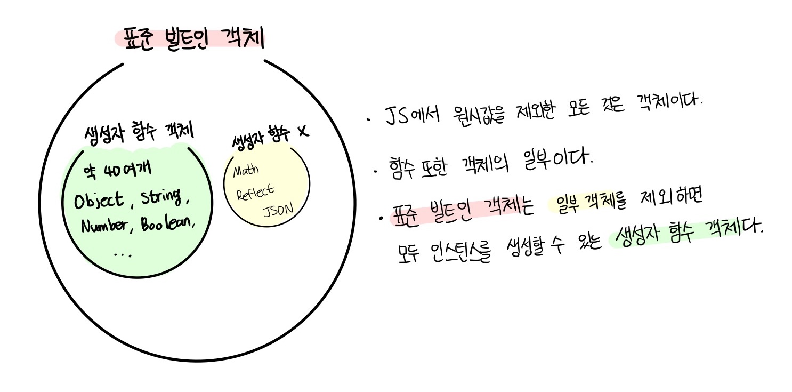

# 모던 자바스크립트 Deep Dive

## 목차

- [17장 생성자 함수에 의한 객체 생성](#17장-생성자-함수에-의한-객체-생성)
- [18장 함수와 일급 객체](#18장-함수와-일급-객체)
- [19장 프로토타입](#19장-프로토타입)
- [20장 strict mode](#20장-strict-mode)
- [21장 빌트인 객체](#21장-빌트인-객체)
- [22장 this](#22장-this)
- [23장 실행 컨텍스트](#23장-실행-컨텍스트)

## 17장 생성자 함수에 의한 객체 생성

<p>10장의 '객체 리터럴'에서 객체 리터럴에 의한 객체 생성 방식을 살펴보았다. 객체 리터럴에 의한 객체 생성 방식은 가장 일반적이고 간단한 객체 생성 방식이다. 객체는 객체 리터럴 이외에도 다양한 방법으로 생성할 수 있다. '객체 리터럴' 이외의 객체 생성 방법에 대해 알아본다.</p>

### 17.1 Object 생성자 함수

<p>new 연산자와 함께 Object 생성자 함수를 호출하면 빈 객체를 생성하여 반환한다. 이후 프로퍼티 또는 메서드를 추가하여 객체를 완성할 수 있다.</p>

```js
// 빈 객체의 생성
const person = new Object();

// 프로퍼티 추가 (객체는 mutable 하므로 key와 값을 자유롭게 추가, 삭제, 재 할당할 수 있다.)
person.name = "Lee";
person.sayHello = function () {
  console.log("Hi! My name is " + this.name);
};

console.log(person); // {name: "Lee", sayHello: ƒ}
person.sayHello(); // Hi! My name is Lee
```

<p>생성자 함수(constructor)란 new 연산자와 함께 호출하여 객체(인스턴스)를 생성하는 함수를 말한다. 생성자 함수에 의해 생성된 객체를 인스턴스(instance)라고 한다. 자바스크립트는 Object 생성자 함수 이외에도 String, Number, Boolean, Function, Array, Date, RegExp, Promise 등의 빌트인 생성자 함수를 제공한다.</p>

```js
// String 생성자 함수에 의한 String 객체 생성
const strObj = new String("Lee");
console.log(typeof strObj); // object
console.log(strObj); // String {"Lee"}

// Number 생성자 함수에 의한 Number 객체 생성
const numObj = new Number(123);
console.log(typeof numObj); // object
console.log(numObj); // Number {123}

// Boolean 생성자 함수에 의한 Boolean 객체 생성
const boolObj = new Boolean(true);
console.log(typeof boolObj); // object
console.log(boolObj); // Boolean {true}

// Function 생성자 함수에 의한 Function 객체(함수) 생성
const func = new Function("x", "return x * x");
console.log(typeof func); // function
console.dir(func); // ƒ anonymous(x)

// Array 생성자 함수에 의한 Array 객체(배열) 생성
const arr = new Array(1, 2, 3);
console.log(typeof arr); // object
console.log(arr); // [1, 2, 3]

// RegExp 생성자 함수에 의한 RegExp 객체(정규 표현식) 생성
const regExp = new RegExp(/ab+c/i);
console.log(typeof regExp); // object
console.log(regExp); // /ab+c/i

// Date 생성자 함수에 의한 Date 객체 생성
const date = new Date();
console.log(typeof date); // object
console.log(date); // Mon May 04 2020 08:36:33 GMT+0900 (대한민국 표준시)
```

<p>반드시 Object 생성자 함수를 사용해 빈 객체를 생성해야 하는 것은 아니다. 객체를 생성하는 방법은 객체 리터럴을 사용하는 것이 간편하다. Object 생성자 함수를 사용해 객체를 생성하는 방식은 특별한 이유가 없다면 유용해 보이지 않는다.</p>

### 17.2 생성자 함수

### 객체 리터럴에 의한 객체 생성 방식의 문제점

<p>객체 리터럴에 의한 객체 생성 방식은 단 하나의 객체만 생성하기 때문에 같은 프로퍼티를 갖는 객체를 여러 개 생산해야 하는 경우 비효율적이다.</p>

> 객체마다 getDiameter 메서드를 선언해주었다.

```js
const circle1 = {
  radius: 5,
  getDiameter() {
    return 2 * this.radius;
  },
};

console.log(circle1.getDiameter()); // 10

const circle2 = {
  radius: 10,
  getDiameter() {
    return 2 * this.radius;
  },
};

console.log(circle2.getDiameter()); // 20
```

<p>객체는 프로퍼티를 통해 객체 고유의 상태(state)를 표현한다. 그리고 메서드를 통해 상태 데이터인 프로퍼티를 참조하고 조작하는 동작(behavior)를 표현한다. 따라서 프로퍼티는 객체마다 프로퍼티 값이 다를 수 있지만 메서드는 내용이 동일한 경우가 일반적이다.</p>

### 생성자 함수에 의한 객체 생성 방식의 장점

<p>생성자 함수에 의한 객체 생성 방식은 마치 객체(인스턴스)를 생성하기 위한 템플릿(클래스)처럼 생성자 함수를 사용하여 프로퍼티 구조가 동일한 객체 여러 개를 간편하게 생성할 수 있다.</p>

```js
// 생성자 함수 (일반 함수와 동일한 방식으로 만들어지는 선언문이다)

function Circle(radius) {
  // 생성자 함수 내부의 this는 생성자 함수가 생성할 인스턴스를 가리킨다.
  this.radius = radius; // ex) circle1의 radius에 radius(5)를 할당해줘
  this.getDiameter = function () {
    return 2 * this.radius;
  };
}

// 인스턴스의 생성
const circle1 = new Circle(5); // 반지름이 5인 Circle 객체를 생성
const circle2 = new Circle(10); // 반지름이 10인 Circle 객체를 생성

console.log(circle1.getDiameter()); // 10
console.log(circle2.getDiameter()); // 20
```

> this

```
this는 객체 자신의 프로퍼티나 메서드를 참조하기 위한 자기 참소 변수(self-referencing variable)이다.
this가 가리키는 값, 즉 this 바인딩은 함수 호출 방식에 따라 동적으로 결정된다.
```

|    함수 호출 방식    |    this가 가리키는 값(this 바인딩)     |
| :------------------: | :------------------------------------: |
|  일반 함수로서 호출  |               전역 객체                |
|   메서드로서 호출    | 메서드를 호출한 객체(마침표 앞의 객체) |
| 생성자 함수로서 호출 | 생성자 함수가 (미래에) 생성할 인스턴스 |

```js
// 함수는 다양한 방식으로 호출될 수 있다.
function foo() {
  console.log(this);
}

// 일반적인 함수로서 호출
// 전역 객체는 브라우저 환경에서는 window, Node.js 환경에서는 global을 가리킨다.
foo(); // 전역 객체, window

// 메서드로서 호출
const obj = { foo }; // ES6 프로퍼티 축약 표현
obj.foo(); // 메서드를 호출한 객체, obj

// 생성자 함수로서 호출
const inst = new foo(); // 미래에 생성할 인스턴스, inst
```

<p>생성자 함수는 이름 그대로 객체(인스턴스)를 생성하는 함수다. 자바스크립트에서는 new 연산자를 일반 함수와 결합한 형태로 사용한다. 그말인 즉, new 연산자와 함께 생성자 함수를 호출하지 않으면 생성자 함수가 아니라 일반 함수로 동작한다는 것을 의미한다.</p>

```js

function Circle(radius) {
  // 생성자 함수 내부의 this는 생성자 함수가 생성할 인스턴스를 가리킨다.
  this.radius = radius; // ex) circle1의 radius에 radius(5)를 할당해줘
  this.getDiameter = function () {
    return 2 * this.radius;
  };
}
...

// new 연산자와 함께 호출하지 않으면 생성자 함수로 동작하지 않는다.
// 즉, 일반 함수로서 호출된다.
const circle3 = Circle(15);

// 일반 함수로서 호출된 Circle은 반환문이 없으므로 암묵적으로 undefined를 반환한다.
console.log(circle3); // undefined

// 일반 함수로서 호출된 Circle내의 this는 전역 객체(여기서는 window)를 가리킨다.
// 따라서 인스턴스는 생성되지 않았기 때문에 undefined를 출력하고,
// 일뱐 햠수로 호출되었기 때문에 전역 객체에 바인딩되어 15를 출력할 수 있다
console.log(radius); // 15
```

### 생성자 함수의 인스턴스 생성 과정

<p>생성자 함수의 역할은 프로퍼티 구조가 동일한 인스턴스를 생성하기 위한 템플릿(클래스)으로서 동작하여 인스턴스를 생성하는 것과 생성된 인스턴스를 초기화하는 것이다. 생성자 함수가 인스턴스를 생성하는 것은 필수이고, 생성된 인스턴스를 초기화하는 것은 옵션이다.</p>

```js
// 1. 생성자 함수 선언
function Circle(radius) {
  // 3. 인스턴스 초기화
  this.radius = radius;
  this.getDiameter = function () {
    return 2 * this.radius;
  };
}
// 2. 인스턴스 생성
const circle1 = new Circle(5); // 반지름이 5인 Circle 객체를 생성

//  1, 2, 3 순서로 실행된다
```

<p>생성자 함수 내부의 코드를 살펴보면 this에 프로퍼티(radius)를 추가하고 필요에 따라 전달된 인수(radius)를 프로퍼티의 초기 값으로서 할당하여 인스턴스를 초기화한다. 자바스크립트 엔진은 암묵적인 처리를 통해 인스턴스를 생성하고 반환한다. new 연산자와 함께 생성자 함수를 호출하면 자바스크립트 엔진은 다음과 같은 과정을 거쳐 암묵적으로 인스턴스를 생성하고 인스턴스를 초기화한 후 암묵적으로 인스턴스를 반환(return)한다.</p>

```
1. 인스턴스 생성과 this 바인딩
2. 인스턴스 초기화
3. 인스턴스 반환
```

### 인스턴스 생성과 this 바인딩

<p>암묵적으로 빈 객체가 생성된다. 이 빈 객체가 바로 (아직 완성되지는 않았지만) 생성자 함수가 생성한 인스턴스이다. 이 인스턴스는 this에 바인딩된다. 생성자 함수 내부의 this가 생성자 함수가 생성할 인스턴스를 가리키는 이유가 바로 이 때문이다. 이 처리는 함수 몸체의 코드가 한 줄씩 실행되는 런타임 이전에 실행된다.</p>

> 바인딩 (name binding)

```
바인딩이란 식별자와 값을 연결하는 과정을 의미한다. 예를 들어 변수 선언은 변수 이름(식별자)과 확보된 메모리 공간의 주소를 바인딩하는 것이다.
this 바인딩은 this와 this가 가리킬 객체(개발자에 의해 기술될)를 바인딩하는 것이다.
```

```js
function Circle(radius) {
  // 1. 암묵적으로 빈 객체가 생성되고 this에 바인딩된다.
  console.log(this); // Circle {}

  this.radius = radius;
  this.getDiameter = function () {
    return 2 * this.radius;
  };
}

console.log(Circle());
```

### 인스턴스 초기화

<p>셍성자 함수에 기술되어 있는 코드가 한 줄씩 실행되어 this에 바인딩되어 있는 인스턴스를 초기화한다. 생성자 함수가 인수로 전달받은 초기값을 인스턴스 프로퍼티에 할당하여 초기화하거나 고정값을 할당한다.</p>

```js
function Circle(radius) {
  // 1. 암묵적으로 인스턴스가 생성되고 this에 바인딩된다.

  // 2. this에 바인딩되어 있는 인스턴스를 초기화한다.
  this.radius = radius;
  this.getDiameter = function () {
    return 2 * this.radius;
  };
}
```

### 인스턴스 반환

<p>생성자 함수 내부의 모든 처리가 끝나면 완성된 인스턴스가 바인딩된 this가 암묵적으로 반환된다.</p>

```js
function Circle(radius) {
  // 1. 암묵적으로 인스턴스가 생성되고 this에 바인딩된다.

  // 2. this에 바인딩되어 있는 인스턴스를 초기화한다.
  this.radius = radius;
  this.getDiameter = function () {
    return 2 * this.radius;
  };

  // 3. 완성된 인스턴스가 바인딩된 this가 암묵적으로 반환된다
}

// 인스턴스 생성. Circle 생성자 함수는 암묵적으로 this를 반환한다.
const circle = new Circle(1);
console.log(circle); // Circle {radius: 1, getDiameter: ƒ}
```

<p>만약 this가 아닌 다른 객체를 <b>명시적으로 반환하면 return 문에 명시한 객체가 반환된다.</b></p>

```js
function Circle(radius) {
  // 1. 암묵적으로 인스턴스가 생성되고 this에 바인딩된다.

  // 2. this에 바인딩되어 있는 인스턴스를 초기화한다.
  this.radius = radius;
  this.getDiameter = function () {
    return 2 * this.radius;
  };

  // 3. 암묵적으로 this를 반환한다.
  // 명시적으로 객체를 반환하면 암묵적인 this 반환이 무시된다.
  return {};
}

// 인스턴스 생성. Circle 생성자 함수는 명시적으로 반환한 객체를 반환한다.
const circle = new Circle(1);
console.log(circle); // {}
```

<p>하지만 명시적으로 <b>원시 값</b>을 반환하면 원시 값 반환은 무시되고 암묵적으로 this가 반환된다.</p>

```js
function Circle(radius) {
  // 1. 암묵적으로 인스턴스가 생성되고 this에 바인딩된다.

  // 2. this에 바인딩되어 있는 인스턴스를 초기화한다.
  this.radius = radius;
  this.getDiameter = function () {
    return 2 * this.radius;
  };

  // 3. 암묵적으로 this를 반환한다.
  // 명시적으로 원시값을 반환하면 원시값 반환은 무시되고 암묵적으로 this가 반환된다.
  return 100;
}

// 인스턴스 생성. Circle 생성자 함수는 명시적으로 반환한 객체를 반환한다.
const circle = new Circle(1);
console.log(circle); // Circle {radius: 1, getDiameter: ƒ}
```

<p>이처럼 생성자 함수 내부에서 명시적으로 this가 아닌 다른 값을 반환하는 것은 생성자 함수의 기본 동작을 훼손한다. 따라서 생성자 함수 내부에서 return 문을 반드시 생략해야 한다.</p>

## 18장 함수와 일급 객체

### 18.1 일급 객체

<p>다음과 같은 조건을 만족하는 객체를 일급 객체라 한다.</p>

```
1. 무명의 리터럴로 생성할 수 있다. 즉, 런타임에 생성이 가능하다
2. 변수나 자료구조(객체, 배열 등)에 저장할 수 있다.
3. 함수의 매개변수에 전달할 수 있다.
4. 함수의 반환 값으로 사용할 수 있다.
```

<p>자바스크립트의 함수는 다음 예제와 같이 위의 조건을 모두 만족하므로 일급 객체다.</p>

```js
// 1. 함수는 무명의 리터럴로 생성할 수 있다.
// 2. 함수는 변수에 저장할 수 있다.

// 런타임(할당 단계)에 함수 리터럴이 평가되어 함수 객체가 생성되고 변수에 할당된다.
// 함수 표현식으로 작성되었다. 변수에 할당했기 때문에 변수 이름을 식별자로 사용하여 함수 이름은 무명으로 생성되었다.
const increase = function (num) {
  return ++num;
};

const decrease = function (num) {
  return --num;
};

// 2. 함수는 객체에 저장할 수 있다.
const predicates = { increase, decrease };

console.log(predicates); // predicates:  { increase: [Function: increase], decrease: [Function: decrease] }

// 3. 함수의 매개변수에게 전달할 수 있다.
// 4. 함수의 반환값으로 사용할 수 있다.
function makeCounter(predicate) {
  let num = 0;

  return function () {
    num = predicate(num);
    return num;
  };
}

// 3. 함수는 매개변수에게 함수를 전달할 수 있다.
const increaser = makeCounter(predicates.increase);
console.log(increaser()); // 1
console.log(increaser()); // 2

// 3. 함수는 매개변수에게 함수를 전달할 수 있다.
const decreaser = makeCounter(predicates.decrease);
console.log(decreaser()); // -1
console.log(decreaser()); // -2
```

<p>함수가 일급 객체라는 것은 함수를 객체와 동일하게 사용할 수 있다는 의미이다. 객체는 값이므로 함수는 값과 동일하게 취급할 수 있다. 따라서 함수는 값을 사용할 수 있는 곳(변수 할당문, 객체의 프로퍼티 값, 배열의 요소, 함수 호출의 인수, 함수 반환문)이라면 어디서든지 리터럴로 정의할 수 있으며 런타임에 함수 객체로 평가된다.</p>

<p>일급 객체로서 함수가 가지는 가장 큰 특징은 일반 객체와 같이 함수의 매개변수에 전달할 수 있으며, 함수의 반환값으로 사용할 수도 있다는 것이다. 이는 함수형 프로그래밍을 가능케 하는 자바스크립트의 장점 중 하나이다.</p>

<p>함수는 객체이지만 일반 객체와는 차이가 있다. 일반 객체는 호출할 수 없지만 함수 객체는 호출할 수 있다. 그리고 함수 객체는 일반 객체에는 없는 함수 고유의 프로퍼티를 소유한다.</p>

```js
var value = 10;

var consoleValue = function(){
  console.log(value);
}

>>>
value() , (x)
consoleValue() , (o)
```

### 18.2 함수 객체와 프로퍼티

<p>함수는 객체다. 따라서 함수도 프로퍼티를 가질 수 있다. 브라우저 콘솔에서 console.dir 메서드를 사용하여 함수 객체의 내부를 들여다 보자.</p>

```js
function square(number) {
  return number * number;
}

console.dir(square);
```


<p>square 함수의 모든 프로퍼티의 프로퍼티 어트리뷰트를 Object.getOwnPropertyDescriptions 메서드로 확인해 보면 다음과 같다.</p>

```js
function square(number) {
  return number * number;
}

console.log(Object.getOwnPropertyDescriptors(square));
/*
{
  length: {value: 1, writable: false, enumerable: false, configurable: true},
  name: {value: "square", writable: false, enumerable: false, configurable: true},
  arguments: {value: null, writable: false, enumerable: false, configurable: false},
  caller: {value: null, writable: false, enumerable: false, configurable: false},
  prototype: {value: {...}, writable: true, enumerable: false, configurable: false}
}
*/

// __proto__는 square 함수의 프로퍼티가 아니다.
console.log(Object.getOwnPropertyDescriptor(square, "__proto__")); // undefined

// __proto__는 Object.prototype 객체의 접근자 프로퍼티다.
// square 함수는 Object.prototype 객체로부터 __proto__ 접근자 프로퍼티를 상속받는다.
console.log(Object.getOwnPropertyDescriptor(Object.prototype, "__proto__"));
// {get: ƒ, set: ƒ, enumerable: false, configurable: true}
```

<p>이처럼 arguments, caller, name, property 프로퍼티는 모두 함수 객체의 데이터 프로퍼티다. 이들 프로퍼티는 일반 객체에는 없는 함수 객체 고유의 프로퍼티이다. 하지만 __proto__는 접근자 프로퍼티이며, 함수 객체 고유의 프로퍼티가 아니라 Object.prototype 객체의 프로퍼티를 상속받은 것을 알 수 있다.</p>

## 19장 프로토타입

<p>자바스크립트는 명령형, 함수형, 프로토타입 기반 객체지향 프로그래밍을 지원하는 멀티 패러다임 프로그래밍 언어다.</p>

<p>간혹 C++이나 자바 같은 클래스 기반 <b>객체지향 프로그래밍 언어의 특징인 클래스와 상속, 캡슐화를 위한 키워드인 public, private, protected 등이 없어서 자바스크립트는 객체지향 언어가 아니라고 오해하는 경우도 있다.</b> 하지만 <b>자바스크립트는 클래스 기반 객체지향 프로그래밍 언어보다 효율적이며 더 강력한 객체지향 프로그래밍 능력을 지니고 있는 프로토타입 기반의 객체지향 프로그래밍 언어다.</b></p>

> 클래스

```
ES6에서 클래스가 도입되었다. 하지만 ES6의 클래스가 기존의 프로토타입 기반 객체지향 모델을 폐지하고 새로운 객체지향 모델을 제공하는 것은 아니다.
사실 클래스도 함수이며, 기존 프로토타입 기반 패턴의 문법적 설탕이라고 볼 수 있다. 클래스와 생성자 함수는 모두 프로토타입 기반의 인스턴스를 생성하지만
정확히 동일하게 동작하지는 않는다. 클래스는 생성자 함수보다 엄격하며 클래스는 생성자 함수에서는 제공하지 않는 기능도 제공한다.

따라서 클래스를 프로토타입 기반 객체 생성 패턴의 단순한 문법적 설탕으로 보기보다는 새로운 객체 생성 메커니즘으로 보는 것이 좀 더 합당하다고 볼 수 있다.
```

<p>자바스크립트는 객체 기반의 프로그래밍 언어이며 자바스크립트를 이루고 있는 거의 '모든 것'이 객체다. 원시 타입의 값을 제외한 나머지 값들은 모두 객체이다.</p>

### 19.1 객체지향 프로그래밍

<p><b>객체지향 프로그래밍은 프로그램을 명령어 또는 함수의 목록으로 보는 전통적인 명령형 프로그래밍의 절차지향적 관점에서 벗어나 여러 개의 독립적 단위, 즉 객체의 집합으로 프로그램을 표현하려는 프로그래밍 패러다임을 말한다.</b> 객체지향 프로그래밍은 실세계의 실체를 인식하는 철학적 사고를 프로그래밍에 접목하려는 시도에서 시작한다. 실체는 특징이나 성질을 나타내는 속성을 가지고 있고, 이를 통해 실체를 인식하거나 구별할 수 있다.</p>

<p>예를 들어, 사람은 이름, 주소, 성별, 나이, 신장, 체중, 학력, 성격, 직업 등 다양한 속성을 갖는다. 이때 '이름은 아무개이고 성별은 여성이며 나이는 20세인 사람'과 같은 속성을 구체적으로 표현하면 특정한 사람을 다른사람과 구별하여 인식할 수 있다.</p>

<p>이러한 방식을 프로그래밍에 접목시켜보자. 사람에게는 다양한 속성이 있으나 우리가 구현하려는 프로그램에서는 사람의 '이름'과 '주소'라는 속성에만 관심이 있다고 가정하자. 이처럼 <b>다양한 속성 중에서 프로그램에 필요한 속성만 간추려 내어 표현하는 것을 추상화(abstraction)</b>라 한다.</p>

> 이름과 주소라는 속성을 갖는 person 이라는 객체를 자바스크립트로 표현하면 다음과 같다.

```js
// 이름과 주소 속성을 갖는 객체
const person = {
  name: "Lee",
  address: "Seoul",
};

console.log(person); // {name: "Lee", address: "Seoul"}
```

<p>이때 프로그래머(subject, 주체)는 이름과 주소 속성으로 표현된 객체(object)인 person을 다른 객체와 구별하여 인식할 수 있다. 이처럼 <b>속성을 통해 여러 개의 값을 하나의 단위로 구성한 복합적인 자료구조</b>를 객체라 하며, 객체지향 프로그래밍은 독립적인 객체의 집합으로 프로그램을 표현하려는 프로그래밍 패러다임이다.</p>

<p>이번에는 원(circle)이라는 개념을 객체로 만들어보자. 원에는 반지름이라는 속성(프로퍼티)가 있다. 이 반지름을 가지고 원의 지름, 둘레, 넓이를 구할 수 있다. 이때 반지름은 원의 상태를 나타내는 데이터이며 원의 지름, 둘레, 넓이를 구하는 것은 동작이다.</p>

```js
const circle = {
  radius: 5, // 반지름

  // 원의 지름: 2r
  getDiameter() {
    return 2 * this.radius;
  },

  // 원의 둘레: 2πr
  getPerimeter() {
    return 2 * Math.PI * this.radius;
  },

  // 원의 넓이: πrr
  getArea() {
    return Math.PI * this.radius ** 2;
  },
};

console.log(circle);
// {radius: 5, getDiameter: ƒ, getPerimeter: ƒ, getArea: ƒ}

console.log(circle.getDiameter()); // 10
console.log(circle.getPerimeter()); // 31.41592653589793
console.log(circle.getArea()); // 78.53981633974483
```

```js
case 2: this가 없으면 어떻게 되나요?

const circle = {
  radius: 5, // 반지름

  // 원의 지름: 2r
  getDiameter() {
    return 2 * radius;
  },

  // 원의 둘레: 2πr
  getPerimeter() {
    return 2 * Math.PI * radius;
  },

  // 원의 넓이: πrr
  getArea() {
    return Math.PI * radius ** 2;
  },
};

console.log(circle.getDiameter()); // ReferenceError: radius is not defined

/*
circle 객체의 메서드인 getDiameter는 자신만의 코드 블록(스코프)를 가지고 있다.
따라서 객체 내부에서 선언된 프로퍼티인 radius를 메서드 내부에서 사용하기 위해서는
this 바인딩을 통해 우리가 사용하려는 radius가 circle 객체 내부에서 메서드인 getDiameter 보다
상위 스코프에 있는 프로퍼티 radius라는 것을 명시해줘야 한다. (this.radius)
*/
```

<p>이처럼 객체지향 프로그래밍은 객체의 상태(state)를 나타내는 데이터(property)와 상태 데이터를 조작할 수 있는 동작(behavior > method)을 하나의 논리적인 단위로 묶어 생각한다. 각 객체는 고유의 기능을 갖는 독립적인 부품으로 볼 수 있지만 자신의 고유한 기능을 수행하면서 다른 객체와 관계성(relationship)을 가질 수 있다. 다른 객체와 메시지를 주고받거나 데이터를 처리할 수도 있다. 또는 다른 객체의 상태 데이터나 상속받아 사용하기도 한다.</p>

### 19.2 상속과 프로토타입

<p>상속(inheritance)은 객체지향 프로그래밍의 핵심 개념으로, 어떤 객체의 프로퍼티 또는 메서드를 다른 객체가 상속받아 그대로 사용할 수 있는 것을 말한다.</p>

<p>자바스크립트는 프로토타입을 기반으로 상속을 구현하여 불필요한 중복을 제거한다. 중복을 제거하는 방법은 기존의 코드를 적극적으로 재사용하는 것이다.</p>

```js
// 생성자 함수 (대문자로 표시함, 후에 new 연산자와 함께 사용한다.)
function Circle(radius) {
  this.radius = radius;
  this.getArea = function () {
    /*
    함수 리터럴 또는 일반 함수가 아닌, 생성자 함수로 사용할 경우 this. 를 통해 명시해줘야 한다.
    why? 미리 함수를 정의해놓는 것이 아닌, 프로토타입에 의해 생성될 인스턴스를 위해 미리 만들어 놓은 프로퍼티/ 메서드이기 때문이다.
    */
    return Math.PI * this.radius ** 2;
  };
}

// 반지름이 1인 인스턴스 생성
const circle1 = new Circle(1);
// 반지름이 2인 인스턴스 생성
const circle2 = new Circle(2);

// Circle 생성자 함수는 인스턴스를 생성할 때마다 동일한 동작을 하는
// getArea 메서드를 중복 생성하고 모든 인스턴스가 중복 소유한다. (현재는 개별 메모리에 각각 생성된, 메서드의 중복이 있는 상태)
// getArea 메서드는 하나만 생성하여 모든 인스턴스가 공유해서 사용하는 것이 바람직하다.

🌟 console.log(circle1.getArea === circle2.getArea); // false

console.log(circle1.getArea()); // 3.141592653589793
console.log(circle2.getArea()); // 12.566370614359172
```

<p>앞서 다룬 '생성자 함수'에서 살펴본 바와 같이 생성자 함수는 동일한 프로퍼티(메서드 포함) 구조를 갖는 객체를 여러 개 생성할 때 유용하다. 하지만 위 예제의 생성자 함수는 문제가 있다.</p>

<p>Cirlce 생성자 함수가 생성하는 모든 객체(인스턴스)는 radius 프로퍼티와 getArea 메서드를 갖는다. radius 프로퍼티 값은 일반적으로 인스턴스마다 다르다. 하지만 getArea 메서드는 모든 인스턴스가 동일한 내용의 메서드를 사용하므로 <b>단 하나만 생성하여 모든 인스턴스가 공유해서 사용하는 것이 바람직하다.</b> 그런데 현재 위 예제에서는 Circle 생성자 함수는 인스턴스를 생성할 때마다 getArea 메서드를 중복 생성하고 모든 인스턴스가 중복 소유한다.</p>


<p>이처럼 동일한 생성자 함수에 의해 생성된 모든 인스턴스가 동일한 메서드를 중복 소유하는 것은 메모리를 불필요하게 낭비한다. 상속을 통해 불필요한 중복을 제거해 보자. <b>자바스크립트는 프로토타입을 기반으로 상속을 구현한다.</b></p>

> 여기서 자바스크립트 OOP의 특징인 프로토타입 기반의 객체지향 프로그래밍의 개념이 들어간다.

```js
// 생성자 함수
function Circle(radius) {
  this.radius = radius;
}

// Circle 생성자 함수가 생성한 모든 인스턴스가 getArea 메서드를
// 공유해서 사용할 수 있도록 프로토타입에 추가한다.
// 프로토타입은 Circle 생성자 함수의 prototype 프로퍼티에 바인딩되어 있다.
Circle.prototype.getArea = function () {
  return Math.PI * this.radius ** 2;
};

// 인스턴스 생성
const circle1 = new Circle(1);
const circle2 = new Circle(2);

// Circle 생성자 함수가 생성한 모든 인스턴스는 부모 객체의 역할을 하는
// 프로토타입 Circle.prototype으로부터 getArea 메서드를 상속받는다.
// 즉, Circle 생성자 함수가 생성하는 모든 인스턴스는 하나의 getArea 메서드를 공유한다.
🌟 console.log(circle1.getArea === circle2.getArea); // true

console.log(circle1.getArea()); // 3.141592653589793
console.log(circle2.getArea()); // 12.566370614359172
```


<p>Circle 생성자 함수가 생성한 모든 인스턴스는 자신의 프로토타입, 즉 상위(부모) 객체 역할을 하는 Circle prototype의 모든 프로퍼티와 메서드를 상속 받는다. 즉, 자신의 상태를 나타내는 radius 프로퍼티만 개별적으로 소유하고 내용이 동일한 메서드는 상속을 통해 공유하여 사용하는 것이다.</p>

<p>상속은 코드의 재사용이란 관점에서 매우 유용하다. 생성자 함수가 생성할 모든 인스턴스가 공통적으로 사용할 프로퍼티나 메서드를 프로토타입에 미리 구현해 두면 생성자 함수가 생성할 모든 인스턴스는 별도의 구현없이 상위(부모)객체인 프로토타입의 자산(프로퍼티, 메서드)을 공유하여 사용할 수 있다.</p>

### 이후 프로토 타입 정리에 대하여

```
프로토타입을 통해서 클래스형 OOP와의 차별점을 둔 JS의 방식에 대해서는 이해를 일부 하겠으나, 실질적으로 내가 작성하거나 공부하고 있는 강의를 살펴 보았을 때
우리가 이러한 프로토타입 기반의 객체지향 프로그래밍을 통해 과연 프로그래밍을 하고 있는지에 대한 의문이 들었다. 프로토타입을 객체를 통해 OOP의 장점인 상속을
구현하고 이를 통해 코드의 재사용성을 증가시켜 메모리를 줄인다는 대의는 이해를 했으나, [[Prototype]] 과 같이 내부 슬롯, 내부 메서드, __proto__ 등과
같이 상대적으로는 추상적인 개념을 계속 공부하는 게 너무 어렵게 느껴졌다. 물론 이 책과 '프로토타입'에 대한 내용을 1회독으로 끝낼 생각은 아니지만, 어느정도
js에 대한 이해를 더 높힌 뒤에 이전에 내가 느꼈던 것처럼 다시 나에게 필요한 개념이라고 생각이 들 때 더욱 집중적으로 봐야겠다.

단어가 반복되는데 책으로 밑줄만 쳐서는 도저히 읽고 이해가 안돼서, 가볍게 필기를 병행하여 작성해 보았다.

아마 후에 20장 이후 공부를 진행하면서 프로토타입에 대한 공부가 내용이 더해질 때 이 부분에 더 추가하도록 하겠다.
```

### 프로토 타입이란?


### 19.3 프로토타입 객체


### `__proto__` 접근자 프로퍼티


### `__proto__` 접근자 프로퍼티를 통해 프로토타입에 접근하는 이유


### `__proto__` 접근자 프로퍼티를 코드 내에서 직접 사용하는 것은 권장하지 않는다.

<p>`__proto__` 접근자 프로퍼티는 ES5까지 ECMAScript 사양에 포함되지 않은 비표준이었다. 하지만 일부 브라우저에서 __proto__를 지원하고 있었기 때문에 브라우저 호환성을 고려하여 ES6에서 __proto__를 표준으로 채택했다. 하지만 코드 내에서 __proto__ 접근자 프로퍼티를 직접 사용하는 것은 권장하지 않는다. 모든 객체가 __proto__ 접근자 프로퍼티를 사용할 수 있는 것은 아니기 때문이다.</p>

<p>따라서 __proto__ 접근자 프로퍼티 대신 프로토타입의 참조를 취득하고 싶은 경우에는 Object.getPrototypeOf 메서드를 사용하고, 프로토타입을 교체하고 싶은 경우에는 Object.setPrototypeOf 메서드를 사용할 것을 권장한다. </p>

```js
const obj = {}; // 객체 리터럴을 통해 obj를 선언
const parent = { x: 1 };

// obj 객체의 프로토타입을 취득
Object.getPrototypeOf(obj); // obj.__proto__;
// obj 객체의 프로토타입을 교체
Object.setPrototypeOf(obj, parent); // obj.__proto__ = parent;

console.log(obj.x); // 1
```

### 함수 객체의 prototype 프로퍼티

<p><b>함수 객체만이 소유하는 prototype 프로퍼티는 생성자 함수가 생성할 인스턴스의 프로토타입을 가리킨다.</b></p>

```js
// 함수 객체는 prototype 프로퍼티를 소유한다.
(function () {}.hasOwnProperty("prototype")); // -> true

// 일반 객체는 prototype 프로퍼티를 소유하지 않는다.
({}.hasOwnProperty("prototype")); // -> false
```

<p>prototype 프로퍼티는 <b>생성자 함수가 생성할 객체(인스턴스)의 프로토타입을 가리킨다.</b> 따라서 생성자 함수로 호출할 수 없는, non-constructor인 화살표 함수와 ES6 메서드 축약 표현으로 정의한 메서드는 prototype 프로퍼티를 소유하지 않으며 프로토타입도 생성하지 않는다.</p>

```js
/*
non-constructor 
1. 화살표 함수
2. ES6의 메서드 축약 표현
*/

// 화살표 함수는 non-constructor다.
const Person = (name) => {
  this.name = name;
};

// non-constructor는 prototype 프로퍼티를 소유하지 않는다.
console.log(Person.hasOwnProperty("prototype")); // false

// non-constructor는 프로토타입을 생성하지 않는다.
console.log(Person.prototype); // undefined

// ES6의 메서드 축약 표현으로 정의한 메서드는 non-constructor다.
const obj = {
  foo() {},
};

// non-constructor는 prototype 프로퍼티를 소유하지 않는다.
console.log(obj.foo.hasOwnProperty("prototype")); // false

// non-constructor는 프로토타입을 생성하지 않는다.
console.log(obj.foo.prototype); // undefined
```

<p>생성자 함수로 호출하기 위해 정의하지 않은 일반 함수도 prototype 프로퍼티를 소유하지만 객체를 생성하지 않는 일반 함수(생성자 함수로 쓰이지 않은 함수)의 prototype 프로퍼티는 아무런 의미가 없다.</p>

<p>모든 객체가 가지고 있는(엄밀히 말하면 Object.prototype으로부터 상속받은) __proto__ 접근자 프로퍼티와 함수 객체만이 가지고 있는 prototype 프로퍼티는 결국 동일한 프로토타입을 가리킨다. 하지만 이들의 프로퍼티를 사용하는 주체가 다르다는 것을 알아야 한다.</p>

|            구분            |    소유     |        값         |  사용 주체  |                                  사용 목적                                   |
| :------------------------: | :---------: | :---------------: | :---------: | :--------------------------------------------------------------------------: |
| `__proto__`접근자 프로퍼티 |  모든 객체  | 프로토타입의 참조 |  모든 객체  |           객체가 자신의 프로토타입에 접근 또는 교체하기 위해 사용            |
|    `prototype` 프로퍼티    | constructor | 프로토타입의 참조 | 생성자 함수 | 생성자 함수가 자신이 생성할 객체(인스턴스)의 프로토타입을 할당하기 위해 사용 |

<p>예를 들어, 생성자 함수로 객체를 생성한 후 `__proto__` 접근자 프로퍼티와 `prototype` 프로퍼티로 프로토타입 객체에 접근해보자.</p>

```js
// 생성자 함수
function Person(name) {
  this.name = name;
}

const me = new Person("Lee");

// 결국 Person.prototype과 me.__proto__는 결국 동일한 프로토타입을 가리킨다.
console.log("Person.prototype: ", Person.prototype); // Person.prototype:  {}
console.log("me.__proto__: ", me.__proto__); // me.__proto__:  {}
console.log(Person.prototype === me.__proto__); // true
```

### 프로토타입의 constructor 프로퍼티와 생성자 함수

<p>모든 프로토타입(=프로토타입 객체)은 constructor 프로퍼티를 갖는다. 이 constructor 프로퍼티는 prototype 프로퍼티로 자신을 참조하고 있는 생성자 함수를 가리킨다. 이 연결은 생성자 함수가 생성될 때, 즉 함수 객체가 생성될 때 이루어 진다.</p>

> prototype 프로퍼티는 함수 객체만이 소유하는, 인스턴스의 프로터타입을 가리키는 프로퍼티이다.<br/>
> 인스턴스를 생성하기 위해서는 해당 함수가 생성자 함수로 사용되어야 하므로, <br/>
> 생성자 함수를 만드는 프로토타입이 constructor 프로퍼티를 갖는다고 생각해도 무방하다.

```js
// 생성자 함수
function Person(name) {
  this.name = name;
}

// new Person() 프로토타입을 통해 me 라는 인스턴스를 생성하였다.
const me = new Person("Lee");

// me 객체의 생성자 함수는 Person이다.
console.log("me.constructor: ", me.constructor); //me.constructor:  [Function: Person]
console.log("Person: ", Person); // Person:  [Function: Person]

console.log(me.constructor === Person); // true

// me를 만든 사람이 누구니? >> Person 프로토타입이야
```

<p>위 예제에서 Person 생성자 함수는 me 객체를 생성했다. 이때 me 객체는 프로토타입의 constructor 프로퍼티를 통해 생성자 함수와 연결된다. me 객체에는 constructor 프로퍼티가 없지만 me 객체의 프로토타입인 Person.prototype에는 constructor 프로퍼티가 있다. 따라서 me 객체는 프로토타입인 Person.prototype의 constructor 프로퍼티를 상속받아 사용할 수 있다.</p>

### 19.4 리터럴 표기법에 의해 생성된 객체의 생성자 함수와 프로토타입

<p>앞에서 살펴본 바와 같이 생성자 함수에 의해 생성된 인스턴스는 프로토타입의 constructor 프로퍼티에 의해 생성자 함수와 연결된다. 이때 constructor 프로퍼티가 가리키는 생성자 함수는 인스턴스를 생성한 생성자 함수이다.</p>

```js
// obj 객체를 생성한 생성자 함수는 Object다.
/*
new Object()로 선언된 Object()는 사용자에 의해 생성된 생성자 함수가 아닌 ECMAScript가 제공하는 '빌트인 생성자 함수'이다.
위에 관한 내용은 후에 다루게 된다.
*/
const obj = new Object();
console.log(obj.constructor === Object); // true

// add 함수 객체를 생성한 생성자 함수는 Function이다.
const add = new Function("a", "b", "return a + b");
console.log(add.constructor === Function); // true

// 생성자 함수
function Person(name) {
  this.name = name;
}

// me 객체를 생성한 생성자 함수는 Person이다.
const me = new Person("Lee");
console.log(me.constructor === Person); // true
```

<p>하지만 리터럴 표기법에 의한 객체 생성 방식과 같이 명시적으로 new 연산자와 함께 생성자 함수를 호출하여 인스턴스를 생성하지 않는 객체 생성 방식도 있다.(객체 리터럴 등)</p>

> new 연산자를 사용하지 않는 객체 리터럴 방식 (인스턴스를 생성하지 않는다.)

```js
// 객체 리터럴
const obj = {};

// 함수 리터럴
const add = function (a, b) {
  return a + b;
};

// 배열 리터럴
const arr = [1, 2, 3];

// 정규표현식 리터럴
const regexp = /is/gi;
```

<p>리터럴 표기법에 의해 생성된 객체도 물론 프로토타입이 존재한다. 하지만 리터럴 표기법에 의해 생성된 객체의 경우 프로토타입의 constructor 프로퍼티가 가리키는 생성자 함수가 반드시 객체를 생성한 생성자 함수라고 단정할 수는 없다.</p>

```js
// obj 객체는 Object 생성자 함수로 생성한 객체가 아니라 객체 리터럴로 생성했다.
const obj = {};

// 하지만 obj 객체의 생성자 함수는 Object 생성자 함수다.
console.log(obj.constructor === Object); // true

/*
리터럴 표기법에 의해 생성된 객체의 경우 프로토타입의 constructor 프로퍼티가 가리키는 생성자 함수가 반드시 객체를 생성한 생성자 함수라고 단정할 수는 없다.
*/
```

<p>그렇다면 객체 리터럴에 의해 생성된 객체는 사실 Object 생성자 함수로 생성되는 것은 아닐까? ECMAScript 사양을 살펴보자. Object 생성자 함수는 다음과 같이 구현하도록 정의되어 있다.</p>


<p>2에서 Object 생성자 함수에 인수를 전달하지 않거나 undefined 또는 null을 인수로 전달하면서 호출하면 내부적으로는 추상 연산 <b>OrdinaryObjectCreate</b>를 호출하여 Object.prototype을 프로토타입으로 갖는 빈 객체를 생성한다.</p>

```js
// 2. Object 생성자 함수에 의한 객체 생성

// Object 생성자 함수는 new 연산자와 함께 호출하지 않아도 new 연산자와 함께 호출한 것과 동일하게 동작한다.
// 인수가 전달되지 않았을 때 추상 연산 OrdinaryObjectCreate를 호출하여 빈 객체를 생성한다.
let obj = new Object();
console.log(obj); // {}

// 1. new.target이 undefined나 Object가 아닌 경우

// 인스턴스 -> Foo.prototype -> Object.prototype 순으로 프로토타입 체인이 생성된다.
class Foo extends Object {}
new Foo(); // Foo {}

// 3. 인수가 전달된 경우에는 인수를 객체로 변환한다.

// Number 객체 생성
obj = new Object(123);
console.log(obj); // Number {123}

// String  객체 생성
obj = new Object("123");
console.log(obj); // String {"123"}
```

<p>객체 리터럴(생성자 함수 사용 x)이 평가될 때는 다음과 같이 추상 연산 OrdinaryObjectCreate를 호출하여 빈 객체를 생성하고 프로퍼티를 추가하도록 정의되어 있다.</p>


<p>이처럼 Object 생성자 함수 호출과 객체 리터럴의 평가는 추상 연산 OrdinaryObjectCreate를 호출하여 빈 객체를 생성하는 점에서 동일하지만, 세부 내용은 다르다. 따라서 객체 리터럴에 의해 생성된 객체는 Object 생성자 함수가 생성한 객체가 아니다.</p>

<p>함수 객체의 경우 차이가 더 명확하다. 'Function 생성자 함수, 함수 호이스팅'에서 살펴보았듯이 Function 생성자 함수를 호출하여 생성한 함수는 렉시컬 스코프를 만들지 않고 전역 함수인 것처럼 스코프를 생성하며 클로저도 만들지 않는다. 따라서 함수 선언문과 함수 표현식을 평가하여 함수 객체를 생성한 것은 Function 생성자 함수가 아니다.</p>

> <a href="https://github.com/junh0328/upgrade_javascript/blob/master/DEEPDIVE/readme.md#124-%ED%95%A8%EC%88%98-%EC%A0%95%EC%9D%98">`# 12.4 함수 정의 바로가기`</a>

```js
// foo 함수는 Function 생성자 함수로 생성한 함수 객체가 아니라 함수 선언문으로 생성했다.
function foo() {}

// 하지만 constructor 프로퍼티를 통해 확인해보면 함수 foo의 생성자 함수는 Function 생성자 함수다.
console.log(foo.constructor === Function); // true
```

<p>리터럴 표기법에 의해 생성된 객체도 상속을 위해 프로토타입이 필요하다. 따라서 리터럴 표기법에 의해 생성된 객체도 <b>가상의 생성자 함수를 갖는다.</b> 프로토타입은 생성자 함수와 더불어 생성되며 prototype, constructor 프로퍼티에 의해 연결되어 있기 때문이다. 다시 말해, 프로토타입과 생성자 함수는 단독으로 존재할 수 없고, 언제나 쌍(pair)으로 존재한다.</p>

<p>리터럴 표기법에 의해 생성된 객체는 생성자 함수에 의해 생성된 객체는 아니다. 하지만 큰 틀에서 생각해 보면 리터럴 표기법으로 생성한 객체도 생성자 함수로 생성한 객체와 본질적으로 큰 차이는 없다. 예를 들어, <b>객체 리터럴에 의해 생성한 객체와 Object 생성자 함수에 의해 생성한 객체</b>는 생성 과정에는 미묘한 차이가 있지만 결국 객체로서 동일한 특성을 갖는다.</p>

<p><b>함수 리터럴에 의해 생성한 함수와 Function 생성자 함수에 의해 생성한 함수</b>는 생성 과정과 스코프, 클로저 등의 차이가 있지만 결국 함수로서 동일한 특성을 갖는다. 따라서 <b>프로토타입의 constructor 프로퍼티를 통해 연결되어 있는 함수</b>를 <b>리터럴 표기법으로 생성한 객체를 생성한 생성자 함수로</b> 생각해도 크게 무리는 없다. 리터럴 표기법에 의해 생성된 객체의 생성자 함수와 프로토타입은 다음과 같다.</p>

| 리터럴 표기법      | 생성자 함수 | 프로토타입         |
| :----------------- | :---------- | :----------------- |
| 객체 리터럴        | Object      | Object.prototype   |
| 함수 리터럴        | Function    | Function.prototype |
| 배열 리터럴        | Array       | Array.prototype    |
| 정규 표현식 리터럴 | RegExp      | RegExp.prototype   |

### 19.5 프로토타입의 생성 시점

<p>리터럴 표기법에 의해 생성된 객체도 생성자 함수와 연결되는 것을 살펴보았다. 객체는 리터럴 표기법 또는 생성자 함수에 의해 생성되므로 결국 모든 객체는 생성자 함수와 연결되어 있다.</p>

<p>프로토타입은 생성자 함수가 생성되는 시점에 더불어 생성된다. <b>19.4 리터럴 표기법에 의해 생성된 객체의 생성자 함수와 프로토타입</b>에서 살펴본 바와 같이 프로토타입과 생성자 함수는 단독으로 존재할 수 없고 언제나 쌍으로 존재하기 때문이다. 생성자 함수는 두 가지로 구분할 수 있다.</p>

```
1. 사용자가 직접 정의한 사용자 정의 생성자 함수
2. 자바스크립트가 기본 제공하는 빌트인 생성자 함수
```

<p>위 두 가지 방식을 사용하여 프로토타입 생성 시점에 대해 살펴보자</p>

### 사용자 정의 생성자 함수와 프로토타입 생성 시점

<p>사용자 정의 생성자 함수는 화살표 함수나 ES6의 메서드 축약 표현으로 정의하지 않고 일반 함수(함수 선언문, 함수 표현식)로 정의한 함수 객체는 new 연산자와 함께 생성자 함수로서 호출할 수 있다. 생성자 함수로서 호출할 수 있는 함수, 즉 <b>constructor는 함수 정의가 평가되어 함수 객체를 생성하는 시점(런타임 이전)에 프로토타입도 더불어 생성된다.</b></p>

```js
// 함수 정의(constructor)가 평가되어 함수 객체를 생성하는 시점에 프로토타입도 더불어 생성된다.
// 함수 선언문은 호이스팅되어 런타임 이전에 평가되기 때문에 Person.prototype의 결과를 뽑아낼 수 있다.

case 1: 함수 선언문
console.log(Person.prototype); // {constructor: ƒ}

// 생성자 함수
function Person(name) {
  this.name = name;
}


case 2: 함수 표현식

console.log(Person.prototype); // Cannot access 'Person' before initialization
// 함수 표현식은 선언문과 달리 값으로 평가되기 때문에 런타임에 평가가 이뤄진다.
// 따라서 위와 같이 최기화되지 않은 Person에 접근할 수 없다는 에러메시지를 볼 수 있다.

// 생성자 함수
const Person = function (name) {
  this.name = name;
};
```

<p>생성자 함수로서 호출할 수 없는 함수, 즉 non-constructor는 프로토타입이 생성되지 않는다.</p>

```js
// 화살표 함수는 non-constructor다.
const Person = (name) => {
  this.name = name;
};

// non-constructor는 프로토타입이 생성되지 않는다.
console.log(Person.prototype); // undefined
```

<p>앞서 '함수 생성 시점과 호이스팅'에서 살펴보았듯이 함수 선언문은 런타임 이전에 자바스크립트 엔진에 의해 먼저 실행된다. 따라서 함수 선언문으로 정의된 Person 생성자 함수는 어떤 코드보다 먼저 평가되어 함수 객체가 된다. 이때 프로토타입도 더불어 생성된다. 생성된 프로토타입은 Person 생성자 함수의 prototype 프로퍼티에 바인딩된다. Person 생성자 함수와 더불어 생성된 프로토타입의 내부를 살펴보자.</p>

<br/>


<p>생성된 프로토타입(Person.prototype)은 오직 constructor 프로퍼티만을 갖는 객체다. 프로토타입도 객체이고 모든 객체는 프로토타입을 가지므로 프로토타입도 자신의 프로토타입을 갖는다. 생성된 프로토타입은 Object.prototype이다. 빌트인 생성자 함수가 아닌 사용자 정의 생성자 함수는 자신이 평가되어 함수 객체로 생성되는 시점에 프로토타입도 더불어 생성되며, 생성된 프로토타입의 프로토타입은 언제나 Object.prototype이다.</p>

### 빌트인 생성자 함수와 프로토타입 생성 시점

<p><b>Object, String, Number, Function, Array, RegExp, Date, Promise 등과 같은 빌트인 생성자 함수</b>도 일반 함수와 마찬가지로 빌트인 생성자 함수가 생성되는 시점에 프로토타입이 생성된다. 모든 빌트인 생성자 함수는 전역 객체가 생성되는 시점에 생성된다. 생성된 프로토타입은 빌트인 생성자 함수의 prototype 프로퍼티에 바인딩된다.</p>

### 전역 객체

```
전역 객체는 코드가 실행되기 이전 단계에 자바스크립트 엔진에 의해 생성되는 특수한 객체다.
전역 객체는 클라이언트 사이드 환경(브라우저)에서는 window, 서버 사이드 환경(Node.js)에서는 global 객체를 의미한다.
전역 객체는 표준 빌트인 객체(Object, String, Number, Function, Array...) 들과 환경에 따른 호스트 객체,
그리고 var 키워드로 선언한 전역 변수와 전역 함수를 프로퍼티로 갖늗다.

표준 빌트인 객체인 Object 또한 전역 객체의 프로퍼티이며, 전역 객체가 생성되는 시점에 생성된다.
전역 객체와 표준 빌트인 객체에 대해서는 후에 '빌트인 객체'에서 알아 본다.
```

<p>이처럼 객체(인스턴스)가 생성되기 이전에 생성자 함수와 프로토타입은 이미 객체화되어 존재한다. 이후 생성자 함수 또는 리터럴 표기법으로 객체를 생성하면 프로토타입은 생성된 객체의 [[Prototype]] 내부 슬롯에 할당된다. 이로써 생성된 객체(인스턴스)는 프로토타입을 상속받는다.</p>

### 19.10 instanceof 연산자

<p>instanceof 연산자는 이항(항이 2개) 연산자로서 좌변에 객체를 가리키는 식별자, 우변에 생성자 함수를 가리키는 식별자를 피연산자로 받는다. 만약 우변의 피연산자가 함수가 아닌 경우 TypeError가 발생한다.</p>

```
객체 instanceof 생성자 함수
```

<p>우변의 생성자 함수의 prototype에 바인딩된 객체가 좌변의 객체의 프로토타입 체인 상에 존재하면 true로 평가되고, 그렇지 않은 경우에는 false로 평가된다.</p>

```js
// 생성자 함수
function Person(name) {
  this.name = name;
}

const me = new Person("Lee");

// Person.prototype이 me 객체의 프로토타입 체인 상에 존재하므로 true로 평가된다.
console.log(me instanceof Person); // true

// Object.prototype이 me 객체의 프로토타입 체인 상(제일 상위에 있겠죠?)에 존재하므로 true로 평가된다.
console.log(me instanceof Object); // true
```

<p>instanceof 연산자가 어떻게 동작하는지 이해하기 위해 프로토타입을 교체해 보자.</p>

```js
// 생성자 함수
function Person(name) {
  this.name = name;
}

const me = new Person("Lee");

// 프로토타입으로 교체할 객체
const parent = {};

// 프로토타입의 교체
Object.setPrototypeOf(me, parent);

// Person 생성자 함수와 parent 객체는 연결되어 있지 않다.
console.log(Person.prototype === parent); // false
console.log(parent.constructor === Person); // false

// Person.prototype이 me 객체의 프로토타입 체인 상에 존재하지 않기 때문에 false로 평가된다.
console.log(me instanceof Person); // false

// Object.prototype이 me 객체의 프로토타입 체인 상에 존재하므로 true로 평가된다.
console.log(me instanceof Object); // true
```

> 프로토타입 교체를 모른다면?

```
ctrl + F 'setPrototypeOf'
```

<p>me 객체는 비록 프로토타입이 교체되어 프로토타입과 생성자 함수 간의 연결이 파괴되었지만 Person 생성자 함수에 의해 생성된 인스턴스임에는 틀림이 없다. 그러나 me instanceof Person은 false로 평가된다. 이는 Person.prototype이 me 객체의 프로토타입 체인 상에 존재하지 않기 때문이다. 따라서 프로토타입으로 교체한 parent 객체를 Person 생성자 함수의 prototype 프로퍼티에 바인딩하면 me instanceof Person은 true로 평가될 것이다.</p>

```js
// 생성자 함수
function Person(name) {
  this.name = name;
}

const me = new Person("Lee");

// 프로토타입으로 교체할 객체
const parent = {};

// 프로토타입의 교체
Object.setPrototypeOf(me, parent);

// Person 생성자 함수와 parent 객체는 연결되어 있지 않다.
console.log(Person.prototype === parent); // false
console.log(parent.constructor === Person); // false

// parent 객체를 Person 생성자 함수의 prototype 프로퍼티에 바인딩한다.
Person.prototype = parent;

// Person.prototype이 me 객체의 프로토타입 체인 상에 존재하므로 true로 평가된다.
console.log(me instanceof Person); // true

// Object.prototype이 me 객체의 프로토타입 체인 상에 존재하므로 true로 평가된다.
console.log(me instanceof Object); // true
```

<p>이처럼 <b>instanceof 연산자는 프로토타입의 constructor 프로퍼티가 가리키는 생성자 함수를 찾는 것이 아니라 생성자 함수의 prototype에 바인딩 된 객체가 프로토타입 체인 상에 존재하는지 확인한다.</b></p>

### 19.12 정적 프로퍼티/메서드

<p>정적(static) 프로퍼티/메서드는 생성자 함수로 인스턴스를 생성하지 않아도 참조/호출할 수 있는 프로퍼티/메서드를 말한다.</p>

```js
// 생성자 함수
function Person(name) {
  this.name = name;
}

// 프로토타입 메서드
Person.prototype.sayHello = function () {
  console.log(`Hi! My name is ${this.name}`);
};

// 정적 프로퍼티
Person.staticProp = "static prop";

// 정적 메서드
Person.staticMethod = function () {
  console.log("staticMethod");
};

const me = new Person("Lee");

// 생성자 함수에 추가한 정적 프로퍼티/메서드는 생성자 함수로 참조/호출한다.
Person.staticMethod(); // staticMethod

// 정적 프로퍼티/메서드는 생성자 함수가 생성한 인스턴스로 참조/호출할 수 없다.
// 인스턴스로 참조/호출할 수 있는 프로퍼티/메서드는 프로토타입 체인 상에 존재해야 한다.
me.staticMethod(); // TypeError: me.staticMethod is not a function
```

<p>Person 생성자 함수는 객체이므로 자신의 프로퍼티/메서드를 소유할 수 있다. Person 생성자 함수 객체가 소유한 프로퍼티/메서드를 정적 프로퍼티/메서드라고 한다. <b>정적 프로퍼티/메서드는 생성자 함수가 생성한 인스턴스로 참조/호출할 수 없다.</b></p>

### 19.13 프로퍼티 존재 확인

### in 연산자

<p>in 연산자는 객체 내에 특정 프로퍼티가 존재하는지 여부를 확인한다.</p>

```
key : 프로퍼티 키를 나타내는 문자열
object: 객체로 평가되는 표현식

key in object
```

```js
const person = {
  name: "Lee",
  address: "Seoul",
};

// person 객체에 name 프로퍼티가 존재한다.
console.log("name" in person); // true
// person 객체에 address 프로퍼티가 존재한다.
console.log("address" in person); // true
// person 객체에 age 프로퍼티가 존재하지 않는다.
console.log("age" in person); // false
```

<p>in 연산자는 확인 대상 객체(person)의 프로퍼티뿐만 아니라 확인 대상 객체가 상속 받은 모든 프로토타입의 프로퍼티를 확인하므로 주의가 필요하다. person 객체에는 toString이라는 프로퍼티가 없지만 다음 코드의 실행 결과는 true이다.</p>

```js
console.log("toString" in person); // true
```

<p>이는 in 연산자가 person 객체가 속한 프로토타입 체인 상에 존재하는 모든 프로토타입에서 toString 프로퍼티를 검색했기 때문이다. toString은 Object.prototype의 메서드이다.</p>

### Object.prototype.hasOwnProperty 메서드

<p>Object.prototype.hasOwnProperty 메서드를 사용해도 객체에 특정 프로퍼티가 존재하는지 확인할 수 있다.</p>

```js
const person = {
  name: "Lee",
  address: "Seoul",
};

console.log(person.hasOwnProperty("name")); // true
console.log(person.hasOwnProperty("age")); // false
```

<p>Object.prototype.hasOwnProperty 메서드는 이름에서 알 수 있듯이 인수로 전달받은 프로퍼티 키가 <b>객체 고유의 프로퍼티 키인 경우에만 true를 반환하고</b> <b>상속받은 프로퍼티 키인 경우 false를 반환한다.</b></p>

```js
console.log(person.hasOwnProperty("toString")); // false
```

### 19.14 프로퍼티 열거

### for ... in 문

<p>객체의 모든 프로퍼티를 순회하며(iterable) 열거(enumeration)하려면 for ... in 문을 사용한다.</p>

```
for(변수선언문 in 객체) {...}
```

```js
const person = {
  name: "Lee",
  address: "Seoul",
};

// for...in 문의 변수 prop에 person 객체의 프로퍼티 키가 할당된다.
// person 객체의 프로퍼티 갯수만큼 순회한다
for (const key in person) {
  console.log(key + ": " + person[key]);
}
// name: Lee
// address: Seoul
```

<p>for ... in 문은 객체의 프로퍼티 개수만큼 순회하며 for ... in 문의 변수 선언문에서 선언한 변수에 프로퍼티 키를 할단한다.</p>

<p>하지만 for ... in 문은 in 연산자처럼 순회 대상 객체의 프로퍼티뿐만 아니라 상속받은 프로토타입의 프로퍼티까지 열거한다. 하지만 위 예제의 경우 toString과 같은 Object.prototype의 프로퍼티가 열거되지 않는다.</p>

```js
const person = {
  name: "Lee",
  address: "Seoul",
};

// in 연산자는 객체가 상속받은 모든 프로토타입의 프로퍼티를 확인한다.
console.log("toString" in person); // true

// for...in 문도 객체가 상속받은 모든 프로토타입의 프로퍼티를 열거한다.
// 하지만 toString과 같은 Object.prototype의 프로퍼티가 열거되지 않는다.
for (const key in person) {
  console.log(key + ": " + person[key]);
}

// name: Lee
// address: Seoul
```

<p>이는 Object.prototype.toString() 메서드가 열거할 수 없도록 정의되어 있는 프로퍼티이기 때문이다. 다시 말해, Object.prototype.string 프로퍼티의 프로퍼티 어트리뷰트 [[Enumerable]]의 값이 false이기 때문이다. 프로퍼티 어트리뷰트 [[Enumerable]]은 프로퍼티의 열거 가능 여부를 나타내며 불리언 값을 갖는다.</p>

<p>따라서 for ... in 문에 대해 좀 더 정확히 표현하면 아래와 같다.</p>

```
for ... in 문은 객체의 프로토타입 체인 상에 존재하는 모든 프로토타입의 프로퍼티 중에서
프로퍼티 어트리뷰트 [[Enumerable]] 값이 true인 프로퍼티를 순회하며 열거한다.
```

<p>상속받은 프로퍼티는 제외하고 객체 자신의 프로퍼티만 열거하려면 Object.prototype.hasOwnProperty 메서드를 사용하여 객체 자신의 프로퍼티인지 확인해야 한다.</p>

```js
const person = {
  name: "Lee",
  address: "Seoul",
  __proto__: { age: 20 },
};

for (const key in person) {
  // 객체 자신의 프로퍼티인지 확인한다.
  if (!person.hasOwnProperty(key)) continue;
  console.log(key + ": " + person[key]);
}
// name: Lee
// address: Seoul
```

<p>배열에는 for ... in 문을 사용하지 말고 일반적인 for 문이나 for ...of 문 또는 Array.prototype.forEach 메서드를 사용하기를 권장한다. 사실 배열도 객체이므로 프로퍼티와 상속받은 프로퍼티가 포함될 수 있다.</p>

```js
const arr = [1, 2, 3];
arr.x = 10; // 배열도 객체이므로 프로퍼티를 가질 수 있다.

for (const i in arr) {
  // 프로퍼티 x도 출력된다.
  console.log(arr[i]); // 1 2 3 10
}

// arr.length는 3이다.
for (let i = 0; i < arr.length; i++) {
  console.log(arr[i]); // 1 2 3
}

// forEach 메서드는 요소가 아닌 프로퍼티는 제외한다.
arr.forEach((v) => console.log(v)); // 1 2 3

// for...of는 변수 선언문에서 선언한 변수에 키가 아닌 값을 할당한다.
for (const value of arr) {
  console.log(value); // 1 2 3
}
```

## 20장 strict mode

### 20.1 strict mode란?

> 아래 예제의 실행 결과는 무엇일지 생각해보자.

```js
function foo() {
  x = 10;
}
foo();

console.log(x); // ?
```

<p>foo 함수 내에서 선언하지 않은 x 변수에 값 10을 할당했다. 이때 x 변수를 찾아야 x에 값을 할당할 수 있기 때문에 자바스크립트 엔진은 x 변수가 어디에서 선언되었는지 스코프 체인을 통해 검색하기 시작한다.</p>

<details>

<summary>결과 보기</summary>

```
10
```

```
1. 자바스크립트 엔진은 먼저 foo 함수의 스코프에서 x 변수의 선언을 검색한다.
2. foo 함수의 스코프에는 x 변수의 선언이 없으므로 검색에 실패할 것이다.
3. 자바스크립트 엔진은 x 변수를 검색하기 위해 foo 함수 컨텍스트의 상위 스코프에서 x 변수의 선언을 검색한다.
4. 전역 스코프에도 x 변수의 선언이 존재하지 않기 때문에 RefferenceError를 발생시킬 것 같지만 자바스크립트 엔진은 암묵적으로 전역 객체에 x 프로퍼티를 동적 생성한다.
5. 이때 전역 객체의 x 프로퍼티는 마치 전역 변수처럼 사용할 수 있다.
6. 이를 암묵적 전역(implict global)이라 한다.
```

</details>

```js
function foo() {
  var x = 10;
}
foo();

console.log(x); // ①
```

```js
function foo() {
  let x = 10;
}
foo();

console.log(x); // ②
```

<details>

<summary>결과보기</summary>

```
① ReferenceError: x is not defined
② ReferenceError: x is not defined
```

```
1. 함수 내에서 키워드에 의해 선언된 변수는 함수 몸체 내부에서만 참조가 가능하다.
2. var 키워드는 '함수 레벨 스코프'의 특징에 따라 함수 내부에서는 전역 변수로 올려치기가 되지 않는다.
  - (var 키워드를 통해 변수를 선언할 때 함수가 아닌 블록 레벨에서는 암묵적 전역이 발생한다.)
3. let, const 키워드는 블록 레벨 스코프로써 당연히 블록 내에서만 선언된 변수를 사용 가능하다.
```

```
ctrl + F '함수 레벨 스코프'
```

</details>

<p>개발자의 의도와는 상관없이 발생한 암묵적 전역은 오류를 발생시키는 원인이 될 가능성이 크다. 따라서 반드시 var, let, const 키워드를 사용하여 변수를 선언한 다음 사용해야 한다. 하지만 오타나 문법 지식의 미비로 인한 실수는 언제나 발생한다. 따라서 오류를 줄여 안정적인 코드를 생산하기 위해서는 좀 더 근본적인 접근이 필요하다.</p>

<p>이를 지원하기 위해 <b>ES5부터 strict mode(엄격 모드)</b>가 추가되었다. strict mode는 자바스크립트 언어의 문법을 좀 더 엄격히 적용하여 오류를 발생시킬 가능성이 높거나 자바스크립트 엔진의 최적화 작업에 문제를 일으킬 수 있는 코드에 대해 명시적인 에러를 발생시킨다.</p>

### 20.2 strict mode의 적용

<p>strict mode를 적용하려면 전역의 선두 또는 함수 몸체의 선두에 'use strict'; 를 추가한다. 전역의 선두에 추가하면 스크립트 전체에 strict mode가 적용된다.</p>

```js
"use strict";

function foo() {
  x = 10; // ReferenceError: x is not defined
}
foo();
```

<p>함수 몸체의 선두에 추가하면 해당 함수와 중첩 함수에 strict mode가 적용된다.</p>

```js
function foo() {
  "use strict";

  x = 10; // ReferenceError: x is not defined
}
foo();
```

<p>코드의 선두에 'use strict';를 위치시키지 않으면 strict mode가 제대로 동작하지 않는다.</p>

```js
function foo() {
  x = 10; // 에러를 발생시키지 않는다.
  ("use strict");
}
foo();
```

### 20.3 전역에 strict mode를 적용하는 것은 피하자

### 20.4 함수 단위로 strict mode를 적용하는 것도 피하자

<p>전역에 적용한 strict mode는 스크립트 단위로 적용된다.</p>

```html
<!DOCTYPE html>
<html>
  <body>
    <script>
      "use strict";
    </script>
    <script>
      x = 1; // 에러가 발생하지 않는다.
      console.log(x); // 1
    </script>
    <script>
            "use strict";

            y = 1; // ReferenceError: y is not defined
            console.(function () {
        'use strict';

        x = 1;
        console.log(x); // ReferenceError: x is not defined // var, let, const 키워드를 통해 변수 x에 대한 선언이 필요하다.
      }());
      log(y);
    </script>
    `
  </body>
</html>
```

<p>strict mode는 스크립트 단위로 적용되기 때문에 다른 스크립트에서는 에러가 발생하지 않는 경우가 생길 수 있다. 따라서 strict mode는 즉시 실행 함수로 감싼 스크립트 단위로 적용하는 것이 바람직하다.</p>

```js
// () 익명 즉시 실행 함수로 감쌌다
(function () {
  // non-strict mode
  var lеt = 10; // 에러가 발생하지 않는다.

  function foo() {
    "use strict";

    let = 20; // SyntaxError: Unexpected strict mode reserved word
  }
  foo();
})();
```

### 20.5 strict mode가 발생시키는 에러

<p>strict mode를 적용했을 때 에러가 발생하는 대표적인 사례이다.</p>

```
1. 암묵적 전역
2. 변수, 함수, 매개변수의 삭제
3. 매개변수 이름의 중복
```

### 암묵적 전역

<p>선언하지 않은 변수를 참조하면 ReferenceError가 발생한다.</p>

```js
(function () {
  "use strict";

  x = 1; // var, let, const 키워드를 통해 변수 x에 대한 선언이 필요하다.
  console.log(x); // ReferenceError: x is not defined
})();
```

### 변수, 함수, 매개변수의 삭제

<p>delete 연산자로 변수, 함수, 매개변수를 삭제하면 SyntaxError가 발생한다.</p>

```js
(function () {
  'use strict';

  var x = 1;
  delete x;
  // SyntaxError: Delete of an unqualified identifier in strict mode.

  function foo(a) {
    delete a;
    // SyntaxError: Delete of an unqualified identifier in strict mode.
  }
  delete foo;
  // SyntaxError: Delete of an unqualified identifier in strict mode.
}());

```

### 매개변수 이름의 중복

<p>중복된 매개변수 이름을 사용하면 SyntaxError가 발생한다.</p>

```js
(function () {
  "use strict";

  //SyntaxError: Duplicate parameter name not allowed in this context
  function foo(x, x) {
    return x + x;
  }
  console.log(foo(1, 2));
})();
```

### 20.6 strict mode 적용에 의한 뼌화

### 일반 함수의 this

<p>strict mode에서 함수를 일반 함수로서 호출하면 this에 undefined가 바인딩된다. 생성자 함수가 아닌 일반 함수 내부에서는 this를 싸용할 필요가 없기 때문이다. (이때 에러는 발생하지 않는다.)</p>

```js
(function () {
  "use strict";

  function foo() {
    console.log(this); // undefined
  }
  foo();

  function Foo() {
    console.log(this); // Foo
  }
  new Foo();
})();
```

### arguments 객체

<p>strict mode에서는 매개변수에 전달된 인수를 재할당하여 변경해도 arguments 객체에 반영되지 않는다.</p>

```js
(function (a) {
  "use strict";
  // 매개변수에 전달된 인수를 재할당하여 변경
  a = 2;

  // 변경된 인수가 arguments 객체에 반영되지 않는다.
  console.log(arguments); // { 0: 1, length: 1 }
})(1);
```

## 21장 빌트인 객체

### 21.1 자바스크립트 객체의 분류

자바스크립트 객체는 다음과 같이 크게 3개의 객체로 분류할 수 있다.

### 표준 빌트인 객체

```
표준 빌트인 객체는 ECMAScript 사양에 정의된 객체를 말하며, 애플리케이션 전역의 공통 기능을 제공한다.

표준 빌트인 객체는 ECMAScript 사양에 정의된 객체이므로 자바스크립트 실행 환경(브라우저 또는 Node.js 환경)과 관계없이
언제나 사용할 수 있다. 표준 빌트인 객체는 전역 객체의 프로퍼티로서 제공된다.
따라서 별도의 선언 없이 전역 변수처럼 언제나 참조할 수 있다.
```

### 호스트 객체

```
호스트 객체는 ECMAScript 사양에 정의되어 있지 않지만 자바스크립트 실행 환경(브라우저 또는 Node.js 환경)에서 추가로 제공하는 객체를 말한다.

브라우저 환경에서는 DOM, BOM, CANVAS, XMLHttpRequest, fetch, Web Storage, Web Component와 같은 클라이언트 사이드 Web API를 호스트 객체로 제공하고,

Node.js 환경에서는 Node.js 고유의 API를 호스트 객체로 제공한다.
```

### 사용자 정의 객체

```
사용자 정의 객체는 표준 빌트인 객체와 호스트 객체처럼 기본 제공되는 객체가 아닌 사용자가 직접 정의한 객체를 말한다.
```



```js
// 생성자 함수에 의한 인스턴스 생성
const num1 = new Number("1");
console.log("num1 value: ", num1);

const num2 = "20";

// 일반 함수 형태로 num2 변환
console.log("parseInt type: ", typeof parseInt(num2));
console.log("parseInt type: ", typeof Number(num2));

// Math는 인스턴스를 생성할 수 없는 생성자 함수 객체다.
console.log("Math: ", Math.floor(Math.random() * 100));

/*
num1 value:  [Number: 1]
parseInt type:  number
parseInt type:  number
Math:  11
*/
```

### 21.2 표준 빌트인 객체

> 표준 빌트인 객체는 ECMAScript 사양의 자바스크립트 실행 환경(브라우저/node.js)에서 모두 사용 가능한 공통 객체이다.

<p>자바스크립트는 Object, String, Number, Boolean, Symbol, Date, Math, RegExp, Array, Map/Set, Function, Promise, Reflect, Proxy, Json, Error 등 40여 개의 표준 빌트인 객체를 제공한다.</p>

> <a href="https://developer.mozilla.org/ko/docs/Web/JavaScript/Reference/Global_Objects">표준 빌트인 객체 보기</a>

<p>Math, Reflect, JSON을 제외한 <b>표준 빌트인 객체</b>는 모두 인스턴스를 생성할 수 있는 <b>생성자 함수 객체</b>다. 생성자 함수 객체인 <b>표준 빌트인 객체</b>는 <b>프로토타입 메서드와 정적 메서드</b>를 제공하고 <b>생성자 함수 객체가 아닌 표준 빌트인 객체</b>는 <b>정적 메서드</b>만 제공한다.</p>

<p>예를 들어, 표준 빌트인 객체인 String, Number, Boolean, Function, Array, Date는 생성자 함수로 호출하여 인스턴스를 생성할 수 있다.</p>

```
생성자 함수 (new 표준 빌트인 객체)
```

```js
// String 생성자 함수에 의한 String 객체 생성
const strObj = new String("Lee"); // String {"Lee"}
console.log(typeof strObj); // object

// Number 생성자 함수에 의한 Number 객체 생성
const numObj = new Number(123); // Number {123}
console.log(typeof numObj); // object

// Boolean 생성자 함수에 의한 Boolean 객체 생성
const boolObj = new Boolean(true); // Boolean {true}
console.log(typeof boolObj); // object

// Function 생성자 함수에 의한 Function 객체(함수) 생성
const func = new Function("x", "return x * x"); // ƒ anonymous(x )
console.log(typeof func); // function

// Array 생성자 함수에 의한 Array 객체(배열) 생성
const arr = new Array(1, 2, 3); // (3) [1, 2, 3]
console.log(typeof arr); // object

// RegExp 생성자 함수에 의한 RegExp 객체(정규 표현식) 생성
const regExp = new RegExp(/ab+c/i); // /ab+c/i
console.log(typeof regExp); // object

// Date 생성자 함수에 의한 Date 객체 생성
const date = new Date(); // Fri May 08 2020 10:43:25 GMT+0900 (대한민국 표준시)
console.log(typeof date); // object
```

<p>생성자 함수인 표준 빌트인 객체가 생성한 인스턴스의 프로토타입은 표준 빌트인 객체의 prototype 프로퍼티에 바인딩된 객체다. 예를 들어, 표준 빌트인 객체인 String을 생성자 함수로서 호출하여 생성한 String 인스턴스의 프로토타입은 String.prototype이다.</p>

```js
// String 생성자 함수에 의한 String 객체 생성
const strObj = new String("Lee"); // String {"Lee"}

// String 생성자 함수를 통해 생성한 strObj 객체의 프로토타입은 String.prototype이다.
console.log(Object.getPrototypeOf(strObj) === String.prototype); // true
```

<p>표준 빌트인 객체의 prototype 프로퍼티에 바인딩된 객체는 다양한 기능의 빌트인 프로토타입 메서드(String.prototype.xxxx)를 제공한다. 그리고 <b>표준 빌트인 객체는 인스턴스 없이도 호출 가능한 빌트인 정적 메서드를 제공한다.</b></p>

<p>예를 들어, 표준 빌트인 객체인 Number의 prototype 프로퍼티에 바인딩된 객체(numObj), Number.prototype은 다양한 기능의 빌트인 프로토타입 메서드를 제공한다. 이 프로토타입 메서드는 모든 Number 인스턴스가 상속을 통해 사용할 수 있다. 그리고 표준 빌트인 객체인 Number는 인스턴스 없이 정적으로 호출할 수 있는 정적 메서드를 제공한다.</p>

> 표준 빌트인 객체는 생성자 함수를 통해 인스턴스를 생성하지 않더라도 사용가능한 프로토타입 정적 메서드를 제공한다.

```js
// Number 생성자 함수에 의한 Number 객체 생성
const numObj = new Number(1.5); // Number {1.5}

// toFixed는 Number.prototype의 프로토타입 메서드다.
// Number.prototype.toFixed는 소수점 자리를 반올림하여 문자열로 반환한다.
console.log(numObj.toFixed()); // 2

// isInteger는 Number의 정적 메서드다.
// Number.isInteger는 인수가 정수(integer)인지 검사하여 그 결과를 Boolean으로 반환한다.
console.log(Number.isInteger(0.5)); // false

/*
new Number()라는 생성자 함수를 통해 인스턴스를 생성하지 않았지만,
표준 빌트인 객체 Number는 정적 메서드를 제공받아 Number.prototype의 메서드(isInteger)를 사용하였다.
*/
```

### 21.3 원시값과 래퍼 객체

<p>문자열이나 숫자, 불리언 등의 원시값이 있는데도 문자열, 숫자, 불리언 객체를 생성하는 String, Number, Boolean 등의 <b>표준 빌트인 생성자 함수</b>가 존재하는 이유는 무엇일까?</p>

> 다음 예제를 살펴보자. 원시값은 객체가 아니므로 프로퍼티나 메서드를 가질 수 없는데도 원시값인 문자열이 마치 객체처럼 동작한다.

```js
const str = "hello";

// 원시 타입인 문자열이 프로퍼티와 메서드를 갖고 있는 객체처럼 동작한다.
console.log(str.length); // 5
console.log(str.toUpperCase()); // HELLO
```

<p>이는 원시값인 <b>문자열, 숫자, 불리언 값</b>의 경우 이들 원시값에 대해 마치 객체처럼 마침표 표기법 (.) 또는 대괄호 표기법 ([ ])으로 접근하면 <b>자바스크립트 엔진이 일시적으로 원시값을 연관된 객체로 변환해 주기 때문이다.</b> 즉, 원시값을 객체처럼 사용하면 자바스크립트 엔진은 암묵적으로 연관된 객체를 생성하여 생성된 객체로 프로퍼티에 접근하거나 메서드를 호출하고 다시 원시값으로 되돌린다.</p>

```
이처럼 문자열, 숫자, 불리언 값에 대해 객체처럼 접근하면 생성되는 임시 객체를 래퍼 객체(wrapper object)라 한다.
```

<p>예를 들어, 문자열에 대해 마침표 표기법으로 접근하면(마치 객체처럼) 그 순간 자바스크립트 엔진에 의해 래퍼 객체인 String 생성자 함수의 인스턴스가 생성되고 문자열은 래퍼 객체의 [[StringData]] 내부 슬롯에 할당된다.</p>

```js
const str = "hi";

// 원시 타입인 문자열이 래퍼 객체인 String 인스턴스로 변환된다. (자바스크립트 엔진에 의해 일시적으로 변환된다)
console.log(str.length); // 2
console.log(str.toUpperCase()); // HI

// 래퍼 객체로 프로퍼티에 접근하거나 메서드를 호출한 후, 다시 원시값으로 되돌린다. (누가? 자바스크립트 엔진이!)
console.log(typeof str); // string
```

<p>이때 문자열 래퍼 객체인 String 생성자 함수의 인스턴스는 String.prototype의 메서드(ex: toUpperCase)를 상속받아 사용할 수 있다.</p>

<p>이후 래퍼 객체의 처리가 종료되면 래퍼 객체의 [[StringData]] 내부 슬롯에 할당된 원시값으로 원래의 상태, 즉 식별자가 원시값을 갖도록 되돌리고 <b>래퍼 객체는 가비지 컬렉션의 대상이 된다.</b></p>

> <a href="https://github.com/junh0328/upgrade_javascript/blob/master/DEEPDIVE/readme.md#%EA%B0%80%EB%B9%84%EC%A7%80-%EC%BD%9C%EB%A0%89%ED%84%B0">가비지 콜렉터 바로가기</a>

```
가비지 콜렉터는 애플리케이션이 할당한 메모리 공간을 주기적으로 검사하여 더 이상 사용되지 않는 메모리를 해제하는 기능을 말한다.
더 이상 사용되지 않는 메모미란 간단히 말하자면 어떤 식별자도 참조하지 않는 메모리 공간을 의미한다.
자바스크립트는 가비지 콜렉터를 내장하고 있는 매니지드 언어로서 가비지 콜렉터를 통해 메모리 누수를 방지한다.
```

```js
// ① 식별자 str은 문자열을 값으로 가지고 있다.
const str = "hello";

// ② 식별자 str은 암묵적으로 생성된 래퍼 객체를 가리킨다.
// 식별자 str의 값 'hello'는 래퍼 객체의 [[StringData]] 내부 슬롯에 할당된다.
// 래퍼 객체에 name 프로퍼티가 동적 추가된다.
str.name = "Lee";

// ③ 식별자 str은 다시 원래의 문자열, 즉 래퍼 객체의 [[StringData]] 내부 슬롯에 할당된 원시값을 갖는다.
// 이때 ②에서 생성된 래퍼 객체는 아무도 참조하지 않는 상태(사용되지 않는 쓰레기 값이 되었음)이므로 가비지 컬렉션의 대상이 된다.

// ④ 식별자 str은 새롭게 암묵적으로 생성된(②에서 생성된 래퍼 객체와는 다른) 래퍼 객체를 가리킨다.
// 새롭게 생성된 래퍼 객체에는 name 프로퍼티가 존재하지 않는다.
console.log(str.name); // undefined

// ⑤ 식별자 str은 다시 원래의 문자열, 즉 래퍼 객체의 [[StringData]] 내부 슬롯에 할당된 원시값을 갖는다.
// 이때 ④에서 생성된 래퍼 객체는 아무도 참조하지 않는 상태이므로 가비지 컬렉션의 대상이 된다.
console.log(typeof str, str);
```

```js
const str1 = "hello world!";

/* 
생성자 함수를 통해 생성된 객체(인스턴스)가 아니여도 (원시타입 중) String, Number, Boolean 타입으로 선언된 변수는 
(.)/ ([])으로 접근할 경우 자바스크립트 엔진에 의해 원시값을 연관된 타입의 객체로 변환해 준다.
*/

console.log(str1);
console.log(str1.toUpperCase());

// 원시 타입으로 선언된 변수들은 immutable 한 성질을 가지고 있기 때문에 값이 변하지 않는다.
console.log(str1);

// 1. '값에 의한 전달'의 성질을 사용하여 새로운 변수에 해당 값을 전달해 초기화할 수 있다.
// 2. 또는 let 키워드를 사용하여 str1의 값을 재할당할 수 있다.
const str2 = str1.toUpperCase();

console.log(str2);
```

> <a href="https://github.com/junh0328/upgrade_javascript/blob/master/DEEPDIVE/readme.md#141-%EB%B3%80%EC%88%98%EC%9D%98-%EC%83%9D%EB%AA%85-%EC%A3%BC%EA%B8%B0">변수의 생명주기 바로가기</a>

<p>숫자, 문자열, 불리언 값 모두 마찬가지이다. 숫자 값에 대해 마침표 표기법으로 접근하면 그 순간 래퍼 객체인 Number 생성자 함수의 인스턴스가 생성되고 숫자는 래퍼 객체의 [[NumberData]] 내부 슬롯에 할당된다. 이때 래퍼 객체인 Number 객체는 당연히 Number.prototype의 메서드를 상속받아 사용할 수 있다. 그 후, 래퍼 객체의 처리가 종료되면 래퍼 객체의 [[NumberData]] 내부 슬롯에 할당된 원시값을 되돌리고 래퍼 객체는 가비지 컬렉션의 대상이 된다.</p>

```js
const num = 1.5;

// 원시 타입인 숫자가 래퍼 객체인 Number 객체로 변환된다.
console.log(num.toFixed()); // 2

// 래퍼 객체로 프로퍼티에 접근하거나 메서드를 호출한 후, 다시 원시값으로 되돌린다.
console.log(typeof num, num); // number 1.5
```

<p>불리언 값도 문자열이나 숫자와 마찬가지이지만 불리언 값으로 메서드를 호출하는 경우는 없으므로 그다지 유용하지는 않다.</p>

<p>이처럼 문자열, 숫자, 불리언, 심벌은 암묵적으로 생성되는 래퍼 객체에 의해 마치 객체처럼 사용할 수 있으며, 표준 빌트인 객체인 String, Number, Boolean, Symbol의 프로토타입 메서드 또는 프로퍼티를 참조할 수 있다. <b>따라서, String, Number, Boolean 생성자 함수를 new 연산자와 함께 호출하여 문자열, 숫자, 불리언 인스턴스를 생성할 필요가 없으며 권장하지도 않는다.</b></p>

<p>문자열, 숫자, 불리언, 심벌 이외의 원시값, 즉 null과 undefined는 래퍼 객체를 생성하지 않는다. 따라서 null과 undefined 값을 객체처럼 사용하면 에러가 발생한다.</p>

### 21.4 전역 객체

<p>전역 객체(global object)는 코드가 실행되기 이전(런타임 이전)단계에 자바스크립트 엔진에 의해 어떤 객체보다도 먼저 생성되는 특수한 객체이며, 어떤 객체에도 속하지 않는 최상위 객체다. 전역 객체는 자바스크립트 환경에 따라 지칭하는 이름이 제각각이다. 브라우저 환경에서는 window 또는 self, this, frames가 전역 객체를 가리키지만 Node.js 환경에서는 global이 전역 객체를 가리킨다.</p>

### globalThis

```
ES11에서 도입된 globalThis는 브라우저 환경과 Node.js 환경에서 전역 객체를 가리키던 다양한 식별자를 통일한 식별자다.
globalThis는 표준 사양이므로 ECMAScript 표준 사양을 준수하는 모든 환경에서 사용할 수 있다.
```

```
전역 객체는

1. 표준 빌트인 객체(Object, String, Number, Function, Array 등)
2. 환경에 따른 호스트 객체 (브라우저, node.js)
3. var 키워드로 선언한 전역 변수와 전역 함수

를 프로퍼티로 갖는다.
```

<p>즉, 전역 객체는 계층적 구조상 어떤 객체에도 속하지 않은 모든 빌트인 객체의 최상위 객체이다. 전역 객체가 최상위 객체라는 것은 프로토타입 상속 관계상에서 최상위 객체라는 의미가 아니다. 전역 객체 자신은 어떤 객체의 프로퍼티도 아니며 객체의 계층적 구조상 표준 빌트인 객체와 호스트 객체를 프로퍼티로 소유한다는 것을 말한다.</p>

<p>전역 객체의 특징은 다음과 같다.</p>

```
1. 전역 객체는 개발자가 의도적으로 생성할 수 없다. 즉, 전역 객체를 생성할 수 있는 생성자 함수가 제공되지 않는다.
2. 전역 객체의 프로퍼티를 참조할 때 window(또는 global)를 생략할 수 있다.
```

```js
window.alert("안녕하세요"); // window 포함

alert("안녕하세요!"); // window 생략
```

```
3. 전역 객체는 Object, String, Number, Function, Array, RegExp, Date, Promise와 같은 모든 표준 빌트인 객체를 프로퍼티로 가지고 있다.
4. 자바스크립트 실행 환경(브라우저 또는 Node.js 환경)에 따라 추가적으로 프로퍼티와 메서드를 갖는다.
5. var 키워드로 선언한 전역 변수와 선언하지 않은 변수에 값을 할당한 암묵적 전역, 그리고 전역 함수는 전역 객체의 프로퍼티가 된다.
  - (함수를 정의할 때 지역 스코프내에 var 키워드로 변수를 선언한다면, 암묵적 전역이 발생하지 않는다. 함수 레벨 스코프이기 때문)
```

```js
// var 키워드로 선언한 전역 변수
var foo = 1;
console.log(window.foo); // 1

// 선언하지 않은 변수에 값을 암묵적 전역. bar는 전역 변수가 아니라 전역 객체의 프로퍼티다.
bar = 2; // window.bar = 2
console.log(window.bar); // 2

// 전역 함수
function baz() {
  return 3;
}
console.log(window.baz()); // 3
```

```
6. let이나 const 키워드로 선언한 전역 변수는 전역 객체의 프로퍼티가 아니다. 즉, window.foo와 같이 접근할 수 없다.
```

```js
let foo = 123;
console.log(window.foo); // undefined
```

```
7. 브라우저 환경의 모든 자바스크립트 코드는 하나의 전역 객체 window를 공유한다.
여러 개의 script 태그를 통해 자바스크립트 코드를 분리해도 하나의 전역 객체 window를 공유하는 것은 변함이 없다.
이는 분리되어 있는 자바스크립트 코드가 하나의 전역을 공유한다는 의미다.
```

<p>전역 객체는 몇 가지 프로퍼티와 메서드를 가지고 있다. 전역 객체의 프로퍼티와 메서드는 전역 객체를 가리키는 식별자, 즉 window나 global을 생략하여 참조/호출할 수 있으므로 전역 변수와 전역 함수처럼 사용할 수 있다.</p>

### 빌트인 전역 프로퍼티

> <a href="https://developer.mozilla.org/ko/docs/Web/API/Window">빌트인 전역 프로퍼티 모두 보기</a>

<p>빌트인 전역 프로퍼티는 전역 객체의 프로퍼티를 의미한다. 주로 애플리케이션 전역에서 사용하는 값을 제공한다.</p>

```
- Infinity
- NaN
```

### 빌트인 전역 함수

> <a href="https://developer.mozilla.org/ko/docs/Web/API/Window">빌트인 전역 함수 모두 보기</a>

### encodeURI / decodeURI

<p>encodeURI 함수는 완전한 <b>URI(Uniform Resource Identifier)</b>를 문자열로 전달받아 이스케이프 처리를 위해 <b>인코딩</b>한다. URI는 인터넷에 있는 자원을 나타내는 유일한 주소를 말한다. URI의 하위 개념으로 <b>URL(Uniform Resource Locator)</b>, <b>URN(Uniform Resource Name)</b>이 있다.</p>


<p><b>인코딩</b>이란 URI의 문자들을 <b>이스케이프 처리</b>하는 것을 의미한다. <b>이스케이프 처리</b>는 <b>네트워크를 통해 정보를 공유할 때 어떤 시스템에서도 읽을 수 있는 아스키 문자 셋(set)으로 변환하는 것</b>이다. UTF-8 특수 문자의 경우 1문자당 1~3 바이트 UTF-8 한글 표현의 경우 1 문자당 3바이트이다. 예를 들어, 특수 문자인 공백 문자는 %20, 한글 '가'는 '%EA%B0%80'으로 인코딩된다.</p>

```js
/* 인코딩 (암호화) */
console.log(encodeURI("가")); // %EA%B0%80

/* 디코딩 (복호화) */
console.log(decodeURI("%EA%B0%80")); // '가'

console.log(decodeURI("%EC%9E%90")); // '자'
```

<p>URI 문법 형식 표준에 따르면 URL은 아스키 문자 셋으로만 구성되어야 하며 한글을 포함한 대부분의 외국어나 아스키 문자 셋에 정의되지 않은 특수 문자의 경우 URL에 포함될 수 없습니다. 따라서 URL 내에서 의미를 갖고 있는 문자(%, ?, #)나 URL에 올 수 없는 문자(한글, 공백 등) 또는 시스템에 의해 해석될 수 있는 문자(&lt;, &gt;)를 이스케이프 처리하여 야기될 수 있는 문제를 예방하기 위해 이스케이프 처리가 필요합니다.</p>

```js
// 완전한 URI
const uri = "http://example.com?name=이웅모&job=programmer&teacher";

// encodeURI 함수는 완전한 URI를 전달받아 이스케이프 처리를 위해 인코딩한다.
const enc = encodeURI(uri);
console.log(enc);
// http://example.com?name=%EC%9D%B4%EC%9B%85%EB%AA%A8&job=programmer&teacher
```

<p>decodeURI 함수는 인코딩된 URI를 인수로 전달받아 이스케이프 처리 이전으로 디코딩합니다.</p>

```js
const uri = "http://example.com?name=이웅모&job=programmer&teacher";

// encodeURI 함수는 완전한 URI를 전달받아 이스케이프 처리를 위해 인코딩한다.
const enc = encodeURI(uri);
console.log(enc);
// http://example.com?name=%EC%9D%B4%EC%9B%85%EB%AA%A8&job=programmer&teacher

// decodeURI 함수는 인코딩된 완전한 URI를 전달받아 이스케이프 처리 이전으로 디코딩한다.
const dec = decodeURI(enc);
console.log(dec);
// http://example.com?name=이웅모&job=programmer&teacher
```

### encodeURIComponent / decodeURIComponent

<p>encodeURIComponent 함수는 URI 구성 요소(component)를 인수로 전달받아 인코딩합니다. 여기서 인코딩이란 URI의 문자들을 이스케이프 처리하는 것을 의미합니다.</p>

```js
// URI의 쿼리 스트링
const uriComp = "name=이웅모&job=programmer&teacher";

// encodeURIComponent 함수는 인수로 전달받은 문자열을 URI의 구성요소인 쿼리 스트링의 일부로 간주한다.
// 따라서 쿼리 스트링 구분자로 사용되는 =, ?, &까지 인코딩한다.
let enc = encodeURIComponent(uriComp);
console.log(enc);
// name%3D%EC%9D%B4%EC%9B%85%EB%AA%A8%26job%3Dprogrammer%26teacher

let dec = decodeURIComponent(enc);
console.log(dec);
// 이웅모&job=programmer&teacher

// encodeURI 함수는 인수로 전달받은 문자열을 완전한 URI로 간주한다.
// 따라서 쿼리 스트링 구분자로 사용되는 =, ?, &를 인코딩하지 않는다.
enc = encodeURI(uriComp);
console.log(enc);
// name=%EC%9D%B4%EC%9B%85%EB%AA%A8&job=programmer&teacher

dec = decodeURI(enc);
console.log(dec);
// name=이웅모&job=programmer&teacher
```

### 암묵적 전역

> 예제를 먼저 살펴봅니다.

```js
var x = 10; // 전역 변수

function foo() {
  // 선언하지 않은 식별자에 값을 할당
  y = 20; // window.y = 20;
}
foo();

// 선언하지 않은 식별자 y를 전역에서 참조할 수 있다.
console.log(x + y); // 30
```

<p>foo 함수 코드 블록 내의 식별자 y는 선언하지 않은 식별자입니다. 따라서 y=20이 실행되면 참조에러가 발생할 것처럼 보입니다. 하지만 선언하지 않은 식별자 y는 마치 선언된 전역 스코프의 변수처럼 동작합니다. 이는 선언하지 않은 식별자에 값을 할당하면 전역 객체의 프로퍼티가 되기 때문입니다.</p>

<p>foo 함수가 호출되면 자바스크립트 엔진은 y 변수에 값을 할당하기 위해 먼저 스코프 체인을 통해 선언된 변수인지 확인한다. 이때 foo 함수의 스코프와 전역 스코프 어디에서도 y 변수에 대한 선언을 찾을 수 없으므로 참조에러가 발생한다. 하지만 자바스크립트 엔진은 y = 20을 window.y = 20으로 해석하여 전역 객체에 프로퍼티를 동적 생성합니다. 이러한 현상을 <b>암묵적 전역(implict global)이라 합니다.</b></p>

```
ctrl + F '암묵적 전역'
```

<p>하지만 y는 변수 선언 없이 단지 전역 객체의 프로퍼티로 추가되었을 뿐이다. 따라서 y는 변수가 아니다. y는 변수가 아니므로 변수 호이스팅이 발생하지 않는다.</p>

```js
// 전역 변수 x는 호이스팅이 발생한다.
console.log(x); // undefined
// 전역 변수가 아니라 단지 전역 객체의 프로퍼티인 y는 호이스팅이 발생하지 않는다.
console.log(y); // ReferenceError: y is not defined

var x = 10; // 전역 변수

function foo() {
  // 선언하지 않은 식별자에 값을 할당
  y = 20; // window.y = 20;
}
foo();

// 선언하지 않은 식별자 y를 전역에서 참조할 수 있다.
// 암묵적 전역에 의해 전역 객체의 프로퍼티로 추가되었기 때문이다.
// 이를 방지하기 위해 'use strict' 를 사용하기도 한다.
console.log(x + y); // 30
```

<p>또한 변수가 아니라 단지 프로퍼티인 y는 delete 연산자로 삭제할 수 있다. 전역 변수는 프로퍼티이지만 delete 연산자로 삭제할 수 없다.</p>

```js
var x = 10; // 전역 변수

function foo () {
  // 선언하지 않은 식별자에 값을 할당
  y = 20; // window.y = 20;
  console.log(x + y);
}

foo(); // 30

console.log(window.x); // 10
console.log(window.y); // 20

delete x; // 전역 변수는 삭제되지 않는다.
delete y; // 프로퍼티는 삭제된다.

console.log(window.x); // 10
console.log(window.y); // undefined

```

> <a href="https://github.com/junh0328/upgrade_javascript/blob/master/DEEPDIVE/readme.md#106-%ED%94%84%EB%A1%9C%ED%8D%BC%ED%8B%B0-%EA%B0%B1%EC%8B%A0-%EC%83%9D%EC%84%B1-%EC%82%AD%EC%A0%9C">프로퍼티 갱신, 생성, 삭제 바로가기 </a>

## 22장 this

### 22.1 this 키워드

<p>객체지향 프로그래밍에서 살펴보았듯이 객체는 상태를 나타내는 프로퍼티와 동작을 나타내는 메서드를 하나의 논리적인 단위로 묶은 복합적인 자료구조다. </p>

<p>동작을 나타내는 메서드는 자신이 속한 객체의 상태, 즉 프로퍼티를 참조하고 변경할 수 있어야 한다. 이때 메서드가 자신이 속한 객체의 프로퍼티를 참조하려면 먼저 자신이 속한 객체를 가리키는 식별자를 참조할 수 있어야 한다.</p>

<p>객체 리터럴 방식으로 생성한 객체의 경우 메서드 내부에서 메서드 자신이 속한 객체를 가리키는 식별자를 재귀적으로 참조할 수 있다.</p>

> 객체 리터럴 방식

```js
const circle = {
  // 프로퍼티: 객체 고유의 상태 데이터
  radius: 5,
  // 메서드: 상태 데이터를 참조하고 조작하는 동작
  getDiameter() {
    // 이 메서드가 자신이 속한 객체의 프로퍼티나 다른 메서드를 참조하려면
    // 자신이 속한 객체인 circle을 참조할 수 있어야 한다.
    return 2 * circle.radius;
  },
};

console.log(circle.getDiameter()); // 10
```

<p>circle 객체 내부에서 상태 (radius)를 동작시키는 메서드 getDiameter는 메서드 내에서 메서드 자신이 속한 객체를 가리키는 식별자(circle)을 참조하고 있다. 이 참조 표현식이 평가되는 시점은 getDiameter 메서드가 호출되어 함수 몸체가 실행되는 시점이다.</p>

<p>위의 circle에 대한 객체 리터럴은 circle 변수에 할당되기 직전에 평가된다. 따라서 getDiameter 메서드가 호출되는 시점 (circle.getDiameter())에는 이미 객체 리터럴의 평가가 완료되어 객체가 생성되었고 circle 식별자에 생성된 객체가 할당된 이후이다. 따라서 메서드 내부에서 circle 식별자를 참조할 수 있다.</p>

<p>하지만 자기 자신이 속한 객체를 재귀적으로 참조하는 방식 <b>(return 2 * circle.radius;)</b>은 일반적이지 않으며 바람직하지도 않다. 생성자 함수 방식으로 인스턴스를 생성하는 경우를 생각해보자. </p>

```js
function Circle(radius) {
  // 이 시점에는 생성자 함수 자신이 생성할 인스턴스를 가리키는 식별자를 알 수 없다.
  ????.radius = radius;
}

Circle.prototype.getDiameter = function () {
  // 이 시점에는 생성자 함수 자신이 생성할 인스턴스를 가리키는 식별자를 알 수 없다.
  return 2 * ????.radius;
};

// 생성자 함수로 인스턴스를 생성하려면 먼저 생성자 함수를 정의해야 한다.
const circle = new Circle(5);
```

<p>생성자 함수 내부에서는 프로퍼티 또는 메서드를 추가하기 위해 자신이 생성할 인스턴스를 참조할 수 있어야 한다. 하지만 생성자 함수에 의한 객체 생성 방식은</p>

```
① 생성자 함수를 정의한다
② new 연산자와 함께 생성자 함수를 호출한다
③ 생성자 함수로 인스턴스를 생성한다
```

<p>와 같은 과정을 거치므로 인스턴스를 생성하기 위해서는 먼저 생성자 함수가 존재해야 한다.</p>

<p>생성자 함수를 정의하는 시점에는 아직 인스턴스를 생성하기 이전이므로 <b>생성자 함수가 생성할 인스턴스를 가리키는 식별자를 알 수 없다.</b> 따라서 <b>자신이 속한 객체 또는 자신이 생성할 인스턴스를 가리키는 특수한 식별자가 필요하다. 이를 위해 자바스크립트는 this라는 특수한 식별자를 제공한다.</b></p>

<p>this는 자신이 속한 객체 또는 자신이 생성할 인스턴스를 가리키는 자기 참조 변수(self-referencing variable)이다. this를 통해 자신이 속한 객체 또는 자신이 생성할 인스턴스의 프로퍼티나 메서드를 참조할 수 있다.</p>

<p>this는 자바스크립트 엔진에 의해 암묵적으로 생성되며, 코드 어디서든 참조할 수 있다. 단 <b>this가 가리키는 값, 즉 this 바인딩은 함수 호출 방식에 의해 동적으로 결정된다.</b></p>

### this 바인딩

```
바인딩이란 식별자(변수)와 값(원시 값 또는 객체)을 연결하는 과정을 의미한다.
예를 들어, 변수 선언은 변수 이름(식별자)과 확보된 메모리 공간의 주소를 바인딩하는 것이다.
this 바인딩은 this(키워드로 분류되지만 식별자 역할을 한다)와 this가 가리킬 객체를 바인딩하는 것이다.
```

> 위에서 살펴본 ① 객체 리터럴 방식 과 ② 생성자 함수의 예제를 this를 사용하여 수정해 보자

```js
// ① 객체 리터럴

const circle = {
  radius: 5,
  getDiameter() {
    // this는 메서드를 호출한 객체를 가리킨다.
    return 2 * this.radius;
    /* 
    return 2 * circle.radius; 와 같이 자기 자신을 재귀적으로 참조하는 방식에서
    this를 통해 메서드가 속한 객체인 circle을 가리키는 방식으로 변경해 주었다.
    */
  },
};

console.log(circle.getDiameter()); // 10
```

```js
// ② 생성자 함수

function Circle(radius) {
  // this는 생성자 함수가 생성할 인스턴스를 가리킨다.
  this.radius = radius;
}

Circle.prototype.getDiameter = function () {
  // this는 생성자 함수가 생성할 인스턴스를 가리킨다.
  return 2 * this.radius;
};

// 인스턴스 생성
const circle = new Circle(5);
console.log(circle.getDiameter()); // 10
```

<p>생성자 함수 내부의 this는 생성자 함수가 생성할 인스턴스를 가리킨다. 이처럼 this는 상황에 따라 가리키는 대상이 다르다. <b>(자바스크립트 환경에서 this는 함수 호출 방식에 따라 동적으로 호출되기 때문이다.)</b></p>

<p>자바나 C++ 같은 <b>클래스 기반 언어</b>에서 this는 언제나 클래스가 생성하는 인스턴스를 가리킨다. 하지만 자바스크립트의 this는 <b>함수가 호출되는 방식에 따라 this에 바인딩될 값, 즉 this 바인딩이 동적으로 결정된다.</b> 또한 strict mode에서 역시 this 바인딩에 영향을 준다. </p>

```
strict mode에서 함수를 일반 함수로서 호출하면 this에 undefined가 바인딩 된다.
this는 객체의 프로퍼티나 메서드를 참조하기 위한 자기 참조 변수인데, 일반 함수 내부에서는 this를 사용할 필요가 없기 때문이다.
why? this는 자기 자신을 참조하는 식별자 역할을 하기 때문에
```

```js
// this는 어디서든지 참조 가능하다.
// 전역에서 this는 전역 객체 window를 가리킨다.
console.log(this); // window

function square(number) {
  // 일반 함수 내부에서 this는 전역 객체 window를 가리킨다.
  console.log(this); // window
  return number * number;
}
square(2);

const person = {
  name: "Lee",
  getName() {
    // 메서드 내부에서 this는 메서드를 호출한 객체를 가리킨다.
    console.log(this); // {name: "Lee", getName: ƒ}
    return this.name;
  },
};
console.log(person.getName()); // Lee

function Person(name) {
  this.name = name;
  // 생성자 함수 내부에서 this는 생성자 함수가 생성할 인스턴스를 가리킨다.
  console.log(this); // Person {name: "Lee"}
}

const me = new Person("Lee");
```

### 22.2 함수 호출 방식과 this 바인딩

<p><b>this 바인딩(this에 바인딩 될 값)은 함수 호출 방식, 즉 함수가 어떻게 호출되었는지에 따라 동적으로 결정된다.</b></p>

### 렉시컬 스코프와 this 바인딩은 결정 시기가 다르다

```
변수 > 선언
함수 > 정의
```

```
함수의 상위 스코프를 결정하는 방식인 렉시컬 스코프는 함수 정의가 평가되어 함수 객체가 생성되는 시점에 상위 스코프를 결정한다.
하지만 this 바인딩은 함수 호출 시점에 결정된다.
```

<p>주의할 것은 동일한 함수도 다양한 방식으로 호출할 수 있다는 것이다. 함수를 호출하는 방식은 다음과 같이 다양하다.</p>

```
① 일반 함수 호출
② 메서드 호출
③ 생성자 함수 호출
④ Function.prototype.apply/call/bind 메서드에 의한 간접 호출
```

```js
// this 바인딩은 함수 호출 방식에 따라 동적으로 결정된다.
const foo = function () {
  console.dir(this);
};

// 동일한 함수도 다양한 방식으로 호출할 수 있다.

// ① 일반 함수 호출
// foo 함수를 일반적인 방식으로 호출
// foo 함수 내부의 this는 전역 객체 window를 가리킨다.
foo(); // window

// ② 메서드 호출
// foo 함수를 프로퍼티 값으로 할당하여 호출
// foo 함수 내부의 this는 메서드를 호출한 객체 obj를 가리킨다.
const obj = { foo };
obj.foo(); // obj

// ③ 생성자 함수 호출
// foo 함수를 new 연산자와 함께 생성자 함수로 호출
// foo 함수 내부의 this는 생성자 함수가 생성한 인스턴스를 가리킨다.
new foo(); // foo {}

// ④ Function.prototype.apply/call/bind 메서드에 의한 간접 호출
// foo 함수 내부의 this는 인수에 의해 결정된다.
const bar = { name: "bar" };

foo.call(bar); // bar
foo.apply(bar); // bar
foo.bind(bar)(); // bar
```

<p>함수 호출 방식에 따라 this 바인딩이 어떻게 결정되는지 알아보자</p>

### 일반 함수 호출

<p>기본적으로 일반 함수 호출 시 this에는 전역 객체가 바인딩된다.</p>

```js
function foo() {
  console.log("foo's this: ", this); // window
  function bar() {
    console.log("bar's this: ", this); // window
  }
  bar();
}
foo();
```

<p>전역 함수(전역 스코프에 선언된 함수)는 물론이고 중첩 함수(nested function)를 일반 함수로 호출하면 함수 내부의 this에는 전역 객체가 바인딩된다. 다만 this는 객체의 프로퍼티나 메서드를 참조하기 위한 자기 참조 변수이므로 객체를 생성하지 않는 일반 함수에서 this는 의미가 없다. 따라서 다음 예제처럼 strict mode가 적용된 일반 함수 내부의 this에는 undefined가 바인딩된다.</p>

> <a href="https://github.com/junh0328/upgrade_javascript/blob/master/DEEPDIVE/readme.md#132-스코프의-종류">스코프의 종류 바로가기</a>

```js
function foo() {
  "use strict";

  console.log("foo's this: ", this); // undefined
  function bar() {
    console.log("bar's this: ", this); // undefined
  }
  bar();
}
foo();
```

<p>메서드 내에서 정의한 중첩 함수도 일반 함수로 호출되면 중첩 함수 내부의 this에는 전역 객체(window)가 바인딩된다.</p>

```js
// var 키워드로 선언한 전역 변수 value는 전역 객체의 프로퍼티다.
var value = 1;
// const 키워드로 선언한 전역 변수 value는 전역 객체의 프로퍼티가 아니다.
// const value = 1;

const obj = {
  value: 100,
  foo() {
    console.log("foo's this: ", this); // {value: 100, foo: ƒ}
    console.log("foo's this.value: ", this.value); // 100

    // 메서드 내에서 정의한 중첩 함수
    function bar() {
      console.log("bar's this: ", this); // window
      console.log("bar's this.value: ", this.value); // 1
    }

    // 메서드 내에서 정의한 중첩 함수도 일반 함수로 호출되면 중첩 함수 내부의 this에는 전역 객체가 바인딩된다.
    bar();
  },
};

obj.foo();
```

<p>콜백 함수가 일반 함수로 호출된다면 콜백 함수 내부의 this에도 전역 객체가 바인딩된다.</p>

```js
var value = 1;

const obj = {
  value: 100,
  foo() {
    console.log("foo's this: ", this); // {value: 100, foo: ƒ}
    // 콜백 함수 내부의 this에는 전역 객체가 바인딩된다.
    setTimeout(function () {
      console.log("callback's this: ", this); // window
      console.log("callback's this.value: ", this.value); // 1
    }, 100);
  },
};

obj.foo();
```

<p>이처럼 일반 함수로 호출된 모든 함수 내부의 this에는 전역 객체가 바인딩된다.</p>

### 메서드 호출

<p>메서드 내부의 this에는 메서드를 호출한 객체, 즉 메서드를 호출할 때 메서드 이름 앞의 마침표(.) 연산자 앞에 기술한 객체가 바인딩된다. 주의할 것은 메서드 내부의 this는 메서드를 소유한 객체가 아닌 메서드를 호출한 객체에 바인딩된다는 것이다.</p>

```js
const person = {
  name: "Lee",
  getName() {
    // 메서드 내부의 this는 메서드를 호출한 객체에 바인딩된다.
    return this.name;
  },
};

// 메서드 getName을 호출한 객체는 person이다.
console.log(person.getName()); // Lee
```

<p>따라서 getName 프로퍼티가 가리키는 함수 객체, 즉 getName 메서드는 다른 객체의 프로퍼티에 할당하는 것으로 다른 객체의 메서드가 될 수도 있고 일반 변수에 할당하여 일반 함수로 호출될 수도 있다.</p>

```js
const anotherPerson = {
  name: "Kim",
};
// getName 메서드를 anotherPerson 객체의 메서드로 할당
anotherPerson.getName = person.getName;

// getName 메서드를 호출한 객체는 anotherPerson이다.
console.log(anotherPerson.getName()); // Kim

// getName 메서드를 변수에 할당
const getName = person.getName;

// getName 메서드를 일반 함수로 호출
console.log(getName()); // ''
// 일반 함수로 호출된 getName 함수 내부의 this.name은 브라우저 환경에서 window.name과 같다.
// 브라우저 환경에서 window.name은 브라우저 창의 이름을 나타내는 빌트인 프로퍼티이며 기본값은 ''이다.
// Node.js 환경에서 this.name은 undefined다.
```

### 생성자 함수 호출

<p>생성자 함수 내부의 this에는 생성자 함수가 (미래에) 생성할 인스턴스가 바인딩된다.</p>

```js
// 생성자 함수
function Circle(radius) {
  // 생성자 함수 내부의 this는 생성자 함수가 생성할 인스턴스를 가리킨다.
  this.radius = radius;
  this.getDiameter = function () {
    return 2 * this.radius;
    //생성자 함수 new Circle()에 의해 생성된 인스턴스(circle1, circle2)가 바인딩된다.
  };
}

// 반지름이 5인 Circle 객체를 생성
const circle1 = new Circle(5);
// 반지름이 10인 Circle 객체를 생성
const circle2 = new Circle(10);

console.log(circle1.getDiameter()); // 10
console.log(circle2.getDiameter()); // 20
```

<p>앞서 '생성자 함수'에서 살펴보았듯이 생성자 함수는 이름 그대로 객체(인스턴스)를 생성하는 함수다. 일반 함수와 동일한 방법으로 생성자 함수를 정의하고 new 연산자와 함께 호출하면 해당 함수는 생성자 함수로 동작한다. 만약 new 연산자와 함께 생성자 함수를 호출하지 않으면 생성자 함수가 아니라 일반 함수로 동작한다.</p>

```js
// new 연산자와 함께 호출하지 않으면 생성자 함수로 동작하지 않는다. 즉, 일반적인 함수의 호출이다.
const circle3 = Circle(15);

// 일반 함수로 호출된 Circle에는 반환문이 없으므로 암묵적으로 undefined를 반환한다.
console.log(circle3); // undefined

// 일반 함수로 호출된 Circle 내부의 this는 전역 객체를 가리킨다.
// 일반 함수로 호출되었기 때문에 전역 객체에 바인딩 되었다.
console.log(radius); // 15
```

### Function.prototype.apply/call/bind 메서드에 의한 간접 호출

```
Function 빌트인 객체에 대해 공부를 더 하고 작성해야 할 듯
```

### 정리

| 함수 호출 방식                                             | this 바인딩                                                            |
| :--------------------------------------------------------- | :--------------------------------------------------------------------- |
| 일반 함수 호출                                             | 전역 객체                                                              |
| 메서드 호출                                                | 메서드를 호출한 객체                                                   |
| 생성자 함수 호출                                           | 생성자 함수가 (미래에) 생성할 인스턴스                                 |
| Function.prototype.apply/call/bind 메서드에 의한 간접 호출 | Function.prototype.apply/call/bind 메서드에 첫 번째 인수로 전달한 객체 |

## 23장 실행 컨텍스트

<p>실행 컨텍스트(execution context)는 자바스크립트의 동작 원리를 담고 있는 핵심 개념이다. 실행 컨텍스트를 바르게 이해하면 자바스크립트가 <b>스코프를 기반으로 식별자와 식별자에 바인딩된 값(식별자 바인딩)을 관리하는 방식과 호이스팅이 발생하는 이유, 클로저의 동작 방식, 그리고 태스트 큐와 함께 동작하는 이벤트 핸들러와 비동기 처리의 동작 방식을 이해할 수 있다.</b></p>

### 실행 컨텍스트를 이해한다면?

```
① 스코프를 기반으로 식별자와 식별자에 바인딩된 값(식별자 바인딩)을 관리하는 방식과 호이스팅이 발생하는 이유
② 클로저의 동작 방식
③ 태스트 큐와 함께 동작하는 이벤트 핸들러와 비동기 처리의 동작 방식
```

### 23.1 소스코드의 타입

<p>ECMAScript 사양은 소스코드(ECMAScript code)를 4가지 타입으로 구분한다. 4가지 타입의 소스코드는 실행 컨텍스트를 생성한다.</p>

| 소스코드의 타입 | 설명                                                                                                      |
| :-------------- | :-------------------------------------------------------------------------------------------------------- |
| 전역 코드       | 전역에 존재하는 소스코드를 말한다. 전역에 정의된 함수, 클래스 등이 내부 코드는 포함되지 않는다.           |
| 함수 코드       | 함수 내부에 존재하는 소스코드를 말하낟. 함수 내부에 중첩된 함수, 클래스 등의 내부 코드는 포함되지 않는다. |
| eval 코드       | 빌트인 전역 함수인 eval 함수에 인수로 전달되어 실행되는 소스코드를 말한다.                                |
| 모듈 코드       | 모듈 내부에 존재하는 소스코드를 말한다. 모듈 내부의 함수, 클래스 등의 내부 코드는 포함되지 않는다.        |

<p>소스코드를 4가지 타입으로 구분하는 이유는 소스코드의 타입에 따라 실행 컨텍스트를 생성하는 과정과 관리 내용이 다르기 때문이다.</p>

### 1) 전역 코드

```
전역 코드는 전역 변수를 관리하기 위해 최상위 스코프인 전역 스코프를 생성해야 한다.
그리고 var 키워드로 선언된 전역 변수와 함수 선언문으로 정의된 전역 함수를 전역 객체의 프로퍼티와 메서드로 바인딩하고 참조하기 위해 전역 객체와 연결되어야 한다.
이를 위해 코드가 평가되면 전역 실행 컨텍스트가 생성된다.
```

### 2) 함수 코드

```
함수 코드는 지역 스코프를 생성하고 ①지역 변수, ②함수의 매개변수, ③arguments 객체를 관리해야 한다.
그리고 생성한 지역 스코프를 전역 스코프에서 시작하는 스코프 체인의 일원으로 연결해야 한다.
이를 위해 함수 코드가 평가되면 함수 실행 컨텍스트가 생성된다.
```

> <a href="https://github.com/junh0328/upgrade_javascript/blob/master/DEEPDIVE/readme.md#133-%EC%8A%A4%EC%BD%94%ED%94%84-%EC%B2%B4%EC%9D%B8">스코프 체인 바로가기</a>

### 3) eval 코드

```
eval 코드는 strict mode에서 자신만의 독자적인 스코프를 생성한다. 이를 위해 eval 코드가 평가되면 eval 실행 컨텍스트가 생성된다.
```

### 4) 모듈 코드

```
모듈 코드는 모듈별로 독립적인 모듈 스코프를 생성한다. 이를 위해 모듈 코드가 평가되면 모듈 실행 컨텍스트가 생성된다.
```

### 모듈이란?

```
모듈(module)이란 애플리케이션을 구성하는 개별적 요소로서 재사용 가능한 코드 조각을 말한다.
모듈은 자신만의 파일 스코프(모듈 스코프)를 가질 수 있어야 한다.
```

### 23.2 소스코드의 평가와 실행

<p>모든 소스코드는 ②실행에 앞서 ①평가 과정을 거치며 코드를 실행하기 위한 준비를 한다. 다시 말해, 자바스크립트 엔진은 소스코드를 2개의 과정, 즉 '소스코드의 평가'와 '소스코드의 실행' 과정으로 나누어 처리한다.</p>

<p>①소스 평가 과정에서는 실행 컨텍스트를 생성하고 변수, 함수 등의 선언문만 먼저 실행하여 생성된 변수나 함수 식별자를 키로 실행 컨텍스트가 관리하는 스코프(렉시컬 환경의 환경 레코드)에 등록한다.</p>

<p>①소스 평가 과정이 끝나면 비로소 선언문을 제외한 소스코드가 순차적으로 ②실행되기 시작한다. 즉, <b>런타임</b>이 시작된다. 이때 소스코드 실행에 필요한 정보, 즉 변수나 함수의 참조를 실행 컨텍스트가 관리하는 스코프에서 검색해서 취득한다. 그리고 변수 값의 변경 등 소스코드의 실행 결과는 다시 실행 컨텍스트가 관리하는 스코프에 등록된다.</p>


<p>예를 들어, 다음과 같은 소스코드가 실행된다고 생각해보자.</p>

```js
var x;
x = 1;
```

<p>자바스크립트 엔진의 위 예제를 2개의 과정으로 나누어 처리한다. ① 먼저 소스코드 평가 과정에서 변수 선언문 var x;를 먼저 실행한다. 이때 생성된 변수 식별자 x는 실행 컨텍스트가 관리하는 스코프에 등록되고 undefined로 초기화된다. (실행 컨텍스트를 구성하는 구성요소인 렉시컬 환경이 이(스코프와 식별자)를 관리한다.)</p>

<p>소스코드 평가 과정이 끝나면 비로소 ②소스코드 실행 과정이 시작된다. 변수 선언문 var x;는 소스코드 평가 과정에서 이미 실행이 완료되었다. 따라서 소스코드 실행 과정에서는 변수 할당문 x = 1;만 실행된다. 이때 x 변수에 값을 할당하려면 먼저 x 변수가 선언된 변수인지 확인해야 한다. 이를 위해 <b>실행 컨텍스트</b>가 관리하는 스코프에 x 변수가 등록되어 있는지 확인한다. 만약 x 변수가 등록되어 있다면 x 변수는 선언된 변수, 즉 소스코드 평가 과정에서 선언문이 실행되어 메모리에 등록된 변수이다. x 변수가 선언된 변수라면 값을 할당하고 할당 결과를 실행 컨텍스트에 등록하여 관리한다.</p>


### 23.3 실행 컨텍스트의 역할

<p>다음 예제는 전역(global)코드와 함수 코드로 구성되어 있다. 자바스크립트 엔진이 이 예제를 어떻게 평가하고 실행할지 생각해보자.</p>

```js
// 전역 변수 선언
const x = 1;
const y = 2;

// 함수 정의₩ㄴ
function foo(a) {
  // 지역 변수 선언
  const x = 10;
  const y = 20;

  // 메서드 호출
  console.log(a + x + y); // 130
}

// 함수 호출
foo(100);

// 메서드 호출
console.log(x + y); // 3
```

### 1) 전역 코드 평가

```
전역 코드를 실행하기에 앞서 먼저 전역 코드 평가 과정을 거치며 전역 코드를 실행하기 위한 준비를 한다.
소스코드 평가 과정에서는 선언문만 먼저 실행한다. 따라서 전역 코드의 변수 선언문과 함수 선언문이 먼저 실행되고,
그 결과 생성된 전역 변수 (x,y)와 전역 함수(foo)가 실행 컨텍스트가 관리하는 전역 스코프에 등록된다.
이때 var 키워드로 선언된 전역 변수와 함수 선언문으로 정의된 전역 함수는 전역 객체(window)의 프로퍼티와 메서드가 된다.
```

### 2) 전역 코드 실행

```
전역 코드 평가 과정이 끝나면 런타임이 시작되어 전역 코드가 순차적으로 실행되기 시작한다.
이때 전역 변수에 값이 할당되고 함수가 호출된다. 함수가 호출되면 순차적으로 실행되던 전역 코드의 실행을 일시 중단하고
코드 실행 순서를 변경하여 함수 내부로 진입한다.
```

### 3) 함수 코드 평가

```
함수 호출에 의해 코드 실행 순서가 변경되어 함수(foo) 내부로 진입하면 함수 내부의 문들을 실행하기에 앞서
함수 코드 평가 과정을 거치며 함수 코드를 실행하기 위한 준비를 한다. 이때 매개변수(a)와 지역 변수(x,y)
선언문이 먼저 실행되고, 그 결과 생성된 매개변수와 지역 변수가 실행 컨텍스트가 관리하는 지역 스코프에 등록된다.

또한 함수 내부에서 지역 변수처럼 사용할 수 있는 arguments 객체가 생성되어 지역 스코프에 등록되고
this 바인딩도 결정된다.
```

### 4) 함수 코드 실행

```
함수 코드 평가 과정이 끝나면 런타임이 시작되어 함수 코드가 순차적으로 실행되기 시작한다. 이때 매개변수(a)와
지역 변수(x,y)에 값이 할당되고 console.log 메서드가 호출된다.
~
console.log 메서드를 호출하기 위해 먼저 식별자인 console을 스코프 체인을 통해 검색한다. 이를 위해 함수 코드의
지역 스코프는 상위 스코프인 전역 스코프와 연결되어야 한다. 하지만 console 식별자는 스코프 체인에 등록되어 있지 않고
전역 객체(window 또는 global)에 프로퍼티로 존재한다. 이는 전역 객체(window/ global)의 프로퍼티가 마치 전역 변수처럼 전역 스코프를 통해 검색
가능해야 한다는 것을 의미한다.

기본적인 node.js 런타임 환경에서는 globalThis.console.log("hi");
를 통해 console이 전역 객체의 프로퍼티로 존재한다는 것을 알 수 있다.

다음은 log 프로퍼티를 console 객체의 프로토타입 체인을 통해 검색한다. 그후 console.log 메서드에 인수로 전달된
표현식 a + x + y 가 평가된다. a,x,y 식별자는 스코프 체인을 통해 검색한다. console.log 메서드의 실행이 종료되면
함수 코드 실행 과정이 종료되고 함수 호출 이전으로 되돌아가 전역 코드 실행을 계속한다.

이처럼 코드가 실행되려면 스코프를 구분하여 식별자와 바인딩된 값이 관리되어야 한다. 그리고 중첩 관계에 의해 스코프 체인을
형성하여 식별자를 검색할 수 있어야 하고, 전역 객체의 프로퍼티도 전역 변수처럼 검색할 수 있어야 한다.

또한 함수 호출이 종료되면 함수 호출 이전으로 되돌아가기 위해 현재 실행 중인 코드와 이전에 실행하던 코드를 구분하여 관리해야 한다.
이처럼 코드가 실행되려면 다음과 같이 스코프, 식별자, 코드 실행 순서 등의 관리가 필요하다.
```

#### console은 전역 객체의 프로퍼티이다.


<p>이 모든 것을 관리하는 것이 바로 <b>실행 컨텍스트</b>이다. 실행 컨텍스트는 소스코드를 실행하는 데 필요한 환경을 제공하고 코드의 실행 결과를 실제로 관리하는 영역이다. 좀 더 구체적으로 말해, <b>실행 컨텍스트는 식별자(변수, 함수, 클래스 등의 이름)를 등록하고 관리하는 스코프와 코드 실행 순서 관리를 구현한 내부 메커니즘으로, 모든 코드는 실행 컨텍스트를 통해 실행되고 관리된다.</b></p>

<p>식별자와 스코프는 실행 컨텍스트의 <b>렉시컬 환경</b>으로 관리하고 코드 실행 순서는 <b>실행 컨텍스트 스택</b>으로 관리한다.</p>

### 23.4 실행 컨텍스트 스택

> 다음 예제를 살펴보자

```js
const x = 1;

function foo() {
  const y = 2;

  function bar() {
    const z = 3;
    console.log(x + y + z);
  }
  bar();
}

foo(); // 6
```

<p>위 예제는 소스코드의 타입으로 분류할 때 전역 코드와 함수 코드로 이루어져 있다. 자바스크립트 엔진은 먼저 전역 코드를 ① 평가하여 <b>전역 실행 컨텍스트</b>를 생성한다. 그리고 함수가 호출되면 함수 코드를 평가하여 <b>함수 실행 컨텍스트</b>를 생성한다.</p>

<p>이때 생성된 실행 컨텍스트는 스택(stack) 자료구조로 관리한다. 이를 <b>실행 컨텍스트 스택</b>이라고 부른다. </p>


<p>위 코드를 실행하면 코드가 실행되는 시간의 흐름에 따라 실행 컨텍스트 스택에는 다음과 같이 실행 컨텍스트가 추가(push)되고 제거(pop)된다.</p>


<details>
<summary>예제 코드 평가와 실행 순서 보기</summary>

```js
const x = 1;

function foo() {
  const y = 2;

  function bar() {
    const z = 3;
    console.log(x + y + z);
  }
  bar();
}

foo(); // 6
```

### 1. 전역 코드의 평가와 실행

<p>자바스크립트 엔진은 먼저 전역 코드를 평가하여 전역 실행 컨텍스트를 생성하고 실행 컨텍스트 스택에 푸시한다. 이때 전역 변수 x와 전역 함수 foo는 전역 실행 컨텍스트에 등록된다. 이후 전역 코드가 실행되기 시작하여<b>(런타임)</b> 전역 변수 x에 값이 할당되고 전역 함수 foo가 호출된다.</p>

### 2. foo 함수 코드의 평가와 실행

<p>전역 함수 foo가 호출되면 전역 코드의 실행은 <b>일시 중단되고</b> 코드의 제어권이 foo 함수 내부로 이동한다. <b>자바스크립트 엔진은 foo 함수 내부의 코드를 평가하여 foo 함수 실행 컨텍스트를 생성하고 실행 컨텍스트 스택에 푸시한다.(평가한 뒤, 실행 컨텍스트 스택에 푸시한다)</b> 이때 foo 함수의 지역 변수 y와 중첩 함수 bar가 foo 함수 실행 컨텍스트에 등록된다. 이후 foo 함수 코드가 실행되기 시작하여 지역 변수 y에 값이 할당되고 중첩 함수 bar가 호출된다. </p>

### 3. bar 함수 코드의 평가와 실행

<p>bar 함수 코드의 평가 과정을 마친 후에, 실행 단계에서 중첩 함수 bar가 호출되면 foo 함수 코드의 실행은 일시 중단되고 코드의 제어권이 bar 함수 내부로 이동한다. js 엔진은 bar 함수 내부의 코드를 평가하여 bar 함수 실행 컨텍스트를 생성하고 실행 컨텍스트 스택에 푸시한다. <b>이때 bar 함수의 지역 변수 z가 bar 함수의 실행 컨텍스트에 등록된다.</b> 이후, bar 함수 코드가 실행되기 시작하여 지역 변수 z에 값이 할당되고 console.log 메서드를 호출한 이후, bar 함수는 종료된다.</p>

```
console.log 메서드도 함수이므로 호출되면 실행 컨텍스트를 생성하고 실행 컨텍스트 스택에 푸시한다.
```

### 4. foo 함수로 코드 복귀

<p>bar 함수가 종료되면 코드의 제어권은 다시 foo 함수로 이동한다. 이때 자바스크립트 엔진은 bar 함수 실행 컨텍스트를 실행 컨텍스트 스택에서 팝(pop)하여 제거한다. 그리고 foo 함수는 더 이상 실행할 코드가 없으므로 종료된다.</p>

### 5. 전역 코드로 복귀

<p>foo 함수가 종료되면 코드의 제어권은 다시 전역 코드로 이동한다. 이때 js 엔진은 foo 함수 실행 컨텍스트를 실행 컨텍스트 스택에서 팝하여 제거한다. 그리고 더 이상 실행할 전역 코드가 남아 있짖 않으므로 전역 실행 컨텍스트도 실행 컨텍스트 스택에 팝되어 실행 컨텍스트 스택에는 아무것도 남아있지 않게 된다.</p>

<p>이처럼 <b>실행 컨텍스트 스택은 코드의 실행 순서를 관리한다.</b> 소스코드가 평가되면 실행 컨텍스트가 생성되고 실행 컨텍스트 스택의 최상위에 쌓인다. <b>실행 컨텍스트의 스택의 최상위에 존재하는 실행 컨텍스트는 언제나 현재 실행 중인 코드의 실행 컨텍스트이다.</b> 따라서 실행 컨텍스트 스택의 최상위에 존재하는 실행 컨텍스트를 <b>실행중인 실행 컨텍스트(running execution context)</b>라 부른다.</p>

</details>

### 23.5 렉시컬 환경

<p>렉시컬 환경(Lexical Environment)은 ①<b>식별자</b>와 ②<b>바인딩된 값</b>, 그리고 ③<b>상위 스코프에 대한 참조를 기록하는 자료구조</b>로 실행 컨텍스트를 구성하는 컴포넌트다. <b>실행 컨텍스트 스택</b>이 코드의 실행 순서를 관리한다면 <b>렉시컬 환경</b>은 <b>스코프와 식별자를 관리</b>한다.</p>

<p>렉시컬 환경은 키와 값을 갖는 객체 형태의 스코프(전역,함수,블록 스코프)를 생성하여 식별자를 키로 등록하고 식별자에 바인딩된 값을 관리한다. 즉, <b>렉시컬 환경</b>은 스코프를 구분하여 식별자를 등록하고 관리하는 저장소 역할을 하는 <b>렉시컬 스코프의 실체</b>다.</p>


<p>렉시컬 환경은 다음과 같이 두 개의 컴포넌트로 구성된다.</p>

```
① 환경 레코드
② 외부 렉시컬 환경에 대한 참조
```

### 환경 레코드 (Environment Record)

<p>환경 레코드는 스코프에 포함된 식별자를 등록하고 등록된 식별자에 바인딩된 값을 관리하는 저장소다. 환경 레코드는 소스코드의 타입(전역/함수/eval/module)에 따라 관리하는 내용에 차이가 있다.</p>

### 외부 렉시컬 환경에 대한 참조 (Outer Lexical Environment Reference)

<p>외부 렉시컬 환경에 대한 참조는 <b>상위 스코프</b>를 가리킨다. 이때 상위 스코프란 외부 렉시컬 환경, 즉 해당 실행 컨텍스트를 생성한 소스코드를 포함하는 상위 코드의 렉시컬 환경을 말한다. 외부 렉시컬 환경에 대한 참조를 통해 <b>단방향 링크드 리스트인 스코프체인</b>을 구현한다.</p>

### 23.6 실행 컨텍스트의 생성과 식별자 검색 과정

<p>다음 예제를 통해 실행 컨텍스트의 동작 원리에 대한 모든 내용을 담는다. 무한 반복하여 이해하도록 하자.</p>

```js
var x = 1;
const y = 2;

function foo(a) {
  var x = 3;
  const y = 4;

  function bar(b) {
    const z = 5;
    console.log(a + b + x + y + z);
  }
  bar(10);
}

foo(20); // 42
```

<p>해당 코드의 실행 컨텍스트의 생성과 식별자 검색 과정을 나열한다면 다음과 같다.</p>

```
① 전역 객체 생성
② 전역 코드 평가
③ 전역 코드 실행
④ foo 함수 코드 평가
⑤ foo 함수 코드 실행
⑥ bar 함수 코드 평가
⑦ bar 함수 코드 실행
⑧ bar 함수 코드 실행 종료
⓽foo 함수 코드 실행 종료
①⓪ 전역 코드 실행 종료
```

<p>앞서 다뤘던, 실행 컨텍스트 스택구조와 동일하게 (L.I.F.O: Last In First Out)구조를 지키는 것을 볼 수 있다. 이것에 유의하여 동작 과정을 배워보자</p>

### 전역 실행 컨텍스트에 바인딩된 전역 렉시컬 환경


## 함수 실행 컨텍스트에 바인딩된 함수 렉시컬 환경


<details>
<summary>① 전역 객체 생성</summary>

<p>전역 객체(window, global)는 전역 코드가 평가되기 이전에 생성된다. 이때 전역 객체에는 <b>① 빌트인 전역 프로퍼티</b> <b>② 빌트인 전역 함수 ③ 표준 빌트인 객체</b>가 추가되며 동작 환경에 따라 클라이언트 사이드 Web API 또는 특정 환경을 위한 <b>④ 호스트 객체</b>를 포함한다. </p>

<p>전역 객체도 Object.prototype을 상속받는다. 즉, 전역 객체도 프로토타입 체인의 일원이다.</p>

</details>

<details>
<summary>② 전역 코드 평가</summary>

<p>소스 코드가 로드되면 자바스크립트 엔진은 전역 코드를 평가한다. 전역 코드 평가는 다음과 같은 순서로 진행된다.</p>

```js
var x = 1;
const y = 2;

function foo(a) {
  var x = 3;
  const y = 4;

  function bar(b) {
    const z = 5;
    console.log(a + b + x + y + z);
  }
  bar(10);
}

foo(20); // 42
```

```
1. 전역 실행 컨텍스트 생성
2. 전역 렉시컬 환경 생성
  2.1 전역 환경 레코드 생성
    2.1.1 객체 환경 레코드 생성
    2.1.2 선언적 환경 레코드 생성
  2.2 this 바인딩
  2.3 외부 렉시컬 환경에 대한 참조 결정
```

> 앞서 정리했던 이미지를 참고하며 내용을 본다면 이해에 큰 도움이 된다

### 1. 전역 실행 컨텍스트 생성

<p>먼저 비어있는 전역 실행 컨텍스트를 생성하여 실행 컨텍스트 스택에 푸시한다. 이때 전역 실행 컨텍스트는 실행 컨텍스트의 최상위, 즉 <b>실행 중인 실행 컨텍스트(running execution context)</b>가 된다.</p>


### 2. 전역 렉시컬 환경 생성

<p>전역 렉시컬 환경(Global Lexical Environment)을 생성하고 전역 실행 컨텍스트에 바인딩한다. 이전 '렉시컬 환경'에서 살펴보았듯이 렉시컬 환경은 2개의 컴포넌트, 즉 ① 환경 레코드와 ② 외부 렉시컬 환경에 대한 참조로 구성된다.</p>


### 2.1 전역 환경 레코드 생성

<p>전역 렉시컬 환경을 구성하는 컴포넌트인 전역 환경 레코드(Global Environment Record)는 전역 변수를 관리하는 ① 전역 스코프, ②전역 객체의 빌트인 전역 프로퍼티와 ③빌트인 전역 함수, ④표준 빌트인 객체를 제공한다. 모든 전역 변수가 전역 객체의 프로퍼티가 되는 ES6 이전에는 전역 객체가 전역 환경 레코드의 역할을 수행했다. 하지만 ES6의 let, const 키워드로 선언한 전역 변수는 전역 객체의 프로퍼티가 되지 않고 개념적인 블록 내에 존재하게 된다.</p>

<p>이처럼 기존의 var 키워드로 선언한 전역 변수와 ES6의 let, const 키워드로 선언한 전역 변수를 구분하여 관리하기 위해 전역 스코프 역할을 하는 전역 환경 레코드는 ① 객체 환경 레코드(Object Environmnet Record)와 ② 선언적 환경 레코드(Declarative Environment Record)로 구성되어 있다.</p>

<p>① 객체 환경 레코드는 기존의 전역 객체가 관리하던 var 키워드로 선언한 전역 변수와 함수 선언문으로 정의한 전역 함수, 빌트인 전역 프로퍼티와 빌트인 전역 함수, 표준 빌트인 객체를 관리한다.</p>

<p>② 선언적 환경 레코드는 let, const 키워드로 선언한 전역 변수를 관리한다. 즉, <b>전역 환경 레코드의 ① 객체 환경 레코드와 ② 선언적 환경 레코드는 서로 협력하여 전역 스코프와 전역 객체를 관리한다.</b></p>

### 2.1.1 객체 환경 레코드 생성

<p>전역 환경 레코드를 구성하는 컴포넌트인 객체 환경 레코드는 <b>BindingObject</b>라고 부르는 객체와 연결된다. BindObject는 '전역 객체 생성'에서 생성된 전역 객체이다.</p>

<p>전역 코드 평가 과정에서 var 키워드로 선언한 전역 변수와 함수 선언문으로 정의된 전역 함수는 전역 환경 레코드의 객체 환경 레코드에 연결된 <b>BindingObject</b>를 통해 전역 객체의 프로퍼티와 메서드가 된다. 그리고 이때 등록된 식별자(변수)를 전역 환경 레코드의 객체 환경 레코드에서 검색하면 전역 객체의 프로퍼티를 검색하여 반환한다.</p>

<p>이것이 var 키워드로 선언된 전역 변수와 함수 선언문으로 정의된 전역 함수가 전역 객체의 프로퍼티와 메서드가 되고 전역 객체를 가리키는 식별자 없이 전역 객체의 프로퍼티를 참조(window.alert === alert)할 수 있는 메커니즘이다. 예제의 전역 변수 x와 전역 함수 foo는 객체 환경 레코드를 통해 객체 환경 레코드의 BindingObject에 바인딩되어 있는 전역 객체의 프로퍼티와 메서드가 된다.</p>

```js
var x = 1;
const y = 2;

function foo (a) {
...

```


<p>변수 x는 var 키워드로 선언한 변수다. 따라서 '선언 단계'와 '초기화 단계'가 동시에 진행된다. 다시말해, <b>전역 코드 평가 시점에 객체 환경 레코드에 바인딩된 BindingObject를 통해 전역 객체에 변수 식별자를 키로 등록한 다음, 암묵적으로 undefined를 바인딩한다.</b></p>

<p>따라서 var 키워드로 선언한 변수는 평가 이후의 실행단계(런타임)에서 변수 선언문 이전에도 참조할 수 있다.(값이 할당 되지 않은 상태이기 때문에 undefined이지만, Reference Error가 아님)</p>

### 2.1.2 선언적 환경 레코드 생성

<p>let, const 키워드로 선언한 전역 변수는 선언적 환경 레코드에 등록되고 관리된다.</p>


<p>기존에 let, const 키워드로 선언한 전역 변수는 전역 객체의 프로퍼티가 되지 않고 개념적인 블록 내에 존재하게 된다고 했다. 여기서 개념적인 블록이 바로 전역 환경 레코드의 선언적 환경 레코드이다.</p>

<p>따라서 위 예제의 전역 변수 y는 전역 객체의 프로퍼티가 되지 않기 때문에 window.y와 같이 전역 객체의 프로퍼티로서 참조할 수 없다. 또한 const 키워드로 선언한 변수는 '선언 단계'와 '초기화 단계'가 분리되어 진행된다. 따라서 초기화 단계 이전까지는 일시적 사각지대 (TDZ: Temporal Dead Zone)에 빠지게 된다.</p>

<p>위 그림에서 선언적 환경 레코드의 프로퍼티인 y에 바인딩되어 있는 &lt;unitialized&gt;는 초기화 단계가 진행되지 않아 변수에 접금할 수 없음을 나타내기 위해 사용한 표현이다. 실제로 &lt;unitialized&gt;라는 값이 바인딩 된 것이 아니다.</p>

```js
case 1 : let 키워드를 사용하지 않고 변수에 값을 재할당하는 경우
let foo = 1; // 전역 변수

{
  // let, const 키워드로 선언한 변수가 호이스팅되지 않는다면 전역 변수를 참조해야 한다.
  console.log("전역 변수를 참조하는 foo: ", foo);
  foo = 2; // 지역 변수
  console.log("재할당된 foo ", foo);
}

/*
전역 변수를 참조하는 foo:  1
재할당된 foo  2
*/
```

```js
case 2 : 다른 스코프에 존재하는 각각의 변수 foo를 선언하는 경우
let foo = 1; // 전역 변수

{
  // let, const 키워드로 선언한 변수가 호이스팅되지 않는다면 전역 변수를 참조해야 한다.
  // 하지만 let 키워드로 선언한 변수도 여전히 호이스팅이 발생하기 때문에 참조 에러(ReferenceError)가 발생한다.
  console.log(foo); // ReferenceError: Cannot access 'foo' before initialization
  let foo = 2; // 지역 변수
  console.log(foo);
}

/*
2
*/
```

### 2.2 this 바인딩

<p>전역 환경 레코드의 [[GlobalThisValue]] 내부 슬롯에 this가 바인딩된다. 일반적으로 전역 코드에서 this는 전역 객체(window/global)를 가리키므로 전역 환경 레코드의 [[GlobalThisValue]] 내부 슬롯에는 전역 객체가 바인딩된다. 전역 코드에서 this를 참조하면 전역 환경 레코드의 [[GlobalThisValue]] 내부 슬롯에 바인딩되어 있는 객체가 반환된다.</p>


### 2.3 외부 렉시컬 환경에 대한 참조 결정

<p>외부 렉시컬 환경에 대한 참조(Outer Lexical Environment Reference)는 현재 평가 중인 소스코드를 포함하는 외부 소스코드의 렉시컬 환경, 즉 <b>상위 스코프</b>를 가리킨다. 이를 통해 <b>단방향 링크드 리스트인 스코프 체인</b>을 구현한다. 현재 '평가'중인 소스코드는 전역 코드다. 전역 코드는 최상위 스코프에 존재하므로 전역 코드를 포함하는 소스코드는 없다. 따라서 전역 렉시컬 환경의 외부 렉시컬 환경에 대한 참조에 null이 할당된다. </p>


</details>

<details>
<summary>③ 전역 코드 실행</summary>

<p>이제 전역 코드가 순차적으로 실행되기 시작한다. 변수 할당문이 실행되어 전역 변수 x,y에 값이 할당된다. 그리고 foo 함수가 호출된다.</p>


<p>변수 할당문 또는 함수 호출문을 실행하려면 먼저 변수 또는 함수 이름이 선언된 식별자인지 확인해야 한다. 또한 식별자는 스코프가 다르면 같은 이름을 가질 수 있다. 즉 <b>동일한 이름의 식별자가 다른 스코프에 여러 개 존재할 수도 있다. 이를 식별자 결정(identifier resolution)이라 한다.</b></p>

<p>식별자 결정을 위해 식별자를 검색할 때는 실행 중인 실행 컨텍스트에서 식별자를 검색하기 시작한다. 선언된 식별자는 실행 컨텍스트의 렉시컬 환경의 환경 레코드에 등록되어 있다. 현재 실행 중인 실행 컨텍스트는 <b>전역 실행 컨텍스트이므로</b> 전역 렉시컬 환경에서 식별자 x, y, foo를 검색한다. 만약 실행 중인 실행 컨텍스트의 렉시컬 환경에서 식별자를 검색할 수 없으면 외부 렉시컬 환경에 대한 참조가 가리키는 상위 스코프로 이동하여 식별자를 검색한다.</p>

<p>이것이 바로 스코프 체인의 동작 원리이다. 전역 렉시컬 환경은 스코프 체인의 종점이므로 전역 레시컬 환경에서 검색할 수 없는 식별자는 참조 에러(Reference Error)를 발생시킨다. 식별자 결정에 실패했기 때문이다.</p>

```
변수 > 정의 후에 참조한다
함수 > 선언 후에 호출한다
```

</details>

<details>
<summary>④ foo 함수 코드 평가</summary>

<p>전역 코드의 평가와 실행이 이뤄진 상태에서 foo 함수가 호출되기 직전인 상황이다. 이때 foo 함수 코드의 내부를 평가한다.</p>

```js
var x = 1;
const y = 2;

function foo(a) {
  var x = 3;
  const y = 4;

  function bar(b) {
    const z = 5;
    console.log(a + b + x + y + z);
  }
  bar(10);
}

foo(20); // ← 호출 직전 🌟🌟🌟
```

<p>foo 함수가 호출되면 전역 코드의 실행을 일시 중단하고 foo 함수 내부로 코드의 제어권이 이동한다. 그리고 함수 코드를 평가하기 시작한다. 함수 코드 평가는 아래 순서로 진행된다.</p>

```
1. 함수 실행 컨텍스트 생성
2. 함수 렉시컬 환경 생성
  2.1 함수 환경 레코드 생성
  2.2 this 바인딩
  2.3 외부 렉시컬 환경에 대한 참조 결정
```

<p>전역 코드의 평가 과정보다는 상대적으로 간단하다. 이 과정을 거쳐 생성된 foo 함수 실행 컨텍스트와 렉시컬 환경은 다음과 같다.</p>


### 1. 함수 실행 컨텍스트 생성

<p>먼저 foo 함수 실행 컨텍스트를 생성한다. 생성된 <b>함수 실행 컨텍스트는 함수 렉시컬 환경이 완성된 다음 실행 컨텍스트 스택에 푸시된다.</b> 이때 foo 함수 실행 컨텍스트는 실행 컨텍스트 스택의 최상위, 즉 <b>실행 중인 실행 컨텍스트 (running execution context)가 된다.</b></p>

### 2. 함수 렉시컬 환경 생성

<p>foo 함수의 렉시컬 환경을 생성하고 foo 함수 실행 컨텍스트에 바인딩한다.</p>


### 2.1 함수 환경 레코드 생성

<p>함수 렉시컬 환경을 구성하는 컴포넌트 중 하나인 함수 환경 레코드는 ① 매개변수, ② arguments 객체, ③ 함수 내부에서 선언한 지역 변수와 ④ 중첩 함수를 등록하고 관리한다.</p>


### 2.2 this 바인딩

<p>함수 환경 레코드의 [[ThisValue]] 내부 슬롯에 this가 바인딩된다. [[ThisValue]] 내부 슬롯에 바인딩될 객체는 'this'에서 살펴보았듯이 함수 호출 방식에 따라 결정된다.</p>

<p>foo 함수는 일반 함수로 호출되었으므로 this는 전역 객체를 가리킨다. 따라서 함수 환경 레코드의 [[ThisValue]] 내부 슬롯에는 전역 객체가 바인딩된다. foo 함수 내부에서 this를 참조하면 함수 환경 레코드의 [[ThisValue]] 내부 슬롯에 바인딩되어 있는 객체가 반환된다.</p>


### 2.3 외부 렉시컬 환경에 대한 참조 결정

<p>외부 렉시컬 환경에 대한 참조에 foo 함수 정의가 평가된 시점에 실행 중인 실행 컨텍스트의 렉시컬 환경의 참조가 할당된다. foo 함수는 전역 코드에 정의된 전역 함수다. 따라서 foo 함수 정의는 전역 코드 평가 시점에 평가된다. 따라서 외부 렉시컬 환경에 대한 참조에는 전역 렉시컬 환경의 참조가 할당된다.</p>


<p>렉시컬 스코프(정적 스코프)에서 자바스크립트는 함수를 어디서 호출했는지가 아니라 <b>어디에 정의했는지에 따라 상위 스코프를 결정한다고 했다.</b> 그리고 함수 객체는 자신이 정의된 스코프, 즉 상위 스코프를 기억한다고 했다.</p>

<p>자바스크립트 엔진은 함수 정의를 평가하여 함수 객체를 생성할 때 현재 실행 중인 실행 컨텍스트의 렉시컬 환경, 즉 함수의 상위 스코프를 함수 객체의 내부 슬롯 [[Environment]]에 저장한다. 함수 렉시컬 환경의 외부 렉시컬 환경에 대한 참조에 할당되는 것은 바로 함수의 상위 스코프를 가리키는 함수 객체의 내부 슬롯 [[Environment]]에 저장된 렉시컬 환경의 참조다. <b>즉, 함수 객체의 내부 슬롯 [[Environment]]가 바로 렉시컬 스코프를 구현하는 메커니즘이다.</b></p>

</details>

<details>
<summary>⑤ foo 함수 코드 실행</summary>

<p>이제 런타임이 시작되어 foo 함수의 소스코드가 순차적으로 실행되기 시작한다. 매개변수에 인수가 할당되고, 변수 할당문이 실행되어 지역 변수 x, y에 값이 할당된다. 그리고 함수 bar가 호출된다. 이때 <b>식별자 결정을 위해 실행 중인 실행 컨텍스트(Running Execution Context)의 렉시컬 환경에서 식별자를 검색하기 시작한다.</b> 현재 실행 중인 실행 컨텍스트는 foo 함수 실행 컨텍스트이므로 foo 함수 렉시컬 환경에서 식별자 x, y를 검색하기 시작한다. 만약 실행 중인 실행 컨텍스트의 렉시컬 환경에서 식별자를 검색할 수 없으면, 외부 렉시컬 환경에 대한 참조가 가리키는 렉시컬 환경으로 이동하여(상위 스코프) 식별자를 검색한다.</p>

<p>검색된 식별자에 값을 바인딩한다.</p>


</details>

<details>
<summary>⑥ bar 함수 코드 평가</summary>

<p>예제 코드를 다시 한번 살펴보자. 현재 foo 함수 코드 평가를 통해 foo 함수 실행 컨텍스트가 생성되었고 foo 함수 코드를 실행하고 있다. 현재 진행 상황은 bar 함수를 호출하기 직전이다. </p>

```js
var x = 1;
const y = 2;

function foo(a) {
  var x = 3;
  const y = 4;

  function bar(b) {
    const z = 5;
    console.log(a + b + x + y + z);
  }
  bar(10); // ← 호출 직전 🌟🌟🌟
}

foo(20);
```

<p>bar 함수가 호출되면 bar 함수 내부로 코드의 제어권이 이동한다. 그리고 bar 함수 코드를 평가하기 시작한다. 실행 컨텍스트와 렉시컬 환경의 생성 과정은 foo 함수 코드 평가와 동일하다.</p>

</details>

<details>
<summary>⑦ bar 함수 코드 실행</summary>

<p>이제 런타임이 시작되어 bar 함수의 소스코드가 순차적으로 실행되기 시작한다. 매개변수에 인수가 할당되고, 변수 할당문이 실행되어 지역 변수 z에 값이 할당된다. 그리고 console.log(a + b + x + y + z);가 실행된다. 이 코드는 다음 순서로 실행된다.</p>

```
1. console 식별자를 검색
2. log 메서드 검색
3. 표현식 a + b + x + y + z의 평가
4. console.log 메서드 호출
```

### 1. console 식별자를 검색

<p>먼저 console 식별자를 스코프 체인에서 검색한다. 스코프 체인은 현재 실행 중인 실행 컨텍스트의 렉시컬 환경(스코프)에서 시작하여 외부 렉시컬 환경에 대한 참조(상위 스코프)로 이어지는 렉시컬 환경의 연속이다. console 식별자는 쭉쭉 검색하여 최 상위인 전역 렉시컬 환경으로 이동하여 console 식별자를 검색한다. 전역 렉시컬 환경은 객체 환경 레코드와 선언적 환경 레코드로 구성되어 있다. <b>console 식별자는 객체 환경 레코드의 BindingObject를 통해 전역 객체에서 찾을 수 있다.</b></p>

### 2. log 메서드 검색

<p>이제 console 식별자에 바인딩된 객체, 즉 console rorcpdptj log 메서드를 검색한다. 이때 console 객체의 프로토타입 체인을 통해 메서드를 검색한다. log 메서드는 상속된 프로퍼티가 아니라 console 객체가 직접 소유하는 프로퍼티다.</p>

```js
console.hasOwnProperty("log"); // -> true
```

### 3. 표현식 a + b + x + y + z의 평가

<p>이제 console.log 메서드에 전달할 인수(arguments)를 평가하기 위해 a,b,x,y,z 식별자를 검색한다. 식별자는 스코프 체인, 즉 <b>현재 실행 중인 실행 컨텍스트의 렉시컬 환경에서 시작하여 외부 렉시컬 환경에 대한 참조로 이어지는 렉시컬 환경의 연속에서 검색한다.</b></p>

### 4. console.log 메서드 호출

<p>표현식 a+b+x+y+z가 평가되어 생성한 값 42(20 + 10 + 3 + 4 + 5)를 console.log 메서드에 전달하여 호출한다.</p>

</details>

<details>
<summary>⑧ bar 함수 코드 실행 종료</summary>

<p>console.log 메서드가 호출되고 종료하면 더는 실행할 코드가 없으므로 bar 함수 코드의 실행이 종료된다. 이때 실행 컨텍스트 스택에서 bar 함수의 실행 컨텍스트가 팝되어 제거되고 foo 실행 컨텍스트가 실행 중인 실행 컨텍스트가 된다.</p>

<p>실행 컨텍스트 스택에서 bar 함수 실행 컨텍스트가 제거되었다고 해서 bar 함수 렉시컬 환경까지 즉시 소멸하는 것은 아니다. <b>렉시컬 환경은 실행 컨텍스트에 바인딩되지만 독립적인 객체다.</b> 객체를 포함한 모든 값은 누군가에 의해 참조되지 않을 때 비로소 가비지 컬렉터에 의해 메모리 공간의 확보가 해제되어 소멸한다.</p>

</details>

<details>
<summary>⓽foo 함수 코드 실행 종료</summary>

<p>bar 함수가 종료하면 더 이상 실행할 코드가 없으므로 foo 함수 코드의 실행이 종료된다. 이때 실행 컨텍스트 스택에서 foo 함수 실행 컨텍스트가 팝되어 제거되고 전역 실행 컨텍스트가 실행 중인 실행 컨텍스트가 된다.</p>

</details>

<details>
<summary>①⓪ 전역 코드 실행 종료</summary>

<p>foo 함수가 종료되면 더는 실행할 전역 코드가 없으므로 전역 코드의 실행이 종료되고 전역 실행 컨텍스트도 실행 컨텍스트 스택에 팝되어 실행 컨텍스트 스택에는 아무것도 남아있지 않게 된다.</p>

</details>

### 23.7 실행 컨텍스트와 블록 레벨 스코프

<p>15장의 let, const 키워드와 블록 레벨 스코프에서 살펴 보았듯이 var 키워드로 선언한 변수는 오로지 함수의 코드 블록만 지역 스코프로 인정하는 함수 레벨 스코프를 따른다. 하지만 let, const 키워드로 선언한 변수는 모든 코드 블록(함수, if문, for문, try/catch 문 등)을 지역 스코프로 인정하는 블록 레벨 스코프를 따른다.</p>

```js
let x = 1;

if (true) {
  let x = 10;
  console.log(x); // 10
}

console.log(x); // 1
```

<p>let, const 키워드로 선언된 변수는 블록 레벨 스코프를 따르므로, 해당 블록에 대한 컨텍스트가 생성되야만 한다. 따라서 if 문의 코드 블록 { } 이 실행되면 if 문의 코드 블록을 위한 블록 레벨 스코프를 생성해야 한다. 이를 위해 선언적 환경 레코드(Declarative Environment Record)를 갖는 렉시컬 환경을 새롭게 생성하여 기존의 전역 렉시컬 환경을 교체한다. 이때 새롭게 생성된 if 문의 코드 블록을 위한 렉시컬 환경의 외부 렉시컬 환경에 대한 참조는 if문이 실행되기 이전의 전역 렉시컬 환경을 가리킨다.</p>

<p>이는 if문뿐만 아니라 블록 레벨 스코프를 생성하는 모든 블록문에 적용된다.</p>

<p>for 문의 변수 선언문에 let 키워드를 사용한 for 문은 코드 블록이 반복해서 실행될 때마다 코드 블록을 위한 새로운 렉시컬 환경을 생성한다. 만약 for 문의 코드 블록 내에서 정의된 함수가 있다면 이 함수의 상위 스코프는 for 문의 코드 블록이 생성한 렉시컬 환경이다.</p>
