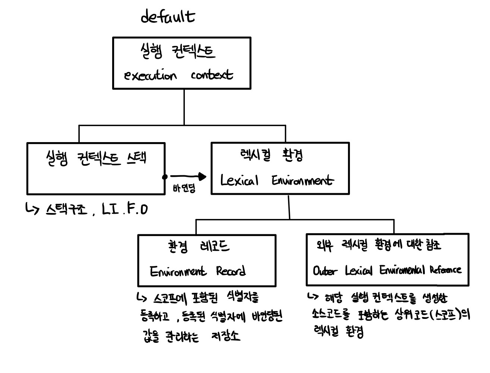

# 모던 자바스크립트 Deep Dive

## 목차

- [24장 클로저](#24장-클로저)
- [25장 클래스](#25장-클래스)
- [26장 ES6 함수의 추가 기능](#26장-ES6-함수의-추가-기능)
- <a href="https://github.com/junh0328/upgrade_javascript/blob/master/DEEPDIVE/readme4.md">다음 섹션으로</a>

## 24장 클로저

<p>클로저(closure)는 난해하기로 유명한 자바스크립트의 개념 중 하나로 자바스크립트에 관심이 있다면 한번쯤 들어보았을 것이다. 클로저는 실행 컨텍스트에 대한 지식이 있으면 이해하기 어려운 개념은 아니다. 클로저는 자바스크립트 고유의 개념이 아니다. <b>함수를 일급 객체로 취급하는 함수형 프로그래밍 언어</b>에서 사용되는 중요한 특성이다.</p>

### 일급 객체란?

<p>다음과 같은 조건을 만족하는 객체를 일급 객체라 한다.</p>

```
1. 무명의 리터럴로 생성할 수 있다. 즉, 런타임에 생성이 가능하다
2. 변수나 자료구조(객체, 배열 등)에 저장할 수 있다.
3. 함수의 매개변수에 전달할 수 있다.
4. 함수의 반환 값으로 사용할 수 있다.
```

<a href="https://github.com/junh0328/upgrade_javascript/blob/master/DEEPDIVE/readme2.md#18%EC%9E%A5-%ED%95%A8%EC%88%98%EC%99%80-%EC%9D%BC%EA%B8%89-%EA%B0%9D%EC%B2%B4">일급 객체 다시 공부하기</a>

<p>
함수가 일급 객체라는 것은 함수를 객체와 동일하게 사용할 수 있다는 의미이다. 객체는 값이므로 함수는 값과 동일하게 취급할 수 있다. 따라서 함수는 값을 사용할 수 있는 곳(변수 할당문, 객체의 프로퍼티 값, 배열의 요소, 함수 호출의 인수, 함수 반환문)이라면 어디서든지 리터럴로 정의할 수 있으며 런타임에 함수 객체로 평가된다.

일급 객체로서 함수가 가지는 가장 큰 특징은 일반 객체와 같이 함수의 매개변수에 전달할 수 있으며, 함수의 반환값으로 사용할 수도 있다는 것이다. 이는 함수형 프로그래밍을 가능케 하는 자바스크립트의 장점 중 하나이다.

함수는 객체이지만 일반 객체와는 차이가 있다. 일반 객체는 호출할 수 없지만 함수 객체는 호출할 수 있다. 그리고 함수 객체는 일반 객체에는 없는 함수 고유의 프로퍼티를 소유한다.

</p>

<p>클로저는 자바스크립트 고유의 개념이 아니므로 클로저의 정의가 ECMAScript 사양에 등장하지 않는다. MDN에서는 클로저에 대해 다음과 같이 정의하고 있다.</p>

```
클로저는 함수와 그 함수가 선언된 렉시컬 환경과의 조합이다.
```

<p>정의에서 이해해야 할 핵심 키워드는 '함수가 선언된 렉시컬 환경'이다.</p>

```js
const x = 1;

function outerFunc() {
  const x = 10;

  function innerFunc() {
    console.log(x);
    // 10
    // why? 선언된 자신의 블록 스코프 { } 내부 부터 상위 스코프로 식별자 검색을 하므로, 외부 함수의 지역 변수인 const x = 10;의 변수 x를 참조할 수 있다.
  }

  innerFunc();
}

outerFunc();
```

<p>outerFunc 함수 내부에서 중첩 함수 innerFunc가 ①정의되고 ②호출되었다. 이때 중첩 함수인 innerFunc의 상위 스코프는 외부 함수 outerFunc의 스코프다. 따라서 중첩 함수 innerFunc 내부에서 자신을 포함하고 있는 외부 함수 outerFunc의 x 변수에 접근할 수 있다.</p>

<p>만약 innerFunc 함수가 outerFunc 함수의 내부에서 정의된 중첩 함수가 아니라면 innerFunc 함수를 outerFunc 함수 내부에서 호출한다 하더라도 outerFunc 함수의 변수에 접근할 수 없다.</p>

```js
const x = 1;

function outerFunc() {
  const x = 10;
  innerFunc();
}

function innerFunc() {
  console.log(x);
  // 1
  // 전역(global)에 정의된 변수 x , 함수 outerFunc, innerFunc 는 모두 같은 스코프에 존재한다.
  // 따라서 innerFunc 함수 내부에서 x를 찾는다면 상위 스코프인 글로벌(전역) 환경의 const x = 1;의 전역 변수 x를 참조한다.
}

outerFunc();
```

### 24.1 렉시컬 스코프

<p>이미 렉시컬 스코프에 대해서는 살펴보았다. 렉시컬 스코프를 실행 컨텍스트의 관점에서 다시 한번 살펴보자.</p>

```
자바스크립트 엔진은 함수를 어디서 호출했는지가 아니라 함수를 어디에 정의했는지에 따라 상위 스코프를 결정한다.
이를 렉시컬 스코프(정적 스코프)라 한다.
```

```js
const x = 1;

function foo() {
  const x = 10;
  bar();
}

function bar() {
  console.log(x);
}

foo(); // ?
bar(); // ?
```

<details>
<summary>정답 보기</summary>

```
1
1
```

<p>앞서 <b>실행 컨텍스트</b>에서 살펴보았듯이 스코프의 실체는 실행 컨텍스트의 <b>렉시컬 환경 (식별자와 스코프를 관리하는 자료구조)</b>이다. 이 렉시컬 환경은 자신의 '외부 렉시컬 환경에 대한 참조(Outer Lexical Environment Reference)'를 통해 <b>상위 렉시컬 환경</b>과 연결된다. 이것이 바로 <b>스코프 체인</b>이다.</p>

</details>

<br/>



<p>따라서 '함수의 상위 스코프를 결정한다'는 것은 '렉시컬 환경의 외부 렉시컬 환경에 대한 참조(상위 스코프)에 저장할 참조값을 결정한다는 것'과 같다.</p>

```
함수가 어디서 호출됐는지가 아닌 어디서 정의되었는지를 따지는 것이 렉시컬 스코프(정적 스코프)이다.
```

### 24.2 함수 객체의 내부 슬롯 `[[Environment]]`

<p>함수가 정의된 환경(위치)과 호출되는 환경(위치)는 다를 수 있다. 따라서 <b>렉시컬 스코프가 가능하려면 함수는 자신이 호출되는 환경과는 상관없이 자신이 정의된 환경, 즉 상위 스코프를 기억해야 한다.</b> 이를 위해 <b>함수는 자신의 내부 슬롯 [[Environment]]에 자신이 정의된 환경, 즉 상위 스코프의 참조를 저장한다.</b></p>

```
변수 > 참조
함수 > 호출
```

<p>다시 말해, 함수 정의<b>(function foo(){...})</b>가 평가되어 실행 컨텍스트에 함수 객체를 생성할 때 자신이 정의된 환경에 의해 결정된 상위 스코프를 참조를 함수 객체 자신의 내부 슬롯 [[Environment]]에 저장한다. 이때 자신의 내부 슬롯 [[Environment]]에 저장된 상위 스코프의 참조는 현재 실행 중인 실행 컨텍스트(running execution context)의 렉시컬 환경(스코프)을 가리킨다.</p>

<p>왜냐하면 ② <b>(함수 정의가 평가되어 함수 객체를 생성하는 시점)</b>은 함수가 정의된 환경, 즉 ① <b>(상위 함수가 평가 또는 실행되고 있는 시점)</b>이며, 이때 현재 실행 중인 실행 컨텍스트는 상위 함수의 실행 컨텍스트이기 때문이다.</p>

<p>렉시컬 스코프에서 살펴보았던 예제를 다시 한번 살펴보자.</p>

```js
const x = 1;

function foo() {
  const x = 10;

  // 상위 스코프는 함수 정의 환경(위치)에 따라 결정된다.
  // 함수 호출 위치와 상위 스코프는 아무런 관계가 없다.
  bar();
}

// 함수 bar는 자신의 상위 스코프, 즉 전역 렉시컬 환경을 [[Environment]]에 저장하여 기억한다.
function bar() {
  console.log(x);
}

foo(); // 1
bar(); // 1
```

<p>위 예제의 foo 함수 내부에서 bar 함수가 호출되어 실행 중인 시점의 실행 컨텍스트는 다음과 같다.</p>


<p>foo 함수와 bar 함수는 모두 전역에서 함수 선언문으로 정의되었다. 따라서 foo 함수와 bar 함수는 모두 전역 코드가 평가되는 시점에 평가되어 함수 객체를 생성하고 전역 객체 (window)의 메서드가 된다. 이때 생성된 함수 객체의 내부 슬롯 [[Environment]]에는 함수 정의가 <b>평가</b>된 시점, 즉 전역 코드 평가 시점에 실행 중인 실행 컨텍스트의 렉시컬 환경인 <b>전역 렉시컬 환경의 참조가 저장된다.</b> 함수가 호출되면 함수 내부로 코드의 제어권이 이동한다. 그리고 함수 코드를 평가하기 시작한다.</p>

<p>이때 함수 렉시컬 환경의 구성 요소인 외부 렉시컬 환경에 대한 참조(Outer Lexical Environment Reference)에는 함수 객체의 내부 슬롯 [[Environment]]에 저장된 렉시컬 환경의 참조가 할당된다. 이것이 바로 함수 정의 위치에 따라 상위 스코프를 결정하는 렉시컬 스코프(정적 스코프)의 실체다.</p>

### 24.3 클로저와 렉시컬 환경

<p>다음 예제를 살펴보자</p>

```js
const x = 1;

// ①
function outer() {
  const x = 10;
  const inner = function () {
    console.log(x);
  }; // ②
  return inner;
}

// outer 함수를 호출하면 중첩 함수 inner를 반환한다.
// 그리고 outer 함수의 실행 컨텍스트는 실행 컨텍스트 스택에서 팝되어 제거된다.
const innerFunc = outer(); // ③
innerFunc(); // ④ 10
```

<p>outer 함수를 호출(③)하면 outer 함수는 중첩 함수 inner를 반환(return)하고 생명 주기(life cycle)를 마감한다. 즉, outer 함수의 실행이 종료되면 이 함수의 실행 컨텍스트는 실행 컨텍스트 스택에서 제거(pop)된다. 따라서 outer 함수의 지역 변수 x는 더는 유효하지 않게 되어 x 변수에 접근할 수 있는 방법이 달리 없어 보인다.</p>

<p>그러나 위 코드의 실행 결과(④)는 outer 함수의 지역 변수 x의 값인 10이다. 이미 생명 주기가 종료되어 <b>실행 컨텍스트 스택</b>에서 제거된 outer 함수의 지역 변수 x가 다시 부활이라도 한 듯 동작하고 있다.</p>

```
실행 컨텍스트의 실행이 종료되어 스택에서 제거되더라도, 참조가 남아있다면 렉시컬 환경은 소멸하지 않는다.

이처럼 외부 함수(outer)보다 중첩 함수가 더 오래 유지되는 경우 중첩 함수(inner)는 이미 생명 주기가 종료한 외부 함수의 변수(x)를 참조할 수 있다.
이러한 중첩 함수를 클로저(closure)라고 부른다.
```

<p>자바스크립트의 모든 함수는 자신의 상위 스코프를 기억한다고 했다. 모든 함수가 기억하는 상위 스코프는 함수를 어디서 호출하든 상관없이 유지된다. 따라서 함수를 어디서 호출하든 상관없이 함수는 언제나 자신이 기억하는 상위 스코프의 식별자를 참조할 수 있으며 식별자에 바인딩된 값을 변경할 수도 있다. 위 예제에서 inner 함수는 자신이 평가될 때 자신이 정의된 위치에 의해 결정된 상위 스코프를 [[Environment]] 내부 슬롯에 저장한다.</p>

<p>outer 함수가 평가되어 함수 객체를 생성할 때(①) 현재 실행 중인 실행 컨텍스트(running execution context)의 렉시컬 환경, 즉 전역 렉시컬 환경을 outer 함수 객체의 [[Environment]] 내부 슬롯에 상위 스코프로서 저장한다.</p>


<p>1. outer 함수를 호출하면 2. outer 함수의 렉시컬 환경이 생성되고 3. 앞서 outer 함수 객체의 [[Environment]] 내부 슬롯에 저장된 전역 렉시컬 환경을 outer 함수 렉시컬 환경의 '외부 렉시컬 환경에 대한 참조'에 할당한다. 그리고 중첩 함수 inner가 평가된다. 이때 중첩 함수 inner는 자신의 [[Environment]] 내부 슬롯에 현재 실행 중인 실행 컨텍스트(외부 함수 outer)의 렉시컬 환경을 상위 스코프로서 저장한다. (함수 표현식이기 때문에 런타임이 평가되었다)</p>


<p>outer 함수의 실행이 종료하면 inner 함수를 반환(return)하면서 outer 함수의 생명 주기가 종료된다.(③) 즉, outer 함수의 실행 컨텍스트가 실행 컨텍스트 <b>스택</b>에서 제거된다. 이때 <b>outer 함수의 실행 컨텍스트는 실행 컨텍스트 스택에서 제거되지만 outer 함수의 렉시컬 환경까지 소멸하는 것은 아니다.(변수에 innerFunc에 의해 참조되고 있으므로)</b> 가비지 컬렉터는 누군가 참조하고 있는 메모리 공간을 함부로 해제하지 않는다.</p>


<p>outer 함수가 반환한(return inner;) inner 함수를 호출(④)하면 inner 함수의 실행 컨텍스트가 생성되고 실행 컨텍스트 스택에 푸시된다. 그리고 렉시컬 환경의 외부 렉시컬 환경에 대한 참조에는 inner 함수 객체의 [[Environmnet]] 내부 슬롯에 저장되어 있는 참조값이 할당된다.</p>


<p>이처럼 중첩 함수 inner의 내부에서는 상위 스코프를 참조할 수 있으므로 상위 스코프의 식별자를 참조할 수 있고 식별자의 값을 변경할 수도 있다. 자바스크립트의 모든 함수는 상위 스코프를 기억하므로 이론적으로 모든 함수는 클로저다. 하지만 일반적으로 모든 함수를 클로저라고 하지는 않는다.</p>

### case 1 상위 스코프의 식별자를 참조하지 않는 경우

<details>
<summary>코드 및 소스 보기</summary>

```html
<!DOCTYPE html>
<html>
  <body>
    <script>
      function foo() {
        const x = 1;
        const y = 2;

        // 일반적으로 클로저라고 하지 않는다.
        function bar() {
          const z = 3;

          debugger;
          // 상위 스코프의 식별자를 참조하지 않는다.
          console.log(z);
        }

        return bar;
      }

      const bar = foo();
      bar();
    </script>
  </body>
</html>
```

<br/>


<p>위 예제의 중첩 함수 bar는 외부 함수 foo 보다 더 오래 유지되지만 상위 스코프의 어떤 식별자(x,y)도 참조하지 않는다. 이처럼 상위 스코프의 어떤 식별자도 참조하지 않는 경우 대부분의 모던 브라우저는 최적화를 통해 다음 그림과 같이 상위 스코프를 기억하지 않는다. 참조하지도 않는 식별자를 기억하는 것은 메모리 낭비이기 때문이다. 따라서 bar 함수는 클로저라고 할 수 없다.</p>

```
참조하는 식별자를 실행 컨텍스트가 종료되어도 렉시컬 환경을 통해 참조하고, 값을 변경할 수 있는 것이 클로저이다.
```

</details>

### case 2 상위 스코프의 식별자를 참조하지만, 중첩 함수가 반환되지 않은 경우

<details>
<summary>코드 및 소스 보기</summary>

```html
<!DOCTYPE html>
<html>
  <body>
    <script>
      function foo() {
        const x = 1;

        // 일반적으로 클로저라고 하지 않는다.
        // bar 함수는 클로저였지만 곧바로 소멸한다.
        function bar() {
          debugger;
          // 상위 스코프의 식별자를 참조한다.
          console.log(x);
        }
        bar();
      }

      foo();
    </script>
  </body>
</html>
```

<br/>


<p>위 예제의 중첩 함수 bar는 상위 스코프의 식별자(x)를 참조하고 있으므로 클로저다. 하지만 외부 함수 foo의 외부로 중첩 함수가 반환되지 않는다. 즉, <b>외부 함수 foo보다 중첩  함수 bar의 생명 주기가 짧다.</b> 이런 경우 중첩 함수 bar는 클로저였지만 외부 함수보다 일찍 소멸되기 때문에 생명 주기가 종료된 외부 함수의 식별자를 참조할 수 있다든 클로저의 본질에 부합하지 않는다. 따라서 중첩 함수 bar는 일반적으로 클로저라고 하지 않는다.</p>

</details>

### case 3 상위 스코프의 식별자를 참조하고, 중첩 함수가 반환되는 경우 (올바른 클로저)

```html
<!DOCTYPE html>
<html>
  <body>
    <script>
      function foo() {
        const x = 1;
        const y = 2;

        // 클로저
        // 중첩 함수 bar는 외부 함수보다 더 오래 유지되며 상위 스코프의 식별자를 참조한다.
        function bar() {
          debugger;
          console.log(x);
        }
        return bar;
      }

      const bar = foo();
      bar();
    </script>
  </body>
</html>
```

<br/>


<p>위 예제의 중첩 함수 bar는 상위 스코프의 식별자를 참고하고 있으므로 클로저다. 그리고 외부 함수의 외부로 반환되어 외부 함수보다 더 오래 살아 남는다. 이처럼 외부 함수보다 중첩 함수가 더 오래 유지되는 경우 중첩 함수는 이미 생명 주기가 종료한 외부 함수의 변수를 참조할 수 있다. 이러한 중첩 함수를 클로저라고 부른다. <b>클로저는 중첩 함수가 상위 스코프의 식별자를 참조하고 있고 중첩 함수가 외부 함수보다 더 오래 유지되는 경우에 한정하는 것이 일반적이다.</b></p>

<p>다만 클로저인 중첩 함수 bar는 상위 스코프의 식별자 x, y중 x만 참조하고 있다. 이런 경우 대부분의 모던 브라우저는 최적화를 통해 상위 스코프의 식별자 중에서 클로저가 참조하고 있는 식별자만 기억한다.</p>

<p>클로저에 의해 참조되는 상위 스코프의 변수(foo 함수의 변수 x)를 <b>자유 변수(free variable)</b>라고 부른다. 클로저란 <b>자유 변수에 묶여있는 함수</b>라고 말할 수 있다.</p>

### 24.4 클로저의 활용

<p><b>클로저는 상태를 안전하게 변경하고 유지하기 위해 사용한다.</b> 다시 말해, 상태가 의도치 않게 변경되지 않도록 <b>상태를 안전하게 은닉(information hiding)하고 특정 함수에게만 상태변경을 허용</b>하기 위해 사용한다.</p>

<p>함수가 호출될 때마다 호출된 횟수를 누적하여 출력하는 카운터를 만들어보자.</p>

```js
// 카운트 상태 변수
let num = 0;

// 카운트 상태 변경 함수
const increase = function () {
  // 카운트 상태를 1만큼 증가 시킨다.
  return ++num;
};

console.log(increase()); // 1
console.log(increase()); // 2
console.log(increase()); // 3
```

<p>위 코드는 잘 동작하지만 오류를 발생시킬 가능성을 내포하고 있는 좋지 않은 코드다. 그 이유는 위 예제가 바르게 동작하려면 다음의 전제 조건이 지켜져야 하기 때문이다.</p>

```
1.카운트 상태(num 변수의 값)는 increase 함수가 호출되기 전까지 변경되지 않고 유지되어야 한다.
2.이를 위해 카운트 상태(num 변수의 값)는 increase 함수만이 변경할 수 있어야 한다.
```

<p>하지만 카운트 상태는 전역 변수를 통해 관리되고 있기 때문에 언제든지 누구나 접근할 수 있고 변경할 수 있다.(암묵적 결합이 가능하다)</p>

```js
// 카운트 상태 변수
let num = 0;

// 카운트 상태 변경 함수
const increase = function () {
  // 카운트 상태를 1만큼 증가 시킨다.
  return ++num;
};

const logNum = function () {
  console.log(num);
};

num++; // 해당 num++ 연산자를 통해 전역에 선언된 num의 값을 변경하였다.

increase(); // 1
increase(); // 2
increase(); // 3

logNum(); //4
```

<p>따라서 카운트 상태를 안전하게 변경하고 유지하기 위해서는 increase 함수만이 num 변수를 참조하고 변경할 수 있게 하는 것이 바람직하다.</p>

```js
// 카운트 상태 변경 함수
const increase = function () {
  // 카운트 상태 변수
  let num = 0;

  // 카운트 상태를 1만큼 증가 시킨다.
  return ++num;
};

// 이전 상태를 유지하지 못한다.
console.log(increase()); // 1
console.log(increase()); // 1
console.log(increase()); // 1
```

<p>카운트 상태를 안전하게 변경하고 유지하기 위해 전역 변수 num을 increase 함수 지역 변수로 변경하여 의도치 않은 상태 변경은 방지했다. 하지만, 호출될 때마다 지역 변수 num은 다시 선언되고 0으로 초기화되기 때문에 출력 결과는 언제나 1이다. 이전 상태를 유지할 수 있도록 클로저를 사용해보자.</p>

```js
case 1 즉시 실행 함수로 처리

const counter = (function () {
  // 카운트 상태 변수
  let num = 0;

  // 클로저인 메서드를 갖는 객체를 반환한다.
  // 객체 리터럴은 스코프를 만들지 않는다.
  // 따라서 아래 메서드들의 상위 스코프는 즉시 실행 함수의 렉시컬 환경이다.
  return {
    // num: 0, // 프로퍼티는 public하므로 은닉되지 않는다.
    increase() {
      return ++num;
    },
    decrease() {
      return num > 0 ? --num : 0;
    },
    // num을 반환한 함수 count를 추가
    counterNum() {
      return num;
    },
  };
})();

console.log(counter.increase()); // 1
console.log(counter.increase()); // 2

console.log(counter.decrease()); // 1
console.log(counter.decrease()); // 0

console.log(counter.increase()); // 1
console.log(counter.increase()); // 2
console.log(counter.counterNum()); // 2

console.log(num);
// num is not defined,
// why? increase 함수의 스코프 내에 선언했기 때문에 전역 코드에서는 increase 함수의 지역 변수 num을 찾지 못한다.
// 외부에서는 접근하지 못하는 안전한 은닉 (information hiding)이 가능해진다
```

```js
case 2 일반 함수로 처리

const counter = function () {
  // 카운트 상태 변수
  let num = 0;

  // 클로저인 메서드를 갖는 객체를 반환한다.
  // 객체 리터럴은 스코프를 만들지 않는다.
  // 따라서 아래 메서드들의 상위 스코프는 즉시 실행 함수의 렉시컬 환경이다.
  return {
    // num: 0, // 프로퍼티는 public하므로 은닉되지 않는다.
    increase() {
      return ++num;
    },
    decrease() {
      return num > 0 ? --num : 0;
    },
    counterNum() {
      return num;
    },
  };
};

const newNum = counter();

console.log(typeof newNum); // object
console.log(newNum.countructor); // undefined , 생성자 함수가 아니다.

console.log(newNum.counterNum()); // 0
console.log(newNum.increase());
console.log(newNum.counterNum()); // 1

```

<p>이처럼 클로저는 상태(state)가 의도치 않게 변경되지 않도록 안전하게 은닉(information hiding)하고 특정 함수에게만 상태 변경을 허용하여 상태를 안전하게 변경하고 유지하기 위해 사용한다. 변수 값은 누군가에 의해 언제든지 변경될 수 있어 오류 발생의 근본적 원인이 될 수 있다. <b>외부 상태 변경이 가변 데이터를 피하고 불변성을 지향하는 함수형 프로그래밍에서 부수 효과를 최대한 억제하여 오류를 피하고 프로그램의 안정성을 높이기 위해 클로저는 적극적으로 사용된다.</b></p>

<details>
<summary>함수형 프로그래밍에서 클로저를 활용하는 예제 보기</summary>

```js
/*
let num = 0;

function plusNum() {
  num++;
}

console.log(num);
plusNum();
console.log(num);

// 수억개의 코드

num = 200;

console.log(num); // num 값이 쉽게 변경됨
*/

function closure() {
  let num = 10;

  function plusNum() {
    num += 1;
  }

  function printNum() {
    console.log(num);
  }

  function setNum(val) {
    num = val;
  }

  // 함수를 객체 형식으로 리턴하는 이유는 새로 생성한 변수를 (.) 연산자를 통해 (객체와 같은 방식으로) 접근하기 위해서
  // 함수뿐만 아니라 지역 변수도 리턴이 가능하다 (하지만 추천하지 않음)
  // 지역 변수를 객체 형식으로 담아서 리턴될 경우에, closure의 의도와 다르게 내부에 정의된 함수 외에도 지역 변수의 값을 변경하는 경우가 생기기 때문에
  // (객체는 가변성의 성질을 가지므로)

  return { num, plusNum, printNum, setNum };
}

// console.log("num is:", num); // num is not defined, 상위 스코프에서 하위 스코프로 식별자 검색을 할 수 없음

const newNum = closure(); // closure 함수로 newNum 함수를 생성한다.

console.log(newNum); // 생성된 함수객체 newNum은 closure 함수가 리턴하는 객체 형식의 프로퍼티와 메서드가 들어있음

console.log((newNum.num = 20)); // newNum.num 에 값을 할당 (closure 함수의 메서드를 사용하지 않고 직접 변경)
console.log(newNum); // 객체형식으로 리턴되는 newNum의 특성상 newNum의 프로퍼티인 num의 값이 재할당됨

newNum.printNum(); // 하지만 printNum 메서드를 사용하면 기존의 10 출력

newNum.setNum(100); // 따라서 지역 변수 num을 변경하기 위해서는 새로운 메서드를 정의하여 값을 전달함으로서 부수효과를 줄어야함

newNum.printNum(); // 100 출력

// 하지만 지역 변수를 리턴하더라도 원시 타입의 값은 불변성의 성질을 가지기 때문에, 재할당하지 않는 이상 값을 변화시킬 수 없다.
// 따라서 함수를 통해 반환하여 사용하는 것이 올바르다.

>> console.log(newNum)
{
  num: 10,
  plusNum: [Function: plusNum],
  printNum: [Function: printNum],
  setNum: [Function: setNum]
}

>> console.log((newNum.num = 20));
20

>> console.log(newNum);
{
  num: 20,
  plusNum: [Function: plusNum],
  printNum: [Function: printNum],
  setNum: [Function: setNum]
}

>> newNum.printNum();
10

>> newNum.printNum();
100
```

</details>

### 24.5 캡슐화와 정보 은닉

<p><b>캡슐화(encapsulation)</b>는 객체의 상태를 나타내는 프로퍼티와 프로퍼티를 참조하고 조작할 수 있는 동작인 메서드를 하나로 묶는 것을 말한다. <b>캡슐화</b>는 객체의 특정 프로퍼티나 메서드를 감출 목적으로 사용하기도 하는데 이를 <b>정보 은닉(information hiding)</b>이라 한다.</p>

<p>정보 은닉은 외부에 공개할 필요가 없는 구현의 일부를 외부에 공개되지 않도록 감추어 <b>적절치 못한 접근으로부터 객체의 상태가 변경되는 것을 방지해 정보를 보호하고, 객체 간의 상호 의존성, 즉 결합도를 낮추는 효과가 있다.</b></p>

<p>대부분의 객체지향 프로그래밍 언어는 클래스를 정의하고 그 클래스를 구성하는 멤버(프로퍼티와 메서드)에 대하여 public, private, protected와 같은 접근 제한자(access modifier)를 선언하여 공개 범위를 한정할 수 있다. public으로 선언된 프로퍼티와 메서드는 클래스 외부에서 참조할 수 있지만 private으로 선언된 경우는 클래스 외부에서 참조할 수 없다.</p>

<p>자바스크립트는 public, private, protected와 같은 접근 제한자를 제공하지 않는다. 따라서 자바스크립트 객체의 모든 프로퍼티와 메서드는 기본적으로 외부에 공개되어 있다. 즉, 객체의 모든 프로퍼티와 메서드는 기본적으로 public하다.</p>

<p>하지만 자바스크립트는 정보 은닉을 완전하게 지원하지 않는다.</p>

## 25장 클래스

### 25.1 클래스는 프로토타입의 문법적 설탕인가?

<p>자바스크립트는 프로토타입 기반의 객체지향 언어다. 비록 다른 객체지향 언어와의 차이점에 대한 논쟁이 있긴 하지만 자바스크립트는 강력한 객체지향 프로그래밍 능력을 가지고 있다. 프로토타입 기반 객체지향 언어는 클래스가 필요 없는(class free) 객체지향 프로그래밍 언어다. ES5에서는 클래스 없이도 다음과 같이 생성자 함수와 프로토타입을 통해 객체지향 언어의 상속을 구현할 수 있다.</p>

```js
// ES5 생성자 함수
var Person = (function () {
  // 생성자 함수
  function Person(name) {
    this.name = name;
  }

  // 프로토타입 메서드
  Person.prototype.sayHi = function () {
    console.log("Hi! My name is " + this.name);
  };

  // 생성자 함수 반환
  return Person;
})();

// 인스턴스 생성
var me = new Person("Lee");
me.sayHi(); // Hi! My name is Lee
```

<p>하지만 <b>클래스 기반 언어에 익숙한 프로그래머들은 프로토타입 기반의 프로그래밍 방식에 혼란을 느낄 수 있으며, 자바스크립트를 어렵게 느끼게 하는 하나의 장벽처럼 인식되었다.</b></p>

<p>ES6에서 도입된 <b>클래스</b>는 ①<b>기존 프로토타입 기반 객체지향 프로그래밍</b>보다 ②<b>자바나 C#과 같은 클래스 기반 객체지향 프로그래밍</b>에 익숙한 프로그래머가 더욱 빠르게 학습할 수 있도록 클래스 기반 객체지향 프로그래밍 언어와 매우 흡사한 새로운 객체 생성 메커니즘을 제시한다.</p>

```
자바스크립트에서는 프로토타입 기반의 객체지향 프로그래밍을 기반으로 설계되었지만,
이에 어려움을 느끼는 객체지향 프로그래밍에 익숙한 프로그래머들을 위해 ES6부터 클래스 개념을 도입하였다.
```

<p>그렇다고 ES6의 클래스가 기존의 프로토타입 기반 객체지향 모델을 폐지하고 새롭게 클래스 기반 객체지향 모델을 제공하는 것은 아니다. 사실 <b>클래스</b>는 <b>함수</b>이며 기존 프로토타입 기반 패턴을 클래스 기반 패턴처럼 사용할 수 있도록 하는 문법적 설탕(syntactic sugar)이라고 볼 수 있다. 클래스와 생성자 함수 모두 프로토타입 기반의 인스턴스를 생성하지만 클래스는 생성자 함수보다 엄격하며 생성자 함수에서는 제공하지 않는 기능도 제공한다.</p>

```
1. 클래스를 new 연산자 없이 호출하면 에러가 발생한다. 하지만, 생성자 함수는 일반 함수로 호출된다.

2. 클래스는 상속을 지원하는 extends와 super 키워드를 제공한다. 생성자 함수는 해당 키워드를 제공하지 않는다.

3. 클래스는 호이스팅이 발생하지 않는 것처럼 동작한다. 하지만 함수 선언문으로 작성된 클래스는 함수 호이스팅이,
   함수 표현식으로 정의한 생성자 함수는 변수 호이스팅이 발생한다.

4. 클래스 내의 모든 코드에는 암묵적으로 strict mode가 저장되어 실행되며 strict mode를 해제할 수 없다.
   <-> 생성자 함수는 암묵적으로 strict mode가 지정되지 않는다.

5. 클래스의 constructor, 프로토타입 메서드, 정적 메서드는 모두 프로퍼티 어트리뷰트 [[Enumerable]] 값이 false인
   열거가 되지 않는 값이다.
```

<p>따라서 클래스를 프로토타입 기반 객체 생성 패턴의 단순한 문법적 설탕이라고 보기보다는 새로운 객체 생성 메커니즘으로 보는 것이 좀 더 합당하다.</p>

```
본인은 js 기반으로 공부를 시작하여, 함수형 프로그래밍과 프로토타입 기반의 객체지향 프로그래밍에 익숙하다...
```

### 25.2 클래스의 정의

<p>클래스는 class 키워드를 사용한다. 클래스 이름은 생성자 함수와 마찬가지로 <b>파스칼 케이스</b>를 사용하는 것이 일반적이다. 파스칼 케이스를 사용하지 않아도 에러가 발생하지는 않는다. </p>

```js
// 클래스 선언문
class Person {}

// 함수 선언문으로 작성시, 함수 호이스팅이
// 함수 표현식으로 작성시, 변수 호이스팅이 발생한다.
```

<p>일반적이지는 않지만 함수와 마찬가지로 표현식으로 클래스를 정의할 수도 있다. 이때 클래스는 함수와 마찬가지로 이름을 가질 수도 있고, 갖지 않을 수도 있다.</p>

```js
// 익명 클래스 표현식
const Person = class {};

// 기명 클래스 표현식
const Person = class MyClass {};
```

<p><b>클래스를 표현식으로 정의할 수 있다는 것</b>은 클래스가 값으로 사용할 수 있는 <b>일급 객체</b>라는 것을 의미한다. 즉, <b>클래스는 일급 객체로서 다음과 같은 특징을 갖는다.</b></p>

```
1. 무명의 리터럴로 생성할 수 있다. 즉, 런타임에 생성이 가능하다
2. 변수나 자료구조(객체, 배열 등)에 저장할 수 있다.
3. 함수의 매개변수에 전달할 수 있다.
4. 함수의 반환 값으로 사용할 수 있다.
```

<p>클래스 몸체(=블록 내부)에는 0개 이상의 메서드만 정의할 수 있다. 클래스 몸체에서 정의할 수 있는 메서드는 ① constructor(생성자) ② 프로토타입 메서드 ③ 정적 메서드의 세가지가 있다.</p>

```js
// 클래스 선언문
class Person {
  // 생성자
  constructor(name) {
    // 인스턴스 생성 및 초기화
    this.name = name; // name 프로퍼티는 public하다.
  }

  // 프로토타입 메서드
  sayHi() {
    console.log(`Hi! My name is ${this.name}`);
  }

  // 정적 메서드
  static sayHello() {
    console.log("Hello!");
  }
}

// 인스턴스 생성
const me = new Person("Lee");

// ① 인스턴스의 프로퍼티 참조
console.log(me.name); // Lee
// ② 프로토타입 메서드 호출
me.sayHi(); // Hi! My name is Lee
// ③ 정적 메서드 호출 (호출 시에 인스턴스가 아닌 클래스의 메서드로 동작한다.)
Person.sayHello(); // Hello!
```

### 25.3 클래스 호이스팅

<p>클래스는 함수로 평가된다. (함수 호이스팅이 이루어진다)</p>

```js
// 클래스 선언문
class Person {}

console.log(typeof Person); // function
```

<p>클래스 선언문으로 정의한 클래스는 함수 선언문과 동일하게 소스코드의 평가 과정 즉, 런타임 이전에 먼저 평가되어 함수 객체를 생성한다. 이때 클래스가 평가되어 생성된 함수 객체는 생성자 함수로서 호출할 수 있는 함수, 즉 constructor다. <b>생성자 함수로서 호출할 수 있는 함수는 함수 정의가 평가되어 함수 객체를 생성하는 시점에 프로토타입도 더불어 생성된다. 프로토타입과 생성자 함수는 단독으로 존재할 수 없고 언제나 쌍으로 존재하기 때문이다.</b></p>

```
실행 컨텍스트의 런타임 이전에 평가되어 생성자 함수의 함수 호이스팅에 의해 프로토타입 또한 생성됨
```

<p>단, 클래스는 클래스 정의 이전에 참조할 수 없다. (let, const 키워드와 같은 TDZ가 존재한다)</p>

```js
console.log(Person);
// ReferenceError: Cannot access 'Person' before initialization

// 클래스 선언문
class Person {}
```

<p>클래스 선언문은 마치 호이스팅이 발생하지 않는 것처럼 보이나 그렇지 않다.</p>

```js
const Person = "";

{
  // 호이스팅이 발생하지 않는다면 ''이 출력되어야 한다.
  console.log(Person);
  // ReferenceError: Cannot access 'Person' before initialization

  // 클래스 선언문
  class Person {}
}

/*
why? 
블록 레벨 스코프의 특징 때문에 Person을 처음 찾을 때 같은 스코프부터 찾게 된다.
밑에 클래스 선언문으로 Person이 정의되었기 때문에 식별자 검색이 상위 스코프로 넘어가지 않고
해당 스코프의 함수 호이스팅을 통해 ReferenceError를 발생시켰다.
*/
```

<p>var, let, const, function, function*, class 키워드를 사용하여 선언된 모든 식별자는 호이스팅된다. 모든 선언문은 런타임 이전에 먼저 실행되기 때문이다</p>

### 25.4 인스턴스 생성

<p>클래스는 생성자 함수이며 new 연산자와 함께 호출되어 인스턴스를 생성한다.</p>

```js
class Person {
  // 생성자
  constructor(name) {
    // Person {} 빈 객체가 암묵적으로 생성됨
    console.log(this);
    // 인스턴스 생성 및 초기화
    this.name = name;
  }

  const me = new Person('준희');
```

<p>생성자 함수는 new 연산자의 사용 여부에 따라 일반 함수로 호출되거나 인스턴스 생성을 위한 생성자 함수로 호출되지만 클래스는 인스턴스를 생성하는 것이 유일한 존재이므로 반드시 new 연산자와 함께 호출해야 한다.</p>

### 25.5 메서드

<p>클래스 몸체에는 0개 이상의 <b>메서드만 선언할 수 있다.</b> 클래스 몸체에서 정의할 수 있는 메서드는 ① constructor(생성자) ② 프로토타입 메서드 ③ 정적 메서드의 세 가지가 있다.</p>

### ① constructor

<p>constructor는 인스턴스를 생성하고 초기화하기 위한 특수한 메서드다. constructor는 이름을 변경할 수 없다.</p>

```js
class Person {
  // 생성자
  constructor(name) {
    // 인스턴스 생성 및 초기화
    this.name = name;
  }
}
```

<p>앞에서 살펴보았듯이 클래스는 인스턴스를 생성하기 위한 생성자 함수다. 클래스는 평가되어 함수 객체가 된다. '18.2 함수 객체의 프로퍼티'에서 살펴보았듯이 클래스도 함수 객체 고유의 프로퍼티를 모두 갖고 있다. 함수와 동일하게 프로토타입과 연결되어 있으며 자신의 스코프 체인을 구성한다. </p>

```js
// 클래스는 함수다.
console.log(typeof Person); // function
console.dir(Person);
```


<p>모든 함수 객체가 가지고 있는 prototype(.prototype) 프로퍼티가 가리키는 프로토타입 객체의 constructor 프로퍼티는 클래스 자신을 가리키고 있다. 이는 클래스가 인스턴스를 생성하는 생성자 함수라는 것을 의미한다. 즉, new 연산자와 함께 클래스를 호출하면 클래스는 인스턴스를 생성한다.</p>

<p>이번에는 클래스가 생성한 인스턴스의 내부를 들여다보기 위해 다음 코드를 크롬 브라우저의 개발자 도구에서 실행해보자.</p>

```js
class Person {
  // 생성자
  constructor(name) {
    // 인스턴스 생성 및 초기화
    this.name = name;
  }
}

const me = new Person("Lee");
console.log(me);
```


<p>Person 클래스의 constructor 내부에서 this에 추가한 name 프로퍼티가 클래스가 생성한 인스턴스(me)의 프로퍼티(me.name)로 추가된 것을 확인할 수 있다. 즉, 생성자 함수와 마찬가지로 constructor 내부에서 this에 추가한 프로퍼티는 인스턴스 프로퍼티가 된다. constructor 내부의 this는 생성자 함수와 마찬가지로 클래스가 생성한 인스턴스를 가리킨다.</p>

<p>constructor는 생성자 함수와 유사하지만 몇 가지 차이가 있다.</p>

> constructor는 한 클래스 내에 최대 한 개만 존재할 수 있다. 만약 클래스가 2개 이상의 constructor를 포함하면 문법 에러가 발생한다.

```js
class Person {
  constructor() {}
  constructor() {}
}
// SyntaxError: A class may only have one constructor
```

> constructor는 생략할 수 있다.

```js
class Person {}
```

> constructor를 생략하면 클래스에 다음과 같인 빈 constructor가 암묵적으로 정의된다.

```js
class Person {
  // constructor를 생략하면 다음과 같이 빈 constructor가 암묵적으로 정의된다.
  constructor() {}
}

// 빈 객체가 생성된다.
const me = new Person();
console.log(me); // Person {}
```

> 프로퍼티가 추가되어 초기화된 인스턴스를 생성하려면 constructor 내부에서 this에 인스턴스 프로퍼티를 추가한다.

```js
class Person {
  constructor() {
    // 고정값으로 인스턴스 초기화
    this.name = "Lee";
    this.address = "Seoul";
  }
}

// 인스턴스 프로퍼티가 추가된다.
const me = new Person();
console.log(me); // Person {name: "Lee", address: "Seoul"}
```

> 인스턴스를 생성할 떄 클래스 외부에서 인스턴스 프로퍼티의 초기값을 전달하면, 초기값은 constructor의 매개변수에게 전달된다.

```js
class Person {
  constructor(name, address) {
    // 인수로 인스턴스 초기화
    this.name = name;
    this.address = address;
  }
}

// 인수로 초기값을 전달한다. 초기값은 constructor에 전달된다.
const me = new Person("Lee", "Seoul");
console.log(me); // Person {name: "Lee", address: "Seoul"}
```

<p>이처럼 constructor 내에서는 인스턴스의 생성과 동시에 인스턴스 프로퍼티 추가를 통해 인스턴스의 초기화를 실행한다. 따라서 인스턴스를 초기화라면 constructor를 생략해서는 안 된다.또한, constructor는 별도의 반환문(return)을 갖지 않아야 한다. new 연산자와 함께 클래스가 호출되면 생성자 함수와 동일하게 암묵적으로 this, 즉 인스턴스를 반환하기 때문이다.</p>

<p>만약 this가 아닌 다른 객체를 명시적으로 반환하면 this, 즉 인스턴스가 반환되지 못하고 return 문에 명시한 객체가 반환된다.</p>

```js
class Person {
  constructor(name) {
    this.name = name;

    // 명시적으로 객체를 반환하면 암묵적인 this 반환이 무시된다.
    return {};
  }
}

// constructor에서 명시적으로 반환한 빈 객체가 반환된다.
const me = new Person("Lee");
console.log(me); // {}
```

<p>하지만 명시적으로 원시값을 반환하면 원시값 반환은 무시되고 암묵적으로 this가 반환된다.</p>

```js
class Person {
  constructor(name) {
    this.name = name;

    // 명시적으로 원시값을 반환하면 원시값 반환은 무시되고 암묵적으로 this가 반환된다.
    return 100;
  }
}

const me = new Person("Lee");
console.log(me); // Person { name: "Lee" }
```

<p>따라서 constructor 내부에서는 return 문을 반드시 생략해야 한다.</p>

### ② 프로토타입 메서드

<p>생성자 함수를 사용하여 인스턴스를 생성하는 경우 프로토타입 메서드를 생성하기 위해서 다음과 같이 명시적으로 프로토타입에 메서드를 추가해야 한다.</p>

```js
// 생성자 함수
function Person(name) {
  this.name = name;
}

// 프로토타입 메서드 (생성자 함수에서 프로토타입 메서드를 명시적으로 추가해주는 경우)
Person.prototype.sayHi = function () {
  console.log(`Hi! My name is ${this.name}`);
};

const me = new Person("Lee");
me.sayHi(); // Hi! My name is Lee
```

<p>①<b>클래스 몸체에서 정의한 메서드</b>는 ②<b>생성자 함수에 의한 객체 생성 방식</b>과는 다르게 클래스의 prototype 프로퍼티에 메서드를 추가하지 않아도 기본적으로 프로토타입 메서드가 된다.</p>

```js
class Person {
  // 생성자
  constructor(name) {
    // 인스턴스 생성 및 초기화
    this.name = name;
  }

  // 프로토타입 메서드
  sayHi() {
    console.log(`Hi! My name is ${this.name}`);
  }
}

const me = new Person("Lee");
me.sayHi(); // Hi! My name is Lee
```

<p>생성자 함수와 마찬가지로 클래스가 생성한 인스턴스는 프로토타입 체인의 일원이 된다.</p>

```js
// me 객체의 프로토타입은 Person.prototype이다.
Object.getPrototypeOf(me) === Person.prototype; // -> true
me instanceof Person; // -> true

// Person.prototype의 프로토타입은 Object.prototype이다.
Object.getPrototypeOf(Person.prototype) === Object.prototype; // -> true
me instanceof Object; // -> true

// me 객체의 constructor는 Person 클래스다.
me.constructor === Person; // -> true
```

<p>이처럼 클래스 몸체에서 정의한 메서드는 인스턴스의 프로토타입에 존재하는 프로토타입 메서드가 된다. 인스턴스는 프로토타입 메서드를 상속받아 사용할 수 있다. 프로토타입 체인은 기존의 모든 객체 생성 방식(객체 리터럴, 생성자 함수, Object.create 메서드 등)뿐만 아니라 클래스에 의해 생성된 인스턴스에도 동일하게 적용된다. 생성자 함수의 역할을 클래스가 할 뿐이다.</p>

<p>결국 클래스는 생성자 함수와 같이 인스턴스를 생성하는 생성자 함수라고 볼 수 있다. 다시 말해, 클래스는 생성자 함수와 마찬가지로 프로토타입 기반의 객체 생성 메커니즘이다.</p>

### ③ 정적 메서드

<p>정적(static) 메서드는 인스턴스를 생성하지 않아도 호출할 수 있는 메서드를 말한다. 생성자 함수의 경우 정적 메서드를 생성하기 위해서는 다음과 같이 명시적으로 생성자 함수에 메서드를 추가해야 한다.</p>

```js
// 생성자 함수
function Person(name) {
  this.name = name;
}

// 정적 메서드 (생성자 함수의 내부에서 선언한 것이 아님)
Person.sayHi = function () {
  console.log("Hi!");
};

// 정적 메서드 호출
Person.sayHi(); // Hi!
```

<p>하지만 클래스에서는 메서드에 static 키워드를 붙이면 정적 메서드가 된다.</p>

```js
class Person {
  // 생성자
  constructor(name) {
    // 인스턴스 생성 및 초기화
    this.name = name;
  }

  // 정적 메서드 (static 키워드를 사용)
  static sayHi() {
    console.log("Hi!");
  }
}
```

<p>위와 같이 정적 메서드(sayHi)는 클래스(Person)에 바인딩 된(Person.sayHi) 메서드가 된다. 클래스는 함수 객체로 평가되므로 자신의 프로퍼티/메서드를 소유할 수 있다. 정적 메서드는 프로토타입 메서드처럼 인스턴스로 호출하지 않고 클래스로 호출한다.</p>

<p>정적 메서드는 인스턴스로 호출할 수 없다. 정적 메서드가 바인딩된 클래스는 인스턴스의 프로토타입 체인상에 존재하지 않기 때문이다. 다시 말해, 인스턴스의 프로토타입 체인 상에는 클래스가 존재하지 않기 때문에 인스턴스로 클래스의 메서드를 상속받을 수 없다.</p>

```js
class Person {
  // 생성자
  constructor(name) {
    // 인스턴스 생성 및 초기화
    this.name = name;
  }

  // 정적 메서드
  static sayHi() {
    console.log("Hi!");
  }
}
```

### ④ 정적 메서드와 프로토타입 메서드의 차이

<p>정적 메서드와 프로토타입 메서드는 무엇이 다르며, 무엇을 기준으로 구분하여 정의해야 할 지 생각해 보자. 정적 메서드와 프로토타입 메서드의 차이는 다음과 같다.</p>

```
1. 정적 메서드와 프로토타입 메서드는 자신이 속해 있는 프로토타입 체인이 다르다. 🌟
2. 정적 메서드는 클래스로 호출하고 프로토타입 메서드는 인스턴스로 호출한다. 🌟
3. 정적 메서드는 인스턴스를 프로퍼티로 참조할 수 없지만 프로토타입 메서드는 인스턴스 프로퍼티를 참조할 수 있다.
```

```js
class Square {
  // 정적 메서드
  static area(width, height) {
    return width * height;
  }
}

console.log(Square.area(10, 10)); // 100
```

<p>정적 메서드인 area는 2개의 인수를 전달받아 면적을 계산한다. 이때 정적 메서드 area는 인스턴스 프로퍼티를 참조하지 않는다. 만약 인스턴스 프로퍼티를 참조해야 한다면 정적 메서드 대신 프로토타입 메서드를 사용해야 한다.</p>

```js
class Square {
  constructor(width, height) {
    this.width = width;
    this.height = height;
  }

  // 프로토타입 메서드
  area() {
    return this.width * this.height;
  }
}

const square = new Square(10, 10);
console.log(square.area()); // 100
```

<p>메서드 내부에서 사용되는 this는 메서드를 소유한 객체가 아니라 메서드를 호출한 객체, 즉 메서드 이름 앞의 마침표(.) 연산자 앞에 기술한 객체에 바인딩된다. 프로토타입 메서드는 인스턴스로 호출해야 하므로 프로토타입 메서드 내부의 this는 프로토타입 메서드를 호출한 인스턴스(square)를 가리킨다.</p>

<p>정적 메서드는 클래스로 호출해야 하므로 정적 메서드 내부의 this는 인스턴스가 아닌 클래스를 가리킨다. <b>즉, 프로토타입 메서드와 정적 메서드 내부의 this 바인딩이 다르다.</b> 따라서 메서드 내부에서 인스턴스 프로퍼티를 참조할 필요가 있다면 this를 사용해야 하며, 이러한 경우 프로토타입 메서드로 정의해야 한다. <b>하지만 내부에서 인스턴스 프로퍼티를 참조해야 할 필요가 없다면 this를 사용하지 않게 된다.</b> 물론 메서드 내부에서 this를 사용하지 않더라도 프로토타입 메서드로 정의할 수 있다. 하지만 반드시 인스턴스를 생성한 다음 인스턴스로 호출해야 하므로 this를 사용하지 않는 메서드는 정적 메서드로 정의히는 것이 좋다.</p>

<p>표준 빌트인 객체인 <b>(Math, Number, JSON, Reflect) 등</b>은 다양한 정적 메서드를 가지고 있다. 이들 정적 메서드는 애플리케이션 전역에서 사용할 유틸리티 함수다. 예를 들어, 전달 받은 인수 중에서 가장 큰 수를 반환하는 정적 메서드 Math.max는 인스턴스와 상관없이 애플리케이션 전역에서 사용할 유틸리티 함수이다.</p>

<p>이처럼 클래스 또는 생성자 함수를 하나의 네임스페이스(namespace)로 사용하여 정적 메서드를 모아 놓으면 이름 충돌 가능성을 줄여 주고 관련 함수들을 구조화할 수 있는 효과가 있다. 이 같은 이유로 정적 메서드는 <b>애플리케이션 전역에서 사용할 유틸리티 함수를 전역 함수로 정의하지 않고 메서드로 구조화할 때 유용하다.</b></p>

### 25.6 클래스의 인스턴스 생성 과정

<p>new 연산자와 함께 클래스를 호출하면 생성자 함수와 마찬가지로 클래스의 내부 메서드 [[Constructor]]가 호출된다. 클래스는 new 연산자 없이 호출할 수 없다. 이때 앞펴 살펴 본 바와 같이, 생성자 함수의 인스턴스 생성과정과 유사한 과정을 거쳐 인스턴스가 생성된다.</p>

```
1. 인스턴스 생성과 this 바인딩
2. 인스턴스 초기화
3. 인스턴스 반환
```

### 인스턴스 생성과 this 바인딩

<p>new 연산자와 함께 클래스를 호출하면 constructor의 내부 코드가 실행되기에 앞서 <b>암묵적으로 빈 객체가 생성된다.</b> 이 빈 객체가 바로 클래스가 생성할 인스턴스이다. 이때 클래스가 생성한 인스턴스의 프로토타입으로 클래스의 prototype 프로퍼티가 가리키는 객체가 설정된다. 그리고 암묵적으로 생성된 빈 객체, 즉 인스턴스는 this에 바인딩된다. 따라서 constructor 내부의 this는 클래스가 생성한 인스턴스를 가리킨다.</p>

### 인스턴스 초기화

<p>constructor의 내부 코드가 실행되어 this 바인딩되어 있는 인스턴스를 초기화한다. 즉, this에 바인딩되어 있는 인스턴스에 프로퍼티를 추가하고 constructor가 인수로 전달받은 초기값으로 인스턴스의 프로퍼티 값을 초기화 한다. 만약 constructor가 생략되었다면 이 과정도 생략된다.</p>

### 인스턴스 반환

<p>클래스의 모든 처리가 끝나면 완성된 인스턴스가 바인딩된 this가 암묵적으로 반환된다.</p>

```js
class Person {
  // 생성자
  constructor(name) {
    // 1. 암묵적으로 인스턴스가 생성되고 this에 바인딩된다.
    console.log(this); // Person {}
    console.log(Object.getPrototypeOf(this) === Person.prototype); // true

    // 2. this에 바인딩되어 있는 인스턴스를 초기화한다.
    this.name = name;

    // 3. 완성된 인스턴스가 바인딩된 this가 암묵적으로 반환된다.
  }
}
```

### 25.7 프로퍼티

### 인스턴스 프로퍼티

<p>인스턴스 프로퍼티는 constructor 내부에서 정의해야 한다.</p>

```js
class Person {
  constructor(name) {
    // 인스턴스 프로퍼티
    this.name = name;
  }
}

const me = new Person("Lee");
console.log(me); // Person {name: "Lee"}

/*
1. 클래스 Person 선언
2. me 인스턴스를 생성하며 호출
3. 암묵적으로 생성된 프로퍼티 name에 me의 값 ('Lee')를 바인딩
4. 초기화 this.name = name을 통해 this.name 초기화
5. 반환 (constructor 내부에서는 반환문을 사용하지 않음)
*/
```

<p>'25.6 클래스의 인스턴스 생성 과정'에서 살펴보았듯이 constructor 내부 코드가 실행되기 이전에 constructor 내부의 this에는 이미 클래스가 암묵적으로 생성한 인스턴스인 빈 객체가 바인딩되어 있다. 생성자 함수와 마찬가지로 클래스가 암묵적으로 생성한 빈 객체, 즉 인스턴스에 프로퍼티가 추가되어 인스턴스가 초기화된다.</p>

```js
class Person {
  constructor(name) {
    // 인스턴스 프로퍼티
    this.name = name; // name 프로퍼티는 public하다.
  }
}

const me = new Person("Lee");

// name은 public하다.
console.log(me.name); // Lee
```

<p>constructor 내부에서 this에 추가한 프로퍼티(name)는 언제나 클래스가 생성한 인스턴스의 프로퍼티가 된다. ES6의 클래스는 다른 객체지향 언어처럼 private, public, protected 키워드와 같은 접근 제한자를 지원하지 않는다. 따라서 인스턴스의 프로퍼티(name)은 언제나 public하다. 다행히도 private한 프로퍼티를 정의할 수 있는 사양이 현재 제안 중에 있다.</p>

### 접근자 프로퍼티

<p>'16.3.2 접근자 프로퍼티'에서 살펴보았듯이 접근자 프로퍼티는 자체적으로는 값([[Value]])을 갖지 않고 다른 데이터 프로퍼티의 값을 읽거나 저장할 때 사용하는 접근자 함수로 구성된 프로퍼티다.</p>

<p>접근자 프로퍼티는 ① 프로퍼티에 접근하여 해당 프로퍼티의 값을 받아오는 getter 함수와 ② 프로퍼티의 값을 변경하는 setter 함수로 이루어져있다.</p>

```js
const person = {
  // 데이터 프로퍼티
  firstName: "Ungmo",
  lastName: "Lee",

  // fullName은 접근자 함수로 구성된 접근자 프로퍼티다.
  // getter 함수
  get fullName() {
    return `${this.firstName} ${this.lastName}`;
  },
  // setter 함수
  set fullName(name) {
    // 배열 디스트럭처링 할당: "36.1. 배열 디스트럭처링 할당" 참고
    [this.firstName, this.lastName] = name.split(" ");
  },
};

// 데이터 프로퍼티를 통한 프로퍼티 값의 참조.
console.log(`${person.firstName} ${person.lastName}`); // Ungmo Lee

// 접근자 프로퍼티를 통한 프로퍼티 값의 저장
// 접근자 프로퍼티 fullName에 값을 저장하면 setter 함수가 호출된다.
person.fullName = "Heegun Lee";
console.log(person); // {firstName: "Heegun", lastName: "Lee"}

// 접근자 프로퍼티를 통한 프로퍼티 값의 참조
// 접근자 프로퍼티 fullName에 접근하면 getter 함수가 호출된다.
console.log(person.fullName); // Heegun Lee

// fullName은 접근자 프로퍼티다.
// 접근자 프로퍼티는 get, set, enumerable, configurable 프로퍼티 어트리뷰트를 갖는다.
console.log(Object.getOwnPropertyDescriptor(person, "fullName"));
// {get: ƒ, set: ƒ, enumerable: true, configurable: true}
```

<p>객체 리터럴 뿐만 아니라 클래스에서도 사용할 수 있다.</p>

```js
class Person {
  constructor(firstName, lastName) {
    this.firstName = firstName;
    this.lastName = lastName;
  }

  // fullName은 접근자 함수로 구성된 접근자 프로퍼티다.
  // getter 함수
  get fullName() {
    return `${this.firstName} ${this.lastName}`;
  }

  // setter 함수
  set fullName(name) {
    [this.firstName, this.lastName] = name.split(" ");
  }
}

const me = new Person("Ungmo", "Lee");

// 데이터 프로퍼티를 통한 프로퍼티 값의 참조.
console.log(`${me.firstName} ${me.lastName}`); // Ungmo Lee

// 접근자 프로퍼티를 통한 프로퍼티 값의 저장
// 접근자 프로퍼티 fullName에 값을 저장하면 setter 함수가 호출된다.
me.fullName = "Heegun Lee";
console.log(me); // {firstName: "Heegun", lastName: "Lee"}

// 접근자 프로퍼티를 통한 프로퍼티 값의 참조
// 접근자 프로퍼티 fullName에 접근하면 getter 함수가 호출된다.
console.log(me.fullName); // Heegun Lee

// fullName은 접근자 프로퍼티다.
// 접근자 프로퍼티는 get, set, enumerable, configurable 프로퍼티 어트리뷰트를 갖는다.
console.log(Object.getOwnPropertyDescriptor(Person.prototype, "fullName"));
// {get: ƒ, set: ƒ, enumerable: false, configurable: true}
```

<p>getter와 setter 이름은 인스턴스 프로퍼티처럼 사용된다. (me.fullName / me.fullName = 'Junhee Lee') 다시 말해 <b>① getter는 호출하는 것이 아니라 프로퍼티처럼 참조하는 형식으로 사용하며, 참조 시에 내부적으로 getter가 호출된다. setter도 호출하는 것이 아니라 프로퍼티처럼 값을 할당하는 형식으로 사용하며, 할당 시에 내부적으로 setter가 호출된다.</b> </p>

<p>getter는 이름 그대로 무언가를 취득할 때 사용하므로 반드시 무언가를 반환(return)해야 하고 setter는 무언가를 프로퍼티에 할당해야 할 때 사용하므로 <b>반드시 매개변수가 있어야 한다.</b> setter는 단 하나의 값만 할당받기 때문에 단 하나의 매개변수만 선언할 수 있다.</p>

### 클래스 필드 정의 제안

<p>먼저 클래스 필드(class field)가 무엇인지 살펴보자. 클래스 필드(필드 또는 멤버)는 클래스 기반 객체지향 언어에서 <b>클래스가 생성할 인스턴스의 프로퍼티를 가리키는 용어</b>다. 클래스 기반 객체지향 언어인 자바의 클래스 정의를 살펴보자. 자바의 클래스 필드는 마치 클래스 내부에서 변수처럼 사용된다.</p>

```java
// 자바의 클래스 정의
public class Person {
  // ① 클래스 필드 정의
  // 클래스 필드는 클래스 몸체에 this 없이 선언해야 한다.
  private String firstName = "";
  private String lastName = "";

  // 생성자
  Person(String firstName, String lastName) {
    // ③ this는 언제나 클래스가 생성할 인스턴스를 가리킨다.
    this.firstName = firstName;
    this.lastName = lastName;
  }

  public String getFullName() {
    // ② 클래스 필드 참조
    // this 없이도 클래스 필드를 참조할 수 있다.
    return firstName + " " + lastName;
  }
}

```

<p>자바스크립트의 클래스에서 인스턴스 프로퍼티를 선언하고 초기화하려면 반드시 constructor 내부에서 this에 해당 프로퍼티를 추가해야 한다. 하지만 자바의 클래스에서는 위 예제의 ①과 같이 클래스 필드를 마치 변수처럼 클래스 몸체에 this없이 선언한다. 또한 자바스크립트의 클래스에서 인스턴스 프로퍼티를 참조하려면 반드시 this를 사용하여 참조해야 한다. 하지만 자바의 클래스에서는 위 예제의 ②와 같이 this를 생략해도 클래스 필드를 참조할 수 있다.</p>

<p><b>클래스 기반 객체지향 언어의 this는 언제나 클래스가 생성할 인스턴스를 가리킨다.</b> 위 예제의 ③과 같이 this는 주로 클래스 필드가 생성자 또는 메서드의 매개변수 이름과 동일할 때 클래스 필드임을 명확히 하기 위해 사용한다.</p>

<p>자바스크립트의 클래스 몸체({ ... })에는 메서드만 선언할 수 있다. 따라서 클래스 몸체에 자바와 유사하게 클래스 필드를 선언하면 문법 에러가 발생한다.</p>

```js
class Person {
  // 클래스 필드 정의
  name = "Lee";
}

const me = new Person("Lee");
```

### 25.8 상속에 의한 클래스 확장

### 클래스 상속과 생성자 함수 상속

<p>① <b>상속에 의한 클래스 확장</b>은 지금까지 살펴본 ②<b>프로토타입 기반 상속</b>과는 다른 개념이다. ②는 프로토타입 체인을 통해 다른 객체의 자산을 상속받는 개념이지만 ①은 기존 클래스를 상속받아 새로운 클래스를 <b>확장(extends)</b>하여 정의하는 것이다.</p>

<p>예를 들어, 동물을 추상화한 Animal 클래스와 새와 사자를 추상화한 Bird, Lion 클래스를 각각 정의한다고 생각해보자. 이때 Animal 클래스는 동물의 속성을 표현하고 Bird, Lion 클래스는 상속을 통해 Animal 클래스의 속성을 그대로 사용하면서 자신만의 고유한 속성만 추가하여 확장할 수 있다.</p>

<p>상속을 통해 Animal 클래스를 확장한 Bird 클래스를 구현해 보자.</p>

```js
class Animal {
  constructor(age, weight) {
    this.age = age;
    this.weight = weight;
  }

  eat() {
    return "eat";
  }

  move() {
    return "move";
  }
}

// 상속을 통해 Animal 클래스를 확장한 Bird 클래스
class Bird extends Animal {
  fly() {
    return "fly";
  }
}

const bird = new Bird(1, 5);

console.log(bird); // Bird {age: 1, weight: 5}
console.log(bird instanceof Bird); // true
console.log(bird instanceof Animal); // true (프로토타입 체인으로 얽혀있기 때문에)
console.log(bird instanceof Object); // true (스코프의 최 상위에는 Object가 있다)

console.log(bird.eat()); // eat
console.log(bird.move()); // move
console.log(bird.fly()); // fly
```

<p>클래스는 상속을 통해 다른 클래스를 확장할 수 있는 문법인 extends 키워드가 기본적으로 제공된다. extends 키워드를 사용한 클래스 확장은 간편하고 직관적이다. 하지만 생성자 함수는 클래스와 같이 상속을 통해 다른 생성자 함수를 확장할 수 있는 문법이 제공되지 않는다. <b>자바스크립트는 클래스 기반 언어가 아니므로 생성자 함수를 사용하여 클래스를 흉내 내려는 시도를 권장하지는 않지만 의사 클래스 상속 패턴을 사용하여 상속에 의한 클래스 확장을 흉내 내기도 했다.</b></p>

### extends 키워드

<p>상속을 통해 클래스를 확장하려면 extends 키워드를 사용하여 상속받을 클래스를 정의한다.</p>

```js
// 수퍼(베이스/부모)클래스
class Base {}

// 서브(파생/자식)클래스
class Derived extends Base {}
```

<p>상속을 통해 확장된 클래스를 <b>서브클래스(subclass)</b>라 부르고, 서브클래스에게 상속된 클래스를 <b>슈퍼클래스(super-class)</b>라 부른다. 서브클래스를 파생 클래스(derived class)또는 자식 클래스(child class), 수퍼클래스를 베이스 클래스(base class)또는 부모 클래스(parent class)라고 부르기도 한다.</p>

<p><b>extends 키워드의 역할은 수퍼클래스와 서브클래스 간의 상속 관계를 설정하는 것이다.</b> 클래스도 프로토타입을 통해 상속 관계를 구현한다. 수퍼클래스와 서브클래스는 인스턴스의 프로토타입 체인뿐 아니라 클래스 간의 프로토타입 체인도 생성한다. 이를 통해 ① 프로토타입 메서드, ② 정적 메서드 모두 상속이 가능하다.</p>

### 동적 상속

<p>extends 키워드는 클래스뿐만 아니라 생성자 함수를 상속받아 클래스를 확장할 수도 있다. 단, extends 키워드 앞에는 반드시 클래스가 와야 한다.</p>

```js
// 생성자 함수
function Base(a) {
  this.a = a;
}

// 생성자 함수를 상속받는 서브클래스
class Derived extends Base {}

const derived = new Derived(1);
console.log(derived); // Derived {a: 1}
```

### 서브클래스의 constructor

<p>'25.5.1 constructor'에서 살펴보았듯이 클래스에서 constructor를 생략하면 클래스에 다음과 같이 비어있는 constructor가 암묵적으로 정의된다.</p>

```js
constructor() {}
```

<p>서브클래스에서 constructor를 생략하면 클래스에 다음과 같은 constructor가 암묵적으로 정의된다. args는 new 연산자와 함께 클래스를 호출할 때 전달한 인수의 리스트다.</p>

```js
constructor(...args) { super(...args); }
```

<p>super( )는 수퍼클래스의 constructor(super-constructor)를 호출하여 인스턴스를 생성한다.</p>

### Rest 파라미터

```
매개변수에 ...을 붙이면 Rest 파라미터가 된다.
Rest 파라미터는 함수에 전달된 인수들의 목록을 배열로 전달받는다.
이에 대해서는 26.4 (뒤에서) 살펴본다.
```

<p>수퍼클래스와 서브클래스 모두 constructor를 생략할 경우 다음과 같이 암묵적으로 constructor가 정의된다.</p>

```js
// 수퍼클래스
class Base {
  constructor() {}
}

// 서브클래스
class Derived extends Base {
  constructor() {
    super();
  }
}

const derived = new Derived();
console.log(derived); // Derived {}
```

<p>위 예제와 같이 수퍼클래스와 서브클래스 모두 constructor를 생략하면 빈 객체가 생성된다. 프로퍼티를 소유하는 인스턴스를 생성하려면 constructor 내부에서 인스턴스에 프로퍼티를 추가해야 한다.</p>

### super 키워드

<p>super 키워드는 함수처럼 호출할 수도 있고 this와 같이 식별자처럼 참조할 수 있는 특수한 키워드다. super는 다음과 같이 동작한다.</p>

```
1. super를 호출하면 수퍼클래스의 constructor(super-constructor)를 호출한다.
2. super를 참조하면 수퍼클래스의 메서드를 호출할 수 있다.
```

### super 호출

```js
// 수퍼클래스
class Base {
  constructor(a, b) {
    // ④
    this.a = a;
    this.b = b;
  }
}

// 서브클래스
class Derived extends Base {
  constructor(a, b, c) {
    // ②
    super(a, b); // ③
    this.c = c;
  }
}

const derived = new Derived(1, 2, 3); // ①
console.log(derived); // Derived {a: 1, b: 2, c: 3}
```

<p>super를 호출할 때 주의사항은 다음과 같다.</p>

```
1. 서브클래스에서 constructor를 생략하지 않는 경우 서브클래스의 constructor에서는 반드시 super를 호출해야 한다.
2. 서브클래스의 constructor에서 super를 호출하기 전에는 this를 참조할 수 없다.
3. super는 반드시 서브클래스의 constructor에서만 호출한다.
```

### super 참조

<p>메서드 내에서 super를 참조하면 수퍼클래스의 메서드를 호출할 수 있다.</p>

```js
// 수퍼클래스
class Base {
  constructor(name) {
    this.name = name;
  }

  sayHi() {
    return `Hi! ${this.name}`;
  }
}

// 서브클래스
class Derived extends Base {
  sayHi() {
    // super.sayHi는 수퍼클래스의 프로토타입 메서드를 가리킨다.
    return `${super.sayHi()}. how are you doing?`;
  }
}

const derived = new Derived("Lee");
console.log(derived.sayHi()); // Hi! Lee. how are you doing?
```

<p>super 참조를 통해 수퍼클래스의 메서드를 참조하려면 super가 수퍼클래스의 메서드가 바인딩된 객체, 즉 수퍼클래스의 prototype 프로퍼티에 바인딩된 프로토타입을 참조할 수 있어야 한다.</p>

### 상속 클래스의 인스턴스 생성 과정

<p>상속 관계에 있는 두 클래스가 어떻게 협력하며 인스턴스를 생성하는지 살펴보자. 이를 통해 super를 더욱 명확하게 이해할 수 있을 것이다. '25.6 클래스의 인스턴스 생성 과정'에서 살펴본 클래스가 단독으로 인스턴스를 생성하는 과정보다 상속 관계에 있는 두 클래스가 협력하며 인스턴스를 생성하는 과정은 좀 더 복잡하다.</p>

<p>직사각형을 추상화한 Rectangle 클래스와 상속을 통해 Rectangle 클래스를 확장한 ColorRectangle 클래스를 정의해 보자.</p>

### 추상화

```
추상화는 다양한 속성 중에서 프로그램에 필요한 속성만 간추려 내어 표현하는 것
```

```js
// 수퍼클래스
class Rectangle {
  constructor(width, height) {
    // constructor
    this.width = width;
    this.height = height;
  }

  // 프로토타입 메서드
  getArea() {
    return this.width * this.height;
  }

  toString() {
    return `width = ${this.width}, height = ${this.height}`;
  }
}

// 서브클래스
class ColorRectangle extends Rectangle {
  // extends 키워드를 통해 수퍼클래스를 상속받음
  constructor(width, height, color) {
    super(width, height);
    this.color = color;
  }

  // 메서드 오버라이딩
  toString() {
    return super.toString() + `, color = ${this.color}`;
  }
}

const colorRectangle = new ColorRectangle(2, 4, "red");
console.log(colorRectangle); // ColorRectangle {width: 2, height: 4, color: "red"}

// 상속을 통해 getArea 메서드를 호출
console.log(colorRectangle.getArea()); // 8
// 오버라이딩된 toString 메서드를 호출
console.log(colorRectangle.toString()); // width = 2, height = 4, color = red
```

### 오버라이딩 overriding

```
상위(super) 클래스가 가지고 있는 메서드를 하위(sub) 클래스가 재정의하여 사용하는 방식
```

### 오버로딩 overloading

```
함수의 이름은 동일하지만 매개변수의 타입 또는 개수가 다른 메서드를 구현하고 매개변수에 의해 메서드를 구별하여 호출하는 방식이다.
자바스크립트는 오버로딩을 지원하지 않지만 arguments 객체를 사용하여 구현할 수는 있다.
```

<p>서브 클래스 ColorRectangle이 new 연산자와 함께 호출되면 다음 과정을 통해 인스턴스를 생성한다.</p>

```
1. 서브클래스의 super 호출
2. 수퍼클래스의 인스턴스 생성과 this 바인딩
3. 수퍼클래스의 인스턴스 초기화
4. 서브클래스 constructor로의 복귀와 this 바인딩
5. 서브클래스의 인스턴스 초기화
6. 인스턴스 반환
```

## 26장 ES6 함수의 추가 기능

```
앞서 다뤘던 내용과 겹치는 부분이 많기 때문에 필요하다고 생각되는 부분만 간결하게 정리하였습니다.
```

### 26.1 함수의 구분

<p>ES6 이전까지 자바스크립트의 함수는 별다른 구분 없이 다양한 목적으로 사용되었다. 자바스크립트의 함수는 ① 일반적인 함수로서 호출할 수도 있고, ② new 연산자와 함께 호출하여 인스턴스를 생성할 수 있는 생성자 함수로서 호출할 수도 있으며, ③ 객체에 바인딩되어 메서드로서 호출할 수도 있다. 이는 언뜻 보면 편리할 것 같지만 실수를 유발시킬 수 있으며 성능 면에서도 손해다.</p>

```js
// 함수 표현식으로 함수 정의
var foo = function () {
  return 1;
};

// 일반적인 함수로서 호출
console.log(foo()); // -> 1

// 생성자 함수로서 호출
console.log(new foo()); // -> foo {}

// 메서드로서 호출
var obj = { foo };
console.log(obj.foo()); // -> 1
```

<p>이처럼 ES6 이전의 함수는 사용 목적에 따라 명확히 구분되지 않는다. 즉, <b>ES6 이전의 모든 함수는 일반 함수로서 호출할 수 있는 것은 물론 생성자 함수로서 호출할 수 있다.</b> 주의할 것은 ES6 이전에 일반적으로 메서드라고 부르던 객체에 바인딩된 함수또한 호출과 생성자 함수로서의 호출이 가능하다는 것이다.</p>

```js
// 프로퍼티 f에 바인딩된 함수는 callable이며 constructor다.
var obj = {
  x: 10,
  f: function () {
    return this.x;
  },
};

// 프로퍼티 f에 바인딩된 함수를 메서드로서 호출
console.log(obj.f()); // 10

// 프로퍼티 f에 바인딩된 함수를 일반 함수로서 호출
var bar = obj.f;
console.log(bar()); // undefined

// 프로퍼티 f에 바인딩된 함수를 생성자 함수로서 호출
console.log(new obj.f()); // f {}
```

<p>객체에 바인딩된 함수를 새엇ㅇ자 함수로 호출하는 경우가 흔치 않겠지만 문법적을 가능하다는 것은 문제가 있다. 따라서 이러한 문제를 해결하기 위해 ES6에서는 함수를 사용 목적에 따라 명확히 구분했다.</p>

```
① 일반 함수
② 메서드
③ 화살표 함수
```

<p>① 일반 함수는 함수 선언문이나 함수 표현식으로 정의한 함수를 말하며, ES6 이전의 함수와 차이가 없다. 하지만 ES6의 메서드와 화살표 함수는 ES6 이전의 함수와 명확한 차이가 있다. 일반 함수는 constructor이지만, ES6의 메서드와 화살표 함수는 non-constructor이다. </p>

<p>생성자를 만들지 않으므로 메서드와 화살표 함수는 prototype 프로퍼티가 존재하지 않고, 이로 인해 함수 자체를 조금 더 가볍게 사용할 수 있다.</p>

### 26.2 메서드

<p>ES6 사양에서 메서드는 메서드 축약 표현으로 정의된 함수만을 의미한다.</p>

```js
const obj = {
  x: 1,
  // foo는 메서드이다.
  foo() {
    return this.x;
  },
  // bar에 바인딩된 함수는 메서드가 아닌 일반 함수이다.
  bar: function () {
    return this.x;
  },
};

console.log(obj.foo()); // 1
console.log(obj.bar()); // 1
```

<p>ES6 사양에서 정의한 메서드는 인스턴스를 생성할 수 없는 non-constructor다. 따라서 ES6 메서드는 생성자 함수로서 호출할 수 없다.</p>

```js
new obj.foo(); // -> TypeError: obj.foo is not a constructor
new obj.bar(); // -> bar {}
```

> 참고로 표준 빌트인 객체가 제공하는 프로토타입 메서드와 정적 메서드는 모두 non-constructor다.

```js
String.prototype.toUpperCase.prototype; // -> undefined
String.fromCharCode.prototype; // -> undefined

Number.prototype.toFixed.prototype; // -> undefined
Number.isFinite.prototype; // -> undefined

Array.prototype.map.prototype; // -> undefined
Array.from.prototype; // -> undefined
```

### 26.3 화살표 함수

<p>화살표 함수(arrow function)는 function 키워드 대신 화살표(=&gt;, fat arrow)를 사용하여 기존의 함수 정의 방식보다 간략하게 함수를 정의할 수 있다. 화살표 함수는 표현만 간략한 것이 아니라 내부 동작도 기존의 함수보다 간략하다. 특히 화살표 함수는 콜백 함수 내부에서 this가 전역 객체를 가리키는 문제(일반 함수에서 this를 호출하면 전역 객체(window)를 가리키는 것)를 해결하기 위한 대안으로 유용하다.</p>

### 함수 정의

<p>화살표 함수는 함수 표현식으로만 정의가 가능하다.</p>

```js
const multiply = (x, y) => x * y;
multiply(2, 3); // -> 6
```

### 매개변수 선언

<p>매개변수가 여러개인 경우 소괄호 () 안에 매개변수를 선언한다. 단, 매개변수가 한 개인 경우 소괄호를 생략할 수 있다. 매개변수가 없을 경우에는 소괄호를 생략할 수 없다.</p>

```js
const arrow = (x, y) => { ... };

const arrow = x => { ... };

const arrow = () => { ... };
```

### 함수 몸체 정의

<p>함수 몸체가 하나(1개)의 문으로 구성된다면 함수 몸체를 감싸는 중괄호 {} 를 생략할 수 있다. 이때 <b>함수 몸체 내부의 문이 값으로 평가될 수 있는 표현식인 문이라면 암묵적으로 반환된다.(return 문을 쓰지 않더라도 반환된다.)</b></p>

```js
// concise body
const power = (x) => x ** 2;
power(2); // -> 4

// 위 표현은 다음과 동일하다.
// block body
const power = (x) => {
  return x ** 2;
};
```

<p>표현식이 아닌 문(예를 들면 선언문)이라면 값으로 평가되지 않기 때문에 반환할 수 없기 때문이다.</p>

```js
const arrow = () => const x = 1; // SyntaxError: Unexpected token 'const'

// 위 표현은 다음과 같이 해석된다.
const arrow = () => { return const x = 1; };
```

<p>객체 리터럴을 반환하는 경우 객체 리터럴을 소괄호 ( )로 감싸 주어야 한다.</p>

```js
// 축약 x
const create = (id, content) => ({ id: id, content: content });
console.log(create(1, "JavaScript")); // -> {id: 1, content: "JavaScript"}

// 축약 o
const create = (id, content) => ({ id, content });
console.log(create(1, "JavaScript")); // -> {id: 1, content: "JavaScript"}

// 위 표현은 다음과 동일하다.
const create = (id, content) => {
  return { id, content };
};
```

<p>객체 리터럴을 소괄호 ( ) 로 감싸지 않으면 객체 리터럴의 중괄호 { } 를 함수 몸체를 감싸는 중괄호 { }로 잘못 해석한다.</p>

```js
// { id, content }를 함수 몸체 내의 쉼표 연산자문으로 해석한다.
const create = (id, content) => {
  id, content;
};
create(1, "JavaScript"); // -> undefined
```

<p>함수 몸체가 여러 개의 문으로 구성된다면 함수 몸체를 감싸는 중괄호 { }를 생략할 수 없다.</p>

```js
const sum = (a, b) => {
  const result = a + b;
  return result;
};
```

### 화살표 함수와 일반 함수의 차이

<p>화살표 함수와 일반 함수의 가장 큰 차이점은 화살표 함수는 함수 자체의 <b>(this, arguments, super, new.target)</b>바인딩을 갖지 않는다는 것이다. 따라서 화살표 내부에서 해당 바인딩을 참조한다면 스코프 체인을 통해 자신의 상위 스코프의 this, arguments, super, new.target을 참조한다.</p>

<p>만약 화살표 함수와 화살표 함수가 중첩되어 있다면 스코프 체인 상에서 가장 가까운 상위 함수 중에서 화살표 함수가 아닌 함수의 바인딩을 참조한다.</p>

```js
class Prefixer {
  constructor(prefix) {
    this.prefix = prefix;
  }

  add(arr) {
    // add 메서드는 인수로 전달된 배열 arr을 순회하며 배열의 모든 요소에 prefix를 추가한다.
    // ①
    return arr.map(function (item) {
      return this.prefix + item; // ②
      // -> TypeError: Cannot read property 'prefix' of undefined
    });
  }
}

const prefixer = new Prefixer("-webkit-");
console.log(prefixer.add(["transition", "user-select"]));
```

<p>위 코드를 실행했을 때 기대하는 결과는 [-webkit-transition', '-webkit-user-select']이다. 하지만, TypeError가 발생한다.</p>

```
프로토타입 내부 메서드은 add의 몸체 내부 (①)에서 this는 호출한 객체(prefix)를 가리킨다.
그런데 Array.prototype.map의 인수로 전달한 콜백 함수의 내부인 ②에서 this는 undefined를 가리킨다.
이는 Array.prototype.map 메서드가 콜백 함수를 일반 함수로서 호출하기 때문이다.
```

<p>'22장 this'에서 살펴보았듯이 일반 함수로서 호출되는 모든 함수 내부의 this는 전역 객체를 가리킨다. 그런데 <b>클래스</b> 내부의 모든 코드에는 암묵적으로 strict mode가 적용된다. 따라서 일반 함수로 호출된 경우 this 바인딩에는 undefined가 나타난다. 이를 해결하기 위해 우리는 화살표 함수를 사용할 수 있다.</p>

```js
case 1 : 반환문 없이 사용

class Prefixer {
  constructor(prefix) {
    this.prefix = prefix;
  }

  add(arr) {
    // add 메서드는 인수로 전달된 배열 arr을 순회하며 배열의 모든 요소에 prefix를 추가한다.
    // ①
    return arr.map((item) => {this.prefix + item); // ②
    // -> TypeError: Cannot read property 'prefix' of undefined
  }
}

const prefixer = new Prefixer("-webkit-");
console.log(prefixer.add(["transition", "user-select"]));

/*
[ '-webkit-transition', '-webkit-user-select' ]
*/

case 2 반환문 사용 및 this 바인딩 확인

class Prefixer {
  constructor(prefix) {
    this.prefix = prefix;
  }

  add(arr) {
    // add 메서드는 인수로 전달된 배열 arr을 순회하며 배열의 모든 요소에 prefix를 추가한다.
    // ①
      console.log(this);
    return arr.map((item) => {
      return this.prefix + item;
    }); // ②
    // -> TypeError: Cannot read property 'prefix' of undefined
  }
}

const prefixer = new Prefixer("-webkit-");
console.log(prefixer.add(["transition", "user-select"]));

/*
Prefixer { prefix: '-webkit-' }
[ '-webkit-transition', '-webkit-user-select' ]
*/
```

<p>화살표 함수 내부에는 this가 없기 때문에 상위 스코프에 있는 this를 그대로 참조하기 때문에, this: Prefixer { prefix: '-webkit-' } 인스턴스의 값을 그대로 참조할 수 있었다.</p>

### 26.4 Rest 파라미터

> 단어의 어원에 집중에 보자 Rest 파리미터는 '파라미터'이므로 함수에서 (...)을 통해 매개변수를 무한하게 받는다는 것을 의미한다<br/>
> 따라서 spread 연산자와 헷갈릴만 하지 않다 오로지 함수에서만 사용되기 때문이다

### 한눈에 보기

```js
function User(name, age, ...skills) {
  // ① 암묵적으로 빈 객체를 생성
  // this = {};

  // ② this 바인딩을 통해 넘겨받은 인수 바인딩
  this.name = name;
  this.age = age;
  this.skills = skills;

  this.saySkill = function () {
    console.log(skills);
  };

  // ③ 암묵적으로 전달
  // return this;
}

const 준희 = new User("이준희", 25, "JS", "React", "typescript");
const 준호 = new User("이준호", 25, "R", "Python");

console.log(준희);
console.log(준호);

준희.saySkill();
준호.saySkill();

/*
User {
  name: '이준희',
  age: 25,
  skills: [ 'JS', 'React', 'typescript' ],
  saySkill: [Function (anonymous)]
}
User {
  name: '이준호',
  age: 25,
  skills: [ 'R', 'Python' ],
  saySkill: [Function (anonymous)]
}
[ 'JS', 'React', 'typescript' ]
[ 'R', 'Python' ]
*/
```

### 기본 문법

<p>Rest 파라미터는 매개변수 이름 앞에 세개의 점 ...을 붙여서 정의한 매개변수를 의미한다. <b>Rest 파라미터는 함수에 전달된 인수들의 목록을 배열로 전달받는다.</b></p>

```js
function foo(...rest) {
  // 매개변수 rest는 인수들의 목록을 배열로 전달받는 Rest 파라미터다.
  console.log(rest); // [ 1, 2, 3, 4, 5 ]
}

foo(1, 2, 3, 4, 5);

/* 매개변수의 식별자 명은 상관없지만 함수 몸체 내부와 통일해줘야 한다.*/

function foo(...bar) {
  // 매개변수 rest는 인수들의 목록을 배열로 전달받는 Rest 파라미터다.
  console.log(bar); // [ 1, 2, 3, 4, 5 ]
}

foo(1, 2, 3, 4, 5);
```

<p>일반 매개변수와 Rest 파라미터는 함께 사용할 수 있다. 이때 함수에 전달된 인수들은 매개변수와 Rest 파라미터에 순차적으로 할당된다.</p>

```js
function foo(param, ...rest) {
  console.log(param); // 1
  console.log(rest); // [ 2, 3, 4, 5 ]
}

foo(1, 2, 3, 4, 5);

function bar(param1, param2, ...rest) {
  console.log(param1); // 1
  console.log(param2); // 2
  console.log(rest); // [ 3, 4, 5 ]
}

bar(1, 2, 3, 4, 5);
```

<p>Rest 파라미터는 이름 그대로 먼저 선언된 매개변수에 할당된 인수를 제외한 나머지 인수들로 구성된 배열이 할당된다. 따라서 Rest 파라미터는 반드시 마지막 파라미터이어야 한다.</p>

```js
function foo(...rest, param1, param2) { }

foo(1, 2, 3, 4, 5);
// SyntaxError: Rest parameter must be last formal parameter
```

<p>Rest 파라미터는 단 하나만 선언할 수 있다.</p>

```js
function foo(...rest1, ...rest2) { }

foo(1, 2, 3, 4, 5);
// SyntaxError: Rest parameter must be last formal parameter
```

### Rest 파라미터와 arguments 객체

<p>ES5에서는 함수를 저으이할 때 매개변수의 개수를 확정할 수 없는 <b>가변 인자 함수</b>의 경우 매개변수를 통해 인수(argument)를 전달받는 것이 불가능하므로 arguments 객체를 활용하여 인수를 전달받았다. 이 arguments 객체는 함수 호출 시 전달된 인수들의 정보를 담고 있는 순회 가능한 유사 배열 객체이며, 함수 내부에서 지역 변수처럼 사용할 수 있다.</p>

```js
// 매개변수의 개수를 사전에 알 수 없는 가변 인자 함수
function sum() {
  // 가변 인자 함수는 arguments 객체를 통해 인수를 전달받는다.
  console.log(arguments);
}

sum(1, 2); // {length: 2, '0': 1, '1': 2}
```

<p>하지만 arguments 객체는 배열이 아닌 유사 배열 객체이므로 배열 메서드를 이용하려면 Function.prototype.call이나 Function.prototype.apply 메서드를 사용해 arguments 객체를 배열로 변환해야 하는 번거로움이 있었다.</p>

```js
function sum() {
  // 유사 배열 객체인 arguments 객체를 배열로 변환한다.
  var array = Array.prototype.slice.call(arguments);
  console.log("type: ", typeof array);

  return array.reduce(function (pre, cur) {
    return pre + cur;
  }, 0);
}

console.log(sum(1, 2, 3, 4, 5)); // 15
```

<p>ES6에서는 rest 파라미터를 사용하여 가변 인자 함수의 인수 목록을 배열로 직접 전달받을 수 있다. 이를 통해 유사 배열 객체인 arguments 객체를 배열로 변환하는 번거로움을 피할 수 있다.</p>

```js
function sum(...args) {
  // Rest 파라미터 args에는 배열 [1, 2, 3, 4, 5]가 할당된다.
  return args.reduce((pre, cur) => pre + cur, 0);
}
console.log(sum(1, 2, 3, 4, 5)); // 15
```

### 26.5 매개변수 기본값

<p>함수를 호출할 때 매개변수의 개수만큼 인수를 전달하는 것이 바람직하지만 그렇지 않은 경우에도 에러가 발생하지 않는다. 이는 자바스크립트 엔진이 매개변수의 개수와 인수의 개수를 체크하지 않기 때문이다. 인수가 전달되지 않은 매개변수의 값은 undefined이다. 이를 방치하면 다음 예제와 같이 의도치 않은 결과가 나올 수 있다.</p>

```js
function sum(x, y) {
  console.log(x, y); // 1 undefined
  return x + y;
}

console.log(sum(1)); // NaN: 숫자가 아님
```

<p>띠리사 매개변수에 인수가 전달되었는지 확인하여 인수가 전달되지 않은 경우 매개변수에 기본값을 할당할 필요가 있다. ES6에서 도입된 매개변수 기본값을 사용하면 함수 내에서 수행하던 인수 체크 및 초기화를 간소화할 수 있다.</p>

```js
function sum(x = 0, y = 0) {
  return x + y;
}

console.log(sum(1, 2)); // 3
console.log(sum(1)); // 1
```

<p>매개변수 기본값은 매개변수에 인수를 전달하지 않은 경우와 undefined를 전달한 경우에만 유효하다.</p>

```js
function logName(name = "Lee") {
  console.log(name);
}

logName(); // Leefunction foo(...rest = []) {
  console.log(rest);
}
// SyntaxError: Rest parameter may not have a default initializer
logName(undefined); // Lee
logName(null); // null
```

<p>Rest 파라미터에는 기본값을 지정할 수 없다.</p>

```js
function foo(...rest = []) {
  console.log(rest);
}
// SyntaxError: Rest parameter may not have a default initializer
```
