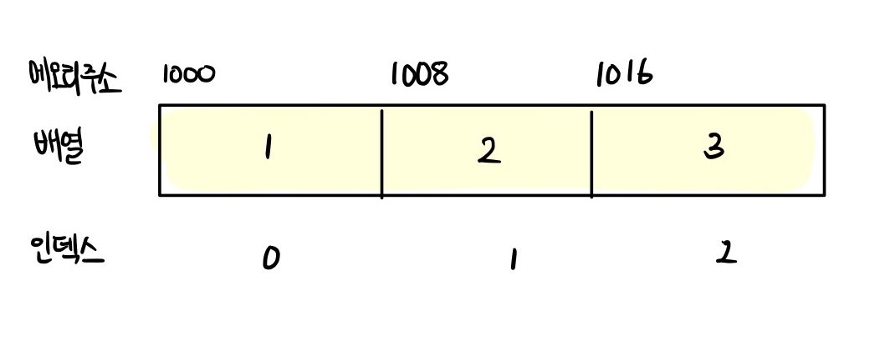
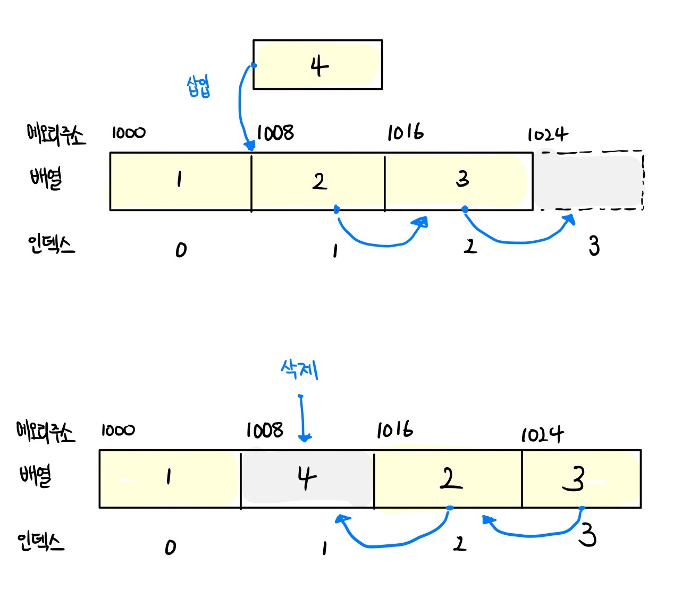
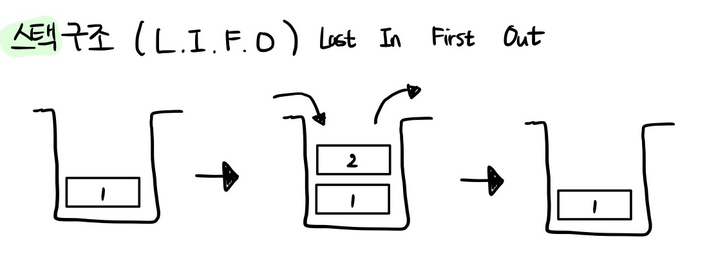
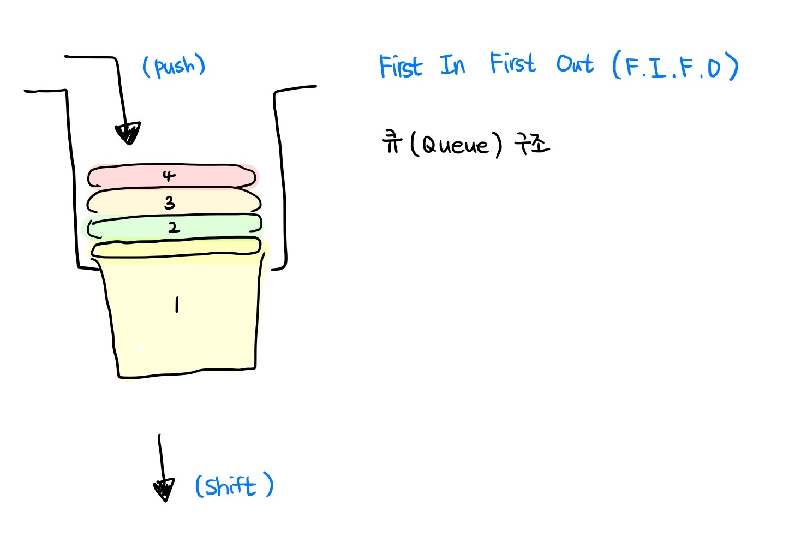
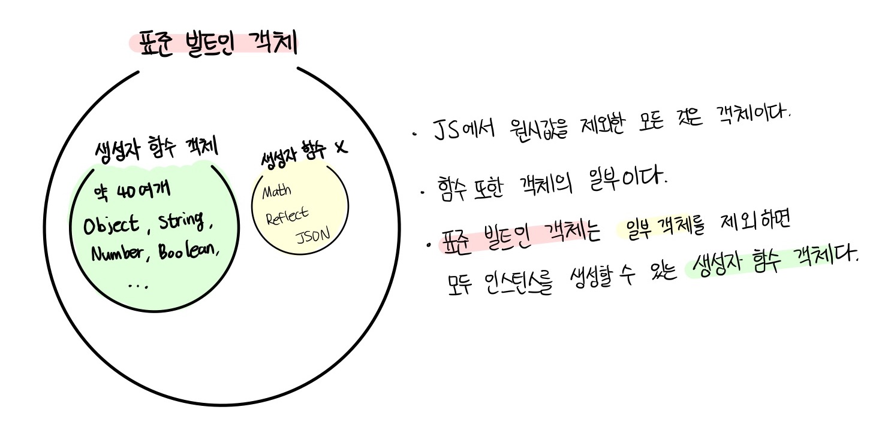

# 모던 자바스크립트 Deep Dive

## 목차

- [27장 배열](#27장-배열)
- [28장 Number](#28장-Number)
- [29장 Math](#29장-Math)
- [30장 Date](#30장-Date)
- [31장 RegExp](#31장-RegExp)
- [32장 String](#32장-String)
- <a href="https://github.com/junh0328/upgrade_javascript/blob/master/DEEPDIVE/readme5.md">다음 섹션으로</a>

## 27장 배열

### 27.1 배열이란?

<p><b>배열(array)는 여러 개의 값을 순차적으로 나열한 자료구조다.</b> 배열은 사용 빈도가 매우 높은 가장 기본적인 자료구조다. 자바스크립트는 배열을 다루기 위한 유용한 메서드를 다수 제공한다.</p>

```js
const arr = ["apple", "banana", "orange"];
```

<p><b>배열이 가지고 있는 값을 요소(element)</b>라고 부른다. 자바스크립트의 모든 값은 배열의 요소가 될 수 있다. 즉, 원시값은 물론 객체, 함수, 배열 등 자바스크립트에서 값으로 인정하는 모든 것은 배열의 요소가 될 수 있다. 배열의 요소는 배열에서 자신의 위치를 나타내는 0 이상의 정수인 인덱스(index)를 갖는다. 인덱스는 배열의 요소에 접근할 때 사용한다. 대부분의 프로그래밍 언어에서 인덱스는 0부터 시작한다.</p>

<p>요소에 접근할 때는 대괄호 표기법 [ ]을 사용한다. 대괄호 내에는 접근하고 싶은 요소의 인덱스를 지정한다. </p>

```js
arr[0]; // -> 'apple'
arr[1]; // -> 'banana'
arr[2]; // -> 'orange'
```

<p>배열은 요소의 개수, 즉 배열의 길이를 나타내는 length 프로퍼티를 갖는다.</p>

```js
arr.length; // -> 3
```

<p>배열은 ① index 와 ② length 프로퍼티를 갖기 때문에 for 문을 통해 순차적으로 요소에 접근할 수 있다.</p>

```js
// 배열의 순회
for (let i = 0; i < arr.length; i++) {
  console.log(arr[i]); // 'apple' 'banana' 'orange'
}
```

<p><b>자바스크립트에 배열이라는 타입은 존재하지 않는다. 배열은 객체 타입이다.</b></p>

```js
typeof arr; // -> object
```

<p>배열은 ① 배열 리터럴 ② Array 생성자 함수 ③ Array.of ④ Array.from 메서드로 생성할 수 있다. 배열의 생성자 함수는 Array이며, 배열의 프로토타입 객체는 Array.prototype이다. Array.prototype은 배열을 위한 빌트인 메서드를 제공한다.</p>

```js
const arr = [1, 2, 3];

arr.constructor === Array; // -> true (arr의 생성자가 Array 생성자 함수이니?)
Object.getPrototypeOf(arr) === Array.prototype; // -> true
```

<p>배열은 객체지만 일반 객체와는 구별되는 독특한 특징이 있다.</p>

|      구분       |           객체            |     배열      |
| :-------------: | :-----------------------: | :-----------: |
|      구조       | 프로퍼티 키와 프로퍼티 값 | 인덱스와 요소 |
|    값의 참조    |        프로퍼티 키        |    인덱스     |
|    값의 순서    |             X             |       O       |
| length 프로퍼티 |             X             |       O       |

<br/>

<p>일반 객체와 배열을 구분하는 가장 명확한 차이는 <b>① 값의 순서와 ② length 프로퍼티</b>다. 인덱스로 표현되는 값의 순서와 length 프로퍼티를 갖는 배열은 반복문을 통해 순차적으로 값에 접근하기 적합한 자료구조다. 배열의 장점은 처음부터 순차적으로 요소에 접근할 수도 있고, 마지막부터 역순으로 요소에 접근할 수도 있으며, 특정 위치부터 순차적으로 요소에 접근할 수도 있다는 것이다. 이는 배열이 인덱스, 즉 값의 순서와 length 프로퍼티를 갖기 때문에 가능한 것이다.</p>

### 27.2 자바스크립트 배열은 배열이 아니다

<p><b>자료구조(data structure)</b>에서 말하는 배열은 <b>동일한 크기의 메모리 공간이 빈틈없이 연속적으로 나열된 자료구조를 말한다.</b> 즉, 배열의 요소는 하나의 데이터 타입으로 통일되어 있으며 서로 연속적으로 인접해 있다. 이러한 배열은 <b>밀집 배열(dense array)</b>이라 한다.</p>



<p>이처럼 일반적인 의미의 배열은 각 요소가 동일한 데이터 크기를 가지며, 빈틈없이 연속적으로 이어져 있으므로 다음과 같이 인덱스를 통해 단 한 번의 연산으로 임의의 요소에 접근<b>(암의 접근(random access, 시간 복잡도 O(1)))</b>할 수 있다. 이는 매우 효율적이며, 고속으로 동작한다.</p>

```
검색 대상 요소의 메모리 주소  = 배열의 시작 메모리 주소 + 인덱스 * 요소의 바이트 수
```

<p>각 요소가 8바이트인 메모리 주소가 1000에서 시작하는 배열을 생각해 보자.</p>

- 인덱스가 0인 요소의 메모리 주소 : 1000 + 0 \* 8 = 1000
- 인덱스가 1인 요소의 메모리 주소 : 1000 + 1 \* 8 = 1008
- 인덱스가 2인 요소의 메모리 주소 : 1000 + 2 \* 8 = 1016

<p>이처럼 배열은 인덱스를 통해 효율적으로 요소에 접근할 수 있다는 장점이 있다. <b>하지만 정렬되지 않은 배열에 특정한 요소를 검색하는 경우 배열의 모든 요소를 처음부터 특정 요소를 발견할 때까지 차례대로 검색해야 한다.(선형 검색 linear search, 시간 복잡도 O(n))</b></p>

```js
// 선형 검색을 통해 배열(array)에 특정 요소(target)가 존재하는지 확인한다.
// 배열에 특정 요소가 존재하면 특정 요소의 인덱스를 반환하고, 존재하지 않으면 -1을 반환한다.
function linearSearch(array, target) {
  const length = array.length;

  for (let i = 0; i < length; i++) {
    if (array[i] === target) return i;
  }

  return -1;
}

console.log(linearSearch([1, 2, 3, 4, 5, 6], 3)); // 2
console.log(linearSearch([1, 2, 3, 4, 5, 6], 0)); // -1
```

<p>또한 배열에 요소를 삽입하거나 삭제하는 경우 배열의 요소를 연속적으로 유지하기 위해 요소를 이동시켜야 하는 단점도 있다.</p>



<p>자바스크립트의 배열은 지금까지 살펴본 자료구조에서 말하는 일반적인 의미의 배열과 다르다. <b>즉, 배열의 요소를 위한 각각의 메모리 공간은 동일한 크기를 갖지 않아도 되며, 연속적으로 이어져 있지 않을 수도 있다. 배열의 요소가 연속적으로 이어져 있지 않는 배열을 희소 배열(sparse array)이라 한다.</b></p>

<p>이처럼 자바스크립트의 배열(희소 배열)은 엄밀히 말해 일반적인 의미의 배열이 아니다. <b>자바스크립트의 배열은 일반적인 배열의 동작을 흉내 낸 특수한 객체다.</b> </p>

```js
// "16.2. 프로퍼티 어트리뷰트와 프로퍼티 디스크립터 객체" 참고
console.log(Object.getOwnPropertyDescriptors([1, 2, 3]));
/*
{
  '0': {value: 1, writable: true, enumerable: true, configurable: true}
  '1': {value: 2, writable: true, enumerable: true, configurable: true}
  '2': {value: 3, writable: true, enumerable: true, configurable: true}
  length: {value: 3, writable: true, enumerable: false, configurable: false}
}
*/

/* 자바스크립트 배열은 문자열 0 , 1, 2 를 프로퍼티 키로 가지며 length 프로퍼티를 갖는다 */
```

<p>자바스크립트 배열은 인덱스를 나타내는 문자열을 프로퍼티 키로 가지며, length 프로퍼티를 갖는 특수한 객체다. <b>자바스크립트 배열의 요소(element)는 사실 프로퍼티 값({ key:value })이다.</b> 자바스크립트에서 사용할 수 있는 모든 값은 객체의 프로퍼티 값이 될 수 있으므로 어떤 타입의 값이라도 배열의 요소가 될 수 있다.</p>

```js
const arr = [
  "string",
  10,
  true,
  null,
  undefined,
  NaN,
  Infinity,
  [],
  {},
  function () {},
];
```

<p>즉 ① 자바스크립트 배열은 인덱스로 배열 요소에 접근하는 경우에는 일반적인 배열보다 느리지만 ② 특정 요소를 검색하거나 요소를 삽입 또는 삭제하는 경우에는 일반적인 배열보다 빠르다. 자바스크립트 배열은 <b> 인덱스로 접근하는 경우의 성능 대신 특정 요소를 탐색하거나 배열 요소를 삽입 또는 삭제하는 경우의 성능을 선택한 것이다.</b></p>

### 27.3 length 프로퍼티와 희소 배열

<p>length 프로퍼티는 요소(element)의 개수, 즉 배열의 길이를 나타내는 0이상의 정수를 값으로 갖는다. length 프로퍼티의 값은 빈 배열일 경우 0이며, 빈 배열이 아닐 경우 가장 큰 인덱스에 1을 더한 것과 같다.</p>

```js
console.log([].length); // -> 0
console.log([1, 2, 3].length); // -> 3
```

<p>length 프로퍼티의 값은 배열에 요소를 추가하거나 삭제하면 자동 갱신된다.</p>

```js
const arr = [1, 2, 3];
console.log(arr.length); // 3

// 요소 추가
arr.push(4);
// 요소를 추가하면 length 프로퍼티의 값이 자동 갱신된다.
console.log(arr.length); // 4

// 요소 삭제
arr.pop();
// 요소를 삭제하면 length 프로퍼티의 값이 자동 갱신된다.
console.log(arr.length); // 3
```

<p>length 프로퍼티 값은 요소의 개수, 즉 배열의 길이를 바탕으로 결정되지만 <b>임의의 숫자 값을 명시적으로 할당할 수도 있다.</b> 그럴 경우 배열의 길이가 줄어든다.</p>

```js
const arr = [1, 2, 3, 4, 5];

// 현재 length 프로퍼티 값인 5보다 작은 숫자 값 3을 length 프로퍼티에 할당
arr.length = 3;

// 배열의 길이가 5에서 3으로 줄어든다.
console.log(arr); // [1, 2, 3]
```

<p>더 큰 값을 할당하는 경우 length 프로퍼티 값은 변경되지만 실제로 배열의 길이가 늘어나지 않는다.</p>

```js
const arr = [1];

// 현재 length 프로퍼티 값인 1보다 큰 숫자 값 3을 length 프로퍼티에 할당
arr.length = 3;

// length 프로퍼티 값은 변경되지만 실제로 배열의 길이가 늘어나지는 않는다.
console.log(arr.length); // 3
console.log(arr); // [[ 1, <2 empty items> ]
```

<p>값이 없이 비어 있는 요소를 위해 메모리 공간을 확보하지 않으며 빈 요소를 생성하지도 않는다.</p>

```js
console.log(Object.getOwnPropertyDescriptors(arr));
/*
{
  '0': {value: 1, writable: true, enumerable: true, configurable: true},
  length: {value: 3, writable: true, enumerable: false, configurable: false}
}
*/
```

<p>이처럼 <b>배열의 요소가 연속적으로 위치하지 않고 일부가 비어 있는 배열을 희소 배열이라 한다.</b> 자바스크립트는 희소 배열을 문법적으로 허용한다. 하지만, 희소 배열은 사용하지 않는 것이 좋다. 희소 배열은 연속적인 값의 집합이라는 배열의 기본적인 개념과 맞지 않으며, 성능에도 좋지 않은 영향을 준다. 따라서 배열에는 같은 타입의 요소를 연속적으로 위치하는 것이 최선이다.</p>

### 27.4 배열 생성

<p>객체와 마찬가지로 배열 또한 다양한 생성 방식이 있다.</p>

```
① 배열 리터럴
② Array 생성자 함수
③ Array.of
④ Array.from
```

### ① 배열 리터럴

<p>배열 리터럴은 객체 리터럴과 달리 프로퍼티 키가 없고 값만 존재한다.</p>

```js
const arr = [1, 2, 3];
console.log(arr.length); // 3
```

<p>배열 리터럴에 요소(element)를 생략하면 희소 배열이 생성된다.</p>

```js
const arr = [1, , 3]; // 희소 배열

// 희소 배열의 length는 배열의 실제 요소 개수보다 언제나 크다.
console.log(arr.length); // 3
console.log(arr); // [1, empty, 3]
console.log(arr[1]); // undefined
```

### ② Array 생성자 함수

<p>Object 생성자 함수를 통해 객체를 생성할 수 있듯이 Array 생성자 함수를 통해 배열을 생성할 수도 있다. Array 생성자 함수는 전달된 인수의 개수에 따라 다르게 동작하므로 주의가 필요하다.</p>

```js

case 1 : 인수 1개

const arr = new Array(10);

console.log(arr); // [empty × 10]
console.log(arr.length); // 10

---------------------------------

case 2 : 인수 2개이상 또는 숫자가 아닌 경우

// 전달된 인수가 2개 이상이면 인수를 요소로 갖는 배열을 생성한다.
new Array(1, 2, 3); // -> [1, 2, 3]

// 전달된 인수가 1개지만 숫자가 아니면 인수를 요소로 갖는 배열을 생성한다.
new Array({}); // -> [{}]

---------------------------------

case 3 : 인수 x
new Array(); // -> []

```

### ③ Array.of

<p>ES6에서 도입된 Array.of 메서드는 정적 메서드로서 전달된 인수를 요소로 갖는 배열을 생성한다. Array 생성자 함수와는 다르게 전달된 인수가 1개이고 숫자이더라도 인수를 요소로 갖는 배열을 생성한다.</p>

```js
// 전달된 인수가 1개이고 숫자이더라도 인수를 요소로 갖는 배열을 생성한다.
Array.of(1); // -> [1]

Array.of(1, 2, 3); // -> [1, 2, 3]

Array.of("string"); // -> ['string']
```

### ④ Array.from

<p><p>ES6에서 도입된 Array.from 메서드는 정적 메서드로서 유사 배열 객체 또는 이터러블ㄹ 객체를 인수로 전달받아 배열로 변환하여 반환한다. </p>

```js
// 유사 배열 객체를 변환하여 배열을 생성한다.
Array.from({ length: 2, 0: "a", 1: "b" }); // -> ['a', 'b']

// 이터러블을 변환하여 배열을 생성한다. 문자열은 이터러블이다.
Array.from("Hello"); // -> ['H', 'e', 'l', 'l', 'o']
```

### 27.5 배열 요소의 참조

<p>배열의 요소를 참조할 때는 대괄호 표기법을 사용한다.</p>

```js
const arr = [1, 2];

// 인덱스가 0인 요소를 참조
console.log(arr[0]); // 1
// 인덱스가 1인 요소를 참조
console.log(arr[1]); // 2

// 인덱스가 2인 요소를 참조. 배열 arr에는 인덱스가 2인 요소가 존재하지 않는다.
console.log(arr[2]); // undefined
```

### 27.6 배열 요소의 추가와 갱신

<p>객체에 프로퍼티를 동적으로 추가할 수 있는 것처럼 배열에도 요소를 동적으로 추가할 수 있다.</p>

```js
const arr = [0];

// 배열 요소의 추가
arr[1] = 1;

console.log(arr); // [0, 1]
console.log(arr.length); // 2
```

<p>만약 현재 배열의 length 프로퍼티 값보다 큰 인덱스로 새로운 요소를 추가하면 희소 배열이 된다.</p>

```js
const arr = [1, 2];

arr[100] = 100;

console.log(arr); // [ 1, 2, <98 empty items>, 100 ]
console.log(arr.length); // 101
```

<p>인덱스 요소의 위치를 나타낼 때 정수 이외의 값을 인덱스처럼 사용하면 요소가 생성되는 것이 아니라 프로퍼티가 생성된다. 이때 추가된 프로퍼티는 length 값에 영향을 주지 않는다.</p>

```js
const arr = [];

// 배열 요소의 추가
arr[0] = 1;
arr["1"] = 2;

// 프로퍼티 추가
arr["foo"] = 3;
arr.bar = 4;
arr[1.1] = 5;
arr[-1] = 6;

console.log(arr); // [1, 2, foo: 3, bar: 4, '1.1': 5, '-1': 6]

// 프로퍼티는 length에 영향을 주지 않는다.
console.log(arr.length); // 2
```

### 27.7 배열 요소의 삭제

<p>자바스크립트에서의 배열은 사실 객체이기 때문에 배열의 특정 요소를 삭제하기 위해 delete 연산자를 사용할 수 있다.</p>

```js
const arr = [1, 2, 3];

// 배열 요소의 삭제
delete arr[1];
console.log(arr); // [1, empty, 3]

// length 프로퍼티에 영향을 주지 않는다. 즉, 희소 배열이 된다.
console.log(arr.length); // 3
```

<p>delete 연산자는 객체의 프로퍼티를 삭제한다ㅏ. 이때 배열은 희소 배열이 되며 length 프로퍼티 값은 변하지 않는다. 따라서 희소 배열을 만들지 않으면서 배열의 특정 요소를 완전히 삭제하려면 Array.prototype.splice 메서드를 사용한다.</p>

```js
const arr = [1, 2, 3];

// Array.prototype.splice(삭제를 시작할 인덱스, 삭제할 요소 수)
// arr[1]부터 1개의 요소를 제거
arr.splice(1, 1);
console.log(arr); // [1, 3]

// length 프로퍼티가 자동 갱신된다.
console.log(arr.length); // 2
```

### 27.8 배열 메서드

> <a href="https://developer.mozilla.org/ko/docs/Web/JavaScript/Reference/Global_Objects/Array">MDN: Array 메서드 살펴보기</a>

```
단순히 정리된 내용만 보고 유추하는 것이 아닌, 스스로 많이 활용해 봐야 합니다.
아직까지 써보지 않거나 약한 부분에 대해서 정리할 것 같습니다. MDN을 통해 하나하나씩 공부해 나갈 것을 추천드립니다.
```

<p>자바스크립트는 배열을 다룰 때 유용한 다양한 빌트인 메서드를 제공한다. Array 생성자 함수는 정적 메서드를 제공하며, 배열 객체의 프로토타입인 Array.prototype은 프로토타입 메서드를 제공한다. 배열 메서드는 결과물을 반환하는 패턴이 <b>두 가지</b>이므로 주의가 필요하다. <b>배열에는 ① 원본 배열을 직접 변경하는 메서드 ② 원본 배열을 직접 변경하지 않고 새로운 배열을 생성하여 반환하는 메서드</b>가 있다.</p>

```js
const arr = [1];

// push 메서드는 원본 배열(arr)을 직접 변경한다.
arr.push(2);
console.log(arr); // [1, 2]

// concat 메서드는 원본 배열(arr)을 직접 변경하지 않고 새로운 배열을 생성하여 반환한다.
const result = arr.concat(3);
console.log(arr); // [1, 2]
console.log(result); // [1, 2, 3]
```

<p>ES5부터 도입된 배열 메서드는 대부분 원본 배열을 직접 변경하지 않지만 초창기 배열 메서드는 원본 배열을 직접 변경하는 경우가 많다. 원본 배열을 직접 변경하는 메서드는 외부 상태를 직접 변경하는 <b>부수효과(side effect)</b>가 있으므로 사용할 때 주의해야 한다. 가급적 원본 배열을 직접 변경하지 않는 메서드를 사용하는 편이 좋다.</p>

<p>살펴 볼 배열 메서드 목록보기 (가장 많이 쓰이는 Array의 [정적/프로토타입] 메서드 목록)</p>

```
Array.isArray 🌟
Array.prototype.indexOf 🌟
Array.prototype.push (원본 배열을 변경한다 - 부수효과 o)
Array.prototype.pop (원본 배열을 변경한다 - 부수효과 o)
Array.prototype.unshift (원본 배열을 변경한다 - 부수효과 o)
Array.prototype.shift (원본 배열을 변경한다 - 부수효과 o)
Array.prototype.concat 🌟
Array.prototype.splice 🌟 (원본 배열을 변경한다 - 부수효과 o)
Array.prototype.slice 🌟
Array.prototype.join 🌟 (원본 배열을 변경한다 - 부수효과 o)
Array.prototype.reverse 🌟 (원본 배열을 변경한다 - 부수효과 o)
Array.prototype.fill 🌟 (원본 배열을 변경한다 - 부수효과 o)
Array.prototype.includes 🌟

1. push / pop
2. unshift / shift
위 메서드들은 스택/ 큐 구조로만 정리하고 넘어갈 것이다
```

<details>
<summary>심호흡하고 들어오기</summary>

### Array.isArray 🌟

<p>Array.isArray는 Array 생성자 함수의 정적 메서드다. 앞서 살펴본 Array.of 와 Array.from 도 정적 메서드이다.</p>

```
Array.isArray 메서드는 전달된 인수가 배열이면 true, 배열이 아니면 false를 반환한다
```

```js
// true (truthy 한 값)
console.log(Array.isArray([]));
console.log(Array.isArray([1]));
console.log(Array.isArray([1, 2]));
console.log(Array.isArray([{ key: 1 }, { key: 2 }]));
console.log(Array.isArray(new Array()));
console.log(Array.isArray(new Array(100)));

console.log("--------------------------------------------------");

// false (falsy 한 값)
console.log(Array.isArray());
console.log(Array.isArray({}));
console.log(Array.isArray(null));
console.log(Array.isArray(undefined));
console.log(Array.isArray(1));
console.log(Array.isArray("Array"));
console.log(Array.isArray(true));
console.log(Array.isArray(false));
console.log(Array.isArray({ 0: 1, length: 1 }));
```

### Array.prototype.indexOf 🌟

<p>indexOf 메서드는 원본 배열에서 인수로 전달된 요소를 검색하여 인덱스를 반환한다.</p>

```
원본 배열에 인수로 전달한 요소와 중복되는 요소가 여러 개 있다면 첫 번째로 검색된 요소의 인덱스를 반환핟다
원본 배열에 인수로 전달한 요소가 존재하지 않으면 -1을 반환한다.
```

```js
const arr = [1, 2, 2, 3];

// 배열 arr에서 요소 2를 검색하여 첫 번째로 검색된 요소의 인덱스를 반환한다.
arr.indexOf(2); // -> 1
// 배열 arr에 요소 4가 없으므로 -1을 반환한다.
arr.indexOf(4); // -> -1
// 두 번째 인수는 검색을 시작할 인덱스다. 두 번째 인수를 생략하면 처음부터 검색한다.
arr.indexOf(2, 2); // -> 2

/* indexOf 메서드는 배열에 특정 요소가 존재하는지 확일할 때 유용하다.*/

const foods = ["apple", "banana", "orange"];

// foods 배열에 'orange' 요소가 존재하는지 확인한다.
if (foods.indexOf("orange") === -1) {
  // foods 배열에 'orange' 요소가 존재하지 않으면 'orange' 요소를 추가한다.
  foods.push("orange");
}

console.log(foods); // ["apple", "banana", "orange"]
```

<p>indexOf 메서드 대신 Array.prototype.includes 메서드를 사용하면 가독성이 더 좋다.</p>

### Array.prototype.includes 🌟

<p>ES7에서 도입된 includes 메서드는 배열 내에 특정 요소가 포함되어 있는지 확인하여 true 또는 false를 반환한다.</p>

```
첫 번째 인수로 검색할 대상을 지정한다
두 번째 인수로 검색을 시작할 인덱스를 전달할 수 있다. (기본값은 0)
```

```js
const foods = ["apple", "banana"];

// foods 배열에 'orange' 요소가 존재하는지 확인한다.
if (!foods.includes("orange")) {
  // foods.includes("orange") 는 false 이므로 ! 연산자를 통해 해당 결과를 true로 바꿔 블록문 내부를 실행한다
  // foods 배열에 'orange' 요소가 존재하지 않으면 'orange' 요소를 추가한다.
  foods.push("orange");
}

console.log(foods); // ["apple", "banana", "orange"]
```

### Array.prototype.concat 🌟

<p>concat 메서드는 인수로 전달된 값들을 원본 배열의 마지막 요소로 추가한 새로운 배열을 반환한다. 인수로 전달한 값이 배열인 경우 배열을 해체하여 새로운 배열의 요소로 추가한다. 원본 배열은 변경되지 않는다.</p>

```js
const arr1 = [1, 2];
const arr2 = [3, 4];

// 배열 arr2를 원본 배열 arr1의 마지막 요소로 추가한 새로운 배열을 반환한다.
// 인수로 전달한 값이 배열인 경우 배열을 해체하여 새로운 배열의 요소로 추가한다.
let result = arr1.concat(arr2);
console.log(result); // [1, 2, 3, 4]

// 숫자를 원본 배열 arr1의 마지막 요소로 추가한 새로운 배열을 반환한다.
result = arr1.concat(3);
console.log(result); // [1, 2, 3]

// 배열 arr2와 숫자를 원본 배열 arr1의 마지막 요소로 추가한 새로운 배열을 반환한다.
result = arr1.concat(arr2, 5);
console.log(result); // [1, 2, 3, 4, 5]

// 원본 배열은 변경되지 않는다.
console.log(arr1); // [1, 2]
```

<p>concat 메서드는 ES6의 스프레드(...)문법으로 대체할 수 있다.</p>

```js
let result = [1, 2].concat([3, 4]);
console.log(result); // [1, 2, 3, 4]

// concat 메서드는 ES6의 스프레드 문법으로 대체할 수 있다.
result = [...[1, 2], ...[3, 4]];
console.log(result); // [1, 2, 3, 4]
```

<p>결론적으로 push/unshift 메서드와 concat 메서드를 사용하는 대신 ES6의 스프레드 문법을 일관성 있게 사용하는 것을 권장한다.</p>

### Array.prototype.splice 🌟

<p>splice() 메서드는 배열의 기존 요소를 삭제 또는 교체하거나 새 요소를 추가하여 배열의 내용을 변경합니다.</p>

```
array.splice(start[, deleteCount[, item1[, item2[, ...]]]])
```

```
① start: 배열의 변경을 시작할 인덱스입니다. 배열의 길이보다 큰 값이라면 실제 시작 인덱스는 배열의 길이로 설정됩니다.
② deleteCount: 원본 배열의 요소를 제거하기 시작할 인덱스인 요소의 개수입니다. 0인 경우 아무런 요소도 제거되지 않습니다.
③ items: 제거한 위치에 삽입한 요소들의 목록입니다. 생략할 경우 원본 배열에서 요소들을 제거하기만 합니다
```

<p>하나도 제거하지 않고, 2번 인덱스에 "drum"과 "guitar" 추가</p>

```js
var myFish = ["angel", "clown", "mandarin", "sturgeon"];
var removed = myFish.splice(2, 0, "drum", "guitar");

// myFish is ["angel", "clown", "drum", "guitar", "mandarin", "sturgeon"]
// removed is [], no elements removed
```

<p>3번 인덱스에서 한 개 요소 제거</p>

```js
var myFish = ["angel", "clown", "drum", "mandarin", "sturgeon"];
var removed = myFish.splice(3, 1);

// removed is ["mandarin"]
// myFish is ["angel", "clown", "drum", "sturgeon"]
```

<p>0번 인덱스에서 두 개 요소 제거하고 "parrot", "anemone", "blue" 추가</p>

```js
var myFish = ["angel", "clown", "trumpet", "sturgeon"];
var removed = myFish.splice(0, 2, "parrot", "anemone", "blue");

// myFish is ["parrot", "anemone", "blue", "trumpet", "sturgeon"]
// removed is ["angel", "clown"]
```

<p>배열의 특정 요소를 제거하려면 indexOf 메서드를 통해 특정 요소의 인덱스를 취득한 다음 splice 메서드를 이용합니다</p>

```js
const arr = [1, 2, 3, 1, 2];

// 배열 array에서 item 요소를 제거한다. item 요소가 여러 개 존재하면 첫 번째 요소만 제거한다.
function remove(array, item) {
  // 제거할 item 요소의 인덱스를 취득한다.
  const index = array.indexOf(item);

  // 제거할 item 요소가 있다면 제거한다.
  if (index !== -1) array.splice(index, 1);

  return array;
}

console.log(remove(arr, 2)); // [1, 3, 1, 2]
console.log(remove(arr, 10)); // [1, 3, 1, 2]
```

### Array.prototype.slice 🌟

<p>slice 메서드는 인수로 전달된 범위의 요소들을 복사하여 배열로 반환합니다. 원본 배열이 변겨오디지 않으며, 이미 존재하는 배열(new Array(100))에서 일부를 복사하여 새로운 값으로 가공할 때 유용한 메서드입니다. slice 메서드는 두 개의 매개변수를 갖습니다</p>

```
① start: 복사를 시작한 인덱스입니다. 음수인 경우 배열의 끝에서의 인덱스를 나타냅니다
② end: 복사를 종료할 인덱스입니다. end에 해당되는 요소는 복사되지 않습니다 (그 전까지만 복사)
```

```js
const arr = [1, 2, 3];

// arr[0]부터 arr[1] 이전(arr[1] 미포함)까지 복사하여 반환한다.
arr.slice(0, 1); // -> [1]

// arr[1]부터 arr[2] 이전(arr[2] 미포함)까지 복사하여 반환한다.
arr.slice(1, 2); // -> [2]

// 원본은 변경되지 않는다.
console.log(arr); // [1, 2, 3]
```

<p>arr[1] 이후의 모든 요소를 복사하여 반환하기</p>

```js
const arr = [1, 2, 3];

// arr[1]부터 이후의 모든 요소를 복사하여 반환한다.
arr.slice(1); // -> [2, 3]
```

<p>새로운 원본 배열의 복사본을 생성하여 반환하기</p>

```js
const arr = [1, 2, 3];

// 인수를 모두 생략하면 원본 배열의 복사본을 생성하여 반환한다.
const copy = arr.slice();
console.log(copy); // [1, 2, 3]

/* 얕은 복사 (shallow copy) */
console.log(copy === arr); // false 서로 다른 메모리 주소(참조 값)를 가지고 있기 때문에 (얕은 복사)
console.log(copy[0]);
console.log(arr[0]);
console.log(copy[0] === arr[0]); // true 해당 원시 값을 비교하면 같음
```

### Array.prototype.join 🌟

<p>join 메서드는 원본 배열의 모든 요소를 문자열로 변환한 후, 인수로 전달받은 문자열, 즉 <b>구분자(separator)</b>로 연결한 문자열을 반환한다. 구분자는 생략 가능하며 기본 구분자는 콤마(',')다.</p>

```js
const arr = [1, 2, 3, 4];

// 기본 구분자는 ','이다.
// 원본 배열 arr의 모든 요소를 문자열로 변환한 후, 기본 구분자 ','로 연결한 문자열 타입을 반환한다.
console.log(arr.join()); // -> '1,2,3,4';

// 원본 배열 arr의 모든 요소를 문자열로 변환한 후, 빈문자열로 연결한 문자열 타입을 반환한다.
console.log(arr.join("")); // -> '1234'

// 원본 배열 arr의 모든 요소를 문자열로 변환한 후, 구분자 ':'로 연결한 문자열 타입을 반환한다.
console.log(arr.join(":")); // -> '1:2:3:4'

console.log(arr); // -> [1, 2, 3, 4] 원본 배열은 유지된다
```

### Array.prototype.reverse 🌟

<p>reverse 메서드는 원본 배열의 순서를 반대로 뒤집는다. <b>이때 원본 배열이 변경된다.(부수효과 o)</b></p>

```js
const arr = [1, 2, 3];
const result = arr.reverse();

// reverse 메서드는 원본 배열을 직접 변경한다.
console.log(arr); // [3, 2, 1]
// 반환값은 변경된 배열이다.
console.log(result); // [3, 2, 1]
```

### Array.prototype.fill 🌟

<p>ES6에 도입된 fill 메서드는 인수로 전달받은 값을 배열의 처음부터 끝까지 요소로 채운다. 이때 원본 배열이 변경된다. (부수효과 o)</p>

```js
const arr = [1, 2, 3];

// 인수로 전달 받은 값 0을 배열의 처음부터 끝까지 요소로 채운다.
arr.fill(0);

// fill 메서드는 원본 배열을 직접 변경한다.
console.log(arr); // [0, 0, 0]
```

<p>두 번째 인수로 요소 채우기를 시작할 인덱스를 전달할 수 있다.</p>

```js
const arr = [1, 2, 3];

// 인수로 전달받은 값 0을 배열의 인덱스 1부터 끝까지 요소로 채운다.
arr.fill(0, 1);

// fill 메서드는 원본 배열을 직접 변경한다.
console.log(arr); // [1, 0, 0]
```

<p>세 번째 인수로 요소 채우기를 멈출 인덱스를 전달할 수 있다.</p>

```js
const arr = [1, 2, 3, 4, 5];

// 인수로 전달받은 값 0을 배열의 인덱스 1부터 3 이전(인덱스 3 미포함)까지 요소로 채운다.
arr.fill(0, 1, 3);

// fill 메서드는 원본 배열을 직접 변경한다.
console.log(arr); // [1, 0, 0, 4, 5]
```

<p>fill 메서드로 요소를 채울 경우 모든 요소를 하나의 값만으로 채울 수밖에 없다는 단점이 있다. 하지만 콜백 함수를 통해 요소값을 만들면서 배열을 채울 수 있다.</p>

```js
/* faker, shortId 라이브러리를 사용하여 더미 사용자 만들기 */

const initialState = {
  mainPosts: [
    {
      id: 1,
      User: {
        id: 1,
        nickname: '이준희',
      },
      content: '첫 번째 게시글 #해시태그 #익스프레스',
    },
  ]

--------------------------------------------------------
initialState.mainPosts = initialState.mainPosts.concat(
  Array(20)
    .fill()
    .map(() => ({
      id: shortId.generate(),
      User: {
        id: shortId.generate(),
        nickname: faker.name.findName(),
      },
      content: faker.lorem.paragraph(),
    }))
);
```

</details>

### stack 자료구조

<p>스택(stack)은 데이터를 마지막에 밀어 넣고, 마지막에 밀어 넣은 데이터를 먼저 꺼내는 후입 선출(LIFO) 방식의 자료구조다. 스택은 언제나 가장 마지막에 밀어 넣은 최신 데이터를 먼저 취득한다. 스택에 데이터를 밀어 넣는 것을 푸시(push)라 하고 스택에서 데이터를 꺼내는 것을 팝(pop)이라고 한다.</p>



### queue 자료구조

<p>큐(queue)는 데이터를 마지막에 밀어 넣고, 처음 데이터, 즉 가장 먼저 밀어 넣은 데이터를 먼저 꺼내는 선입 선출(FIFO) 방식의 자료구조다. 스택은 언제나 마지막에 밀어 넣은 최신 데이터를 취득하지만 큐는 언제나 밀어 넣은 순서대로 취득한다.</p>



### 27.9 배열 고차 함수

<p>고차 함수(Higher-Order Function, HOF)는 함수를 인수로 전달받거나 함수를 반환하는 함수를 말한다. 자바스크립트의 함수는 일급 객체이므로 함수를 값처럼 인수로 전달할 수 있으며 반환할 수도 있다. 고차 함수는 외부 상태의 변경이나 가변(mutable) 데이터를 피하고 <b>불변성(immutability)</b>을 지향하는 <b>함수형 프로그래밍</b>에 기반을 두고 있다.</p>

<p><b>함수형 프로그래밍</b>은 순수 함수와 보조 함수의 조합을 통해 로직 내에 존재하는 조건문과 반복문을 제거하여 복잡성을 해결하고 변수의 사용을 억젲하여 상태 변경을 피하려는 프로그래밍 패러다임이다. 함수형 프로그래밍은 순수 함수를 통해 부수 효과를 최대한 억제하여 오류를 피하고 프로그램의 안정성을 높이려는 노력의 일환이라고 할 수 있다.</p>

```
Array.prototype.sort 📍
Array.prototype.forEach 📍
Array.prototype.map 📍
Array.prototype.filter 📍
Array.prototype.reduce 📍
Array.prototype.some 📍
Array.prototype.every 📍
Array.prototype.find 📍
```

<details>
<summary>심호흡하고 들어오기</summary>

### Array.prototype.sort

<p>sort 메서드는 배열의 요소를 정렬한다. 원본 배열을 직접 변경하며 정렬된 배열을 반환한다. 기본적으로 유니코드를 기반으로 오름차순으로 요소를 정렬한다.</p>

```js
const fruits = ["Banana", "Orange", "Apple"];

// 오름차순(ascending) 정렬
fruits.sort();

// sort 메서드는 원본 배열을 직접 변경한다.
console.log(fruits); // ['Apple', 'Banana', 'Orange']
```

<p>유니코드를 기반으로 동작하기 때문에 한글 문자열 요소도 오름차순으로 정렬된다.</p>

```js
const fruits = ["바나나", "오렌지", "사과"];

// 오름차순(ascending) 정렬
fruits.sort();

// sort 메서드는 원본 배열을 직접 변경한다.
console.log(fruits); // ['바나나', '사과', '오렌지']
```

<p>내림차순 정렬을 하기 위해서는 Array의 포로토타입 메서드인 sort()를 통해 정렬한 뒤, reverse()를 사용하여 출력합니다.</p>

```js
const fruits = ["Banana", "Orange", "Apple"];

// 오름차순(ascending) 정렬
fruits.sort();

// sort 메서드는 원본 배열을 직접 변경한다.
console.log(fruits); // ['Apple', 'Banana', 'Orange']

// 내림차순(descending) 정렬
fruits.reverse();

// reverse 메서드도 원본 배열을 직접 변경한다.
console.log(fruits); // ['Orange', 'Banana', 'Apple']
```

<p>유니코드 코드 포인트의 순서를 따르기 때문에 1~9 까지의 문자를 정렬할 때는 문제가 되지 않지만 두 자리 수부터 (10)는 문제가 발생할 수 있습니다. 문자열 10의 경우, 유니코드 코드 포인트가 U+0031U+0030이기 때문에, U+0032인 문자열 '2'보다 낮습니다. </p>

```js
["2", "10"].sort(); // -> ["10", "2"]
[2, 10].sort(); // -> [10, 2]
```

<p>따라서 숫자 요소를 정렬할 때는 sort 메서드에 <b>(정렬 순서를 정의하는 비교 함수)</b>를 인수로 전달해야 합니다.</p>

```js
const points = [40, 100, 1, 5, 2, 25, 10];

// 숫자 배열의 오름차순 정렬. 비교 함수의 반환값이 0보다 작으면 a를 우선하여 정렬한다.
points.sort((a, b) => a - b);
console.log(points); // [1, 2, 5, 10, 25, 40, 100]

// 숫자 배열에서 최소/최대값 취득
console.log(points[0], points[points.length]); // 1

// 숫자 배열의 내림차순 정렬. 비교 함수의 반환값이 0보다 작으면 b를 우선하여 정렬한다.
points.sort((a, b) => b - a);
console.log(points); // [100, 40, 25, 10, 5, 2, 1]

// 숫자 배열에서 최대값 취득
consconst todos = [
  { id: 4, content: 'JavaScript' },
  { id: 1, content: 'HTML' },
  { id: 2, content: 'CSS' }
];

// 비교 함수. 매개변수 key는 프로퍼티 키다.
function compare(key) {
  // 프로퍼티 값이 문자열인 경우 - 산술 연산으로 비교하면 NaN이 나오므로 비교 연산을 사용한다.
  // 비교 함수는 양수/음수/0을 반환하면 되므로 - 산술 연산 대신 비교 연산을 사용할 수 있다.
  return (a, b) => (a[key] > b[key] ? 1 : (a[key] < b[key] ? -1 : 0));
}

// id를 기준으로 오름차순 정렬
todos.sort(compare('id'));
console.log(todos);
/*
[
  { id: 1, content: 'HTML' },
  { id: 2, content: 'CSS' },
  { id: 4, content: 'JavaScript' }
]
*/

// content를 기준으로 오름차순 정렬
todos.sort(compare('content'));
console.log(todos);
/*
[
  { id: 2, content: 'CSS' },
  { id: 1, content: 'HTML' },
  { id: 4, content: 'JavaScript' }
]
*/
console.log(points[0]); // 100
```

<p>객체를 요소로 갖는 배열을 정렬하는 예제는 다음과 같습니다.</p>

```js
const todos = [
  { id: 4, content: "JavaScript" },
  { id: 1, content: "HTML" },
  { id: 2, content: "CSS" },
];

// 비교 함수. 매개변수 key는 프로퍼티 키다.
function compare(key) {
  // 프로퍼티 값이 문자열인 경우 - 산술 연산으로 비교하면 NaN이 나오므로 비교 연산을 사용한다.
  // 비교 함수는 양수/음수/0을 반환하면 되므로 - 산술 연산 대신 비교 연산을 사용할 수 있다.
  return (a, b) => (a[key] > b[key] ? 1 : a[key] < b[key] ? -1 : 0);
}

// id를 기준으로 오름차순 정렬
todos.sort(compare("id"));
console.log(todos);
/*
[
  { id: 1, content: 'HTML' },
  { id: 2, content: 'CSS' },
  { id: 4, content: 'JavaScript' }
]
*/

// content를 기준으로 오름차순 정렬
todos.sort(compare("content"));
console.log(todos);
/*
[
  { id: 2, content: 'CSS' },
  { id: 1, content: 'HTML' },
  { id: 4, content: 'JavaScript' }
]
*/
```

### Array.prototype.forEach

<p>앞서 살펴보았듯이 함수형 프로그래밍은 순수 함수와 보조 함수의 조합을 통해 로직 내에 존재하는 <b>조건문과 반복문을 제거</b>하여 복잡성을 해결하고 <b>변수의 사용을 억제</b>하여 상태 변경을 피하려는 프로그래밍 패러다임입니다. 조건문이나 반복문은 코드를 짠 본인 외에 타인이 볼 때 로직의 흐름을 이해하기 어려울 수 있습니다. 특히 for 문은 반복을 위한 변수를 선언해야 하며, 조건식과 증감식으로 이루어져 있어 함수형 프로그래밍이 추구하는 바와 맞지는 않습니다.</p>

<p>forEach 메서드는 for 문을 대체할 수 있는 고차 함수입니다. forEach 메서드는 반복문을 추상화한 고차 함수로서 내부에서 반복문을 통해 자신을 호출한 배열을 순회하면서 수행해야 할 처리를 <b>콜백 함수로 전달받아 반복 호출합니다.</b></p>

```js
const numbers = [1, 2, 3];
let pows = [];

// for 문으로 배열 순회
for (let i = 0; i < numbers.length; i++) {
  pows.push(numbers[i] ** 2);
}
console.log(pows); // [1, 4, 9]
```

```js
const numbers = [1, 2, 3];
let pows = [];

// forEach 메서드는 numbers 배열의 모든 요소를 순회하면서 콜백 함수를 반복 호출한다.
numbers.forEach((item) => pows.push(item ** 2));
console.log(pows); // [1, 4, 9]
```

<p>forEach 메서드의 콜백 함수는 forEach 메서드를 호출한 배열의 ① 요소값 ② 인덱스 ③ forEach 메서드를 호출한 배열 자체, 즉 this를 순차적으로 전달받을 수 있습니다.</p>

```js
// forEach 메서드는 콜백 함수를 호출하면서 3개(① 요소값 ② 인덱스 ③ this)의 인수를 전달한다.
[1, 2, 3].forEach((item, index, arr) => {
  console.log(`요소값: ${item}, 인덱스: ${index}, this: ${arr}`);
});

/*
요소값: 1, 인덱스: 0, this: [1,2,3]
요소값: 2, 인덱스: 1, this: [1,2,3]
요소값: 3, 인덱스: 2, this: [1,2,3]
*/
```

<p>기본적으로 forEach 메서드는 원본 배열을 변경하지 않는다. 하지만 콜백 함수를 통해 원본 배열을 변경할 수는 있다.</p>

```js
const numbers = [1, 2, 3];

// forEach 메서드는 원본 배열을 변경하지 않지만 콜백 함수를 통해 원본 배열을 변경할 수는 있다.
// 콜백 함수의 세 번째 매개변수 arr은 원본 배열 numbers를 가리킨다.
// 따라서 콜백 함수의 세 번째 매개변수 arr을 직접 변경하면 원본 배열 numbers가 변경된다.
numbers.forEach((item, index, arr) => {
  arr[index] = item ** 2;
});
console.log(numbers); // [1, 4, 9]
```

<p>화살표 함수는 함수 자체의 this 바인딩을 갖지 않고, 참조 시에 상위 스코프 (여기서는 multiply 메서드 내부의 this)를 그대로 참조한다.</p>

```js
class Numbers {
  numberArray = [];

  multiply(arr) {
    console.log(this); // Numbers { numberArray: [] }
    console.log(this.constructor); // [class Numbers]
    // 화살표 함수 내부에서 this를 참조하면 상위 스코프의 this를 그대로 참조한다.
    arr.forEach((item) => this.numberArray.push(item * item));
  }
}

const numbers = new Numbers();
numbers.multiply([1, 2, 3]);
console.log(numbers.numberArray); // [1, 4, 9]
```

### forEach 메서드의 폴리필(polyfill)

```
폴리필은 최신 사양의 기능을 지원하지 않는 브라우저를 위해 누락된 최신 사양의 기능을 구현하여 추가하는 것을 말한다.
```

```js
// 만약 Array.prototype에 forEach 메서드가 존재하지 않으면 폴리필을 추가한다.
if (!Array.prototype.forEach) {
  Array.prototype.forEach = function (callback, thisArg) {
    // 첫 번째 인수가 함수가 아니면 TypeError를 발생시킨다.
    if (typeof callback !== "function") {
      throw new TypeError(callback + " is not a function");
    }

    // this로 사용할 두 번째 인수를 전달받지 못하면 전역 객체를 this로 사용한다.
    thisArg = thisArg || window;

    // for 문으로 배열을 순회하면서 콜백 함수를 호출한다.
    for (var i = 0; i < this.length; i++) {
      // call 메서드를 통해 thisArg를 전달하면서 콜백 함수를 호출한다.
      // 이때 콜백 함수의 인수로 배열 요소, 인덱스, 배열 자신을 전달한다.
      callback.call(thisArg, this[i], i, this);
    }
  };
}
```

<p>for문과 달리 break, continue 문을 사용할 수 없고, 반드시 모든 요소를 순회해야 하는 특징이 있다.</p>

### Array.prototype.map

<p>map 메서드는 자신을 호출한 배열의 모든 요소를 순회하면서 인수로 전달받은 콜백 함수를 반복 호출한다. 그리고 콜백 함수의 반환값들로 구성된 새로운 배열을 반환한다. <b>이때 원본 배열은 변경되지 않는다(부수 효과가 없다)</b></p>

```js
const numbers = [1, 4, 9];

// map 메서드는 numbers 배열의 모든 요소를 순회하면서 콜백 함수를 반복 호출한다.
// 그리고 콜백 함수의 반환값들로 구성된 새로운 배열을 반환한다.
const roots = numbers.map((item) => Math.sqrt(item));

// 위 코드는 다음과 같다.
// const roots = numbers.map(Math.sqrt);

// map 메서드는 새로운 배열을 반환한다
console.log(roots); // [ 1, 2, 3 ]
// map 메서드는 원본 배열을 변경하지 않는다
console.log(numbers); // [ 1, 4, 9 ]
```

<p><B>①forEach 메서드와 ②map 메서드의 공통점은 자신을 호출한 배열의 모든 요소를 순회하면서 인수로 전달받은 콜백 함수를 반복 호출한다는 것이다.</B> 하지만 <B>①forEach 메서드는 언제나 undefined를 반환하고</B> <B>②map 메서드는 콜백 함수의 반환값들로 구성된 새로운 배열을 반환</B>한다는 것이다. 즉 <b>forEach 메서드는 단순히 반복문을 대체하기 위한 고차 함수이고 Map 메서드는 요소값을 다른 값으로 매핑한 새로운 배열을 생성하기 위한 고차 함수다.</b></p>

<p>map 메서드를 호출한 배열과 map 메서드가 생성하여 반환한 배열은 1:1 매핑한다. forEach 메서드와 마찬가지로 map 메서드의 콜백 함수는 map 메서드를 호출한 배열의 요소값과 인덱스, map 메서드를 호출한 배열 자체, 즉 this를 순차적으로 받을 수 있다. 다시 말해, ① map 메서드를 호출한 배열의 요소값 ② 인덱스 ③ 호출한 배열 자기 자신(this)를 순차적으로 전달한다.</p>

```js
// map 메서드는 콜백 함수를 호출하면서 3개(요소값, 인덱스, this)의 인수를 전달한다.
[1, 2, 3].map((item, index, arr) => {
  console.log(
    `요소값: ${item}, 인덱스: ${index}, this: ${JSON.stringify(arr)}`
  );
  return item;
});
/*
요소값: 1, 인덱스: 0, this: [1,2,3]
요소값: 2, 인덱스: 1, this: [1,2,3]
요소값: 3, 인덱스: 2, this: [1,2,3]
*/
```

### Array.prototype.filter

<p>filter 메서드는 자신을 호출한 배열의 모든 요소를 순회하면서 인수로 전달받은 콜백 함수를 반복 호출한다. 그리고 <b>콜백 함수의 반환값이 true (truthy)인 요소로만 구성된 새로운 배열을 바환한다. 이때 원본 배열을 변경되지 않는다.</b></p>

```js
const numbers = [1, 2, 3, 4, 5];

// filter 메서드는 numbers 배열의 모든 요소를 순회하면서 콜백 함수를 반복 호출한다.
// 그리고 콜백 함수의 반환값이 true인 요소로만 구성된 새로운 배열을 반환한다.
// 다음의 경우 numbers 배열에서 홀수인 요소만을 필터링한다(1은 true로 평가된다).
const odds = numbers.filter((item) => item % 2);
console.log(odds); // [1, 3, 5]
```

<p>filter 메서드는 자신을 호출한 배열의 모든 요소를 순회하면서 인수로 전달받은 콜백 함수를 호출한다. filter 메서드가 생성하여 반환한 새로운 배열의 length 프로퍼티 값은 filter 메서드를 호출한 배열의 length 프로퍼티 값과 같거나 작다.</p>

<p>filter 메서드는 filter 메서드를 호출한 ① 배열의 요소값 ② 인덱스 ③ filter 메서드를 호출한 배열(this)을 순차적으로 전달한다.</p>

```js
// filter 메서드는 콜백 함수를 호출하면서 3개(요소값, 인덱스, this)의 인수를 전달한다.
[1, 2, 3].filter((item, index, arr) => {
  console.log(
    `요소값: ${item}, 인덱스: ${index}, this: ${JSON.stringify(arr)}`
  );
  return item % 2;
});
/*
요소값: 1, 인덱스: 0, this: [1,2,3]
요소값: 2, 인덱스: 1, this: [1,2,3]
요소값: 3, 인덱스: 2, this: [1,2,3]
*/
```

<p>filter 메서드를 사용해 특정 요소를 제거할 경우 특정 요소가 중복되어 있다면 중복된 요소가 모두 제거된다. 특정 요소를 하나만 제거하려면 indexOf 메서드를 통해 특정 요소의 인덱스를 취득한 다음 spilce 메서드를 사용한다.</p>

### Array.prototype.reduce

<p>reduce 메서드는 자신을 호출한 배열을 모든 요소를 순회하며 인수로 전달받은 콜백 함수를 반복 호출한다. 그리고 콜백 함수의 반환값을 다음 순회 시에 콜백 함수의 첫 번째 인수로 전달하면서 콜백 함수를 호출하여 <b>하나의 결과값을 만들어 반환한다. 이떼 원본 배열은 변경되지 않는다</b></p>

<p>reduce 메서드는 첫 번째 인수로 콜백 함수, 두 번째 인수로 초기값을 전달받는다. reduce 메서드의 콜백 함수에는 4개의 인수 <b>① 초기값 또는 콜백 함수의 이전 반환값 ② reduce 메서드를 호출한 배열의 요소값 ③ 인덱스 ④ reduce 메서드를 호출한 배열 자체(this)</b>가 전달된다</p>

```js
// [1, 2, 3, 4]의 모든 요소의 누적을 구한다.
const sum = [1, 2, 3, 4].reduce(
  (accumulator, currentValue, index, array) => accumulator + currentValue,
  0
);

console.log(sum); // 10
```

|     구분     | accumulator(초기값) | currentValue(배열의 요소값) | index | 자기자신(array) |       콜백 함수의 반환값        |
| :----------: | :-----------------: | :-------------------------: | :---: | :-------------: | :-----------------------------: |
| 첫 번째 순회 |     0 (초기값)      |              1              |   0   |    [1,2,3,4]    | 1 (accumulator + currentValue)  |
| 두 번째 순회 |          1          |              2              |   1   |    [1,2,3,4]    | 3 (accumulator + currentValue)  |
| 세 번째 순회 |          3          |              3              |   2   |    [1,2,3,4]    | 6 (accumulator + currentValue)  |
| 4 번째 순회  |          6          |              4              |   3   |    [1,2,3,4]    | 10 (accumulator + currentValue) |

<p>이처럼 reduce 메서드는 초기값과 배열의 첫 번째 요소값을 콜백 함수에게 인수로 전달하면서 호출하고 다음 순회에는 콜백 함수의 반환값과 두 번째 요소 값을 콜백 함수의 인수로 전달하면서 호출한다. 이러한 과정을 반복하여 <b>reduce 메서드는 하나의 결과값을 반환한다.</b></p>

<p>주의할 것은 두 번째 인수로 전달하는 초기값이 옵션이라는 것이다. 즉 reduce 메서드의 두 번째 인수로 전달하는 초기값은 생략할 수 있다.</p>

```js
// reduce 메서드의 두 번째 인수, 즉 초기값을 생략했다.
const sum = [1, 2, 3, 4].reduce((acc, cur) => acc + cur);
console.log(sum); // 10
```

<p>하지만 reduce 메서드를 호출할 때는 언제나 초기값을 전달하는 것이 안전하다. 빈 배열로 reduce 메서드를 호출할 경우 에러가 나기 때문이다</p>

```js
const sum = [].reduce((acc, cur) => acc + cur);
// TypeError: Reduce of empty array with no initial value
```

<p>초기값을 전달할 경우 에러가 나지 않는다.</p>

```js
const sum = [].reduce((acc, cur) => acc + cur, 0);
console.log(sum); // 0
```

<p>객체의 특정 프로퍼티 값을 합산하는 경우네느 반드시 초기값을 전달해야 한다.</p>

```js
const products = [
  { id: 1, price: 100 },
  { id: 2, price: 200 },
  { id: 3, price: 300 },
];

/*
1번째 순회 : acc => 0,   cur => { id: 1, price: 100 }
2번째 순회 : acc => 100, cur => { id: 2, price: 200 }
3번째 순회 : acc => 300, cur => { id: 3, price: 300 }
*/
const priceSum = products.reduce((acc, cur) => acc + cur.price, 0);

console.log(priceSum); // 600
```

### Array.prototype.some (조건에 만족하는 truthy한 값이 하나라도 있으면 true를 반환)

<p>some 메서드는 자신을 호출한 배열의 요소를 순회하면서 인수로 전달된 콜백 함수를 호출한다. 이때 some 메서드는 콜백 함수의 반환값이 단 한번이라도 참이면 true, 모두 거짓이면 false를 반환한다. <b>단, some 메서드를 호출한 배열이 빈 배열인 경우 언제나 false를 반환하므로 주의하기 바란다.</b></p>

```js
// 배열의 요소 중에 10보다 큰 요소가 1개 이상 존재하는지 확인
[5, 10, 15].some((item) => item > 10); // -> true

// 배열의 요소 중에 0보다 작은 요소가 1개 이상 존재하는지 확인
[5, 10, 15].some((item) => item < 0); // -> false

// 배열의 요소 중에 'banana'가 1개 이상 존재하는지 확인
["apple", "banana", "mango"].some((item) => item === "banana"); // -> true

// some 메서드를 호출한 배열이 빈 배열인 경우 언제나 false를 반환한다.
[].some((item) => item > 3); // -> false
```

### Array.prototype.every (모두 truthy한 값이라면 true를 반환)

<p>every 메서드는 자신을 호출한 배열의 요소를 순회하면서 인수로 전달된 콜백 함수를 호출한다. 이때 <b>콜백 함수의 반환값이 모두 참이면 true, 단 한 번이라도 거짓이면 false를 반환한다.</b></p>

```js
// 배열의 모든 요소가 3보다 큰지 확인
[5, 10, 15].every((item) => item > 3); // -> true

// 배열의 모든 요소가 10보다 큰지 확인
[5, 10, 15].every((item) => item > 10); // -> false

// every 메서드를 호출한 배열이 빈 배열인 경우 언제나 true를 반환한다.
[].every((item) => item > 3); // -> true
```

### Array.prototype.find

<p>ES6에서 도입된 find 메서드는 자신을 호출한 배열의 요소를 순회하면서 인수로 전달된 콜백 함수를 호출하여 반환값이 true인 첫 번째 요소를 반환한다. 콜백 함수의 반환값이 true인 요소가 존재하지 않는다면 undefined를 반환한다.</p>

```js
const users = [
  { id: 1, name: "Lee" },
  { id: 2, name: "Kim" },
  { id: 2, name: "Choi" },
  { id: 3, name: "Park" },
];

// id가 2인 첫 번째 요소를 반환한다. find 메서드는 배열이 아니라 요소를 반환한다.
users.find((user) => user.id === 2); // -> {id: 2, name: 'Kim'}
```

<p>filter 메서드는 콜백 함수의 호출 결과가 true인 요소만 추출한 새로운 배열을 반환한다. 하지만 find 메서드는 <b>콜백 함수의 반환값이 true인 첫 번째 요소를 반환하므로 find의 결과값은 배열이 아닌 해당 요소(element)값이다.</b></p>

```js
const users = [
  { id: 1, name: "Kim" },
  { id: 2, name: "Lee" },
  { id: 3, name: "Park" },
  { id: 4, name: "Choi" },
];
console.log("before find: ", users);

/* find 고차함수를 통해 프로퍼티인 id, name을 각각 변경 */
users.find((user) => user.id === 1).id = 10;
users.find((user) => user.id === 10).name = "진짜";
console.log("after changin properties : ", users);
```

</details>

## 28장 Number

> <a href="https://developer.mozilla.org/ko/docs/Web/JavaScript/Reference/Global_Objects/Number">MDN: Number</a>

```
워낙 많은 프로퍼티와 메서드가 있기 때문에 전부 다루지는 않는다
공식 문서를 통해 필요한 메서드를 훑어보기를 바란다
```

<p>표준 빌트인 객체(standard built-in object)인 Number는 원시 타입인 숫자를 다룰 때 유용한 프로퍼티와 메서드를 제공한다.</p>

### 28.1 Number 생성자 함수

<p>표준 빌트인 객체인 Number 객체는 생성자 함수 객체다. 따라서 <b>new 연산자와 함께 호출하여 Number 인스턴스를 생성할 수 있다.</b> '9.3 명시적 타입 변환'에서 살펴보았듯이 <b>new 연산자를 사용하지 않고 Number 생성자 함수를 호출하면 Number 인스턴스가 아닌 숫자를 반환한다.</b></p>

```js
// 문자열 타입 => 숫자 타입
Number("0"); // -> 0
Number("-1"); // -> -1
Number("10.53"); // -> 10.53

// 불리언 타입 => 숫자 타입
Number(true); // -> 1
Number(false); // -> 0
```

### 28.2 Number 프로퍼티

```
Number.EPSILON
Number.MAX_VALUE
Number.MIN_VALUE
Number.MAX_SAFE_INTEGER 📍
Number.MIN_SAFE_INTEGER 📍
Number.POSITIVE_INFINITY
Number.NEGATIVE_INFINITY
Number.NaN
```

### Number.MAX_SAFE_INTEGER 📍

<p>Number.MAX_SAFE_INTEGER는 자바스크립트에서 안전하게 표현할 수 있는 가장 큰 정수값이다.</p>

```js
Number.MAX_SAFE_INTEGER; // -> 9007199254740991
```

### Number.MIN_SAFE_INTEGER 📍

<p>Number.MIN_SAFE_INTEGER는 자바스크립트에서 안전하게 표현할 수 있는 가장 작은 정수값이다.</p>

```js
Number.MIN_SAFE_INTEGER; // -> -9007199254740991
```

<p>주로 알고리즘을 풀 때 최초의 값 비교를 위해서 많이 사용하였다.</p>

```html
<html>
  <head>
    <meta charset="UTF-8" />
    <title>출력결과</title>
  </head>
  <body>
    <script>
      function solution(s) {
        let answer = "",
          max = Number.MIN_SAFE_INTEGER;
        for (let x of s) {
          if (x.length > max) {
            max = x.length;
            answer = x;
          }
        }
        return answer;
      }
      let str = ["teacher", "time", "student", "beautiful", "good"];
      console.log(solution(str));
    </script>
  </body>
</html>
```

### 28.3 Number 메서드

```
Number.isFinite
Number.isInteger
Number.isNaN
Number.isSafeInteger
Number.prototype.toExponential
Number.prototype.toFixed
Number.prototype.toPrecision
Number.prototype.toString
```

```
prototype이 붙지 않은 메서드들은 정적 메서드이다
해당 생성자 함수(Number)를 그대로 호출하여 사용한다

prototype이 붙은 메서드의 경우 프로토타입 메서드이다
Number와 같은 빌트인 객체가 아닌 값(또는 인스턴스)을 바탕으로 호출한다
```

```js
Number.isNaN(10) // 가능
10.isNaN() // 불가능
```

## 29장 Math

> <a href="https://developer.mozilla.org/ko/docs/Web/JavaScript/Reference/Global_Objects/Math">MDN: Math</a>

```
워낙 많은 프로퍼티와 메서드가 있기 때문에 전부 다루지는 않는다
공식 문서를 통해 필요한 메서드를 훑어보기를 바란다
```

<p>표준 빌트인 객체인 Math는 수학적인 상수와 함수를 위한 프로퍼티와 메서드를 제공한다. Math는 생성자 함수가 아니다. 따라서 프로토타입을 통해 인스턴스를 생성하지 않으며, 정적 프로퍼티와 정적 메서드만을 제공한다.</p>



### 29.1 Math 프로퍼티

```
Math.PI (파이)
```

### 29.2 Math 메서드

```
Math.abs (절대값)
Math.round (반올림)
Math.ceil (올림)
Math.floor (버림)
Math.sqrt (제곱근)
Math.random (랜덤) 📍
Math.max (가장 큰 수)
Math.min (가장 작은 수)
```

### Math.random

```js
Math.random(); // 0에서 1 미만의 랜덤 실수(0.8208720231391746)

/*
1에서 10 범위의 랜덤 정수 취득
1) Math.random으로 0에서 1 미만의 랜덤 실수를 구한 다음, 10을 곱해 0에서 10 미만의 랜덤 실수를 구한다.
2) 0에서 10 미만의 랜덤 실수에 1을 더해 1에서 10 범위의 랜덤 실수를 구한다.
3) Math.floor로 1에서 10 범위의 랜덤 실수의 소수점 이하를 떼어 버린 다음 정수를 반환한다.
*/
const random = Math.floor(Math.random() * 10 + 1);
console.log(random); // 1에서 10 범위의 정수
```

## 30장 Date

> <a href="https://developer.mozilla.org/ko/docs/Web/JavaScript/Reference/Global_Objects/Date">MDN: Date</a>

```
워낙 많은 프로퍼티와 메서드가 있기 때문에 전부 다루지는 않는다
공식 문서를 통해 필요한 메서드를 훑어보기를 바란다
```

<p>표준 빌트인 객체인 Date는 날짜와 시간(연, 월, 일, 시, 분, 초, 밀리초(millisecond/ms, 천분의 1초))을 위한 메서드를 제공하는 <b>① 빌트인 객체이면서 ② 생성자 함수이다. (빌트인 객체이지만, 생성자 함수가 아닌 객체와 대비된다)</b></p>

<p>UTC(협정 세계시 Coordinated Universal Time)는 국제 표준시를 말한다. UTC는 GMT(그리니치 평균시 Greenwich Mean Time)로 불리기도 한다. UTC와 GMT는 초의 소수점 단위에서만 차이가 나기 때문에 일상에서는 혼용되어 사용된다. <b>기술적인 표기에서는 UTC가 사용된다.</b></p>

<p>KST(한국 표준시 Korea Standard Time)는 UTC에 9시간을 더한 시간이다. 즉, KST는 UTC보다 9시간이 빠르다. 예를 들어, UTC 00:00 AM은 KST 09:00 AM이다.</p>

### 30.1 Date 생성자 함수

<p>Date는 생성자 함수다. Date 생성자 함수로 생성한 Date 객체<b>(인스턴스)</b>는 내부적으로 날짜와 시간을 나타내는 정수값을 갖는다. 이 값은 <b>1970년 1월 1일 00:00:00(UTC)</b>을 기점으로 Date 객체가 나타내는 날짜와 시간까지의 밀리초를 나타낸다. 예를 들어, 모든 시간의 기점인 1970년 1월 1일 0시를 나타내는 Date 객체는 내부적으로 정수값 0 을 가지며, 1970년 1월 1일 0시를 기점으로 하루가 지난 1970년 1월 2일 0시를 나타내는 Date 객체는 내부적으로 정수값 86,400,000(24h * 60m * 60s * 1000ms)을 갖늗다.</p>

<p>Date 생성자 함수로 생성한 Date 객체는 기본적으로 ① 현재 날짜와 ② 시간을 나타내는 정수값을 가진다. Date 생성자 함수로 객체를 생성하는 방법은 다음과 같이 4가지가 있다.</p>

```
new Date() 📍
new Date(milliseconds)
new Date(dateString)
new Date(year, month[, day, hour, minute, second, millisecond])
```

### new Date()

<p>Date 생성자 함수를 인수 없이 new 연산자와 함께 호출하면 현재 날짜와 시간을 가지는 Date 객체를 반환한다. Date 객체는 내부적으로 날짜와 시간을 나타내는 정수값을 갖지만 Date 객체를 콘솔에 출력하면 기본적으로 날짜와 시간 정보를 출력한다.</p>

```js
console.log(new Date()); // 2021-08-14T06:35:49.148Z
```

<p>Date 생성자 함수를 new 연산자 없이 호출하면 Date 객체를 반환하지 않고 날짜와 시간 정보를 나타내는 <b>문자열</b>을 반환한다.</p>

```js
console.log(Date()); // Sat Aug 14 2021 15:35:29 GMT+0900 (대한민국 표준시)
```

<p>차이점 보기</p>

```js
const date1 = new Date();

console.log(typeof date1); // object

const date2 = Date();

console.log(typeof date2); // string
```

### 30.2 Date 메서드

```
Date.now
Date.parse
Date.UTC

Date.prototype.getFullYear
Date.prototype.setFullYear
Date.prototype.getMonth
Date.prototype.setMonth
Date.prototype.getDate
Date.prototype.setDate
Date.prototype.getHours
Date.prototype.setHours
Date.prototype.getMinutes
Date.prototype.setMinutes
Date.prototype.getSeconds
Date.prototype.setSeconds
Date.prototype.getMilliseconds
Date.prototype.setMilliseconds

Date.prototype.toDateString
Date.prototype.toTimeString
Date.prototype.toLocaleString
Date.prototype.toLocalTimeString
```

### 30.3 Date를 활용한 시계 예제

> 빌트인 오브젝트인 Date에 대한 개념을 포함하여 이것만 봐도 무방하다

```js
(function printNow() {
  const today = new Date();

  const dayNames = [
    "(일요일)",
    "(월요일)",
    "(화요일)",
    "(수요일)",
    "(목요일)",
    "(금요일)",
    "(토요일)",
  ];
  // getDay 메서드는 해당 요일(0 ~ 6)을 나타내는 정수를 반환한다.
  const day = dayNames[today.getDay()];

  const year = today.getFullYear();
  const month = today.getMonth() + 1;
  const date = today.getDate();
  let hour = today.getHours();
  let minute = today.getMinutes();
  let second = today.getSeconds();
  const ampm = hour >= 12 ? "PM" : "AM";

  // 12시간제로 변경
  hour %= 12;
  hour = hour || 12; // hour가 0이면 12를 재할당

  // 10미만인 분과 초를 2자리로 변경
  minute = minute < 10 ? "0" + minute : minute;
  second = second < 10 ? "0" + second : second;

  const now = `${year}년 ${month}월 ${date}일 ${day} ${hour}:${minute}:${second} ${ampm}`;

  console.log(now);

  // 1초마다 printNow 함수를 재귀 호출한다. 41.2.1절 "setTimeout / clearTimeout" 참고
  setTimeout(printNow, 1000);
})();

/*
2021년 8월 14일 (토요일) 3:41:00 PM
2021년 8월 14일 (토요일) 3:41:01 PM
2021년 8월 14일 (토요일) 3:41:02 PM
2021년 8월 14일 (토요일) 3:41:03 PM
2021년 8월 14일 (토요일) 3:41:04 PM
2021년 8월 14일 (토요일) 3:41:05 PM
2021년 8월 14일 (토요일) 3:41:06 PM
2021년 8월 14일 (토요일) 3:41:07 PM
*/
```

## 31장 RegExp

### 31.1 정규 표현식이란?

<p><b>정규 표현식(regular expression)은 일절한 패턴을 가진 문자열의 집합을 표현하기 위해 사용하는 형식 언어(formal language)다.</b> 정규 표현식은 자바스크립트의 고유 문법이 아니며, 대부분의 프로그래밍 언어와 코드 에디터에 내장되어 있다. 자바스크립트는 펄(Perl)의 정규 표현식 문법을 ES3부터 도입했다.</p>

<p>정규 표현식은 문자열을 대상으로 <b>패턴 매칭 기능</b>을 제공한다. 패턴 매칭 기능이란 <b>특정 패턴과 일치하는 문자열을 검색하거나 추출 또는 치환할 수 있는 기능</b>을 말한다. 정규 표현식을 사용하면 반복문과 조건문 없이 패턴을 정의하고 테스트하는 것으로 간단히 체크할 수 있다. 다만 정규 표현식은 주석이나 공백을 허용하지 않고 여러 가지 기호를 혼합하여 사용하기 때문에 가독성이 좋지 않다는 문제가 있다.</p>

### 31.2 정규 표현식의 생성

<p>정규 표현식 객체(RegExp)를 생성하기 위해서는 ① 정규 표현식 리터럴과 ② RegExp 생성자 함수를 사용할 수 있다. 일반적인 방법은 ① 정규 표현식 리터럴을 사용하는 것이다.</p>

```js
/regexp/i;

/*
- / / : 시작, 종료 기호
- reggexp : 패턴(pattern)
- i : 플래그(flag)
*/
```

<p>이처럼 정규 표현식 리터럴은 <b>패턴</b>과 <b>플래그</b>로 구성된다.</p>

```js
const target = "Is this all there is?";

// 패턴: is
// 플래그: i => 대소문자를 구별하지 않고 검색한다.
const regexp = /is/i;

// test 메서드는 target 문자열에 대해 정규표현식 regexp의 패턴을 검색하여 매칭 결과를 불리언 값으로 반환한다.
regexp.test(target); // -> true
```

<p>RegExp 생성자 함수를 사용하여 RegExp 객체를 생성할 수도 있다.</p>

```js
const target = "Is this all there is?";

const regexp = new RegExp(/is/i); // ES6
// const regexp = new RegExp(/is/, 'i');
// const regexp = new RegExp('is', 'i');

regexp.test(target); // -> true
```

### 31.3 RegExp 메서드

```
RegExp.prototype.exec
RegExp.prototype.test
String.prototype.match 📍
```

### RegExp.prototype.exec

exec 메서드는 인수로 전달받은 문자열에 대해 정규 표현식의 패턴을 검색하여 매칭 결과를 <b>배열</b>로 반환한다. 매칭 결과가 없는 경우 <b>null</b>을 반환한다.

```js
const target = "Is this all there is?";
const regExp = /is/;

regExp.exec(target); // -> ["is", index: 5, input: "Is this all there is?", groups: undefined]
```

### RegExp.prototype.test

test 메서드는 인수로 전달받은 문자열에 대해 정규 표현식의 패턴을 검색하여 매칭 결과를 <b>불리언 값</b>으로 반환한다.

```js
const target = "Is this all there is?";
const regExp = /is/;

regExp.test(target); // -> true
```

### String.prototype.match 📍

String 객체가 제공하는 match 메서드는 대상 문자열과 인수로 전달받은 정규 표현식과 매칭 결과를 배열로 반환한다.

```js
const target = "Is this all there is?";
const regExp = /is/;

console.log(target.match(regExp));
// -> [ 'is', index: 5, input: 'Is this all there is?', groups: undefined ]
```

### 31.4 플래그

패턴과 함께 정규 표현식을 구성하는 플래그는 <b>정규 표현식의 검색 방식을 설정하기 위해</b> 사용한다. 플래그는 총 6개가 있다. 그중 중요한 3개의 플래그를 살펴보자.

| 플래그 | 의미        | 설명                                                           |
| :----: | :---------- | :------------------------------------------------------------- |
|   i    | ignore case | 대소문자를 구별하지 않고 패턴을 검색한다                       |
|   g    | global      | 대상 문자열 내에서 패턴과 일치하는 모든 문자열을 전역 검색한다 |
|   m    | multi line  | 문자열의 행이 바뀌더라도 패턴 검색을 계속한다                  |

<br/>

플래그는 옵션이므로 선택적으로 사용할 수 있으며, 순서와 상관없이 하나 이상의 플래그를 동시에 설정할 수도 있다. <b>플래그를 설정하지 않는 경우</b> 대소문자를 구별해서 패턴을 검색한다.

```js
const target = "Is this all there is?";

// target 문자열에서 is 문자열을 대소문자를 구별하여 한 번만 검색한다.
target.match(/is/);
// -> ["is", index: 5, input: "Is this all there is?", groups: undefined]

// target 문자열에서 is 문자열을 대소문자를 구별하지 않고 한 번만 검색한다.
target.match(/is/i);
// -> ["Is", index: 0, input: "Is this all there is?", groups: undefined]

// target 문자열에서 is 문자열을 대소문자를 구별하여 전역 검색한다.
target.match(/is/g);
// -> ["is", "is"]

// target 문자열에서 is 문자열을 대소문자를 구별하지 않고 전역 검색한다.
target.match(/is/gi);
// -> ["Is", "is", "is"]
```

### 31.5 패턴

정규 표현식은 패턴과 플래그로 구성된다. <B>① 패턴은 문자열의 일정한 규칙을 표현하기 위해 사용하며, ② 플래그는 정규 표현식의 검색 방식을 설정하기 위해 사용한다.</B> <br/>
패턴은 ① / 로 열고 닫으며 ② 문자열의 따옴표는 생략한다.

### 문자열 검색

검색 대상 문자열과 플래그를 생략한 정규 표현식의 매칭 결과는 대소문자를 구별하여 정규 표현식과 매치한 첫 번째 결과만 반환한다

```js
const target = "Is this all there is?";

// 'is' 문자열과 매치하는 패턴. 플래그가 생략되었으므로 대소문자를 구별한다.
const regExp = /is/;

// target과 정규 표현식이 매치하는지 테스트한다.
regExp.test(target); // -> true

// target과 정규 표현식의 매칭 결과를 구한다.
target.match(regExp);
// -> ["is", index: 5, input: "Is this all there is?", groups: undefined]
```

대소문자를 구별하지 않으려면 플래그 i를, 전역 검색하려면 플래그 g를 사용한다

```js
const target = "Is this all there is?";

// 'is' 문자열과 매치하는 패턴.
// 플래그 g를 추가하면 대상 문자열 내에서 패턴과 일치하는 모든 문자열을 전역 검색한다.
const regExp = /is/gi;

target.match(regExp); // -> ["Is", "is", "is"]
```

### 임의의 문자열 검색

<b>.</b>은 임의의 문자 한 개를 의미한다. 문자의 내용과 상관없이 .의 개수만큼 문자열과 매치한다.

```js
const target = "Is this all there is?";

// 임의의 3자리 문자열을 대소문자를 구별하여 전역 검색한다.
const regExp = /.../g;

target.match(regExp); // -> ["Is ", "thi", "s a", "ll ", "the", "re ", "is?"]
```

### 반복 검색

{m,n}은 앞선 패턴이 최소 m번, 최대 n번 반복되는 문자열을 의미한다.

```js
const target = "A AA B BB Aa Bb AAA";

// 'A'가 최소 1번, 최대 2번 반복되는 문자열을 전역 검색한다.
const regExp = /A{1,2}/g;

target.match(regExp); // -> ["A", "AA", "A", "AA", "A"]
```

{n}은 앞선 패턴이 n번 반복되는 문자열을 의미한다. {n}은 {n,n}과 같다.

```js
const target = "A AA B BB Aa Bb AAA";

// 'A'가 2번 반복되는 문자열을 전역 검색한다.
const regExp = /A{2}/g;

target.match(regExp); // -> ["AA", "AA"]
```

{n,}은 앞선 패턴이 최소 n번 이상 반복되는 문자열을 의미한다.

```js
const target = "A AA B BB Aa Bb AAA";

// 'A'가 최소 2번 이상 반복되는 문자열을 전역 검색한다.
const regExp = /A{2,}/g;

target.match(regExp); // -> ["AA", "AAA"]
```

<b>+</b>는 앞선 패턴이 최소 한번 이상 반복되는 문자열을 의미한다. {1,}과 같은 의미이다.

```js
const target = "A AA B BB Aa Bb AAA";

// 'A'가 최소 한 번 이상 반복되는 문자열('A, 'AA', 'AAA', ...)을 전역 검색한다.
const regExp = /A+/g;

target.match(regExp); // -> ["A", "AA", "A", "AAA"]
```

### OR 검색

<b>|</b>는 or의 의미를 갖는다. 다음 예제의 /A|B/는 'A' 또는 'B'를 의미한다.

```js
const target = "A AA B BB Aa Bb";

// 'A' 또는 'B'를 전역 검색한다.
const regExp = /A|B/g;

target.match(regExp); // -> ["A", "A", "A", "B", "B", "B", "A", "B"]
```

<b>분해되지 않은 단어 레벨</b>로 검색하기 위해서는 +릃 함께 사용한다. [ ] 내의 문자는 or로 동작한다. 그 뒤에 +를 사용하면 앞선 패턴을 한 번 이상 반복한다.

```js
const target = "A AA B BB Aa Bb";

// 'A' 또는 'B'가 한 번 이상 반복되는 문자열을 전역 검색한다.
// 'A', 'AA', 'AAA', ... 또는 'B', 'BB', 'BBB', ...
const regExp = /[AB]+/g;

target.match(regExp); // -> ["A", "AA", "B", "BB", "A", "B"]
```

범위를 지정하려면 [ ] 내에 - 를 사용한다.

```js
const target = "AA BB Aa Bb 12";

// 'A' ~ 'Z' 또는 'a' ~ 'z'가 한 번 이상 반복되는 문자열을 전역 검색한다.
const regExp = /[A-Za-z]+/g;

target.match(regExp); // -> ["AA", "BB", "Aa", "Bb"]
```

쉼표또한 패턴에 포함시킬 수 있다.

```js
const target = "AA BB 12,345";

// '0' ~ '9' 또는 ','가 한 번 이상 반복되는 문자열을 전역 검색한다.
const regExp = /[0-9,]+/g;

target.match(regExp); // -> ["12,345"]
```

<b>\d는 숫자를 의미한다. 즉, \d는 [0-9]와 같다. \D는 \d와 반대로 숫자가 아닌 문자를 의미한다.</b>

```js
const target = "AA BB 12,345";

// '0' ~ '9' 또는 ','가 한 번 이상 반복되는 문자열을 전역 검색한다.
let regExp = /[\d,]+/g;

target.match(regExp); // -> ["12,345"]

// '0' ~ '9'가 아닌 문자(숫자가 아닌 문자) 또는 ','가 한 번 이상 반복되는 문자열을 전역 검색한다.
regExp = /[\D,]+/g;

target.match(regExp); // -> ["AA BB ", ","]
```

<b>\w는 알파벳, 숫자, 언더스코어를 의미한다. \w는 [A-Za-z0-9_]와 같다. \W는 이와 반대로 동작한다.</b>

```js
const target = "Aa Bb 12,345 _$%&";

// 알파벳, 숫자, 언더스코어, ','가 한 번 이상 반복되는 문자열을 전역 검색한다.
let regExp = /[\w,]+/g;

target.match(regExp); // -> ["Aa", "Bb", "12,345", "_"]

// 알파벳, 숫자, 언더스코어가 아닌 문자 또는 ','가 한 번 이상 반복되는 문자열을 전역 검색한다.
regExp = /[\W,]+/g;

target.match(regExp); // -> [" ", " ", ",", " $%&"]
```

### NOT 검색

[ ... ] 내의 ^은 not의 의미를 갖는다.

```js
const target = "AA BB 12 Aa Bb";

// 숫자를 제외한 문자열을 전역 검색한다.
const regExp = /[^0-9]+/g;

target.match(regExp); // -> ["AA BB ", " Aa Bb"]
```

### 시작 위치로 검색

[ ... ] 밖의 ^은 문자열의 시작을 의미한다.

```js
const target = "https://poiemaweb.com";

// 'https'로 시작하는지 검사한다.
const regExp = /^https/;

regExp.test(target); // -> true
```

### 마지막 위치로 검색

$는 문자열의 마지막을 의미한다.

```js
const target = "https://poiemaweb.com";

// 'com'으로 끝나는지 검사한다.
const regExp = /com$/;

regExp.test(target); // -> true
```

### 31.6 자주 사용하는 정규 표현식

### 숫자로만 이루어진 문자열인지 검사

```js
const target = "12345";

// 숫자로만 이루어진 문자열인지 검사한다.
/^\d+$/.test(target); // -> true
```

### 하나 이상의 공백으로 시작하는지 검사

\s는 여러 가지 공백 문자를 의미한다.

```js
const target = " Hi!";

// 하나 이상의 공백으로 시작하는지 검사한다.
/^[\s]+/.test(target); // -> true
```

### 아이디로 사용 가능한지 검사

```js
const id = "abc123";

// 알파벳 대소문자 또는 숫자로 시작하고 끝나며 4 ~ 10자리인지 검사한다.
/^[A-Za-z0-9]{4,10}$/.test(id); // -> true
```

### 메일 주소 형식에 맞는지 검사

```js
const email = "ungmo2@gmail.com";

/^[0-9a-zA-Z]([-_\.]?[0-9a-zA-Z])*@[0-9a-zA-Z]([-_\.]?[0-9a-zA-Z])*\.[a-zA-Z]{2,3}$/.test(
  email
); // -> true
```

### 핸드폰 번호 형식에 맞는지 검사

```js
const cellphone = "010-1234-5678";

/^\d{3}-\d{3,4}-\d{4}$/.test(cellphone); // -> true
```

### 특수 문자 포함 여부 검사

```js
const target = "abc#123";

// A-Za-z0-9 이외의 문자가 있는지 검사한다.
/[^A-Za-z0-9]/gi.test(target); // -> true
```

특수 문자를 제거할 때는 String.prototype.replace 메서드를 사용한다

```js
target.replace(/[^A-Za-z0-9]/gi, ""); // -> abc123
```

## 32장 String

표준 빌트인 객체인 String은 원시 타입인 문자열을 다룰 때 유용한 프로퍼티와 메서드를 제공한다.

### 32.1 String 생성자 함수

① 표준 빌트인 객체인 String 객체는 생성자 함수 객체다. 따라서 new 연산자와 함께 호출하여 String 인스턴스를 생성할 수 있다. <br/>
② String 생성자 함수에 인수를 전달하지 않고 new 연산자와 함께 호출하면 [[StringData]] 내부 슬롯에 빈 문자열을 할당한 String 래퍼(wrapper) 객체를 생성한다.<br/>

```js
const strObj = new String();
console.log(strObj); // String {length: 0, [[PrimitiveValue]]: ""}
```

<p>String 래퍼 객체는 배열과 마찬가지로 length 프로퍼티와 인덱스를 나타내는 숫자 형식의 문자열을 프로퍼티 키로, 각 문자를 프로퍼티 값으로 갖는 <b>유사 배열 객체이면서 이터러블이다.</b> 따라서 배열과 유사하게 인덱스를 사용하여 각 문자에 접근할 수 있다. 단, 문자열은 <b>원시 값</b>이므로 변경할 수 없다. 이때 에러가 발생하지 않는다.</p>

```js
// 문자열은 원시값이므로 변경할 수 없다. 이때 에러가 발생하지 않는다.
strObj[0] = "S";
console.log(strObj); // 'Lee'
```

### 32.2 length 프로퍼티

length 프로퍼티는 문자열의 문자 개수를 반환한다.

```js
"Hello".length; // -> 5
"안녕하세요!".length; // -> 6
```

String 래퍼 객체는 배열과 마찬가지로 length 프로퍼티를 갖는다. 그리고 인덱스를 나타내는 숫자를 프로퍼티 키로, 각 문자를 프로퍼티 값으로 가지므로 String 래퍼 객체는 유사 배열 객체다.

### 32.3 String 메서드

<p>배열에는 ① 부수효과가 있는 (원본 배열을 직접 변경하는) 메서드와 ② 부수효과가 없는 메서드가 있다. 하지만 <b>String 객체</b>에는 원본 String 래퍼 객체를 직접 변경하는 메서드는 존재하지 않는다. <b>즉, String 객체의 메서드는 언제나 새로운 문자열을 반환한다. 문자열은 원시 값이기 때문에 읽기 전용 객체로 제공된다.</b></p>

```
String.prototype.indexOf
String.prototype.search
String.prototype.includes
String.prototype.charAt
String.prototype.substring
String.prototype.substr
String.prototype.slice
String.prototype.trim
String.prototype.replace
String.prototype.split
```

<details>
<summary>호흡하고 들어오기</summary>

### String.prototype.indexOf

<p>indexOf 메서드는 앞서 다룬 것처럼 인수로 전달받은 문자열을 <b>검색하여 첫 번째 인덱스를 반환한다.</b> 검색에 실패하면 -1을 반환한다.</p>

```js
const str = "Hello World";

// 문자열 str에서 'l'을 검색하여 첫 번째 인덱스를 반환한다.
str.indexOf("l"); // -> 2

// 문자열 str에서 'or'을 검색하여 첫 번째 인덱스를 반환한다.
str.indexOf("or"); // -> 7

// 문자열 str에서 'x'를 검색하여 첫 번째 인덱스를 반환한다. 검색에 실패하면 -1을 반환한다.
str.indexOf("x"); // -> -1
```

indexOf 메서드의 2번째 인수로 검색을 시작할 인덱스를 전달할 수 있다.

```js
// 문자열 str의 인덱스 3부터 'l'을 검색하여 첫 번째 인덱스를 반환한다.
str.indexOf("l", 3); // -> 3
```

indexOf 메서드는 대상 문자열에 특정 문자열이 존재하는지 확인할 때 유용하다.

```js
if (str.indexOf("Hello") !== -1) {
  // 문자열 str에 'Hello'가 포함되어 있는 경우에 처리할 내용
}
```

String.prototype.includes 메서드를 사용하면 가독성이 더 좋다.

```js
if (str.includes("Hello")) {
  // 문자열 str에 'Hello'가 포함되어 있는 경우에 처리할 내용
}
```

### String.prototype.search

search 메서드는 대상 문자열에서 <b>인수로 전달받은 정규 표현식과 매치하는 문자열을 검색하여 일치하는 문자열의 인덱스를 반환한다. 검색에 실패하면 -1을 반환한다.</b>

```js
const str = "Hello world";

// 문자열 str에서 정규 표현식과 매치하는 문자열을 검색하여 일치하는 문자열의 인덱스를 반환한다.
str.search(/o/); // -> 4
str.search(/x/); // -> -1
```

### String.prototype.includes

ES6에서 도입된 includes 메서드는 대상 문자열에 인수로 전달받은 문자열이 포함되어 있는지 확인하여 <b>불리언 값으로 반환한다.</b>

```js
const str = "Hello world";

str.includes("Hello"); // -> true
str.includes(""); // -> true
str.includes("x"); // -> false
str.includes(); // -> false
```

### String.prototype.charAt

charAt 메서드는 대상 문자열에서 <b>인수(argumnet)로 전달받은 인덱스에 위치한 문자를 검색하여 반환한다.</b>

```js
const str = "Hello";

for (let i = 0; i < str.length; i++) {
  console.log(str.charAt(i)); // H e l l o
}
```

### String.prototype.substring

substring 메서드는 대상 문자열에서 첫 번째 인수로 전달받은 인덱스에 위치하는 문자부터 두 번째 인수로 전달받은 인덱스에 위치한 문자의 바로 <b>이전 문자까지의 부분 문자열을 반환한다.</b>

```js
const str = "Hello World";

// 인덱스 1부터 인덱스 4 이전까지의 부분 문자열을 반환한다.
str.substring(1, 4); // -> ell
```

substring 메서드의 두 번째 인수는 생략할 수 있다. 이때 <b>첫 번째 인수로 전달한 인덱스에 위치하는 문자부터 마지막 문자까지 부분 문자열을 반환한다.</b>

```js
const str = "Hello World";

// 인덱스 1부터 마지막 문자까지 부분 문자열을 반환한다.
str.substring(1); // -> 'ello World'
```

### String.prototype.substr

substr 메서드는 substring 메서드와 달리 두 번째 인수에 첫 번째 인수로부터 n개의 문자열을 반환한다.

```js
const str = "Hello World";

// 인덱스 10부터 5개의 부분 문자열을 반환한다.
str.substr(0, 5); // -> Hello
```

```
가독성의 측면이나 이해도 측면에서 substr 메서드가 더 편한 것 같다
```

### String.prototype.slice

slice 메서드는 substring 메서드와 동일하게 동작한다. slice 메서드는 대신 음수인 인수를 전달할 수 있다. 음수인 인수를 전달하면 대상 문자열의 가장 뒤에서부터 시작하여 문자열을 잘라내어 반환한다.

```js
const str = "hello world";

// substring과 slice 메서드는 동일하게 동작한다.
// 0번째부터 5번째 이전 문자까지 잘라내어 반환
str.substring(0, 5); // -> 'hello'
str.slice(0, 5); // -> 'hello'

// 인덱스가 2인 문자부터 마지막 문자까지 잘라내어 반환
str.substring(2); // -> 'llo world'
str.slice(2); // -> 'llo world'

// 인수 < 0 또는 NaN인 경우 0으로 취급된다.
str.substring(-5); // -> 'hello world'
// slice 메서드는 음수인 인수를 전달할 수 있다. 뒤에서 5자리를 잘라내어 반환한다.
str.slice(-5); // ⟶ 'world'
```

### String.prototype.trim

trim 메서드는 대상 문자열 앞 뒤에 공백 문자가 있을 경우 이를 제거한 문자열을 반환한다.

```js
const str = "   foo  ";

str.trim(); // -> 'foo'
```

String.prototype.replace 메서드에 정규 표현식을 인수로 전달하여 공백 문자를 제거할 수도 있다.

```js
const str = "   foo  ";

// 첫 번째 인수로 전달한 정규 표현식에 매치하는 문자열을 두 번째 인수로 전달한 문자열로 치환한다.
str.replace(/\s/g, ""); // -> 'foo'
str.replace(/^\s+/g, ""); // -> 'foo  '
str.replace(/\s+$/g, ""); // -> '   foo'
```

### String.prototype.replace

replace 메서드는 대상 문자열에서 <b>첫 번째 인수로 전달받은 문자열 또는 정규표현식을 검색하여 두 번째 인수로 전달한 문자열로 치환한 문자열을 반환한다.</b>

```js
const str = "Hello world";

// str에서 첫 번째 인수 'world'를 검색하여 두 번째 인수 'Lee'로 치환한다.
str.replace("world", "Lee"); // -> 'Hello Lee'
```

정규 표현식을 전달할 수도 있다.

```js
const str = "Hello Hello";

// 'hello'를 대소문자를 구별하지 않고 전역 검색한다.
str.replace(/hello/gi, "Lee"); // -> 'Lee Lee'
```

### camel case (camelCase) to snake case (snake-case)

```js
// 카멜 케이스를 스네이크 케이스로 변환하는 함수
function camelToSnake(camelCase) {
  // /.[A-Z]/g는 임의의 한 문자와 대문자로 이루어진 문자열에 매치한다.
  // 치환 함수의 인수로 매치 결과가 전달되고, 치환 함수가 반환한 결과와 매치 결과를 치환한다.
  return camelCase.replace(/.[A-Z]/g, (match) => {
    console.log(match); // 'oW'
    return match[0] + "_" + match[1].toLowerCase();
  });
}

const camelCase = "helloWorld";
camelToSnake(camelCase); // -> 'hello_world'

// 스네이크 케이스를 카멜 케이스로 변환하는 함수
function snakeToCamel(snakeCase) {
  // /_[a-z]/g는 _와 소문자로 이루어진 문자열에 매치한다.
  // 치환 함수의 인수로 매치 결과가 전달되고, 치환 함수가 반환한 결과와 매치 결과를 치환한다.
  return snakeCase.replace(/_[a-z]]/g, (match) => {
    console.log(match); // '_w'
    return match[1].toUpperCase();
  });
}

const snakeCase = "hello_world";
snakeToCamel(snakeCase);
``; // -> 'helloWorld'
```

### String.prototype.split

<p>split 메서드는 대상 문자열에서 첫 번째 인수로 전달한 문자열 또는 정규 표현식을 검색하여 문자열을 구분한 후 분리된 각 문자열로 이루어진 배열을 반환한다. 인수로 빈 문자열을 전달하면 각 문자를 모두 분리하고, 인수를 생략하면 대상 문자열 전체를 단일 요소를 하는 배열을 반환한다.</p>

```js
const str = "How are you doing?";

// 공백으로 구분(단어로 구분)하여 배열로 반환한다.
str.split(" "); // -> ["How", "are", "you", "doing?"]

// \s는 여러 가지 공백 문자(스페이스, 탭 등)를 의미한다. 즉, [\t\r\n\v\f]와 같은 의미다.
str.split(/\s/); // -> ["How", "are", "you", "doing?"]

// 인수로 빈 문자열을 전달하면 각 문자를 모두 분리한다.
str.split(""); // -> ["H", "o", "w", " ", "a", "r", "e", " ", "y", "o", "u", " ", "d", "o", "i", "n", "g", "?"]

// 인수를 생략하면 대상 문자열 전체를 단일 요소로 하는 배열을 반환한다.
str.split(); // -> ["How are you doing?"]
```

split 메서드는 배열을 반환한다. 따라서 reverse, join 메서드와 함께 사용하면 문자열을 역순으로 뒤집을 수 있다.

```js
// 인수로 전달받은 문자열을 역순으로 뒤집는다.
function reverseString(str) {
  return str.split("").reverse().join("");
}

reverseString("Hello world!"); // -> '!dlrow olleH'
```

</details>
