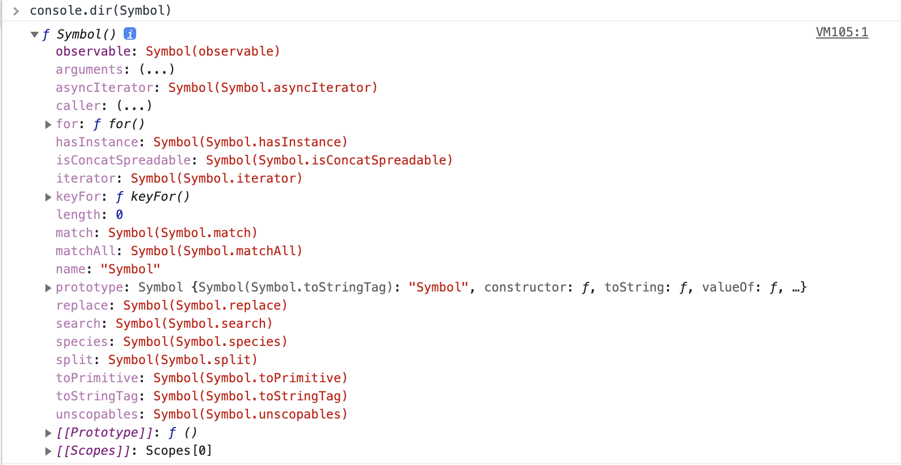

# 모던 자바스크립트 Deep Dive

## 목차

- [33장 Symbol](#33장-Symbol)
- [34장 이터러블](#34장-이터러블)
- [35장 스프레드 문법](#35장-스프레드-문법)
- [36장 디스트럭처링 할당](#36장-디스트럭처링-할당)

- <a href="https://github.com/junh0328/upgrade_javascript/blob/master/DEEPDIVE/readme6.md">다음 섹션으로</a>

## 33장 Symbol

### 33.1 심벌이란?

<p>심벌(Symbol)은 ES6에서 도입된 7번째 데이터 타입으로 변경 불가능한 원시 타입의 값이다. 심벌은 다른 값과 중복되지 않는 유일무이한 값이다. <b>주로 이름의 충돌 위험이 없는 유일한 프로퍼티 키를 만들기 위해 사용한다.</b> '10.3 프로퍼티'에서 살펴본 바와 같이 프로퍼티 키로 사용할 수 있는 값은 빈 문자열을 포함한 모든 문자열 또는 심벌 값이다.</p>

### 33.2 심벌 값의 생성

### Symbol 함수

<p>심벌 값은 Symbol 함수를 호출하여 생성한다. 생성자 함수가 아니기 때문에 new 연산자를 붙이지 않는다. 이때 생성된 심벌 값은 외부로 노출되지 않아 확인할 수 없으며, <b>다른 값과 절대 중복되지 않는 유일무이한 값이다.</b></p>

```js
// Symbol 함수를 호출하여 유일무이한 심벌 값을 생성한다.
const mySymbol = Symbol();
console.log(typeof mySymbol); // symbol

// 심벌 값은 외부로 노출되지 않아 확인할 수 없다.
console.log(mySymbol); // Symbol()
```

<p>new 연산자와 함께 생성자 함수 또는 클래스를 호출하면 객체가 생성되지만 심벌 값은 변경 불가능한 원시값이다.</p>

```js
new Symbol(); // TypeError: Symbol is not a constructor (심벌은 생성자 함수가 아닙니다)
```

<p>Symbol 함수에는 선택적으로 문자열을 인수(argument)로 전달할 수 있다. 이 문자열은 생성된 심벌 값에 대한 설명으로만 사용되며 심벌 값 생성에 어떠한 영향도 주지 않는다. 즉, 심벌 값에 대한 설명이 같더라도 생성된 심벌 값은 유일무이한 값이다.</p>

```js
// 심벌 값에 대한 설명이 같더라도 유일무이한 심벌 값을 생성한다.
const mySymbol1 = Symbol("mySymbol");
const mySymbol2 = Symbol("mySymbol");

console.log(mySymbol1 === mySymbol2); // false
```

<p>심벌 값도 문자열, 숫자, 불리언과 같이 객체처럼 접근하면 암묵적으로 래퍼 객체를 생성한다.</p>

```js
const mySymbol = Symbol("mySymbol");

// 심벌도 레퍼 객체를 생성한다
console.log(mySymbol.description); // mySymbol
console.log(mySymbol.toString()); // Symbol(mySymbol)
```

<p>불리언 타입을 제외한 나머지 타입으로는 암묵적 타입 변환이 되지 않는다</p>

```js
const mySymbol = Symbol();

// 불리언 타입으로는 암묵적으로 타입 변환된다.
console.log(!!mySymbol); // true

// if 문 등에서 존재 확인을 위해 사용할 수 있다.
if (mySymbol) console.log("mySymbol is not empty.");
```

### Symbol.for / Symbol.keyFor 메서드

<p>Symbol.for 메서드는 인수로 전달받은 문자열을 키로 사용하여 <b>키와 심벌 값의 쌍들이 저장되어 있는 전역 심벌 레지스트리(global symbol registry)에서 해당 키와 일치하는 심벌 값을 검색한다.</b></p>

- 검색에 성공하면 새로운 심벌 값을 생성하지 않고 검색된 심벌 값을 반환한다
- 검색에 실패하면 새로운 심벌 값을 생성하여 Symbol.for 메서드의 인수로 전달된 키로 전역 심벌 레지스트리에 저장한 후, 생성된 심벌 값을 반환한다.

<p>Symbol 함수는 호출될 때마다 유일무이한 심벌 값을 생성한다. 이때 자바스크립트 엔진이 관리하는 심벌 값 저장소인 <b>전역 심벌 레지스트리</b>에서 심벌 값을 검색할 수 있는 키를 지정할 수 없으므로 전역 심벌 레지스트리에 등록되어 관리되지 않는다. 하지만 Symbol.for 메서드를 사용하면 애플리케이션 전역에서 중복되지 않는 유일무이한 상수인 심벌 값을 단 하나만 생성하여 전역 심벌 레지스트리를 통해 공유할 수 있다.</p>

<p>Symbol.keyFor 메서드를 사용하면 전역 심벌 레지스트리에 저장된 심벌 값의 키를 추출할 수 있다.</p>

```js
// 전역 심벌 레지스트리에 mySymbol이라는 키로 저장된 심벌 값이 없으면 새로운 심벌 값을 생성
const s1 = Symbol.for("mySymbol");
// 전역 심벌 레지스트리에 저장된 심벌 값의 키를 추출
Symbol.keyFor(s1); // -> mySymbol

// Symbol 함수를 호출하여 생성한 심벌 값은 전역 심벌 레지스트리에 등록되어 관리되지 않는다.
const s2 = Symbol("foo");
// 전역 심벌 레지스트리에 저장된 심벌 값의 키를 추출
Symbol.keyFor(s2); // -> undefined
```

### 33.3 심벌과 상수

<p>에를 들어, 4방향 위, 아래, 왼쪽, 오른쪽을 나타내는 상수를 정의한다고 생각해 보자</p>

```js
// 위, 아래, 왼쪽, 오른쪽을 나타내는 상수를 정의한다.
// 이때 값 1, 2, 3, 4에는 특별한 의미가 없고 상수 이름에 의미가 있다.
const Direction = {
  UP: 1,
  DOWN: 2,
  LEFT: 3,
  RIGHT: 4,
};

// 변수에 상수를 할당
const myDirection = Direction.UP;

if (myDirection === Direction.UP) {
  console.log("You are going UP.");
}
```

<p>위 예제와 같이 '값'에는 특별한 의미가 없고 상수 이름 자체에 의미가 있는 경우가 있다. 이때 상수의 값 1, 2, 3, 4가 변경될 수 있으며, 다른 변수 값과 중복될 수 있기 때문에 이때 해당 값을 심벌 값을 사용하여 유일무이한 값으로 표현할 수 있다.</p>

```js
// 위, 아래, 왼쪽, 오른쪽을 나타내는 상수를 정의한다.
// 중복될 가능성이 없는 심벌 값으로 상수 값을 생성한다.
const Direction = {
  UP: Symbol("up"),
  DOWN: Symbol("down"),
  LEFT: Symbol("left"),
  RIGHT: Symbol("right"),
};

const myDirection = Direction.UP;

if (myDirection === Direction.UP) {
  console.log("You are going UP.");
}
```

### 33.4 심벌과 프로퍼티 키

<p>객체의 프로퍼티 키는 빈 문자열을 포함한 모든 문자열 또는 심벌 값으로 만들 수 있으며, 동적으로 생성할 수도 있다. 심벌 <b>값</b>을 프로퍼티 <b>키</b>로 사용하려면 심벌 값에 대괄호를 사용해야 한다. 프로퍼티에 접근할 때도 마찬가지로 대괄호를 사용해야 한다.</p>

```js
const obj = {
  // 심벌 값으로 프로퍼티 키를 생성
  [Symbol.for("mySymbol")]: 1,
};

obj[Symbol.for("mySymbol")]; // -> 1
```

<p>심벌 값은 유일무이한 값이므로 심벌 값으로 프로퍼티 키를 만들면 다른 프로퍼티 키와 절대 충돌하지 않는다.</p>

### 33.5 심벌과 프로퍼티 은닉

<p>심벌 값을 프로퍼티 키로 사용하여 생성한 프로퍼티는 <b>for...in 문이나 Object.keys, Object.getOwnPropertyNames 메서드로 찾을 수 없다.</b> 외부에 노출한 필요가 없는 프로퍼티를 은닉할 수 있다는 의미이다.</p>

```js
const obj = {
  // 심벌 값으로 프로퍼티 키를 생성
  [Symbol("mySymbol")]: 1,
};

for (const key in obj) {
  console.log(key); // 아무것도 출력되지 않는다.
}

console.log(Object.keys(obj)); // []
console.log(Object.getOwnPropertyNames(obj)); // []
```

<p>하지만 ES6에서 도입된 Object.getOwnPropertySymbols 메서드를 사용하면 심벌 값을 프로퍼티 키로 사용하여 생성한 프로퍼티를 찾을 수 있다.</p>

```js
const obj = {
  // 심벌 값으로 프로퍼티 키를 생성
  [Symbol("mySymbol")]: 1,
  Symbol: 2,
};

// getOwnPropertySymbols 메서드는 인수로 전달한 객체의 심벌 프로퍼티 키를 배열로 반환한다.
console.log(Object.getOwnPropertySymbols(obj)); // [Symbol(mySymbol)] 1

// getOwnPropertySymbols 메서드로 심벌 값도 찾을 수 있다.
const symbolKey1 = Object.getOwnPropertySymbols(obj)[0];
console.log(obj[symbolKey1]); // 1
```

### 33.7 Well-known Symbol

<p>자바스크립트가 기본 제공하는 빌트인 심벌 값이 있다. 빌트인 심벌 값은 Symbol 함수의 프로퍼티에 할당되어 있다. 브라우저 콘솔에서 Symbol 함수를 참조하여 보자</p>



<p>자바스크립트가 기본 제공하는 빌트인 심벌 값을 ECMAScript 사양에서는 <b>Well-knwon Symbol</b>이라 부른다. 해당 심볼은 자바스크립트 엔진의 내부 알고리즘에 사용된다.</p>

<p>예를 들어, for ...of 문으로 순회 가능한 빌트인 이터러블은 Wll-known Symbol인 Symbol.iterator를 키로 갖는 메서드를 가지며, Symbol.iterator 메서드를 호출하면 이터레이터를 반환하도록 ECMAScript 사양에 규정되어 있다. 빌트인 이터러블은 이 규정 즉, <b>이터레이션 프로토콜</b>을 준수한다. 만약 빌트인 이터러블이 아닌 일반 객체를 이터러블처럼 동작하도록 구현하고 싶다면 이터레이션 프로토콜을 따르면 된다.</p>

```js
// 1 ~ 5 범위의 정수로 이루어진 이터러블
const iterable = {
  // Symbol.iterator 메서드를 구현하여 이터러블 프로토콜을 준수
  [Symbol.iterator]() {
    let cur = 1;
    const max = 5;
    // Symbol.iterator 메서드는 next 메서드를 소유한 이터레이터를 반환
    return {
      next() {
        return { value: cur++, done: cur > max + 1 };
      },
    };
  },
};

for (const num of iterable) {
  console.log(num); // 1 2 3 4 5
}
```

<p>이처럼 심벌은 중복되지 않는 상수 값을 생성하는 것은 물론 기존에 작성된 코드에 영향을 주지 않고 새로운 프로퍼티를 추가하기 위해, 즉 하위 호환성을 보장하기 위해 도입되었다.</p>

## 34장 이터러블

### 34.1 이터레이션 프로토콜

<p>ES6에서 도입된 <b>이터레이션 프로토콜(iteration protocol)</b>은 순회 가능한(iterable) 데이터 컬렉션(자료구조)을 만들기 위해 ECMAScript 사양에 정의하여 미리 약속한 규칙이다. ES6 이전의 순회 가능한 데이터 컬렉션, 즉 ① 배열 ② 문자열 ③ 유사 배열 객체 ④ DOM 컬렉션 등은 통일된 규약 <b>없이</b> 각자 나름의 구조를 가지고 ① for 문 ② for ... in 문 ③ forEach 메서드 등 다양한 방법으로 순회할 수 있었다.</p>

<p>ES6에서는 순회 가능한 데이터 컬렉션(자료구조)을 이터레이션 프로토콜을 준수하는 이터러블로 통일하여 ① for...of 문, ② 스프레드 문법 ③ 배열 디스트럭처링 할당 의 대상으로 사용할 수 있도록 일원화했다.</p>

<p>이터레이션 프로토콜에는 이터러블 프로토콜과 이터레이터 프로토콜이 있다.</p>

### 이터러블 프로토콜 (iterable protocol)

<p>Well-known Symbol인 Symbol.iterator를 프로퍼티 키로 사용한 메서드를 직접 구현하거나 프로토타입 체인을 통해 상속 받은 Symbol.iterator 메서드를 호출하면 이터레이터 프로토콜을 준수한 이터레이터를 반환한다. 이러한 규약을 이터러블 프로토콜이라 하며, <b>이터러블 프로토콜을 준수한 객체를 이터러블이라 한다.</b> 이터러블은 for of 문으로 순회할 수 있으며 스프레드 문법과 배열 디스트럭처링 할당의 대상으로 사용할 수 있다.</p>

### 이터레이터 프로토콜 (iterator protocol)

<p>이터러블의 Symbol.iterator 메서드를 호출하면 이터레이터 프로토콜을 준수한 <b>이터레이터</b>를 반환한다. 이터레이터는 <b>next</b> 메서드를 소유하며 next 메서드를 호출하면 이터러블을 순회하며 value와 done 프로퍼티를 갖는 이터레이터 리절트(result) 객체를 반환한다. 이러한 규약을 이터레이터 프로토콜이라 하며, <b>이터레이터 프로토콜을 준수한 객체를 이터레이터</b>라 한다. 이터레리어튼 이터러블의 요소를 탐색하기 위한 <b>포인터 역할</b>을 한다.</p>

### 이터러블

<p>이터러블 프로토콜을 준수한 객체를 이터러블이라 한다. 즉, 이터러블은 <b>Symbol.iterator</b>를 프로퍼티 키로 사용한 메서드를 직접 구현하거나 프로토타입 체인을 통해 상속받은 객체를 말한다.</p>

```js
const isIterable = (v) =>
  v !== null && typeof v[Symbol.iterator] === "function";

// 배열, 문자열, Map, Set 등은 이터러블이다.
isIterable([]); // -> true
isIterable(""); // -> true
isIterable(new Map()); // -> true
isIterable(new Set()); // -> true
isIterable({}); // -> false
```

<p>예를 들어, 배열은 Array.prototype의 Symbol.iterator 메서드를 상속받은 이터러블이다. 이터러블은 for of 문으로 순회할 수 있으며, 스프레드 문법과 배열 디스트럭처링 할당의 대상으로 사용할 수 있다.</p>

```js
const array = [1, 2, 3];

// 배열은 Array.prototype의 Symbol.iterator 메서드를 상속받는 이터러블이다.
console.log(Symbol.iterator in array); // true

// 이터러블인 배열은 for...of 문으로 순회 가능하다.
for (const item of array) {
  console.log(item);
}

// 이터러블인 배열은 스프레드 문법의 대상으로 사용할 수 있다.
console.log([...array]); // [1, 2, 3]

// 이터러블인 배열은 배열 디스트럭처링 할당의 대상으로 사용할 수 있다.
const [a, ...rest] = array;
console.log(a, rest); // 1, [2, 3]
```

<p>Symbol.iterator 메서드를 직접 구현하지 않거나 상속받지 않은 일반 객체는 이터러블 프로토콜을 준수한 이터러블이 아니다. 따라서 일반 객체는 for of 문으로 순회할 수 없으며 스프레드 문법과 배열 디스트럭처링 할당의 대상으로 사용할 수 없다.</p>

```js
const obj = { a: 1, b: 2 };

// 일반 객체는 Symbol.iterator 메서드를 구현하거나 상속받지 않는다.
// 따라서 일반 객체는 이터러블 프로토콜을 준수한 이터러블이 아니다.
console.log(Symbol.iterator in obj); // false

// 이터러블이 아닌 일반 객체는 for...of 문으로 순회할 수 없다.
for (const item of obj) {
  // -> TypeError: obj is not iterable
  console.log(item);
}

// 이터러블이 아닌 일반 객체는 배열 디스트럭처링 할당의 대상으로 사용할 수 없다.
const [a, b] = obj; // -> TypeError: obj is not iterable
```

### 이터레이터

<p>이터러블의 Symbol.iterator 메서드를 호출하면 이터레이터 프로토콜을 준수한 이터레이터를 반환한다. 이터러블의 Symbol.iterator 메서드가 반환한 이터레이터는 next 메서드를 갖는다.</p>

```js
// 배열은 이터러블 프로토콜을 준수한 이터러블이다.
const array = [1, 2, 3];

// Symbol.iterator 메서드는 이터레이터를 반환한다.
const iterator = array[Symbol.iterator]();

// Symbol.iterator 메서드가 반환한 이터레이터는 next 메서드를 갖는다.
console.log("next" in iterator); // true
```

<p>이터레이터의 next 메서드는 이터러블의 각 요소를 순회하기 위한 포인터 역할을 한다. 즉 next 메서드를 호출하면 이터러블을 순차적으로 한 단계씩 순회하며 순회 결과를 나타내는 이터레이터 리절트 객체(iterator result object)를 반환한다.</p>

```js
// 배열은 이터러블 프로토콜을 준수한 이터러블이다.
const array = [1, 2, 3];

// Symbol.iterator 메서드는 이터레이터를 반환한다. 이터레이터는 next 메서드를 갖는다.
const iterator = array[Symbol.iterator]();

// next 메서드를 호출하면 이터러블을 순회하며 순회 결과를 나타내는 이터레이터 리절트 객체를
// 반환한다. 이터레이터 리절트 객체는 value와 done 프로퍼티를 갖는 객체다.
console.log(iterator.next()); // { value: 1, done: false }
console.log(iterator.next()); // { value: 2, done: false }
console.log(iterator.next()); // { value: 3, done: false }
console.log(iterator.next()); // { value: undefined, done: true }
```

### 34.2 빌트인 이터러블

<p>자바스크립트는 이터레이션 프로토콜을 준수한 객체인 빌트인 이터러블을 제공한다. 다음의 표준 빌트인 객체들은 빌트인 이터러블이다.</p>

| 빌트인 이터러블 | Symbol.iterator 메서드                    |
| :-------------- | :---------------------------------------- |
| Array           | Array.prototype[Symbol.iterator]          |
| String          | String.prototype[Symbol.iterator]         |
| Map             | Map.prototype[Symbol.iterator]            |
| Set             | Set.prototype[Symbol.iterator]            |
| TypedArray      | TypedArray.prototype[Symbol.iterator]     |
| arguments       | arguments.prototype[Symbol.iterator]      |
| DOM 컬렉션      | NodeList.prototype[Symbol.iterator]       |
| DOM 컬렉션      | HTMLCollection.prototype[Symbol.iterator] |

<br/>

### 34.3 for of 문

for of 문은 이터러블을 순회하면서 이터러블의 요소를 변수에 할당한다

```
for(변수선언문 of 이터러블){...}
```

for of 문은 for in 문의 형식과 매우 유사하다

```
for(변수선언문 in 객체){...}
```

<p>① for in 문은 객체의 프로토타입 체인 상에 존재하는 모든 프로토타입의 프로퍼티 중에서 프로퍼티 어트리뷰트의 값이 true인 프로퍼티를 순회하며 열거한다.</p>
<p>② for of 문은 내부적으로 이터레이터의 next 메서드를 호출하여 이터러블을 순회하며 next 메서드가 반환한 이터레이터 리절트 객체의 value 프로퍼티 값을 for of 문의 변수에 할당한다. 그리고 이터레이터 리절트 객체의 done 프로퍼티 값이 false이면 이터러블의 순회를 계속하고 true이면 이터러블의 순회를 중단한ㄷ.</p>

```js
for (const item of [1, 2, 3]) {
  // item 변수에 순차적으로 1, 2, 3이 할당된다.
  console.log(item); // 1 2 3
}
```

```js
// 이터러블
const iterable = [1, 2, 3];

// 이터러블의 Symbol.iterator 메서드를 호출하여 이터레이터를 생성한다.
const iterator = iterable[Symbol.iterator]();

for (;;) {
  // 이터레이터의 next 메서드를 호출하여 이터러블을 순회한다. 이때 next 메서드는 이터레이터 리절트 객체를 반환한다.
  const res = iterator.next();

  // next 메서드가 반환한 이터레이터 리절트 객체의 done 프로퍼티 값이 true이면 이터러블의 순회를 중단한다.
  if (res.done) break;

  // 이터레이터 리절트 객체의 value 프로퍼티 값을 item 변수에 할당한다.
  const item = res.value;
  console.log(item); // 1 2 3
}
```

### 34.4 이터러블과 유사 배열 객체

<p><b>유사 배열 객체는 마치 배열처럼 ① 인덱스로 프로퍼티 값에 접근할 수 있고 ② length 프로퍼티를 갖는 객체</b>를 말한다. 유사 배열 객체는 length 프로퍼티를 갖기 때문에 for 문으로 순회할 수 있고, 인덱스를 나타내는 수자 형식의 문자열 프로퍼티 키로 가지므로 마치 배열처럼 인덱스로 프로퍼티 값에 접근할 수 있다.</p>

```js
// 유사 배열 객체
const arrayLike = {
  0: 1,
  1: 2,
  2: 3,
  length: 3,
};

// 유사 배열 객체는 length 프로퍼티를 갖기 때문에 for 문으로 순회할 수 있다.
for (let i = 0; i < arrayLike.length; i++) {
  // 유사 배열 객체는 마치 배열처럼 인덱스로 프로퍼티 값에 접근할 수 있다.
  console.log(arrayLike[i]); // 1 2 3
}
```

<p><b>하지만 유사 배열 객체는 이터러블이 아닌 일반 객체이다.</b> 따라서 유사 배열 객체에는 Symbol.iterator 메서드가 없기 때문에 for of 문으로 순회할 수 없다.</p>

```js
const arrayLike = {
  0: 1,
  1: 2,
  2: 3,
  length: 3,
};

// 유사 배열 객체는 이터러블이 아니기 때문에 for...of 문으로 순회할 수 없다.
for (const item of arrayLike) {
  console.log(item); // 1 2 3
}
// -> TypeError: arrayLike is not iterable
```

<p>배열도 마찬가지로 ES6에서 이터러블이 도입되면서 Symbol.iterator 메서드를 구현하여 이터러블이 되었다. 유사 배열 객체는 이터러블로 나타내기 위해서는 ES6에서 도입된 Array.from 메서드를 사용하면 된다.</p>

```js
// 유사 배열 객체
const arrayLike = {
  0: 1,
  1: 2,
  2: 3,
  length: 3,
};

// Array.from은 유사 배열 객체 또는 이터러블을 배열로 변환한다
const arr = Array.from(arrayLike);
console.log(arr); // [1, 2, 3]
```

## 35장 스프레드 문법

<p>ES6에서 도입된 스프레드 문법(spread syntax = 전개 문법) ...은 <b>하나로 뭉쳐 있는 여러 값들의 집합을 펼쳐서(전개, 분산하여, spread) 개별적인 값들의 목록으로 만든다.</b></p>

### 한줄 요약

```js
let user = { name: "Mike" };
let info = { age: 30 };
let fe = ["js", "react"];
let lang = ["korean", "english"];

console.log("before user: ", user);

user = {
  ...user,
  ...info,
  skills: [...fe, ...lang],
};

console.log("after user: ", user);

/*
before user:  { name: 'Mike' }
after user:  {
  name: 'Mike',
  age: 30,
  skills: [ 'js', 'react', 'korean', 'english' ]
}
*/
```

<p>스프레드 문법을 사용할 수 있는 대상은</p>

```
① Array
② String
③ Map
④ Set
⑤ DOM 컬렉션
⑥ arguments와 같이 for of 문으로 순회할 수 있는 이터러블
```

<p>에 한정된다.</p>

```js
// ...[1, 2, 3]은 [1, 2, 3]을 개별 요소로 분리한다(→ 1, 2, 3)
console.log(...[1, 2, 3]); // 1 2 3

// 문자열은 이터러블이다.
console.log(..."Hello"); // H e l l o

/* 이터러블이 아닌 일반 객체는 스프레드 문법의 대상이 될 수 없다. */
console.log(...{ a: 1, b: 2 });
// TypeError: Found non-callable @@iterator
```

<p>위 예제에서 ...[1,2,3]은 이터러블인 배열을 펼처서 요소들을 개별적인 값들의 목록 1 2 3 으로 만든다. 이때 1 2 3은 값이 아니라 값들의 목록이다. <b>즉, 스프레드 문법의 결과는 값이 아니다. 이는 스프레드 문법 ...이 피연산자를 연산하여 값을 생성하는 연산자가 아님을 의미한다. 따라서 스프레드 문법의 결과는 변수에 할당할 수 없다.</b></p>

```js
// 스프레드 문법의 결과는 값이 아니다.
const list = ...[1, 2, 3]; // SyntaxError: Unexpected token ...
```

<p>이처럼 스프레드 문법의 결과물은 값으로 사용할 수 없고, 다음과 같이 쉼표로 구분한 값의 목록을 사용하는 문맥에서만 사용할 수 있다.</p>

- 함수 호출문의 인수 목록
- 배열 리터럴의 요소 목록
- 객체 리터럴의 프로퍼티 목록

### 35.1 함수 호출문의 인수 목록에서 사용하는 경우

<p>요소들의 집합인 배열을 펼쳐서 개별적인 값들의 목록으로 만든 후, 이를 함수의 인수 목록으로 전달해야 하는 경우가 있다. 다음 예제를 살펴보자.</p>

```js
const arr = [1, 2, 3];

// 배열 arr의 요소 중에서 최대값을 구하기 위해 Math.max를 사용한다.
const max = Math.max(arr); // -> NaN
```

Math.max 정적 메서드는 매개변수 개수를 확정할 수 없는 <b>가변 인자 함수다.</b> 다음과 같이 개수가 정해져 있지 않은 여러 개의 <b>숫자를 인수로 전달받아 인수 중에서 최대값을 반환</b>한다.

```js
Math.max(1); // -> 1
Math.max(1, 2); // -> 2
Math.max(1, 2, 3); // -> 3
Math.max(); // -> -Infinity
```

만약 Math.max 메서드에 <b>숫자가 아닌 배열을 인수로 전달하면 최대값을 구할 수 없으므로 NaN을 반환한다.</b>

```js
Math.max([1, 2, 3]); // -> NaN
```

스프레드 문법은 <b>하나로 뭉쳐 있는 여러 값들의 집합을 펼쳐서 개별적인 값들의 목록을 만들기 때문에</b> 위 문법을 사용하여 [1,2,3]을 펼쳐 나타낼 수 있다.

```js
const arr = [1, 2, 3];

// 스프레드 문법을 사용하여 배열 arr을 1, 2, 3으로 펼쳐서 Math.max에 전달한다.
// Math.max(...[1, 2, 3])은 Math.max(1, 2, 3)과 같다.
const max = Math.max(...arr); // -> 3
```

<p>스프레드 문법은 앞에서 살펴본 <b>Rest 파라미터</b>와 형태가 동일하여 혼동할 수 있으므로 주의할 필요가 있다.</p>

```
① Rest 파라미터 함수에 전달된 인수들의 목록을 배열로 전달받기 위해 매개변수 이름 앞에 ...을 붙이는 것이다
② 스프레드 문법은 여러 개의 값이 하나로 뭉쳐있는 배열과 같은 이터러블을 펼쳐서 개별적인 값들의 목록을 만드는 것이다

따라서 Rest 파라미터와 스프레드 문법은 서로 반대의 개념이다
```

```js
// ① Rest 파라미터는 인수들의 목록을 배열로 전달받는다.
function foo(...rest) {
  console.log(rest); // 1, 2, 3 -> [ 1, 2, 3 ]
}

// ② 스프레드 문법은 배열과 같은 이터러블을 펼쳐서 개별적인 값들의 목록을 만든다.
// [1, 2, 3] -> 1, 2, 3
foo(...[1, 2, 3]);
```

### 35.2 배열 리터럴 내부에서 사용하는 경우

<p>스프레드 문법을 배열 리터럴에 사용하면 ES5에서 사용하던 기존의 방식보다 더욱 간결하고 가독성 좋게 표현할 수 있다. ES5에서 사용하던 방식과 비교하여 살펴보도록 하자.</p>

### concat

ES5에서 2개의 배열을 1개의 배열로 결합하고 싶은 경우 배열 리터럴만으로 해결할 수 없고 concat 메서드를 사용해야 한다.

```js
// ES5
var arr = [1, 2].concat([3, 4]);
console.log(arr); // [1, 2, 3, 4]
```

스프레드 문법을 사용하면 별도의 메서드를 사용하지 않고 배열 리터럴만으로 2개의 배열을 1개의 배열로 결합할 수 있다.

```js
// ES6
const arr = [...[1, 2], ...[3, 4]];
console.log(arr); // [1, 2, 3, 4]
```

```js
const oneTwo = [1, 2];
const threeFour = [3, 4];

const arr = [...oneTwo, ...threeFour];
console.log(arr); // [1, 2, 3, 4]
```

### splice

<p>ES5에서 어떤 배열의 중간에 다른 배열의 요소들을 추가하거나 제거하려면 splice 메서드를 사용한다. 이때 splice 메서드의 세 번째 인수로 배열을 전달하면 배열 자체가 추가된다.</p>

```js
// ES5
var arr1 = [1, 4];
var arr2 = [2, 3];

// 세 번째 인수 arr2를 해체하여 전달해야 한다.
// 그렇지 않으면 arr1에 arr2 배열 자체가 추가된다.
arr1.splice(1, 0, arr2);

// 기대한 결과는 [1, [2, 3], 4]가 아니라 [1, 2, 3, 4]다.
console.log(arr1); // [1, [2, 3], 4]
```

스프레드 문법을 사용하여 간결하고 가독성 좋게 표현할 수 있다.

```js
// ES6
const arr1 = [1, 4];
const arr2 = [2, 3];

arr1.splice(1, 0, ...arr2);
console.log(arr1); // [1, 2, 3, 4]
```

### 배열 복사 (slice)

ES5에서 배열을 복사하려면 slice 메서드를 사용한다.

```js
// ES5
var origin = [1, 2];
var copy = origin.slice();

/* 객체의 참조에 의한 전달 (얕은 복사 개념) */
console.log(copy); // [1, 2]
console.log(copy === origin); // false
console.log(copy[0] === origin[0]); // true
```

스프레드 문법을 사용하려면 다음과 같이 더욱 간결하고 가독성 좋게 표현할 수 있다.

```js
// ES6
const origin = [1, 2];
const copy = [...origin];

console.log(copy); // [1, 2]
console.log(copy === origin); // false
```

### 35.3 객체 리터럴 내부에서 사용하는 경우

<p>Rest 프로퍼티와 함께 스프레드 프로퍼티를 사용하면 객체 리터럴의 프로퍼티 목록에서도 스프레드 문법을 사용할 수 있다. 스프레드 문법의 대상은 이터러블이어야 하지만 스프레드 프로퍼티 제안은 일반 객체를 대상으로도 스프레드 문법의 사용을 허락한다.</p>

```js
// 스프레드 프로퍼티
// 객체 복사(얕은 복사)
const obj = { x: 1, y: 2 };
const copy = { ...obj };
console.log(copy); // { x: 1, y: 2 }
console.log(obj === copy); // false

// 객체 병합
const merged = { x: 1, y: 2, ...{ a: 3, b: 4 } };
console.log(merged); // { x: 1, y: 2, a: 3, b: 4 }
```

스프레드 프로퍼티가 제안되기 이전에는 ES6에서 도입된 Object.assing 메서드를 사용하여 여러 개의 객체를 병합하거나 특정 프로퍼티를 변경 또는 추가했다.

```js
// 객체 병합. 프로퍼티가 중복되는 경우, 뒤에 위치한 프로퍼티가 우선권을 갖는다.
const merged = Object.assign({}, { x: 1, y: 2 }, { y: 10, z: 3 });
console.log(merged); // { x: 1, y: 10, z: 3 }

// 특정 프로퍼티 변경
const changed = Object.assign({}, { x: 1, y: 2 }, { y: 100 });
console.log(changed); // { x: 1, y: 100 }

// 프로퍼티 추가
const added = Object.assign({}, { x: 1, y: 2 }, { z: 0 });
console.log(added); // { x: 1, y: 2, z: 0 }
```

스프레드 프로퍼티는 Object.assign 메서드를 대체할 수 있는 간편한 문법이다.

```js
// 객체 병합. 프로퍼티가 중복되는 경우, 뒤에 위치한 프로퍼티가 우선권을 갖는다.
const merged = { ...{ x: 1, y: 2 }, ...{ y: 10, z: 3 } };
console.log(merged); // { x: 1, y: 10, z: 3 }

// 특정 프로퍼티 변경
const changed = { ...{ x: 1, y: 2 }, y: 100 };
// changed = { ...{ x: 1, y: 2 }, ...{ y: 100 } }
console.log(changed); // { x: 1, y: 100 }

// 프로퍼티 추가
const added = { ...{ x: 1, y: 2 }, z: 0 };
// added = { ...{ x: 1, y: 2 }, ...{ z: 0 } }
console.log(added); // { x: 1, y: 2, z: 0 }
```

## 36장 디스트럭처링 할당

<p>디스트럭처링 할당(destructuring assignment)은 구조 분해 할당이라고도 합니다. 구조화된 배열과 같은 이터러블 또는 객체를 destructuring(비구조화, 구조 파괴)하여 1개 이상의 변수에 개별적으로 할당하는 것을 말합니다. <b>배열과 같은 이터러블 또는 객체 리터럴에서 필요한 값만 추출하여 변수에 할당할 때 유용합니다.</b></p>

### 36.1 배열 디스트럭처링 할당

ES5에서 구조화된 배열을 디스트럭처링하여 1개 이상의 변수에 할당하는 방법은 다음과 같습니다.

```js
// ES5
var arr = [1, 2, 3];

var one = arr[0];
var two = arr[1];
var three = arr[2];

console.log(one, two, three); // 1 2 3
```

<p>ES6의 배열 구조 분해 할당은 배열의 각 요소를 배열로부터 추출하여 1개 이상의 변수에 할당합니다. 이때 <b>배열 디스트럭처링 할당의 대상(할당문의 우변)은 이터러블(순회 가능한 상태)여야 하며, 할당 기준은 배열의 인덱스가 됩니다.</b> 즉 순서대로 할당됩니다.</p>

```js
const arr = [1, 2, 3];

const [one, two, three] = arr;
/*
다음과 같습니다

const one = arr[0]
const two = arr[1]
const three = arr[2]

const [one, two, three] = [1,2,3]
*/

console.log(one, two, three); // 1 2 3
```

배열 디스트럭처링 할당을 위해서는 할당 연산자 왼쪽에 값을 할당받을 <b>변수를</b> 선언해야 한다. 이때 변수를 배열 리터럴 형태로 선언한다.

```js
const [one, two, three] = [1, 2, 3];
```

배열 디스트럭처링 할당의 기준은 배열의 인덱스입니다. 즉 <b>순서대로 할당됩니다.</b> 이때 변수의 개수와 이터러블의 요소 개수가 반드시 일치할 필요는 없습니다.

```js
const [a, b] = [1, 2];
console.log(a, b); // 1 2

const [c, d] = [1];
console.log(c, d); // 1 undefined 우변(이터러블)의 길이가 더 작을 경우 undefined 를 반환합니다

const [e, f] = [1, 2, 3];
console.log(e, f); // 1 2

const [g, , h] = [1, 2, 3];
/* 다음과 같이 변수를 지정할 수 있는 이유는 자바스크립트 배열의 특징인 희소 배열의 특징을 사용한 것입니다 */
console.log(g, h); // 1 3
```

물론 초기값 또한 설정할 수 있습니다 (하지만 초기값보다 할당된 값이 우선됩니다)

```js
// 기본값
const [a, b, c = 3] = [1, 2];
console.log(a, b, c); // 1 2 3

// 기본값보다 할당된 값이 우선한다.
const [e, f = 10, g = 3] = [1, 2];
console.log(e, f, g); // 1 2 3
```

배열 디스트럭처링 할당은 배열과 같은 이터러블에서 필요한 요소만 추출하여 변수에 할당하고 싶을 때 유용합니다.

```js
// url을 파싱하여 protocol, host, path 프로퍼티를 갖는 객체를 생성해 반환한다.
function parseURL(url = "") {
  // '://' 앞의 문자열(protocol)과 '/' 이전의 '/'으로 시작하지 않는 문자열(host)과 '/' 이후의 문자열(path)을 검색한다.
  const parsedURL = url.match(/^(\w+):\/\/([^/]+)\/(.*)$/);
  console.log(parsedURL);
  /*
  [
    'https://developer.mozilla.org/ko/docs/Web/JavaScript',
    'https',
    'developer.mozilla.org',
    'ko/docs/Web/JavaScript',
    index: 0,
    input: 'https://developer.mozilla.org/ko/docs/Web/JavaScript',
    groups: undefined
  ]
  */

  if (!parsedURL) return {};

  // 배열 디스트럭처링 할당을 사용하여 이터러블에서 필요한 요소만 추출한다.
  const [, protocol, host, path] = parsedURL;
  return { protocol, host, path };
}

const parsedURL = parseURL(
  "https://developer.mozilla.org/ko/docs/Web/JavaScript"
);
console.log(parsedURL);
/*
{
  protocol: 'https',
  host: 'developer.mozilla.org',
  path: 'ko/docs/Web/JavaScript'
}
*/
```

간단한 예제 만들어 보기

```js
const str = "hello-world-2021";

console.log(str.split("-"));

const [one, two, three] = str.split("-");

console.log(one);
console.log(two);
console.log(three);
```

배열 디스트럭처링 할당을 위한 변수에 Rest 요소 ... 을 사용할 수 있다. (Rest 요소는 반드시 마지막에 위치해야 한다)

```js
// Rest 요소
const [x, ...y] = [1, 2, 3];
console.log(x, y); // 1 [ 2, 3 ]
console.log(x, ...y); // 1 , 2, 3
```

### 36.2 객체 디스트럭처링 할당

ES5에서 객체의 각 프로퍼티를 객체로부터 디스트럭처링하여 변수에 할당하기 위해서는 <b>프로퍼티 키 {key: value}</b>를 사용해야 한다.

```js
// ES5
var user = { age: 25, name: "junhee" };

var age = user.age;
var name = user.name;

console.log(age, name); // 25 junhee
```

<p>ES6의 객체 디스트럭처링 할당은 객체의 각 프로퍼티를 객체로부터 추출하여 1개 이상의 변수에 할당한다. 이때 객체 디스트럭처링 할당의 대상은 <b>객체이어야 하며, 할당 기준은 프로퍼티 키다. (배열처럼 인덱스가 아니다)</b> 즉, 순서는 의미가 없으며 선언된 변수 이름과 프로퍼티가 일치하면 할당된다.</p>

```js
var user = { age: 25, name: "junhee" };

var { age, name } = user;

/*
var { age: age, name: name} = user 와 같은 의미 (프로퍼티 축약 표현)
*/

console.log(age, name); // 25 junhee
```

반드시 프로퍼티 키와 변수 이름이 같을 필요는 없다

```js
var user = { age: 25, name: "junhee" };

var { age: junheeAge, name: junheeName } = user;

/*
위 처럼 새롭게 이름을 지정한 경우 프로퍼티 키로 접근하면 에러가 발생한다
console.log(age, name); // ReferenceError: age is not defined
*/

console.log(junheeAge, junheeName); // 25 junhee
```

객체 디스트럭처링 할당을 위한 변수에 기본값을 설정할 수 있다 (하지만 넘겨받는 값이 우선이다)

```js
var user = { age: 25 };

var { age, name = "default" } = user;

console.log(age, name); // 25 default
```

객체 디스트럭처링 할당은 객체를 인수로 전달받는 함수의 매개변수에도 사용할 수 있다.

```js
function printTodo(todo) {
  console.log(
    `할일 ${todo.content}은 ${todo.completed ? "완료" : "비완료"} 상태입니다.`
  );
}

printTodo({ id: 1, content: "HTML", completed: true });
// 할일 HTML은 완료 상태입니다.
```

가독성을 좋게 표현한다면 함수의 파라미터에 구조 분해 할당을 사용하는 것이다.

```js
function printTodo({ content, completed }) {
  console.log(`할일 ${content}은 ${completed ? "완료" : "비완료"} 상태입니다.`);
}

printTodo({ id: 1, content: "HTML", completed: true });
// 할일 HTML은 완료 상태입니다.
```

중첩 객체의 경우는 다음과 같이 사용한다.

```js
const user = {
  name: "junhee",
  age: 25,
  address: {
    zipCode: 14063,
    city: "Anyang",
  },
};

const {
  address: { city },
} = user;

console.log(city); // Anyang
```
