# 모던 자바스크립트 Deep Dive

## 목차

- [38장 브라우저 렌더링 과정](#38장-브라우저-렌더링-과정)
- [39장 DOM](#39장-DOM)
- [40장 이벤트](#40장-이벤트)

## 38장 브라우저 렌더링 과정

> 파싱, 렌더링

```
HTML 파싱과 DOM 생성
CSS 파싱과 CSSOM 생성
렌더 트리 생성
자바스크립트 파싱과 실행
리플로우와 리페인트
```

<p>구글의 V8 자바스크립트 엔진으로 빌드된 자바스크립트 런타임 환경인 Node.js의 등장으로 자바스크립트는 웹 브라우저를 벗어나 서버 사이드 애플리케이션 개발에서도 사용할 수 있는 범용 개발 언어가 되었다. (하지만 자바스크립트가 가장 많이 사용되는 분야는 웹페이지/애플리케이션의 클라이언트 사이드이다)</p>

<p>대부분의 프로그래밍 언어는 운영체제(OS: Operationg System)나 가상 머신(VM: Virtual Machine) 위에서 실행되지만 <b>웹 어플리케이션의 클라이언트 사이드 자바스크립트는 브라우저에서 HTML, CSS와 함께 실행된다.</b></p>

<p>브라우저가 ① HTML ② CSS ③ 자바스크립트로 작성된 문서를 어떻게 파싱(해석)하여 브라우저에 렌더링 하는지 살펴보자</p>

### 파싱 (parsing)

<p><b>파싱(구문 분석)</b>은 프로그래밍 언어의 문법에 맞게 작성된 텍스트 문서를 읽어 들여 실행하기 위해 텍스트 문서의 문자열을 토큰 단위로 분해하고, 토큰의 문법적 의미와 구조를 반영하여 <b>트리 구조의 자료구조인 파스 트리</b>를 생성하는 일련의 과정을 말한다.</p>

### 렌더링 (rendering)

<P>렌더링은 HTML, CSS, JS로 작성된 문서를 파싱하여 <b>브라우저에 시각적으로 출력하는 것</b>을 말한다.</P>

브라우저는 다음과 같은 과정을 거쳐 렌더링을 수행한다

```
① 브라우저는 HTML, CSS, JS, 이미지, 폰트 파일 등 렌더링에 필요한 리소스(자료)를 요청하고 서버로부터 응답 받는다

② 브라우저의 렌더링 엔진은 서버로부터 응답된 HTML과 CSS를 파싱하여 DOM과 CSSOM을 생성하고 이를 결합하여 렌더 트리를 생성한다

③ 브라우저의 자바스크립트 엔진은 서버로부터 응답된 자바스크립트를 파싱하여 AST(Abstract Syntax Tree)를 생성하고
바이트 코드로 변환하여 실행한다. 이때 자바스크립트는 DOM API를 통해 DOM이나 CSSOM을 변경할 수 있다. 변경된 DOM과 CSSOM은
다시 렌더 트리로 결합된다

④ 렌더 트리를 기반으로 HTML 요소의 레이아웃(위치와 크기)를 계산하고 브라우저 화면에 HTML 요소를 페인팅한다
```

### 38.1 요청과 응답

> 리소스, DNS

<p>브라우저의 핵심 기능은 필요한 리소스를 서버에 요청(request)하고 서버로부터 응답(response)받아 브라우저에 시각적으로 <b>렌더링</b>하는 것이다. 즉, 렌더링에 필요한 리소스(HTML, CSS, JS, 이미지, 폰트, ...)는 모두 서버에 존재하므로 필요한 리소스를 서버에 요청하고 서버가 응답한 리소스를 파싱하여 렌더링하는 것이다. </p>

```
① 서버에 요청을 전송하기 위해 브라우저는 주소창을 제공한다
② 브라우저의 주소창에 URL을 입력하고 엔터키를 누르면 (https://naver.com)
③ URL의 호스트 이름(도메인)이 DNS를 통해 IP 주소로 변환되고 (https://159.29.1.47:8080)
④ 이 IP 주소를 갖는 서버에게 요청을 전송한다 GET https://159.29.1.47:8080/index.html
```

### 리소스

[리소스](https://developer.mozilla.org/ko/docs/Web/HTTP/Basics_of_HTTP/Identifying_resources_on_the_Web)

<p>
HTTP 요청 대상을 "리소스"라고 부르는데, 그에 대한 본질을 이 이상으로 정의할 수 없습니다. 그것은 문서, 사진 또는 다른 어떤 것이든 될 수 있습니다. 각 리소스는 리소스 식별을 위해 HTTP 전체에서 사용되는 Uniform Resource Identifier (URI)에 의해 식별됩니다.

웹에서 리소스에 대한 식별과 위치는 대부분 단일 URL(Uniform Resource Locator, URI의 한 종류)로 제공됩니다. 그러나 때로 식별과 위치가 동일한 URI로 제공되지 않는데에는 이유가 있습니다. 요청된 리소스에 대해 클라이언트가 다른 위치에서 접근하도록 해야 할 경우, HTTP는 특정 HTTP 헤더인 Alt-Svc (en-US)을 사용합니다.

</p>

### DNS

<p>
DNS (Domain Name System)는 인터넷에 연결된 리소스를 위한 계층적이고 분산된 명명 시스템입니다. DNS는 도메인 이름 목록 과 연결된 리소스(예: IP 주소)를 유지 관리 합니다.

DNS의 가장 두드러진 기능은 인간에게 친숙한 도메인 이름(예: mozilla.org)을 숫자 IP 주소 (예: 151.106.5.172)로 변환하는 것입니다. 도메인 이름을 적절한 IP 주소에 매핑하는 이 프로세스를 DNS 조회라고 합니다. 반대로 rDNS( 역 DNS 조회 )는 IP 주소와 연결된 도메인 이름을 확인하는 데 사용됩니다.</p>


<p>예를 들어, 브라우저의 주소창에 https://poiemaweb.com을 입력하고 엔터 키를 누르면 <b>루트 요청(/, 스킴과 호스트만으로 구성된 URI에 의한 요청)</b>이 poiemaweb.com 서버로 전송된다. <b>루트 요청에는 명확히 리소스를 요청하는 내용이 없지만 일반적으로 서버는 루트 요청에 대해 암묵적으로 index.html을 응답하도록 기본 설정되어 있다.</b></p>

<P>따라서 서버는 루트 요청에 대해 서버의 루트 폴더에 존재하는 정적 파일(사전에 구성한 파일) index.html을 클라이언트(브라우저)로 응답한다.</P>

### 38.2 HTTP 1.1과 HTTP 2.0

<p><b>HTTP (HyperText Transfer Protocol)</b>는 웹에서 브라우저와 서버가 통신하기 위한 프로토콜(규약)이다. HTML, URL과 함께 팀 버너스 리 경이 고안한 HTTP는 1991년 최초로 문서화되었고 그 후로 지속적인 업그레이드와 함께 발표되고 있다.</p>

<p>HTTP/1.1은 기본적으로 커넥션 당 하나의 요청과 응답만 처리한다. 즉, 여러 개의 요청을 한 번에 전송할 수 없고 응답 또한 마찬가지다. 따라서 HTML 문서 내에 포함된 여러 개의 리소스 요청, 즉 CSS 파일을 로드하는 link 태그, 이미지 파일을 로드하는 img 태그, 자바스크립트를 로드하는 script 태그 등에 의한 리소스 요청이 개별적으로 전송되고 응답 또한 개별적으로 전송된다. 이처럼 HTTP/1.1은 리소스의 동시 전송이 불가능한 구조이므로 요청할 리소스의 개수에 비례하여 응답 시간도 증가하는 단점이 있다.</p>


<p>HTTP/2는 커넥션당 여러 개의 요청과 응답, 즉 다중 요청/응답이 가능하다. 여러 리소스의 동시 전송이 가능하므로 HTTP/1.1에 비해 페이지 로드 속도가 약 50% 정도 빠르다고 알려져 있다.</p>


### 38.3 HTML 파싱과 DOM 생성

> DOM

<p>브라우저의 요청에 의해 응답한 HTML 문서는 <b>문자열로 이루어진 순수한 텍스트다.</b> 이러한 HTML 문서를 브라우저에서 시각적인 픽셀로 렌더링하려면 <b>html 문서를 브라우저가 이해할 수 있는 자료구조(객체)로 변환하여 메모리에 저장해야 한다.</b></p>

예를 들어, 다음과 같은 index.html이 서버로부터 응답되었다고 해보자

```html
<!DOCTYPE html>
<html>
  <head>
    <meta charset="UTF-8" />
    <link rel="stylesheet" href="style.css" />
  </head>
  <body>
    <ul>
      <li id="apple">Apple</li>
      <li id="banana">Banana</li>
      <li id="orange">Orange</li>
    </ul>
    <script src="app.js"></script>
  </body>
</html>
```

<b>브라우저의 렌더링 엔진은 다음 그림과 같은 과정을 통해 응답받은 HTML 문서를 파싱하여 브라우저가 이해할 수 있는 자료구조인 DOM(Document Object Model)을 생성한다.</b>

<details>


</details>

<p>① 서버에 존재하던 HTML 파일이 브라우저의 요청에 의해 응답된다. 이때 서버는 브라우저가 요청한 HTML 파일을 읽어 들여 메모리에 저장한 다음 메모리에 저장된 바이트(2진수)를 인터넷을 경유하여 응답한다</p>

<P>② 브라우저는 서버가 응답한 HTML 문서를 <b>바이트(2진수) 형태로</b> 응답받는다. 그리고 응답된 바이트 형태의 HTML 문서는 meta 태그의 charset 어트리뷰트에 의해 지정된 인코딩 방식(여기서는 UTF-8)을 기준으로 문자열로 변환된다. 브라우저는 이를 확인하고 문자열로 변환한다.</P>

<P>③ 문자열로 변환된 HTML 문서를 읽어 들여 문법적 의미를 갖는 코드의 최소 단위인 토큰(token)들로 분해한다.</P>

<P>④ 각 토큰들을 객체로 변환하여 노드들을 생성한다. 토큰의 내용에 따라 <b>⑴ 문서 노드 ⑵ 요소 노드 ⑶ 어트리뷰트 노드 ⑷ 텍스트 노드</b>가 생성된다. 노드는 이후 DOM을 구성하는 기본 요소가 된다.</P>

<P>⑤ HTML 문서는 HTML 요소들의 집합으로 이루어지며 HTML 요소는 중첩 관계를 갖는다. 즉, HTML 요소의 콘텐츠 영역(시작 태그와 종료 태그 사이)에는 텍스트뿐만 아니라 다른 HTML 요소도 포함될 수 있다. 이때 <b>HTML 요소 간에는 중첩 관계에 의해 부자(부모자식)관계가 형성된다. 이러한 HTML 요소 간의 부자 관계를 반영하여 모든 노드들을 트리 자료구조로 구성한다.</b> 이 노드들로 구성된 트리 자료구조를 DOM이라 부른다.</P>

> 즉, DOM은 HTML 문서를 파싱한 결과물이다

### 38.4 CSS 파싱과 CSSOM 생성

> CSSOM

<p>브라우저의 렌더링 엔진은 HTML을 <b>처음부터 한 줄 씩 순차적으로 파싱하여 DOM을 생성해 나간다.</b> 이처럼 렌더링 엔진은 DOM을 생성해 나가다 CSS를 로드하는 link 태그나 style 태그를 만나면 <b>DOM 생성을 일시 중단한다.</b> 그리고 link 태그의 href 어트리뷰트(속성)에 지정된 CSS 파일을 서버에 요청하여 로드한 CSS 파일이나 style 태그 내의 CSS를 HTML과 동일한 파싱 과정(바이트 > 문자 > 토큰 > 노드 > CSSOM)을 거치며 해석하여 CSSOM(CSS Object Model)을 생성한다. 이후 CSS 파싱이 완료되면 HTML 파싱이 중단된 지점부터 다시 HTML을 파싱하기 시작하여 DOM을 생성한다.</p>

```html
<!DOCTYPE html>
<html>
  <head>
    <meta charset="UTF-8" />
    <link rel="stylesheet" href="style.css" />
    ...
  </head>
</html>
```

href 어트리뷰트에 의해 style.css 파일이 서버로부터 응답이 완료되었다고 가정해보자

```css
body {
  font-size: 18px;
}

ul {
  list-style-type: none;
}
```

<p>서버로부터 CSS파일이 응답되면 렌더링 엔진은 HTML과 동일한 해석 과정(바이트 > 문자 >토큰 > 노드 > CSSOM)을 거쳐 CSS를 파싱하여 CSSOM을 생성한다. CSSOM은 CSS의 상속을 반영하여 생성된다. 최상위 부모 태그로부터 파생되는 구조일 경우, 최하위 자녀는 모든 style을 상속 받는다.</p>


### 38.5 렌더 트리 생성

> 렌더 트리

<p>렌더링 엔진은 서버로부터 응답된 HTML과 CSS를 파싱하여 각각 DOM과 CSSOM를 생성한다. 그리고 ① DOM과 ② CSSOM은 렌더링을 위해 <b>렌더 트리(render tree)</b>로 결합된다.</p>

<p><b>렌더 트리는 렌더링을 위한 트리 구조의 자료구조다.</b> 따라서 브라우저 화면에 렌더링되지 않는 노드(예: meta 태그, script 태그 등)와 CSS에 의해 비표시(display:none)되는 노드들은 포함되지 않는다. 다시 말해 <b>렌더 트리는 브라우저 화면에 렌더링되는 노드만으로 구성된다.</b></p>

<details>
<summary>렌더 트리 구조 보기</summary>


</details>

이후 완성된 렌더 트리는 각 HTML 요소의 레이아웃(위치와 크기)을 계산하는 데 사용되며 <b>브라우저 화면에 픽셀을 렌더링하는 페인팅(painting)처리에 입력된다.</b>


지금까지 살펴본 브라우저의 렌더링 과정은 반복해서 실행될 수 있다. 예를 들어, 다음과 같은 경우 반복해서 레이아웃 계산과 페인팅이 재차 실행된다.

- 자바스크립트에 의한 노드 추가 또는 삭제
- 브라우저 창의 리사이징에 의한 뷰포트(viewport) 크기 변경
- HTML 요소의 레이아웃(위치,크기)에 변경을 발생시키는 width/height, margin, padding, border, display, position 등의 스타일 변경

레이아웃 계산과 페인팅을 다시 실행하는 리렌더링은 <b>비용이 많이 드는, 성능에 악영향을 주는 작업이다. 최대한 빈번하게 발생하지 않도록 주의할 필요가 있다.</b>

### 38.6 자바스크립트 파싱과 실행

> 렌더링 엔진, 자바스크립트 엔진, AST (추상적 구문 트리)

<p><b>HTML 문서를 파싱한 결과물로서 생성된 DOM</b>은 HTML 문서의 구조와 정보뿐만 아니라 HTML 요소와 스타일 등을 변경할 수 있는 프로그래밍 인터페이스로서 <b>DOM API</b>를 제공한다. 즉, 자바스크립트 코드에서 DOM API를 사용하면 이미 생성된 DOM을 동적으로 조작할 수 있다.</p>

<p>CSS 파싱 과정과 마찬가지로 <b>① 렌더링 엔진</b>은 HTML을 한 줄씩 순차적으로 파싱하며 DOM을 생성해 나가다가 자바스크립트 파일을 로드하는 &lt;script&gt; 태그나 자바스크립트 코드를 콘텐츠로 담은 &lt;script&gt; 태그를 만나면 DOM 생성을 일시 중단한다.</p>

<p>그리고 &lt;script&gt; 태그의 src 어트리뷰트에 정의된 자바스크립트 파일을 서버에 요청하여 로드한 자바스크립트 파일이나 &lt;script&gt; 태그 내의 자바스크립트 코드를 파싱하기 위해 <b>② 자바스크립트 엔진에</b> 제어권을 넘긴다. 이후 자바스크립트 파싱과 실행이 종료되면 <b>① 렌더링 엔진</b>으로 다시 제어권을 넘겨 HTML 파싱이 중단된 지점부터 다시 HTML 파싱을 시작하여 DOM 생성을 재개한다.</p>

<p>자바스크립트 파싱과 실행은 <b>① 브라우저 렌더링 엔진이 아닌 ② 자바스크립트 엔진</b>이 처리한다. <b>② 자바스크립트 엔진은 자바스크립트 코드를 파싱하여 CPU가 이해할 수 있는 저수준 언어(low-level language)로 변환하고 실행하는 역할을 한다.</b></p>

<p><b>① 렌더링 엔진</b>으로부터 제어권을 넘겨받은 <b>② 자바스크립트 엔진</b>은 자바스크립트 코드를 파싱하기 시작한다. 렌더링 엔진이 HTML과 CSS를 파싱하여 DOM과 CSSOM을 생성하듯이 <b>② 자바스크립트 엔진</b>은 자바스크립트를 해석하여 <b>AST(Abstract Syntax Tree: 추상적 구문 트리)</b>를 생성한다. 그리고 AST를 기반으로 인터프리터가 실행할 수 있는 중간 코드(intermediate code)인 바이트코드를 생성하여 실행한다.</p>

### 38.7 리플로우와 리페인트

<p>만약 자바스크립트 코드에 DOM이나 CSSOM을 변경하는 <b>DOM API</b>가 사용된 경우 DOM이나 CSSOM이 변경된다. 이때 변경된 DOM과 CSSOM은 다시 렌더 트리로 결합되고 변경된 렌더 트리를 기반으로 <b>레이아웃과 페인트 과정을 거쳐 브라우저의 화면에 다시 렌더링한다. 이를 리플로우(reflow), 리페인트(repaint)</b>라 한다.</p>


### 리플로우

```
리플로우는 레이아웃 계산을 다시 하는 것을 말하며, 노드 추가/삭제, 요소의 크기/위치 변경, 윈도우 리사이징 등
레이아웃에 영향을 주는 변경이 발생한 경우에 한하여 실행된다
```

### 리페인트

```
리페인트는 재결합된 렌더 트리를 기반으로 다시 페인트를 하는 것을 말한다
```

### 38.9 script 태그의 async/defer 어트리뷰트

다음 경우를 생각해 보자

```html
<!DOCTYPE html>
<html>
  <head>
    <meta charset="UTF-8" />
    <link rel="stylesheet" href="style.css" />
    <script>
      const $apple = document.getElementById("apple");
      $apple.style.color = "red";
    </script>
  </head>
  <body>
    <ul>
      <li id="apple">Apple</li>
      <li id="banana">Banana</li>
      <li id="orange">Orange</li>
    </ul>
  </body>
</html>
```

<p>자바스크립트 엔진은 위에서부터 아래로 차례대로 코드를 실행한다. &lt;script&gt; 태그가 body 태그보다 위에 생성되어 있는데, 해당 스크립트 내부의 코드를 보면 바디 태그에 포함된 요소인 apple을 동적으로 스타일링을 추가하는 코드이다. 위 코드는 에러가 발생할 것이다. <b> (DOM API인 document.getElementById는 DOM에서 id가 'apple'인 HTML 요소를 취득한다. 아래 DOM API가 실행되는 시점에는 아직 id가 'apple'인 HTML 요소를 파싱하지 않았기 때문에 DOM에는 id가 'apple'인 HTML 요소가 포함되어 있지 않다. 따라서 아래 코드는 정상적으로 id가 'apple'인 HTML 요소를 취득하지 못한다.)</b></p>

<p>이렇게 동기적으로 코드를 실행하는 자바스크립트에서 이러한 근본적인 문제를 해결하기 위해 &lt;script&gt; 태그에 <b>① async ② defer</b> 어트리뷰트가 추가되었다.</p>

<p><b>① async ② defer</b> 어트리뷰트는 다음과 같이 <b>src</b> 어트리뷰트를 통해 외부 자바스크립트 파일을 로드하는 경우에만 사용할 수 있다. 위 코드처럼 &lt;script&gt; 태그 내부에 코드를 작성하는 경우에는 사용할 수 없다.</p>

### async 어트리뷰트

<p>HTML 파싱과 외부 자바스크립트 파일의 로드가 비동기적으로 동시에 진행된다. <b>단, 자바스크립트의 파싱과 실행은 자바스크립트의 파일의 로드가 완료된 직후 진행되며, 이때 HTML 파싱은 중단된다.</b></p>


<p>여러 개의 script 태그에 async 어트리뷰트를 지정하면 script 태그의 순서와는 상관없이 로드가 완료된 자바스크립트부터 먼저 실행되므로 순서가 보장되지 않는다.</p>

### defer 어트리뷰트

<p>async 어트리뷰트와 마찬가지로 HTML 파싱과 외부 자바스크립트 파일의 로드가 비동기적으로 동시에 진행된다. 단, <b>자바스크립트의 파싱과 실행은 HTML 파싱이 완료된 직후, 즉 DOM 생성이 완료된 직후 진행된다.</b> 따라서 DOM 생성이 완료된 이후 실행되어야 할 자바스크립트에 유용하다.</p>


## 39장 DOM

```
39.1 노드
39.2 요소 노드 취득
39.3 노드 탐색
39.4 노드 정보 취득
39.5 요소 노드의 텍스트 조작
39.6 DOM 조작
39.7 어트리뷰트
39.8 스타일
```

```
DOM은 Documnet Object Model의 약어로, HTML 파일을 파싱하여 트리구조로 나타낸 자료구조입니다
추가적으로 문서의 계층적 구조와 정보를 표현하여 이를 제어할 수 있는 API, DOM API를 제공합니다

이전부터 공부해왔던 내용이기 때문에, 각 단어의 뜻과 기존의 개념에서 헷갈렸던 부분을 위주로 정리하겠습니다
```

<p>브라우저의 렌더링 엔진은 HTML 문서를 파싱하여 브라우저가 이해할 수 있는 자료구조인 DOM을 생성한다.<b>DOM은 HTML 문서의 계층적 구조와 정보를 표현하며 이를 제어할 수 있는 API, 즉 프로퍼티와 메서드를 제공하는 트리 자료구조다.</b></p>

### 39.1 노드

### 39.1.1 HTML 요소와 노드 객체

HTML 요소는 HTML 문서를 구성하는 개별적인 요소를 의미한다.

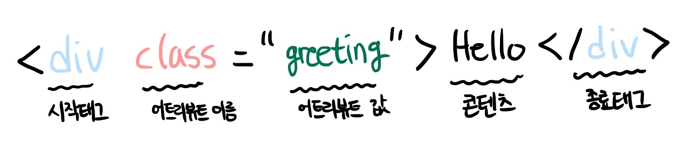

<p><b>① HTML 요소</b>는 렌더링 엔진에 의해 파싱되어 <b>② DOM을 구성하는 요소 노드 객체로 변환된다.</b> 이때 HTML 요소 어트리뷰트는 어트리뷰트 노드로, HTML 요소의 텍스트 콘텐츠는 텍스트 노드로 변환된다.</p>

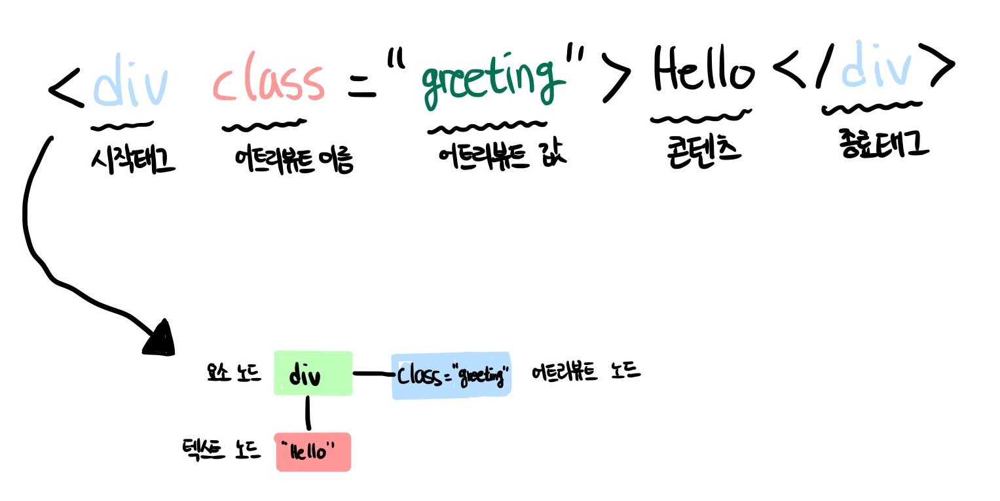

<p>HTML 문서는 HTML 요소들의 집합으로 이뤄지며, HTML 요소는 중첩 관계를 갖는다. 이 중첩 관계에 의해 계층적인 부자(parent-child)관계가 형성된다. 이러한 HTML 요소 간의 부자 관계를 반영하여 HTML 문서의 구성 요소인 HTML요소를 개체화한 모든 노드 객체들을 <b>트리 자료 구조</b>로 구성한다.</p>

### 39.1.2 노드 객체의 타입

예를 들어, 다음 HTML 문서를 렌더링 엔진이 파싱한다고 생각해보자.

> 바이트 > 문자 > 토큰 > 노드 > DOM

```html
<!DOCTYPE html>
<html>
  <head>
    <meta charset="UTF-8" />
    <link rel="stylesheet" href="style.css" />
  </head>
  <body>
    <ul>
      <li id="apple">Apple</li>
      <li id="banana">Banana</li>
      <li id="orange">Orange</li>
    </ul>
    <script src="app.js"></script>
  </body>
</html>
```

렌더링 엔진은 위 HTML 문서를 파싱하여 다음과 같이 DOM을 생성한다.

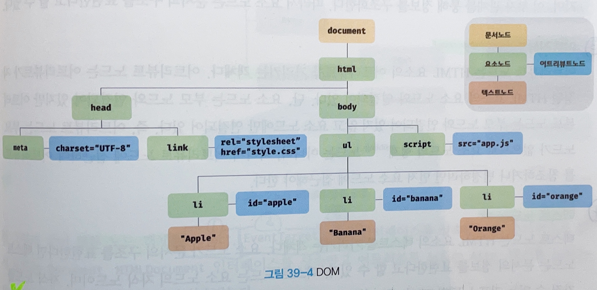

이처럼 DOM은 노드 객체의 계층적인 구조로 구성된다. 노드 객체는 종류가 있고 상속 구조를 갖는다. 노드 객체는 총 12개의 종류(노드 타입)가 있다. 이 중에서 중요한 노드 타입은 다음과 같이 4가지다.

### 문서 노드 (document node)

```
<!DOCTYPE>
```

<p>문서 노드는 <b>DOM 트리의 최상위에 존재하는 루트 노드로서 document 객체를 가리킨다.</b> document 객체는 브라우저가 렌더링한 HTML 문서 전체를 가리키는 객체로서 전역 객체 window의 document 프로퍼티에 바인딩되어 있다. 따라서 문서 노드는 window.documnet 또는 document로 참조할 수 있다.</p>

<p>브라우저 환경의 모든 자바스크립트 코드는 script 태그에 의해 분리되어 있어도 하나의 전역 객체 window를 공유한다. 따라서 window의 document 프로퍼티에 바인딩되어 있는 하나의 document 객체를 바라본다. <b>즉, HTML 문서당 document 객체는 유일하다.</b></p>

### 요소 노드 (element node)

```
<html> <head> <meta> <link> <body> <ul> <li> <script>
```

<p>요소 노드는 HTML 요소를 가리키는 객체다. 요소 노드는 HTML 요소 간의 중첩에 의해 부자 관계를 가지며, 이 부자 관계를 통해 정보를 구조화한다. 따라서 요소 노드는 문서의 구조를 표현한다고 할 수 있다.</p>

### 어트리뷰트 노드 (attribute node)

```
charset="UTF"

rel="stylesheet"
...

id="apple"
```

<p>어트리뷰트 노드는 HTML 요소의 어트리뷰트를 가리키는 객체다. 어트리뷰트 노드는 어트리뷰트가 지정된 HTML 요소의 요소 노드와 연결되어 있다. 단, 요소 노드는 부모 노드와 연결되어 있지만 어트리뷰트 노드는 부모 노드와 연결되어 있지 않고 요소 노드에만 연결되어 있기 때문에 어트리뷰트를 참조하거나 변경하려면 먼저 요소 노드에 접근해야 한다.</p>

### 텍스트 노드 (text node)

```
APPLE
BANANA
ORANGE
```

<p>텍스트 노드는 HTML 요소와 텍스트를 가리키는 객체다. 요소 노드가 문서의 구조를 표현한다면 텍스트 노드는 문서의 정보를 표현한다고 할 수 있다.</p>

### 39.1.3 노드 객체의 상속 구조

<p>DOM은 HTML 문서의 계층적 구조와 정보를 표현하며, 이를 제어할 수 있는 API (DOM API)를 제공하는 트리 자료구조이다. DOM을 구성하는 노드 객체는 ECMAScript 사양에 정의된 <b>표준 빌트인 객체(standard built-in objects)</b>가 아니라 브라우저 환경에서 추가적으로 제공하는 <b>호스트 객체(host objects)</b>다. 하지만 노드 객체도 자바스크립트 객체이므로 프로토타입에 의한 상속 구조를 갖는다. 노드 객체의 상속 구조는 다음과 같다.</p>

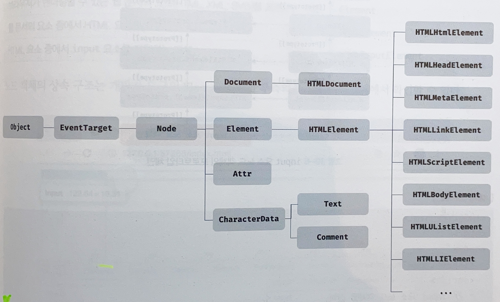

<p>위 그림과 같이 <b>모든 노드 객체는 ① Object ② EventTarget ③ Node 인터페이스를 상속받는다.</b> 예를 들어 input 요소를 파싱하여 객체화한 input 요소 노드 객체는 HTMLInputElement > HTMLElement > Element > Node > EventTarget > Object의 prototype에 바인딩되어 있는 프로토타입 객체를 상속받는다. 즉 input 요소 노드 객체는 프로토타입 체인에 있는 모든 프로토타입의 프로퍼티나 메서드를 상속받아 사용할 수 있다.</p>

<p>배열이 객체인 동시에 배열인 것처럼 input 요소 노드 객체도 다음과 같이 다양한 특성을 갖는 객체이며, 이러한 특성을 나타내는 기능들을 상속을 통해 제공받는다.</p>

| input 요소 노드 객체의 특성                                                | 프로토타입을 제공하는 객체 |
| :------------------------------------------------------------------------- | :------------------------- |
| 객체                                                                       | Object                     |
| 이벤트를 발생시키는 객체                                                   | EventTarget                |
| 트리 자료구조의 노드 객체                                                  | Node                       |
| 브라우저가 렌더링할 수 있는 웹 문서의 요소(HTML, XML, SVG)를 표현하는 객체 | Element                    |
| 웹 문서의 요소 중에서 HTML 요소를 표현하는 객체                            | HTMLElement                |
| HTML 요소 중에서 input 요소를 표현하는 객체                                | HTMLInputElement           |

### 39.2 요소 노드 취득

<p>HTML의 구조나 내용 또는 스타일 등을 동적으로 조작하려면 먼저 요소 노드를 취득해야 한다. 텍스트 노드는 요소 노드의 자식 노드이고, 어트리뷰트 노드는 요소 노드와 연결되어 있기 때문에 텍스트 노드나 어트리뷰트 노드를 조작하고자 할 때도 마찬가지다.</p>

<p>DOM은 요소 노드를 취득할 수 있는 다양한 메서드를 제공한다.</p>

### id를 이용한 요소 노드 취득

```
Document.prototype.getElementById
```

### 태그 이름을 이용한 요소 노드 취득

```
Document.prototype.getElementsByTagName
Element.prototype.getElementsByTagName
```

```
document.getElementsByTagName('li') (o)
$fruits..getElementsByTagName('li') (o)
```

### class를 이용한 요소 노드 취득

```
Document.prototype.getElementsByClassName
Element.prototype.getElementsByClassName
```

### CSS 선택자를 이용한 요소 노드 취득

CSS 선택자는 스타일을 적용하고자 하는 HTML 요소를 특정할 때 사용하는 문법이다.

```
Document.prototype.querySelector
Element.prototype.querySelector
```

```css
/* 전체 선택자: 📍모든 요소를 선택 */
* {
  ...;
}
/* 태그 선택자: 모든 p 태그 요소를 📍모두 선택 */
p {
  ...;
}
/* id 선택자: id 값이 'foo'인 요소를 📍모두 선택 */
#foo {
  ...;
}
/* class 선택자: class 값이 'foo'인 요소를 📍모두 선택 */
.foo {
  ...;
}
/* 어트리뷰트 선택자: input 요소 중에 type 어트리뷰트 값이 'text'인 요소를 📍모두 선택 */
input[type="text"] {
  ...;
}
/* 후손 선택자: div 요소의 후손 요소 중 p 요소를 📍모두 선택 */
div p {
  ...;
}
/* 자식 선택자: div 요소의 자식 요소 중 p 요소를 📍모두 선택 */
div > p {
  ...;
}
/* 인접 형제 선택자: p 요소의 형제 요소 중에 p 요소 📍바로 뒤에 위치하는 ul 요소를 선택 */
p + ul {
  ...;
}
/* 일반 형제 선택자: p 요소의 형제 요소 중에 p 요소 뒤에 위치하는 ul 요소를 📍모두 선택 */
p ~ ul {
  ...;
}
/* 가상 클래스 선택자: hover 상태인 a 요소를 📍모두 선택 */
a:hover {
  ...;
}
/* 가상 요소 선택자: p 요소의 콘텐츠의 앞에 위치하는 공간을 선택 일반적으로 content 프로퍼티와 함께 사용된다. */
p::before {
  ...;
}

/* 부모 선택자: 이 코드에서는 중첩된 바로 위의 부모 선택자인 a를 참조한다 */
a {
  color: blue;
  &:hover {
    color: green;
  }
}

/* 컴파일 시 다음과 같이 실행된다 */

a {
  color: blue;
}
a:hover {
  color: green;
}
```

HTML 문서의 모든 요소 노드를 취득하려면 querySelectorAll 메서드의 인수로 전체 선택자 '\*'를 전달한다

```js
// 모든 요소 노드를 탐색하여 반환한다.
const $all = document.querySelectorAll("*");
// -> NodeList(8) [html, head, body, ul, li#apple, li#banana, li#orange, script]
```

### 39.3 노드 탐색

<p>요소 노드를 취득한 다음, 취득한 요소 노드를 기점으로 DOM 트리의 노드를 옮겨 다니며 <b>① 부모, ② 형제, ③ 자식 노드</b> 등을 탐색해야 할 때가 있다.</p>

```html
<ul id="fruits">
  <li class="apple">Apple</li>
  <li class="banana">Banana</li>
  <li class="orange">Orange</li>
</ul>
```

DOM 트리 상의 노드를 탐색할 수 있도록 Node, Element 인터페이스는 트리 탐색 프로퍼티를 제공한다.

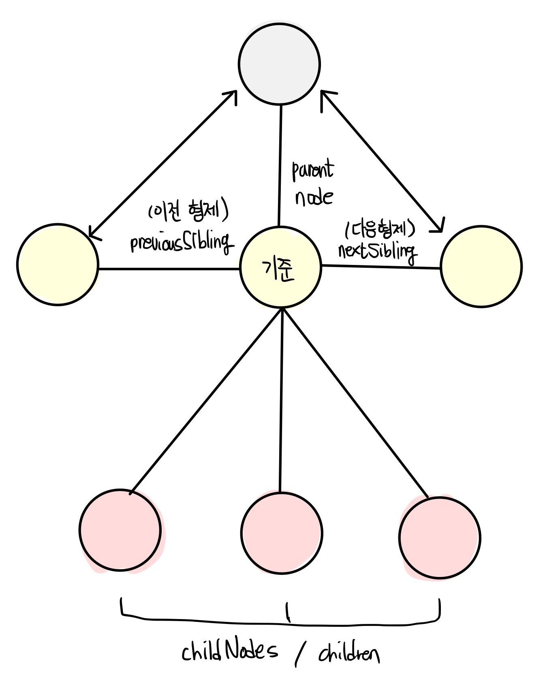

Node.prototype에 의해

```
① parentNode (부모 노드)
② previousSibling (이전 형제 노드)
③ firstChild (자식 노드 중 첫 번째)
④ childNodes (자식 노드 전부)
```

프로퍼티가 제공된다.

Element.prototype에 의해

```
① previousElementSibling (이전 형제 노드의 요소)
② nextElementSibling (다음 형제 노드의 요소)
③ children (자식 요소)
```

프로퍼티가 제공된다

<p>노드 탐색 프로퍼티는 모두 접근자 프로퍼티다. <b>단, 노드 탐색 프로퍼티는 참조만 가능한 읽기 전용 접근자 프로퍼티다.</b> 읽기 전용 접근자 프로퍼티에 값을 할당하면 아무런 에러 없이 무시된다</p>

### 자식 노드 탐색

자식 노드를 탐색하기 위해서는 다음과 같은 노드 탐색 프로퍼티를 사용한다.

| 프로퍼티                            | 설명                                                                                                      |
| :---------------------------------- | :-------------------------------------------------------------------------------------------------------- |
| Node.prototype.childNodes           | 자식 노드를 모두 탐색하여 NodeList에 담아 반환한다. 요소 노드뿐만 아니라 텍스트 노드도 포함될 수 있다.    |
| Element.prototype.children          | 자식 노드 중에서 요소 노두만 모두 탐색하여 HTMLCollection에 담아 반환한다. 텍스트 노드가 포함되지 않는다. |
| Node.prototype.firstChild           | 첫 번째 자식 노드를 반환한다. 텍스트 노드이거나 요소 노드를 반환한다.                                     |
| Node.prototype.lastChild            | 마지막 자식 노드를 반환한다. 텍스트 노드이거나 요소 노드를 반환한다.                                      |
| Element.prototype.firstElementChild | 첫 번째 자식 요소 노드를 반환한다. 요소 노드를 반환한다.                                                  |
| Element.prototype.lastElementChild  | 마지막 자식 요소 노드를 반환한다. 요소 노드를 반환한다.                                                   |

### 자식 노드 확인

```
Node.prototype.hasChildNodes >> (boolean)
```

```html
<!DOCTYPE html>
<html>
  <body>
    <ul id="fruits">
      <li class="apple">Apple</li>
      <li class="banana">Banana</li>
      <li class="orange">Orange</li>
    </ul>
  </body>
  <script>
    // 노드 탐색의 기점이 되는 #fruits 요소 노드를 취득한다.
    const $fruits = document.getElementById("fruits");

    // #fruits 요소의 모든 자식 노드를 탐색한다.
    // childNodes 프로퍼티가 반환한 NodeList에는 요소 노드뿐만 아니라 텍스트 노드도 포함되어 있다.
    console.log($fruits.childNodes);
    // NodeList(7) [text, li.apple, text, li.banana, text, li.orange, text]
    console.log($fruits.hasChildNodes());

    // #fruits 요소의 모든 자식 노드를 탐색한다.
    // children 프로퍼티가 반환한 HTMLCollection에는 요소 노드만 포함되어 있다.
    console.log($fruits.children);
    // HTMLCollection(3) [li.apple, li.banana, li.orange]

    // #fruits 요소의 첫 번째 자식 노드를 탐색한다.
    // firstChild 프로퍼티는 텍스트 노드를 반환할 수도 있다.
    console.log($fruits.firstChild); // #text

    // #fruits 요소의 마지막 자식 노드를 탐색한다.
    // lastChild 프로퍼티는 텍스트 노드를 반환할 수도 있다.
    console.log($fruits.lastChild); // #text

    // #fruits 요소의 첫 번째 자식 노드를 탐색한다.
    // firstElementChild 프로퍼티는 요소 노드만 반환한다.
    console.log($fruits.firstElementChild); // li.apple

    // #fruits 요소의 마지막 자식 노드를 탐색한다.
    // lastElementChild 프로퍼티는 요소 노드만 반환한다.
    console.log($fruits.lastElementChild); // li.orange
  </script>
</html>
```

### 형제 노드 탐색

| 프로퍼티                          | 설명                                                                                                                            |
| :-------------------------------- | :------------------------------------------------------------------------------------------------------------------------------ |
| Node.prototype.previousSibling    | 부모 노드가 같은 형제 노드 중에서 자신의 이전 형제 노드를 탐색하여 반환한다. 요소 노드뿐만 아니라 텍스트 노드도 포함될 수 있다. |
| Node.prototype.nextSibling        | 부모 노드가 같은 형제 노드 중에서 자신의 다음 형제 노드를 탐색하여 반환한다. 요소 노드뿐만 아니라 텍스트 노드도 포함될 수 있다. |
| Element.prototype.previousSibling | 부모 노드가 같은 형제 노드 중에서 자신의 이전 형제 요소 노드를 탐색하여 반환한다. 요소 노드만 포함될 수 있다.                   |
| Element.prototype.nextSibling     | 부모 노드가 같은 형제 노드 중에서 자신의 다음 형제 요소 노드를 탐색하여 반환한다. 요소 노드만 포함될 수 있다.                   |

```html
<!DOCTYPE html>
<html>
  <body>
    <ul id="fruits">
      <li class="apple">Apple</li>
      <li class="banana">Banana</li>
      <li class="orange">Orange</li>
    </ul>
  </body>
  <script>
    // 노드 탐색의 기점이 되는 #fruits 요소 노드를 취득한다.
    const $fruits = document.getElementById("fruits");

    // #fruits 요소의 첫 번째 자식 노드를 탐색한다.
    // firstChild 프로퍼티는 요소 노드뿐만 아니라 텍스트 노드를 반환할 수도 있다.
    const { firstChild } = $fruits;
    console.log(firstChild); // #text

    // #fruits 요소의 첫 번째 자식 노드(텍스트 노드)의 다음 형제 노드를 탐색한다.
    // nextSibling 프로퍼티는 요소 노드뿐만 아니라 텍스트 노드를 반환할 수도 있다.
    const { nextSibling } = firstChild;
    console.log(nextSibling); // li.apple

    // li.apple 요소의 이전 형제 노드를 탐색한다.
    // previousSibling 프로퍼티는 요소 노드뿐만 아니라 텍스트 노드를 반환할 수도 있다.
    const { previousSibling } = nextSibling;
    console.log(previousSibling); // #text

    // #fruits 요소의 첫 번째 자식 요소 노드를 탐색한다.
    // firstElementChild 프로퍼티는 요소 노드만 반환한다.
    const { firstElementChild } = $fruits;
    console.log(firstElementChild); // li.apple

    // #fruits 요소의 첫 번째 자식 요소 노드(li.apple)의 다음 형제 노드를 탐색한다.
    // nextElementSibling 프로퍼티는 요소 노드만 반환한다.
    const { nextElementSibling } = firstElementChild;
    console.log(nextElementSibling); // li.banana

    // li.banana 요소의 이전 형제 요소 노드를 탐색한다.
    // previousElementSibling 프로퍼티는 요소 노드만 반환한다.
    const { previousElementSibling } = nextElementSibling;
    console.log(previousElementSibling); // li.apple
  </script>
</html>
```

### 부모 노드 탐색

```
Node.prototype.parentNode
```

```html
<!DOCTYPE html>
<html>
  <body>
    <ul id="fruits">
      <li class="apple">Apple</li>
      <li class="banana">Banana</li>
      <li class="orange">Orange</li>
    </ul>
  </body>
  <script>
    // 노드 탐색의 기점이 되는 .banana 요소 노드를 취득한다.
    const $banana = document.querySelector(".banana");

    // .banana 요소 노드의 부모 노드를 탐색한다.
    console.log($banana.parentNode); // ul#fruits
  </script>
</html>
```

### 39.4 노드 정보 취득

노드 객체에 대한 정보를 취득하려면 다음과 같은 노드 정보 프로퍼티를 사용한다.

| 프로퍼티                | 설명                                                                                          |
| :---------------------- | :-------------------------------------------------------------------------------------------- |
| Node.prototype.nodeType | 노드 객체의 종류, 즉 노드 타입을 나타내는 상수를 반환한다                                     |
| -                       | 요소 노드일 때 (1) / 텍스트 노드일 때 (3)/ 문서 노드일 때 (9)                                 |
| Node.prototype.nodeName | 노드의 이름을 문자열로 반환한다.                                                              |
| -                       | 요소 노드일 떄 (대문자 문자열 UL/ LI) / 텍스트 노드일 떄 (#text) / 문서 노드일 때 (#document) |

```html
<!DOCTYPE html>
<html>
  <body>
    <div id="foo">Hello</div>
  </body>
  <script>
    // 문서 노드의 노드 정보를 취득한다.
    console.log(document.nodeType); // 9
    console.log(document.nodeName); // #document

    // 요소 노드의 노드 정보를 취득한다.
    const $foo = document.getElementById("foo");
    console.log($foo.nodeType); // 1
    console.log($foo.nodeName); // DIV

    // 텍스트 노드의 노드 정보를 취득한다.
    const $textNode = $foo.firstChild;
    console.log($textNode.nodeType); // 3
    console.log($textNode.nodeName); // #text
  </script>
</html>
```

### 39.5 요소 노드의 텍스트 조작

```
① nodeValue
② textContext
③ innerText
```

### nodeValue

Node.prototype.nodeValue 프로퍼티는 setter와 getter가 모두 존재하는 접근자 프로퍼티다. 따라서 nodeValue 프로퍼티는 참조와 할당이 모두 가능하다.

```html
<!DOCTYPE html>
<html>
  <body>
    <div id="foo">Hello</div>
  </body>
  <script>
    // 문서 노드의 nodeValue 프로퍼티를 참조한다.
    console.log(document.nodeValue); // null

    // 요소 노드의 nodeValue 프로퍼티를 참조한다.
    const $foo = document.getElementById("foo");
    console.log($foo.nodeValue); // null

    // 텍스트 노드의 nodeValue 프로퍼티를 참조한다.
    const $textNode = $foo.firstChild;
    console.log($textNode.nodeValue); // Hello
  </script>
</html>
```

값을 할당하기 위해서는 다음과 같은 순서의 처리가 필요하다

```
① 텍스트를 변경할 요소 노드를 취득한 다음, 취득한 요소 노드의 텍스트 노드를 탐색한다.
② 탐색한 텍스트 노드의 nodeValue 프로퍼티를 사용하여 텍스트 노드의 값을 변경한다.
```

```html
<!DOCTYPE html>
<html>
  <body>
    <div id="foo">Hello</div>
  </body>
  <script>
    // 1. #foo 요소 노드의 자식 노드인 텍스트 노드를 취득한다.
    const $textNode = document.getElementById("foo").firstChild;

    // 2. nodeValue 프로퍼티를 사용하여 텍스트 노드의 값을 변경한다.
    $textNode.nodeValue = "World";

    console.log($textNode.nodeValue); // World
  </script>
</html>
```

### textContext

nodeValue와 다른점은 참조를 하기로 결정한 요소를 기준으로 자손(자식과 손자) 노드의 모든 텍스트를 취득하거나 변경한다. 이때 HTML 마크업은 무시된다.

> 자식 요소 노드가 없고 텍스트만 존재한다면 nodeValue와 textContext 프로퍼티는 같은 결과를 반환한다.

```html
<!DOCTYPE html>
<html>
  <body>
    <div id="foo">Hello <span>world!</span></div>
  </body>
  <script>
    // #foo 요소 노드의 텍스트를 모두 취득한다. 이때 HTML 마크업은 무시된다.
    console.log(document.getElementById("foo").textContent); // Hello world!
  </script>
</html>
<!-- 
foo를 기준으로 자손이므로 #foo의 자식인 텍스트 노드 Hello와
손자인 <span>world!</span>의 텍스트노드 world! 까지 취득하였다
 -->
```

### innerText

textContext 프로퍼티와 유사한 동작을 하는 innerText 프로퍼티가 있다. innerText 프로퍼티는 다음과 같은 이유로 사용하지 않는 것이 좋다.

### 39.6 DOM 조작

```
innerHTML
insertAdjacentHTML
```

<p>DOM 조작은 새로운 노드를 생성하여 DOM에 추가하거나 기존 노드를 삭제 또는 교체하는 것을 말한다. <b>DOM 조작에 의해 DOM에 새로운 노드가 추가되거나 삭제되면 ① 리플로우와 ② 리페인트가 발생하는 원인이 되므로 성능에 영향을 준다. 따라서 복잡한 콘텐츠를 다루는 DOM 조작은 성능 최적화를 위해 주의해서 다루어야 한다.</b></p>

### innerHTML

```
Element.prototype.innerHTML
```

<p>Element.prototype.innerHTML 프로퍼티는 setter와 getter 모두 존재하는 접근자 프로퍼티로서 요소 노드(element node)의 HTML 마크업을 취득하거나 변경한다. 요소 노드의 innerHTML 프로퍼티를 참조하면 요소 노드의 콘텐츠 영역(시작 태그와 종료 태그 사이)내에 포함된 모든 HTML 마크업을 문자열로 반환한다.</p>

```html
<!DOCTYPE html>
<html>
  <body>
    <div id="foo">Hello <span>world!</span></div>
  </body>
  <script>
    // #foo 요소의 콘텐츠 영역 내의 HTML 마크업을 문자열로 취득한다.
    console.log(document.getElementById("foo").innerHTML);
    // "Hello <span>world!</span>"
  </script>
</html>
```

<p>요소 노드의 innerHTML 프로퍼티에 문자열을 할당하면 요소 노드의 모든 자식 노드가 제거되고 할당한 문자열에 포함되어 있는 HTML 마크업이 파싱되어 요소 노드의 자식 노드로 DOM에 반영된다.</p>

```html
<!DOCTYPE html>
<html>
  <body>
    <div id="foo">Hello <span>world!</span></div>
  </body>
  <script>
    // HTML 마크업이 파싱되어 요소 노드의 자식 노드로 DOM에 반영된다.
    document.getElementById("foo").innerHTML = "Hi <span>there!</span>";
  </script>
</html>
```

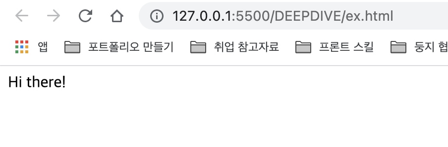

<p>이처럼 innerHTML 프로퍼티를 사용하면 HTML 마크업 문자열로 간단히 DOM 조작이 가능하다</p>

```html
<!DOCTYPE html>
<html>
  <body>
    <ul id="fruits">
      <li class="apple">Apple</li>
    </ul>
  </body>
  <script>
    const $fruits = document.getElementById("fruits");

    // 노드 추가
    $fruits.innerHTML += '<li class="banana">Banana</li>';

    // 노드 교체
    $fruits.innerHTML = '<li class="orange">Orange</li>';

    // 노드 삭제
    $fruits.innerHTML = "";
  </script>
</html>
```

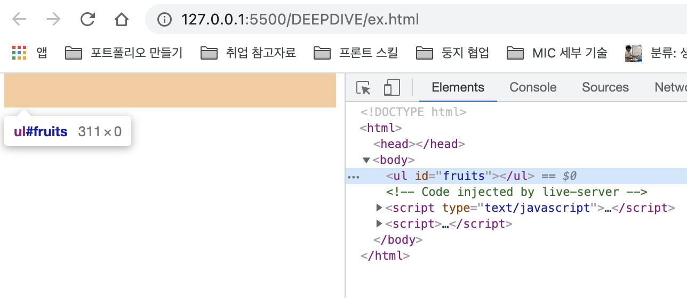

### XSS (Cross-Site Scripting Attacks)

<p>요소 노드의 innerHTML 프로퍼티에 할당한 HTML 마크업 문자열은 렌더링 엔진에 의해 파싱되어 요소 노드의 자식으로 DOM에 반영된다. 이때 사용자로부터 입력받은 데이터를 그대로 innerHTML 프로퍼티에 할당하는 것은 <B>크로스 사이트 스크립팅 공격(XSS: Cross-Site Scripting Attacks)에 취약하므로 위험하다.</B> HTML 마크업 내에 자바스크립트 악성 코드가 포함되어 있다면 파싱 과정에서 그대로 실행될 가능성이 있기 때문이다.</p>

<p>innerHTML 프로퍼티로 스크립트 태그를 삽입하여 자바스크립트가 실행되도록 하는 예제를 살펴보자</p>

```html
<!DOCTYPE html>
<html>
  <body>
    <div id="foo">Hello</div>
  </body>
  <script>
    // innerHTML 프로퍼티로 스크립트 태그를 삽입하여 자바스크립트가 실행되도록 한다.
    // HTML5는 innerHTML 프로퍼티로 삽입된 script 요소 내의 자바스크립트 코드를 실행하지 않는다.
    document.getElementById('foo').innerHTML
      = '<script>alert(document.cookie)</script>';
  </script>
</html>
```

<p>다음의 간단한 크로스 스크립팅 공격은 모던 브라우저에서도 동작한다</p>

```html
<!DOCTYPE html>
<html>
  <body>
    <div id="foo">Hello</div>
  </body>
  <script>
    // 에러 이벤트를 강제로 발생시켜서 자바스크립트 코드가 실행되도록 한다.
    document.getElementById(
      "foo"
    ).innerHTML = ``;
  </script>
</html>
```

### ① 노드 생성과 추가

innerHTML 프로퍼티와 insertAdjacentHTML 메서드는 HTML 마크업 문자열을 파싱하여 노드를 생성하고 DOM에 반영한다. DOM은 노드를 직접 ① 생성 ② 삽입 ③ 삭제 ④ 치환 하는 메서드도 제공한다.

```html
<!DOCTYPE html>
<html>
  <body>
    <ul id="fruits">
      <li>Apple</li>
    </ul>
  </body>
  <script>
    const $fruits = document.getElementById("fruits");

    // 1. 요소 노드 생성
    const $li = document.createElement("li");

    // 2. 텍스트 노드 생성
    const textNode = document.createTextNode("Banana");

    // 3. 텍스트 노드를 $li 요소 노드의 자식 노드로 추가
    $li.appendChild(textNode);

    // 4. $li 요소 노드를 #fruits 요소 노드의 마지막 자식 노드로 추가
    $fruits.appendChild($li);
  </script>
</html>
```

### ② 복수의 노드 생성과 추가

forEach 고차함수를 사용하여 여러 개의 요소 노드를 생성하여 DOM에 추가할 수 있다.

```html
<!DOCTYPE html>
<html>
  <body>
    <ul id="fruits"></ul>
  </body>
  <script>
    const $fruits = document.getElementById("fruits");

    ["Apple", "Banana", "Orange"].forEach((text) => {
      // 1. 요소 노드 생성
      const $li = document.createElement("li");

      // 2. 텍스트 노드 생성
      const textNode = document.createTextNode(text);

      // 3. 텍스트 노드를 $li 요소 노드의 자식 노드로 추가
      $li.appendChild(textNode);

      // 4. $li 요소 노드를 #fruits 요소 노드의 마지막 자식 노드로 추가
      $fruits.appendChild($li);
    });
  </script>
</html>
```

1. GET 요청을 통해 서버에서 해당 .html 파일을 불러올 때는 요소 노드 내부에 텍스트 노드가 없으므로, 아무값도 보이지 않는다

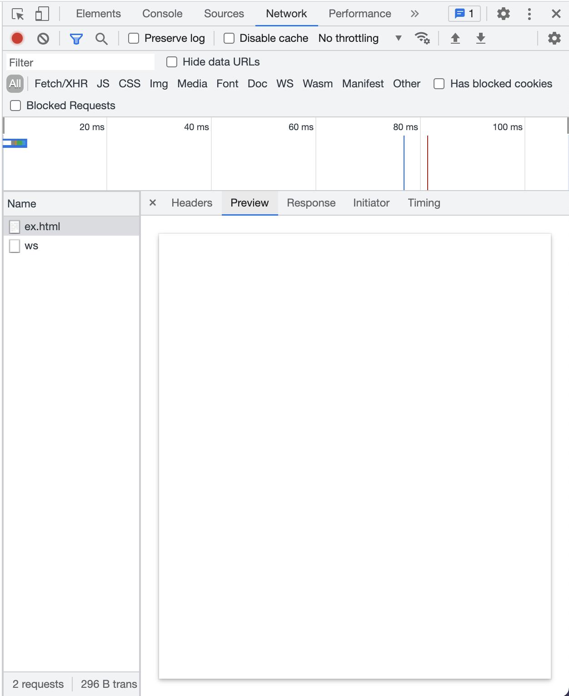

2. 하지만 브라우저의 렌더링 엔진에 의해 해당 파일이 파싱되면서, scipt 코드를 만나 자바스크립트 엔진에게 권한을 넘겨주고 파일에 동적으로 노드를 추가하였다

3. 우리 눈에는 마치 원래 들어있는 것처럼 보이지만, 실제로는 자바스크립트 엔진에 의해 동적으로 추가된 요소임을 알 수 있다

### ③ 지정한 위치에 노드 삽입

```
Node.prototype.insertBefore(newNode, childNode) 메서드를 통해 첫 번째 인수로 전달받은 노드(newNode)를 두 번째 인수로 전달받은 노드 앞에 삽입할 수 있다.
```

```html
<!DOCTYPE html>
<html>
  <body>
    <ul id="fruits">
      <li>Apple</li>
      <li>Banana</li>
    </ul>
  </body>
  <script>
    const $fruits = document.getElementById("fruits");

    // 요소 노드 생성
    const $li = document.createElement("li");

    // 텍스트 노드를 $li 요소 노드의 마지막 자식 노드로 추가
    $li.appendChild(document.createTextNode("Orange"));

    // $li 요소 노드를 #fruits 요소 노드의 마지막 자식 요소(Banana) 앞에 삽입
    $fruits.insertBefore($li, $fruits.lastElementChild);
    // Apple - Orange - Banana
  </script>
</html>
```

### ④ 노드 복사

```
Node.prototype.cloneNode([dee: true | false]) 메서드는 노드의 사본을 생성하여 반환한다

true 이면 노드를 깊은 복사하여 모든 자손 노드가 포함된 사본을 생성한다
false 이면 노드를 얕은 복사하여 노드 자신만의 사본을 생성한다.
```

```html
<!DOCTYPE html>
<html>
  <body>
    <ul id="fruits">
      <li>Apple</li>
    </ul>
  </body>
  <script>
    const $fruits = document.getElementById("fruits");
    const $apple = $fruits.firstElementChild;

    // $apple 요소를 얕은 복사하여 사본을 생성. 텍스트 노드가 없는 사본이 생성된다.
    const $shallowClone = $apple.cloneNode();
    // 사본 요소 노드에 텍스트 추가
    $shallowClone.textContent = "Banana";
    // 사본 요소 노드를 #fruits 요소 노드의 마지막 노드로 추가
    $fruits.appendChild($shallowClone);

    // #fruits 요소를 깊은 복사하여 모든 자손 노드가 포함된 사본을 생성
    const $deepClone = $fruits.cloneNode(true);
    // 사본 요소 노드를 #fruits 요소 노드의 마지막 노드로 추가
    $fruits.appendChild($deepClone);
  </script>
</html>
```

### ⑤ 노드 교체

```
Node.prototype.replaceChild(newChild, oldChild) 메서드는 자신을 호출한 노드의 자식 노드를 다른 노드로 교체한다
```

```html
<!DOCTYPE html>
<html>
  <body>
    <ul id="fruits">
      <li>Apple</li>
    </ul>
  </body>
  <script>
    const $fruits = document.getElementById("fruits");

    // 기존 노드와 교체할 요소 노드를 생성
    const $newChild = document.createElement("li");
    $newChild.textContent = "Banana";

    // #fruits 요소 노드의 첫 번째 자식 요소 노드를 $newChild 요소 노드로 교체
    $fruits.replaceChild($newChild, $fruits.firstElementChild);
  </script>
</html>
```

### ⑥ 노드 삭제

```
Node.prototype.removeChild(child) 메서드는 child 매개변수에 인수로 전달한 노드를 DOM에서 삭제합니다
```

```html
<!DOCTYPE html>
<html>
  <body>
    <ul id="fruits">
      <li>Apple</li>
      <li>Banana</li>
    </ul>
  </body>
  <script>
    const $fruits = document.getElementById("fruits");

    // #fruits 요소 노드의 마지막 요소를 DOM에서 삭제
    $fruits.removeChild($fruits.lastElementChild);
  </script>
</html>
```

### 39.7 어트리뷰트

### 어트리뷰트 노드와 attributes 프로퍼티

HTML 문서의 구성 요소인 HTML 요소는 여러 개의 어트리뷰트(속성)을 가질 수 있다.

```html
<input id="user" type="text" value="junhee" />
```

어트리뷰트의 종류는 다음과 같다

```
① 글로벌 어트리뷰트 (id, class, style, title, lang, tabindex, draggable, hidden)
② 이벤트 핸들러 어트리뷰트 (onclick, onchange, onfocus, onblur, oninput, onkeypress,
onkeydown, onkeyup, onmouseover, onsubmit, onload 등)
③ 특정 HTML 요소에만 사용 가능한 어트리뷰트 (input >> type, value, checked)
```

HTML 문서가 파싱될 때 HTML 요소의 어트리뷰트는 어트리뷰트 노드로 변환되어 요소 노드와 연결된다. 이때 HTML 어트리뷰트 하나당 어트리뷰트 노드가 생성된다.

따라서 요소 노드의 모든 어트리뷰트 노드는 요소 노드의

```
Element.prototype.attributes 프로퍼티로 취득할 수 있다. (읽기 전용 접근자 프로퍼티이다)
```

```html
<!DOCTYPE html>
<html>
  <body>
    <input id="user" type="text" value="ungmo2" />
    <script>
      // 요소 노드의 attribute 프로퍼티는 요소 노드의 모든 어트리뷰트 노드의 참조가 담긴 NamedNodeMap 객체를 반환한다.
      const { attributes } = document.getElementById("user");
      console.log(attributes);
      // NamedNodeMap {0: id, 1: type, 2: value, id: id, type: type, value: value, length: 3}

      // 어트리뷰트 값 취득
      console.log(attributes.id.value); // user
      console.log(attributes.id); // id="user"

      console.log(attributes.type.value); // text
      console.log(attributes.type); // type="text"

      console.log(attributes.value.value); // ungmo2
      console.log(attributes.value); // value="ungmo2"
    </script>
  </body>
</html>
```

### HTML 어트리뷰트 조작

```
Element.prototype.getAttributes/setAttribute
```

```html
<!DOCTYPE html>
<html>
  <body>
    <input id="user" type="text" value="ungmo2" />
    <script>
      const $input = document.getElementById("user");

      // value 어트리뷰트 값을 취득
      const inputValue = $input.getAttribute("value");
      console.log(inputValue); // ungmo2

      // value 어트리뷰트 값을 변경
      $input.setAttribute("value", "foo");
      console.log($input.getAttribute("value")); // foo
    </script>
  </body>
</html>
```

### HTML 어트리뷰트 vs DOM 프로퍼티

<p>HTML 어트리뷰트의 역할은 HTML 요소의 초기 상태를 지정하는 것이다. 즉, HTML 어트리뷰트 값은 HTML 요소의 초기 상태를 의미하며 이는 변하지 않는다.</p>

```html
<!DOCTYPE html>
<html>
  <body>
    <input id="user" type="text" value="ungmo2" />
    <script>
      const $input = document.getElementById("user");

      // attributes 프로퍼티에 저장된 value 어트리뷰트 값
      console.log($input.getAttribute("value")); // ungmo2

      // 요소 노드의 value 프로퍼티에 저장된 value 어트리뷰트 값
      console.log($input.value); // ungmo2
    </script>
  </body>
</html>
```

<p>하지만 첫 렌더링 이후 사용자가 input 요소에 무언가를 입력하기 시작하면 상황이 달라진다. 요소 노드는 상태(state)를 가지고 있다.</p>

<p>사용자가 input 요소의 입력 필드에 'foo'라는 값을 입력하는 경우를 생각해보자. 이때 input 요소 노드는 사용자의 입력에 의해 변경된 최상 상태("foo")를 관리해야 하는 것은 물론, HTML 어트리뷰트로 지정한 초기 상태("ungmo2")도 관리해야 한다. 초기 상태 값을 관리하지 않으면 웹페이지를 처음 표시하거나 새로고침할 때 초기 상태를 표시할 수 없다.</p>

<p>이처럼 <b>요소 노드는 2개의 상태, 즉 ① 초기 상태와 ② 최신 상태를 관리해야 한다. 요소 노드의 초기 상태는 ① 어트리뷰트 노드가 관리하며, 요소 노드의 최신 상태는 ② DOM 프로퍼티가 관리한다.</b></p>

### 어트리뷰트 노드

<p>HTML 어트리뷰트로 지정한 HTML 요소의 초기 상태는 어트리뷰트 노드에서 관리한다. 사용자의 입력에 의해 상태가 변경되어도 변하지 않고 HTML 어트리뷰트로 지정한 HTML 요소의 초기 상태를 그대로 유지한다. 어트리뷰트 노드가 관리하는 초기 상태 값을 취득하거나 변경하려면 getAttributes/setAttributes 메서드를 사용한다.</p>

```js
// attributes 프로퍼티에 저장된 value 어트리뷰트 값을 취득한다. 결과는 언제나 동일하다.
document.getElementById("user").getAttribute("value"); // ungmo2
```

setAttributes 메서드는 어트리뷰트 노드에서 관리하는 HTML 요소에 지정한 어트리뷰트 값, 즉 초기 상태 값을 변경한다.

```html
<!DOCTYPE html>
<html>
  <body>
    <input id="user" type="text" value="ungmo2" />
    <script>
      // HTML 요소에 지정한 어트리뷰트 값, 즉 초기 상태 값을 변경한다.
      document.getElementById("user").setAttribute("value", "foo");
    </script>
  </body>
</html>
```

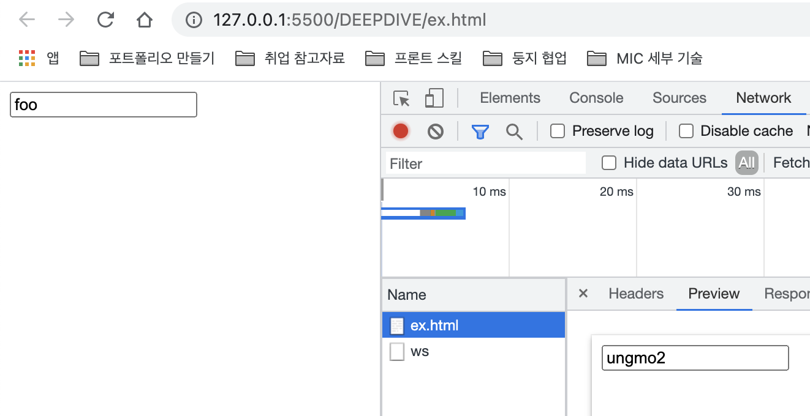

### DOM 프로퍼티

<p>사용자가 입력한 최신 상태는 HTML 어트리뷰트에 대응하는 요소 노드의 DOM 프로퍼티가 관리한다. DOM 프로퍼티는 사용자의 입력에 의한 상태 변화에 반응하여 언제나 최신 상태를 유지한다.</p>

```html
<!DOCTYPE html>
<html>
  <body>
    <input id="user" type="text" value="ungmo2" />
    <script>
      const $input = document.getElementById("user");

      // 사용자가 input 요소의 입력 필드에 값을 입력할 때마다 input 요소 노드의
      // value 프로퍼티 값, 즉 최신 상태 값을 취득한다. value 프로퍼티 값은 사용자의 입력에
      // 의해 동적으로 변경된다.
      $input.oninput = () => {
        console.log("value 프로퍼티 값", $input.value);
      };

      // getAttribute 메서드로 취득한 HTML 어트리뷰트 값, 즉 초기 상태 값은 변하지 않고 유지된다.
      console.log("value 어트리뷰트 값", $input.getAttribute("value"));
    </script>
  </body>
</html>
```

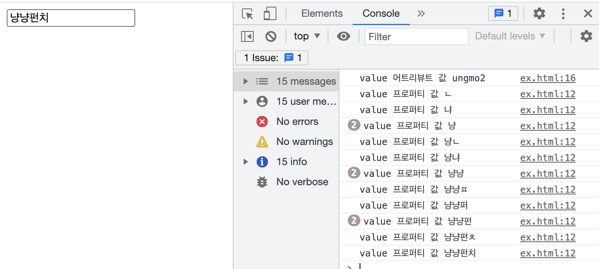

```
① 처음 실행할 때는 어트리뷰트 노드에 의해 관리되는 상태를 감지하여 16번째 줄의 코드로 실행되었다
② 이후 실행은 최신 상태를 관리하는 DOM 프로퍼티에 의해 관리되므로 12번째 줄의 코드로 실행된다
```

### HTML 어트리뷰트와 DOM 프로퍼티의 대응 관계

<p>대부분의 HTML 어트리뷰트는 HTML 어트리뷰트 이름과 동일한 DOM 프로퍼티와 1:1로 대응한다. 단, 다음과 같이 HTML 어트리뷰트와 DOM 프로퍼티가 언제나 1:1로 대응아흔 것은 아니며, HTML 어트리뷰트 이름과 DOM 프로퍼티 키가 반드시 일치하는 것도 아니다.</p>

- id 어트리뷰트(속성)과 id 프로퍼티는 1:1 대응하며, 동일한 값으로 연동한다
- input 요소의 value 어트리뷰트는 value 프로퍼티와 1:1로 대응한다. 하지만 value 어트리뷰트는 <b>초기 상태를,</b> value 프로퍼티는 <b>최신 상태를 갖는다</b>
- class 어트리뷰트는 ① className, ② classList 프로퍼티와 대응한다
- for 어트리뷰트는 htmlFor 프로퍼티와 1:1 대응한다.
- td 요소의 colspan 어트리뷰트는 대응하는 프로퍼티가 존재하지 않는다.
- textContext 프로퍼티는 대응하는 어트리뷰트가 존재하지 않는다.
- 어트리뷰트 이름은 대소문자를 구별하지 않지만 대응하는 프로퍼티 키는 카멜 케이스를 따른다.(maxlength > maxLength)

### DOM 프로퍼티 값의 타입

<p>getAttribute 메서드로 취득한 어트리뷰트 값은 언제나 문자열이다. 하지만 DOM 프로퍼티로 취득한 최신 상태 값은 문자열이 아닐 수 있다. (checkbox 요소의 checked 타입의 경우)</p>

```html
<!DOCTYPE html>
<html>
  <body>
    <input type="checkbox" checked />
    <script>
      const $checkbox = document.querySelector("input[type=checkbox]");

      // getAttribute 메서드로 취득한 어트리뷰트 값은 언제나 문자열이다.
      console.log($checkbox.getAttribute("checked")); // ''

      // DOM 프로퍼티로 취득한 최신 상태 값은 문자열이 아닐 수도 있다.
      console.log($checkbox.checked); // true
    </script>
  </body>
</html>
```

### data 어트리뷰트와 dataset 프로퍼티

<p>data 어트리뷰트와 dataset 프로퍼티를 사용하면 HTML 요소에 정의한 사용자 정의 어트리뷰트와 자바스크립트 간에 데이터를 교환할 수 있다. data 어트리뷰트는 <b>data-</b> 접두사 다음에 임의의 이름을 붙여 사용한다.</p>

> 요소 변경하기

```html
<!DOCTYPE html>
<html>
  <body>
    <ul class="users">
      <li id="1" data-user-id="7621" data-role="admin">Lee</li>
      <li id="2" data-user-id="9524" data-role="subscriber">Kim</li>
    </ul>
    <script>
      const users = [...document.querySelector(".users").children];

      // user-id가 '7621'인 요소 노드를 취득한다.
      const user = users.find((user) => user.dataset.userId === "7621");
      // user-id가 '7621'인 요소 노드에서 data-role의 값을 취득한다.
      console.log(user.dataset.role); // "admin"

      // user-id가 '7621'인 요소 노드의 data-role 값을 변경한다.
      user.dataset.role = "subscriber";
      // dataset 프로퍼티는 DOMStringMap 객체를 반환한다.
      console.log(user.dataset); // DOMStringMap {userId: "7621", role: "subscriber"}
    </script>
  </body>
</html>
```

<p>data 어트리뷰트 값은 <b>HTMLElement.datase</b> 프로퍼티로 취득할 수 있다. dataset 프로퍼티는 HTML 요소의 모든 data 어트리뷰트의 정보를 제공하는 <b>DOMStringMap </b>객체를 반환한다. DOMStringMap 객체는 data 어트리뷰트의 data- 접두사 다음에 붙인 임의의 이름 (ex: data-role)을 카멜 케이스로 변환한 프로퍼티를 가지고 있다. 이 프로퍼티로 data 어트리뷰트의 값을 취득하거나 변경할 수 있다.</p>

> 요소 추가하기

```html
<!DOCTYPE html>
<html>
  <body>
    <ul class="users">
      <li id="1" data-user-id="7621">Lee</li>
      <li id="2" data-user-id="9524">Kim</li>
    </ul>
    <script>
      const users = [...document.querySelector(".users").children];

      // user-id가 '7621'인 요소 노드를 취득한다.
      const user = users.find((user) => user.dataset.userId === "7621");

      // user-id가 '7621'인 요소 노드에 새로운 data 어트리뷰트를 추가한다.
      user.dataset.role = "admin";
      console.log(user.dataset);
      /*
    DOMStringMap {userId: "7621", role: "admin"}
    -> <li id="1" data-user-id="7621" data-role="admin">Lee</li>
    */
    </script>
  </body>
</html>
```

### 39.8 스타일

```
① 인라인 스타일 조작
② 클래스 조작
③ 요소에 적용되어 있는 CSS 스타일 참조
```

### ① 인라인 스타일 조작

```
HTMLElement.prototype.style 프로퍼티는 setter와 getter 모두 존재하는 접근자 프로퍼티로서
요소 노드의 인라인 스타일을 취득하거나 추가 또는 변경할 수 있다.
```

```html
<!DOCTYPE html>
<html>
  <body>
    <div style="color: red">Hello World</div>
    <script>
      const $div = document.querySelector("div");

      // 인라인 스타일 취득
      console.log($div.style); // CSSStyleDeclaration { 0: "color", ... }

      // 인라인 스타일 변경
      $div.style.color = "blue";

      // 인라인 스타일 추가
      $div.style.width = "100px";
      $div.style.height = "100px";
      $div.style.backgroundColor = "yellow";
    </script>
  </body>
</html>
```

케밥 케이스의 CSS 프로퍼티를 그대로 사용하려면 마침표 표기법 대신 대괄호 표기법을 사용한다

```js
$div.style["background-color"] = "yellow";
```

### ② 클래스 조작

(.)으로 시작하는 클래스 선택자를 사용하여 CSS class를 미리 정의한 다음, HTML 요소의 어트리뷰트(속성) 값을 변경하여 HTML 요소의 스타일을 변경할 수도 있다.

class 어트리뷰트에 대응하는 DOM 프로퍼티는 class가 아니라 className과 classList다. <b>자바스크립트에서 class는 예약어이기 때문이다.</b>

### className

```
Element.prototype.className 프로퍼티는 setter와 getter 모두 존재하는 접근자 프로퍼티로서 HTML 요소의 class 어트리뷰트 값을 취득하거나 변경한다
```

```html
<!DOCTYPE html>
<html>
  <head>
    <style>
      .box {
        width: 100px;
        height: 100px;
        background-color: antiquewhite;
      }
      .red {
        color: red;
      }
      .blue {
        color: blue;
      }
    </style>
  </head>
  <body>
    <div class="box red">Hello World</div>
    <script>
      const $box = document.querySelector(".box");

      // .box 요소의 class 어트리뷰트 값을 취득
      console.log($box.className); // 'box red'

      // .box 요소의 class 어트리뷰트 값 중에서 'red'만 'blue'로 변경
      $box.className = $box.className.replace("red", "blue");
    </script>
  </body>
</html>
```

### classList

```
Element.prototype.classList 프로퍼티는 class 어트리뷰트의 정보를 담은 DOMTokenList 객체를 반환한다
```

```html
<!DOCTYPE html>
<html>
  <head>
    <style>
      .box {
        width: 100px;
        height: 100px;
        background-color: antiquewhite;
      }
      .red {
        color: red;
      }
      .blue {
        color: blue;
      }
    </style>
  </head>
  <body>
    <div class="box red">Hello World</div>
    <script>
      const $box = document.querySelector(".box");
      // .box 요소의 class 어트리뷰트 정보를 담은 DOMTokenList 객체를 취득
      // classList가 반환하는 DOMTokenList 객체는 HTMLCollection과 NodeList와 같이
      // 노드 객체의 상태 변화를 실시간으로 반영하는 살아 있는(live) 객체다.
      console.log($box.classList);
      // DOMTokenList(2) [length: 2, value: "box blue", 0: "box", 1: "blue"]

      // .box 요소의 class 어트리뷰트 값 중에서 'red'만 'blue'로 변경
      $box.classList.replace("red", "blue");
    </script>
  </body>
</html>
```

classList의 DOMTokenList 객체는 유사 배열 객체이면서 이터러블이다. 따라서 추가적으로 다양한 메서드를 제공한다

```
① add(...className)
② remove(...className)
③ item(index)
④ contains(className)
⑤ replace(oldClassName, newClassName)
⑥ toggle(className [,force])
```

### ① add(...className)

```js
$box.classList.add("foo"); // -> class="box red foo"
$box.classList.add("bar", "baz"); // -> class="box red foo bar baz"
```

### ② remove(...className)

```js
$box.classList.remove("foo"); // -> class="box red bar baz"
$box.classList.remove("bar", "baz"); // -> class="box red"
$box.classList.remove("x"); // -> class="box red"
```

### ③ item(index)

```js
$box.classList.item(0); // -> "box"
$box.classList.item(1); // -> "red"
```

### ④ contains(className)

```js
$box.classList.contains("box"); // -> true
$box.classList.contains("blue"); // -> false
```

### ⑤ replace(oldClassName, newClassName)

```js
$box.classList.replace("red", "blue"); // -> class="box blue"
```

### ⑥ toggle(className [,force])

```js
// class 어트리뷰트에 강제로 'foo' 클래스를 추가
$box.classList.toggle("foo", true); // -> class="box blue foo"
// class 어트리뷰트에서 강제로 'foo' 클래스를 제거
$box.classList.toggle("foo", false); // -> class="box blue"
```

### ③ 요소에 적용되어 있는 CSS 스타일 참조

<p>style 프로퍼티는 인라인 스타일만 반환한다. 따라서 클래스르 적용한 스타일이나 상속을 통해 암묵적으로 적용된 style 프로퍼티로 참조할 수 없다.</p>

<p>따라서 HTML 요소에 적용되어 있는 모든 CSS 스타일을 참조해야 할 경우 <b>getComputedStyle</b> 메서드를 사용한다.</p>

<details>

```html
<!DOCTYPE html>
<html>
  <head>
    <style>
      body {
        color: red;
      }
      .box {
        width: 100px;
        height: 50px;
        background-color: cornsilk;
        border: 1px solid black;
      }
    </style>
  </head>
  <body>
    <div class="box">Box</div>
    <script>
      const $box = document.querySelector(".box");

      // .box 요소에 적용된 모든 CSS 스타일을 담고 있는 CSSStyleDeclaration 객체를 취득
      const computedStyle = window.getComputedStyle($box);
      console.log(computedStyle); // CSSStyleDeclaration

      // 임베딩 스타일
      console.log(computedStyle.width); // 100px
      console.log(computedStyle.height); // 50px
      console.log(computedStyle.backgroundColor); // rgb(255, 248, 220)
      console.log(computedStyle.border); // 1px solid rgb(0, 0, 0)

      // 상속 스타일(body -> .box)
      console.log(computedStyle.color); // rgb(255, 0, 0)

      // 기본 스타일
      console.log(computedStyle.display); // block
    </script>
  </body>
</html>
```

</details>

## 40장 이벤트

### 40.1 이벤트 드리븐 프로그래밍

<p>브라우저는 처리해야 할 특정 사건이 발생하면 이를 감지하여 이벤트(=evnet)를 발생(=trigger)시킨다. 예를 들어, 클릭, 키보드 입력, 마우스 이동 등이 일어나면 브라우저는 이를 감지하여 특정한 타입의 이벤트를 발생시킨다. <b>만약 애플리케이션이 특정 타입 이벤트에 대해 반응하여 어떤 일을 하고 싶다면 해당 타입의 이벤트가 발생했을 때 호출될 함수를 브라우저에게 알려 호출을 위임한다.</b> 이때 호출될 함수를 <b>① 이벤트 핸들러(= event handler)</b> 라 하고, 이벤트가 발생했을 때 브라우저에게 이벤트 핸들러의 호출을 위임하는 것을 <b>② 이벤트 핸들러 등록</b>이라 한다. </p>

<p>예를 들어, 사용자가 버튼을 클릭했을 때 함수를 호출하여 어떤 처리를 하고 싶다고 가정해보자. 이때 문제는 <b>'언제 함수를 호출해야 하는가'</b>다. 사용자가 언제 버튼을 클릭할지 알 수 없으므로 언제 함수를 호출해야 할 지 알 수 없기 때문이다.</p>

<p>다행히 브라우저는 사용자의 버튼을 감지하여 클릭 이벤트를 발생할 수 있다. 함수를 언제 호출할지 알 수 없으므로 개발자가 명시적으로 호출하는 것이 아니라 <b>브라우저에게 함수 호출을 위임하는 것</b>이다. 이렇게 프로그램의 흐름을 이벤트 중심으로 제어하는 프로그래밍 방식을 <b>이벤트 드리븐 프로그래밍(= event-driven programming)</b>이라 한다.</p>

```html
<!DOCTYPE html>
<html>
  <body>
    <button>Click me!</button>
    <script>
      const $button = document.querySelector("button");

      /*
      이벤트를 발생시키는 방법은 총 3가지이다.
      이에 대해서는 뒤에서 알아본다
      */

      $button.onclick = () => {
        alert("button click");
      };
    </script>
  </body>
</html>
```

### 40.2 이벤트 타입

<p>이벤트 타입은 이벤트의 종류를 나타내는 문자열이다. 상세 목록은 MDN의 Event reference에서 확인할 수 있다.</p>

[MDN: Event Reference](https://developer.mozilla.org/en-US/docs/Web/Events)

### 마우스 이벤트

| 이벤트 타입 | 이벤트 발생 시점                                      |
| :---------- | :---------------------------------------------------- |
| click       | 마우스 버튼을 클릭했을 때                             |
| dbclick     | 마우스 버튼을 더블 클릭했을 때                        |
| mousedown   | 마우스 버튼을 누르고 있을 때                          |
| mouseup     | 누르고 있던 마우스 버튼을 뗄 때                       |
| mousemove   | 마우스 커서를 움직일 때                               |
| mouseenter  | 마우스 커서를 HTML 요소 안으로 이동했을 때 (버블링 x) |
| mouseover   | 마우스 커서를 HTML 요소 안으로 이동했을 때 (버블링 o) |
| mouseleave  | 마우스 커서를 HTML 요소 밖으로 이동했을 때(버블링x)   |
| mouseout    | 마우스 커서를 HTML 요소 밖으로 이동했을 때(버블링o)   |

### 키보드 이벤트

| 이벤트 타입 | 이벤트 발생 시점                            |
| :---------- | :------------------------------------------ |
| keydown     | 키를 누르고 있을 때                         |
| keypress    | 키를 누르고 뗏을 때 (폐지되었으므로 사용 x) |
| keyup       | 누르고 있던 키를 뗄 때                      |

### 포커스 이벤트

| 이벤트 타입 | 이벤트 발생 시점                     |
| :---------- | :----------------------------------- |
| focus       | 요소가 포커스를 얻었을 때 (버블링 x) |
| blur        | 요소가 포커스를 잃었을 때 (버블링 x) |
| focusin     | 요소가 포커스를 얻었을 때 (버블링 o) |
| foucusout   | 요소가 포커스를 잃었을 때 (버블링 o) |

### 폼 이벤트

| 이벤트 타입 | 이벤트 발생 시점                            |
| :---------- | :------------------------------------------ |
| submit      | form을 submit할 때 (버튼 또는 키)           |
| reset       | reset 버튼을 클릭할 때 (최근에는 사용 안함) |

### 값 변경 이벤트

| 이벤트 타입 | 이벤트 발생 시점                                          |
| :---------- | :-------------------------------------------------------- |
| input       | input 또는 textarea 요소의 값이 변경되었을 때             |
| change      | select box, checkbox, radio button의 상태가 변경되었을 때 |

### DOM 뮤테이션 이벤트

| 이벤트 타입      | 이벤트 발생 시점                                            |
| :--------------- | :---------------------------------------------------------- |
| DOMContentLoaded | HTML 문서의 로드와 파싱이 완료되어 DOM 생성이 완료되었을 때 |

### 뷰 이벤트

| 이벤트 타입 | 이벤트 발생 시점                                                |
| :---------- | :-------------------------------------------------------------- |
| resize      | 브라우저 윈도우의 크기를 리사이즈할 때 연속적으로 발생          |
| scroll      | 웹피이지(document) 또는 HTML 요소를 스코롤할 때 연속적으로 발생 |

### 리소스 이벤트

| 이벤트 타입 | 이벤트 발생 시점                                           |
| :---------- | :--------------------------------------------------------- |
| load        | DOMContentLoaded 이후, 모든 리소스의 로딩이 완료되었을 때  |
| unload      | 리소스가 언로드 될 때 (주로 새로운 웹페이지를 요청한 경우) |
| abort       | 리소스 로딩이 중단되었을 때                                |
| error       | 리소스 로딩이 실패했을 때                                  |

### 40.3 이벤트 핸들러 등록

<p>이벤트 핸들러는 <b>특정 이벤트가 발생했을 때 브라우저에 호출을 위임한 함수다. 다시 말해, 이벤트가 발생하면 브라우저에 호출될 함수가 이벤트 핸들러다.</b></p>

<p>이벤트가 발생했을 때 브라우저에게 이벤트 핸들러의 호출을 위임하는 것을 <b>이벤트 핸들러 등록</b>이라 한다. 이벤트 핸들러를 등록하는 방법은 3가지다.</p>

```
① 이벤트 핸들러 어트리뷰트 방식
② 이벤트 핸들러 프로퍼티 방식
③ addEventListener 메서드 방식
```

### ① 이벤트 핸들러 어트리뷰트 방식

<p>이벤트 핸들러 어트리뷰트 방식은 ① on 접두사와 ② 이벤트 종류를 나타내는 이벤트 타입으로 이루어져 있다.</p>

```html
<!DOCTYPE html>
<html>
  <body>
    <button onclick="sayHi('Lee')">Click me!</button>
    <script>
      function sayHi(name) {
        console.log(`Hi! ${name}.`);
      }
    </script>
  </body>
</html>
```

<p>이벤트 핸들러 어트리뷰트 방식으로 함수를 호출할 때는 반드시 참조 형식이 아닌(sayHi), 함수 호출문(sayHi('Lee')) 형태로 호출해야 한다.</p>

```html
<!-- 이벤트 핸들러에 인수를 전달하기 곤란하다. -->
<button onclick="sayHi">Click me!</button>
```

<p>핸들러 내부에 한가지의 코드만 사용할 수 있는 것은 아니다.</p>

```html
<button onclick="console.log('Hi! '); console.log('Lee');">Click me!</button>
```

### ② 이벤트 핸들러 프로퍼티 방식

<p>이벤트 핸들러 프로퍼티 방식은  ① on 접두사와 ② 이벤트 종류를 나타내는 이벤트 타입으로 이루어져 있다는 것에서 이벤트 핸들러 어트리뷰트 방식과 유사하다. 하지만 요소의 어트리뷰트 내에서 직접 호출하는 것이 아닌, <b>이벤트 핸들러 프로퍼티에 함수를 바인딩하면 이벤트 핸들러가 등록되는 형식이다.</b></p>

```html
<!DOCTYPE html>
<html>
  <body>
    <!-- 
    ① 이벤트 핸들러 어트리뷰트 방식
    <button onclick="sayHi('Lee')">Click me!</button>
     -->
    <button>Click me!</button>
    <script>
      const $button = document.querySelector("button");

      // 이벤트 핸들러 프로퍼티에 이벤트 핸들러를 바인딩 (익명 함수로 가능)
      $button.onclick = function () {
        console.log("button click");
      };
    </script>
  </body>
</html>
```

<p>하지만 이벤트 핸들러 프로퍼티에 하나의 이벤트 핸들러만 바인딩할 수 있다는 단점이 있다. 하나의 이벤트 핸들러에 두 개의 핸들러를 바인딩할 경우 재할당을 통해 마지막으로 바인딩 된 핸들러 함수가 호출된다.</p>

```html
<!DOCTYPE html>
<html>
  <body>
    <button>Click me!</button>
    <em></em>

    <script>
      const $button = document.querySelector("button");
      const $em = document.querySelector("em");

      // 이벤트 핸들러 프로퍼티 방식은 하나의 이벤트에 하나의 이벤트 핸들러만을 바인딩할 수 있다.
      // 첫 번째로 바인딩된 이벤트 핸들러는 두 번째 바인딩된 이벤트 핸들러에 의해 재할당되어
      // 실행되지 않는다.
      $button.onclick = function () {
        $em.innerHTML = "Button Cliked 1";
      };

      // 두 번째로 바인딩된 이벤트 핸들러
      $button.onclick = function () {
        $em.innerHTML = "Button Cliked 2";
      };
    </script>
  </body>
</html>
```

[📍 codepen.io](https://codepen.io/pen)

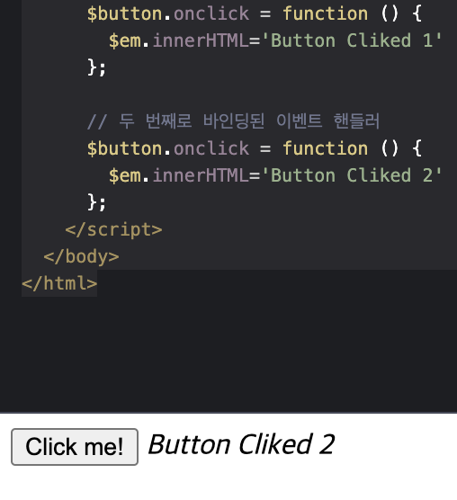

### ③ addEventListener 메서드 방식

<p>addEventListener 메서드 방식은 추가적으로 파라미터에 버블링과 캡처링 여부를 넣어줄 수 있다. 생략하거나 false를 지정하면 버블링 단계에서 이벤트를 캐치하고, true를 지정하면 캡처링 단계에서 이벤트를 캐치한다.</p>

```html
<html>
  <body>
    <button>Click me!</button>
    <em></em>

    <script>
      const $button = document.querySelector("button");
      const $em = document.querySelector("em");

      $button.addEventListener("click", function () {
        $em.innerHTML = "Button Cliked 1";
      });

      $button.addEventListener("click", function () {
        $em.innerHTML = "Button Cliked 2";
      });
    </script>
  </body>
</html>
```

addEventListener 메서드는 하나 이상의 이벤트 핸들러를 등록할 수 있다. 이때 등록한 이벤트 핸들러는 순서대로 호출된다.

```
Button Cliked 1
Button Cliked 2
```

### 40.4 이벤트 핸들러 제거

③ addEventListener 메서드로 등럭한 이벤트 핸들러를 제거하려면

```
EventTarget.prototype.removeEventListener 메서드를 사용한다.
```

```html
<!DOCTYPE html>
<html>
  <body>
    <button>Click me!</button>
    <script>
      const $button = document.querySelector("button");

      const handleClick = () => console.log("button click");

      // 이벤트 핸들러 등록
      $button.addEventListener("click", handleClick);

      // 이벤트 핸들러 제거
      // addEventListener 메서드에 전달한 인수와 removeEventListener 메서드에
      // 전달한 인수가 일치하지 않으면 이벤트 핸들러가 제거되지 않는다.
      $button.removeEventListener("click", handleClick, true); // 실패
      $button.removeEventListener("click", handleClick); // 성공
    </script>
  </body>
</html>
```

<p>익명 함수를 사용하여 이벤트 핸들러로 등록한 경우 제거할 수 없으므로, 이벤트 핸들러를 제거하려면 이벤트 핸들러의 참조를 변수나 자료구조에 저장하고 있어야 한다.</p>

```js
// 이벤트 핸들러 등록
$button.addEventListener("click", () => console.log("button click"));
// 등록한 이벤트 핸들러를 참조할 수 없으므로 제거할 수 없다
```

```js
// 기명 함수를 이벤트 핸들러로 등록
$button.addEventListener("click", function foo() {
  console.log("button click");
  // 이벤트 핸들러를 제거한다. 따라서 이벤트 핸들러는 단 한 번만 호출된다.
  $button.removeEventListener("click", foo);
});
```

<p>② 이벤트 핸들러 프로퍼티 방식으로 등록한 이벤트 핸들러는 removeEventListener 메서드로 제거할 수 없다. 등록한 이벤트 핸들러를 제거하려면 이벤트 핸들러 프로퍼티에 null을 할당한다.</p>

```html
<!DOCTYPE html>
<html>
  <body>
    <button>Click me!</button>
    <script>
      const $button = document.querySelector("button");

      const handleClick = () => console.log("button click");

      // 이벤트 핸들러 프로퍼티 방식으로 이벤트 핸들러 등록
      $button.onclick = handleClick;

      // removeEventListener 메서드로 이벤트 핸들러를 제거할 수 없다.
      $button.removeEventListener("click", handleClick);

      // 이벤트 핸들러 프로퍼티에 null을 할당하여 이벤트 핸들러를 제거한다.
      $button.onclick = null;
    </script>
  </body>
</html>
```

### 40.5 이벤트 객체

<p>이벤트가 발생하면 이벤트에 관련한 다양한 정보를 담고 있는 <b>이벤트 객체가 동적으로 생성된다. 생성된 이벤트 객체는 이벤트 핸들러의 첫 번째 인수로 전달된다.</b></p>

```html
<!DOCTYPE html>
<html>
  <body>
    <p>클릭하세요. 클릭한 곳의 좌표가 표시됩니다.</p>
    <em class="message"></em>
    <script>
      const $msg = document.querySelector(".message");

      // 클릭 이벤트에 의해 생성된 이벤트 객체는 이벤트 핸들러의 첫 번째 인수로 전달된다.
      function showCoords(e) {
        $msg.textContent = `clientX: ${e.clientX}, clientY: ${e.clientY}`;
      }

      /*
        마치 생성자 함수나 클래스 선언문에서 this를 바인딩하는 것과 같은 느낌입니다
      */

      document.onclick = showCoords;
    </script>
  </body>
</html>
```

[codepen.io](https://codepen.io/junh0328/pen/gORbNWQ)

<p>클릭 이벤트에 의해 생성된 이벤트 객체는 이벤트 핸들러의 첫 번째 인수로 전달되어 매개변수 e에 암묵적으로 할당된다. <b>이는 브라우저가 이벤트 핸들러를 정의할 때 객체를 인수로 전달하기 때문이다. 따라서 이벤트 객체를 전달받으려면 이벤트 핸들러를 정의할 때 이벤트 객체가 전달받을 매개변수를 명시적으로 선언해야 한다.</b> 위 예제어서 e라는 이름으로 매개변수를 선언했으나 다른 이름을 사용하여도 상관없다.</p>

<p>① 이벤트 핸들러 어트리뷰트 방식으로 이벤트 핸들러를 등록했다면 event라는 변수를 선언하여 인벤트 객체를 전달해야 한다. onclick 이벤트 핸들러의 첫 번째 매개변수의 이름이 event로 암묵적으로 명명되기 때문이다.</p>

```html
<!DOCTYPE html>
<html>
  <head>
    <style>
      html,
      body {
        height: 100%;
      }
    </style>
  </head>
  <!-- 이벤트 핸들러 어트리뷰트 방식의 경우 event가 아닌 다른 이름으로는 이벤트 객체를
전달받지 못한다. -->
  <body onclick="showCoords(event)">
    <p>클릭하세요. 클릭한 곳의 좌표가 표시됩니다.</p>
    <em class="message"></em>
    <script>
      const $msg = document.querySelector(".message");

      // 클릭 이벤트에 의해 생성된 이벤트 객체는 이벤트 핸들러의 첫 번째 인수로 전달된다.
      function showCoords(e) {
        $msg.textContent = `clientX: ${e.clientX}, clientY: ${e.clientY}`;
      }
    </script>
  </body>
</html>
```

### 이벤트 객체의 상속 구조

이벤트가 발생하면 이벤트 타입에 따라 다양한 타입의 이벤트 객체가 생성된다. 이벤트 객체는 다음과 같은 상속 구조를 갖는다.


위 그림의 Event, UIEvent, MouseEvent 등 모두 생성자 함수이다. 따라서 생상자 함수를 호출하여 이벤트 객체를 생성할 수도 있다.

<details>
<summary>코드보기</summary>

```html
<!DOCTYPE html>
<html>
  <body>
    <script>
      // Event 생성자 함수를 호출하여 foo 이벤트 타입의 Event 객체를 생성한다.
      let e = new Event("foo");
      console.log(e);
      // Event {isTrusted: false, type: "foo", target: null, ...}
      console.log(e.type); // "foo"
      console.log(e instanceof Event); // true
      console.log(e instanceof Object); // true

      e = new FocusEvent("focus");
      console.log(e);
      // FocusEvent {isTrusted: false, relatedTarget: null, view: null, ...}

      e = new MouseEvent("click");
      console.log(e);
      // MouseEvent {isTrusted: false, screenX: 0, screenY: 0, clientX: 0, ... }

      e = new KeyboardEvent("keyup");
      console.log(e);
      // KeyboardEvent {isTrusted: false, key: "", code: "", ctrlKey: false, ...}

      e = new InputEvent("change");
      console.log(e);
      // InputEvent {isTrusted: false, data: null, inputType: "", ...}
    </script>
  </body>
</html>
```

</details>

### 이벤트 객체의 공통 프로퍼티

<p>Event 인터페이스, 즉 Event.prototype에 정의되어 있는 이벤트 관련 프로퍼티는 UIEvent, CustomEvent, MouseEvent 등 모든 파생 이벤트 객체에 상속된다. 즉, Event 인터페이스의 이벤트 관련 프로퍼티는 모든 이벤트 객체가 상속받는 공통 프로퍼티다. 이벤트 객체의 공통 프로퍼티는 다음과 같다.</p>

| 공통 프로퍼티    | 설명                                                                        | 타입          |
| :--------------- | :-------------------------------------------------------------------------- | :------------ |
| type             | 이벤트 타입                                                                 | string        |
| 🌟 target        | 이벤트를 발생시킨 DOM 요소                                                  | DOM 요소 노드 |
| 🌟 currentTarget | 이벤트 핸들러가 바인딩된 DOM 요소                                           | DOM 요소      |
| eventPhase       | 이벤트 전파 단계                                                            | number        |
| -                | 0: 이벤트 없음, 1: 캡처링 단계, 2: 타깃 단계, 3: 버블링 단계                | -             |
| bubbles          | 이벤트를 버블링으로 전파하는지 여부                                         | boolean       |
| cancelable       | preventDefault 메서드를 호출하여 이벤트의 기본 동작을 취소할 수 있는지 여부 | boolean       |
| defaultPrevented | preventDefault 메서드를 호출하여 이벤트를 취소했는지 여부                   | boolean       |

예를 들어, 체크박스 요소의 체크 상태가 변경되면 현재 체크 상태를 출력해보도록 하자

```html
<!DOCTYPE html>
<html>
  <body>
    <div class="boxWrapper">
      <input type="checkbox" />
      <em class="message">off</em>
    </div>
    <script>
      const $boxWrapper = document.querySelector(".boxWrapper");
      const $checkbox = document.querySelector("input[type=checkbox]");
      const $msg = document.querySelector(".message");

      $boxWrapper.onclick = (e) => {
        console.log("box wrap clicked!");
      };

      // change 이벤트가 발생하면 Event 타입의 이벤트 객체가 생성된다.
      $checkbox.onchange = (e) => {
        console.log(Object.getPrototypeOf(e) === Event.prototype); // true

        console.log("e.target:", e.target);
        console.log("e.currentTarget:", e.currentTarget);

        // e.target은 change 이벤트를 발생시킨 DOM 요소 $checkbox를 가리키고
        // e.target.checked는 체크박스 요소의 현재 체크 상태를 나타낸다.
        $msg.innerHTML = e.target.checked ? "on 😁 " : "off 🥲";
      };
    </script>
  </body>
</html>
```

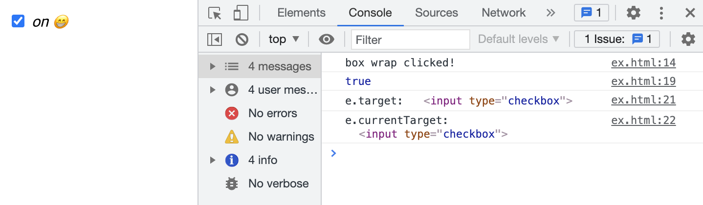

```
① 사용자의 입력에 의해 체크박스 요소의 체크 상태가 변경되면 checked 프로퍼티의 값이 변경되고 change 이벤트가 발생한다
② 이때 Event 타입의 이벤트 객체가 (동적으로) 생성된다
③ 이벤트 객체의 target 프로퍼티는 이벤트를 발생시킨 객체(checked)를 나타낸다
④ checked 프로퍼티는 현재의 체크 상태를 나타내게 된다
```

### 40.6 이벤트 전파 (propagation)

DOM 트리 상에 존재하는 DOM 요소 노드에서 발생한 이벤트는 DOM 트리를 통해 전파된다. 이를 <b>이벤트 전파(evnet propagation)</b>라고 한다.

```html
<!DOCTYPE html>
<html>
  <body>
    <ul id="fruits">
      <li id="apple">Apple</li>
      <li id="banana">Banana</li>
      <li id="orange">Orange</li>
    </ul>
  </body>
</html>
```

이때 이벤트 전파는 이벤트 객체가 전파되는 방향에 따라 다음과 같이 3단계로 구분할 수 있다.

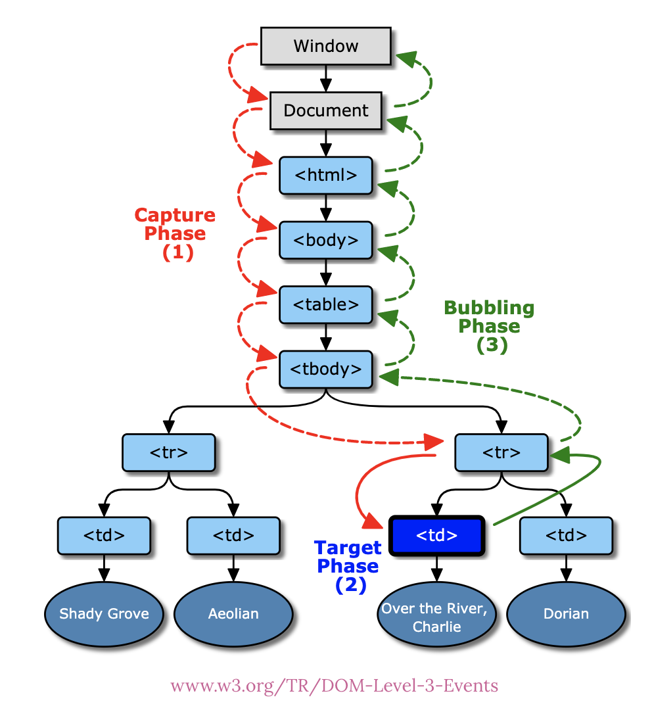

- 캡처링 단계(capturing phase) : 이벤트가 상위 요소에서 하위 요소 방향으로 전파
- 타깃 단계(target phase) : 이벤트가 이벤트 타깃에 도달
- 버블링 단계(bubbling phase) : 이벤트가 하위 요소에서 상위 요소 방향으로 전파

### 이벤트 캡처링과 버블링

기본적으로 브라우저에서는 버블링 단계(하위요소 > 상위 요소)에서 이벤트를 캐치한다

하지만 추가적인 과정을 통해 캡처링(상위요소 > 하위요소) 단계에서 이벤트를 캐치할 수도 있다.

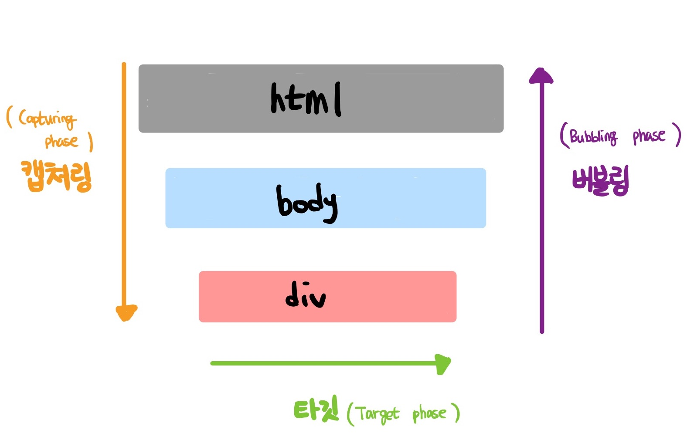

<details>

```html
<!DOCTYPE html>
<html lang="en">
  <head>
    <meta charset="UTF-8" />
    <meta http-equiv="X-UA-Compatible" content="IE=edge" />
    <meta name="viewport" content="width=device-width, initial-scale=1.0" />
    <title>Document</title>
  </head>
  <style>
    body {
      width: 100%;
      height: 100vh;
    }

    div {
      background-color: hotpink;
    }
  </style>
  <body>
    <div>Click me</div>
  </body>
  <script>
    const html = document.querySelector("html");
    const body = document.querySelector("body");
    const div = document.querySelector("div");

    /* 
  addEventListener의 [useCapture] 옵션은 기본적으로 false > 즉, 이벤트는 버블링 시 작용한다
  DIV
  BODY
  HTML
  */

    // default (버블링으로 이벤트 진행)

    html.addEventListener("click", () => console.log("HTML"));
    body.addEventListener("click", () => console.log("BODY"));
    div.addEventListener("click", () => console.log("DIV"));

    /*
  하지만 addEventListener의 [useCapture] 값으로 true를 준다면 캡처링 단계로 작용한다
  HTML
  BODY
  DIV
  */

    // true (캡처링으로 이벤트 진행)

    // html.addEventListener("click", () => console.log("HTML"), true);
    // body.addEventListener("click", () => console.log("BODY"), true);
    // div.addEventListener("click", () => console.log("DIV"));
  </script>
</html>

<!-- 김버그 님의 예제 코드 [https://www.youtube.com/watch?v=7gKtNC3b_S8&list=PLz33gzRxuWIAsQaxKYqHMjuqZkY3fCdVv&index=1] -->
```

</details>

### 40.7 이벤트 위임 (delegation)

<b>이벤트 위임은 여러 개의 하위 DOM 요소에 각각 이벤트 핸들러를 등록하는 대신 하나의 상위 DOM 요소에 이벤트 핸들러를 등록하는 방법</b>을 말한다. 이벤트 전파에서 살펴본 바와 같이 이벤트는 이벤트 타깃(e.target)은 물론 상위 DOM 요소에서도 캐치할 수 있다. <b>이벤트 위임을 통해 상위 DOM 요소에 이벤트 핸들러를 등록하면 여러 개의 하위 DOM 요소에 각각의 이벤트 핸들러를 등록할 필요가 없다.</b>

<details>

```html
<!DOCTYPE html>
<html>
  <head>
    <title>eventDelegation</title>
    <meta charset="UTF-8" />
    <style>
      body {
        font-family: sans-serif;
      }
      .btn-number {
        background-color: yellowgreen;
      }
    </style>
  </head>

  <body>
    <div class="container">
      <button class="btn-number">1</button>
      <button class="btn-number">2</button>
      <button class="btn-number">3</button>
      <button class="btn-number">4</button>
      <button class="btn-number">5</button>
    </div>
    <script>
      const div = document.querySelector("div");

      div.addEventListener("click", (e) => {
        console.log(e.target.innerHTML);
      });
    </script>
  </body>
</html>
```

[코드 실행해보기](https://codesandbox.io/s/recursing-shockley-8qzcj?file=/src/index.js:207-329)

```
<button> 태그들의 상위 DOM 요소인 container에 이벤트를 바인딩하여 e.target을 통해 이벤트 핸들러를 구현하였다
연속되는 button 태그에 대해서 개별적인 바인딩을 줄일 수 있는 것이 이벤트 위임(delegation)의 장점이다
```

</details>

### 40.8 DOM 요소의 기본 동작 조작

```
e.preventDefault >> DOM 요소의 기본 이벤트 동작 중단
e.stopPropagation >> 이벤트 전파(propagation) 중단
```

### e.preventDefault

```html
<!DOCTYPE html>
<html>
  <body>
    <a href="https://www.google.com">go</a>
    <input type="checkbox" />
    <script>
      document.querySelector("a").onclick = (e) => {
        // a 요소의 기본 동작을 중단한다.
        e.preventDefault();
      };

      document.querySelector("input[type=checkbox]").onclick = (e) => {
        // checkbox 요소의 기본 동작을 중단한다.
        e.preventDefault();
      };
    </script>
  </body>
</html>
```

```
리액트에서는 서버에 객체를 담은 데이터를 form 태그에 담아 보낼 때 불필요한 리렌더링이 방지하고, axios 메서드 등을 통해 보내기위해 사용한다.
```

### e.stopPropataion

브라우저는 일단 확실하게 이벤트가 발생한 button의 콜백함수를 실행하고, 상위에 있는 요소에 동일한 이벤트(click)가 등록 되어 있는지 탐색한다. 탐색 중 동일한 이벤트가 등록 되어 있는 요소가 있다면 해당 콜백 함수를 실행한다.

따라서 &lt;div&gt; 태그 내부에 &lt;button&gt; 태그의 click 이벤트를 발생시켜도, 상위 요소인 div 태그에도 click 이벤트가 있다면 해당 이벤트도 동작하게 한다. (브라우저의 default로 설정된 동작 원리이다)

<details>

```html
<!DOCTYPE html>
<html>
  <style>
    body {
      margin: 0;
      padding: 0;
    }
    div {
      width: 100%;
      height: 100vh;
      background-color: tomato;
      display: flex;
      justify-content: center;
      align-items: center;
    }

    button {
      width: 100px;
      height: 30px;
      display: flex;
      justify-content: center;
      align-items: center;
    }
  </style>
  <body>
    <div>
      <button>Button</button>
    </div>
    <script>
      const div = document.querySelector("div");
      const button = document.querySelector("button");

      div.addEventListener("click", () => {
        console.log("DIV");
      });

      button.addEventListener("click", (e) => {
        e.stopPropagation();
        console.log("BUTTON");
      });

      /* 
      이벤트 버블링이란 특정한 요소에서 어떤 이벤트가 발생했을 때, 상위에 있는 요소까지 이벤트가 전파 되는 것을 말한다.

      기본적으로 브라우저에서는 버블링 단계에서 이벤트가 동작하기 때문에, div 내부의 button만 콘솔을 찍기 위해서는
      이벤트의 위임을 막는 e.stopPropagation() 메서드를 사용한다.

      브라우저는 일단 확실하게 이벤트가 발생한 button의 콜백함수를 실행하고, 
      상위에 있는 요소에 동일한 이벤트(click)가 등록 되어 있는지 탐색한다. 
      탐색 중 동일한 이벤트가 등록 되어 있는 요소가 있다면 해당 콜백 함수를 실행한다.

      따라서 <div> 태그 내부에 <button> 태그의 click 이벤트를 발생시켜도, 
      상위 요소인 div 태그에도 click 이벤트가 있다면 해당 이벤트도 동작하게 한다.
      (브라우저의 default로 설정된 동작 원리이다)
      */
    </script>
  </body>
</html>
```

</details>

### 40.9 이벤트 핸들러 내부의 this

### 이벤트 핸들러 어트리뷰트 방식

이벤트 핸들러 함수도 일반함수와 같이 함수 내부에서 사용하는 this는 전역 객체 window를 가리킨다.

```html
<!DOCTYPE html>
<html>
  <body>
    <button onclick="handleClick()">Click me</button>
    <script>
      function handleClick() {
        console.log(this); // window
      }
    </script>
  </body>
</html>
```

단, 이벤트 핸들러를 호출할 때 <b>인수</b>로 전달한 this는 이벤트를 바인딩한 DOM 요소를 가리킨다.

```html
<!DOCTYPE html>
<html>
  <body>
    <button onclick="handleClick(this)">Click me</button>
    <script>
      function handleClick(button) {
        console.log(button); // 이벤트를 바인딩한 button 요소
        console.log(this); // window
      }
    </script>
  </body>
</html>
```

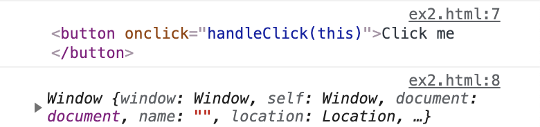

### 이벤트 핸들러 프로퍼티 방식과 addEventListner 방식

② 이벤트 핸들러 프로퍼티 방식 과 ③ addEventListner 방식 모두 이벤트 핸들러 내부의 this는 이벤트를 바인딩한 DOM 요소를 가리킨다.<br/>
즉, 이벤트 핸들러 내부의 this는 이벤트 객체의 currentTarget 프로퍼티와 같다.

<details>

```html
<!DOCTYPE html>
<html>
  <body>
    <button class="btn1">0</button>
    <button class="btn2">0</button>
    <script>
      const $button1 = document.querySelector(".btn1");
      const $button2 = document.querySelector(".btn2");

      // ② 이벤트 핸들러 프로퍼티 방식
      $button1.onclick = function (e) {
        // this는 이벤트를 바인딩한 DOM 요소를 가리킨다.
        console.log(this); // $button1
        console.log(e.currentTarget); // $button1
        console.log(this === e.currentTarget); // true

        // $button1의 textContent를 1 증가시킨다.
        ++this.textContent;
      };

      // ③ addEventListener 메서드 방식
      $button2.addEventListener("click", function (e) {
        // this는 이벤트를 바인딩한 DOM 요소를 가리킨다.
        console.log(this); // $button2
        console.log(e.currentTarget); // $button2
        console.log(this === e.currentTarget); // true

        // $button2의 textContent를 1 증가시킨다.
        ++this.textContent;
      });
    </script>
  </body>
</html>
```

</details>

화살표 함수로 정의한 이벤트 핸들러 내부의 this는 상위 스코프의 this를 가리킨다. 화살표 함수는 생성자 함수 (constructor)가 아니기 때문에 상위 스코프의 this를 참조한다.

<details>

```html
<!DOCTYPE html>
<html>
  <body>
    <button class="btn1">0</button>
    <button class="btn2">0</button>
    <script>
      const $button1 = document.querySelector(".btn1");
      const $button2 = document.querySelector(".btn2");

      // ② 이벤트 핸들러 프로퍼티 방식
      $button1.onclick = (e) => {
        // 화살표 함수 내부의 this는 상위 스코프의 this를 가리킨다.
        console.log(this); // window
        console.log(e.currentTarget); // $button1
        console.log(this === e.currentTarget); // false

        // this는 window를 가리키므로 window.textContent에 NaN(undefined + 1)을 할당한다.
        ++this.textContent;
      };

      // ③ addEventListener 메서드 방식
      $button2.addEventListener("click", (e) => {
        // 화살표 함수 내부의 this는 상위 스코프의 this를 가리킨다.
        console.log(this); // window
        console.log(e.currentTarget); // $button2
        console.log(this === e.currentTarget); // false

        // this는 window를 가리키므로 window.textContent에 NaN(undefined + 1)을 할당한다.
        ++this.textContent;
      });
    </script>
  </body>
</html>
```

</details>
