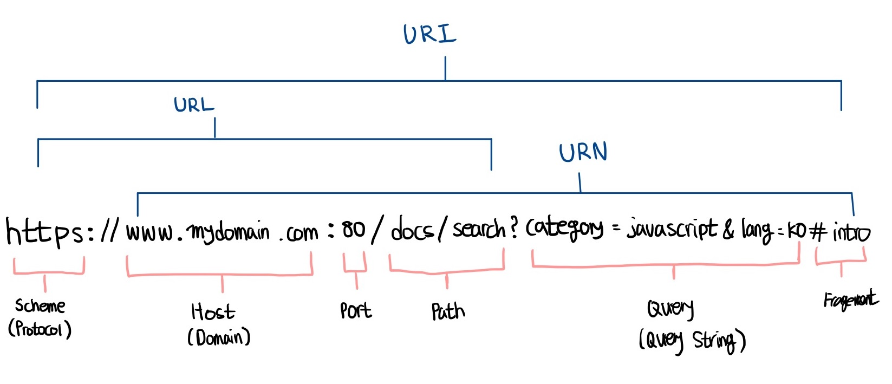

# 모던 자바스크립트 Deep Dive

## 목차

- [38장 브라우저 렌더링 과정](#38장-브라우저-렌더링-과정)

## 38장 브라우저 렌더링 과정

> 파싱, 렌더링

```
HTML 파싱과 DOM 생성
CSS 파싱과 CSSOM 생성
렌더 트리 생성
자바스크립트 파싱과 실행
리플로우와 리페인트
```

<p>구글의 V8 자바스크립트 엔진으로 빌드된 자바스크립트 런타임 환경인 Node.js의 등장으로 자바스크립트는 웹 브라우저를 벗어나 서버 사이드 애플리케이션 개발에서도 사용할 수 있는 범용 개발 언어가 되었다. (하지만 자바스크립트가 가장 많이 사용되는 분야는 웹페이지/애플리케이션의 클라이언트 사이드이다)</p>

<p>대부분의 프로그래밍 언어는 운영체제(OS: Operationg System)나 가상 머신(VM: Virtual Machine) 위에서 실행되지만 <b>웹 어플리케이션의 클라이언트 사이드 자바스크립트는 브라우저에서 HTML, CSS와 함께 실행된다.</b></p>

<p>브라우저가 ① HTML ② CSS ③ 자바스크립트로 작성된 문서를 어떻게 파싱(해석)하여 브라우저에 렌더링 하는지 살펴보자</p>

### 파싱 (parsing)

<p><b>파싱(구문 분석)</b>은 프로그래밍 언어의 문법에 맞게 작성된 텍스트 문서를 읽어 들여 실행하기 위해 텍스트 문서의 문자열을 토큰 단위로 분해하고, 토큰의 문법적 의미와 구조를 반영하여 <b>트리 구조의 자료구조인 파스 트리</b>를 생성하는 일련의 과정을 말한다.</p>

### 렌더링 (rendering)

<P>렌더링은 HTML, CSS, JS로 작성된 문서를 파싱하여 <b>브라우저에 시각적으로 출력하는 것</b>을 말한다.</P>

브라우저는 다음과 같은 과정을 거쳐 렌더링을 수행한다

```
① 브라우저는 HTML, CSS, JS, 이미지, 폰트 파일 등 렌더링에 필요한 리소스(자료)를 요청하고 서버로부터 응답 받는다

② 브라우저의 렌더링 엔진은 서버로부터 응답된 HTML과 CSS를 파싱하여 DOM과 CSSOM을 생성하고 이를 결합하여 렌더 트리를 생성한다

③ 브라우저의 자바스크립트 엔진은 서버로부터 응답된 자바스크립트를 파싱하여 AST(Abstract Syntax Tree)를 생성하고
바이트 코드로 변환하여 실행한다. 이때 자바스크립트는 DOM API를 통해 DOM이나 CSSOM을 변경할 수 있다. 변경된 DOM과 CSSOM은
다시 렌더 트리로 결합된다

④ 렌더 트리를 기반으로 HTML 요소의 레이아웃(위치와 크기)를 계산하고 브라우저 화면에 HTML 요소를 페인팅한다
```

### 38.1 요청과 응답

> 리소스, DNS

<p>브라우저의 핵심 기능은 필요한 리소스를 서버에 요청(request)하고 서버로부터 응답(response)받아 브라우저에 시각적으로 <b>렌더링</b>하는 것이다. 즉, 렌더링에 필요한 리소스(HTML, CSS, JS, 이미지, 폰트, ...)는 모두 서버에 존재하므로 필요한 리소스를 서버에 요청하고 서버가 응답한 리소스를 파싱하여 렌더링하는 것이다. </p>

```
① 서버에 요청을 전송하기 위해 브라우저는 주소창을 제공한다
② 브라우저의 주소창에 URL을 입력하고 엔터키를 누르면 (https://naver.com)
③ URL의 호스트 이름(도메인)이 DNS를 통해 IP 주소로 변환되고 (https://159.29.1.47:8080)
④ 이 IP 주소를 갖는 서버에게 요청을 전송한다 GET https://159.29.1.47:8080/index.html
```

### 리소스

[리소스](https://developer.mozilla.org/ko/docs/Web/HTTP/Basics_of_HTTP/Identifying_resources_on_the_Web)

<p>
HTTP 요청 대상을 "리소스"라고 부르는데, 그에 대한 본질을 이 이상으로 정의할 수 없습니다. 그것은 문서, 사진 또는 다른 어떤 것이든 될 수 있습니다. 각 리소스는 리소스 식별을 위해 HTTP 전체에서 사용되는 Uniform Resource Identifier (URI)에 의해 식별됩니다.

웹에서 리소스에 대한 식별과 위치는 대부분 단일 URL(Uniform Resource Locator, URI의 한 종류)로 제공됩니다. 그러나 때로 식별과 위치가 동일한 URI로 제공되지 않는데에는 이유가 있습니다. 요청된 리소스에 대해 클라이언트가 다른 위치에서 접근하도록 해야 할 경우, HTTP는 특정 HTTP 헤더인 Alt-Svc (en-US)을 사용합니다.

</p>

### DNS

<p>
DNS (Domain Name System)는 인터넷에 연결된 리소스를 위한 계층적이고 분산된 명명 시스템입니다. DNS는 도메인 이름 목록 과 연결된 리소스(예: IP 주소)를 유지 관리 합니다.

DNS의 가장 두드러진 기능은 인간에게 친숙한 도메인 이름(예: mozilla.org)을 숫자 IP 주소 (예: 151.106.5.172)로 변환하는 것입니다. 도메인 이름을 적절한 IP 주소에 매핑하는 이 프로세스를 DNS 조회라고 합니다. 반대로 rDNS( 역 DNS 조회 )는 IP 주소와 연결된 도메인 이름을 확인하는 데 사용됩니다.</p>



<p>예를 들어, 브라우저의 주소창에 https://poiemaweb.com을 입력하고 엔터 키를 누르면 <b>루트 요청(/, 스킴과 호스트만으로 구성된 URI에 의한 요청)</b>이 poiemaweb.com 서버로 전송된다. <b>루트 요청에는 명확히 리소스를 요청하는 내용이 없지만 일반적으로 서버는 루트 요청에 대해 암묵적으로 index.html을 응답하도록 기본 설정되어 있다.</b></p>

<P>따라서 서버는 루트 요청에 대해 서버의 루트 폴더에 존재하는 정적 파일(사전에 구성한 파일) index.html을 클라이언트(브라우저)로 응답한다.</P>

### 38.2 HTTP 1.1과 HTTP 2.0

<p><b>HTTP (HyperText Transfer Protocol)</b>는 웹에서 브라우저와 서버가 통신하기 위한 프로토콜(규약)이다. HTML, URL과 함께 팀 버너스 리 경이 고안한 HTTP는 1991년 최초로 문서화되었고 그 후로 지속적인 업그레이드와 함께 발표되고 있다.</p>

<p>HTTP/1.1은 기본적으로 커넥션 당 하나의 요청과 응답만 처리한다. 즉, 여러 개의 요청을 한 번에 전송할 수 없고 응답 또한 마찬가지다. 따라서 HTML 문서 내에 포함된 여러 개의 리소스 요청, 즉 CSS 파일을 로드하는 link 태그, 이미지 파일을 로드하는 img 태그, 자바스크립트를 로드하는 script 태그 등에 의한 리소스 요청이 개별적으로 전송되고 응답 또한 개별적으로 전송된다. 이처럼 HTTP/1.1은 리소스의 동시 전송이 불가능한 구조이므로 요청할 리소스의 개수에 비례하여 응답 시간도 증가하는 단점이 있다.</p>


<p>HTTP/2는 커넥션당 여러 개의 요청과 응답, 즉 다중 요청/응답이 가능하다. 여러 리소스의 동시 전송이 가능하므로 HTTP/1.1에 비해 페이지 로드 속도가 약 50% 정도 빠르다고 알려져 있다.</p>


### 38.3 HTML 파싱과 DOM 생성

> DOM

<p>브라우저의 요청에 의해 응답한 HTML 문서는 <b>문자열로 이루어진 순수한 텍스트다.</b> 이러한 HTML 문서를 브라우저에서 시각적인 픽셀로 렌더링하려면 <b>html 문서를 브라우저가 이해할 수 있는 자료구조(객체)로 변환하여 메모리에 저장해야 한다.</b></p>

예를 들어, 다음과 같은 index.html이 서버로부터 응답되었다고 해보자

```html
<!DOCTYPE html>
<html>
  <head>
    <meta charset="UTF-8" />
    <link rel="stylesheet" href="style.css" />
  </head>
  <body>
    <ul>
      <li id="apple">Apple</li>
      <li id="banana">Banana</li>
      <li id="orange">Orange</li>
    </ul>
    <script src="app.js"></script>
  </body>
</html>
```

<b>브라우저의 렌더링 엔진은 다음 그림과 같은 과정을 통해 응답받은 HTML 문서를 파싱하여 브라우저가 이해할 수 있는 자료구조인 DOM(Document Object Model)을 생성한다.</b>

<details>


</details>

<p>① 서버에ㅔ 존재하던 HTML 파일이 브라우저의 요청에 의해 응답된다. 이때 서버는 브라우저가 요청한 HTML 파일을 읽어 들여 메모리에 저장한 다음 메모리에 저장된 바이트(2진수)를 인터넷을 경유하여 응답한다</p>

<P>② 브라우저는 서버가 응답한 HTML 문서를 <b>바이트(2진수) 형태로</b> 응답받는다. 그리고 응답된 바이트 형태의 HTML 문서는 meta 태그의 charset 어트리뷰트에 의해 지정된 인코딩 방식(여기서는 UTF-8)을 기준으로 문자열로 변환된다. 브라우저는 이를 확인하고 문자열로 변환한다.</P>

<P>③ 문자열로 변환된 HTML 문서를 읽어 들여 문법적 의미를 갖는 코드의 최소 단위인 토큰(token)들로 분해한다.</P>

<P>④ 각 토큰들을 객체로 변환하여 노드들을 생성한다. 토큰의 내용에 따라 <b>⑴ 문서 노드 ⑵ 요소 노드 ⑶ 어트리뷰트 노드 ⑷ 텍스트 노드</b>가 생성된다. 노드는 이후 DOM을 구성하는 기본 요소가 된다.</P>

<P>⑤ HTML 문서는 HTML 요소들의 집합으로 이루어지며 HTML 요소는 중첩 관계를 갖는다. 즉, HTML 요소의 콘텐츠 영역(시작 태그와 종료 태그 사이)에는 텍스트뿐만 아니라 다른 HTML 요소도 포함될 수 있다. 이때 <b>HTML 요소 간에는 중첩 관계에 의해 부자(부모자식)관계가 형성된다. 이러한 HTML 요소 간의 부자 관계를 반영하여 모든 노드들을 트리 자료구조로 구성한다.</b> 이 노드들로 구성된 트리 자료구조를 DOM이라 부른다.</P>

> 즉, DOM은 HTML 문서를 파싱한 결과물이다

### 38.4 CSS 파싱과 CSSOM 생성

> CSSOM

<p>브라우저의 렌더링 엔진은 HTML을 <b>처음부터 한 줄 씩 순차적으로 파싱하여 DOM을 생성해 나간다.</b> 이처럼 렌더링 엔진은 DOM을 생성해 나가다 CSS를 로드하는 link 태그나 style 태그를 만나면 <b>DOM 생성을 일시 중단한다.</b> 그리고 link 태그의 href 어트리뷰트(속성)에 지정된 CSS 파일을 서버에 요청하여 로드한 CSS 파일이나 style 태그 내의 CSS를 HTML과 동일한 파싱 과정(바이트 > 문자 > 토큰 > 노드 > CSSOM)을 거치며 해석하여 CSSOM(CSS Object Model)을 생성한다. 이후 CSS 파싱이 완료되면 HTML 파싱이 중단된 지점부터 다시 HTML을 파싱하기 시작하여 DOM을 생성한다.</p>

```html
<!DOCTYPE html>
<html>
  <head>
    <meta charset="UTF-8" />
    <link rel="stylesheet" href="style.css" />
    ...
  </head>
</html>
```

href 어트리뷰트에 의해 style.css 파일이 서버로부터 응답이 완료되었다고 가정해보자

```css
body {
  font-size: 18px;
}

ul {
  list-style-type: none;
}
```

<p>서버로부터 CSS파일이 응답되면 렌더링 엔진은 HTML과 동일한 해석 과정(바이트 > 문자 >토큰 > 노드 > CSSOM)을 거쳐 CSS를 파싱하여 CSSOM을 생성한다. CSSOM은 CSS의 상속을 반영하여 생성된다. 최상위 부모 태그로부터 파생되는 구조일 경우, 최하위 자녀는 모든 style을 상속 받는다.</p>


### 38.5 렌더 트리 생성

> 렌더 트리

<p>렌더링 엔진은 서버로부터 응답된 HTML과 CSS를 파싱하여 각각 DOM과 CSSOM를 생성한다. 그리고 ① DOM과 ② CSSOM은 렌더링을 위해 <b>렌더 트리(render tree)</b>로 결합된다.</p>

<p><b>렌더 트리는 렌더링을 위한 트리 구조의 자료구조다.</b> 따라서 브라우저 화면에 렌더링되지 않는 노드(예: meta 태그, script 태그 등)와 CSS에 의해 비표시(display:none)되는 노드들은 포함되지 않는다. 다시 말해 <b>렌더 트리는 브라우저 화면에 렌더링되는 노드만으로 구성된다.</b></p>

<details>
<summary>렌더 트리 구조 보기</summary>


</details>

이후 완성된 렌더 트리는 각 HTML 요소의 레이아웃(위치와 크기)을 계산하는 데 사용되며 <b>브라우저 화면에 픽셀을 렌더링하는 페인팅(painting)처리에 입력된다.</b>


지금까지 살펴본 브라우저의 렌더링 과정은 반복해서 실행될 수 있다. 예를 들어, 다음과 같은 경우 반복해서 레이아웃 계산과 페인팅이 재차 실행된다.

- 자바스크립트에 의한 노드 추가 또는 삭제
- 브라우저 창의 리사이징에 의한 뷰포트(viewport) 크기 변경
- HTML 요소의 레이아웃(위치,크기)에 변경을 발생시키는 width/height, margin, padding, border, display, position 등의 스타일 변경

레이아웃 계산과 페인팅을 다시 실행하는 리렌더링은 <b>비용이 많이 드는, 성능에 악영향을 주는 작업이다. 최대한 빈번하게 발생하지 않도록 주의할 필요가 있다.</b>

### 38.6 자바스크립트 파싱과 실행

> 렌더링 엔진, 자바스크립트 엔진, AST (추상적 구문 트리)

<p><b>HTML 문서를 파싱한 결과물로서 생성된 DOM</b>은 HTML 문서의 구조와 정보뿐만 아니라 HTML 요소와 스타일 등을 변경할 수 있는 프로그래밍 인터페이스로서 <b>DOM API</b>를 제공한다. 즉, 자바스크립트 코드에서 DOM API를 사용하면 이미 생성된 DOM을 동적으로 조작할 수 있다.</p>

<p>CSS 파싱 과정과 마찬가지로 <b>① 렌더링 엔진</b>은 HTML을 한 줄씩 순차적으로 파싱하며 DOM을 생성해 나가다가 자바스크립트 파일을 로드하는 &lt;script&gt; 태그나 자바스크립트 코드를 콘텐츠로 담은 &lt;script&gt; 태그를 만나면 DOM 생성을 일시 중단한다.</p>

<p>그리고 &lt;script&gt; 태그의 src 어트리뷰트에 정의된 자바스크립트 파일을 서버에 요청하여 로드한 자바스크립트 파일이나 &lt;script&gt; 태그 내의 자바스크립트 코드를 파싱하기 위해 <b>② 자바스크립트 엔진에</b> 제어권을 넘긴다. 이후 자바스크립트 파싱과 실행이 종료되면 <b>① 렌더링 엔진</b>으로 다시 제어권을 넘겨 HTML 파싱이 중단된 지점부터 다시 HTML 파싱을 시작하여 DOM 생성을 재개한다.</p>

<p>자바스크립트 파싱과 실행은 <b>① 브라우저 렌더링 엔진이 아닌 ② 자바스크립트 엔진</b>이 처리한다. <b>② 자바스크립트 엔진은 자바스크립트 코드를 파싱하여 CPU가 이해할 수 있는 저수준 언어(low-level language)로 변환하고 실행하는 역할을 한다.</b></p>

<p><b>① 렌더링 엔진</b>으로부터 제어권을 넘겨받은 <b>② 자바스크립트 엔진</b>은 자바스크립트 코드를 파싱하기 시작한다. 렌더링 엔진이 HTML과 CSS를 파싱하여 DOM과 CSSOM을 생성하듯이 <b>② 자바스크립트 엔진</b>은 자바스크립트를 해석하여 <b>AST(Abstract Syntax Tree: 추상적 구문 트리)</b>를 생성한다. 그리고 AST를 기반으로 인터프리터가 실행할 수 있는 중간 코드(intermediate code)인 바이트코드를 생성하여 실행한다.</p>

### 38.7 리플로우와 리페인트

<p>만약 자바스크립트 코드에 DOM이나 CSSOM을 변경하는 <b>DOM API</b>가 사용된 경우 DOM이나 CSSOM이 변경된다. 이때 변경된 DOM과 CSSOM은 다시 렌더 트리로 결합되고 변경된 렌더 트리를 기반으로 <b>레이아웃과 페인트 과정을 거쳐 브라우저의 화면에 다시 렌더링한다. 이를 리플로우(reflow), 리페인트(repaint)</b>라 한다.</p>


### 리플로우

```
리플로우는 레이아웃 계산을 다시 하는 것을 말하며, 노드 추가/삭제, 요소의 크기/위치 변경, 윈도우 리사이징 등
레이아웃에 영향을 주는 변경이 발생한 경우에 한하여 실행된다
```

### 리페인트

```
리페인트는 재결합된 렌더 트리를 기반으로 다시 페인트를 하는 것을 말한다
```

### 38.9 script 태그의 async/defer 어트리뷰트

다음 경우를 생각해 보자

```html
<!DOCTYPE html>
<html>
  <head>
    <meta charset="UTF-8" />
    <link rel="stylesheet" href="style.css" />
    <script>
      const $apple = document.getElementById("apple");
      $apple.style.color = "red";
    </script>
  </head>
  <body>
    <ul>
      <li id="apple">Apple</li>
      <li id="banana">Banana</li>
      <li id="orange">Orange</li>
    </ul>
  </body>
</html>
```

<p>자바스크립트 엔진은 위에서부터 아래로 차례대로 코드를 실행한다. &lt;script&gt; 태그가 body 태그보다 위에 생성되어 있는데, 해당 스크립트 내부의 코드를 보면 바디 태그에 포함된 요소인 apple을 동적으로 스타일링을 추가하는 코드이다. 위 코드는 에러가 발생할 것이다. <b> (DOM API인 document.getElementById는 DOM에서 id가 'apple'인 HTML 요소를 취득한다. 아래 DOM API가 실행되는 시점에는 아직 id가 'apple'인 HTML 요소를 파싱하지 않았기 때문에 DOM에는 id가 'apple'인 HTML 요소가 포함되어 있지 않다. 따라서 아래 코드는 정상적으로 id가 'apple'인 HTML 요소를 취득하지 못한다.)</b></p>

<p>이렇게 동기적으로 코드를 실행하는 자바스크립트에서 이러한 근본적인 문제를 해결하기 위해 &lt;script&gt; 태그에 <b>① async ② defer</b> 어트리뷰트가 추가되었다.</p>

<p><b>① async ② defer</b> 어트리뷰트는 다음과 같이 <b>src</b> 어트리뷰트를 통해 외부 자바스크립트 파일을 로드하는 경우에만 사용할 수 있다. 위 코드처럼 &lt;script&gt; 태그 내부에 코드를 작성하는 경우에는 사용할 수 없다.</p>

### async 어트리뷰트

<p>HTML 파싱과 외부 자바스크립트 파일의 로드가 비동기적으로 동시에 진행된다. <b>단, 자바스크립트의 파싱과 실행은 자바스크립트의 파일의 로드가 완료된 직후 진행되며, 이때 HTML 파싱은 중단된다.</b></p>


<p>여러 개의 script 태그에 async 어트리뷰트를 지정하면 script 태그의 순서와는 상관없이 로드가 완료된 자바스크립트부터 먼저 실행되므로 순서가 보장되지 않는다.</p>

### defer 어트리뷰트

<p>async 어트리뷰트와 마찬가지로 HTML 파싱과 외부 자바스크립트 파일의 로드가 비동기적으로 동시에 진행된다. 단, <b>자바스크립트의 파싱과 실행은 HTML 파싱이 완료된 직후, 즉 DOM 생성이 완료된 직후 진행된다.</b> 따라서 DOM 생성이 완료된 이후 실행되어야 할 자바스크립트에 유용하다.</p>


