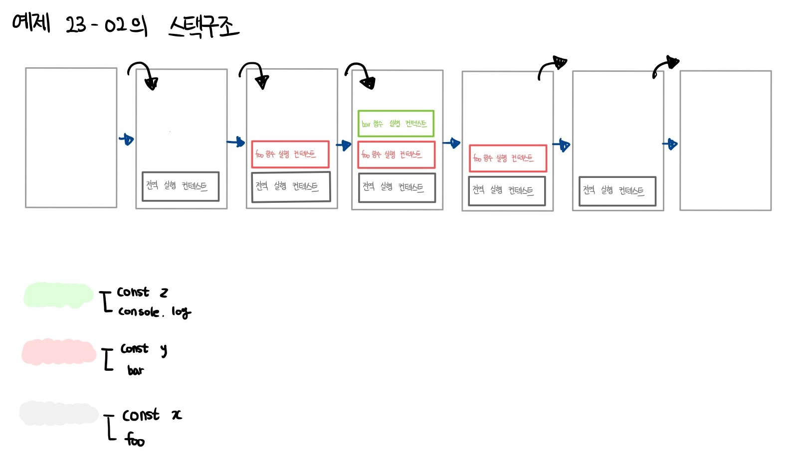
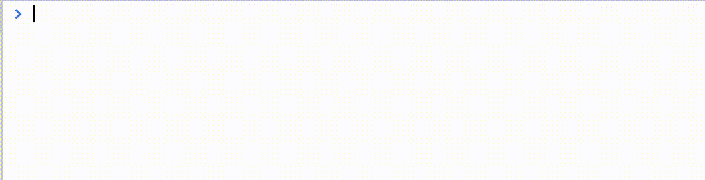

# 모던 자바스크립트 Deep Dive

## 목차

- [41장 타이머](#41장-타이머)
- [42장 비동기 프로그래밍](#42장-비동기-프로그래밍)

## 41장 타이머

### 41.1 호출 스케쥴링

함수를 명시적으로 호출하면 함수가 즉시 실행된다.

```js
function add(a, b) {
  return a + b;
}

console.log(add(2, 5)) >>> 7;
```

만약 <b>함수를 명시적으로 호출하지 않고 일정 시간이 경과된 이후에 호출되도록 함수 호출을 예약</b>하려면 <b>타이머 함수</b>를 사용한다. 이를 <b>호출 스케줄링(scheduling a call)</b>이라 한다.

자바스크립트는 ① 타이머를 생성할 수 있는 타이머 함수 setTimeout과 setInterval, ② 타이머를 제거할 수 있는 타이머 함수 clearTimeout과 clearInterval을 제공한다. 타이머 함수는 ECMAScript 사양에 정의된 빌트인 함수가 아니다. <b>브라우저 환경과 Node.js 환경에서 모두 전역 객체의 메서드로서 타이머 함수를 제공한다. 즉, 타이머 함수는 호스트 객체이다.</b>

setTimeout 함수가 생성한 타이머는 단 한 번 동작하고, setInterval 함수가 생성한 타이머는 반복 동작한다.

자바스크립트 엔진은 단 하나의 실행 컨텍스트 스택을 갖기 때문에 두 가지 이상의 태스크(task)를 동시에 실행할 수 없다. 즉, 자바스크립트 엔진은 싱글 스레드로 동작한다. 이러한 이유로 타이머 함수는 비동기 처리 방식으로 동작한다.

### 41.2 타이머 함수

### setTimeout / clearTimeout

```js
const timeoutdId = setTimeout(func|code[, delay, param1, param2, ...]);
```

| 매개변수            | 설명                                                                                                                                                         |
| :------------------ | :----------------------------------------------------------------------------------------------------------------------------------------------------------- |
| func                | 타이머가 만료된 뒤 호출될 콜백 함수 <br/> 콜백 함수 대신 코드를 문자열로 전달할 수 있다. 이때 코드 문자열은 타이머가 만료된 뒤 해석되고 실행된다.            |
| delay               | 타이머 만료 시간(밀리초(ms) 단위), setTimeout 함수는 delay 시간으로 단 한 번 동작하는 타이머를 생성한다. <br/> 인수 전달을 생략한 경우 기본 값 0이 지정된다. |
| param1, param2, ... | 호출 스케줄링된 콜백 함수에 전달해야 할 인수가 존재하는 경우 세 번째 이후의 인수로 전달할 수 있다.                                                           |

```js
// 1초(1000ms) 후 타이머가 만료되면 콜백 함수가 호출된다.
setTimeout(() => console.log("Hi!"), 1000);

// 세 번째 인수로 문자열 'Lee' 전달
setTimeout((name) => console.log(`Hi! ${name}.`), 1000, "Lee");

// 두 번째 인수(delay)를 생략하면 기본값 0이 지정된다.
setTimeout(() => console.log("Hello!"));
```

setTimeout 함수는 생성된 타이머를 식별할 수 있는 고유한 타이머를 식별할 수 있는 고유한 id를 반환한다. setTimeout 함수가 반환한 타이머 id는 <b>① 브라우저 환경일 경우 숫자</b>이며 <b>② Node.js 환경인 경우 객체</b>다

setTimeout 함수가 반환한 타이머 id를 clearTimeout 함수의 인수로 전달하여 타이머를 취소할 수 있다.

```js
const timerId = setTimeout(() => console.log("Hi!"), 1000);
console.log(timeId);

clearTimeout(timerId);
```

#### 브라우저에서 보기


### setInterval/ clearInterval

setInterval 함수는 두 번째 인수로 전달받은 시간(ms, 1/1000초)으로 <b>반복 동작하는 타이머를 생성한다.</b> setInterval의 첫 번째 인수인 콜백 함수는 두 번째 인수로 전달받은 시간이 경과할 때마다 반복 실행되도록 <b>호출 스케줄링된다.</b>

```js
const timeoutdId = setInterval(func|code[, delay, param1, param2, ...]);
```

setInterval 함수는 생성된 타이머를 식별할 수 있는 고유한 타이머 id를 반환한다. Node.js 환경인 경우 객체를 반환한다.

```js
let count = 1;

const timeoutId = setInterval(() => {
  console.log(count); // 1 2 3 4 5

  if (count++ === 5) clearInterval(timeoutId);
}, 1000);

console.log("timeoutId: ", timeoutId);
```

### Node.js 환경에서 보기


### 41.3 디바운스와 스로틀

scroll, resize, mousemove 같은 이벤트는 짧은 시간 간격으로 연속해서 발생한다. 이러한 이벤트에 바인딩한 이벤트 핸들러는 과도하게 호출되어 성능에 문제를 일으킬 수 있다. <b>디바운스와 스로틀은 짧은 시간 간격으로 연속해서 발생하는 이벤트를 그룹화해서 과도한 이벤트 핸들러의 호출을 방지하는 프로그래밍 기법이다.</b>

```html
<!DOCTYPE html>
<html>
  <body>
    <button>click me</button>
    <pre>일반 클릭 이벤트 카운터    <span class="normal-msg">0</span></pre>
    <pre>디바운스 클릭 이벤트 카운터 <span class="debounce-msg">0</span></pre>
    <pre>스로틀 클릭 이벤트 카운터   <span class="throttle-msg">0</span></pre>
    <script>
      const $button = document.querySelector("button");
      const $normalMsg = document.querySelector(".normal-msg");
      const $debounceMsg = document.querySelector(".debounce-msg");
      const $throttleMsg = document.querySelector(".throttle-msg");

      const debounce = (callback, delay) => {
        let timerId;
        return (event) => {
          if (timerId) clearTimeout(timerId);
          timerId = setTimeout(callback, delay, event);
        };
      };

      const throttle = (callback, delay) => {
        let timerId;
        return (event) => {
          if (timerId) return;
          timerId = setTimeout(
            () => {
              callback(event);
              timerId = null;
            },
            delay,
            event
          );
        };
      };

      $button.addEventListener("click", () => {
        $normalMsg.textContent = +$normalMsg.textContent + 1;
      });

      $button.addEventListener(
        "click",
        debounce(() => {
          $debounceMsg.textContent = +$debounceMsg.textContent + 1;
        }, 500)
      );

      $button.addEventListener(
        "click",
        throttle(() => {
          $throttleMsg.textContent = +$throttleMsg.textContent + 1;
        }, 500)
      );
    </script>
  </body>
</html>
```


### 디바운스 (debounce)

디바운스(debounce)는 짧은 시간 간격으로 이벤트가 연속해서 발생하면 이벤트 핸들러를 호출(call)하지 않다가 일정 시간이 경과된 이후에 이벤트 핸들러가 한 번만 호출되도록 한다.

즉 <b>디바운스는 짧은 시간 간격으로 발생하는 이벤트를 그룹화해서 마지막에 한 번만 이벤트 핸들러가 호출되도록 한다.</b>


[코드종님의 유튜브 강의](https://www.youtube.com/watch?v=TZCiv_c5q8s)

- 마지막 이벤트(space)를 바탕으로 일정 시간이 지나야 다시 호출할 수 있게 하는 것이 디바운스다
- 마지막 이벤트를 발생한 이후(빨간색) 일정 시간이 지나 회복된 상태(초록색)에서 새로운 이벤트를 다시 실행할 수 있다.

텍스트 입력 필드에서 input 이벤트가 짧은 시간 간격으로 연속해서 발생하는 경우, 디바운스를 통해 Ajax와 같은 요청의 빈도를 줄여 서버에 부하를 줄일 수 있다.

```html
<!DOCTYPE html>
<html>
  <body>
    <input type="text" />
    <div class="msg"></div>
    <script>
      const $input = document.querySelector("input");
      const $msg = document.querySelector(".msg");

      const debounce = (callback, delay) => {
        let timerId;
        // debounce 함수는 timerId를 기억하는 클로저를 반환한다.
        return (event) => {
          // delay가 경과하기 이전에 이벤트가 발생하면 이전 타이머를 취소하고
          // 새로운 타이머를 재설정한다.
          // 따라서 delay보다 짧은 간격으로 이벤트가 발생하면 callback은 호출되지 않는다.
          if (timerId) clearTimeout(timerId);
          timerId = setTimeout(callback, delay, event);
        };
      };

      // debounce 함수가 반환하는 클로저가 이벤트 핸들러로 등록된다.
      // 300ms보다 짧은 간격으로 input 이벤트가 발생하면 debounce 함수의 콜백 함수는
      // 호출되지 않다가 300ms 동안 input 이벤트가 더 이상 발생하면 한 번만 호출된다.
      $input.oninput = debounce((e) => {
        $msg.textContent = e.target.value;
      }, 300);
    </script>
  </body>
</html>
```


검색 창에서 매 클릭 이벤트 (e.target.value) 마다 ajax 요청을 보내는 것보다 디바운스를 통해 일정 기간을 바탕으로 마지막 이벤트에 대한 ajax 요청을 보내는 것이 서버의 부하를 줄이는 데 더욱 효율적일 것이다.

### 쓰로틀 (throttle)

쓰로틀(throttle)은 짧은 시간 간격으로 이벤트가 연속해서 발생하더라도 일정 시간 간격으로 이벤트 핸들러가 최대 한 번만 호출되도록 한다.

스로틀은 짧은 시간 간격으로 연속해서 발생하는 이벤트를 그룹화해서 일정 시간 단위로 이벤트 핸들러가 호출되도록 호출 주기를 만든다.


[코드종님의 유튜브 강의](https://www.youtube.com/watch?v=TZCiv_c5q8s)

- 이벤트를 지속적으로 발생시키고 있다고 하더라도 위에 설정된 300ms의 시간을 간격으로 두고 이벤트를 발생시킨다
- 쓰로틀에서 지정한 delay(300ms)의 사이에 발생하는 이벤트들은 무시된다

```html
<!DOCTYPE html>
<html>
  <head>
    <style>
      .container {
        width: 300px;
        height: 300px;
        background-color: rebeccapurple;
        overflow: scroll;
      }

      .content {
        width: 300px;
        height: 1000vh;
      }
    </style>
  </head>
  <body>
    <div class="container">
      <div class="content"></div>
    </div>
    <div>
      일반 이벤트 핸들러가 scroll 이벤트를 처리한 횟수:
      <span class="normal-count">0</span>
    </div>
    <div>
      스로틀 이벤트 핸들러가 scroll 이벤트를 처리한 횟수:
      <span class="throttle-count">0</span>
    </div>

    <script>
      const $container = document.querySelector(".container");
      const $normalCount = document.querySelector(".normal-count");
      const $throttleCount = document.querySelector(".throttle-count");

      const throttle = (callback, delay) => {
        let timerId;
        // throttle 함수는 timerId를 기억하는 클로저를 반환한다.
        return (event) => {
          // delay가 경과하기 이전에 이벤트가 발생하면 아무것도 하지 않다가
          // delay가 경과했을 때 이벤트가 발생하면 새로운 타이머를 재설정한다.
          // 따라서 delay 간격으로 callback이 호출된다.
          if (timerId) return;
          timerId = setTimeout(
            () => {
              callback(event);
              timerId = null;
            },
            delay,
            event
          );
        };
      };

      let normalCount = 0;
      $container.addEventListener("scroll", () => {
        $normalCount.textContent = ++normalCount;
      });

      let throttleCount = 0;
      // throttle 함수가 반환하는 클로저가 이벤트 핸들러로 등록된다.
      $container.addEventListener(
        "scroll",
        throttle(() => {
          $throttleCount.textContent = ++throttleCount;
        }, 1000)
      );
    </script>
  </body>
</html>
```


- scroll 이벤트는 사용자가 스크롤할 때 짧은 시간 간격으로 연속해서 발생한다
- 이처럼 짧은 시간 간격으로 연속해서 발생하는 이벤트의 과도한 이벤트 핸들러의 호출을 방지하기 위해 throttle 함수를 통해 호출 주기를 만든다
- 쓰로틀은 scroll 이벤트 처리나 무한 스크롤 UI 구현 등에 유용하게 사용된다

### Lodash

[Lodash 공식문서](https://lodash.com/docs/4.17.15#debounce)

예제를 통해서는 throttle과 debounce에 관해 직접 선언하고 호출했지만, lodash 등을 통해서 더 안전한 코드를 제공받을 수 있다

### 레퍼런스

[코드종님의 유튜브 강의](https://www.youtube.com/watch?v=TZCiv_c5q8s)

> 해당 게임 예제는 유튜브 링크를 통해 들어가서 직접 구현해볼 수 있습니다

## 42장 비동기 프로그래밍

### 42.1 동기 처리와 비동기 처리

자바스크립트 엔진은 기본적으로 함수를 호출하면 함수 코드가 평가되어 함수 실행 컨텍스트가 생성된다. 이때 생성된 함수 실행 컨텍스트는 실행 컨텍스트 스택(콜 스택이라고도 부름)에 푸시되고 함수 코드가 실행된다. 함수 코드의 실행이 종료되면 함수 실행 컨텍스트는 실행 컨텍스트 스택에서 팝되어 제거된다

```js
const x = 1;

function foo() {
  const y = 2;

  function bar() {
    const z = 3;
    console.log(x + y + z);
  }
  bar();
}

foo(); // 6
```



함수가 실행되려면 ① 함수 코드 평가 과정에서 생성된 함수 실행 컨텍스트가 실행 컨텍스트 스택에 푸시되어야 한다. 다시 말해, <b>실행 컨텍스트 스택에 함수 실행 컨텍스트가 푸시되는 것은 바로 함수 실행의 시작을 의미한다.</b> 함수가 호출된 순서대로 순차적으로 실행되는 이유는 <b>함수가 호출된 순서대로 함수 실행 컨텍스트가 실행 컨텍스트 스택에 푸시되기 때문이다. 이처럼 함수의 실행 순서는 실행 컨텍스트 스택으로 관리한다.</b>


자바스크립트 엔진은 단 하나의 실행 컨텍스트 스택 구조를 갖는다. 이는 함수를 실행할 수 있는 창구가 단 하나이며, 동시에 2개 이상의 함수를 실행할 수 없다는 것을 의미한다. 실행 컨텍스트의 최상위 요소인 '실행 중인 실행 컨텍스트'를 제외한 모든 실행 컨텍스트는 모두 실행 대기 중인 태스크들이다. 대기 중인 태스크들은 현재 실행 중인 실행 컨텍스트가 팝(pop)되어 실행 컨택스트 스택에서 제거되면, 비로소 실행되기 시작한다.

자바스크립트 엔진은 한 번에 하나의 태스크(작업, 일)만 실행할 수 있는 싱글 스레드 방식으로 동작한다. 싱글 스레드 방식은 한 번에 하나의 태스크만 실행할 수 있기 때문에 처리에 시간이 걸리는 태스크를 실행하는 경우 블로킹(작업중단)이 발생한다.

> setTimeout 함수와 유사하게 일정 시간이 경과한 이후에 콜백 함수를 호출하는 sleep 함수를 구현해 보자

```js
function sleep(func, delay) {
  const delayUntil = Date.now() + delay;

  // 현재 시간(Date.now())에 delay를 더한 delayUntil이 현재 시간보다 작으면 계속 반복한다.
  while (Date.now() < delayUntil);
  // 일정 시간(delay)이 경과한 이후에 콜백 함수(func)를 호출한다.
  func();
}

function foo() {
  console.log("foo");
}

function bar() {
  console.log("bar");
}

sleep(foo, 3000);
bar();
```


위 예제의 sleep 함수는 3초 후에 foo 함수를 호출한다. 이때 bar 함수는 sleep 함수의 실행이 종료된 이후에 호출되므로 3초 이상 호출되지 못하고 블로킹된다.

이처럼 현재 실행 중인 태스크가 종료될 때까지 다음에 실행될 태스크가 대기하는 방식을 동기(synchronous) 처리라고 한다. 동기 처리 방식은 태스크를 순서대로 하나씩 처리하므로 실행 순서가 보장된다는 장점이 있지만, 앞선 태스크가 종료할 때까지 이후 태스크들이 블로킹되는 단점이 있다.


위 예제를 호출 스케줄링이 가능하도록 하는 타이머 함수를 사용하여 만들어 보자

```js
function foo() {
  console.log("foo");
}

function bar() {
  console.log("bar");
}

// 타이머 함수 setTimeout은 일정 시간이 경과한 이후에 콜백 함수 foo를 호출한다.
// 타이머 함수 setTimeout은 bar 함수를 블로킹하지 않는다.
setTimeout(foo, 3 * 1000);
bar();
```


setTimeout 함수는 앞서 살펴본 sleep 함수와 유사하게 일정 시간이 경과한 이후에 콜백 함수를 호출하지만 setTimeout 함수 이후의 태스크(여기서는 bar)를 블로킹하지 않고 곧바로 실행한다. 이처럼 현재 실행 중인 태스크가 종료되지 않은 상태라 해도 다음 태스크를 곧바로 실행하는 방식을 비동기(asynchronous) 처리라고 한다.


비동기 처리 방식은 현재 실행 중인 태스크가 종료되지 않은 상태라 해도 다음 태스크를 곧바로 실행하므로 블로킹이 발생하지 않는다는 장점이 있다. 하지만 동시에 태스크의 실행 순서가 보장되지 않는 단점이 있다.

타이머 함수인 ① setTimeout 과 setInterval ② HTTP 요청 ③ 이벤트 핸들러 는 비동기 처리 방식으로 동작한다.

비동기 처리는 이벤트 루프와 태스크 큐와 깊은 관계가 있다.

### 42.2 이벤트 루프와 태스크 큐

자바스크립트의 특징 중 하나는 싱글 스레드로 동작한다는 것이다. 앞서 살펴본 바와 같이 싱글 스레드 방식은 한 번에 하나의 태스크만 처리할 수 있다는 것을 의미한다. 하지만 브라우저가 동작하는 것을 살펴보면 많은 태스크가 동시에 처리되는 것처럼 느껴진다.

예를 들어, HTML 요소가 애니메이션 효과를 통해 움직이면서 이벤트를 처리하기도 하고, HTTP 요청을 통해 서버로부터 데이터를 가지고 오면서 렌더링하기도 한다. 이처럼 자바스크립트의 동시성을 지원하는 것이 바로 이벤트 루프(event loop)다.

이벤트 루프는 <b>브라우저</b>에 내장되어 있는 기능 중 하나다. 브라우저 환경을 그림으로 표현하면 다음과 같다.


구글의 v8 자바스크립트 엔진을 비롯한 대부분의 자바스크립트 엔진은 크게 2개의 영역으로 구분할 수 있다.

### 📍 콜 스택 (call stack)

- 소스코드(전역 코드 및 함수 코드 등) 평가 과정에서 생성된 실행 컨텍스트가 추가되고 제거되는 스택 자료구조인 실행 컨텍스트 스택이 바로 콜 스택이다.

- 함수를 호출하면 함수 실행 컨텍스트가 순차적으로 콜 스택에 푸시되어 순차적으로 실행된다. 자바스크립트 엔진은 단 하나의 콜 스택을 사용하기 때문에 최상위 실행 컨텍스트(실행 중인 실행 컨텍스트)가 종료되어 콜 스택에서 제거되기 전까지는 다른 어떤 태스크도 실행되지 않는다.

### 📍 힙 (heap)

- 힙은 객체가 저장되는 메모리 공간이다. 콜 스택의 요소인 실행 컨텍스트는 힙에 저장된 객체를 참조한다.

- 메모리에 값을 저장하려면 먼저 값을 저장할 메모리 공간의 크기를 결정해야 한다. 객체는 원시 값과는 달리 크기가 정해져 있지 않으므로 할당해야 할 메모리 공간의 크기를 런타임에 결정(동적 할당)해야 한다. 따라서 객체가 저장되는 메모리 공간인 힙은 구조화되어 있지 않다는 특징이 있다.

이처럼 콜 스택과 힙으로 구성되어 있는 자바스크립트 엔진은 단순히 태스크가 요청되면 콜 스택을 통해 요청된 작업을 순차적으로 실행할 뿐이다. 비동기 처리에서 ① 소스코드의 평가와 ② 실행을 제외한 모든 처리는 자바스크립트 엔진을 구동하는 환경인 브라우저 또는 Node.js가 담당한다.

예를 들어,

① 비동기 방식으로 동작하는 setTimeout의 콜백 함수의 평가와 실행은 자바스크립트 엔진이 담당하지만

② 호출 스케줄링을 위한 타이머 설정과 콜백 함수의 등록은 브라우저 또는 Node.js가 담당한다.

이를 위해 브라우저 환경은 태스크 큐와 이벤트 루프를 제공한다.

### 📍 태스크 큐 (task queue/event queue/callback queue)

- setTimeout이나 setInterval과 같은 비동기 함수의 콜백 함수 또는 이벤트 핸들러가 일시적으로 보관되는 영역이다.
- 태스크 큐와는 별도로 프로미스 후속 처리 메서드의 콜백 함수가 일시적으로 보관되는 마이크로태스크 큐도 존재한다.

### 큐 (queue)

- 스택 자료구조와 달리 선입선출(먼저 들어온 것이 먼저 나가는) 형식을 띈다
- F.I.F.O(First In First Out) 라고도 부른다


### 📍 이벤트 루프 (event loop)

- 이벤트 루프는 콜 스택에 현재 실행 중인 실행 컨텍스트가 있는지, 그리고 태스크 큐에 대기 중인 함수(콜백 함수, 이벤트 핸들러 등)가 있는지 반복해서 확인한다.
- 만약 콜 스택이 비어 있고 태스크 큐에 대기 중인 함수가 있다면 이벤트 루프는 순차적(FIFO)으로 태스크 큐에 대기 중인 함수를 콜 스택으로 이동시킨다.
- 이때 콜 스택으로 이동한 함수는 실행된다. 즉, 태스크 큐에 일시 보관된 함수들을 비동기 처리 방식으로 동작한다.

### 동작 과정

> 브라우저 환경에서 다음 예제가 어떻게 동작할 지 살펴보자

```js
function foo() {
  console.log("foo");
}

function bar() {
  console.log("bar");
}

setTimeout(foo, 0); // 0초(실제는 4ms) 후에 foo 함수가 호출된다.
bar();
```

1. 전역 코드가 평가되어 전역 실행 컨텍스트가 생성되고 콜 스택에 푸시된다.
2. 전역 코드가 실행되기 시작하여 setTimeout 함수가 호출된다. 이때 setTimeout 함수의 실행 컨텍스트가 생성되고 콜 스택에 푸시되어 현재 실행 중인 컨텍스트가 된다. 브라우저의 Web API(호스트 객체)인 타이머 함수도 함수이므로 함수 실행 컨텍스트를 생성한다.
3. setTimeout 함수가 실행되면 콜백 함수를 📍 호출 스케줄링하고 종료되어 콜 스택에서 팝된다. 이때 호출 스케줄링, 즉 타이머 설정과 타이머가 만료되면 콜백 함수를 태스크 큐에 푸시하는 것은 브라우저의 역할이다.
4. 브라우저가 수행하는 4-1과 자바스크립트 엔진이 수행하는 4-2는 병행 처리된다.

   4.1 브라우저는 타이머를 설정하고 타이머의 만료를 기다린다. 이후 타이머가 만료되면 콜백 함수 foo가 태스크 큐에 푸시된다.

   위 예제의 경우 지연 시간(delay)이 0이지만 지연 시간이 4ms 이하인 경우 최소 지연 시간 4ms가 지정된다. 따라서 4ms 후에 콜백 함수 foo가 태스크 큐에 푸시되어 대기하게 된다.

   이 처리 또한 자바스크립트 엔진이 아니라 브라우저가 수행한다. 이처럼 setTimeout 함수로 호출 스케줄링한 콜백 함수는 정확히 지연 시간 후에 호출된다는 보장은 없다.

   지연 시간 이후에 콜백 함수가 태스크 큐에 푸시되어 대기하게 되지만 콜 스택이 비어야 호출되므로 약간의 시간차가 발생할 수 있기 때문이다.

   4.2 bar 함수가 호출되어 bar 함수의 함수 실행 컨텍스트가 생성되고 콜 스택에 푸시되어 현재 실행 중인 컨텍스트가 된다. 이후 bar 함수가 종료되어 콜 스택에서 팝된다.

   이때 브라우저가 타이머를 설정한 후 4ms가 경과했다면 foo 함수는 아직 태스크 큐에서 대기 중이다.

5. 전역 코드 실행이 종료되고 전역 실행 컨텍스트가 콜 스택에서 팝된다. 이로서 콜 스택에는 아무런 실행 컨텍스트도 존재하지 않게 된다.

6. 이벤트 루프에 의해 콜 스택이 비어 있음이 감지되고 태스크 큐에서 대기 중인 콜백 함수 foo가 이벤트 루프에 의해 콜스택에 푸시된다. 다시 말해, 콜백 함수 foo의 함수 실행 컨텍스트가 생성되고 콜 스택에 푸시되어 현재 실행 중인 실행 컨텍스트가 된다. 이후 foo 함수가 종료되어 콜 스택에서 팝된다.

이처럼 비동기 함수인 setTimeout의 콜백 함수는 테스크 큐에 푸시되어 대기하다가 전역 코드 및 명시적으로 호출된 함수가 모두 종료하면 비로소 콜 스택에 푸시되어 실행된다.

자바스크립트는 싱글 스레드 방식으로 동작한다. 이때 싱글 스레드 방식으로 동작하는 것은 브라우저가 아니라 브라우저에 내장된 자바스크립트 엔진이라는 것에 주의하기 바란다.

만약 모든 자바스크립트 코드가 자바스크립트 엔진에서 싱글 스레드 방식으로 동작한다면 자바스크립트는 비동기로 동작할 수 없다. 즉, 자바스크립트 엔진은 싱글 스레드로 동작하지만 브라우저는 멀티 스레드로 동작한다.

### 호출 스케줄링

```
함수를 명시적으로 호출하지 않고 일정 시간이 경과된 이후에 호출되도록 함수 호출을 예약하려면 타이머 함수를 사용한다

이를 호출 스케줄링(scheduling a call)이라 한다
```

### 직접 확인해보기

> 어떤 결과가 나올지 확인해보자

```js
function printNum(n) {
  console.log(n);
}

printNum(1);
setTimeout(() => printNum(2), 3000);
setTimeout(() => printNum(3), 2000);
setTimeout(() => printNum(4), 1000);
printNum(5);
```

① 비동기로 처리되는 타이머 함수와 ② 동기적으로 처리되는 console.log 메서드를 사용하였다

<details>



1. 전역 코드가 실행되면서 console.log(1)을 만나, 함수 실행 컨텍스트를 생성한다
2. 함수 실행 컨텍스트의 평가 과정과 실행 과정을 통해 숫자 1 을 출력한다
3. setTimeout 함수가 실행되면 콜백 함수를 호출 스케줄링하고 종료되어 콜 스택에서 팝된다. 이때 호출 스케줄링, 즉 타이머 설정과 타이머가 만료되면 브라우저가 콜백 함수를 태스크 큐에 푸시한다
4. 다음 setTimeout 함수를 실행한다. 같은 과정을 반복 하지만 3 , 4 의 비동기 처리 과정에서는 태스크의 순서를 보장하지 않으며, 타이머 만료 시간에 따라 태스트 큐에 푸시된다
5. 따라서 4 > 3 > 2 순으로 태스크에 푸시되며, console.log(5) 에 대한 작업이 완료되어 실행 컨텍스트가 비워지고 아무런 실행 컨텍스트가 존재하지 않게된다
6. 이때 태스트 큐의 자료구조에 따라 먼저 담긴 4 > 3 > 2 순(FIFO)으로 대기중인 콜백 함수를 이벤트 루프가 콜 스택에 푸시한다
7. 이후 모든 콜백이 종료되고 콜 스택에서 팝 된 후, 작업이 완료된다

</details>
