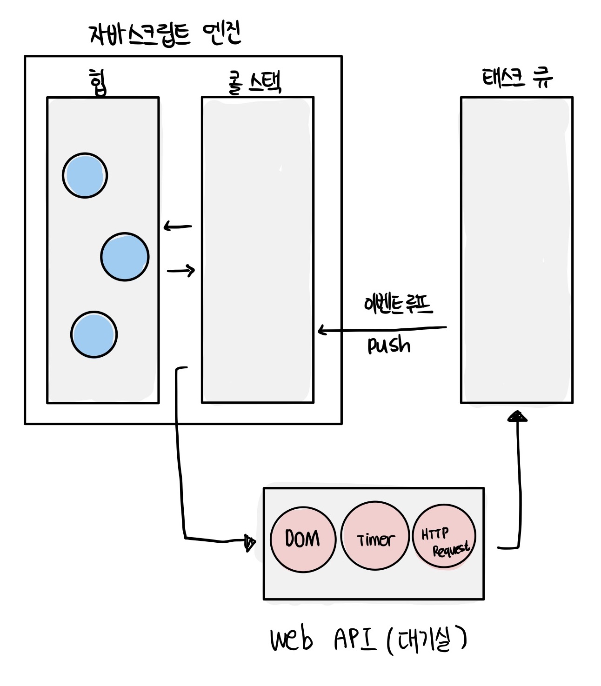

# 모던 자바스크립트 Deep Dive

## 목차

- [41장 타이머](#41장-타이머)
- [42장 비동기 프로그래밍](#42장-비동기-프로그래밍)
- [43장 Ajax](#43장-Ajax)
- [44장 REST API](#44장-REST-API)
- [45장 프로미스](#45장-프로미스)
- [46장 제너레이터와 async/await](#46장-제너레이터와-async/await)

- <a href="https://github.com/junh0328/upgrade_javascript/blob/master/DEEPDIVE/readme6.md">🔙 이전 섹션으로</a>
- <a href="https://github.com/junh0328/upgrade_javascript/blob/master/DEEPDIVE/readme8.md">🔜 다음 섹션으로</a>

## 41장 타이머

### 41.1 호출 스케쥴링

함수를 명시적으로 호출하면 함수가 즉시 실행된다.

```js
function add(a, b) {
  return a + b;
}

console.log(add(2, 5)) >>> 7;
```

만약 <b>함수를 명시적으로 호출하지 않고 일정 시간이 경과된 이후에 호출되도록 함수 호출을 예약</b>하려면 <b>타이머 함수</b>를 사용한다. 이를 <b>호출 스케줄링(scheduling a call)</b>이라 한다.

자바스크립트는 ① 타이머를 생성할 수 있는 타이머 함수 setTimeout과 setInterval, ② 타이머를 제거할 수 있는 타이머 함수 clearTimeout과 clearInterval을 제공한다. 타이머 함수는 ECMAScript 사양에 정의된 빌트인 함수가 아니다. <b>브라우저 환경과 Node.js 환경에서 모두 전역 객체의 메서드로서 타이머 함수를 제공한다. 즉, 타이머 함수는 호스트 객체이다.</b>

setTimeout 함수가 생성한 타이머는 단 한 번 동작하고, setInterval 함수가 생성한 타이머는 반복 동작한다.

자바스크립트 엔진은 단 하나의 실행 컨텍스트 스택을 갖기 때문에 두 가지 이상의 태스크(task)를 동시에 실행할 수 없다. 즉, 자바스크립트 엔진은 싱글 스레드로 동작한다. 이러한 이유로 타이머 함수는 비동기 처리 방식으로 동작한다.

### 41.2 타이머 함수

### setTimeout / clearTimeout

```js
const timeoutdId = setTimeout(func|code[, delay, param1, param2, ...]);
```

| 매개변수            | 설명                                                                                                                                                         |
| :------------------ | :----------------------------------------------------------------------------------------------------------------------------------------------------------- |
| func                | 타이머가 만료된 뒤 호출될 콜백 함수 <br/> 콜백 함수 대신 코드를 문자열로 전달할 수 있다. 이때 코드 문자열은 타이머가 만료된 뒤 해석되고 실행된다.            |
| delay               | 타이머 만료 시간(밀리초(ms) 단위), setTimeout 함수는 delay 시간으로 단 한 번 동작하는 타이머를 생성한다. <br/> 인수 전달을 생략한 경우 기본 값 0이 지정된다. |
| param1, param2, ... | 호출 스케줄링된 콜백 함수에 전달해야 할 인수가 존재하는 경우 세 번째 이후의 인수로 전달할 수 있다.                                                           |

```js
// 1초(1000ms) 후 타이머가 만료되면 콜백 함수가 호출된다.
setTimeout(() => console.log("Hi!"), 1000);

// 세 번째 인수로 문자열 'Lee' 전달
setTimeout((name) => console.log(`Hi! ${name}.`), 1000, "Lee");

// 두 번째 인수(delay)를 생략하면 기본값 0이 지정된다.
setTimeout(() => console.log("Hello!"));
```

setTimeout 함수는 생성된 타이머를 식별할 수 있는 고유한 타이머를 식별할 수 있는 고유한 id를 반환한다. setTimeout 함수가 반환한 타이머 id는 <b>① 브라우저 환경일 경우 숫자</b>이며 <b>② Node.js 환경인 경우 객체</b>다

setTimeout 함수가 반환한 타이머 id를 clearTimeout 함수의 인수로 전달하여 타이머를 취소할 수 있다.

```js
const timerId = setTimeout(() => console.log("Hi!"), 1000);
console.log(timeId);

clearTimeout(timerId);
```

#### 브라우저에서 보기


### setInterval/ clearInterval

setInterval 함수는 두 번째 인수로 전달받은 시간(ms, 1/1000초)으로 <b>반복 동작하는 타이머를 생성한다.</b> setInterval의 첫 번째 인수인 콜백 함수는 두 번째 인수로 전달받은 시간이 경과할 때마다 반복 실행되도록 <b>호출 스케줄링된다.</b>

```js
const timeoutdId = setInterval(func|code[, delay, param1, param2, ...]);
```

setInterval 함수는 생성된 타이머를 식별할 수 있는 고유한 타이머 id를 반환한다. Node.js 환경인 경우 객체를 반환한다.

```js
let count = 1;

const timeoutId = setInterval(() => {
  console.log(count); // 1 2 3 4 5

  if (count++ === 5) clearInterval(timeoutId);
}, 1000);

console.log("timeoutId: ", timeoutId);
```

### Node.js 환경에서 보기


### 41.3 디바운스와 스로틀

scroll, resize, mousemove 같은 이벤트는 짧은 시간 간격으로 연속해서 발생한다. 이러한 이벤트에 바인딩한 이벤트 핸들러는 과도하게 호출되어 성능에 문제를 일으킬 수 있다. <b>디바운스와 스로틀은 짧은 시간 간격으로 연속해서 발생하는 이벤트를 그룹화해서 과도한 이벤트 핸들러의 호출을 방지하는 프로그래밍 기법이다.</b>

```html
<!DOCTYPE html>
<html>
  <body>
    <button>click me</button>
    <pre>일반 클릭 이벤트 카운터    <span class="normal-msg">0</span></pre>
    <pre>디바운스 클릭 이벤트 카운터 <span class="debounce-msg">0</span></pre>
    <pre>스로틀 클릭 이벤트 카운터   <span class="throttle-msg">0</span></pre>
    <script>
      const $button = document.querySelector("button");
      const $normalMsg = document.querySelector(".normal-msg");
      const $debounceMsg = document.querySelector(".debounce-msg");
      const $throttleMsg = document.querySelector(".throttle-msg");

      const debounce = (callback, delay) => {
        let timerId;
        return (event) => {
          if (timerId) clearTimeout(timerId);
          timerId = setTimeout(callback, delay, event);
        };
      };

      const throttle = (callback, delay) => {
        let timerId;
        return (event) => {
          if (timerId) return;
          timerId = setTimeout(
            () => {
              callback(event);
              timerId = null;
            },
            delay,
            event
          );
        };
      };

      $button.addEventListener("click", () => {
        $normalMsg.textContent = +$normalMsg.textContent + 1;
      });

      $button.addEventListener(
        "click",
        debounce(() => {
          $debounceMsg.textContent = +$debounceMsg.textContent + 1;
        }, 500)
      );

      $button.addEventListener(
        "click",
        throttle(() => {
          $throttleMsg.textContent = +$throttleMsg.textContent + 1;
        }, 500)
      );
    </script>
  </body>
</html>
```


### 디바운스 (debounce)

디바운스(debounce)는 짧은 시간 간격으로 이벤트가 연속해서 발생하면 이벤트 핸들러를 호출(call)하지 않다가 일정 시간이 경과된 이후에 이벤트 핸들러가 한 번만 호출되도록 한다.

즉 <b>디바운스는 짧은 시간 간격으로 발생하는 이벤트를 그룹화해서 마지막에 한 번만 이벤트 핸들러가 호출되도록 한다.</b>


[코드종님의 유튜브 강의](https://www.youtube.com/watch?v=TZCiv_c5q8s)

- 마지막 이벤트(space)를 바탕으로 일정 시간이 지나야 다시 호출할 수 있게 하는 것이 디바운스다
- 마지막 이벤트를 발생한 이후(빨간색) 일정 시간이 지나 회복된 상태(초록색)에서 새로운 이벤트를 다시 실행할 수 있다.

텍스트 입력 필드에서 input 이벤트가 짧은 시간 간격으로 연속해서 발생하는 경우, 디바운스를 통해 Ajax와 같은 요청의 빈도를 줄여 서버에 부하를 줄일 수 있다.

```html
<!DOCTYPE html>
<html>
  <body>
    <input type="text" />
    <div class="msg"></div>
    <script>
      const $input = document.querySelector("input");
      const $msg = document.querySelector(".msg");

      const debounce = (callback, delay) => {
        let timerId;
        // debounce 함수는 timerId를 기억하는 클로저를 반환한다.
        return (event) => {
          // delay가 경과하기 이전에 이벤트가 발생하면 이전 타이머를 취소하고
          // 새로운 타이머를 재설정한다.
          // 따라서 delay보다 짧은 간격으로 이벤트가 발생하면 callback은 호출되지 않는다.
          if (timerId) clearTimeout(timerId);
          timerId = setTimeout(callback, delay, event);
        };
      };

      // debounce 함수가 반환하는 클로저가 이벤트 핸들러로 등록된다.
      // 300ms보다 짧은 간격으로 input 이벤트가 발생하면 debounce 함수의 콜백 함수는
      // 호출되지 않다가 300ms 동안 input 이벤트가 더 이상 발생하면 한 번만 호출된다.
      $input.oninput = debounce((e) => {
        $msg.textContent = e.target.value;
      }, 300);
    </script>
  </body>
</html>
```


검색 창에서 매 클릭 이벤트 (e.target.value) 마다 ajax 요청을 보내는 것보다 디바운스를 통해 일정 기간을 바탕으로 마지막 이벤트에 대한 ajax 요청을 보내는 것이 서버의 부하를 줄이는 데 더욱 효율적일 것이다.

### 쓰로틀 (throttle)

쓰로틀(throttle)은 짧은 시간 간격으로 이벤트가 연속해서 발생하더라도 일정 시간 간격으로 이벤트 핸들러가 최대 한 번만 호출되도록 한다.

스로틀은 짧은 시간 간격으로 연속해서 발생하는 이벤트를 그룹화해서 일정 시간 단위로 이벤트 핸들러가 호출되도록 호출 주기를 만든다.


[코드종님의 유튜브 강의](https://www.youtube.com/watch?v=TZCiv_c5q8s)

- 이벤트를 지속적으로 발생시키고 있다고 하더라도 위에 설정된 300ms의 시간을 간격으로 두고 이벤트를 발생시킨다
- 쓰로틀에서 지정한 delay(300ms)의 사이에 발생하는 이벤트들은 무시된다

```html
<!DOCTYPE html>
<html>
  <head>
    <style>
      .container {
        width: 300px;
        height: 300px;
        background-color: rebeccapurple;
        overflow: scroll;
      }

      .content {
        width: 300px;
        height: 1000vh;
      }
    </style>
  </head>
  <body>
    <div class="container">
      <div class="content"></div>
    </div>
    <div>
      일반 이벤트 핸들러가 scroll 이벤트를 처리한 횟수:
      <span class="normal-count">0</span>
    </div>
    <div>
      스로틀 이벤트 핸들러가 scroll 이벤트를 처리한 횟수:
      <span class="throttle-count">0</span>
    </div>

    <script>
      const $container = document.querySelector(".container");
      const $normalCount = document.querySelector(".normal-count");
      const $throttleCount = document.querySelector(".throttle-count");

      const throttle = (callback, delay) => {
        let timerId;
        // throttle 함수는 timerId를 기억하는 클로저를 반환한다.
        return (event) => {
          // delay가 경과하기 이전에 이벤트가 발생하면 아무것도 하지 않다가
          // delay가 경과했을 때 이벤트가 발생하면 새로운 타이머를 재설정한다.
          // 따라서 delay 간격으로 callback이 호출된다.
          if (timerId) return;
          timerId = setTimeout(
            () => {
              callback(event);
              timerId = null;
            },
            delay,
            event
          );
        };
      };

      let normalCount = 0;
      $container.addEventListener("scroll", () => {
        $normalCount.textContent = ++normalCount;
      });

      let throttleCount = 0;
      // throttle 함수가 반환하는 클로저가 이벤트 핸들러로 등록된다.
      $container.addEventListener(
        "scroll",
        throttle(() => {
          $throttleCount.textContent = ++throttleCount;
        }, 1000)
      );
    </script>
  </body>
</html>
```


- scroll 이벤트는 사용자가 스크롤할 때 짧은 시간 간격으로 연속해서 발생한다
- 이처럼 짧은 시간 간격으로 연속해서 발생하는 이벤트의 과도한 이벤트 핸들러의 호출을 방지하기 위해 throttle 함수를 통해 호출 주기를 만든다
- 쓰로틀은 scroll 이벤트 처리나 무한 스크롤 UI 구현 등에 유용하게 사용된다

### Lodash

[Lodash 공식문서](https://lodash.com/docs/4.17.15#debounce)

예제를 통해서는 throttle과 debounce에 관해 직접 선언하고 호출했지만, lodash 등을 통해서 더 안전한 코드를 제공받을 수 있다

### 레퍼런스

[코드종님의 유튜브 강의](https://www.youtube.com/watch?v=TZCiv_c5q8s)

> 해당 게임 예제는 유튜브 링크를 통해 들어가서 직접 구현해볼 수 있습니다

## 42장 비동기 프로그래밍

### 42.1 동기 처리와 비동기 처리

자바스크립트 엔진은 기본적으로 함수를 호출하면 함수 코드가 평가되어 함수 실행 컨텍스트가 생성된다. 이때 생성된 함수 실행 컨텍스트는 실행 컨텍스트 스택(콜 스택이라고도 부름)에 푸시되고 함수 코드가 실행된다. 함수 코드의 실행이 종료되면 함수 실행 컨텍스트는 실행 컨텍스트 스택에서 팝되어 제거된다

```js
const x = 1;

function foo() {
  const y = 2;

  function bar() {
    const z = 3;
    console.log(x + y + z);
  }
  bar();
}

foo(); // 6
```


함수가 실행되려면 ① 함수 코드 평가 과정에서 생성된 함수 실행 컨텍스트가 실행 컨텍스트 스택에 푸시되어야 한다. 다시 말해, <b>실행 컨텍스트 스택에 함수 실행 컨텍스트가 푸시되는 것은 바로 함수 실행의 시작을 의미한다.</b> 함수가 호출된 순서대로 순차적으로 실행되는 이유는 <b>함수가 호출된 순서대로 함수 실행 컨텍스트가 실행 컨텍스트 스택에 푸시되기 때문이다. 이처럼 함수의 실행 순서는 실행 컨텍스트 스택으로 관리한다.</b>


자바스크립트 엔진은 단 하나의 실행 컨텍스트 스택 구조를 갖는다. 이는 함수를 실행할 수 있는 창구가 단 하나이며, 동시에 2개 이상의 함수를 실행할 수 없다는 것을 의미한다. 실행 컨텍스트의 최상위 요소인 '실행 중인 실행 컨텍스트'를 제외한 모든 실행 컨텍스트는 모두 실행 대기 중인 태스크들이다. 대기 중인 태스크들은 현재 실행 중인 실행 컨텍스트가 팝(pop)되어 실행 컨택스트 스택에서 제거되면, 비로소 실행되기 시작한다.

자바스크립트 엔진은 한 번에 하나의 태스크(작업, 일)만 실행할 수 있는 싱글 스레드 방식으로 동작한다. 싱글 스레드 방식은 한 번에 하나의 태스크만 실행할 수 있기 때문에 처리에 시간이 걸리는 태스크를 실행하는 경우 블로킹(작업중단)이 발생한다.

> setTimeout 함수와 유사하게 일정 시간이 경과한 이후에 콜백 함수를 호출하는 sleep 함수를 구현해 보자

```js
function sleep(func, delay) {
  const delayUntil = Date.now() + delay;

  // 현재 시간(Date.now())에 delay를 더한 delayUntil이 현재 시간보다 작으면 계속 반복한다.
  while (Date.now() < delayUntil);
  // 일정 시간(delay)이 경과한 이후에 콜백 함수(func)를 호출한다.
  func();
}

function foo() {
  console.log("foo");
}

function bar() {
  console.log("bar");
}

sleep(foo, 3000);
bar();
```


위 예제의 sleep 함수는 3초 후에 foo 함수를 호출한다. 이때 bar 함수는 sleep 함수의 실행이 종료된 이후에 호출되므로 3초 이상 호출되지 못하고 블로킹된다.

이처럼 현재 실행 중인 태스크가 종료될 때까지 다음에 실행될 태스크가 대기하는 방식을 동기(synchronous) 처리라고 한다. 동기 처리 방식은 태스크를 순서대로 하나씩 처리하므로 실행 순서가 보장된다는 장점이 있지만, 앞선 태스크가 종료할 때까지 이후 태스크들이 블로킹되는 단점이 있다.


위 예제를 호출 스케줄링이 가능하도록 하는 타이머 함수를 사용하여 만들어 보자

```js
function foo() {
  console.log("foo");
}

function bar() {
  console.log("bar");
}

// 타이머 함수 setTimeout은 일정 시간이 경과한 이후에 콜백 함수 foo를 호출한다.
// 타이머 함수 setTimeout은 bar 함수를 블로킹하지 않는다.
setTimeout(foo, 3 * 1000);
bar();
```


setTimeout 함수는 앞서 살펴본 sleep 함수와 유사하게 일정 시간이 경과한 이후에 콜백 함수를 호출하지만 setTimeout 함수 이후의 태스크(여기서는 bar)를 블로킹하지 않고 곧바로 실행한다. 이처럼 현재 실행 중인 태스크가 종료되지 않은 상태라 해도 다음 태스크를 곧바로 실행하는 방식을 비동기(asynchronous) 처리라고 한다.


비동기 처리 방식은 현재 실행 중인 태스크가 종료되지 않은 상태라 해도 다음 태스크를 곧바로 실행하므로 블로킹이 발생하지 않는다는 장점이 있다. 하지만 동시에 태스크의 실행 순서가 보장되지 않는 단점이 있다.

타이머 함수인 ① setTimeout 과 setInterval ② HTTP 요청 ③ 이벤트 핸들러 는 비동기 처리 방식으로 동작한다.

비동기 처리는 이벤트 루프와 태스크 큐와 깊은 관계가 있다.

### 42.2 이벤트 루프와 태스크 큐

자바스크립트의 특징 중 하나는 싱글 스레드로 동작한다는 것이다. 앞서 살펴본 바와 같이 싱글 스레드 방식은 한 번에 하나의 태스크만 처리할 수 있다는 것을 의미한다. 하지만 브라우저가 동작하는 것을 살펴보면 많은 태스크가 동시에 처리되는 것처럼 느껴진다.

예를 들어, HTML 요소가 애니메이션 효과를 통해 움직이면서 이벤트를 처리하기도 하고, HTTP 요청을 통해 서버로부터 데이터를 가지고 오면서 렌더링하기도 한다. 이처럼 자바스크립트의 동시성을 지원하는 것이 바로 이벤트 루프(event loop)다.

이벤트 루프는 <b>브라우저</b>에 내장되어 있는 기능 중 하나다. 브라우저 환경을 그림으로 표현하면 다음과 같다.



구글의 v8 자바스크립트 엔진을 비롯한 대부분의 자바스크립트 엔진은 크게 2개의 영역으로 구분할 수 있다.

### 📍 콜 스택 (call stack)

- 소스코드(전역 코드 및 함수 코드 등) 평가 과정에서 생성된 실행 컨텍스트가 추가되고 제거되는 스택 자료구조인 실행 컨텍스트 스택이 바로 콜 스택이다.

- 함수를 호출하면 함수 실행 컨텍스트가 순차적으로 콜 스택에 푸시되어 순차적으로 실행된다. 자바스크립트 엔진은 단 하나의 콜 스택을 사용하기 때문에 최상위 실행 컨텍스트(실행 중인 실행 컨텍스트)가 종료되어 콜 스택에서 제거되기 전까지는 다른 어떤 태스크도 실행되지 않는다.

### 📍 힙 (heap)

- 힙은 객체가 저장되는 메모리 공간이다. 콜 스택의 요소인 실행 컨텍스트는 힙에 저장된 객체를 참조한다.

- 메모리에 값을 저장하려면 먼저 값을 저장할 메모리 공간의 크기를 결정해야 한다. 객체는 원시 값과는 달리 크기가 정해져 있지 않으므로 할당해야 할 메모리 공간의 크기를 런타임에 결정(동적 할당)해야 한다. 따라서 객체가 저장되는 메모리 공간인 힙은 구조화되어 있지 않다는 특징이 있다.

이처럼 콜 스택과 힙으로 구성되어 있는 자바스크립트 엔진은 단순히 태스크가 요청되면 콜 스택을 통해 요청된 작업을 순차적으로 실행할 뿐이다. 비동기 처리에서 ① 소스코드의 평가와 ② 실행을 제외한 모든 처리는 자바스크립트 엔진을 구동하는 환경인 브라우저 또는 Node.js가 담당한다.

예를 들어,

① 비동기 방식으로 동작하는 setTimeout의 콜백 함수의 평가와 실행은 자바스크립트 엔진이 담당하지만

② 호출 스케줄링을 위한 타이머 설정과 콜백 함수의 등록은 브라우저 또는 Node.js가 담당한다.

이를 위해 브라우저 환경은 태스크 큐와 이벤트 루프를 제공한다.

### 📍 태스크 큐 (task queue/event queue/callback queue)

- setTimeout이나 setInterval과 같은 비동기 함수의 콜백 함수 또는 이벤트 핸들러가 일시적으로 보관되는 영역이다.
- 태스크 큐와는 별도로 프로미스 후속 처리 메서드의 콜백 함수가 일시적으로 보관되는 마이크로태스크 큐도 존재한다.

### 큐 (queue)

- 스택 자료구조와 달리 선입선출(먼저 들어온 것이 먼저 나가는) 형식을 띈다
- F.I.F.O(First In First Out) 라고도 부른다


### 📍 이벤트 루프 (event loop)

- 이벤트 루프는 콜 스택에 현재 실행 중인 실행 컨텍스트가 있는지, 그리고 태스크 큐에 대기 중인 함수(콜백 함수, 이벤트 핸들러 등)가 있는지 반복해서 확인한다.
- 만약 콜 스택이 비어 있고 태스크 큐에 대기 중인 함수가 있다면 이벤트 루프는 순차적(FIFO)으로 태스크 큐에 대기 중인 함수를 콜 스택으로 이동시킨다.
- 이때 콜 스택으로 이동한 함수는 실행된다. 즉, 태스크 큐에 일시 보관된 함수들을 비동기 처리 방식으로 동작한다.

### 동작 과정

> 브라우저 환경에서 다음 예제가 어떻게 동작할 지 살펴보자

```js
function foo() {
  console.log("foo");
}

function bar() {
  console.log("bar");
}

setTimeout(foo, 0); // 0초(실제는 4ms) 후에 foo 함수가 호출된다.
bar();
```

1. 전역 코드가 평가되어 전역 실행 컨텍스트가 생성되고 콜 스택에 푸시된다.
2. 전역 코드가 실행되기 시작하여 setTimeout 함수가 호출된다. 이때 setTimeout 함수의 실행 컨텍스트가 생성되고 콜 스택에 푸시되어 현재 실행 중인 컨텍스트가 된다. 브라우저의 Web API(호스트 객체)인 타이머 함수도 함수이므로 함수 실행 컨텍스트를 생성한다.
3. setTimeout 함수가 실행되면 콜백 함수를 📍 호출 스케줄링하고 종료되어 콜 스택에서 팝된다. 이때 호출 스케줄링, 즉 타이머 설정과 타이머가 만료되면 콜백 함수를 태스크 큐에 푸시하는 것은 브라우저의 역할이다.
4. 브라우저가 수행하는 4-1과 자바스크립트 엔진이 수행하는 4-2는 병행 처리된다.

   4.1 브라우저는 타이머를 설정하고 타이머의 만료를 기다린다. 이후 타이머가 만료되면 콜백 함수 foo가 태스크 큐에 푸시된다.

   위 예제의 경우 지연 시간(delay)이 0이지만 지연 시간이 4ms 이하인 경우 최소 지연 시간 4ms가 지정된다. 따라서 4ms 후에 콜백 함수 foo가 태스크 큐에 푸시되어 대기하게 된다.

   이 처리 또한 자바스크립트 엔진이 아니라 브라우저가 수행한다. 이처럼 setTimeout 함수로 호출 스케줄링한 콜백 함수는 정확히 지연 시간 후에 호출된다는 보장은 없다.

   지연 시간 이후에 콜백 함수가 태스크 큐에 푸시되어 대기하게 되지만 콜 스택이 비어야 호출되므로 약간의 시간차가 발생할 수 있기 때문이다.

   4.2 bar 함수가 호출되어 bar 함수의 함수 실행 컨텍스트가 생성되고 콜 스택에 푸시되어 현재 실행 중인 컨텍스트가 된다. 이후 bar 함수가 종료되어 콜 스택에서 팝된다.

   이때 브라우저가 타이머를 설정한 후 4ms가 경과했다면 foo 함수는 아직 태스크 큐에서 대기 중이다.

5. 전역 코드 실행이 종료되고 전역 실행 컨텍스트가 콜 스택에서 팝된다. 이로서 콜 스택에는 아무런 실행 컨텍스트도 존재하지 않게 된다.

6. 이벤트 루프에 의해 콜 스택이 비어 있음이 감지되고 태스크 큐에서 대기 중인 콜백 함수 foo가 이벤트 루프에 의해 콜스택에 푸시된다. 다시 말해, 콜백 함수 foo의 함수 실행 컨텍스트가 생성되고 콜 스택에 푸시되어 현재 실행 중인 실행 컨텍스트가 된다. 이후 foo 함수가 종료되어 콜 스택에서 팝된다.

이처럼 비동기 함수인 setTimeout의 콜백 함수는 테스크 큐에 푸시되어 대기하다가 전역 코드 및 명시적으로 호출된 함수가 모두 종료하면 비로소 콜 스택에 푸시되어 실행된다.

자바스크립트는 싱글 스레드 방식으로 동작한다. 이때 싱글 스레드 방식으로 동작하는 것은 브라우저가 아니라 브라우저에 내장된 자바스크립트 엔진이라는 것에 주의하기 바란다.

만약 모든 자바스크립트 코드가 자바스크립트 엔진에서 싱글 스레드 방식으로 동작한다면 자바스크립트는 비동기로 동작할 수 없다. 즉, 자바스크립트 엔진은 싱글 스레드로 동작하지만 브라우저는 멀티 스레드로 동작한다.

### 호출 스케줄링

```
함수를 명시적으로 호출하지 않고 일정 시간이 경과된 이후에 호출되도록 함수 호출을 예약하려면 타이머 함수를 사용한다

이를 호출 스케줄링(scheduling a call)이라 한다
```

### 직접 확인해보기

> 어떤 결과가 나올지 확인해보자

```js
function printNum(n) {
  console.log(n);
}

printNum(1);
setTimeout(() => printNum(2), 3000);
setTimeout(() => printNum(3), 2000);
setTimeout(() => printNum(4), 1000);
printNum(5);
```

① 비동기로 처리되는 타이머 함수와 ② 동기적으로 처리되는 console.log 메서드를 사용하였다

<details>


1. 전역 코드가 실행되면서 console.log(1)을 만나, 함수 실행 컨텍스트를 생성한다
2. 함수 실행 컨텍스트의 평가 과정과 실행 과정을 통해 숫자 1 을 출력한다
3. setTimeout 함수가 실행되면 콜백 함수를 호출 스케줄링하고 종료되어 콜 스택에서 팝된다. 이때 호출 스케줄링, 즉 타이머 설정과 타이머가 만료되면 브라우저가 콜백 함수를 태스크 큐에 푸시한다
4. 다음 setTimeout 함수를 실행한다. 같은 과정을 반복 하지만 3 , 4 의 비동기 처리 과정에서는 태스크의 순서를 보장하지 않으며, 타이머 만료 시간에 따라 태스트 큐에 푸시된다
5. 따라서 4 > 3 > 2 순으로 태스크에 푸시되며, console.log(5) 에 대한 작업이 완료되어 실행 컨텍스트가 비워지고 아무런 실행 컨텍스트가 존재하지 않게된다
6. 이때 태스트 큐의 자료구조에 따라 먼저 담긴 4 > 3 > 2 순(FIFO)으로 대기중인 콜백 함수를 이벤트 루프가 콜 스택에 푸시한다
7. 이후 모든 콜백이 종료되고 콜 스택에서 팝 된 후, 작업이 완료된다

</details>

## 43장 Ajax

### 43.1 Ajax란?

Ajax(Asynchronous JavaScript and XML)란 자바스크립트를 사용하여 ① 브라우저가 ② 서버에게 비동기 방식으로 데이터를 요청하고, 서버가 응답한 데이터를 수신하여 웹페이지를 동적으로 갱신하는 프로그래밍 방식을 말한다.

Ajax는 브라우저에서 제공하는 호스트 객체 Web API인 <b>XMLHttpRequest</b> 객체를 기반으로 동작한다. XMLHttpRequest는 HTTP 비동기 통신을 위한 메서드와 프로퍼티를 제공한다.

이전의 웹 페이지는 html 태그로 시작해서 html 태그로 끝나는 완전한 HTML을 서버로부터 전송받아 웹 페이지 전체를 <b>처음부터 다시 렌더링하는 방식으로 동작했다.</b> 따라서 화면이 전환되면 서버로부터 새로운 HTML을 전송받아 웹페이지 전체를 처음부터 다시 렌더링한다.


이러한 전통적인 방식은 다음과 같은 단점이 있다.

1. 이전 웹페이지와 차이가 없어서 변경할 필요가 없는 부분까지 포함된 완전한 HTML을 서버로부터 매번 다시 전송받기 때문에 불필요한 데이터 통신이 발생한다.

2. 변경할 필요가 없는 부분까지 처음부터 다시 렌더링한다. 이로 인해 화면 전환이 일어나면 화면이 순간적으로 깜박이는 현상이 발생한다.

3. 클라이언트 서버와의 통신이 동기 방식으로 동작하기 때문에 서버로부터 응답이 있을 때까지 다음 처리는 블로킹된다.

Ajax의 등장으로 서버로부터 웹페이지의 변경에 필요한 데이터만 비동기 방식으로 전송받아 웹페이지를 변경할 필요가 없는 부분까지 다시 렌더링하지 않고, 변경할 필요가 있는 부분만 한정적으로 렌더링하는 방식이 가능해진 것이다. 이를 통해 브라우저에서도 데스크톱 애플리케이션과 유사한 빠른 퍼포먼스와 부드러운 화면 전환이 가능해졌다.


Ajax는 전통적인 방식과 비교했을 때 다음과 같은 장점이 있다.

1. 변경할 부분을 갱신하는데 필요한 데이터만 서버로부터 전송받기 때문에 불필요한 데이터 통신이 발생하지 않는다.

2. 변경할 필요가 없는 부분은 다시 렌더링하지 않는다. 따라서 화면이 순간적으로 깜박이는 현상이 발생하지 않는다.

3. 클라이언트와 서버와의 통신이 비동기 방식으로 동작하기 때문에 서버에게 요청을 보낸 이후 블로킹이 발생하지 않는다.

### 43.2 JSON (JavaScript Object Notation)

JSON은 클라이언트와 서버 간의 HTTP 통신을 위한 텍스트 데이터 포맷이다. 자바스크립트에 종속되지 않는 언어 독립형 데이터 포맷으로, 대부분의 프로그래밍 언어에서 사용할 수 있다.

### JSON 표기 방식

JSON은 객체 리터럴과 유사하게 키와 값으로 구성된 순수한 텍스트다.

```
{
  "name": "Lee",
  "age": 20,
  "alive": true,
  "hobby": ["traveling", "tennis"]
}

```

<b>JSON은 반드시 큰따옴표로 묶어야 한다.</b> 값은 객체 리터럴과 같은 표기법으로 사용할 수 있다.

### JSON.stringify

JSON.stringify 메서드는 ① 객체를 ② JSON 포맷의 문자열로 변환한다. <b>클라이언트가 서버로 객체를 전송하려면 객체를 문자열화해야 하는데 이를 직렬화(serializing)라 한다.</b>

```js
const obj = {
  name: "Lee",
  age: 20,
  alive: true,
  hobby: ["traveling", "tennis"],
};

// 객체를 JSON 포맷의 문자열로 변환한다.
const json = JSON.stringify(obj);
console.log(typeof json, json);
// string {"name":"Lee","age":20,"alive":true,"hobby":["traveling","tennis"]}

// 객체를 JSON 포맷의 문자열로 변환하면서 들여쓰기 한다.
const prettyJson = JSON.stringify(obj, null, 2);
console.log(typeof prettyJson, prettyJson);
/*
string {
  "name": "Lee",
  "age": 20,
  "alive": true,
  "hobby": [
    "traveling",
    "tennis"
  ]
}
*/

// replacer 함수. 값의 타입이 Number이면 필터링되어 반환되지 않는다.
function filter(key, value) {
  // undefined: 반환하지 않음
  return typeof value === "number" ? undefined : value;
}

// JSON.stringify 메서드에 두 번째 인수로 replacer 함수를 전달한다.
const strFilteredObject = JSON.stringify(obj, filter, 2);
console.log(typeof strFilteredObject, strFilteredObject);
/*
string {
  "name": "Lee",
  "alive": true,
  "hobby": [
    "traveling",
    "tennis"
  ]
}
*/
```

JSON.stringify 메서드는 객체뿐만 아니라 배열도 JSON 포맷의 문자열로 변환한다.

```js
const todos = [
  { id: 1, content: "HTML", completed: false },
  { id: 2, content: "CSS", completed: true },
  { id: 3, content: "Javascript", completed: false },
];

// 배열을 JSON 포맷의 문자열로 변환한다.
const json = JSON.stringify(todos, null, 2);
console.log(typeof json, json);
/*
string [
  {
    "id": 1,
    "content": "HTML",
    "completed": false
  },
  {
    "id": 2,
    "content": "CSS",
    "completed": true
  },
  {
    "id": 3,
    "content": "Javascript",
    "completed": false
  }
]
*/
```

### JSON.parse

JSON.parse 메서드는 ① JSON 포맷의 문자열을 ② 객체로 변환한다. 서버로부터 클라이언트에게 전송된 JSON 데이터는 문자열이다. 이 <b>문자열을 객체로 사용하려면 JSON 포맷의 문자열을 객체화해야 하는데 이를 역직렬화(deserializing)라 한다.</b>

```js
const obj = {
  name: "Lee",
  age: 20,
  alive: true,
  hobby: ["traveling", "tennis"],
};

// 객체를 JSON 포맷의 문자열로 변환한다.
const json = JSON.stringify(obj);

// JSON 포맷의 문자열을 객체로 변환한다.
const parsed = JSON.parse(json);
console.log(typeof parsed, parsed);
// object {name: "Lee", age: 20, alive: true, hobby: ["traveling", "tennis"]}
```

JSON.stringify 메서드와 같이 JSON.parse 메서드 또한 문자열을 배열 객체로 변환할 수 있다.

```js
const todos = [
  { id: 1, content: "HTML", completed: false },
  { id: 2, content: "CSS", completed: true },
  { id: 3, content: "Javascript", completed: false },
];

// 배열을 JSON 포맷의 문자열로 변환한다.
const json = JSON.stringify(todos);

// JSON 포맷의 문자열을 배열로 변환한다. 배열의 요소까지 객체로 변환된다.
const parsed = JSON.parse(json);
console.log(typeof parsed, parsed);
/*
 object [
  { id: 1, content: 'HTML', completed: false },
  { id: 2, content: 'CSS', completed: true },
  { id: 3, content: 'Javascript', completed: false }
]
*/
```

### 43.3 XMLHttpRequest

브라우저는 주소창이나 <b>HTML의 form 태그 또는 a 태그를 통해 HTTP 요청 전송 기능을 기본 제공한다.</b> 자바스크립트를 사용하여 HTTP 요청을 전송하려면 XMLHttpRequest 객체를 사용한다. Web API인 XMLHttpRequest 객체는 HTTP 요청 전송과 HTTP 응답 수신을 위한 다양한 메서드와 프로퍼티를 제공한다.

### XMLHttpRequest 객체 생성

XMLHttpRequest 객체는 XMLHttpRequest 생성자 함수를 호출하여 생성한다. XMLHttpRequest 객체는 브라우저에서 제공하는 호스트 객체(중 Web API)이므로 브라우저 환경에서만 정상적으로 실행된다.

```js
// XMLHttpRequest 객체 생성
const xhr = new XMLHttpRequest();
```

### XMLHttpRequest 객체의 프로퍼티와 메서드

XMLHttpRequest 객체는 다양한 프로퍼티와 메서드를 제공한다. 대표적인 프로퍼티와 메서드는 다음과 같다.

#### XMLHttpRequest 객체의 프로토타입 프로퍼티

| 프로토타입 프로퍼티 | 설명                                                                                                                                                                                |
| :------------------ | :---------------------------------------------------------------------------------------------------------------------------------------------------------------------------------- |
| readyState          | HTTP 요청의 현재 상태를 나타내는 정수, 다음과 같은 XMLHttpRequest의 정적 프로퍼티를 값으로 갖는다. <br/>UNSENT: 0<br/>OPENDED: 1<br/>HEADERS_RECEIVED: 2<br/>LOADING:3 <br/>DONE: 4 |
| status              | HTTP 요청에 대한 응답 상태(HTTP 상태 코드)를 나타내는 정수 <br/>예)200                                                                                                              |
| statusText          | HTTP 요청에 대한 응답 메시지를 나타내는 문자열 <br/>예) OK                                                                                                                          |
| responseType        | HTTP 응답 타입 <br/> document, json, text, ....                                                                                                                                     |
| response            | HTTP 요청에 대한 응답 몸체                                                                                                                                                          |
| responseText        | 서버가 전송한 HTTP 요청에 대한 응답 문자열                                                                                                                                          |

#### XMLHttpRequest 객체의 이벤트 핸들러 프로퍼티

| 이벤트 핸들러 프로퍼티 | 설명                                                         |
| :--------------------- | :----------------------------------------------------------- |
| onreadystatechange     | readystate 프로퍼티 값이 변경된 경우                         |
| onloadstart            | HTTP 요청에 대한 응답을 받기 시작한 경우                     |
| onprogress             | HTTP 요청에 대한 응답을 받는 도중 주기적으로 발생            |
| onabort                | abort 메서드에 의해 HTTP 요청이 중단된 경우                  |
| onerror                | HTTP 요청에 에러가 발생한 경우                               |
| onload                 | HTTP 요청이 성공적으로 완료한 경우                           |
| ontimeout              | HTTP 요청 시간이 초과한 경우                                 |
| onloadend              | HTTP 요청이 완료한 경우, HTTP 요청이 성공 또는 실패하면 발생 |

#### XMLHttpRequest 객체의 메서드

| 메서드            | 설명                                     |
| :---------------- | :--------------------------------------- |
| open              | HTTP 요청 초기화                         |
| send              | HTTP 요청 전송                           |
| abort             | 이미 전송된 HTTP 요청 중단               |
| setRequestHeader  | 특정 HTTP 요청 헤더의 값을 설정          |
| getResponseHeader | 특정 HTTP 요청 헤더의 값을 문자열로 변환 |

#### XMLHttpRequest 객체의 정적 프로퍼티

| 정적 프로퍼티    | 값  | 설명                  |
| :--------------- | :-- | :-------------------- |
| UNSENT           | 0   | open 메서드 호출 이전 |
| OPENED           | 1   | open 메서드 호출 이후 |
| HEADERS_RECEIVED | 2   | send 메서드 호출 이후 |
| LOADING          | 3   | 서버 응답 중          |
| DONE             | 4   | 서버 응답 완료        |

### HTTP 요청 전송

HTTP 요청을 전송하는 경우 다음 순서를 따른다.

1. XMLHttpRequest.prototype.open 메서드로 HTTP 요청을 초기화한다
2. 필요에 따라 XMLHttpRequest.prototype.setRequestHeader 메서드로 특정 HTTP 요청의 헤더 값을 설정한다
3. XMLHttpRequest.prototype.send 메서드로 HTTP 요청을 전송한다

```js
// XMLHttpRequest 객체 생성
const xhr = new XMLHttpRequest();

// HTTP 요청 초기화
xhr.open("GET", "/users");

// HTTP 요청 헤더 설정
// 클라이언트가 서버로 전송할 데이터의 MIME 타입 지정: json
xhr.setRequestHeader("content-type", "application/json");

// HTTP 요청 전송
xhr.send();
```

#### XMLHttpRequest.prototype.open

open 메서드는 서버에 전송할 HTTP 요청을 초기화한다.

```
xhr.open(method, url[, async])
```

| 매개변수 | 설명                                                                   |
| :------- | :--------------------------------------------------------------------- |
| method   | HTTP 요청 메서드(GET/ POST/ PUT/ PATCH/ DELETE)                        |
| url      | HTTP 요청을 전송할 URL                                                 |
| async    | 비동기 요청 여부. 옵션으로 기본값은 true이며, 비동기 방식으로 동작한다 |

HTTP 요청 메서드는 클라이언트가 서버에게 요청의 종류와 목적을 알리는 방법이다. 주로 5가지 요청 메서드(GET, POST, PUT, PATCH, DELETE 등)를 사용하여 CRUD(CREATE-READ-UPDATE-DELETE)를 구현한다

| HTTP 요청 메서드 | 종류           | 목적                  | 페이로드 |
| :--------------- | :------------- | :-------------------- | :------- |
| GET              | index/retrieve | 모든/특정 리소스 취득 | x        |
| POST             | create         | 리소스 생성           | o        |
| PUT              | replace        | 리소스의 전체 교체    | o        |
| PATCH            | modify         | 리소스 일부 수정      | o        |
| DELETE           | delete         | 모든/특정 리소스 삭제 | x        |

#### XMLHttpRequest.prototype.send

send 메서드는 open 메서드로 초기화된 HTTP 요청을 서버에 전송한다. 기본적으로 서버로 전송하는 데이터는 GET, POST 요청 메서드에 따라 전송 방식에 차이가 있다.

- GET 요청 메서드의 경우 데이터를 URL의 일부분인 쿼리 문자열로 서버에 전송한다
- POST 요청 메서드의 경우 데이터(페이로드)를 요청 몸체(request body)에 담아 전송한다


send 메서드는 요청 몸체에 담아 전송할 데이터(페이로드)를 인수로 전달할 수 있다. 페이로드가 객체인 경우 반드시 JSON.stringify 메서드를 사용하여 <b>직렬화</b>한 다음 전달해야 한다.

```
직렬화는 ① 클라이언트가 ② 서버로 객체를 전송하기 위해 해당 객체를 JSON 포맷(문자)으로 바꾸는 과정을 의미한다
```

```js
xhr.send(JSON.stringify({ id: 1, content: "HTML", completed: false }));
```

#### XMLHttpRequest.prototype.setRequestHeader

setRequestHeader 메서드는 특정 HTTP 요청의 헤더 값을 결정한다. setRequestHeader 메서드는 반드시 open 메서드를 호출한 이후에 호출해야 한다. 자주 사용하는 HTTP 요청 헤더인 Content-type과 Accept에 대해 살펴보자.

Content-type은 요청 몸체에 담아 전송할 데이터의 MIME 타입의 정보를 표현한다. 자주 사용되는 MIME 타입은 다음과 같다.

| MIME 타입   | 서브타입                                           |
| :---------- | :------------------------------------------------- |
| text        | text/plain, text/html, text/css, text/javascript   |
| application | application/json, application/x-www-form-urlencode |
| multipart   | multipart/formed-data                              |

다음은 요청 몸체에 담아 서버로 전송할 페이로드의 MIME 타입을 지정하는 예다.

```js
// XMLHttpRequest 객체 생성
const xhr = new XMLHttpRequest();

// HTTP 요청 초기화
xhr.open("POST", "/users");

// HTTP 요청 헤더 설정
// 클라이언트가 서버로 전송할 데이터의 MIME 타입 지정: json
xhr.setRequestHeader("content-type", "application/json");

// HTTP 요청 전송
xhr.send(JSON.stringify({ id: 1, content: "HTML", completed: false }));
```

HTTP 클라이언트가 서버에 요청할 때 서버가 응답할 데이터의 MIME 타입을 Accept로 지정할 수 있다. 다음은 서버가 응답할 데이터의 MIME 타입을 지정하는 예다.

```js
// 서버가 응답할 데이터의 MIME 타입 지정: json
xhr.setRequestHeader("accept", "application/json");
```

만약 Accept 헤더를 설정하지 않으면 send 메서드가 호출될 때 Accept 헤더가 */*으로 전송된다.

### HTTP 응답 처리

서버가 전송한 응답을 처리하려면 XMLHttpRequest 객체가 발생시키는 이벤트를 캐치해야 한다.

XMLHttpRequest 객체의 프로퍼티와 메서드에서 살펴본 바와 같이 XMLHttpRequest 객체는 ① onreadystatechange, ② onload, ③ onerror , ... 와 같은 이벤트 핸들러 프로퍼티를 갖는다.

load 이벤트를 바탕으로 HTTP 요청이 성공적으로 완료된 경우 이벤트를 캐치하여 파싱할 수 있다

```js
// XMLHttpRequest 객체 생성
const xhr = new XMLHttpRequest();

// HTTP 요청 초기화
// https://jsonplaceholder.typicode.com은 Fake REST API를 제공하는 서비스다.
xhr.open("GET", "https://jsonplaceholder.typicode.com/todos/1");

// HTTP 요청 전송
xhr.send();

// load 이벤트는 HTTP 요청이 성공적으로 완료된 경우 발생한다.
xhr.onload = () => {
  // status 프로퍼티는 응답 상태 코드를 나타낸다.
  // status 프로퍼티 값이 200이면 정상적으로 응답된 상태이고
  // status 프로퍼티 값이 200이 아니면 에러가 발생한 상태다.
  // 정상적으로 응답된 상태라면 response 프로퍼티에 서버의 응답 결과가 담겨 있다.
  if (xhr.status === 200) {
    console.log(JSON.parse(xhr.response));
    // {userId: 1, id: 1, title: "delectus aut autem", completed: false}
  } else {
    console.error("Error", xhr.status, xhr.statusText);
  }
};
```

조금 더 복잡하지만 readystatechange 이벤트를 캐치하여 다음과 같이 HTTP 응답을 처리할 수도 있다

```js
// XMLHttpRequest 객체 생성
const xhr = new XMLHttpRequest();

// HTTP 요청 초기화
// https://jsonplaceholder.typicode.com은 Fake REST API를 제공하는 서비스다.
xhr.open("GET", "https://jsonplaceholder.typicode.com/todos/1");

// HTTP 요청 전송
xhr.send();

// readystatechange 이벤트는 HTTP 요청의 현재 상태를 나타내는 readyState 프로퍼티가
// 변경될 때마다 발생한다.
xhr.onreadystatechange = () => {
  // readyState 프로퍼티는 HTTP 요청의 현재 상태를 나타낸다.
  // readyState 프로퍼티 값이 4(XMLHttpRequest.DONE)가 아니면 서버 응답이 완료되지 상태다.
  // 만약 서버 응답이 아직 완료되지 않았다면 아무런 처리를 하지 않는다.
  if (xhr.readyState !== XMLHttpRequest.DONE) return;

  // status 프로퍼티는 응답 상태 코드를 나타낸다.
  // status 프로퍼티 값이 200이면 정상적으로 응답된 상태이고
  // status 프로퍼티 값이 200이 아니면 에러가 발생한 상태다.
  // 정상적으로 응답된 상태라면 response 프로퍼티에 서버의 응답 결과가 담겨 있다.
  if (xhr.status === 200) {
    console.log(JSON.parse(xhr.response));
    // {userId: 1, id: 1, title: "delectus aut autem", completed: false}
  } else {
    console.error("Error", xhr.status, xhr.statusText);
  }
};
```

## 44장 REST API

REST(REpressentational State Transfer)는 HTTP/1.0과 1.1의 스펙 작성에 참혀했고 아파치 HTTP 서버 프로젝트의 공동 설립자인 [로이 필딩](https://ko.wikipedia.org/wiki/REST)의 2000년 논문에서 처음 소개되었다.

발표 당시의 웹이 HTTP를 제대로 사용하지 못하고 있는 상황을 보고 HTTP의 장점을 최대한 활용할 수 있는 아키텍처로서 REST를 소개했고 이는 HTTP 프로토콜을 의도에 맞게 디자인하도록 유도하고 있다. REST의 기본 원칙을 성실히 지킨 서비스 디자인을 'RESTful'이라고 표현한다.

즉, REST는 HTTP를 기반으로 클라이언트가 서버의 리소스에 접근하는 방식을 규정한 아키텍처고, REST API는 REST를 기반으로 서비스 API를 구현한 것을 의미한다.

### 44.1 REST API의 구성

REST API는 ① 자원(resource), ② 행위 (verb), ③ 표현 (representations)의 3가지 요소로 구성된다.

REST는 자체 표현 구조로 구성되어 REST API 만으로 HTTP 요청의 내용을 이해할 수 있다.

| 구성 요소             | 내용                           | 표현 방법        |
| :-------------------- | :----------------------------- | :--------------- |
| 자원(resource)        | 자원                           | URI(엔드 포인트) |
| 행위(verb)            | 자원에 대한 행위               | HTTP 요청 메서드 |
| 표현(representations) | 자원에 대한 행위의 구체적 내용 | 페이로드         |

### 44.2 REST API 설계 원칙

REST에서 가장 중요한 기본적인 원칙은 두 가지다.

① URI는 리소스를 표현하는데 집중해야 한다
② 행위에 대한 정의는 HTTP 요청 메서드를 통해 해야 한다

위 두 규칙이 RESTful API를 설계하는 중심 규칙이다.

#### URI는 리소스를 표현해야 한다

URI는 리소스를 표현하는 데 중점을 두어야 한다. 리소스를 식별할 수 있는 이름은 ① 동사보다는 ② 명사를 사용한다.

따라서 리소스 이름에 get 같은 행위에 대한 표현이 들어가서는 안 된다.

```
# bad
GET /getTodos/1
GET /todos/show/1

# good
GET /todos/1
```

#### 리소스에 대한 행위는 HTTP 요청 메서드로 표현한다

| HTTP 요청 메서드 | 종류           | 목적                  | 페이로드 |
| :--------------- | :------------- | :-------------------- | :------- |
| GET              | index/retrieve | 모든/특정 리소스 취득 | x        |
| POST             | create         | 리소스 생성           | o        |
| PUT              | replace        | 리소스의 전체 교체    | o        |
| PATCH            | modify         | 리소스 일부 수정      | o        |
| DELETE           | delete         | 모든/특정 리소스 삭제 | x        |

리소스에 대한 행위는 ① HTTP 요청 메서드를 통해 표현하며 ② URI에 표현하지 않는다. 행위(HTTP 요청 메서드)를 통해 리소스에 대한 명확히 표시를 해야 한다.

```
# bad
GET /todos/delete/1

# good
DELETE /todos/1
```

### 44.3 실습

HTTP 요청을 전송하고 응답을 받으려면 서버가 필요하다. JSON Server를 사용해 가상 REST API 서버를 구축하여 HTTP 요청을 전송하고 응답을 받는 실습을 해보자

[코드 보기](https://github.com/junh0328/upgrade_javascript/tree/master/json-server-exam)

```
$ mkdir json-server-exam

$ cd json-server-exam

$ npm init -y

$ yarn add json-server --save-dev
```

정적으로 생성해 둔 기본적인 db 구조는 다음과 같다.

```
{
  "todos": [
    {
      "id": 1,
      "content": "HTML",
      "completed": true
    },
    {
      "id": 2,
      "content": "CSS",
      "completed": false
    },
    {
      "id": 3,
      "content": "Javascript",
      "completed": true
    }
  ]
}
```

> 객체 형식이 아닌, 직렬화된 JSON 포맷 형식이다

### GET 요청 (전체)

```html
<!DOCTYPE html>
<html>
  <body>
    <pre></pre>
    <script>
      const xhr = new XMLHttpRequest();

      xhr.open("GET", "/todos");

      xhr.send();

      xhr.onload = () => {
        if (xhr.status === 200) {
          document.querySelector("pre").innerHTML = xhr.response;
        } else {
          console.error("Error", xhr.status, xhr.statusText);
        }
      };
    </script>
  </body>
</html>
```


### GET 요청 (일부)

```html
<!DOCTYPE html>
<html lang="en">
  <head>
    <meta charset="UTF-8" />
    <meta http-equiv="X-UA-Compatible" content="IE=edge" />
    <meta name="viewport" content="width=device-width, initial-scale=1.0" />
    <title>Document</title>
  </head>
  <body>
    <pre></pre>
    <script>
      const xhr = new XMLHttpRequest();

      xhr.open("GET", "/todos/1");

      xhr.send();

      xhr.onload = () => {
        if (xhr.status === 200) {
          console.log("status:", xhr.status);
          console.log("response:", xhr.response);
          console.log("responseText:", xhr.responseText);
          console.log("responseURL:", xhr.responseURL);
          const result = (document.querySelector(
            "pre"
          ).innerHTML = `<h1>${xhr.response}</h1>`);
        } else {
          console.error("Error", xhr.status, xhr.statusText);
        }
      };
    </script>
  </body>
</html>
```


### POST 요청

```html
<!DOCTYPE html>
<html lang="en">
  <head>
    <meta charset="UTF-8" />
    <meta http-equiv="X-UA-Compatible" content="IE=edge" />
    <meta name="viewport" content="width=device-width, initial-scale=1.0" />
    <title>Document</title>
  </head>
  <body>
    <pre></pre>
    <script>
      const xhr = new XMLHttpRequest();

      xhr.open("POST", "/todos");

      xhr.setRequestHeader("content-type", "application/json");

      // 해당 액션이 db.json에 생성된 후에 다시 한번 해당 url로 접근한다면
      // Error: Insert failed, duplicate id (유효하지 않은 id 값) 이라는 에러가 뜬다
      xhr.send(JSON.stringify({ id: 4, content: "Angular", completed: false }));

      xhr.onload = () => {
        if (xhr.status === 200 || xhr.status === 201) {
          document.querySelector("pre").innerHTML = xhr.response;
        } else {
          console.error("Error", xhr.status, xhr.statusText);
        }
      };
    </script>
  </body>
</html>
```


### PATCH 요청

```html
<!DOCTYPE html>
<html lang="en">
  <head>
    <meta charset="UTF-8" />
    <meta http-equiv="X-UA-Compatible" content="IE=edge" />
    <meta name="viewport" content="width=device-width, initial-scale=1.0" />
    <title>Document</title>
  </head>
  <body>
    <pre></pre>
    <script>
      const xhr = new XMLHttpRequest();

      xhr.open("PATCH", "/todos/4");

      xhr.setRequestHeader("content-type", "application/json");

      xhr.send(JSON.stringify({ completed: false }));

      xhr.onload = () => {
        if (xhr.status === 200) {
          document.querySelector("pre").innerHTML = xhr.response;
        } else {
          console.error("Error", xhr.status, xhr.statusText);
        }
      };
    </script>
  </body>
</html>
```


### PUT 요청

```html
<!DOCTYPE html>
<html lang="en">
  <head>
    <meta charset="UTF-8" />
    <meta http-equiv="X-UA-Compatible" content="IE=edge" />
    <meta name="viewport" content="width=device-width, initial-scale=1.0" />
    <title>Document</title>
  </head>
  <body>
    <pre></pre>
    <script>
      const xhr = new XMLHttpRequest();

      xhr.open("PUT", "/todos/4");

      xhr.setRequestHeader("content-type", "application/json");

      xhr.send(JSON.stringify({ id: 4, content: "REACT", completed: true }));

      xhr.onload = () => {
        if (xhr.status === 200) {
          document.querySelector("pre").innerHTML = xhr.response;
        } else {
          console.error("Error", xhr.status, xhr.statusText);
        }
      };
    </script>
  </body>
</html>
```


### DELETE 요청

```html
<!DOCTYPE html>
<html lang="en">
  <head>
    <meta charset="UTF-8" />
    <meta http-equiv="X-UA-Compatible" content="IE=edge" />
    <meta name="viewport" content="width=device-width, initial-scale=1.0" />
    <title>Document</title>
  </head>
  <body>
    <pre></pre>
    <script>
      const xhr = new XMLHttpRequest();

      xhr.open("DELETE", "/todos/4");

      xhr.send();

      xhr.onload = () => {
        if (xhr.status === 200) {
          document.querySelector("pre").innerHTML = xhr.response;
        } else {
          console.error("Error", xhr.status, xhr.statusText);
        }
      };
    </script>
  </body>
</html>
```


## 45장 프로미스

자바스크립트는 비동기 처리를 위한 하나의 패턴으로 콜백 함수를 사용한다. 하지만 전통적인 콜백 패턴은 콜백 헬로 인해 가독성이 나쁘고 비동기 처리 중 발생한 에러의 처리가 곤란하며 여러 개의 비동기 처리를 한 번에 처리하는 데도 한계가 있다.

ES6에서는 비동기 처리를 위한 또 다른 패턴으로 <b>프로미스(Promise)</b>를 도입했다.

### 45.1 비동기 처리를 위한 콜백 패턴의 단점

이전 장에서 배운 비동기 통신을 활용하여 정보를 비동기적으로 불러오고 특정 상태에 저장해보자

```js
// GET 요청을 위한 비동기 함수
const get = (url) => {
  const xhr = new XMLHttpRequest();
  xhr.open("GET", url);
  xhr.send();

  xhr.onload = () => {
    if (xhr.status === 200) {
      // 서버의 응답을 콘솔에 출력한다.
      console.log(JSON.parse(xhr.response));
    } else {
      console.error(`${xhr.status} ${xhr.statusText}`);
    }
  };
};

// id가 1인 post를 취득
const response_data = get("https://jsonplaceholder.typicode.com/posts/1");

console.log("response_data:", response_data);
```

get 함수 내부에서 해당 데이터를 파싱하여 콘솔창에 찍을 때는 문제가 없었지만, get 함수 외부로 나와 해당 데이터를 사용하고자 할 때는 undefined가 출력되었다.

앞서 배웠던 비동기 프로그래밍에 대해 숙지하고 있다면 크게 어렵지 않은 내용이지만, 해당 내용을 처음부터 바로 들어간다면 이해가 안 갈 수 있다.

get 함수는 비동기 함수다. 비동기 함수란 함수 내부에서 비동기(nonblocking)로 동작하는 코드를 포함한 함수를 말한다.

비동기 함수를 호출하면 함수 내부의 비동기로 동작하는 코드가 완료되지 않았다 해도 기다리지 않고 즉시 종료된다.

즉, 비동기 함수 내부의 비동기로 동작하는 코드는 비동기 함수가 종료된 이후에 완료된다.

따라서 비동기 함수 내부의 비동기로 동작하는 코드에서 처리 결과를 외부 (response_data)로 반환하거나 상위 스코프의 변수에 할당하면 기대한 대로 동작하지 않는다.


자바스크립트 엔진을 통해 코드는 반드시 ① 평가 이후에 ② 실행 단계를 거친다.

처음 전역 코드의 평가 단계에서 get 함수가 평가되지만, 함수는 호출 됐을 때 해당 함수의 내부 코드로 이동하게 된다.

따라서 순서 대로 읽은 자바스크립트 엔진은 실행 단계에서 get 함수를 호출한다.

get() 함수를 호출될 때, get 함수의 평가 과정을 거친다.

get 함수의 내부 코드로 들어갔을 때, 맞닥뜨린 것은 XMLHttpRequest 생성자 함수로 생성된 객체이다.

앞서 다뤘던 것처럼 ① HTTP ② DOM API ③ 타이머 관련 함수들을 비동기로 동작하며, 호출 스케줄링이 끝난 이후에 태스크 큐로 이동한다.

비동기 함수는 실행 컨텍스트 스택(콜 스택) 에 아무런 실행중인 컨텍스트가 없을 때, 즉 동기적인 코드가 모두 실행된 이후에

비로소 이벤트루프에 의해 태스크 큐에서 콜 스택으로 이동하므로, get 함수의 내부 작업이 완료되지 않은 채로 console.log 메서드를 먼저 실행하게 된다.

후에 console.log 메서드가 완료되면 실행 컨텍스트에 아무것도 존재하지 않음을 확인하고 response_data를 실행한다.

따라서 해당 로직을 실행해보면 다음과 같은 결과를 얻을 수 있다.


> 그렇다면 해당 함수를 정의하고 비동기적으로 실행된 함수에 대한 값을 해당 함수 외부에서도 사용하려면 어떻게 해야 할까?

해당 방법들 중 하나는 비동기적으로 실행되는 함수의 인수로 콜백 함수를 사용하는 것이다.

```js
const get = (url, callback) => {
  const xhr = new XMLHttpRequest();
  xhr.open("GET", url);
  xhr.send();

  xhr.onload = () => {
    if (xhr.status === 200) {
      callback(JSON.parse(xhr.response));
    } else {
      console.error(`${xhr.status} ${xhr.statusText}`);
    }
  };
};

const url = "https://jsonplaceholder.typicode.com";

// id가 1인 post의 userId를 취득
get(`${url}/posts/1`, ({ userId }) => {
  console.log(userId); // 1

  // post의 userId를 사용하여 user 정보를 취득
  get(`${url}/users/${userId}`, (userInfo) => {
    console.log(userInfo); // {id: 1, name: "Leanne Graham", username: "Bret",...}
  });
});
```

하지만 콜백 함수를 사용하면 get 요청으로 응답된 데이터를 바탕으로 다시 한번 내부에서 콜백으로 요청을 하기 때문에, 코드의 양이 길어질수록 가독성이 떨어질 뿐만 아니라 유지 보수가 어렵게된다.

```js
// case 1 : 콜백 HELL 🔥

get("/step1", (a) => {
  get(`/step2/${a}`, (b) => {
    get(`/step3/${b}`, (c) => {
      get(`/step4/${c}`, (d) => {
        console.log(d);
      });
    });
  });
});
```

따라서 우리는 ES6에서부터 제공하기 시작한 비동기 처리 패턴으로 프로미스를 사용할 필요가 있다.

### 45.2 프로미스의 생성

Promise 생성자 함수를 new 연산자와 함께 호출하면 프로미스(Promise 객체)를 생성한다.

ES6에서 도욉된 Promise는 호스트 객체가 아닌 ECMAScript 사양에 정의된 표준 빌트인 객체다.

Promise 생성자 함수는 비동기 처리를 수행할 콜백 함수를 인수로 전달받는데 이 콜백 함수는 resolve와 reject 함수를 인수로 전달받는다.

```js
const promise = new Promise((resolve, reject) => {
  if (/* 비동기 처리 성공 */) {
    resolve('result');
  } else { /* 비동기 처리 실패 */
    reject('failure reason');
  }
});
```

Promise 생성자 함수가 인수로 전달받은 콜백 함수 내부에서 비동기 처리를 수행한다. 이때 비동기 처리가 성공하면 resolve를, 실패하면 reject를 호출한다.

```js
// GET 요청을 위한 비동기 함수
const promiseGet = (url) => {
  return new Promise((resolve, reject) => {
    const xhr = new XMLHttpRequest();
    xhr.open("GET", url);
    xhr.send();

    xhr.onload = () => {
      if (xhr.status === 200) {
        // 성공적으로 응답을 전달받으면 resolve 함수를 호출한다.
        resolve(JSON.parse(xhr.response));
      } else {
        // 에러 처리를 위해 reject 함수를 호출한다.
        reject(new Error(xhr.status));
      }
    };
  });
};

// promiseGet 함수는 프로미스를 반환한다.
promiseGet("https://jsonplaceholder.typicode.com/posts/1");
```

비동기 함수인 promiseGet은 함수 내부에서 프로미스를 생성하고 반환한다. 비동기 처리는 Promise 생성자 함수가 인수로 전달받은 콜백 함수 내부에서 수행한다. 만약 비동기 처리가 성공하면 비동기 처리 결과를 resolve 함수에 인수로 전달하면서 호출하고, 비동기 처리가 실패하면 에러를 reject 함수에 인수로 전달하면서 호출한다.

프로미스는 다음과 같이 현재 비동기 처리가 어떻게 진행되고 있는지를 나타내는 상태(state) 정보를 갖는다.

| 프로미스의 상태 정보 | 의미                                  | 상태 변경 조건                   |
| :------------------- | :------------------------------------ | :------------------------------- |
| pending              | 비동기 처리가 아직 수행되지 않은 상태 | 프로미스가 생성된 직후 기본 상태 |
| fulfilled            | 비동기 처리가 수행된 상태(성공)       | resolve 함수 호출                |
| reject               | 비동기 처리가 수행된 상태(실패)       | reject 함수 호출                 |

생성된 직후의 프로미스는 기본적으로 pending 상태다. 이후 비동기 처리가 수행되면 비동기 처리 결과에 따라 다음과 같이 프로미스의 상태가 변경된다


fulfilled 또는 rejected 상태를 settled 상태라고 한다. settled 상태는 fulfilled 또는 rejected 상태와 상관없이 pending이 아닌 상태로 비동기 처리가 수행된 상태를 말한다.

프로미스는 pending 상태에서 fulfilled 또는 rejected 상태, 즉 settled 상태로 변화할 수 있다. 하지만 일단 settled 상태가 되면 더는 다른 상태로 변화할 수 없다.

> 해당 코드를 브라우저의 콘솔창에 출력해보자

```js
// fulfilled된 프로미스
const fulfilled = new Promise((resolve) => resolve(1));
```


비동기 처리가 성공하면 프로미스는 pending 상태에서 fulfilled 상태로 변화한다. 그리고 비동기 처리 결과인 1을 값으로 갖는다.

```js
// rejected된 프로미스
const rejected = new Promise((_, reject) =>
  reject(new Error("error occurred"))
);
```


비동기 처리가 실패하면 프로미스는 pending 상태에서 rejected 상태로 변화한다. 그리고 비동기 처리 결과인 Error 객체를 값으로 갖는다.

즉, 프로미스는 비동기 처리 상태와 처리 결과를 관리하는 객체다.

### 45.3 프로미스의 후속 처리 메서드

프로미스의 비동기 처리 상태가 변화하면 이에 따른 후속 처리를 해야 한다.

예를 들어, 프로미스가 fulfilled 상태가 되면 프로미스의 처리 결과를 가지고 무언가를 해야 하고

프로미스가 rejected 상태가 되면 프로미스의 처리 결과(에러)를 가지고 에러 처리를 해야 한다.

이를 위해 프로미스는 후속 메서드 then, catch, finally를 제공한다.

### Promise.prototype.then

then 메서드는 두 개의 콜백 함수(resolve, reject)를 인수로 전달받는다.

catch를 사용하지 않고, then 메서드에 두 개의 콜백 함수를 전달할 수도 있지만, then은 resolve에 해당하는 콜백만을 전달하는 것이 가독성에 좋다

```js
// case 1 : then 인수 1개 (resolve)
const wrongUrl = "https://jsonplaceholder.typicode.com/XXX/1";

promiseGet(wrongUrl)
  .then((res) => console.log(res))
  .catch((err) => console.error(err)); // Error: 404
```

```js
// case 2 : then 인수 2개 (resolve, reject)
// fulfilled
new Promise((resolve) => resolve("fulfilled")).then(
  (v) => console.log(v),
  (e) => console.error(e)
); // fulfilled

// rejected
new Promise((_, reject) => reject(new Error("rejected"))).then(
  (v) => console.log(v),
  (e) => console.error(e)
); // Error: rejected
```

### Promise.prototype.catch

catch 메서드는 한 개의 콜백 함수(rejected)를 인수로 전달 받는다. rejcted 상태인 경우만 호출된다.

```js
// rejected
new Promise((_, reject) => reject(new Error("rejected"))).catch((e) =>
  console.log(e)
); // Error: rejected
```

해당 코드는 내부적으로 다음과 같이 동작한다.

```js
// rejected
new Promise((_, reject) => reject(new Error("rejected"))).then(undefined, (e) =>
  console.log(e)
); // Error: rejected
```

### Promise.prototype.finally

finally 메서드는 한 개의 콜백 함수를 인수로 전달받는다. finally 메서드의 콜백 함수는 프로미스의 성공 여부와 관계없이 무조건 한 번 호출된다.

```js
new Promise(() => {}).finally(() => console.log("finally")); // finally
```

### 45.6 프로미스의 정적 메서드

Promise는 주로 생성자 함수로 사용되지만 함수도 객체이므로 메서드를 가질 수 있다. Promisesms 5가지 정적 메서드를 제공한다.

### Promise.resolve/ Promise.reject

Promise.resolve와 Promise.reject 정적 메서드는 이미 존재하는 값을 래핑하여 프로미스를 생성하기 위해 사용한다.

```js
// 정적 메서드 사용
const resolvedPromise = Promise.resolve([1, 2, 3]);
resolvedPromise.then(console.log); // [1, 2, 3]
```

위 예제는 다음 예제와 동일하게 동작한다

```js
// 생성자 함수를 통해 프로토타입 메서드 사용
const resolvedPromise = new Promise((resolve) => resolve([1, 2, 3]));
resolvedPromise.then(console.log); // [1, 2, 3]
```

Promise.reject 메서드는 인수로 전달받은 값을 reject하는 프로미스를 생성한다.

```js
// 정적 메서드를 통해 에러 객체를 reject하는 프로미스를 생성
const rejectedPromise = Promise.reject(new Error("Error!"));
rejectedPromise.catch(console.log); // Error: Error!
```

위 예제는 다음 예제와 동일하게 동작한다.

```js
const rejectedPromise = new Promise((_, reject) => reject(new Error("Error!")));
rejectedPromise.catch(console.log); // Error: Error!
```

### Promise.all

Promise.all 메서드는 여러 개의 비동기 처리를 모두 병령처리할 때 사용한다.

```js
const requestData1 = () =>
  new Promise((resolve) => setTimeout(() => resolve(1), 3000));
const requestData2 = () =>
  new Promise((resolve) => setTimeout(() => resolve(2), 2000));
const requestData3 = () =>
  new Promise((resolve) => setTimeout(() => resolve(3), 1000));

// 세 개의 비동기 처리를 순차적으로 처리
const res = [];
requestData1()
  .then((data) => {
    res.push(data);
    return requestData2();
  })
  .then((data) => {
    res.push(data);
    return requestData3();
  })
  .then((data) => {
    res.push(data);
    console.log(res); // [1, 2, 3] ⇒ 약 6초 소요
  })
  .catch(console.error);
```

위 예제는 세 개의 비동기 처리를 순차적으로 처리한다.(then 메서드를 통해)

즉, 앞선 비동기 처리가 완료되면 다음 비동기 처리를 수행한다. 따라서 위 예제는 3 , 2 , 1 초를 다 더한 6초 이상이 소요된다.

따라서 이런 상황에서 Promise.all 메서드를 사용한다면 병렬적으로 처리할 수 있다.

```js
const requestData1 = () =>
  new Promise((resolve) => setTimeout(() => resolve(1), 3000));
const requestData2 = () =>
  new Promise((resolve) => setTimeout(() => resolve(2), 2000));
const requestData3 = () =>
  new Promise((resolve) => setTimeout(() => resolve(3), 1000));

Promise.all([requestData1(), requestData2(), requestData3()])
  .then(console.log) // [ 1, 2, 3 ] ⇒ 약 3초 소요
  .catch(console.error);
```

Promise.all 메서드는 인수로 전달받은 배열의 모든 프로미스가 fulfilled 상태가 되면 종료한다. 따라서 Promise.all 메서드가 종료하는 데 걸리는 시간은 가장 늦게 fulfilled 상태가 되는 프로미스의 처리 시간보다 조금 더 길다. (3초보다 조금 더 소요된다.)

프로미스의 처리 시간에 의해 총 처리 시간이 결정되지만, 순서는 코드의 처리 순서를 보장한다.

첫 번째 프로미스가 가장 나중에 fulfilled 상태가 되어도 Promise.all 메서드는 첫 번째 프로미스가 resolve한 처리 결과부터 차례대로 배열에 저장해 그 배열을 resolve하는 새로운 프로미스를 반환한다.

Promise.all 메서드는 모든 프로미스가 fulfilled 상태가 되면 모든 처리 결과를 배열에 저장해 새로운 프로미스를 반환하므로, 해당 처리중에 rejected가 발생될 경우 에러가 발생한다.

fulfilled 상태가 되는 것을 기다리지 않고 즉시 종료한다

```js
Promise.all([
  new Promise((_, reject) =>
    setTimeout(() => reject(new Error("Error 1")), 3000)
  ),
  new Promise((_, reject) =>
    setTimeout(() => reject(new Error("Error 2")), 2000)
  ),
  new Promise((_, reject) =>
    setTimeout(() => reject(new Error("Error 3")), 1000)
  ),
])
  .then(console.log)
  .catch(console.log); // Error: Error 3
```

Promise.all 메서드는 인수로 전달받은 이터러블의 요소가 프로미스가 아닌 경우 Promise.resolve 메서드를 통해 프로미스로 래핑한다.

```js
Promise.all([
  1, // => Promise.resolve(1)
  2, // => Promise.resolve(2)
  3, // => Promise.resolve(3)
])
  .then(console.log) // [1, 2, 3]
  .catch(console.log);

/*
  number 타입만 인수로 전달하더라도, 내부적으로는 Promise.resolve 메서드를 래핑하여 전달한다는 뜻
*/
```

### Promise.race

Promise.race 메서드는 Promise.all 메서드와 동일하게 프로미스를 요소로 갖는 배열 등의 이터러블을 인수로 전달받는다.

하지만 Promise.race 메서드는 모든 프로미스가 fulfilled 상태가 되는 것을 기다리는 것이 아니라 가장 먼저 fulfilled 상태가 된 프로미스의 처리 결과를 resolve하는 새로운 프로미스를 반환한다.

```js
Promise.race([
  new Promise((resolve) => setTimeout(() => resolve(1), 3000)), // 1
  new Promise((resolve) => setTimeout(() => resolve(2), 2000)), // 2
  new Promise((resolve) => setTimeout(() => resolve(3), 1000)), // 3
])
  .then(console.log) // 3
  .catch(console.log);
```

프로미스가 하나라도 rejected 상태가 되면 Promise.all 메서드와 동일하게 reject하는 새로운 프로미스를 즉시 반환한다.

```js
Promise.race([
  new Promise((_, reject) =>
    setTimeout(() => reject(new Error("Error 1")), 3000)
  ),
  new Promise((_, reject) =>
    setTimeout(() => reject(new Error("Error 2")), 2000)
  ),
  new Promise((_, reject) =>
    setTimeout(() => reject(new Error("Error 3")), 1000)
  ),
])
  .then(console.log)
  .catch(console.log); // Error: Error 3
```

### Promise.allSettled

Promise.allSettled 메서드는 프로미스를 요소로 갖는 배열 등의 이터러블을 인수로 전달받는다. 그리고 이름과 알 수 있듯이 전달받은 프로미스가 모두 settled 상태(비동기 처리가 수행된 상태, fulfilled / rejected 상태)가 되면 처리 결과를 배열로 반환한다.

```js
Promise.allSettled([
  new Promise((resolve) => setTimeout(() => resolve(1), 2000)),
  new Promise((_, reject) =>
    setTimeout(() => reject(new Error("Error!")), 1000)
  ),
]).then(console.log);
/*
[
  {status: "fulfilled", value: 1},
  {status: "rejected", reason: Error: Error! at <anonymous>:3:54}
]
*/
```

### 45.7 마이크로태스크 큐

다음 예제를 살펴보고 어떤 순서로 로그가 출력될지 생각해보자.

```js
setTimeout(() => console.log(1), 0);

Promise.resolve()
  .then(() => console.log(2))
  .then(() => console.log(3));
```

프로미스의 후속 처리 메서드(then, catch, finally)도 비동기적으로 동작하므로 1 > 2 > 3 의 순으로 출력될 것처럼 보이지만 2 > 3 > 1 순으로 출력된다.

그 이유는 프로미스의 후속 처리 메서드의 콜백 함수는 태스크 큐가 아니라 마이크로태스크 큐(microtask queue/job queue)에 저장되기 때문이다.

마이크로태스크 큐는 태스크 큐와 별도의 큐다. 마이크로태스크 큐에는 후속 처리 메서드의 콜백 함수가 일시 저장된다. 그 외의 비동기 함수(HTTP, DOM API, timer)의 콜백 함수나 이벤트 핸들러는 태스크 큐에 일시 저장된다.

콜백 함수나 이벤트 핸들러를 일시 저장한다는 점에서 태스크 큐와 동일하지만 마이크로태스크 큐는 태스크 큐보다 우선순위가 높다.

즉, 이벤트 루프는 콜 스택이 비면 먼저 마이크로태스크 큐에서 대기하고 있는 함수를 가져와 실행한다. 이후 마이크로태스크 큐가 비면 태스크 큐에서 대기하고 있는 함수를 가져와 실행한다.

### 45.8 fetch

fetch 함수는 XMLHttpRequest 객체와 마찬가지로 HTTP 요청 전송 기능을 제공하는 클라이언트 사이드 Web API다. fetch 함수는 XMLHttpRequest 객체보다 사용법이 간단하고 프로미스를 지원하기 때문에 비동기 처리를 위한 콜백 패턴의 단점에서 자유롭다. fetch 함수는 비교적 최근에 추가된 Web API로서 인터넷 익스플로러를 제외한 대부분의 모던 브라우저에서 제공한다.

fetch 함수에는 HTTP 요청을 전송할 URL과 HTTP 요청 메서드, HTTP 요청 헤더, 페이로드 등을 설정한 객체를 전달한다.

```
const promise = fetch(url [, options])
```

fetch 함수는 HTTP 응답을 나타내는 Response 객체를 래핑한 Promise 객체를 반환한다.

```
fetch("https://jsonplaceholder.typicode.com/todos/1")
.then((response) => console.log(response));
```

fetch 함수는 HTTP 응답을 나타내는 Response 객체를 래핑한 프로미스를 반환하므로 후속 처리 메서드 then을 통해 프로미스가 resolve한 Response 객체를 전달받을 수 있다.

Response 객체는 HTTP 응답을 나타내는 다양한 프로퍼티를 제공한다.

<imgs src="./images/41_5.png" alt="Response 객체">

Response.prototype에는 Response 객체에 포함되어 있는 HTTP 응답 몸체(response.body)를 위한 다양한 메서드를 제공한다.

예를 들어, fetch 함수가 반환한 프로미스가 래핑하고 있는 MIME 타입이 application/json인 HTTP 응답 몸체를 취득하려면 Response.prototype.json 메서드를 사용한다.

Response.prototype.json 메서드는 Response 객체에서 HTTP 응답 몸체를 역직렬화한다.

```js
fetch("https://jsonplaceholder.typicode.com/todos/1")
  // response는 HTTP 응답을 나타내는 Response 객체이다.
  // json 메서드를 사용하여 Response 객체에서 HTTP 응답 몸체를 취득하여 역직렬화한다.
  .then((response) => response.json())
  // json은 역직렬화된 HTTP 응답 몸체이다.
  .then((json) => console.log(json));
// {userId: 1, id: 1, title: "delectus aut autem", completed: false}
```

그 외의 HTTP 요청을 Web API인 fetch 함수를 통해 전송해보자

```html
<!DOCTYPE html>
<html lang="en">
  <head>
    <meta charset="UTF-8" />
    <title>Document</title>
  </head>
  <body>
    <pre></pre>
    <script>
      const render = (res) => {
        console.log(res);
        const result = JSON.stringify(res);
        document.querySelector("pre").innerHTML = `<b>${result}</b>`;
      };

      const request = {
        get(url) {
          return fetch(url);
        },
        post(url, payload) {
          return fetch(url, {
            method: "POST",
            headers: { "content-Type": "application/json" },
            body: JSON.stringify(payload),
          });
        },
        patch(url, payload) {
          return fetch(url, {
            method: "PATCH",
            headers: { "content-Type": "application/json" },
            body: JSON.stringify(payload),
          });
        },
        delete(url) {
          return fetch(url, { method: "DELETE" });
        },
      };

      // get
      request
        .get("https://jsonplaceholder.typicode.com/todos/1")
        .then((response) => response.json())
        .then((todos) => render(todos))
        .catch((err) => console.log(err));

      // post
      request
        .post("https://jsonplaceholder.typicode.com/todos", {
          userId: 1,
          title: "JavaScript",
          completed: false,
        })
        .then((response) => response.json())
        .then((todos) => console.log(todos))
        .catch((err) => console.log(err));

      // patch
      request
        .patch("https://jsonplaceholder.typicode.com/todos/1", {
          completed: true,
        })
        .then((response) => response.json())
        .then((todos) => console.log(todos))
        .catch((err) => console.log(err));

      // delete
      request
        .delete("https://jsonplaceholder.typicode.com/todos/1")
        .then((response) => response.json())
        .then((todos) => console.log(todos))
        .catch((err) => console.log(err));
    </script>
  </body>
</html>
```


비동기로 실행되는 비동기 함수들을 순서를 보장하지 않기 때문에, 상황에 따라 먼저 끝나는 함수가 먼저 실행될 수 있다.

## 46장 제너레이터와 async/await

### 46.1 제너레이터란?

ES6에서 도입된 제너레이터(generator)는 코드 블록의 실행을 일시 중지했다가 필요한 시점에 재개할 수 있는 특수한 함수다. 제너레이터와 일반 함수의 차이는 다음과 같다.

1. 제너레이터 함수는 함수 호출자에게 함수 실행의 제어권을 양도할 수 있다.

제너레이터는 함수 호출자가 함수 실행을 일시 중지시키거나 재개시킬 수 있다. 이는 <b>함수의 제어권을 함수가 독점하는 것이 아니라 함수 호출자에게 양도(yield)할 수 있다</b>는 것을 의미한다.

2. 제너레이터 함수는 함수 호출자와 함수의 상태를 주고받을 수 있다.

<b>제너레이터 함수는 함수 호출자에게 상태를 전달할 수 있고 함수 호출자로부터 상태를 전달받을 수도 있다.</b>

3. 제너레이터 함수를 호출하면 제너레이터 객체를 반환한다.

<b>제너레이터 함수를 호출하면 함수 코드를 실행하는 것이 아니라 이터러블이면서 동시에 이터레이터인 제너레이터 객체를 반환한다.</b>

### 46.2 제너레이터 함수의 정의

제너레이터 함수는 function\* 키워드로 선언한다. 그리고 하나 이상의 yield 표현식을 포함한다. 이것을 제외하면 일반 함수를 정의하는 방법과 같다.

```js
// 제너레이터 함수 선언문
function* genDecFunc() {
  yield 1;
}

// 제너레이터 함수 표현식
const genExpFunc = function* () {
  yield 1;
};

// 제너레이터 메서드
const obj = {
  *genObjMethod() {
    yield 1;
  },
};

// 제너레이터 클래스 메서드
class MyClass {
  *genClsMethod() {
    yield 1;
  }
}
```

애스터리스크(\*)의 위치는 function 키워드와 함수 이름 사이라면 어디든지 상관없다. 하지만 일관성을 유지하기 위해 function 키워드 바로 뒤에 붙이는 것을 권장한다.

```
function* genFunc() { yield 1; }

function * genFunc() { yield 1; }

function *genFunc() { yield 1; }

function*genFunc() { yield 1; }
```

제너레이터 함수는 화살표 함수로 정의할 수 없다.

```js
const genArrowFunc = * () => {
  yield 1;
}; // SyntaxError: Unexpected token '*'
```

제너레이터 함수는 new 연산자와 함께 생성자 함수로 호출할 수 없다.

```js
function* genFunc() {
  yield 1;
}

new genFunc(); // TypeError: genFunc is not a constructor
```

### 46.3 제너레이터 객체

제너레이터 함수를 호출하면 일반 함수처럼 <b>함수 코드 블록을 실행하는 것이 아니라 제너레이터 객체를 생성해 반환한다. 제너레이터가 반환한 제너레이터 객체는 이터러블(iterable)이면서 동시에 이터레이터(iterator)다.</b>

다시 말해, 제너레이터 객체는 Symbol.iterator 메서드를 상속받는 이터러블이면서 value, done 프로퍼티를 갖는 이터레이터 리절트 객체를 반환하는 next 메서드를 소유하는 이터레이터다. 제너레이터 객체는 next 메서드를 가지는 이터레이터이므로 Symbol.iterator 메서드를 호출해서 별도로 이터레이터를 생성할 필요가 없다.

```js
// 제너레이터 함수
function* genFunc() {
  yield 1;
  yield 2;
  yield 3;
}

// 제너레이터 함수를 호출하면 제너레이터 객체를 반환한다.
const generator = genFunc();

// 제너레이터 객체는 이터러블이면서 동시에 이터레이터다.
// 이터러블은 Symbol.iterator 메서드를 직접 구현하거나 프로토타입 체인을 통해 상속받은 객체다.
console.log(Symbol.iterator in generator); // true
// 이터레이터는 next 메서드를 갖는다.
console.log("next" in generator); // true
```

제너레이터 객체는 next 메서드를 갖는 이터레이터이지만 이터레이터에는 없는 ① return ② throw 메서드를 갖는다. 제너레이터 객체의 세 개의 메서드를 호출하면 다음과 같이 동작한다.

- next 메서드를 호출하면 제너레이터 함수의 yield 표현식까지 코드 블록을 실행하고 이터레이터 리절트 객체를 반환한다. { value : \*\*\*, done : boolean}
- return 메서드를 호출하면 인수로 전달받은 값을 value 프로퍼티 값으로, true를 done 프로퍼티 값으로 갖는 이터레이터 리절트 객체를 반환한다. { value: '인수', done: true }

```js
function* genFunc() {
  try {
    yield 1;
    yield 2;
    yield 3;
  } catch (e) {
    console.error(e);
  }
}

const generator = genFunc();

console.log(generator.next()); // {value: 1, done: false}
console.log(generator.return("End!")); // {value: "End!", done: true}
```

- throw 메서드를 호출하면 인수로 전달받은 에러를 발생시키고 undefined를 value 프로퍼티 값으로, true를 done 프로퍼티 값으로 갖는 이터레이터 리절트 객체를 반환한다. { value: undefined, done : true}

```js
function* genFunc() {
  try {
    yield 1;
    yield 2;
    yield 3;
  } catch (e) {
    console.error(e);
  }
}

const generator = genFunc();

console.log(generator.next()); // {value: 1, done: false}
console.log(generator.throw("Error!")); // {value: undefined, done: true}
```

### 46.4 제너레이터의 일시 중지와 재개

제너레이터는 ① yield 키워드와 ② next 메서드를 통해 실행을 일시 중지했다가 필요한 시점에 다시 재개할 수 있다. 일반 함수는 호출 이후 제어권을 <b>해당 함수가 독점하지만,</b> 제너레이터는 <b>함수 호출자에게 제어권을 양도(yield)하여 필요한 시점에 함수 실행을 재개할 수 있다.</b>

next 메서드를 통해 제너레이터를 실행할 경우, 코드 블록 내에 yield 키워드 뒤에 오는 표현식의 평가 결과를 제너레이터 함수 호출자에게 리절트 객체형식으로 반환한다. { value : , done : }

```js
// 제너레이터 함수
function* genFunc() {
  yield 1;
  yield 2;
  yield 3;
}

// 제너레이터 함수를 호출하면 제너레이터 객체를 반환한다.
// 이터러블이면서 동시에 이터레이터인 제너레이터 객체는 next 메서드를 갖는다.
const generator = genFunc();

console.log(generator.next()); // {value: 1, done: false}

console.log(generator.next()); // {value: 2, done: false}

console.log(generator.next()); // {value: 3, done: false}

console.log(generator.next()); // {value: undefined, done: true}
```

제너레이터 객체의 next 메서드를 호출하면 yield 표현식까지 실행되고 일시 중지된다. 이때 함수의 제어권이 다시 호출자로 양도(yield)된다. 이후 필요한 시점에 홏출자가 또다시 next 메서드를 호출하면 일시 중지된 코드부터 실행을 재개하기 시작하여 다음 yield 표현식까지 실행되고 또 다시 일시 중지된다.

리절트 객체 { value : , done : }를 반환하는데, yield 표현식이 끝까지 실행될 경우 value 에는 undefined를, done 은 true인 리절트 객체를 반환하고 종료된다.

### 46.6 async/await

위와 같은 방법으로 제너레이터를 사용해서 비동기 처리를 마치 <b>동기처럼 동작하도록 구현할 수 있다.</b> 하지만 코드가 무척이나 장황해지고 가독성도 나빠졌다.

ES8에서는 <b>제너레이터보다 간단하고 가독성 좋게 비동기 처리를 동기 처리처럼 동작하도록 구현할 수 있는 async/await가 도입되었다.</b>

<b>async/await는 프로미스를 기반으로 동작한다.</b> async/await를 사용하면 프로미스의 then/catch/finally 등의 후속 처리 메서드에 콜백 함수를 전달해서 비동기 처리 결과를 후속 처리할 필요 없이 <b>마치 동기 처리처럼 프로미스를 사용할 수 있다. 다시 말해, 프로미스의 후속 처리 메서드 없이 마치 동기 처리처럼 프로미스가 처리 결과를 반환하도록 구현할 수 있다.</b>

```html
<body>
  <pre></pre>
  <script>
    async function fetchTodo() {
      const url = "https://jsonplaceholder.typicode.com/todos/1";

      const response = await fetch(url);
      const todo = await response.json();
      console.log(todo);
      const result = JSON.stringify(todo, null, 2);
      document.querySelector("pre").innerHTML = result;
      // {userId: 1, id: 1, title: 'delectus aut autem', completed: false}
    }
    fetchTodo();
  </script>
</body>
```

### async 함수

<b>await 키워드는 반드시 async 함수 내부에서 사용해야 한다.</b> async 함수는 async 키워드를 사용해 정의하며 언제나 프로미스를 반환한다. <b>async 함수가 명시적으로 프로미스를 반환하지 않더라도 async 함수는 암묵적으로 반환 값을 resolve하는 프로미스를 반환한다.</b>

```
// async 함수 선언문
async function foo(n) { return n; }
foo(1).then(v => console.log(v)); // 1

// async 함수 표현식
const bar = async function (n) { return n; };
bar(2).then(v => console.log(v)); // 2

// async 화살표 함수
const baz = async n => n;
baz(3).then(v => console.log(v)); // 3

// async 메서드
const obj = {
  async foo(n) { return n; }
};
obj.foo(4).then(v => console.log(v)); // 4

// async 클래스 메서드
class MyClass {
  async bar(n) { return n; }
}
const myClass = new MyClass();
myClass.bar(5).then(v => console.log(v)); // 5
```

클래스의 constructor(생성자 함수) 메서드는 async 메서드가 될 수 없다. 클래스의 constructor는 인스턴스를 반환해야 하지만 async 함수는 언제나 프로미스를 반환해야 한다.

```js
class MyClass {
  async constructor() { }
  // SyntaxError: Class constructor may not be an async method
}

const myClass = new MyClass();
```

### await 키워드

await 키워드는 프로미스가 <b>settled 상태(비동기 처리가 수행된 상태)</b>가 될 때까지 대기하다가 settled 상태가 되면 프로미스가 resolve한 처리 결과를 반환한다. await 키워드는 반드시 <b>프로미스 앞에서 사용해야 한다.</b>

```html
<body>
  <pre></pre>
  <script>
    const getGithubUserName = async (id) => {
      const res = await fetch(`https://api.github.com/users/${id}`); // ①
      const { name } = await res.json(); // ②
      name
        ? (document.querySelector(
            "pre"
          ).innerHTML = `찾은 이름은 ${name}입니다 😁`)
        : (document.querySelector("pre").innerHTML =
            "존재하지 않는 사용자입니다 🥲");
    };

    const result = window.prompt("찾고 싶은 사용자의 id를 입력하세요");
    if (result) getGithubUserName(result);
  </script>
</body>
```


await 키워드는 프로미스가 settled 상태가 될 때까지 대기한다고 했다. 따라서 ①의 fetch 함수가 수행한 HTTP 요청에 대한 서버의 응답이 도착해서 fetch 함수가 반환한 프로미스가 settled 상태가 될 때까지 ①은 대기하게 된다. 이후 settled 상태가 되면 프로미스가 resolve한 처리 결과가 res 변수에 할당된다.

이처럼 await 키워드는 다음 실행을 일시 중지시켰다가 프로미스가 settled 상태가 되면 다시 재개한다.

```js
async function foo() {
  const a = await new Promise((resolve) => setTimeout(() => resolve(1), 3000));
  const b = await new Promise((resolve) => setTimeout(() => resolve(2), 2000));
  const c = await new Promise((resolve) => setTimeout(() => resolve(3), 1000));

  console.log([a, b, c]); // [1, 2, 3]
}

foo(); // 약 6초 소요된다.
```

모든 프로미스에 await 키워드를 사용하는 것은 주의해야 한다. 위 예제의 foo 함수는 호출부터 종료까지 약 6초가 소요된다. await 키워드를 사용한다면, 각 프로미스의 상태가 settled 될 때까지 기다리기 때문이다.

이것이 의도한 것이라면 상관없지만, 3개의 비동기 처리는 서로 연관이 없이 개별적으로 수행되는 비동기처리 이므로 앞선 비동기 처리가 완료될 때까지 대기해서 순차적으로 처리할 필요가 없다.

```js
async function foo() {
  const res = await Promise.all([
    new Promise((resolve) => setTimeout(() => resolve(1), 3000)),
    new Promise((resolve) => setTimeout(() => resolve(2), 2000)),
    new Promise((resolve) => setTimeout(() => resolve(3), 1000)),
  ]);

  console.log(res); // [1, 2, 3]
}

foo(); // 약 3초 소요된다.
```

### 에러 처리

비동기 처리를 위한 콜백 패턴의 단점 중 가장 심각한 것은 에러 처리가 곤란하다는 것이다. 에러는 호출자(caller) 방향으로 전파된다. 즉, 콜 스택의 아래 방향(실행 중인 실행 컨텍스트가 푸시되기 직전에 푸시된 실행 컨텍스트 방향)으로 전파된다. 하지만 비동기 함수의 콜백 함수를 호출한 것은 비동기 함수가 아니기 때문에 try ... catch 문을 사용해 에러를 캐치할 수 없다.

```
try {
  setTimeout(() => { throw new Error('Error!'); }, 1000);
} catch (e) {
  // 에러를 캐치하지 못한다
  console.error('캐치한 에러', e);
}
```

async/await에서 에러 처리는 try ... catch 문을 사용할 수 있다. 콜백 함수를 인수로 전달받는 비동기 함수와는 달리 <b>프로미스를 반환하는 비동기 함수는 명시적으로 호출할 수 있기 때문에 호출자가 명확하다.</b>

```html
<body>
  <pre></pre>
  <script>
    const getGithubUserName = async (id) => {
      try {
        const res = await fetch(`https://api.github.com/users/${id}`); // ①
        const { name } = await res.json();
        name ? document.querySelector('pre').innerHTML= `찾은 이름은 ${name}입니다 😁` : document.querySelector('pre').innerHTML = '존재하지 않는 사용자입니다 🥲'};
      } catch(err){
        console.error(err)
      }

    const result = window.prompt('찾고 싶은 사용자의 id를 입력하세요');
    if(result)getGithubUserName(result);
  </script>
</body>
```

위 예제의 함수의 catch 문은 HTTP 통신에서 발생한 네트워크 에러뿐 아니라 try 코드 블록 내의 모든 문에서 발생한 일반적인 에러까지 모두 캐치할 수 있다.
