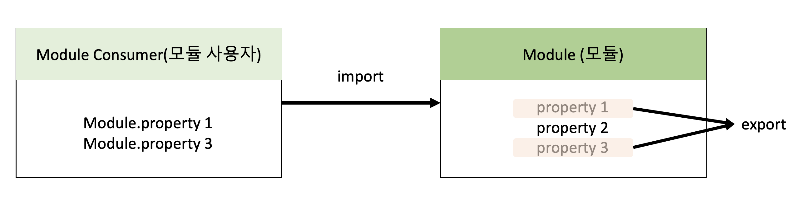

# 모던 자바스크립트 Deep Dive

## 목차

- [47장 에러처리](#47장-에러처리)
- [48장 모듈](#48장-모듈)

- <a href="https://github.com/junh0328/upgrade_javascript/blob/master/DEEPDIVE/readme7.md">🔙 이전 섹션으로</a>

## 47장 에러처리

### 47.1 에러 처리의 필요성

에러가 발생하지 않는 코드를 작성하는 것은 불가능하다고 볼 수 있다. 발생한 에러에 대해 대처하지 않고 방치한다면 프로그램을 강제 종료될 것이다.

```js
console.log("[Start]");

foo(); // ReferenceError: foo is not defined

console.log("[End]");
```

```
// 터미널 💻

[Start]
/Users/leejunhee/junheeDB/CaptainP/upgrade_javascript/DEEPDIVE/error.js:3
foo(); // ReferenceError: foo is not defined
^

ReferenceError: foo is not defined

[End] 는 빛을 보지 못하고 종료되었다...
```

try catch 문을 사용해 발생한 에러를 적절하게 대응하면 프로그래밍이 강제 종료되지 않고 계속해서 코드를 실행시킬 수 있다.

```js
console.log("[Start]");

try {
  foo();
} catch (error) {
  console.error("[에러 발생]", error);
  // [에러 발생] ReferenceError: foo is not defined
}

// 발생한 에러에 적절한 대응을 하면 프로그램이 강제 종료되지 않는다.
console.log("[End]");
```

```
[Start]
[에러 발생] ReferenceError: foo is not defined
    at Object.<anonymous> (/...파일이 실행된 상대 경로)
    at Module._compile (internal/modules/cjs/loader.js:1063:30)
    at Object.Module._extensions..js (internal/modules/cjs/loader.js:1092:10)
    at Module.load (internal/modules/cjs/loader.js:928:32)
    at Function.Module._load (internal/modules/cjs/loader.js:769:14)
    at Function.executeUserEntryPoint [as runMain] (internal/modules/run_main.js:72:12)
    at internal/main/run_main_module.js:17:47
[End]
```

직접적으로 에러를 발생하지 않는 예외적인 상황이 발생할 수도 있다. 예외적인 상황에 적절하게 대응하지 않으면 에러로 이어질 가능성이 크다.

```js
// DOM에 button 요소가 존재하지 않으면 querySelector 메서드는 에러를 발생시키지 않고 null을 반환한다.
const $button = document.querySelector("button"); // null

$button.classList.add("disabled");
// TypeError: Cannot read property 'classList' of null
```

단축 평가 또는 옵셔널 체이닝 연산자 (?.)를 사용하지 않으면 다음 처리에서 에러로 이어질 가능성이 크다.

```js
// DOM에 button 요소가 존재하는 경우 querySelector 메서드는 에러를 발생시키지 않고 null을 반환한다.
const $button = document.querySelector("button"); // null
$button?.classList.add("disabled");
```

따라서 우리가 작성한 코드에서는 언제나 에러나 예외적인 상황이 발생할 수 있다는 것을 전제하고 이에 대응하는 코드를 작성하는 것이 중요하다.

### 47.2 try catch finally

기본적으로 에러 처리를 구현하는 방법은 크게 두 가지가 있다.

① 예외적인 상황이 발생하면 반환하는 값(null 또는 -1)을 if문이나 단축 평가 또는 옵셔널 체이닝 연산자를 통해 확인해서 처리하는 방법
(에러 처리 코드를 등록해 두고 에러가 발생하면 에러 처리 코드로 점프하도록 하는 방법이다)

② try catch finally 문을 사용하는 방법
(일반적으로 이 방법을 에러 처리라고 한다.)

try catch finally 문은 다음과 같이 3개의 코드 블록으로 구성된다. finally 문은 불필요하다면 생략이 가능하다. catch 문도 생략 가능하지만 <b>catch 문이 없는 try 문은 의미가 없으므로 생략하지 않는다.</b>

```
try {
  // 실행할 코드
} catch (err) {
  // try 블록 내부에서 발생한 에러를 처리할 코드
} finally {
  // try catch 블록이 모두 완료된 후 실행할 코드
}
```

```js
console.log("[Start]");

try {
  foo();
} catch (err) {
  console.error(err); // ReferenceError: foo is not defined
} finally {
  console.log("finally");
}

console.log("[End]");
```

### 47.3 Error 객체

Error 생성자 함수는 에러 객체를 생성한다. Error 생성자 함수에는 에러를 상세히 설명하는 에러 메시지를 인수로 전달할 수 있다.

```js
const error = new Error("invalid");
```

자바스크립트는 Error 생성자 함수를 포함해 7가지의 에러 객체를 생성할 수 있는 Error 생성자 함수를 제공한다. 해당 함수가 생성한 에러 객체의 프로토타입은 모두 Error.prototype을 상속받는다.

| 생성자 함수    | 인스턴스                                                                       |
| :------------- | :----------------------------------------------------------------------------- |
| Error          | 일반적 에러 객체                                                               |
| SyntaxError    | 자바스크립트 문법에 맞지 않는 문을 해석할 때 발생하는 에러 객체                |
| ReferenceError | 참조할 수 없는 식별자를 참조했을 때 발생하는 에러 객체                         |
| TypeError      | 피연산자 또는 인수의 데이터 타입이 유효하지 않을 때 발생하는 에러 객체         |
| RangeError     | 숫자값의 허용 범위를 벗어낫을 때 발생하는 에러 객체                            |
| URIError       | encodeURI 또는 decodeURI 함수에 부적절한 인수를 전달했을 때 발생하는 에러 객체 |
| EvalError      | eval 함수에서 발생하는 에러 객체                                               |

```js
1 @ 1;    // SyntaxError: Invalid or unexpected token
foo();    // ReferenceError: foo is not defined
null.foo; // TypeError: Cannot read property 'foo' of null
new Array(-1); // RangeError: Invalid array length
decodeURIComponent('%'); // URIError: URI malformed
```

### 47.4 throw 문

Error 생성자 함수로 에러 객체를 생성한다고 에러가 발생하는 것은 아니다. 즉, 에러 객체 생성과 에러 발생은 의미가 다르다.

```js
try {
  // 에러 객체를 생성한다고 에러가 발생하는 것은 아니다.
  new Error("something wrong");
} catch (error) {
  console.log(error);
}
```

에러를 발생시키려면 try 코드 블록에서 throw 문으로 에러 객체를 던져야 한다.

```
throw 표현식;
```

throw 문의 표현식은 어떤 값이라도 상관없지만 일반적으로 에러 객체를 지정한다. 에러를 더닞면 catch 문의 에러 변수가 생성되고 던져진 에러 객체가 할당된다. 그리고 catch 코드 블록이 실행되기 시작한다.

```js
try {
  // 에러 객체를 던지면 catch 코드 블록이 실행되기 시작한다.
  throw new Error("something wrong");
} catch (error) {
  console.log(error);
}
```

## 48장 모듈

### 48.1 모듈의 일반적 의미

<b>모듈(module)이란 애플리케이션을 구성하는 개별적 요소로서 재사용 가능한 코드 조각</b>을 말한다.

일반적으로 모듈은 <b>기능을 기준으로 파일 단위로</b> 분리한다. 이때 모듈이 성립하려면 모듈은 자신만의 파일 스코프(모듈 스코프)를 가질 수 있어야 한다.

자신만의 파일 스코프를 갖는 모듈의 자산(모듈에 포함되어 있는 변수, 함수, 객체 등)은 기본적으로 <b>비공개 상태다.</b> 다시 말해, 자신만의 파일 스코프를 갖는 모듈의 모든 자산은 <b>캡슐화되어 다른 모듈에서 접근할 수 없다. 즉, 모듈은 개별적 존재로서 애플리케이션과 분리되어 존재한다.</b>

하지만 애플리캐이션과 완전히 분리되어 개별적으로 존재하는 모듈은 재사용이 불가능하므로 존재의 의미가 없다.

따라서 모듈은 <b>공개가 필요한 자산에 한정하여 명시적으로 선택적 공개가 가능하다. 이를 export라 한다.</b>

공개(export)의 자산은 다른 모듈에서 재사용할 수 있다. (의존성을 갖게 된다)

이때 <b>공개된 모듈의 자산을 사용하는 모듈을 모듈 사용자(module consumer)라 한다. 모듈 사용자는 모듈이 공개(export)한 자산 중 일부 또는 전체를 선택해 자신의 스코프 내로 불러들여 재사용할 수 있다. 이를 import라 한다.</b>



### 48.2 자바스크립트와 모듈

자바스크립트는 웹페이지의 단순한 보조 기능을 처리하기 위한 제한적인 용도를 목적으로 태어났다.

이러한 태생적 한계로 인해 다른 프로그래밍 언어와 비교할 때 부족한 부분이 있다. 대표적으로 모듈 시스템을 지원하지 않는다는 것이다.

다시 말해, <b>자바스크립트는 모듈이 성립하기 위해 필요한 파일 스코프와 import, export를 지원하지 않는다.</b>

또한 클라이언트 사이드인 자바스크립트는 script 태그를 사용하여 외부의 자바스크립트 파일을 로드할 수는 있지만 파일마다 독립적인 파일 스코프를 갖지 않는다.

다시 말해, 자바스크립트 파일을 여러 개의 파일로 분리하여 script 태그로 로드해도, 분리된 자바스크립트 파일들은 결국 하나의 자바스크립트 파일 내에 있는 것처럼 동작한다.

따라서 분리된 자바스크립트 파일들의 전역 변수가 중복되는 등의 문제가 발생할 수 있다.

자바스크립트를 클라이언트 사이드, 즉 브라우저 환경에 국한하지 않고 범용적으로 사용하려는 움직임이 생기면서 이러한 상황에 제안된 것이 CommonJS와 AMD(asynchronous module definition)다.

자바스크립트 런타임 환경인 Node.js는 모듈 시스템의 사실상 표준인 CommonJS를 채택했고 독자적인 진화를 거쳐, 현재는 CommonJS 사양과 100% 동일하지는 않지만 기본적으로 CommonJS 사양을 따르고 있다.

즉, Node.js는 ECMAScript 표준 사양은 아니지만 모듈 시스템을 지원한다. 따라서 Node.js 환경에서는 파일별로 독립적인 파일 스코프(모듈 스코프)를 갖는다.

### 48.3 ES6 모듈(ESM)

이러한 상황에서 ES6에서는 클라이언트 사이드 자바스크립트에서도 동작하는 모듈 기능을 추가했다.

ES6 모듈(이하 ESM 모듈)은 script 태그에 type="module" 어트리뷰트를 추가하면 로드된 자바스크립트 파일은 모듈로서 동작한다.

일반적인 자바스크립트 파일이 아닌 ESM임을 명확히 하기 위해 ESM의 파일 확장자는 mjs를 사용할 것을 권장한다.

```js
<script type="module" src="app.mjs"></script>
```

### 모듈 스코프

ESM은 독자적인 모듈 스코프를 갖는다. ESM이 아닌 일반적인 자바스크립트 파일은 script 태그로 분리해서 로드해도 독자적인 모듈 스코프를 갖지 않는다.

```js
// 📁 foo.js
// x 변수는 전역 변수다.
var x = "foo";
console.log(window.x); // foo
```

```js
// 📁 bar.js
// x 변수는 전역 변수다. foo.js에서 선언한 전역 변수 x와 중복된 선언이다.
var x = "bar";

// foo.js에서 선언한 전역 변수 x의 값이 재할당되었다.
console.log(window.x); // bar
```

```html
<!DOCTYPE html>
<html>
  <body>
    <script src="foo.js"></script>
    <script src="bar.js"></script>
  </body>
</html>
```

위 예제의 HTML에서 script 태그로 분리해서 로드된 2개의 자바스크립트 파일은 하나의 자바스크립트 파일 내에 있는 것처럼 동작한다.

즉, 하나의 전역을 공유한다. 따라서 x 변수는 중복 선언되며 의도치 않게 x 변수의 값이 덮어써진다.

ESM은 이러한 문제를 독자적인 모듈 스코프를 제공하기 때문에 해결할 수 있다.

```js
// 📁 foo.mjs
// x 변수는 전역 변수가 아니며 window 객체의 프로퍼티도 아니다.
var x = "foo";
console.log(x); // foo
console.log(window.x); // undefined
```

```js
// 📁 bar.mjs
// x 변수는 전역 변수가 아니며 window 객체의 프로퍼티도 아니다.
// foo.mjs에서 선언한 x 변수와 스코프가 다른 변수다.
var x = "bar";
console.log(x); // bar
console.log(window.x); // undefined
```

```html
<!DOCTYPE html>
<html>
  <body>
    <script type="module" src="foo.mjs"></script>
    <script type="module" src="bar.mjs"></script>
  </body>
</html>
```

모듈 내에 선언한 식별자는 모듈 외부에서 참조할 수 없다. 모듈 스코프가 다르기 때문이다.

### export

앞서 말했듯이 모듈을 외부에서 참조하지 못한다면, 즉 재사용가능하지 않다면 만들 필요가 없다.

따라서 필요한 자산들을 외부에서 참조할 수 있도록 export(공개) 키워드를 사용한다.

```js
// 📁 lib.mjs
// 변수의 공개
export const pi = Math.PI;

// 함수의 공개
export function square(x) {
  return x * x;
}

// 클래스의 공개
export class Person {
  constructor(name) {
    this.name = name;
  }
}
```

선언문 앞에 매번 export 키워드를 붙이는 것이 번거롭다면 export 할 대상을 하나의 객체로 구성하여 한 번에 export할 수도 있다.

```js
// 📁 lib.mjs
const pi = Math.PI;

function square(x) {
  return x * x;
}

class Person {
  constructor(name) {
    this.name = name;
  }
}

// 변수, 함수 클래스를 하나의 객체로 구성하여 공개
export { pi, square, Person };
```

### import

다른 모듈에서 공개(export)한 식별자를 자신의 모듈 스코프 내부로 로드하려면 import 키워드를 사용한다. 다른 모듈이 export한 식별자 이름으로 import해야 하며 <b>ESM의 경우 파일 확장자를 생략할 수 없다.</b>

```js
// 📁 app.mjs
// 같은 폴더 내의 lib.mjs 모듈이 export한 식별자 이름으로 import한다.
// ESM의 경우 파일 확장자를 생략할 수 없다.
import { pi, square, Person } from "./lib.mjs";

console.log(pi); // 3.141592653589793
console.log(square(10)); // 100
console.log(new Person("Lee")); // Person { name: 'Lee' }
```

모듈이 export한 식별자 이름을 일일이 지정하지 않고 하나의 이름으로 한 번에 import할 수도 있다.

<b>이때 import 되는 식별자는 as 뒤에 지정한 이름의 객체에 프로퍼티로 할당된다.</b>

```js
// 📁 app.mjs
import * as lib from "./lib.mjs";

console.log(lib.pi); // 3.141592653589793
console.log(lib.square(10)); // 100
console.log(new lib.Person("Lee")); // Person { name: 'Lee' }
```

모듈이 export한 식별자 이름을 변경하여 import 할 수도 있다.

```js
// 📁 app.mjs
import { pi as PI, square as sq, Person as P } from "./lib.mjs";

console.log(PI); // 3.141592653589793
console.log(sq(2)); // 4
console.log(new P("Kim")); // Person { name: 'Kim' }
```

모듈에서 하나의 값만 export한다면 default 키워드를 사용할 수 있다.

default 키워드와 함께 export한 모듈은 { } 중괄호 없이 임의의 이름으로 import할 수 있다.

```js
// 📁 app.mjs
import square from "./lib.mjs";

console.log(square(3)); // 9
```
